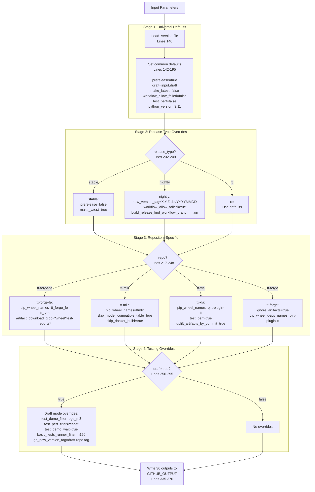
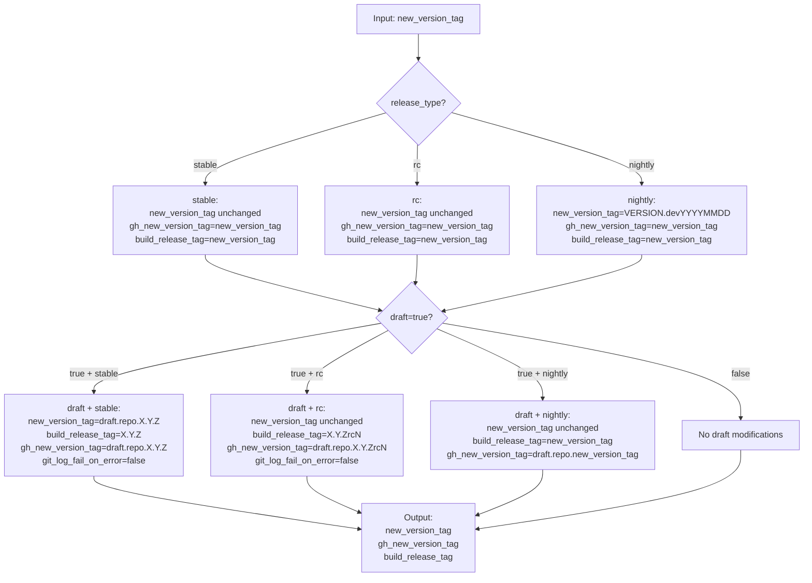
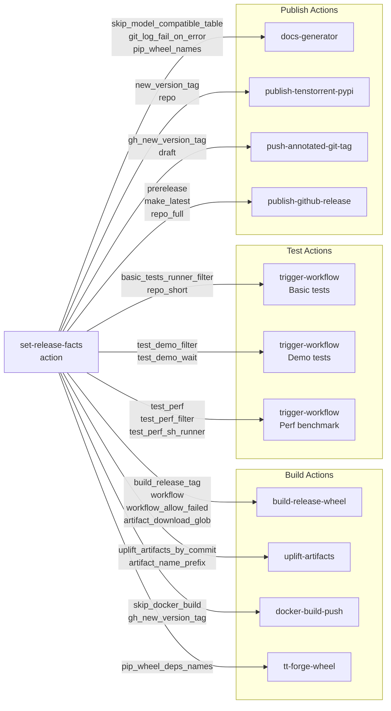

```mermaid
graph TB
    subgraph "release.yml Workflow"
        Start["Workflow Trigger<br/>inputs: repo, release_type,<br/>new_version_tag, branch"]
        GenSeed["generate-seed job<br/>Create random suffix"]
        
        subgraph "build-release job"
            SetFacts["set-release-facts action<br/>Lines 95-102"]
            CheckRelease["Check if release exists<br/>Lines 115-135"]
            BuildWheel["build-release-wheel<br/>Lines 138-151"]
            DockerBuild["docker-build-push<br/>Lines 172-183"]
        end
        
        subgraph "test-release job"
            SetFactsTest["set-release-facts action<br/>Lines 200-206"]
            TriggerBasic["Trigger basic tests<br/>Lines 208-219"]
            TriggerDemo["Trigger demo tests<br/>Lines 221-232"]
        end
        
        subgraph "publish-release job"
            SetFactsPub["set-release-facts action<br/>Lines 269-275"]
            GenDocs["docs-generator<br/>Lines 284-301"]
            PublishPyPI["publish-tenstorrent-pypi<br/>Lines 303-315"]
            PushTag["push-annotated-git-tag<br/>Lines 329-338"]
            PublishGH["publish-github-release<br/>Lines 340-352"]
        end
    end
    
    Start --> GenSeed
    GenSeed --> SetFacts
    SetFacts --> CheckRelease
    CheckRelease --> BuildWheel
    BuildWheel --> DockerBuild
    DockerBuild --> SetFactsTest
    SetFactsTest --> TriggerBasic
    SetFactsTest --> TriggerDemo
    TriggerBasic --> SetFactsPub
    TriggerDemo --> SetFactsPub
    SetFactsPub --> GenDocs
    GenDocs --> PublishPyPI
    PublishPyPI --> PushTag
    PushTag --> PublishGH
    
    SetFacts -.->|36 outputs| BuildWheel
    SetFacts -.->|36 outputs| DockerBuild
    SetFactsTest -.->|36 outputs| TriggerBasic
    SetFactsTest -.->|36 outputs| TriggerDemo
    SetFactsPub -.->|36 outputs| GenDocs
    SetFactsPub -.->|36 outputs| PublishPyPI
```

# set-release-facts Configuration System

Relevant source files
*   [.github/CODEOWNERS](https://github.com/tenstorrent/tt-forge/blob/6f2d9645/.github/CODEOWNERS)
*   [.github/actions/download-artifact/action.yaml](https://github.com/tenstorrent/tt-forge/blob/6f2d9645/.github/actions/download-artifact/action.yaml)
*   [.github/workflows/community-issue-tagging.yml](https://github.com/tenstorrent/tt-forge/blob/6f2d9645/.github/workflows/community-issue-tagging.yml)
*   [.github/workflows/download-artifact-test.yml](https://github.com/tenstorrent/tt-forge/blob/6f2d9645/.github/workflows/download-artifact-test.yml)
*   [.github/workflows/pr-main.yml](https://github.com/tenstorrent/tt-forge/blob/6f2d9645/.github/workflows/pr-main.yml)
*   [.github/workflows/schedule-uplift.yml](https://github.com/tenstorrent/tt-forge/blob/6f2d9645/.github/workflows/schedule-uplift.yml)

## Purpose and Scope

The `set-release-facts` action is the central configuration system for the TT-Forge release pipeline. It acts as a single source of truth that determines version tags, artifact patterns, test parameters, and repository-specific settings based on the release type (nightly, RC, stable) and target repository. This action is invoked at the beginning of every release workflow to establish the configuration context that governs all subsequent build, test, and publish steps.

For information about how these configuration facts are used in nightly builds, see [Nightly Release Process](https://deepwiki.com/tenstorrent/tt-forge/5.3.1-nightly-release-process). For RC and stable release workflows, see [Release Candidate and Stable Releases](https://deepwiki.com/tenstorrent/tt-forge/5.3.2-release-candidate-and-stable-releases). For the overall release orchestration, see [Daily Release Orchestration](https://deepwiki.com/tenstorrent/tt-forge/5.2-daily-release-orchestration).

**Sources:**[.github/actions/set-release-facts/action.yaml 1-371](https://github.com/tenstorrent/tt-forge/blob/6f2d9645/.github/actions/set-release-facts/action.yaml#L1-L371)

* * *

## Architecture and Integration

The `set-release-facts` action is positioned as the first critical step in the release workflow, establishing all configuration parameters before any build or test operations begin.

### Workflow Integration Diagram

The action is invoked three times within a single release workflow execution (once per job) to ensure consistent configuration across all stages. Each invocation receives the same inputs and produces identical outputs, providing a deterministic configuration layer.

**Sources:**[.github/workflows/release.yml 78-391](https://github.com/tenstorrent/tt-forge/blob/6f2d9645/.github/workflows/release.yml#L78-L391)[.github/actions/set-release-facts/action.yaml 1-131](https://github.com/tenstorrent/tt-forge/blob/6f2d9645/.github/actions/set-release-facts/action.yaml#L1-L131)

* * *




The action is invoked three times within a single release workflow execution (once per job) to ensure consistent configuration across all stages. Each invocation receives the same inputs and produces identical outputs, providing a deterministic configuration layer.
```
## Input Parameters

The action accepts six input parameters that define the release context:

| Parameter | Required | Default | Description |
| --- | --- | --- | --- |
| `repo` | No | - | Full repository name (e.g., `tenstorrent/tt-xla`) |
| `release_type` | No | - | One of: `nightly`, `rc`, `stable` |
| `draft` | No | - | Boolean flag for test/draft releases |
| `new_version_tag` | No | `''` | Version tag for the release (e.g., `0.1.0rc1`) |
| `branch` | No | `''` | Branch name to release from |
| `latest_branch_commit` | No | `''` | Git commit SHA of the latest branch commit |

The combination of `repo` and `release_type` determines the majority of configuration settings, while `draft` mode triggers special testing overrides.

**Sources:**[.github/actions/set-release-facts/action.yaml 4-25](https://github.com/tenstorrent/tt-forge/blob/6f2d9645/.github/actions/set-release-facts/action.yaml#L4-L25)

* * *

## Configuration Logic Flow

The action implements a three-stage configuration cascade: default settings, release type overrides, and repository-specific customization, followed by optional testing overrides.

### Logical Decision Flow

**Sources:**[.github/actions/set-release-facts/action.yaml 134-371](https://github.com/tenstorrent/tt-forge/blob/6f2d9645/.github/actions/set-release-facts/action.yaml#L134-L371)

* * *



## Repository-Specific Configuration

Each of the four release-enabled repositories has distinct configuration requirements. The action implements repository detection through string matching on the `repo` input parameter.

### tt-forge-fe Configuration

The `tt-forge-fe` repository produces two Python wheels (`tt_forge_fe` and `tt_tvm`) and includes test reports in its artifacts. The workflow name differs between nightly and RC/stable builds because nightly builds use the main branch "On push" workflow while RC/stable use the dedicated "On nightly" workflow.

### tt-mlir Configuration

The `tt-mlir` repository is unique in that it skips both Docker builds and model compatibility table generation. It produces a single wheel (`ttmlir`) and uses a scheduled nightly workflow.

### tt-xla Configuration

The `tt-xla` repository is the only one configured to run performance benchmarks (`test_perf="true"`). It also uses commit-based artifact uplifting, which allows the release system to retrieve artifacts from specific commits rather than workflow runs.

### tt-forge Meta-Package Configuration

The `tt-forge` meta-package repository has `ignore_artifacts="true"` because it doesn't produce artifacts from a build workflow—instead, it builds a wheel directly in the release workflow after waiting for its dependency `pjrt-plugin-tt` to be available on PyPI.

**Sources:**[.github/actions/set-release-facts/action.yaml 217-248](https://github.com/tenstorrent/tt-forge/blob/6f2d9645/.github/actions/set-release-facts/action.yaml#L217-L248)

* * *

## Version Tag Resolution

The action implements complex version tag logic to handle different release types and testing scenarios.

### Tag Logic Diagram



### Version Tag Variants

The action produces three distinct version tags with different purposes:

1.   **`new_version_tag`**: The full version string used for Python wheel versioning. For nightly builds, this includes the date suffix (e.g., `0.1.0.dev20240115`). For draft stable releases, this gets a `draft.{repo_short}.` prefix (e.g., `draft.tt-xla.0.1.0`).

2.   **`gh_new_version_tag`**: The tag used for GitHub releases. Always includes the `draft.{repo_short}.` prefix in draft mode to prevent collision with real releases.

3.   **`build_release_tag`**: A sanitized version tag used by the `build-release-wheel` action to locate build artifacts. For draft releases, this strips prefixes to match the actual build workflow's version (e.g., extracts `0.1.0` from `draft.tt-xla.0.1.0`).

### Tag Sanitization for Draft Releases

Draft releases require special tag handling to prevent overwriting production releases while still being able to locate build artifacts:

The regex extraction ensures that `build_release_tag` contains only the semantic version part, which matches the tag created by the actual build workflow.

**Sources:**[.github/actions/set-release-facts/action.yaml 198-295](https://github.com/tenstorrent/tt-forge/blob/6f2d9645/.github/actions/set-release-facts/action.yaml#L198-L295)

* * *

## Testing Overrides for Draft Mode

Draft mode (`draft: true`) activates a comprehensive set of testing overrides designed to reduce CI resource consumption during integration testing:

| Setting | Production Value | Draft Mode Value | Purpose |
| --- | --- | --- | --- |
| `test_demo_filter` | `""` (all tests) | `"bge_m3"` | Run only one demo test |
| `test_perf_filter` | `""` (all tests) | `"resnet"` | Run only one perf test |
| `test_demo_wait` | `false` | `true` | Block until demo test completes |
| `basic_tests_runner_filter` | `"All"` | `"tt-ubuntu-2204-n150-stable"` | Use only n150 runners |
| `build_release_latest_branch_commit` | Input value | `""` | Clear commit to use branch-based artifact lookup |
| `build_release_find_workflow_branch` | Input branch | `"main"` | Force artifact search on main branch |

These overrides ensure that draft releases execute quickly while still validating the end-to-end release pipeline. The single-test filters reduce execution time from 30-60 minutes to under 10 minutes.

**Sources:**[.github/actions/set-release-facts/action.yaml 256-295](https://github.com/tenstorrent/tt-forge/blob/6f2d9645/.github/actions/set-release-facts/action.yaml#L256-L295)

* * *

## Output Parameters

The action produces 36 output parameters that control every aspect of the release workflow:

### Version and Tag Outputs

| Output | Example Value | Usage |
| --- | --- | --- |
| `new_version_tag` | `0.1.0` or `0.1.0.dev20240115` | Python wheel version |
| `gh_new_version_tag` | `0.1.0` or `draft.tt-xla.0.1.0` | GitHub release tag |
| `build_release_tag` | `0.1.0` | Artifact lookup tag |
| `major_version` | `0` | Major version number |
| `minor_version` | `1` | Minor version number |

### Repository Identification Outputs

| Output | Example Value | Usage |
| --- | --- | --- |
| `repo` | `tenstorrent/tt-xla` | Full repository name |
| `repo_short` | `tt-xla` | Repository name without owner |
| `repo_full` | `tenstorrent/tt-xla` | Same as `repo` |
| `all_repos` | `tenstorrent/tt-forge-fe tenstorrent/tt-mlir ...` | List of all release-enabled repos |

### Build Configuration Outputs

| Output | Example Value | Usage |
| --- | --- | --- |
| `workflow` | `"On nightly"` | Build workflow name to search |
| `artifact_download_glob` | `*{xla-whl-release,test-reports}*` | Pattern for artifact download |
| `artifact_cleanup_file_glob` | `*{.json,benchmark_}*` | Files to remove from artifacts |
| `artifact_name_prefix` | `"xla-whl-release"` | Prefix for artifact names |
| `pip_wheel_names` | `"pjrt-plugin-tt"` | Names of wheels to publish |
| `pip_wheel_deps_names` | `"pjrt-plugin-tt"` | Dependency wheel names |
| `python_version` | `"3.11"` | Python version for builds |

### Build Artifact Discovery Outputs

| Output | Example Value | Usage |
| --- | --- | --- |
| `build_release_find_workflow_branch` | `"main"` | Branch to search for build workflows |
| `build_release_latest_branch_commit` | `abc123def456...` | Commit SHA to find artifacts |
| `workflow_allow_failed` | `"true"` | Allow failed workflow runs |
| `workflow_result_in_job` | `"fail-notify"` | Job containing workflow result |
| `uplift_artifacts_by_commit` | `"true"` | Use commit-based artifact retrieval |

### Release Metadata Outputs

| Output | Example Value | Usage |
| --- | --- | --- |
| `prerelease` | `"true"` | Mark as GitHub pre-release |
| `draft` | `"false"` | Mark as GitHub draft release |
| `make_latest` | `"true"` | Mark as latest release |
| `ignore_artifacts` | `"false"` | Skip artifact processing |

### Test Configuration Outputs

| Output | Example Value | Usage |
| --- | --- | --- |
| `test_demo_filter` | `""` or `"bge_m3"` | Filter for demo tests |
| `test_demo_wait` | `"false"` | Wait for demo completion |
| `test_perf` | `"true"` | Enable performance tests |
| `test_perf_filter` | `""` or `"resnet"` | Filter for perf tests |
| `test_perf_sh_runner` | `"false"` | Use shared CIv2 runner |
| `basic_tests_runner_filter` | `"All"` | Filter for test runners |

### Documentation and Build Skip Outputs

| Output | Example Value | Usage |
| --- | --- | --- |
| `skip_model_compatible_table` | `"false"` | Skip model table generation |
| `skip_docker_build` | `"false"` | Skip Docker build steps |
| `git_log_fail_on_error` | `"true"` | Fail on git log errors |

**Sources:**[.github/actions/set-release-facts/action.yaml 27-130](https://github.com/tenstorrent/tt-forge/blob/6f2d9645/.github/actions/set-release-facts/action.yaml#L27-L130)[.github/actions/set-release-facts/action.yaml 335-370](https://github.com/tenstorrent/tt-forge/blob/6f2d9645/.github/actions/set-release-facts/action.yaml#L335-L370)

* * *

## Configuration Data Flow

The following diagram shows how configuration values flow from the action to various downstream components:

### Component Association Diagram

**Sources:**[.github/workflows/release.yml 95-352](https://github.com/tenstorrent/tt-forge/blob/6f2d9645/.github/workflows/release.yml#L95-L352)[.github/actions/set-release-facts/action.yaml 27-130](https://github.com/tenstorrent/tt-forge/blob/6f2d9645/.github/actions/set-release-facts/action.yaml#L27-L130)

* * *



## Usage in Release Workflow

The release workflow invokes `set-release-facts` three times—once at the beginning of each major job:

### Invocation in build-release Job

The outputs are immediately used to determine whether to skip the build (if release already exists) and configure build parameters:

### Invocation in test-release Job

Test triggers use the outputs to configure which tests run and how:

### Invocation in publish-release Job

Publication steps use outputs to control what gets published and how:

**Sources:**[.github/workflows/release.yml 95-102](https://github.com/tenstorrent/tt-forge/blob/6f2d9645/.github/workflows/release.yml#L95-L102)[.github/workflows/release.yml 138-151](https://github.com/tenstorrent/tt-forge/blob/6f2d9645/.github/workflows/release.yml#L138-L151)[.github/workflows/release.yml 200-219](https://github.com/tenstorrent/tt-forge/blob/6f2d9645/.github/workflows/release.yml#L200-L219)[.github/workflows/release.yml 269-301](https://github.com/tenstorrent/tt-forge/blob/6f2d9645/.github/workflows/release.yml#L269-L301)

* * *

## Implementation Details

### .version File Loading

The action sources version information from the `.version` file at the repository root:

This file defines environment variables `$MAJOR`, `$MINOR`, and `$PATCH` that are used to construct version tags:

For nightly releases, the base version from `.version` is combined with a date suffix:

Where `$VERSION` is constructed from `$MAJOR.$MINOR.$PATCH` in the `.version` file.

### Repository Detection

The action uses bash regex matching to detect the target repository:

The regex operator `=~` allows partial matching, so `tenstorrent/tt-xla` matches the pattern `"tt-xla"`.

### Output Writing

All outputs are written to both stdout (for debugging) and `$GITHUB_OUTPUT` (for consumption by downstream steps):

The double-write pattern ensures visibility in GitHub Actions logs while maintaining compatibility with the GitHub Actions output mechanism.

**Sources:**[.github/actions/set-release-facts/action.yaml 136-371](https://github.com/tenstorrent/tt-forge/blob/6f2d9645/.github/actions/set-release-facts/action.yaml#L136-L371)

Dismiss
Refresh this wiki

Enter email to refresh
