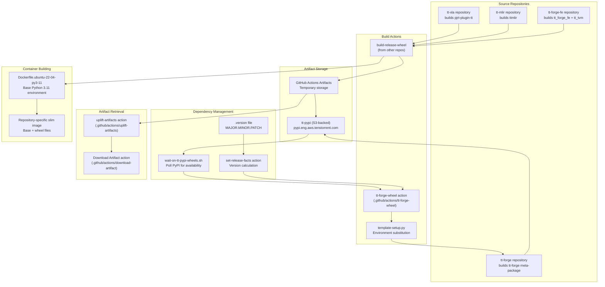
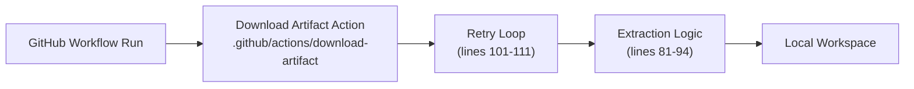

# Build System

Relevant source files
*   [.github/CODEOWNERS](https://github.com/tenstorrent/tt-forge/blob/6f2d9645/.github/CODEOWNERS)
*   [.github/actions/download-artifact/action.yaml](https://github.com/tenstorrent/tt-forge/blob/6f2d9645/.github/actions/download-artifact/action.yaml)
*   [.github/workflows/community-issue-tagging.yml](https://github.com/tenstorrent/tt-forge/blob/6f2d9645/.github/workflows/community-issue-tagging.yml)
*   [.github/workflows/download-artifact-test.yml](https://github.com/tenstorrent/tt-forge/blob/6f2d9645/.github/workflows/download-artifact-test.yml)
*   [.github/workflows/pr-main.yml](https://github.com/tenstorrent/tt-forge/blob/6f2d9645/.github/workflows/pr-main.yml)
*   [.github/workflows/schedule-uplift.yml](https://github.com/tenstorrent/tt-forge/blob/6f2d9645/.github/workflows/schedule-uplift.yml)

## Purpose and Scope

The Build System encompasses all processes for creating distributable artifacts from the TT-Forge codebase and its dependencies. This includes Python wheel packages, Docker container images, and the mechanisms for managing cross-repository dependencies. The system handles version coordination, artifact retrieval from upstream repositories, and packaging of the final release artifacts.

For information about the release workflow orchestration that invokes these build processes, see [Release Workflows](https://deepwiki.com/tenstorrent/tt-forge/5.3-release-workflows). For details on publishing the built artifacts, see [Documentation Generation](https://deepwiki.com/tenstorrent/tt-forge/5.5-documentation-generation).

## Architecture Overview

The build system operates across multiple repositories (tt-xla, tt-mlir, tt-forge-fe, tt-forge) with complex dependency relationships. The core challenge is that `tt-forge` is a meta-package that depends on wheels built by other repositories, requiring synchronization mechanisms to ensure all dependencies are available before building.

**Sources:**[.github/actions/download-artifact/action.yaml 1-119](https://github.com/tenstorrent/tt-forge/blob/6f2d9645/.github/actions/download-artifact/action.yaml#L1-L119)[.github/actions/uplift-artifacts/action.yml 1-98](https://github.com/tenstorrent/tt-forge/blob/6f2d9645/.github/actions/uplift-artifacts/action.yml#L1-L98)[.github/scripts/wait-on-tt-pypi-wheels.sh 1-42](https://github.com/tenstorrent/tt-forge/blob/6f2d9645/.github/scripts/wait-on-tt-pypi-wheels.sh#L1-L42)



## Python Wheel Building

The `tt-forge` repository produces a meta-package wheel that declares dependencies on wheels built by other repositories. Unlike the dependency repositories which contain actual source code to compile, `tt-forge` uses a template-based approach to generate a minimal `setup.py` with dynamic dependencies.

The meta-package depends on `pjrt-plugin-tt` from the tt-xla repository, specified as a direct URL dependency to a specific wheel file on the internal PyPI server. The build process uses environment variable substitution to generate `setup.py` from a template, where `${NEW_VERSION_TAG}` and `${PJRT_PLUGIN_TT_TAG}` placeholders are replaced.

For details, see [Python Wheel Building](https://deepwiki.com/tenstorrent/tt-forge/5.4.1-python-wheel-building).

**Sources:**[.github/actions/tt-forge-wheel/action.yml 33-81](https://github.com/tenstorrent/tt-forge/blob/6f2d9645/.github/actions/tt-forge-wheel/action.yml#L33-L81)[.github/scripts/template-setup.py 1-16](https://github.com/tenstorrent/tt-forge/blob/6f2d9645/.github/scripts/template-setup.py#L1-L16)

## Dependency Synchronization

### PyPI Polling Mechanism

The `wait-on-tt-pypi-wheels.sh` script implements a polling loop to ensure all required dependency wheels are available on the internal PyPI server before building the meta-package. It checks the Tenstorrent internal index (`https://pypi.eng.aws.tenstorrent.com/`) for specific version tags.

[.github/scripts/wait-on-tt-pypi-wheels.sh 1-42](https://github.com/tenstorrent/tt-forge/blob/6f2d9645/.github/scripts/wait-on-tt-pypi-wheels.sh#L1-L42)

### Submodule Management

The build system also manages source-level dependencies through Git submodules. For example, `tt-forge-models` is uplifted weekly to the latest version via an automated workflow that creates pull requests with updated commit SHAs.

[.github/workflows/schedule-uplift.yml 1-92](https://github.com/tenstorrent/tt-forge/blob/6f2d9645/.github/workflows/schedule-uplift.yml#L1-L92)

**Sources:**[.github/scripts/wait-on-tt-pypi-wheels.sh 1-42](https://github.com/tenstorrent/tt-forge/blob/6f2d9645/.github/scripts/wait-on-tt-pypi-wheels.sh#L1-L42)[.github/workflows/schedule-uplift.yml 1-92](https://github.com/tenstorrent/tt-forge/blob/6f2d9645/.github/workflows/schedule-uplift.yml#L1-L92)

## Artifact Management

The system utilizes a custom `Download Artifact` action to retrieve files from GitHub workflow runs. This action includes retry logic, path validation, and automatic extraction of various archive formats including `tar`, `tar.gz`, and `tar.zst` using `zstd`.

For details, see [Artifact Management](https://deepwiki.com/tenstorrent/tt-forge/5.4.2-artifact-management).

**Sources:**[.github/actions/download-artifact/action.yaml 1-119](https://github.com/tenstorrent/tt-forge/blob/6f2d9645/.github/actions/download-artifact/action.yaml#L1-L119)[.github/workflows/download-artifact-test.yml 1-138](https://github.com/tenstorrent/tt-forge/blob/6f2d9645/.github/workflows/download-artifact-test.yml#L1-L138)




For details, see [Artifact Management](#5.4.2).
```
## Docker Image Building

The base Docker image provides a Python 3.11 environment on Ubuntu 22.04 with all necessary system dependencies. This includes build tools, `pyenv` for Python version management, and MPI libraries for distributed computing. The build process uses multi-stage or repository-specific logic to copy built wheels into these base environments to create "slim" runtime images.

For details, see [Docker Image Building](https://deepwiki.com/tenstorrent/tt-forge/5.4.3-docker-image-building).

**Sources:**[.github/Dockerfile.ubuntu-22-04-py3-11 1-60](https://github.com/tenstorrent/tt-forge/blob/6f2d9645/.github/Dockerfile.ubuntu-22-04-py3-11#L1-L60)

## Version Management

The `.version` file defines the base version components (MAJOR, MINOR, PATCH). This file serves as the source of truth for the version numbers. The release workflow reads these values and constructs different version strings based on release type (e.g., nightly dev tags or release candidates).

**Sources:**[.version 1-5](https://github.com/tenstorrent/tt-forge/blob/6f2d9645/.version#L1-L5)

Dismiss
Refresh this wiki

Enter email to refresh
