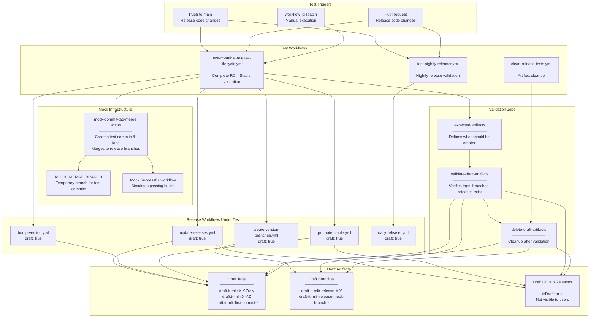
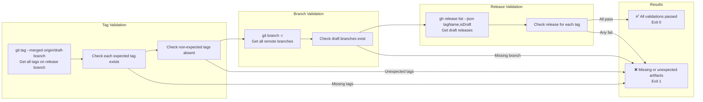
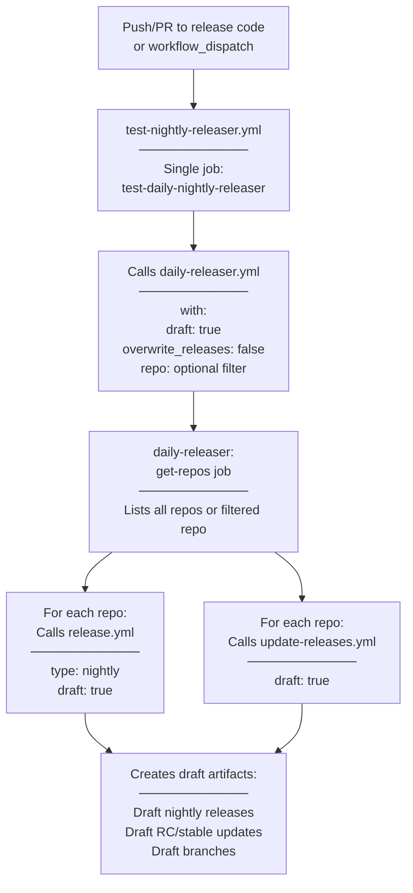

# Release Testing and Validation

Relevant source files
*   [.github/CODEOWNERS](https://github.com/tenstorrent/tt-forge/blob/6f2d9645/.github/CODEOWNERS)
*   [.github/workflows/basic-tests.yml](https://github.com/tenstorrent/tt-forge/blob/6f2d9645/.github/workflows/basic-tests.yml)
*   [.github/workflows/demo-tests.yml](https://github.com/tenstorrent/tt-forge/blob/6f2d9645/.github/workflows/demo-tests.yml)
*   [.github/workflows/models-matrix.json](https://github.com/tenstorrent/tt-forge/blob/6f2d9645/.github/workflows/models-matrix.json)
*   [.github/workflows/pr-main.yml](https://github.com/tenstorrent/tt-forge/blob/6f2d9645/.github/workflows/pr-main.yml)
*   [.github/workflows/schedule-uplift.yml](https://github.com/tenstorrent/tt-forge/blob/6f2d9645/.github/workflows/schedule-uplift.yml)
*   [demos/tt-forge-onnx/README.md](https://github.com/tenstorrent/tt-forge/blob/6f2d9645/demos/tt-forge-onnx/README.md?plain=1)

## Purpose and Scope

This document describes the testing infrastructure that validates the TT-Forge release automation system itself. Unlike the functional testing covered in [Testing Infrastructure](https://deepwiki.com/tenstorrent/tt-forge/4-testing-infrastructure) or performance validation in [Benchmarking System](https://deepwiki.com/tenstorrent/tt-forge/3-benchmarking-system), this system performs meta-testing of the CI/CD pipeline to ensure release workflows behave correctly before they execute on production branches.

The release testing system validates:

*   RC and stable release lifecycle workflows
*   Nightly release automation
*   Version bumping and promotion logic
*   Artifact creation and tagging
*   Multi-repository coordination

For information about the actual release workflows being tested, see [Release Workflows](https://deepwiki.com/tenstorrent/tt-forge/5.3-release-workflows). For release version progression, see [Release Lifecycle and Versioning](https://deepwiki.com/tenstorrent/tt-forge/5.1-release-lifecycle-and-versioning).

* * *

## Release Testing Architecture

The release testing system operates in **draft mode**, creating temporary branches, tags, and releases prefixed with `draft.` to validate release workflows without polluting production artifacts. Tests execute on every change to release infrastructure code and validate the complete release lifecycle from RC creation through stable promotion.

### System Components

**Sources:**`.github/workflows/test-rc-stable-release-lifecycle.yml`, `.github/workflows/test-nightly-releaser.yml`, `.github/workflows/clean-release-tests.yml`

* * *



## RC/Stable Lifecycle Testing

The `test-rc-stable-release-lifecycle.yml` workflow validates the complete release lifecycle from initial RC creation through patch releases. It simulates real-world scenarios by creating mock commits with tags and merging them to release branches, then verifying that the release automation responds correctly.

### Test Workflow Sequence

**Sources:**`.github/workflows/test-rc-stable-release-lifecycle.yml`



```mermaid
graph TB
    Start["Test Trigger<br/>Push or PR to release code"]
    
    GetRepos["get-repos job<br/>────────────<br/>Identifies tt-mlir for testing"]
    
    ExpectedArtifacts["expected-artifacts job<br/>────────────<br/>Defines expected tags:<br/>- draft.tt-mlir.X.Y.0rc1/rc2/rc3<br/>- draft.tt-mlir.X.Y.0/1/2<br/>- draft.tt-mlir.first-commit-*<br/>- draft.tt-mlir.second-commit-*"]
    
    MockWorkflow1["mock-successful-workflow-pre-release-branch<br/>────────────<br/>Trigger Mock Successful workflow<br/>Get run_head_sha"]
    
    CreateBranch["create-version-branch job<br/>────────────<br/>Calls create-version-branches.yml<br/>draft: true<br/>Creates draft-tt-mlir-release-X.Y"]
    
    GetBranches["get-release-branches job<br/>────────────<br/>Finds draft release branches<br/>ignore_update_check: true"]
    
    subgraph "RC Creation Phase"
        FirstRC["first-commit-successful-pre-release-branch<br/>────────────<br/>mock-commit-tag-merge action<br/>Tag: FIRST_COMMIT_PRE_RELEASE_TAG<br/>Merge to release branch"]
        
        ReleaseRC1["release-rc-first-commit-observed<br/>────────────<br/>Calls update-releases.yml<br/>Creates draft.tt-mlir.X.Y.0rc1"]
    end
    
    subgraph "RC Bump Phase"
        SecondRC["second-commit-successful-pre-release-branch<br/>────────────<br/>mock-commit-tag-merge action<br/>Tag: SECOND_COMMIT_PRE_RELEASE_TAG<br/>Merge to release branch"]
        
        BumpRC["bump-rc-version-observed<br/>────────────<br/>Calls bump-version.yml<br/>Creates draft.tt-mlir.X.Y.0rc2"]
    end
    
    subgraph "Stable Promotion Phase"
        PromoteStable["promote-stable job<br/>────────────<br/>Calls promote-stable.yml<br/>Creates draft.tt-mlir.X.Y.0"]
    end
    
    subgraph "Patch Release Phase"
        FirstStable["first-commit-successful-stable-branch<br/>────────────<br/>mock-commit-tag-merge action<br/>Tag: FIRST_COMMIT_STABLE_TAG"]
        
        ReleaseStable1["release-stable-first-commit-observed<br/>────────────<br/>Calls update-releases.yml<br/>Creates draft.tt-mlir.X.Y.1"]
        
        SecondStable["second-commit-successful-stable-branch<br/>────────────<br/>mock-commit-tag-merge action<br/>Tag: SECOND_COMMIT_STABLE_TAG"]
        
        BumpStable["bump-stable-version-observed<br/>────────────<br/>Calls bump-version.yml<br/>Creates draft.tt-mlir.X.Y.2"]
    end
    
    subgraph "Validation Phase"
        ValidateTags["validate-draft-artifacts job<br/>────────────<br/>Verify all expected tags exist<br/>Verify non-expected tags absent<br/>Verify draft branches exist<br/>Verify draft releases exist"]
        
        DeleteArtifacts["delete-draft-artifacts job<br/>────────────<br/>Delete draft tags<br/>Delete draft branches<br/>Delete draft releases"]
    end
    
    Start --> GetRepos
    GetRepos --> ExpectedArtifacts
    GetRepos --> MockWorkflow1
    
    MockWorkflow1 --> CreateBranch
    CreateBranch --> GetBranches
    
    GetBranches --> FirstRC
    FirstRC --> ReleaseRC1
    
    ReleaseRC1 --> SecondRC
    SecondRC --> BumpRC
    
    BumpRC --> PromoteStable
    
    PromoteStable --> FirstStable
    FirstStable --> ReleaseStable1
    
    ReleaseStable1 --> SecondStable
    SecondStable --> BumpStable
    
    BumpStable --> ValidateTags
    ExpectedArtifacts --> ValidateTags
    
    ValidateTags --> DeleteArtifacts
```

### Mock Commit and Tag System

The `mock-commit-tag-merge` action simulates developer commits being merged to release branches. This allows testing of the release automation's trigger logic without requiring actual code changes.

**Action Functionality:**

*   Creates a new commit on a temporary branch (`MOCK_MERGE_BRANCH`)
*   Tags the commit with a test tag (e.g., `draft.tt-mlir.first-commit-pre-release-X`)
*   Merges the commit to the target release branch
*   Uses GPG signing to match production behavior

**Key Environment Variables:**

```
FIRST_COMMIT_PRE_RELEASE_TAG="draft.tt-mlir.first-commit-pre-release-${RUN_ID}-${RUN_ATTEMPT}"
SECOND_COMMIT_PRE_RELEASE_TAG="draft.tt-mlir.second-commit-pre-release-${RUN_ID}-${RUN_ATTEMPT}"
FIRST_COMMIT_STABLE_TAG="draft.tt-mlir.first-commit-stable-${RUN_ID}-${RUN_ATTEMPT}"
SECOND_COMMIT_STABLE_TAG="draft.tt-mlir.second-commit-stable-${RUN_ID}-${RUN_ATTEMPT}"
MOCK_MERGE_BRANCH="draft-tt-mlir-release-mock-branch-${RUN_ID}-${RUN_ATTEMPT}"
```

**Sources:**`.github/workflows/test-rc-stable-release-lifecycle.yml`

### Expected Artifacts Definition

The `expected-artifacts` job defines the complete set of tags, branches, and releases that should be created during a successful release lifecycle test. This serves as the ground truth for validation.

| Artifact Type | Expected Items | Purpose |
| --- | --- | --- |
| **Mock Merge Tags** | `draft.tt-mlir.first-commit-pre-release-*` `draft.tt-mlir.second-commit-pre-release-*` `draft.tt-mlir.first-commit-stable-*` `draft.tt-mlir.second-commit-stable-*` | Simulate tagged commits merged to release branches |
| **Release Tags** | `draft.tt-mlir.X.Y.0rc1` `draft.tt-mlir.X.Y.0rc2` `draft.tt-mlir.X.Y.0rc3` `draft.tt-mlir.X.Y.0` `draft.tt-mlir.X.Y.1` `draft.tt-mlir.X.Y.2` | Actual release version tags created by automation |
| **Branches** | `draft-tt-mlir-release-X.Y` `draft-tt-mlir-release-mock-branch-*` | Release branch and temporary merge branch |
| **GitHub Releases** | Draft releases for each release tag | Published releases with `isDraft: true` |
| **Non-Expected Tags** | `draft.tt-mlir.X.Y.0rc4` | Should NOT be created (validates version logic) |

**Sources:**`.github/workflows/test-rc-stable-release-lifecycle.yml`

* * *

## Validation Criteria

The `validate-draft-artifacts` job performs comprehensive verification that all expected artifacts were created correctly and no unexpected artifacts exist.

### Validation Steps

**Sources:**`.github/workflows/test-rc-stable-release-lifecycle.yml`

* * *



## Nightly Release Testing

The `test-nightly-releaser.yml` workflow validates the nightly release automation by invoking `daily-releaser.yml` in draft mode. This tests the orchestration logic that coordinates releases across multiple repositories.

### Test Execution

**Sources:**`.github/workflows/test-nightly-releaser.yml`

* * *



## Artifact Cleanup

The release testing system includes comprehensive cleanup to prevent accumulation of test artifacts. Cleanup runs automatically after tests complete and can be triggered manually or on a schedule.

### Cleanup Workflow

The `clean-release-tests.yml` workflow handles automated cleanup:

`on:  workflow_call:           # Can be called by other workflows  workflow_dispatch:       # Manual trigger  workflow_run:            # Triggers after Daily Releaser completes    workflows:      - "Daily Releaser"    types:      - completed`
**Cleanup Actions:**

1.   **Delete Draft Releases** - Removes all draft GitHub releases.
2.   **Delete Docker Images** - Removes draft container images matching `draft.tt-*.dev*` pattern.

**Sources:**`.github/workflows/clean-release-tests.yml`

* * *

## Integration with Functional Testing

While the release lifecycle tests validate the _process_, functional tests are integrated into the release pipeline to validate the _content_ of the release artifacts.

### Basic and Demo Tests

The release process triggers `basic-tests.yml`[basic-tests.yml 1-154](https://github.com/tenstorrent/tt-forge/blob/6f2d9645/basic-tests.yml#L1-L154) and `demo-tests.yml`[demo-tests.yml 1-212](https://github.com/tenstorrent/tt-forge/blob/6f2d9645/demo-tests.yml#L1-L212) to ensure that the produced Docker images and wheels are functional on supported hardware.

*   **Basic Tests**: Quick validation of frontend smoke tests [basic-tests.yml 144-153](https://github.com/tenstorrent/tt-forge/blob/6f2d9645/basic-tests.yml#L144-L153)
*   **Demo Tests**: Comprehensive real-world model demonstrations across a matrix of projects (tt-forge-onnx, tt-torch, tt-xla) [demo-tests.yml 17-26](https://github.com/tenstorrent/tt-forge/blob/6f2d9645/demo-tests.yml#L17-L26)
*   **Hardware Matrix**: Tests are executed on specific hardware runners like `n150` and `p150`[models-matrix.json 5](https://github.com/tenstorrent/tt-forge/blob/6f2d9645/models-matrix.json#L5-L5)

**Sources:**`.github/workflows/basic-tests.yml`, `.github/workflows/demo-tests.yml`, `.github/workflows/models-matrix.json`

* * *

## Release Existence Check

The `check_release.sh` script provides a simple utility to verify if a release exists for a given tag. This script is used by release workflows to determine whether to skip release creation when `overwrite_releases: false`.

**Sources:**`.github/scripts/check_release.sh`

Dismiss
Refresh this wiki

Enter email to refresh
