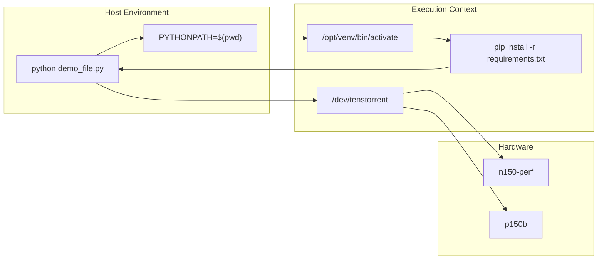
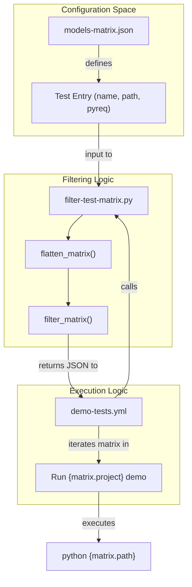

# Running Benchmarks

Relevant source files
*   [.github/workflows/basic-tests.yml](https://github.com/tenstorrent/tt-forge/blob/6f2d9645/.github/workflows/basic-tests.yml)
*   [.github/workflows/demo-tests.yml](https://github.com/tenstorrent/tt-forge/blob/6f2d9645/.github/workflows/demo-tests.yml)
*   [.github/workflows/filter-test-matrix.py](https://github.com/tenstorrent/tt-forge/blob/6f2d9645/.github/workflows/filter-test-matrix.py)
*   [.github/workflows/models-matrix.json](https://github.com/tenstorrent/tt-forge/blob/6f2d9645/.github/workflows/models-matrix.json)
*   [demos/tt-forge-onnx/README.md](https://github.com/tenstorrent/tt-forge/blob/6f2d9645/demos/tt-forge-onnx/README.md?plain=1)

This document provides practical instructions for executing benchmarks locally on Tenstorrent hardware. It covers the command-line interfaces, configuration parameters, and result interpretation for the `tt-xla`, `tt-forge-fe`, and `tt-torch` benchmark suites.

## Overview

The TT-Forge repository contains a comprehensive benchmarking infrastructure designed to validate model performance on Tenstorrent hardware [3. Benchmarking System](https://github.com/tenstorrent/tt-forge/blob/6f2d9645/3.%20Benchmarking%20System) The system supports several frontends:

1.   **tt-xla benchmarks** - Test models using the torch-xla/JAX frontend with XLA compilation to Tenstorrent hardware [.github/workflows/models-matrix.json 17-34](https://github.com/tenstorrent/tt-forge/blob/6f2d9645/.github/workflows/models-matrix.json#L17-L34)
2.   **tt-forge-fe benchmarks** - Test models using the TVM-based `forge.compile` frontend [.github/workflows/demo-tests.yml 25-26](https://github.com/tenstorrent/tt-forge/blob/6f2d9645/.github/workflows/demo-tests.yml#L25-L26)
3.   **tt-torch benchmarks** - Test models using the direct PyTorch frontend [.github/workflows/models-matrix.json 36-44](https://github.com/tenstorrent/tt-forge/blob/6f2d9645/.github/workflows/models-matrix.json#L36-L44)

Benchmarks measure throughput (samples per second), latency, and model accuracy or numerical correctness (PCC) [.github/workflows/demo-tests.yml 114-132](https://github.com/tenstorrent/tt-forge/blob/6f2d9645/.github/workflows/demo-tests.yml#L114-L132)

* * *

## Prerequisites

Before running benchmarks, ensure the following requirements are met:

**Hardware Access:**

*   Physical Tenstorrent device (e.g., N150, P150, N300) mounted at `/dev/tenstorrent`[.github/workflows/demo-tests.yml 94-97](https://github.com/tenstorrent/tt-forge/blob/6f2d9645/.github/workflows/demo-tests.yml#L94-L97)
*   Hugepages configured on the host system [.github/workflows/demo-tests.yml 99-100](https://github.com/tenstorrent/tt-forge/blob/6f2d9645/.github/workflows/demo-tests.yml#L99-L100)

**Software Installation:**

*   Python environment with the appropriate frontend packages installed.
*   Required Python dependencies (specified in `models-matrix.json` for specific tests) [.github/workflows/models-matrix.json 38-42](https://github.com/tenstorrent/tt-forge/blob/6f2d9645/.github/workflows/models-matrix.json#L38-L42)
*   Docker environment (recommended) using the provided slim images [.github/workflows/demo-tests.yml 7-11](https://github.com/tenstorrent/tt-forge/blob/6f2d9645/.github/workflows/demo-tests.yml#L7-L11)

**Environment Setup:**

`# Verify device accessibilityls -l /dev/tenstorrent # Set up PYTHONPATH to include repository rootexport PYTHONPATH=$(pwd)`
**Sources:**[.github/workflows/demo-tests.yml 7-11](https://github.com/tenstorrent/tt-forge/blob/6f2d9645/.github/workflows/demo-tests.yml#L7-L11)[.github/workflows/demo-tests.yml 94-104](https://github.com/tenstorrent/tt-forge/blob/6f2d9645/.github/workflows/demo-tests.yml#L94-L104)[.github/workflows/demo-tests.yml 126](https://github.com/tenstorrent/tt-forge/blob/6f2d9645/.github/workflows/demo-tests.yml#L126-L126)[.github/workflows/models-matrix.json 38-42](https://github.com/tenstorrent/tt-forge/blob/6f2d9645/.github/workflows/models-matrix.json#L38-L42)

* * *

## Running Benchmarks via Test Matrix

The benchmarking system uses a JSON-based test matrix to define configurations across different hardware and projects.

### The Test Matrix Configuration

The file `.github/workflows/models-matrix.json` defines the available benchmarks, their paths, and specific requirements [.github/workflows/models-matrix.json 1-45](https://github.com/tenstorrent/tt-forge/blob/6f2d9645/.github/workflows/models-matrix.json#L1-L45)

**Example Entry:**

`{   "runs-on": ["n150", "p150"],   "name": "resnet50_benchmark",   "path": "resnet50_benchmark.py",   "pyreq": "loguru requests transformers datasets==3.6.0 torch==2.7.0 torchvision pytest tabulate" }`
**Sources:**[.github/workflows/models-matrix.json 38](https://github.com/tenstorrent/tt-forge/blob/6f2d9645/.github/workflows/models-matrix.json#L38-L38)

### Local Execution using `filter-test-matrix.py`

Developers can use the `filter-test-matrix.py` script to parse the matrix and determine which tests to run based on project or name filters [.github/workflows/filter-test-matrix.py 63-70](https://github.com/tenstorrent/tt-forge/blob/6f2d9645/.github/workflows/filter-test-matrix.py#L63-L70)

`# Filter for tt-torch benchmarkspython .github/workflows/filter-test-matrix.py .github/workflows/models-matrix.json tt-torch # Filter for a specific model namepython .github/workflows/filter-test-matrix.py .github/workflows/models-matrix.json tt-torch --test-filter resnet50`
**Sources:**[.github/workflows/filter-test-matrix.py 63-90](https://github.com/tenstorrent/tt-forge/blob/6f2d9645/.github/workflows/filter-test-matrix.py#L63-L90)

* * *

## Running Front-end Specific Benchmarks

### TT-Torch Benchmarks

TT-Torch benchmarks are executed as standard Python scripts, often requiring specific `pip` dependencies defined in the matrix [.github/workflows/models-matrix.json 38-42](https://github.com/tenstorrent/tt-forge/blob/6f2d9645/.github/workflows/models-matrix.json#L38-L42)

`# Example: Running ResNet50 benchmark on tt-torchpip install loguru requests transformers datasets==3.6.0 torch==2.7.0 torchvision pytest tabulatepython demos/tt-torch/resnet50_benchmark.py`
**Sources:**[.github/workflows/models-matrix.json 38](https://github.com/tenstorrent/tt-forge/blob/6f2d9645/.github/workflows/models-matrix.json#L38-L38)[.github/workflows/demo-tests.yml 128-131](https://github.com/tenstorrent/tt-forge/blob/6f2d9645/.github/workflows/demo-tests.yml#L128-L131)

### TT-XLA Benchmarks

TT-XLA supports both JAX and PyTorch models [.github/workflows/models-matrix.json 24-25](https://github.com/tenstorrent/tt-forge/blob/6f2d9645/.github/workflows/models-matrix.json#L24-L25)

`# Example: Running ALBERT JAX demopython demos/tt-xla/nlp/jax/albert_demo.py`
**Sources:**[.github/workflows/models-matrix.json 24](https://github.com/tenstorrent/tt-forge/blob/6f2d9645/.github/workflows/models-matrix.json#L24-L24)

### TT-Forge-ONNX Benchmarks

ONNX benchmarks focus on single-chip performance for vision and NLP models [demos/tt-forge-onnx/README.md 5-13](https://github.com/tenstorrent/tt-forge/blob/6f2d9645/demos/tt-forge-onnx/README.md?plain=1#L5-L13)

`# Example: Running ResNet ONNX demopython demos/tt-forge-onnx/onnx/cnn/resnet_demo.py`
**Sources:**[demos/tt-forge-onnx/README.md 32](https://github.com/tenstorrent/tt-forge/blob/6f2d9645/demos/tt-forge-onnx/README.md?plain=1#L32-L32)

* * *

## Benchmark Infrastructure Architecture

The following diagrams illustrate the relationship between the configuration files and the execution logic.

**Diagram: Matrix-to-Execution Mapping** This diagram bridges the "Natural Language Space" (Matrix definitions) to the "Code Entity Space" (Execution scripts).

**Sources:**[.github/workflows/demo-tests.yml 73-83](https://github.com/tenstorrent/tt-forge/blob/6f2d9645/.github/workflows/demo-tests.yml#L73-L83)[.github/workflows/filter-test-matrix.py 10-24](https://github.com/tenstorrent/tt-forge/blob/6f2d9645/.github/workflows/filter-test-matrix.py#L10-L24)[.github/workflows/filter-test-matrix.py 27-48](https://github.com/tenstorrent/tt-forge/blob/6f2d9645/.github/workflows/filter-test-matrix.py#L27-L48)[.github/workflows/demo-tests.yml 123-131](https://github.com/tenstorrent/tt-forge/blob/6f2d9645/.github/workflows/demo-tests.yml#L123-L131)

**Diagram: Data Flow for Local Benchmarking**

**Sources:**[.github/workflows/demo-tests.yml 119-131](https://github.com/tenstorrent/tt-forge/blob/6f2d9645/.github/workflows/demo-tests.yml#L119-L131)[.github/workflows/filter-test-matrix.py 53](https://github.com/tenstorrent/tt-forge/blob/6f2d9645/.github/workflows/filter-test-matrix.py#L53-L53)[.github/workflows/demo-tests.yml 97](https://github.com/tenstorrent/tt-forge/blob/6f2d9645/.github/workflows/demo-tests.yml#L97-L97)

* * *

## Understanding Benchmark Results

### Execution Metrics

Benchmarks typically output the following metrics to the console or log files:

*   **Throughput:** Measured in Frames Per Second (FPS) or samples per second.
*   **PCC (Pearson Correlation Coefficient):** Measures numerical accuracy against a CPU golden reference.
*   **Latency:** Execution time per batch or per sample.

### Automated Reporting

In CI/CD workflows, results are processed and can trigger Slack notifications if failures occur [.github/workflows/demo-tests.yml 173-190](https://github.com/tenstorrent/tt-forge/blob/6f2d9645/.github/workflows/demo-tests.yml#L173-L190)

| Component | Responsibility |
| --- | --- |
| `fail-notify` | Determines if the run failed on the `main` branch [.github/workflows/demo-tests.yml 133-172](https://github.com/tenstorrent/tt-forge/blob/6f2d9645/.github/workflows/demo-tests.yml#L133-L172) |
| `fail-send-msg` | Sends a Slack payload with the run URL and version tag [.github/workflows/demo-tests.yml 173-190](https://github.com/tenstorrent/tt-forge/blob/6f2d9645/.github/workflows/demo-tests.yml#L173-L190) |
| `produce-data` | Triggers downstream data processing workflows [.github/workflows/demo-tests.yml 192-212](https://github.com/tenstorrent/tt-forge/blob/6f2d9645/.github/workflows/demo-tests.yml#L192-L212) |

**Sources:**[.github/workflows/demo-tests.yml 133-212](https://github.com/tenstorrent/tt-forge/blob/6f2d9645/.github/workflows/demo-tests.yml#L133-L212)

* * *

## Troubleshooting

### Runner Mapping

If running on shared infrastructure, the system maps generic runner names to specific performance-tuned runners [.github/workflows/filter-test-matrix.py 51-60](https://github.com/tenstorrent/tt-forge/blob/6f2d9645/.github/workflows/filter-test-matrix.py#L51-L60)

*   `n150` ->`n150-perf`
*   `p150` ->`p150b`

### Common Failure Points

1.   **Missing Dependencies:** Ensure `pyreq` strings from `models-matrix.json` are installed [.github/workflows/models-matrix.json 38](https://github.com/tenstorrent/tt-forge/blob/6f2d9645/.github/workflows/models-matrix.json#L38-L38)
2.   **Device Access:** Verify the user has permissions to `/dev/tenstorrent`[.github/workflows/demo-tests.yml 97](https://github.com/tenstorrent/tt-forge/blob/6f2d9645/.github/workflows/demo-tests.yml#L97-L97)
3.   **Home Directory Issues:** In containerized environments, the `$HOME` variable may be incorrectly set, affecting cache locations [.github/workflows/basic-tests.yml 128-142](https://github.com/tenstorrent/tt-forge/blob/6f2d9645/.github/workflows/basic-tests.yml#L128-L142)

**Sources:**[.github/workflows/filter-test-matrix.py 53](https://github.com/tenstorrent/tt-forge/blob/6f2d9645/.github/workflows/filter-test-matrix.py#L53-L53)[.github/workflows/models-matrix.json 38](https://github.com/tenstorrent/tt-forge/blob/6f2d9645/.github/workflows/models-matrix.json#L38-L38)[.github/workflows/basic-tests.yml 131-142](https://github.com/tenstorrent/tt-forge/blob/6f2d9645/.github/workflows/basic-tests.yml#L131-L142)

Dismiss
Refresh this wiki

Enter email to refresh
