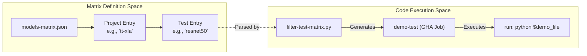

# Running Demo Tests

Relevant source files
*   [.github/workflows/basic-tests.yml](https://github.com/tenstorrent/tt-forge/blob/6f2d9645/.github/workflows/basic-tests.yml)
*   [.github/workflows/demo-tests.yml](https://github.com/tenstorrent/tt-forge/blob/6f2d9645/.github/workflows/demo-tests.yml)
*   [.github/workflows/models-matrix.json](https://github.com/tenstorrent/tt-forge/blob/6f2d9645/.github/workflows/models-matrix.json)
*   [basic_tests/tt-torch/demo_test.py](https://github.com/tenstorrent/tt-forge/blob/6f2d9645/basic_tests/tt-torch/demo_test.py)
*   [basic_tests/tt-xla/demo_test.py](https://github.com/tenstorrent/tt-forge/blob/6f2d9645/basic_tests/tt-xla/demo_test.py)
*   [demos/tt-forge-onnx/README.md](https://github.com/tenstorrent/tt-forge/blob/6f2d9645/demos/tt-forge-onnx/README.md?plain=1)

This document provides instructions for running demo tests in the TT-Forge repository. Demo tests validate real-world model execution on Tenstorrent hardware by running complete model demos from the `demos/` directory.

## Purpose and Scope

Demo tests differ from basic tests and performance benchmarks in their intent and execution context. While basic tests perform quick smoke tests on frontends, demo tests execute the same code that users run when following documentation examples.

| Test Type | Purpose | Duration | Test Source | Hardware Required |
| --- | --- | --- | --- | --- |
| **Basic Tests** | Quick validation and frontend smoke tests | Minutes | `basic_tests/` directory | Yes (n150/p150) |
| **Demo Tests** | Comprehensive real-world model demonstrations | ~30 minutes | `demos/` directory | Yes (n150/p150) |
| **Performance Benchmarks** | Performance validation and regression detection | ~60 minutes | `benchmark/` directory | Yes (n150/p150) |

Sources: [.github/workflows/demo-tests.yml 1-132](https://github.com/tenstorrent/tt-forge/blob/6f2d9645/.github/workflows/demo-tests.yml#L1-L132)[.github/workflows/basic-tests.yml 1-154](https://github.com/tenstorrent/tt-forge/blob/6f2d9645/.github/workflows/basic-tests.yml#L1-L154)

## Demo Test Workflow Architecture

The demo test system is implemented in the `demo-tests.yml` GitHub Actions workflow. The workflow follows a three-stage execution pattern: matrix generation, parallel test execution, and result aggregation.

**Workflow Execution Flow**

The workflow is triggered by `workflow_dispatch` (manual) or `workflow_call` (from release workflows). The `set-matrix` job uses `filter-test-matrix.py` to parse `models-matrix.json` based on the provided `project-filter` and `test-filter`[.github/workflows/demo-tests.yml 72-77](https://github.com/tenstorrent/tt-forge/blob/6f2d9645/.github/workflows/demo-tests.yml#L72-L77) Each test runs in parallel within a Docker container that has direct hardware access via `--device /dev/tenstorrent`[.github/workflows/demo-tests.yml 97](https://github.com/tenstorrent/tt-forge/blob/6f2d9645/.github/workflows/demo-tests.yml#L97-L97)

Sources: [.github/workflows/demo-tests.yml 54-212](https://github.com/tenstorrent/tt-forge/blob/6f2d9645/.github/workflows/demo-tests.yml#L54-L212)

```mermaid
graph TB
    Trigger["Workflow Trigger (dispatch/call)"]
    
    subgraph "Stage 1: Matrix Generation"
        SetMatrix["set-matrix job<br/>runs-on: ubuntu-latest"]
        Checkout1["Checkout repository"]
        FilterMatrix["filter-test-matrix.py<br/>--input: models-matrix.json"]
        Output["Output: matrix JSON<br/>matrix_skip flag"]
        
        SetMatrix --> Checkout1
        Checkout1 --> FilterMatrix
        FilterMatrix --> Output
    end
    
    subgraph "Stage 2: Parallel Execution"
        DemoTest["demo-test job<br/>runs-on: tt-ubuntu-2204-{arch}-stable<br/>strategy: matrix"]
        
        subgraph "Container Setup"
            Container["Docker Container<br/>image: inputs.docker-image<br/>device: /dev/tenstorrent"]
            Volumes["Volume Mounts:<br/>/dev/hugepages<br/>/lib/modules<br/>/opt/tt_metal_infra"]
        end
        
        subgraph "Test Execution Steps"
            Checkout2["Checkout repository"]
            Venv["Activate /opt/venv"]
            InstallDeps["Install dependencies<br/>pip install -r requirements.txt"]
            RunDemo["Execute demo file<br/>python $demo_file"]
        end
        
        DemoTest --> Container
        Container --> Volumes
        Volumes --> Checkout2
        Checkout2 --> Venv
        Venv --> InstallDeps
        InstallDeps --> RunDemo
    end
    
    subgraph "Stage 3: Result Aggregation"
        FailNotify["fail-notify job"]
        CheckStatus["Check job statuses<br/>re-actors/alls-green"]
        SendSlack["Send Slack notification<br/>if failed + main + not draft"]
        ProduceData["Trigger produce_data.yml"]
        
        FailNotify --> CheckStatus
        CheckStatus --> SendSlack
        SendSlack --> ProduceData
    end
    
    Trigger --> SetMatrix
    Output --> DemoTest
    RunDemo --> FailNotify
```




**Workflow Execution Flow**

The workflow is triggered by `workflow_dispatch` (manual) or `workflow_call` (from release workflows). The `set-matrix` job uses `filter-test-matrix.py` to parse `models-matrix.json` based on the provided `project-filter` and `test-filter` [.github/workflows/demo-tests.yml:72-77](). Each test runs in parallel within a Docker container that has direct hardware access via `--device /dev/tenstorrent` [.github/workflows/demo-tests.yml:97]().

Sources: [.github/workflows/demo-tests.yml:54-212]()
```
## Test Matrix Configuration System

Demo tests use a configuration system defined in `models-matrix.json`. This file organizes tests by project and provides defaults for runner types.

**Matrix Structure**

The `models-matrix.json` file contains an array of project objects. Each project defines its tests and optional default settings like `runs-on`[.github/workflows/models-matrix.json 1-45](https://github.com/tenstorrent/tt-forge/blob/6f2d9645/.github/workflows/models-matrix.json#L1-L45)

| Field | Description |
| --- | --- |
| `project` | The frontend/project name (e.g., `tt-forge-onnx`, `tt-torch`, `tt-xla`) |
| `test-defaults` | Default settings applied to all tests in the project (e.g., `runs-on: ["n150", "p150"]`) |
| `tests` | Array of test objects containing `name`, `path`, and optional overrides |

**Example Matrix Entry (tt-torch):**

`{  "project": "tt-torch",  "tests": [    {       "runs-on": "n150",       "name": "resnet50",       "path": "resnet50_demo.py",       "pyreq": "loguru requests transformers datasets==3.6.0 torch==2.7.0 torchvision pytest tabulate"     }  ]}`
Sources: [.github/workflows/models-matrix.json 36-44](https://github.com/tenstorrent/tt-forge/blob/6f2d9645/.github/workflows/models-matrix.json#L36-L44)




**Matrix Structure**

The `models-matrix.json` file contains an array of project objects. Each project defines its tests and optional default settings like `runs-on` [.github/workflows/models-matrix.json:1-45]().

| Field | Description |
|-------|-------------|
| `project` | The frontend/project name (e.g., `tt-forge-onnx`, `tt-torch`, `tt-xla`) |
| `test-defaults` | Default settings applied to all tests in the project (e.g., `runs-on: ["n150", "p150"]`) |
| `tests` | Array of test objects containing `name`, `path`, and optional overrides |

**Example Matrix Entry (tt-torch):**
```json
{
  "project": "tt-torch",
  "tests": [
    { 
      "runs-on": "n150", 
      "name": "resnet50", 
      "path": "resnet50_demo.py", 
      "pyreq": "loguru requests transformers datasets==3.6.0 torch==2.7.0 torchvision pytest tabulate" 
    }
  ]
}
```
Sources: [.github/workflows/models-matrix.json:36-44]()
```
## Running Demo Tests via GitHub Actions

### Manual Workflow Dispatch

The demo tests workflow can be triggered manually with the following inputs:

| Input Parameter | Type | Default | Description |
| --- | --- | --- | --- |
| `docker-image` | string | `harbor.ci.tenstorrent.net/ghcr.io/tenstorrent/tt-forge/tt-forge-slim:latest` | Docker image for test execution |
| `project-filter` | choice | `tt-forge` | Project to test: `tt-forge-onnx`, `tt-torch`, `tt-xla`, `tt-forge` |
| `test-filter` | string | "" | Substring to match specific test names |

Sources: [.github/workflows/demo-tests.yml 7-31](https://github.com/tenstorrent/tt-forge/blob/6f2d9645/.github/workflows/demo-tests.yml#L7-L31)

## Basic Tests vs Demo Tests

The repository also includes a `basic-tests.yml` workflow for quick validation. Unlike demo tests which use a complex matrix from a JSON file, basic tests use a simplified matrix built directly in the workflow script.

**Basic Test Implementation:**

*   **Script Location**: `basic_tests/${matrix.frontend}/demo_test.py`[.github/workflows/basic-tests.yml 153](https://github.com/tenstorrent/tt-forge/blob/6f2d9645/.github/workflows/basic-tests.yml#L153-L153)
*   **Logic**: Performs a simple operation (e.g., tensor addition) to verify the frontend-to-hardware path.
*   **Example (tt-torch)**: Compiles a simple `AddTensors` module using `torch.compile(model, backend="tt")`[basic_tests/tt-torch/demo_test.py 9-15](https://github.com/tenstorrent/tt-forge/blob/6f2d9645/basic_tests/tt-torch/demo_test.py#L9-L15)
*   **Example (tt-xla)**: Performs a JIT-compiled multiply-add operation using `jax.devices("tt")`[basic_tests/tt-xla/demo_test.py 7-22](https://github.com/tenstorrent/tt-forge/blob/6f2d9645/basic_tests/tt-xla/demo_test.py#L7-L22)

Sources: [.github/workflows/basic-tests.yml 58-98](https://github.com/tenstorrent/tt-forge/blob/6f2d9645/.github/workflows/basic-tests.yml#L58-L98)[basic_tests/tt-torch/demo_test.py 1-19](https://github.com/tenstorrent/tt-forge/blob/6f2d9645/basic_tests/tt-torch/demo_test.py#L1-L19)[basic_tests/tt-xla/demo_test.py 1-23](https://github.com/tenstorrent/tt-forge/blob/6f2d9645/basic_tests/tt-xla/demo_test.py#L1-L23)

## Execution Environment and Dependencies

### Container Setup

Demo tests run in a privileged container environment to allow hardware interaction:

*   **Device**: `/dev/tenstorrent` is mapped to the container [.github/workflows/demo-tests.yml 97](https://github.com/tenstorrent/tt-forge/blob/6f2d9645/.github/workflows/demo-tests.yml#L97-L97)
*   **Hugepages**: `/dev/hugepages` and `/dev/hugepages-1G` are mounted for memory management [.github/workflows/demo-tests.yml 99-100](https://github.com/tenstorrent/tt-forge/blob/6f2d9645/.github/workflows/demo-tests.yml#L99-L100)
*   **Kernel Modules**: `/lib/modules` is mounted to ensure driver compatibility [.github/workflows/demo-tests.yml 102](https://github.com/tenstorrent/tt-forge/blob/6f2d9645/.github/workflows/demo-tests.yml#L102-L102)

### Dependency Management

The workflow handles dependencies in three ways:

1.   **Virtual Environment**: It sources `/opt/venv/bin/activate` if it exists in the image [.github/workflows/demo-tests.yml 119-121](https://github.com/tenstorrent/tt-forge/blob/6f2d9645/.github/workflows/demo-tests.yml#L119-L121)
2.   **PYTHONPATH**: It adds the repository root to `PYTHONPATH` so demos can locate shared models in the `third_party` folder [.github/workflows/demo-tests.yml 126](https://github.com/tenstorrent/tt-forge/blob/6f2d9645/.github/workflows/demo-tests.yml#L126-L126)
3.   **Requirements**: It checks for a `requirements.txt` in the demo's folder and installs it if present [.github/workflows/demo-tests.yml 128-130](https://github.com/tenstorrent/tt-forge/blob/6f2d9645/.github/workflows/demo-tests.yml#L128-L130)

Sources: [.github/workflows/demo-tests.yml 95-131](https://github.com/tenstorrent/tt-forge/blob/6f2d9645/.github/workflows/demo-tests.yml#L95-L131)

## Available Demos

Demos are organized by project in the `demos/` directory.

### TT-Forge-ONNX Demos

Located in `demos/tt-forge-onnx/`, these demos showcase inference for models converted to ONNX format or using PaddlePaddle.

| Category | Models |
| --- | --- |
| **CNN (ONNX)** | AlexNet, DenseNet, EfficientNet, GoogLeNet, MobileNetV1, ResNet |
| **NLP (ONNX)** | RoBERTa, SqueezeBERT |
| **PaddlePaddle** | ResNet, AlexNet, DenseNet, MobileNetV2, BLIP (Multimodal) |

Sources: [demos/tt-forge-onnx/README.md 1-50](https://github.com/tenstorrent/tt-forge/blob/6f2d9645/demos/tt-forge-onnx/README.md?plain=1#L1-L50)

### TT-Torch and TT-XLA Demos

These are defined in the `models-matrix.json` and include:

*   **TT-Torch**: ResNet50 benchmarks, Llama 7B pipeline parallel, and Llama 3.2 generation [.github/workflows/models-matrix.json 38-42](https://github.com/tenstorrent/tt-forge/blob/6f2d9645/.github/workflows/models-matrix.json#L38-L42)
*   **TT-XLA**: Albert (Jax/PyTorch), GPT2, OPT, ResNet50, and BGE-M3 [.github/workflows/models-matrix.json 24-32](https://github.com/tenstorrent/tt-forge/blob/6f2d9645/.github/workflows/models-matrix.json#L24-L32)

Sources: [.github/workflows/models-matrix.json 16-44](https://github.com/tenstorrent/tt-forge/blob/6f2d9645/.github/workflows/models-matrix.json#L16-L44)

Dismiss
Refresh this wiki

Enter email to refresh
