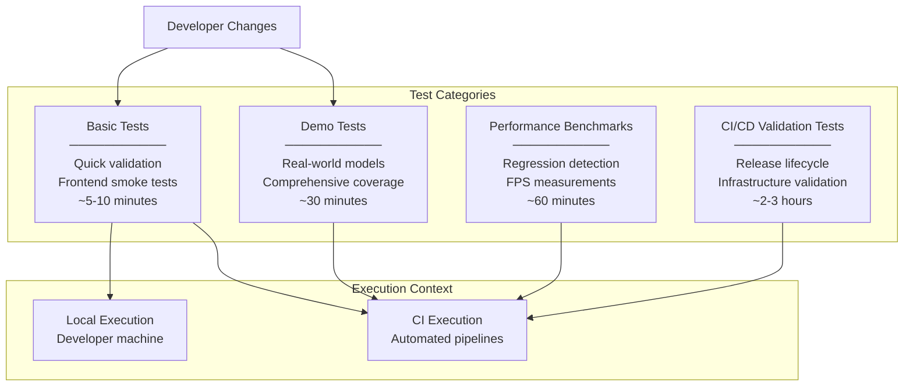
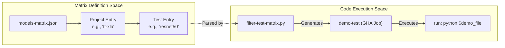
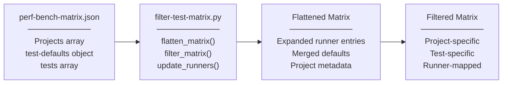
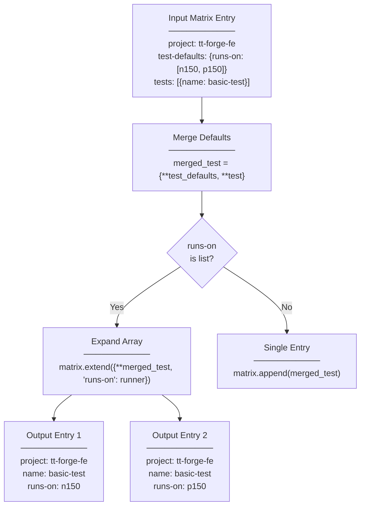
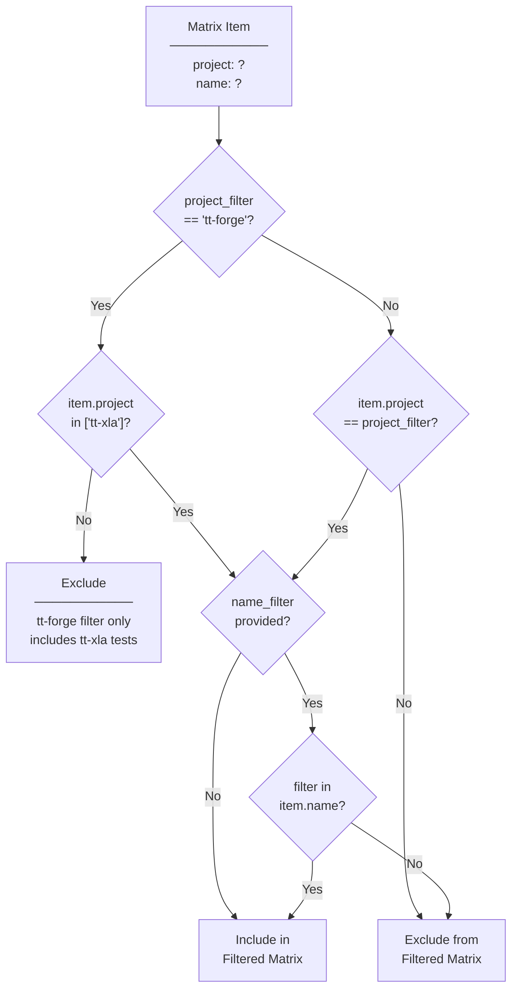

# Testing and Validation

Relevant source files
*   [.github/check-spdx.yml](https://github.com/tenstorrent/tt-forge/blob/6f2d9645/.github/check-spdx.yml)
*   [.github/workflows/filter-test-matrix.py](https://github.com/tenstorrent/tt-forge/blob/6f2d9645/.github/workflows/filter-test-matrix.py)
*   [.github/workflows/pre-commit.yml](https://github.com/tenstorrent/tt-forge/blob/6f2d9645/.github/workflows/pre-commit.yml)
*   [.gitignore](https://github.com/tenstorrent/tt-forge/blob/6f2d9645/.gitignore)
*   [.pre-commit-config.yaml](https://github.com/tenstorrent/tt-forge/blob/6f2d9645/.pre-commit-config.yaml)
*   [CONTRIBUTING.md](https://github.com/tenstorrent/tt-forge/blob/6f2d9645/CONTRIBUTING.md?plain=1)

## Purpose and Scope

This guide covers the testing and validation workflows available to developers working with the TT-Forge codebase. It explains how to run test suites locally, understand test matrix configurations, validate changes before submission, and test modifications to the CI/CD infrastructure itself.

For information about the automated testing infrastructure and CI workflows, see [Testing Infrastructure](https://deepwiki.com/tenstorrent/tt-forge/4-testing-infrastructure). For performance benchmarking procedures, see [Benchmarking System](https://deepwiki.com/tenstorrent/tt-forge/3-benchmarking-system). For validation of the release process itself, see [Release Testing and Validation](https://deepwiki.com/tenstorrent/tt-forge/5.6-release-testing-and-validation).

## Test Types Overview

The TT-Forge repository employs several categories of tests, each serving a distinct validation purpose:

**Sources:**[.github/workflows/basic-tests.yml](https://github.com/tenstorrent/tt-forge/blob/6f2d9645/.github/workflows/basic-tests.yml)[.github/workflows/test-rc-stable-release-lifecycle.yml](https://github.com/tenstorrent/tt-forge/blob/6f2d9645/.github/workflows/test-rc-stable-release-lifecycle.yml)[.github/workflows/test-nightly-releaser.yml](https://github.com/tenstorrent/tt-forge/blob/6f2d9645/.github/workflows/test-nightly-releaser.yml)



## Test Matrix Configuration System

The test execution system uses a matrix-based configuration approach that enables parallel test execution across multiple hardware platforms and project configurations.




**Matrix Structure**

The `models-matrix.json` file contains an array of project objects. Each project defines its tests and optional default settings like `runs-on` [.github/workflows/models-matrix.json:1-45]().

| Field | Description |
|-------|-------------|
| `project` | The frontend/project name (e.g., `tt-forge-onnx`, `tt-torch`, `tt-xla`) |
| `test-defaults` | Default settings applied to all tests in the project (e.g., `runs-on: ["n150", "p150"]`) |
| `tests` | Array of test objects containing `name`, `path`, and optional overrides |

**Example Matrix Entry (tt-torch):**
```json
{
  "project": "tt-torch",
  "tests": [
    { 
      "runs-on": "n150", 
      "name": "resnet50", 
      "path": "resnet50_demo.py", 
      "pyreq": "loguru requests transformers datasets==3.6.0 torch==2.7.0 torchvision pytest tabulate" 
    }
  ]
}
```
Sources: [.github/workflows/models-matrix.json:36-44]()
```
### Matrix Definition Structure

Test matrices are defined in JSON format with project-specific defaults and individual test configurations. The `filter-test-matrix.py` script is the primary engine for processing these configurations.

**Sources:**[.github/workflows/filter-test-matrix.py 10-24](https://github.com/tenstorrent/tt-forge/blob/6f2d9645/.github/workflows/filter-test-matrix.py#L10-L24)



### Filter Script Functionality

The `filter-test-matrix.py` script processes test matrices through three transformation stages:

| Function | Purpose | Input | Output |
| --- | --- | --- | --- |
| `flatten_matrix()` | Expands multi-runner tests into individual entries | Project definitions with `runs-on` arrays | Flat list with one entry per runner |
| `filter_matrix()` | Applies project and test name filters | Flattened matrix + filter parameters | Subset matching criteria |
| `update_runners()` | Maps runner names based on shared/dedicated flag | Filtered matrix + `sh_runner` flag | Matrix with updated runner names |

**Sources:**[.github/workflows/filter-test-matrix.py 10-60](https://github.com/tenstorrent/tt-forge/blob/6f2d9645/.github/workflows/filter-test-matrix.py#L10-L60)

### Matrix Flattening Process

The `flatten_matrix` function [.github/workflows/filter-test-matrix.py 10-24](https://github.com/tenstorrent/tt-forge/blob/6f2d9645/%20.github/workflows/filter-test-matrix.py#L10-L24) merges test-specific configurations with project defaults and expands runner arrays:

**Sources:**[.github/workflows/filter-test-matrix.py 10-24](https://github.com/tenstorrent/tt-forge/blob/6f2d9645/.github/workflows/filter-test-matrix.py#L10-L24)



### Project Filtering Logic

The `filter_matrix` function [.github/workflows/filter-test-matrix.py 27-48](https://github.com/tenstorrent/tt-forge/blob/6f2d9645/%20.github/workflows/filter-test-matrix.py#L27-L48) implements special handling for the `tt-forge` project filter:

**Sources:**[.github/workflows/filter-test-matrix.py 32-48](https://github.com/tenstorrent/tt-forge/blob/6f2d9645/.github/workflows/filter-test-matrix.py#L32-L48)



### Runner Mapping

The `update_runners()` function [.github/workflows/filter-test-matrix.py 51-60](https://github.com/tenstorrent/tt-forge/blob/6f2d9645/%20.github/workflows/filter-test-matrix.py#L51-L60) maps runner names based on the shared runner flag:

| Original Runner | Shared Runner (`--sh-runner`) | Dedicated/Perf Runner |
| --- | --- | --- |
| `n150` | `n150` (no change) | `n150-perf` |
| `p150` | `p150b` | `p150` (no change) |

This mapping allows the same test matrix to target different runner pools based on execution context (CI validation vs. performance testing).

**Sources:**[.github/workflows/filter-test-matrix.py 53-58](https://github.com/tenstorrent/tt-forge/blob/6f2d9645/.github/workflows/filter-test-matrix.py#L53-L58)

## Coding and Style Validation

All contributions must adhere to the project's coding standards, which are enforced via pre-commit hooks and CI checks.

### Pre-commit Hooks

The project uses `pre-commit` to run several checks before code is committed [.pre-commit-config.yaml 1-20](https://github.com/tenstorrent/tt-forge/blob/6f2d9645/%20.pre-commit-config.yaml#L1-L20):

*   **Copyright/SPDX Check**: Ensures every source file has the appropriate Software Package Data Exchange (SPDX) header [.github/check-spdx.yml 1-16](https://github.com/tenstorrent/tt-forge/blob/6f2d9645/%20.github/check-spdx.yml#L1-L16)
*   **Black**: Enforces Python code formatting with a line length of 120 [.pre-commit-config.yaml 7-12](https://github.com/tenstorrent/tt-forge/blob/6f2d9645/%20.pre-commit-config.yaml#L7-L12)
*   **Standard Hooks**: Trailing whitespace, end-of-file-fixer, and YAML validation [.pre-commit-config.yaml 13-20](https://github.com/tenstorrent/tt-forge/blob/6f2d9645/%20.pre-commit-config.yaml#L13-L20)

### SPDX Header Requirements

C++ files must use the following header [CONTRIBUTING.md 137-141](https://github.com/tenstorrent/tt-forge/blob/6f2d9645/%20CONTRIBUTING.md?plain=1#L137-L141):

`// SPDX-FileCopyrightText: © 2023 Tenstorrent Inc.//// SPDX-License-Identifier: Apache-2.0`
Python files must use the following header [CONTRIBUTING.md 143-149](https://github.com/tenstorrent/tt-forge/blob/6f2d9645/%20CONTRIBUTING.md?plain=1#L143-L149):

`# SPDX-FileCopyrightText: © 2023 Tenstorrent Inc. # SPDX-License-Identifier: Apache-2.0`
**Sources:**[CONTRIBUTING.md 132-149](https://github.com/tenstorrent/tt-forge/blob/6f2d9645/CONTRIBUTING.md?plain=1#L132-L149)[.github/workflows/pre-commit.yml 1-25](https://github.com/tenstorrent/tt-forge/blob/6f2d9645/.github/workflows/pre-commit.yml#L1-L25)[.pre-commit-config.yaml 1-20](https://github.com/tenstorrent/tt-forge/blob/6f2d9645/.pre-commit-config.yaml#L1-L20)

## Basic Tests Workflow

The `basic-tests.yml` workflow provides rapid validation for pull requests and development changes.

### Container Execution Environment

Each test executes within a Docker container with specific hardware access requirements. The workflow typically uses the `tt-forge-slim` image [.github/workflows/basic-tests.yml 6](https://github.com/tenstorrent/tt-forge/blob/6f2d9645/%20.github/workflows/basic-tests.yml#L6-L6)

| Mount/Device | Purpose |
| --- | --- |
| `/dev/tenstorrent` | Direct hardware access |
| `/dev/hugepages` | Host memory for large page allocation |
| `/lib/modules` | Host kernel module access |

**Sources:**[.github/workflows/basic-tests.yml 4-35](https://github.com/tenstorrent/tt-forge/blob/6f2d9645/.github/workflows/basic-tests.yml#L4-L35)

## Error Message Validation

Clear and informative error messages are crucial for debugging. The project follows strict guidelines for writing effective error messages [CONTRIBUTING.md 58-65](https://github.com/tenstorrent/tt-forge/blob/6f2d9645/%20CONTRIBUTING.md?plain=1#L58-L65)

### Principles for Effective Messages

1.   **Be Specific**: Include actual values and conditions [CONTRIBUTING.md 67-77](https://github.com/tenstorrent/tt-forge/blob/6f2d9645/%20CONTRIBUTING.md?plain=1#L67-L77)
2.   **Explain the Issue**: Provide context on why the condition is important [CONTRIBUTING.md 78-89](https://github.com/tenstorrent/tt-forge/blob/6f2d9645/%20CONTRIBUTING.md?plain=1#L78-L89)
3.   **Make it Actionable**: Offer guidance on how to resolve the issue [CONTRIBUTING.md 101-113](https://github.com/tenstorrent/tt-forge/blob/6f2d9645/%20CONTRIBUTING.md?plain=1#L101-L113)

**Example of a Good Message:**

`TT_FATAL(head_size % TILE_WIDTH == 0,         "Invalid head size: {}. The head size must be a multiple of the tile width ({}). Please adjust the dimensions accordingly.",         head_size, TILE_WIDTH);`
**Sources:**[CONTRIBUTING.md 114-120](https://github.com/tenstorrent/tt-forge/blob/6f2d9645/CONTRIBUTING.md?plain=1#L114-L120)

## Running Tests as a Developer

### Local Test Execution

To run basic tests locally, ensure you have access to Tenstorrent hardware and execute:

`# Set the Docker imageexport DOCKER_IMAGE="harbor.ci.tenstorrent.net/ghcr.io/tenstorrent/tt-forge/tt-forge-slim:latest" # Run for tt-xla frontenddocker run --rm \  --device /dev/tenstorrent \  -v /dev/hugepages:/dev/hugepages \  -v /lib/modules:/lib/modules \  -v $(pwd):/workspace \  -w /workspace \  $DOCKER_IMAGE \  python basic_tests/tt-xla/demo_test.py`
### Test Matrix Filter Script Usage

The `filter-test-matrix.py` script can be used to debug matrix generation locally [.github/workflows/filter-test-matrix.py 64-70](https://github.com/tenstorrent/tt-forge/blob/6f2d9645/%20.github/workflows/filter-test-matrix.py#L64-L70):

`# Filter for tt-xla projectpython .github/workflows/filter-test-matrix.py perf-bench-matrix.json tt-xla # Filter for specific test namepython .github/workflows/filter-test-matrix.py perf-bench-matrix.json tt-xla --test-filter resnet50`
**Sources:**[.github/workflows/filter-test-matrix.py 63-94](https://github.com/tenstorrent/tt-forge/blob/6f2d9645/.github/workflows/filter-test-matrix.py#L63-L94)

## Best Practices

### Before Submitting Changes

1.   **Run Pre-commit**: Execute `pre-commit run --all-files` to ensure formatting and license headers are correct [.github/workflows/pre-commit.yml 21](https://github.com/tenstorrent/tt-forge/blob/6f2d9645/%20.github/workflows/pre-commit.yml#L21-L21)
2.   **Run Basic Tests**: Validate your frontend changes with the smoke test suite.
3.   **Verify Error Messages**: Ensure any new `TT_FATAL` or error logs follow the [Coding Guidelines](https://github.com/tenstorrent/tt-forge/blob/6f2d9645/Coding%20Guidelines)

### Test Configuration Guidelines

| Scenario | Recommendation |
| --- | --- |
| Adding new model test | Add entry to `perf-bench-matrix.json` with appropriate `runs-on` specification |
| Testing on specific hardware | Use `--sh-runner` flag in the filter script to target shared infrastructure |
| Modifying core compiler | Ensure both `tt-xla` and `tt-forge-fe` tests pass as they represent different entry points |

**Sources:**[CONTRIBUTING.md 1-46](https://github.com/tenstorrent/tt-forge/blob/6f2d9645/CONTRIBUTING.md?plain=1#L1-L46)[.github/workflows/filter-test-matrix.py 1-94](https://github.com/tenstorrent/tt-forge/blob/6f2d9645/.github/workflows/filter-test-matrix.py#L1-L94)

Dismiss
Refresh this wiki

Enter email to refresh
