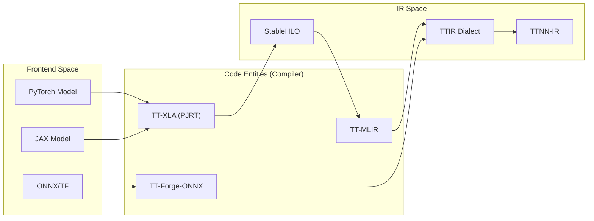
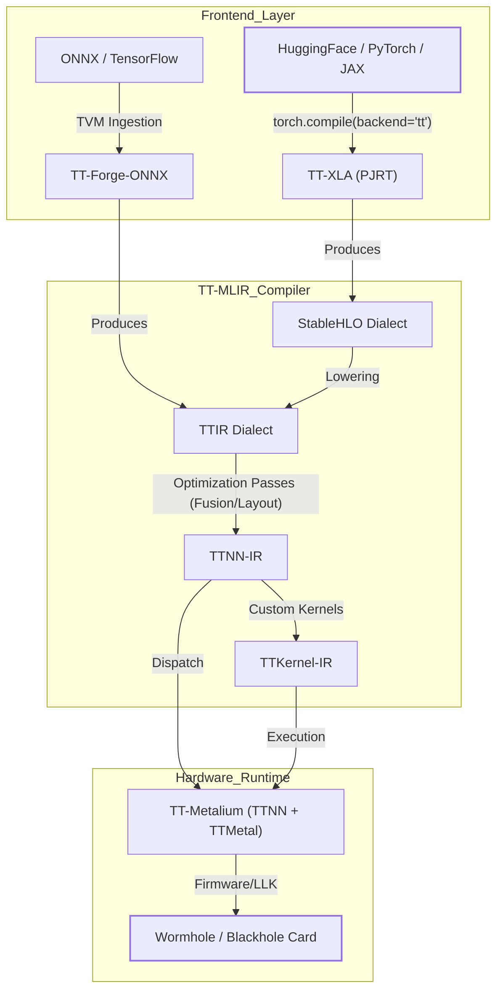

# Model Bring-Up Guide

Relevant source files
*   [.claude/skills/model-bringup-cpu/SKILL.md](https://github.com/tenstorrent/tt-forge/blob/6f2d9645/.claude/skills/model-bringup-cpu/SKILL.md?plain=1)
*   [.claude/skills/model-bringup-tt-hardware/SKILL.md](https://github.com/tenstorrent/tt-forge/blob/6f2d9645/.claude/skills/model-bringup-tt-hardware/SKILL.md?plain=1)
*   [.github/workflows/ai-model-bringup-master.yml](https://github.com/tenstorrent/tt-forge/blob/6f2d9645/.github/workflows/ai-model-bringup-master.yml)
*   [.github/workflows/ai-model-bringup.yml](https://github.com/tenstorrent/tt-forge/blob/6f2d9645/.github/workflows/ai-model-bringup.yml)
*   [.github/workflows/pages.yml](https://github.com/tenstorrent/tt-forge/blob/6f2d9645/.github/workflows/pages.yml)
*   [README.md](https://github.com/tenstorrent/tt-forge/blob/6f2d9645/README.md?plain=1)
*   [demos/README.md](https://github.com/tenstorrent/tt-forge/blob/6f2d9645/demos/README.md?plain=1)
*   [demos/tt-xla/nlp/jax/gpt_demo.py](https://github.com/tenstorrent/tt-forge/blob/6f2d9645/demos/tt-xla/nlp/jax/gpt_demo.py)
*   [docs/.gitignore](https://github.com/tenstorrent/tt-forge/blob/6f2d9645/docs/.gitignore)
*   [docs/book.toml](https://github.com/tenstorrent/tt-forge/blob/6f2d9645/docs/book.toml)
*   [docs/src/SUMMARY.md](https://github.com/tenstorrent/tt-forge/blob/6f2d9645/docs/src/SUMMARY.md?plain=1)
*   [docs/src/getting_started.md](https://github.com/tenstorrent/tt-forge/blob/6f2d9645/docs/src/getting_started.md?plain=1)
*   [docs/src/model-bring-up-guide.md](https://github.com/tenstorrent/tt-forge/blob/6f2d9645/docs/src/model-bring-up-guide.md?plain=1)

The Model Bring-Up Guide provides a comprehensive technical walkthrough for porting AI models from HuggingFace to Tenstorrent hardware. It covers the end-to-end lifecycle from initial environment setup and frontend selection to advanced performance optimization and multi-chip scaling.

## 1. The Compilation Pipeline

The TT-Forge stack utilizes an MLIR-based compiler architecture to lower high-level framework code into hardware-executable instructions. Understanding the data flow through these layers is critical for debugging and performance tuning.



### System Architecture and Data Flow

The following diagram illustrates how a model travels from "Natural Language Space" (HuggingFace/PyTorch) into "Code Entity Space" (MLIR Dialects and TT-Metalium).

**Model Lowering Path**

Sources: [docs/src/model-bring-up-guide.md 26-65](https://github.com/tenstorrent/tt-forge/blob/6f2d9645/docs/src/model-bring-up-guide.md?plain=1#L26-L65)[README.md 23-32](https://github.com/tenstorrent/tt-forge/blob/6f2d9645/README.md?plain=1#L23-L32)



Sources: [docs/src/model-bring-up-guide.md:26-65](), [README.md:23-32]()
```
## 2. Environment Setup and Frontend Selection

Tenstorrent supports multiple frontends depending on the source framework and the required scale (single vs. multi-chip).

| Frontend | Supported Frameworks | Target Use Case | Multi-Chip Support |
| --- | --- | --- | --- |
| **TT-XLA** | PyTorch, JAX | Primary frontend for LLMs and Generative AI | Yes |
| **TT-Forge-ONNX** | ONNX, TensorFlow, PaddlePaddle | Quick deployment of pre-optimized vision/CNN models | No |

### Initial Installation

To begin bring-up, the `pjrt-plugin-tt` must be installed, which bundles the `tt-mlir` compiler and `tt-metal` runtime.

`# Core installation for PyTorch/JAX pathpip install pjrt-plugin-tt --extra-index-url https://pypi.eng.aws.tenstorrent.com/tt-forge-install`
Sources: [docs/src/model-bring-up-guide.md 80-97](https://github.com/tenstorrent/tt-forge/blob/6f2d9645/docs/src/model-bring-up-guide.md?plain=1#L80-L97)[README.md 37-46](https://github.com/tenstorrent/tt-forge/blob/6f2d9645/README.md?plain=1#L37-L46)[demos/README.md 5-18](https://github.com/tenstorrent/tt-forge/blob/6f2d9645/demos/README.md?plain=1#L5-L18)

## 3. Automated Model Onboarding (AI-Assisted)

For rapid onboarding of HuggingFace models, TT-Forge provides an automated pipeline using Claude-powered agents. This system handles the boilerplate of creating loaders and validating them on hardware.

**AI Bringup Workflow Orchestration**

Sources: [.github/workflows/ai-model-bringup.yml 58-160](https://github.com/tenstorrent/tt-forge/blob/6f2d9645/.github/workflows/ai-model-bringup.yml#L58-L160)[.claude/skills/model-bringup-cpu/SKILL.md 7-108](https://github.com/tenstorrent/tt-forge/blob/6f2d9645/.claude/skills/model-bringup-cpu/SKILL.md?plain=1#L7-L108)[.claude/skills/model-bringup-tt-hardware/SKILL.md 7-63](https://github.com/tenstorrent/tt-forge/blob/6f2d9645/.claude/skills/model-bringup-tt-hardware/SKILL.md?plain=1#L7-L63)

### The ForgeModel Interface

Every model in the Tenstorrent ecosystem must implement the `ForgeModel` base class to ensure compatibility with the compiler's benchmarking and validation tools.

*   `load_model(dtype_override)`: Loads the model (typically via `AutoModel.from_pretrained`) and applies the target `torch.bfloat16` or `float32`.
*   `load_inputs()`: Generates sample tensors or tokenized text for the first inference pass.
*   `_get_model_info()`: Returns metadata including `ModelGroup`, `ModelTask`, and `Framework`.

Sources: [.claude/skills/model-bringup-cpu/SKILL.md 35-40](https://github.com/tenstorrent/tt-forge/blob/6f2d9645/.claude/skills/model-bringup-cpu/SKILL.md?plain=1#L35-L40)[.claude/skills/model-bringup-cpu/SKILL.md 96-108](https://github.com/tenstorrent/tt-forge/blob/6f2d9645/.claude/skills/model-bringup-cpu/SKILL.md?plain=1#L96-L108)

## 4. Hardware Execution and Optimization

### Tiling and Memory Constraints

Tenstorrent hardware operates on native **32x32 tiles**. Performance is maximized when hidden dimensions and sequence lengths are multiples of 32.

*   **SRAM (L1):** 1.5 MB per Tensix core. High speed, low capacity.
*   **DRAM:** High capacity, used for interleaved tensor storage.

### Data Types

The recommended default for Tenstorrent hardware is `bfloat16`.

*   `float32`: Widest support but slowest.
*   `bfloat16`: 2x memory savings, minimal accuracy loss.
*   `bfloat8_b`: Maximum performance; requires `optimization_level` tuning.

Sources: [docs/src/model-bring-up-guide.md 166-203](https://github.com/tenstorrent/tt-forge/blob/6f2d9645/docs/src/model-bring-up-guide.md?plain=1#L166-L203)

### Compilation and Warming Up

Compilation is lazy and happens on the first `forward()` call.

1.   **Iteration 1:** Full graph compilation, weight transfer, and kernel lowering.
2.   **Iteration 2:** Runtime trace capture.
3.   **Iteration 3+:** Steady-state performance.

Always perform at least 3 warmup iterations before measuring FPS or latency. Sources: [docs/src/model-bring-up-guide.md 156-164](https://github.com/tenstorrent/tt-forge/blob/6f2d9645/docs/src/model-bring-up-guide.md?plain=1#L156-L164)

## 5. Multi-Chip and Tensor Parallelism

For Large Language Models (LLMs) that do not fit on a single chip (e.g., Llama-3 70B), TT-XLA supports Single Program Multiple Data (SPMD) sharding.

### JAX Sharding Example

In JAX, a `Mesh` is defined to map the model across multiple Tenstorrent devices.

`import jaxfrom jax.sharding import Meshfrom third_party.tt_forge_models.gpt2.causal_lm.jax import ModelLoader loader = ModelLoader(variant="base")model = loader.load_model() # Map model to the first available TT devicemesh = Mesh(jax.devices()[:1], axis_names=("x",))model.config.set_model_mesh(mesh)`
Sources: [demos/tt-xla/nlp/jax/gpt_demo.py 20-29](https://github.com/tenstorrent/tt-forge/blob/6f2d9645/demos/tt-xla/nlp/jax/gpt_demo.py#L20-L29)[docs/src/model-bring-up-guide.md 78-82](https://github.com/tenstorrent/tt-forge/blob/6f2d9645/docs/src/model-bring-up-guide.md?plain=1#L78-L82)

## 6. Debugging Playbook

When bringing up a new model, use the following sequence to isolate failures:

1.   **CPU Validation:** Ensure the model runs in the `tt-xla` virtual environment on CPU first.
2.   **Dtype Check:** Verify the model is cast to `bfloat16`.
3.   **Op Support:** If compilation fails, check the logs for "Unsupported Ops". These often require lowering to `TTNN` composite ops or implementing a custom kernel in `TT-Lang`.
4.   **Memory Errors:** If a "Kernel SRAM overflow" occurs, reduce the batch size or sequence length, or enable more aggressive sharding in the compiler options.

Sources: [docs/src/model-bring-up-guide.md 18-22](https://github.com/tenstorrent/tt-forge/blob/6f2d9645/docs/src/model-bring-up-guide.md?plain=1#L18-L22)[.claude/skills/model-bringup-tt-hardware/SKILL.md 38-62](https://github.com/tenstorrent/tt-forge/blob/6f2d9645/.claude/skills/model-bringup-tt-hardware/SKILL.md?plain=1#L38-L62)

Dismiss
Refresh this wiki

Enter email to refresh
