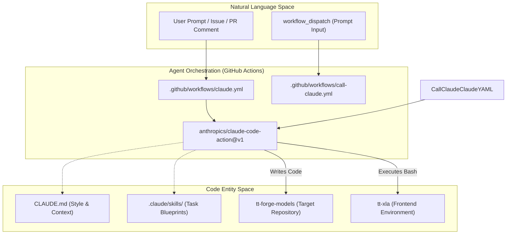

# AI-Assisted Development

Relevant source files
*   [.claude/skills/model-bringup-cpu/SKILL.md](https://github.com/tenstorrent/tt-forge/blob/6f2d9645/.claude/skills/model-bringup-cpu/SKILL.md?plain=1)
*   [.claude/skills/model-bringup-tt-hardware/SKILL.md](https://github.com/tenstorrent/tt-forge/blob/6f2d9645/.claude/skills/model-bringup-tt-hardware/SKILL.md?plain=1)
*   [.github/workflows/ai-model-bringup-master.yml](https://github.com/tenstorrent/tt-forge/blob/6f2d9645/.github/workflows/ai-model-bringup-master.yml)
*   [.github/workflows/ai-model-bringup.yml](https://github.com/tenstorrent/tt-forge/blob/6f2d9645/.github/workflows/ai-model-bringup.yml)
*   [.github/workflows/call-claude.yml](https://github.com/tenstorrent/tt-forge/blob/6f2d9645/.github/workflows/call-claude.yml)
*   [.github/workflows/claude-code-review.yml](https://github.com/tenstorrent/tt-forge/blob/6f2d9645/.github/workflows/claude-code-review.yml)
*   [.github/workflows/claude.yml](https://github.com/tenstorrent/tt-forge/blob/6f2d9645/.github/workflows/claude.yml)
*   [.github/workflows/manual-ai-install.yml](https://github.com/tenstorrent/tt-forge/blob/6f2d9645/.github/workflows/manual-ai-install.yml)
*   [CLAUDE.md](https://github.com/tenstorrent/tt-forge/blob/6f2d9645/CLAUDE.md?plain=1)

The TT-Forge repository integrates advanced AI agent infrastructure to automate complex development tasks, ranging from model onboarding to installation validation. This system leverages **Claude Code** to interact with the codebase, execute tools, and perform multi-step engineering workflows on Tenstorrent hardware.

The infrastructure is built around specialized GitHub Actions workflows and "Skills"—structured reference guides and toolsets that define how the AI agent should perform specific technical tasks.

### System Architecture: Natural Language to Code Entity Space

The following diagram illustrates how natural language prompts and high-level goals are translated into executable actions across the TT-Forge code entities.

**AI Agent Execution Flow**

**Sources:**[.github/workflows/claude.yml 1-128](https://github.com/tenstorrent/tt-forge/blob/6f2d9645/.github/workflows/claude.yml#L1-L128)[.github/workflows/call-claude.yml 1-141](https://github.com/tenstorrent/tt-forge/blob/6f2d9645/.github/workflows/call-claude.yml#L1-L141)[CLAUDE.md 1-120](https://github.com/tenstorrent/tt-forge/blob/6f2d9645/CLAUDE.md?plain=1#L1-L120)[.claude/skills/model-bringup-cpu/SKILL.md 1-174](https://github.com/tenstorrent/tt-forge/blob/6f2d9645/.claude/skills/model-bringup-cpu/SKILL.md?plain=1#L1-L174)

* * *



## Core AI Components

### Claude Code Integration

The repository features a generic integration for Claude Code that allows authorized members to invoke AI assistance via GitHub issues, pull requests, and manual triggers. This integration is governed by a strict authorization model and a set of allowed tools (such as `gh` CLI for repository management).

*   **Authorization:** Only users with `MEMBER`, `OWNER`, or `COLLABORATOR` associations can trigger the agent [.github/workflows/claude.yml 64-71](https://github.com/tenstorrent/tt-forge/blob/6f2d9645/.github/workflows/claude.yml#L64-L71)
*   **Context:** The agent uses `CLAUDE.md` to understand project-specific coding standards, test commands, and the compiler stack flow [CLAUDE.md 1-120](https://github.com/tenstorrent/tt-forge/blob/6f2d9645/CLAUDE.md?plain=1#L1-L120)
*   **PR Reviews:** Automated reviews focus on correctness, code quality, and performance [.github/workflows/claude-code-review.yml 34-41](https://github.com/tenstorrent/tt-forge/blob/6f2d9645/.github/workflows/claude-code-review.yml#L34-L41)

For details, see [Claude Code Integration](https://deepwiki.com/tenstorrent/tt-forge/7.1-claude-code-integration).

### Automated Model Bringup

The most advanced use of AI in this repository is the automated onboarding of HuggingFace models. The system uses a two-stage bringup process:

1.   **CPU Bringup:** The agent writes a `ForgeModel` loader and validates it in a CPU-only container [.github/workflows/ai-model-bringup.yml 81-90](https://github.com/tenstorrent/tt-forge/blob/6f2d9645/.github/workflows/ai-model-bringup.yml#L81-L90)
2.   **Hardware Bringup:** The agent installs dependencies, executes the model on Tenstorrent hardware (e.g., `n150`), and iterates on failures [.claude/skills/model-bringup-tt-hardware/SKILL.md 36-62](https://github.com/tenstorrent/tt-forge/blob/6f2d9645/.claude/skills/model-bringup-tt-hardware/SKILL.md?plain=1#L36-L62)

**Model Bringup Entity Mapping**

**Sources:**[.github/workflows/ai-model-bringup.yml 58-90](https://github.com/tenstorrent/tt-forge/blob/6f2d9645/.github/workflows/ai-model-bringup.yml#L58-L90)[.github/workflows/ai-model-bringup-master.yml 29-40](https://github.com/tenstorrent/tt-forge/blob/6f2d9645/.github/workflows/ai-model-bringup-master.yml#L29-L40)[.claude/skills/model-bringup-cpu/SKILL.md 35-40](https://github.com/tenstorrent/tt-forge/blob/6f2d9645/.claude/skills/model-bringup-cpu/SKILL.md?plain=1#L35-L40)

For details, see [Automated Model Bringup](https://deepwiki.com/tenstorrent/tt-forge/7.2-automated-model-bringup).


```mermaid
graph LR
    subgraph "Workflow Logic"
        MB_Master[".github/workflows/ai-model-bringup-master.yml"]
        MB_Single[".github/workflows/ai-model-bringup.yml"]
    end

    subgraph "Skill Definitions"
        CPU_Skill[".claude/skills/model-bringup-cpu/SKILL.md"]
        HW_Skill[".claude/skills/model-bringup-tt-hardware/SKILL.md"]
    end

    subgraph "Implementation Classes"
        ForgeModel["ForgeModel (base.py)"]
        ModelLoader["ModelLoader (loader.py)"]
    end

    MB_Master -->|Batch| MB_Single
    MB_Single -->|Invoke| CPU_Skill
    MB_Single -->|Invoke| HW_Skill
    CPU_Skill -->|Generates| ModelLoader
    ModelLoader --|> ForgeModel
```
### AI Installation Validation

The repository includes an autonomous "Installation Auditor" that evaluates the clarity and completeness of the setup documentation. The agent attempts to install `tt-forge` and run demos from a clean environment, reporting any friction points or missing dependencies.

*   **Workflow:**`manual-ai-install.yml` triggers the agent on specific hardware runners [.github/workflows/manual-ai-install.yml 1-68](https://github.com/tenstorrent/tt-forge/blob/6f2d9645/.github/workflows/manual-ai-install.yml#L1-L68)
*   **Goal:** Evaluate instructions by making "common-sense" attempts to fix environment issues [.github/workflows/manual-ai-install.yml 31-36](https://github.com/tenstorrent/tt-forge/blob/6f2d9645/.github/workflows/manual-ai-install.yml#L31-L36)
*   **Output:** A detailed markdown report (`tt-forge-ai-report.md`) summarizing success, failures, and documentation feedback [.github/workflows/manual-ai-install.yml 50-58](https://github.com/tenstorrent/tt-forge/blob/6f2d9645/.github/workflows/manual-ai-install.yml#L50-L58)

For details, see [AI Installation Validation](https://deepwiki.com/tenstorrent/tt-forge/7.3-ai-installation-validation).

* * *

## Technical Infrastructure

### The "Skills" System

Skills are located in `.claude/skills/` and serve as task-specific documentation for the AI. Each skill contains:

*   **Metadata:** Name, description, and argument hints [.claude/skills/model-bringup-cpu/SKILL.md 1-5](https://github.com/tenstorrent/tt-forge/blob/6f2d9645/.claude/skills/model-bringup-cpu/SKILL.md?plain=1#L1-L5)
*   **Execution Steps:** A sequential guide for the agent to follow, including code snippets and troubleshooting logic [.claude/skills/model-bringup-tt-hardware/SKILL.md 28-72](https://github.com/tenstorrent/tt-forge/blob/6f2d9645/.claude/skills/model-bringup-tt-hardware/SKILL.md?plain=1#L28-L72)
*   **Status Reporting:** Standardized methods for reporting `SUCCESS` or `FAILED` to the parent workflow [.claude/skills/model-bringup-cpu/SKILL.md 163-173](https://github.com/tenstorrent/tt-forge/blob/6f2d9645/.claude/skills/model-bringup-cpu/SKILL.md?plain=1#L163-L173)

### Hardware Access

AI agents are granted access to physical Tenstorrent hardware through specialized runners and Docker configurations:

*   **Device Mapping:** Runners are labeled by device type (e.g., `n150`, `n300`) [.github/workflows/call-claude.yml 62-64](https://github.com/tenstorrent/tt-forge/blob/6f2d9645/.github/workflows/call-claude.yml#L62-L64)
*   **Container Access:** The `/dev/tenstorrent` device and hugepages are mapped into the agent's container [.github/workflows/call-claude.yml 67-71](https://github.com/tenstorrent/tt-forge/blob/6f2d9645/.github/workflows/call-claude.yml#L67-L71)

**Sources:**

*   [.github/workflows/claude.yml 1-128](https://github.com/tenstorrent/tt-forge/blob/6f2d9645/.github/workflows/claude.yml#L1-L128)
*   [.github/workflows/ai-model-bringup.yml 1-180](https://github.com/tenstorrent/tt-forge/blob/6f2d9645/.github/workflows/ai-model-bringup.yml#L1-L180)
*   [.github/workflows/manual-ai-install.yml 1-68](https://github.com/tenstorrent/tt-forge/blob/6f2d9645/.github/workflows/manual-ai-install.yml#L1-L68)
*   [.github/workflows/call-claude.yml 1-141](https://github.com/tenstorrent/tt-forge/blob/6f2d9645/.github/workflows/call-claude.yml#L1-L141)
*   [.claude/skills/model-bringup-cpu/SKILL.md 1-174](https://github.com/tenstorrent/tt-forge/blob/6f2d9645/.claude/skills/model-bringup-cpu/SKILL.md?plain=1#L1-L174)
*   [.claude/skills/model-bringup-tt-hardware/SKILL.md 1-92](https://github.com/tenstorrent/tt-forge/blob/6f2d9645/.claude/skills/model-bringup-tt-hardware/SKILL.md?plain=1#L1-L92)
*   [CLAUDE.md 1-120](https://github.com/tenstorrent/tt-forge/blob/6f2d9645/CLAUDE.md?plain=1#L1-L120)

Dismiss
Refresh this wiki

Enter email to refresh
