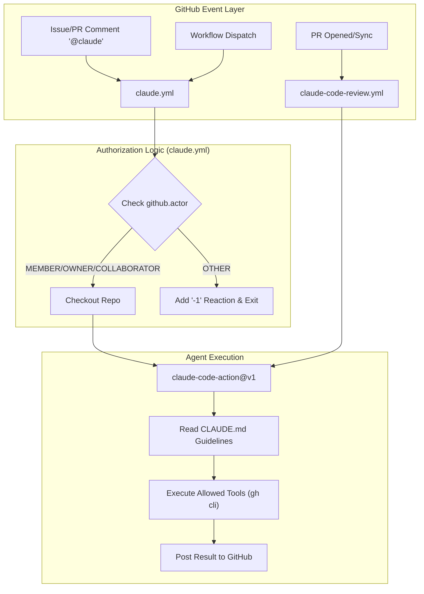
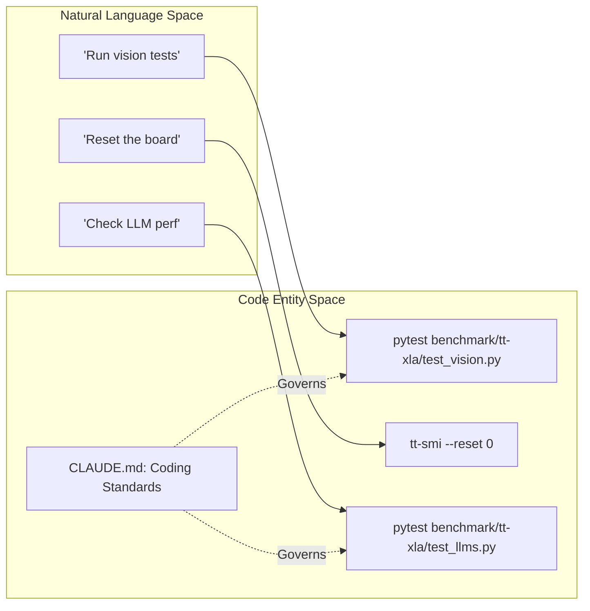
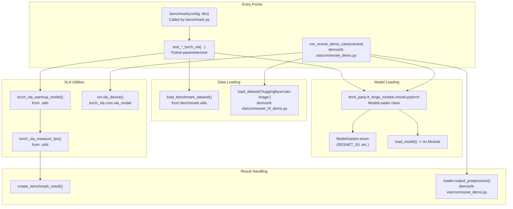

# Claude Code Integration

Relevant source files
*   [.github/workflows/claude-code-review.yml](https://github.com/tenstorrent/tt-forge/blob/6f2d9645/.github/workflows/claude-code-review.yml)
*   [.github/workflows/claude.yml](https://github.com/tenstorrent/tt-forge/blob/6f2d9645/.github/workflows/claude.yml)
*   [CLAUDE.md](https://github.com/tenstorrent/tt-forge/blob/6f2d9645/CLAUDE.md?plain=1)

The Claude Code integration in TT-Forge provides an AI-driven automation layer for code review, issue resolution, and interactive development assistance. By leveraging the `anthropics/claude-code-action`, the repository allows authorized users to invoke Claude directly through GitHub events to perform complex tasks such as analyzing PR diffs, creating issues, or triggering CI workflows.

## Overview and Purpose

The integration is designed to bridge the gap between natural language requests and actionable code changes. It utilizes two primary workflows:

1.   **Generic Claude Action (`claude.yml`)**: A multi-purpose entry point for interacting with Claude via issue comments, PR comments, or manual triggers.
2.   **Claude Code PR Review (`claude-code-review.yml`)**: A specialized workflow focused on automated quality assurance and performance analysis of Pull Requests.

### Implementation Architecture

The system operates by monitoring GitHub events and verifying the authorization of the actor before spawning an ephemeral runner that executes the Claude Code agent.

**Data Flow and Authorization Model**

Sources: [.github/workflows/claude.yml 1-33](https://github.com/tenstorrent/tt-forge/blob/6f2d9645/.github/workflows/claude.yml#L1-L33)[.github/workflows/claude.yml 35-91](https://github.com/tenstorrent/tt-forge/blob/6f2d9645/.github/workflows/claude.yml#L35-L91)[.github/workflows/claude-code-review.yml 1-18](https://github.com/tenstorrent/tt-forge/blob/6f2d9645/.github/workflows/claude-code-review.yml#L1-L18)



Sources: [.github/workflows/claude.yml:1-33](), [.github/workflows/claude.yml:35-91](), [.github/workflows/claude-code-review.yml:1-18]()
```
## Claude Code Generic Action (`claude.yml`)

The `claude.yml` workflow serves as the primary interface for interactive assistance. It is triggered by the presence of the `@claude` handle in issue comments, PR reviews, or issue bodies [.github/workflows/claude.yml 10-26](https://github.com/tenstorrent/tt-forge/blob/6f2d9645/.github/workflows/claude.yml#L10-L26)

### Authorization Model

To prevent unauthorized use of API credits and potential security risks, the workflow implements a strict check on the `author_association` of the user triggering the event [.github/workflows/claude.yml 41-58](https://github.com/tenstorrent/tt-forge/blob/6f2d9645/.github/workflows/claude.yml#L41-L58)

*   **Allowed Roles**: `MEMBER`, `OWNER`, or `COLLABORATOR`[.github/workflows/claude.yml 65](https://github.com/tenstorrent/tt-forge/blob/6f2d9645/.github/workflows/claude.yml#L65-L65)
*   **Failure Handling**: If a user does not meet these criteria, the workflow adds a thumbs-down (`-1`) reaction to the triggering comment or issue and terminates with an error [.github/workflows/claude.yml 74-90](https://github.com/tenstorrent/tt-forge/blob/6f2d9645/.github/workflows/claude.yml#L74-L90)

### Allowed Tools and Permissions

The agent is granted specific permissions to interact with the GitHub ecosystem via the `gh` CLI. This allows Claude to not only read code but also manage the project lifecycle.

| Tool Category | Allowed Commands / Patterns | Purpose |
| --- | --- | --- |
| **Issues** | `gh issue create`, `gh issue view`, `gh issue list` | Bug reporting and task tracking |
| **Pull Requests** | `gh pr create`, `gh pr comment`, `gh pr diff`, `gh pr view` | Automated code contribution and feedback |
| **Workflows** | `gh run list`, `gh run view`, `gh workflow list` | Monitoring CI status and triggering builds |
| **Search** | `gh search` | Context gathering across the repository |

Sources: [.github/workflows/claude.yml 105-123](https://github.com/tenstorrent/tt-forge/blob/6f2d9645/.github/workflows/claude.yml#L105-L123)

## Claude Code PR Review (`claude-code-review.yml`)

This workflow is specialized for automated code analysis. It focuses on identifying critical issues in Pull Requests before human review [.github/workflows/claude-code-review.yml 34-40](https://github.com/tenstorrent/tt-forge/blob/6f2d9645/.github/workflows/claude-code-review.yml#L34-L40)

### Review Focus Areas

The agent is prompted to analyze changes with specific attention to:

*   **Correctness and Bugs**: Identifying logic errors in the compiler or runtime.
*   **Code Quality**: Ensuring adherence to the repository's coding standards.
*   **Performance**: Detecting potential regressions in the MLIR passes or hardware utilization.
*   **Structure**: Comparing new changes against the existing architecture defined in `CLAUDE.md`.

### Execution Flow

The agent uses the `gh pr diff` tool to ingest the PR changes and `gh pr comment` to submit its findings [.github/workflows/claude-code-review.yml 45-47](https://github.com/tenstorrent/tt-forge/blob/6f2d9645/.github/workflows/claude-code-review.yml#L45-L47) If no critical issues are found, it is instructed to provide a simple approval [.github/workflows/claude-code-review.yml 41](https://github.com/tenstorrent/tt-forge/blob/6f2d9645/.github/workflows/claude-code-review.yml#L41-L41)

Sources: [.github/workflows/claude-code-review.yml 25-47](https://github.com/tenstorrent/tt-forge/blob/6f2d9645/.github/workflows/claude-code-review.yml#L25-L47)

## Agent Guidance: CLAUDE.md

The `CLAUDE.md` file acts as the "system prompt" or "knowledge base" for the agent, providing it with the necessary context to operate within the TT-Forge environment.

### Code Entity Mapping

The following diagram illustrates how the agent maps natural language concepts to specific code entities and commands as defined in the guidance file.

Sources: [CLAUDE.md 15-62](https://github.com/tenstorrent/tt-forge/blob/6f2d9645/CLAUDE.md?plain=1#L15-L62)[CLAUDE.md 86-112](https://github.com/tenstorrent/tt-forge/blob/6f2d9645/CLAUDE.md?plain=1#L86-L112)



Sources: [CLAUDE.md:15-62](), [CLAUDE.md:86-112]()
```




Sources: [benchmark/tt-xla/resnet.py:32-42](), [demos/tt-xla/cnn/resnet_demo.py:18-38](), [demos/tt-xla/cnn/resnet_hf_demo.py:23-35]()
```
### Key Development Context for Claude

*   **Compiler Flow**: The agent understands the progression from `Frontend Layer` → `TT-MLIR Compiler` → `TT-Metalium` → `Hardware`[CLAUDE.md 66-84](https://github.com/tenstorrent/tt-forge/blob/6f2d9645/CLAUDE.md?plain=1#L66-L84)
*   **Sub-Projects**: It is aware of the roles of `TT-MLIR`, `TT-XLA`, and `TT-Forge-ONNX`[CLAUDE.md 9-13](https://github.com/tenstorrent/tt-forge/blob/6f2d9645/CLAUDE.md?plain=1#L9-L13)
*   **Standards**: It enforces the use of SPDX headers and specific branch naming conventions (`<user>/<issue_number>`) [CLAUDE.md 88-104](https://github.com/tenstorrent/tt-forge/blob/6f2d9645/CLAUDE.md?plain=1#L88-L104)

## Invocation Examples

### Manual Trigger

Authorized users can trigger the agent via the GitHub Actions UI by providing a prompt to the `workflow_dispatch` input of the "Claude Code Generic Action" [.github/workflows/claude.yml 4-9](https://github.com/tenstorrent/tt-forge/blob/6f2d9645/.github/workflows/claude.yml#L4-L9)

### Issue/PR Commands

To invoke Claude within an issue or PR, use the following syntax:

`@claude please analyze the performance logs in this PR and suggest optimizations for the TTNN layout.`
The workflow will detect the `@claude` string, verify your identity, and execute the agent with the context of that specific issue or PR [.github/workflows/claude.yml 21-26](https://github.com/tenstorrent/tt-forge/blob/6f2d9645/.github/workflows/claude.yml#L21-L26)

Sources: [.github/workflows/claude.yml 1-26](https://github.com/tenstorrent/tt-forge/blob/6f2d9645/.github/workflows/claude.yml#L1-L26)

Dismiss
Refresh this wiki

Enter email to refresh
