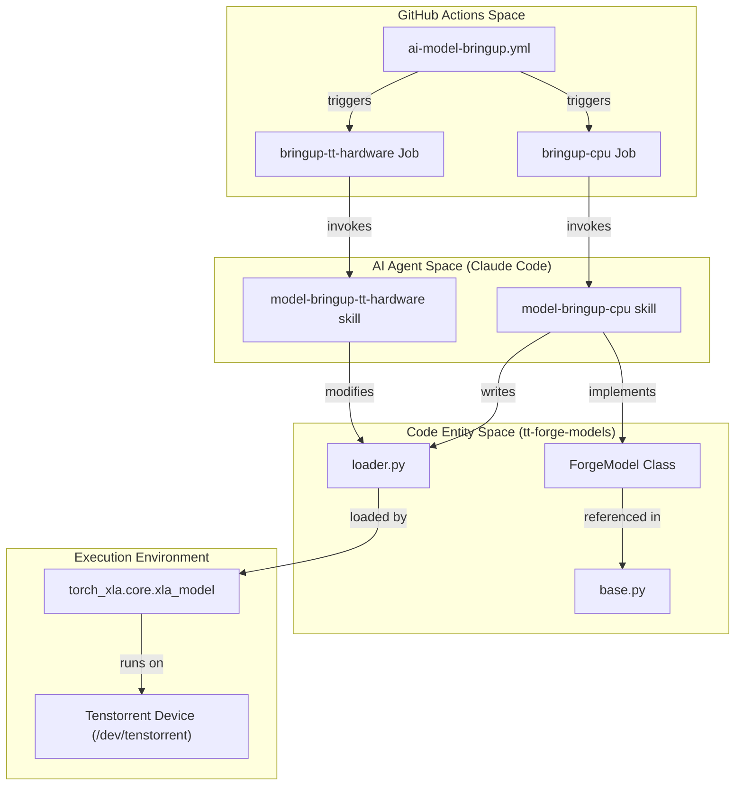

# Automated Model Bringup

Relevant source files
*   [.claude/skills/model-bringup-cpu/SKILL.md](https://github.com/tenstorrent/tt-forge/blob/6f2d9645/.claude/skills/model-bringup-cpu/SKILL.md?plain=1)
*   [.claude/skills/model-bringup-tt-hardware/SKILL.md](https://github.com/tenstorrent/tt-forge/blob/6f2d9645/.claude/skills/model-bringup-tt-hardware/SKILL.md?plain=1)
*   [.github/workflows/ai-model-bringup-master.yml](https://github.com/tenstorrent/tt-forge/blob/6f2d9645/.github/workflows/ai-model-bringup-master.yml)
*   [.github/workflows/ai-model-bringup.yml](https://github.com/tenstorrent/tt-forge/blob/6f2d9645/.github/workflows/ai-model-bringup.yml)

The Automated Model Bringup system leverages AI agents (Claude Code) to automate the end-to-end process of onboarding HuggingFace models onto Tenstorrent hardware. This system automates the creation of model loaders, validation on CPU, and iterative debugging on hardware, significantly reducing the manual effort required for model support.

## Overview and Workflows

The bringup infrastructure is orchestrated through two primary GitHub Actions workflows that manage the lifecycle of model integration.

### ai-model-bringup.yml

This is the core execution workflow for a single model. It is divided into three distinct phases:

1.   **Parsing**: Extracting model identifiers and slugs from HuggingFace URLs `<FileRef file-url="https://github.com/tenstorrent/tt-forge/blob/6f2d9645/.github/workflows/ai-model-bringup.yml#L59-L78" min=59 max=78 file-path=".github/workflows/ai-model-bringup.yml">Hii</FileRef>`.
2.   **CPU Bringup**: Running a Claude agent in a containerized environment to write a `ForgeModel` loader and validate it using a CPU-based PyTorch environment `<FileRef file-url="https://github.com/tenstorrent/tt-forge/blob/6f2d9645/.github/workflows/ai-model-bringup.yml#L91-L160" min=91 max=160 file-path=".github/workflows/ai-model-bringup.yml">Hii</FileRef>`.
3.   **Hardware Bringup**: Running a Claude agent on a Tenstorrent runner (e.g., `n150`) to execute the model on silicon, iterate on compilation or data type errors, and open a Pull Request to `tt-forge-models``<FileRef file-url="https://github.com/tenstorrent/tt-forge/blob/6f2d9645/.github/workflows/ai-model-bringup.yml#L223-L286" min=223 max=286 file-path=".github/workflows/ai-model-bringup.yml">Hii</FileRef>`.

### ai-model-bringup-master.yml

This workflow acts as a batch orchestrator. It accepts a JSON array of model specifications and uses a GitHub Actions strategy matrix to "fan-out" multiple `ai-model-bringup.yml` runs in parallel `<FileRef file-url="https://github.com/tenstorrent/tt-forge/blob/6f2d9645/.github/workflows/ai-model-bringup-master.yml#L29-L39" min=29 max=39 file-path=".github/workflows/ai-model-bringup-master.yml">Hii</FileRef>`. Upon completion, it aggregates all individual reports into a single `GITHUB_STEP_SUMMARY` using an AI agent to synthesize the results `<FileRef file-url="https://github.com/tenstorrent/tt-forge/blob/6f2d9645/.github/workflows/ai-model-bringup-master.yml#L42-L89" min=42 max=89 file-path=".github/workflows/ai-model-bringup-master.yml">Hii</FileRef>`.

**Sources:**

*   `<FileRef file-url="https://github.com/tenstorrent/tt-forge/blob/6f2d9645/.github/workflows/ai-model-bringup.yml" undefined  file-path=".github/workflows/ai-model-bringup.yml">Hii</FileRef>`
*   `<FileRef file-url="https://github.com/tenstorrent/tt-forge/blob/6f2d9645/.github/workflows/ai-model-bringup-master.yml" undefined  file-path=".github/workflows/ai-model-bringup-master.yml">Hii</FileRef>`

## ForgeModel Interface

The AI agent is instructed to implement the `ForgeModel` interface, which provides a standardized way for TT-Forge to interact with various model architectures.

| Method | Purpose |
| --- | --- |
| `load_model(dtype_override)` | Loads the model from HuggingFace (usually via `transformers`) and applies specific dtypes `<FileRef file-url="https://github.com/tenstorrent/tt-forge/blob/6f2d9645/.claude/skills/model-bringup-cpu/SKILL.md?plain=1#L106-L106" min=106 file-path=".claude/skills/model-bringup-cpu/SKILL.md">Hii</FileRef>`. |
| `load_inputs(dtype_override)` | Generates a dictionary of sample inputs (tensors or tokenized text) for validation `<FileRef file-url="https://github.com/tenstorrent/tt-forge/blob/6f2d9645/.claude/skills/model-bringup-cpu/SKILL.md?plain=1#L107-L107" min=107 file-path=".claude/skills/model-bringup-cpu/SKILL.md">Hii</FileRef>`. |
| `_get_model_info()` | Returns metadata including `ModelGroup`, `ModelTask`, and `Framework``<FileRef file-url="https://github.com/tenstorrent/tt-forge/blob/6f2d9645/.claude/skills/model-bringup-cpu/SKILL.md?plain=1#L105-L105" min=105 file-path=".claude/skills/model-bringup-cpu/SKILL.md">Hii</FileRef>`. |

The agent uses existing loaders (e.g., `llama/causal_lm/pytorch/loader.py`) as templates to ensure consistency in directory structure and implementation patterns `<FileRef file-url="https://github.com/tenstorrent/tt-forge/blob/6f2d9645/.claude/skills/model-bringup-cpu/SKILL.md?plain=1#L42-L50" min=42 max=50 file-path=".claude/skills/model-bringup-cpu/SKILL.md">Hii</FileRef>`.

**Sources:**

*   `<FileRef file-url="https://github.com/tenstorrent/tt-forge/blob/6f2d9645/.claude/skills/model-bringup-cpu/SKILL.md?plain=1" undefined  file-path=".claude/skills/model-bringup-cpu/SKILL.md">Hii</FileRef>`

## Bringup Lifecycle

The bringup process transitions from abstract model definitions to physical hardware execution through a series of gated steps.

### Phase 1: CPU Validation

The agent operates within the `tt-xla-base-ubuntu-24-04` container. Its primary goal is to produce a valid `loader.py` file `<FileRef file-url="https://github.com/tenstorrent/tt-forge/blob/6f2d9645/.github/workflows/ai-model-bringup.yml#L81-L89" min=81 max=89 file-path=".github/workflows/ai-model-bringup.yml">Hii</FileRef>`.

*   **Environment**: Includes `uv`, `git`, and a pre-configured `tt-xla` virtual environment `<FileRef file-url="https://github.com/tenstorrent/tt-forge/blob/6f2d9645/.github/workflows/ai-model-bringup.yml#L129-L135" min=129 max=135 file-path=".github/workflows/ai-model-bringup.yml">Hii</FileRef>`.
*   **Validation**: The agent must successfully run the model on CPU for at least one forward pass `<FileRef file-url="https://github.com/tenstorrent/tt-forge/blob/6f2d9645/.claude/skills/model-bringup-cpu/SKILL.md?plain=1#L126-L144" min=126 max=144 file-path=".claude/skills/model-bringup-cpu/SKILL.md">Hii</FileRef>`.
*   **Persistence**: If successful, the workflow commits the new loader to a branch named `claude/bringup-<model-name>` in the `tt-forge-models` repository `<FileRef file-url="https://github.com/tenstorrent/tt-forge/blob/6f2d9645/.github/workflows/ai-model-bringup.yml#L161-L190" min=161 max=190 file-path=".github/workflows/ai-model-bringup.yml">Hii</FileRef>`.

### Phase 2: Hardware Validation

The agent moves to a runner with physical Tenstorrent devices (e.g., Wormhole N150).

*   **Iteration**: The agent is allowed up to 4 attempts to fix hardware-specific issues `<FileRef file-url="https://github.com/tenstorrent/tt-forge/blob/6f2d9645/.claude/skills/model-bringup-tt-hardware/SKILL.md?plain=1#L36-L62" min=36 max=62 file-path=".claude/skills/model-bringup-tt-hardware/SKILL.md">Hii</FileRef>`.
*   **Fix Strategies**: 
    *   Attempt 1: Standard `bfloat16` execution.
    *   Attempt 2: Fallback to `float32` if dtype errors occur.
    *   Attempt 3: Reduce sequence lengths or modify inputs to bypass compilation limits.
    *   Attempt 4: Modify the `loader.py` itself to accommodate hardware constraints.

*   **Completion**: On success, the agent opens a Pull Request `<FileRef file-url="https://github.com/tenstorrent/tt-forge/blob/6f2d9645/.claude/skills/model-bringup-tt-hardware/SKILL.md?plain=1#L69-L72" min=69 max=72 file-path=".claude/skills/model-bringup-tt-hardware/SKILL.md">Hii</FileRef>`.

### Data Flow and Entity Mapping

The following diagram illustrates how the GitHub Workflow entities map to the AI Agent skills and the underlying repository structure.

**Workflow to Code Entity Mapping**

**Sources:**

*   `<FileRef file-url="https://github.com/tenstorrent/tt-forge/blob/6f2d9645/.github/workflows/ai-model-bringup.yml" undefined  file-path=".github/workflows/ai-model-bringup.yml">Hii</FileRef>`
*   `<FileRef file-url="https://github.com/tenstorrent/tt-forge/blob/6f2d9645/.claude/skills/model-bringup-cpu/SKILL.md?plain=1" undefined  file-path=".claude/skills/model-bringup-cpu/SKILL.md">Hii</FileRef>`
*   `<FileRef file-url="https://github.com/tenstorrent/tt-forge/blob/6f2d9645/.claude/skills/model-bringup-tt-hardware/SKILL.md?plain=1" undefined  file-path=".claude/skills/model-bringup-tt-hardware/SKILL.md">Hii</FileRef>`

## Batch Orchestration and Reporting

The `ai-model-bringup-master.yml` workflow provides a centralized interface for large-scale model onboarding.

### Batch Execution Flow

### Result Aggregation

The summary agent is responsible for:

1.   Discovering all model artifacts in the `./artifacts/` directory `<FileRef file-url="https://github.com/tenstorrent/tt-forge/blob/6f2d9645/.github/workflows/ai-model-bringup-master.yml#L75-L76" min=75 max=76 file-path=".github/workflows/ai-model-bringup-master.yml">Hii</FileRef>`.
2.   Parsing `bringup-cpu-status.txt` and `bringup-hw-status.txt` to determine success/failure `<FileRef file-url="https://github.com/tenstorrent/tt-forge/blob/6f2d9645/.github/workflows/ai-model-bringup-master.yml#L70-L71" min=70 max=71 file-path=".github/workflows/ai-model-bringup-master.yml">Hii</FileRef>`.
3.   Generating a Markdown table that links to generated Pull Requests and provides collapsible `
` sections for raw logs `<FileRef file-url="https://github.com/tenstorrent/tt-forge/blob/6f2d9645/.github/workflows/ai-model-bringup-master.yml#L79-L85" min=79 max=85 file-path=".github/workflows/ai-model-bringup-master.yml">Hii</FileRef>`.

**Sources:**

*   `<FileRef file-url="https://github.com/tenstorrent/tt-forge/blob/6f2d9645/.github/workflows/ai-model-bringup-master.yml#L42-L89" min=42 max=89 file-path=".github/workflows/ai-model-bringup-master.yml">Hii</FileRef>`
*   `<FileRef file-url="https://github.com/tenstorrent/tt-forge/blob/6f2d9645/.github/workflows/ai-model-bringup.yml#L193-L219" min=193 max=219 file-path=".github/workflows/ai-model-bringup.yml">Hii</FileRef>` (Artifact upload sites)

Dismiss
Refresh this wiki

Enter email to refresh
