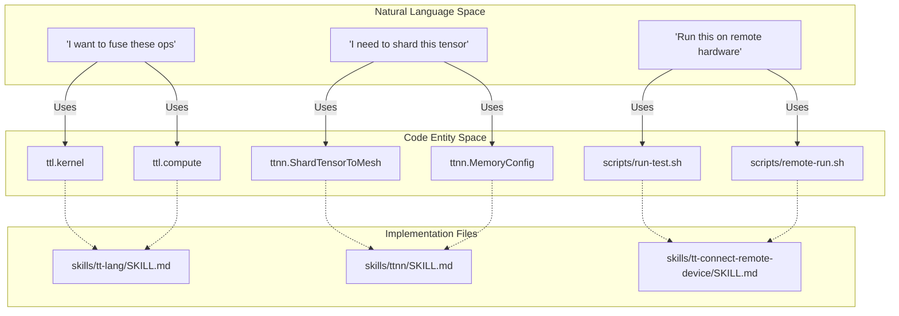

# Skills and Agent Tools

Relevant source files
*   [skills/tt-connect-remote-device/SKILL.md](https://github.com/tenstorrent/tt-forge/blob/6f2d9645/skills/tt-connect-remote-device/SKILL.md?plain=1)
*   [skills/tt-lang/SKILL.md](https://github.com/tenstorrent/tt-forge/blob/6f2d9645/skills/tt-lang/SKILL.md?plain=1)
*   [skills/ttnn/SKILL.md](https://github.com/tenstorrent/tt-forge/blob/6f2d9645/skills/ttnn/SKILL.md?plain=1)

The `skills/` directory serves as a structured repository of reference guides and operational playbooks designed for both human developers and AI agents (such as Claude). These "skills" encapsulate the technical knowledge required to interact with the Tenstorrent software stack, ranging from high-level tensor operations to low-level hardware kernel development.

This page provides a high-level overview of the available skill sets and how they relate to the broader TT-Forge ecosystem.

## Skill Architecture Overview

The skills are organized to bridge the gap between high-level intent (Natural Language Space) and executable code or hardware interactions (Code Entity Space).

### Mapping Natural Language to Code Entities

The following diagram illustrates how developer intent is mapped to specific code entities within the skills infrastructure.

**Developer Intent to Code Mapping**

**Sources:**[skills/tt-lang/SKILL.md 1-5](https://github.com/tenstorrent/tt-forge/blob/6f2d9645/skills/tt-lang/SKILL.md?plain=1#L1-L5)[skills/ttnn/SKILL.md 1-4](https://github.com/tenstorrent/tt-forge/blob/6f2d9645/skills/ttnn/SKILL.md?plain=1#L1-L4)[skills/tt-connect-remote-device/SKILL.md 1-5](https://github.com/tenstorrent/tt-forge/blob/6f2d9645/skills/tt-connect-remote-device/SKILL.md?plain=1#L1-L5)

## Core Skill Categories

### 8.1 TT-Lang Kernel DSL

TT-Lang is a Python-based Domain Specific Language (DSL) used for authoring high-performance kernels that run directly on Tenstorrent's Tensix cores. It allows developers to bypass the overhead of individual op launches by fusing multiple operations into a single kernel.

*   **Programming Model:** Uses a three-thread model consisting of a `compute` thread, a `reader` thread, and a `writer` thread [skills/tt-lang/SKILL.md 54-61](https://github.com/tenstorrent/tt-forge/blob/6f2d9645/skills/tt-lang/SKILL.md?plain=1#L54-L61)
*   **Synchronization:** Threads communicate and synchronize via Dataflow Buffers (DFBs) [skills/tt-lang/SKILL.md 61](https://github.com/tenstorrent/tt-forge/blob/6f2d9645/skills/tt-lang/SKILL.md?plain=1#L61-L61)
*   **Optimization:** Supports manual tiling, double buffering (via `buffer_factor`), and explicit L1 memory management [skills/tt-lang/SKILL.md 121-150](https://github.com/tenstorrent/tt-forge/blob/6f2d9645/skills/tt-lang/SKILL.md?plain=1#L121-L150)

For details, see [TT-Lang Kernel DSL](https://deepwiki.com/tenstorrent/tt-forge/8.1-tt-lang-kernel-dsl).

### 8.2 TTNN Operations Library

TTNN is the primary high-level library for Tenstorrent hardware, providing a PyTorch-like interface for tensor manipulation and standard neural network layers.

*   **Tensor Management:** Handles movement between Host and Device using `ttnn.to_device` and `ttnn.from_torch`[skills/ttnn/SKILL.md 103-119](https://github.com/tenstorrent/tt-forge/blob/6f2d9645/skills/ttnn/SKILL.md?plain=1#L103-L119)
*   **Memory Configurations:** Supports sharding strategies (Height, Width, Block) and different memory layouts like `ttnn.TILE_LAYOUT`[skills/ttnn/SKILL.md 14-106](https://github.com/tenstorrent/tt-forge/blob/6f2d9645/skills/ttnn/SKILL.md?plain=1#L14-L106)
*   **Multi-Device:** Utilizes the `MeshDevice` abstraction to scale workloads across multiple chips using Tensor Parallelism or Data Parallelism [skills/ttnn/SKILL.md 16-46](https://github.com/tenstorrent/tt-forge/blob/6f2d9645/skills/ttnn/SKILL.md?plain=1#L16-L46)

For details, see [TTNN Operations Library](https://deepwiki.com/tenstorrent/tt-forge/8.2-ttnn-operations-library).

### 8.3 Hardware Tooling Skills

These skills focus on the operational aspects of interacting with physical Tenstorrent silicon and the functional simulator.

*   **Remote Connectivity:** Managed through scripts in `tt-connect-remote-device`, including `run-test.sh` and `remote-run.sh`[skills/tt-connect-remote-device/SKILL.md 25-32](https://github.com/tenstorrent/tt-forge/blob/6f2d9645/skills/tt-connect-remote-device/SKILL.md?plain=1#L25-L32)
*   **Validation:** Includes a mandatory `smoke-test.sh` to verify environment readiness before execution [skills/tt-connect-remote-device/SKILL.md 11-15](https://github.com/tenstorrent/tt-forge/blob/6f2d9645/skills/tt-connect-remote-device/SKILL.md?plain=1#L11-L15)
*   **Debugging:** Provides tools for reading remote logs and retrieving generated MLIR artifacts from the device [skills/tt-connect-remote-device/SKILL.md 36-43](https://github.com/tenstorrent/tt-forge/blob/6f2d9645/skills/tt-connect-remote-device/SKILL.md?plain=1#L36-L43)

For details, see [Hardware Tooling Skills](https://deepwiki.com/tenstorrent/tt-forge/8.3-hardware-tooling-skills).

## Programming Model Hierarchy

The following diagram demonstrates the relationship between the different programming abstractions provided in the `skills/` directory.

**Abstraction Layers and Tooling**

**Sources:**[skills/tt-lang/SKILL.md 21-44](https://github.com/tenstorrent/tt-forge/blob/6f2d9645/skills/tt-lang/SKILL.md?plain=1#L21-L44)[skills/ttnn/SKILL.md 99-100](https://github.com/tenstorrent/tt-forge/blob/6f2d9645/skills/ttnn/SKILL.md?plain=1#L99-L100)[skills/tt-connect-remote-device/SKILL.md 25-34](https://github.com/tenstorrent/tt-forge/blob/6f2d9645/skills/tt-connect-remote-device/SKILL.md?plain=1#L25-L34)

## Summary Table of Tools

| Skill Name | Primary Entity/Tool | Use Case |
| --- | --- | --- |
| **TT-Lang** | `@ttl.kernel` | Custom op fusion and low-level kernel optimization [skills/tt-lang/SKILL.md 31-33](https://github.com/tenstorrent/tt-forge/blob/6f2d9645/skills/tt-lang/SKILL.md?plain=1#L31-L33) |
| **TTNN** | `ttnn.MeshDevice` | High-level model execution and multi-chip scaling [skills/ttnn/SKILL.md 26-27](https://github.com/tenstorrent/tt-forge/blob/6f2d9645/skills/ttnn/SKILL.md?plain=1#L26-L27) |
| **Remote Device** | `run-test.sh` | Executing Python kernels on remote hardware or simulators [skills/tt-connect-remote-device/SKILL.md 26-27](https://github.com/tenstorrent/tt-forge/blob/6f2d9645/skills/tt-connect-remote-device/SKILL.md?plain=1#L26-L27) |
| **Tracing** | `tt-enable-tracing` | Reducing host overhead by capturing op sequences [skills/ttnn/SKILL.md 67-69](https://github.com/tenstorrent/tt-forge/blob/6f2d9645/skills/ttnn/SKILL.md?plain=1#L67-L69) |

**Sources:**[skills/tt-lang/SKILL.md 1-5](https://github.com/tenstorrent/tt-forge/blob/6f2d9645/skills/tt-lang/SKILL.md?plain=1#L1-L5)[skills/ttnn/SKILL.md 1-4](https://github.com/tenstorrent/tt-forge/blob/6f2d9645/skills/ttnn/SKILL.md?plain=1#L1-L4)[skills/tt-connect-remote-device/SKILL.md 1-5](https://github.com/tenstorrent/tt-forge/blob/6f2d9645/skills/tt-connect-remote-device/SKILL.md?plain=1#L1-L5)

Dismiss
Refresh this wiki

Enter email to refresh
