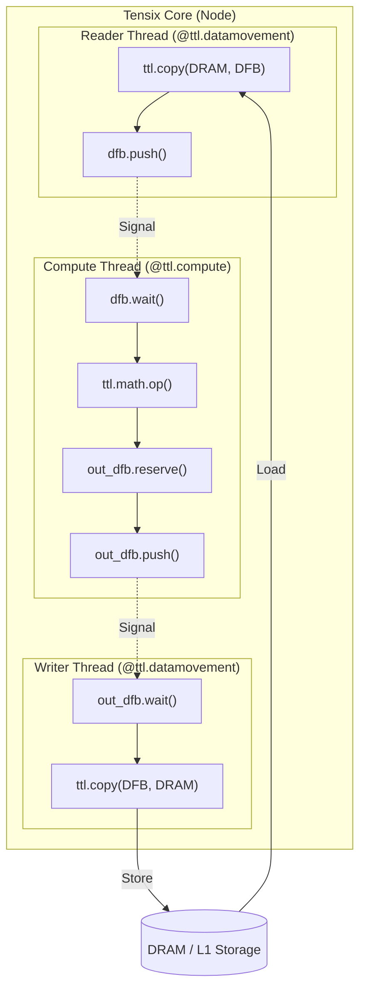
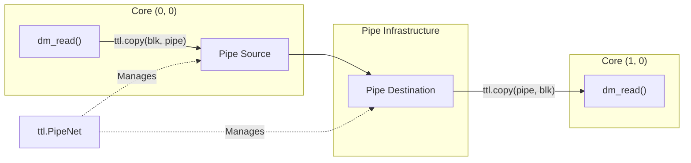

# TT-Lang Kernel DSL

Relevant source files
*   [skills/tt-lang/SKILL.md](https://github.com/tenstorrent/tt-forge/blob/6f2d9645/skills/tt-lang/SKILL.md?plain=1)
*   [skills/tt-lang/TTLangSpecification.md](https://github.com/tenstorrent/tt-forge/blob/6f2d9645/skills/tt-lang/TTLangSpecification.md?plain=1)
*   [skills/tt-lang/examples.md](https://github.com/tenstorrent/tt-forge/blob/6f2d9645/skills/tt-lang/examples.md?plain=1)
*   [skills/tt-lang/extern_references.md](https://github.com/tenstorrent/tt-forge/blob/6f2d9645/skills/tt-lang/extern_references.md?plain=1)

TT-Lang is a Python-based **Domain Specific Language (DSL)** designed for authoring high-performance kernels on Tenstorrent hardware [skills/tt-lang/TTLangSpecification.md 46-48](https://github.com/tenstorrent/tt-forge/blob/6f2d9645/skills/tt-lang/TTLangSpecification.md?plain=1#L46-L48) It allows developers to express fine-grained data movement and compute logic while maintaining tight integration with the `ttnn` library [skills/tt-lang/TTLangSpecification.md 48-50](https://github.com/tenstorrent/tt-forge/blob/6f2d9645/skills/tt-lang/TTLangSpecification.md?plain=1#L48-L50)

## Programming Model

The TT-Lang programming model is centered around three concurrent threads of execution on each Tensix core, synchronized via **Dataflow Buffers (DFBs)**[skills/tt-lang/SKILL.md 56-61](https://github.com/tenstorrent/tt-forge/blob/6f2d9645/skills/tt-lang/SKILL.md?plain=1#L56-L61)

### The Three-Thread Model

1.   **Compute Thread** (`@ttl.compute()`): Handles math operations (SIMD/FPU) on tiles resident in L1 memory [skills/tt-lang/SKILL.md 57](https://github.com/tenstorrent/tt-forge/blob/6f2d9645/skills/tt-lang/SKILL.md?plain=1#L57-L57)
2.   **Reader Thread** (`@ttl.datamovement()`): Manages data movement from DRAM/L1 to local Dataflow Buffers [skills/tt-lang/SKILL.md 58](https://github.com/tenstorrent/tt-forge/blob/6f2d9645/skills/tt-lang/SKILL.md?plain=1#L58-L58)
3.   **Writer Thread** (`@ttl.datamovement()`): Manages data movement from local Dataflow Buffers back to DRAM/L1 [skills/tt-lang/SKILL.md 59](https://github.com/tenstorrent/tt-forge/blob/6f2d9645/skills/tt-lang/SKILL.md?plain=1#L59-L59)

### Kernel Execution Flow

The following diagram illustrates how a kernel definition maps to hardware execution threads and the synchronization points between them.

**Kernel Thread Synchronization**

Sources: [skills/tt-lang/SKILL.md 56-63](https://github.com/tenstorrent/tt-forge/blob/6f2d9645/skills/tt-lang/SKILL.md?plain=1#L56-L63)[skills/tt-lang/TTLangSpecification.md 52-54](https://github.com/tenstorrent/tt-forge/blob/6f2d9645/skills/tt-lang/TTLangSpecification.md?plain=1#L52-L54)



Sources: [skills/tt-lang/SKILL.md:56-63](), [skills/tt-lang/TTLangSpecification.md:52-54]()
```
## Dataflow Buffers (DFB)

Dataflow Buffers are the primary abstraction for managing L1 memory and synchronizing threads. They replace the lower-level concept of Circular Buffers (CBs) with a more Pythonic interface [skills/tt-lang/TTLangSpecification.md 36](https://github.com/tenstorrent/tt-forge/blob/6f2d9645/skills/tt-lang/TTLangSpecification.md?plain=1#L36-L36)

### Key API Operations

*   **`ttl.make_dataflow_buffer_like`**: Creates a DFB based on an existing tensor's metadata, defining the **block size** in tiles [skills/tt-lang/SKILL.md 123-127](https://github.com/tenstorrent/tt-forge/blob/6f2d9645/skills/tt-lang/SKILL.md?plain=1#L123-L127)
*   **`reserve()`**: Producer blocks until there is space in the buffer [skills/tt-lang/SKILL.md 134](https://github.com/tenstorrent/tt-forge/blob/6f2d9645/skills/tt-lang/SKILL.md?plain=1#L134-L134)
*   **`push()`**: Producer signals that data is ready for the consumer [skills/tt-lang/SKILL.md 135](https://github.com/tenstorrent/tt-forge/blob/6f2d9645/skills/tt-lang/SKILL.md?plain=1#L135-L135)
*   **`wait()`**: Consumer blocks until data is available [skills/tt-lang/SKILL.md 130](https://github.com/tenstorrent/tt-forge/blob/6f2d9645/skills/tt-lang/SKILL.md?plain=1#L130-L130)
*   **`pop()`**: Consumer releases the block back to the producer [skills/tt-lang/SKILL.md 131](https://github.com/tenstorrent/tt-forge/blob/6f2d9645/skills/tt-lang/SKILL.md?plain=1#L131-L131)

### Context Managers

The preferred way to interact with DFBs is using the `with` statement, which automatically handles the `push`/`pop` or `reserve`/`wait` lifecycle [skills/tt-lang/SKILL.md 98-117](https://github.com/tenstorrent/tt-forge/blob/6f2d9645/skills/tt-lang/SKILL.md?plain=1#L98-L117)

`with input_dfb.wait() as blk: # Auto-pops at end of block    with output_dfb.reserve() as out: # Auto-pushes at end of block        out.store(ttl.math.exp(blk))`
Sources: [skills/tt-lang/SKILL.md 119-146](https://github.com/tenstorrent/tt-forge/blob/6f2d9645/skills/tt-lang/SKILL.md?plain=1#L119-L146)[skills/tt-lang/TTLangSpecification.md 38](https://github.com/tenstorrent/tt-forge/blob/6f2d9645/skills/tt-lang/TTLangSpecification.md?plain=1#L38-L38)

## Multi-Tile Processing and Loops

Since DFBs are typically smaller than the full tensor (acting as a sliding window or cache), kernels must iterate over the data in blocks [skills/tt-lang/SKILL.md 147-150](https://github.com/tenstorrent/tt-forge/blob/6f2d9645/skills/tt-lang/SKILL.md?plain=1#L147-L150)

| Concept | Description |
| --- | --- |
| **Block Size** | The number of tiles processed in one `wait`/`reserve` cycle (e.g., `shape=(2, 2)`) [skills/tt-lang/SKILL.md 147-153](https://github.com/tenstorrent/tt-forge/blob/6f2d9645/skills/tt-lang/SKILL.md?plain=1#L147-L153) |
| **Buffer Factor** | Pipeline hint for double/triple buffering. Usually set to 2 [skills/tt-lang/SKILL.md 149](https://github.com/tenstorrent/tt-forge/blob/6f2d9645/skills/tt-lang/SKILL.md?plain=1#L149-L149) |
| **Looping** | The Reader, Compute, and Writer threads must all loop the same number of times to maintain synchronization [skills/tt-lang/SKILL.md 165](https://github.com/tenstorrent/tt-forge/blob/6f2d9645/skills/tt-lang/SKILL.md?plain=1#L165-L165) |

Sources: [skills/tt-lang/SKILL.md 147-168](https://github.com/tenstorrent/tt-forge/blob/6f2d9645/skills/tt-lang/SKILL.md?plain=1#L147-L168)

## PipeNet: Inter-Core Communication

For multi-core or multi-chip kernels, `ttl.PipeNet` and `ttl.Pipe` provide abstractions for moving data between nodes [skills/tt-lang/TTLangSpecification.md 14-15](https://github.com/tenstorrent/tt-forge/blob/6f2d9645/skills/tt-lang/TTLangSpecification.md?plain=1#L14-L15)

**Pipe Dataflow Entity Mapping**

Sources: [skills/tt-lang/examples.md 8-10](https://github.com/tenstorrent/tt-forge/blob/6f2d9645/skills/tt-lang/examples.md?plain=1#L8-L10)[skills/tt-lang/examples.md 28-35](https://github.com/tenstorrent/tt-forge/blob/6f2d9645/skills/tt-lang/examples.md?plain=1#L28-L35)



Sources: [skills/tt-lang/examples.md:8-10](), [skills/tt-lang/examples.md:28-35]()
```
### Pipe Usage Patterns

*   **`net.if_src(callback)`**: Executes a callback if the current node is the source of a pipe in the network [skills/tt-lang/examples.md 30](https://github.com/tenstorrent/tt-forge/blob/6f2d9645/skills/tt-lang/examples.md?plain=1#L30-L30)
*   **`net.if_dst(callback)`**: Executes a callback if the current node is the destination [skills/tt-lang/examples.md 35](https://github.com/tenstorrent/tt-forge/blob/6f2d9645/skills/tt-lang/examples.md?plain=1#L35-L35)
*   **Ring Topology**: Useful for neighbor-exchange patterns like molecular dynamics [skills/tt-lang/examples.md 50-62](https://github.com/tenstorrent/tt-forge/blob/6f2d9645/skills/tt-lang/examples.md?plain=1#L50-L62)

## Available Operations

TT-Lang provides a comprehensive math library that operates on blocks of tiles.

### Math Functions (`ttl.math.*`)

*   **Unary**: `exp`, `log`, `sqrt`, `recip`, `tanh`, `sigmoid`, `relu`, `abs`, `neg`[skills/tt-lang/SKILL.md 192-202](https://github.com/tenstorrent/tt-forge/blob/6f2d9645/skills/tt-lang/SKILL.md?plain=1#L192-L202)
*   **Binary**: `max`, `min`, and standard operators (`+`, `-`, `*`, `/`, `@`) [skills/tt-lang/SKILL.md 175-187](https://github.com/tenstorrent/tt-forge/blob/6f2d9645/skills/tt-lang/SKILL.md?plain=1#L175-L187)
*   **Reductions**: `reduce_sum`, `reduce_max` along specified dimensions [skills/tt-lang/SKILL.md 205-207](https://github.com/tenstorrent/tt-forge/blob/6f2d9645/skills/tt-lang/SKILL.md?plain=1#L205-L207)
*   **Data Manipulation**: `transpose`, `broadcast`, `fill`, `where`[skills/tt-lang/TTLangSpecification.md 35-37](https://github.com/tenstorrent/tt-forge/blob/6f2d9645/skills/tt-lang/TTLangSpecification.md?plain=1#L35-L37)

Sources: [skills/tt-lang/SKILL.md 172-207](https://github.com/tenstorrent/tt-forge/blob/6f2d9645/skills/tt-lang/SKILL.md?plain=1#L172-L207)[skills/tt-lang/TTLangSpecification.md 34-37](https://github.com/tenstorrent/tt-forge/blob/6f2d9645/skills/tt-lang/TTLangSpecification.md?plain=1#L34-L37)

## Translation Guide: Fusing TTNN Operations

A primary use case for TT-Lang is fusing multiple `ttnn` operations into a single kernel to eliminate DRAM round-trips [skills/tt-lang/SKILL.md 21-23](https://github.com/tenstorrent/tt-forge/blob/6f2d9645/skills/tt-lang/SKILL.md?plain=1#L21-L23)

| Original TTNN (Eager) | Fused TT-Lang Kernel |
| --- | --- |
| `x = ttnn.exp(input)` | `inp = input_dfb.wait()` |
| `y = ttnn.add(x, bias)` | `b = bias_dfb.wait()` |
| `z = ttnn.relu(y)` | `res = ttl.math.relu(ttl.math.exp(inp) + b)` |
| (3 DRAM Reads, 3 DRAM Writes) | (1 DRAM Read per input, 1 DRAM Write) |

Sources: [skills/tt-lang/SKILL.md 25-50](https://github.com/tenstorrent/tt-forge/blob/6f2d9645/skills/tt-lang/SKILL.md?plain=1#L25-L50)

Dismiss
Refresh this wiki

Enter email to refresh
