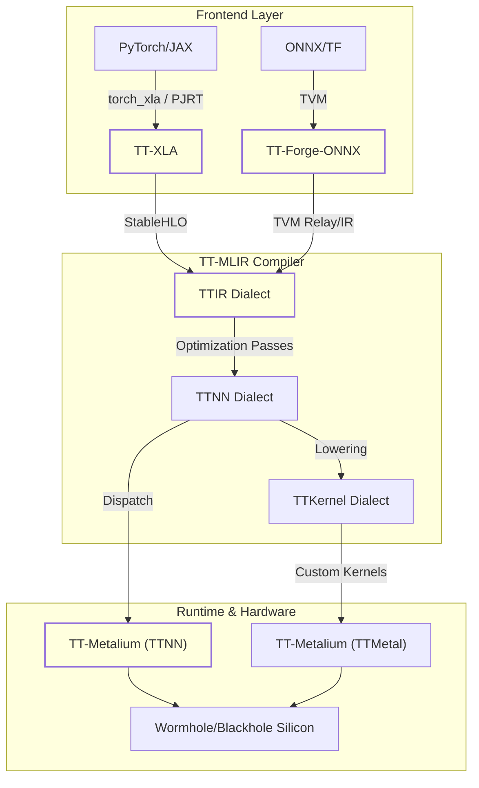

# Glossary

Relevant source files
*   [.claude/skills/model-bringup-cpu/SKILL.md](https://github.com/tenstorrent/tt-forge/blob/6f2d9645/.claude/skills/model-bringup-cpu/SKILL.md?plain=1)
*   [.claude/skills/model-bringup-tt-hardware/SKILL.md](https://github.com/tenstorrent/tt-forge/blob/6f2d9645/.claude/skills/model-bringup-tt-hardware/SKILL.md?plain=1)
*   [.github/workflows/ai-model-bringup-master.yml](https://github.com/tenstorrent/tt-forge/blob/6f2d9645/.github/workflows/ai-model-bringup-master.yml)
*   [.github/workflows/ai-model-bringup.yml](https://github.com/tenstorrent/tt-forge/blob/6f2d9645/.github/workflows/ai-model-bringup.yml)
*   [.github/workflows/claude-code-review.yml](https://github.com/tenstorrent/tt-forge/blob/6f2d9645/.github/workflows/claude-code-review.yml)
*   [.github/workflows/claude.yml](https://github.com/tenstorrent/tt-forge/blob/6f2d9645/.github/workflows/claude.yml)
*   [.github/workflows/pages.yml](https://github.com/tenstorrent/tt-forge/blob/6f2d9645/.github/workflows/pages.yml)
*   [CLAUDE.md](https://github.com/tenstorrent/tt-forge/blob/6f2d9645/CLAUDE.md?plain=1)
*   [README.md](https://github.com/tenstorrent/tt-forge/blob/6f2d9645/README.md?plain=1)
*   [demos/README.md](https://github.com/tenstorrent/tt-forge/blob/6f2d9645/demos/README.md?plain=1)
*   [docs/.gitignore](https://github.com/tenstorrent/tt-forge/blob/6f2d9645/docs/.gitignore)
*   [docs/book.toml](https://github.com/tenstorrent/tt-forge/blob/6f2d9645/docs/book.toml)
*   [docs/src/SUMMARY.md](https://github.com/tenstorrent/tt-forge/blob/6f2d9645/docs/src/SUMMARY.md?plain=1)
*   [docs/src/getting_started.md](https://github.com/tenstorrent/tt-forge/blob/6f2d9645/docs/src/getting_started.md?plain=1)
*   [docs/src/model-bring-up-guide.md](https://github.com/tenstorrent/tt-forge/blob/6f2d9645/docs/src/model-bring-up-guide.md?plain=1)
*   [skills/tt-lang/SKILL.md](https://github.com/tenstorrent/tt-forge/blob/6f2d9645/skills/tt-lang/SKILL.md?plain=1)
*   [skills/ttnn/SKILL.md](https://github.com/tenstorrent/tt-forge/blob/6f2d9645/skills/ttnn/SKILL.md?plain=1)

This page provides definitions and technical context for terms, jargon, and domain-specific concepts used throughout the TT-Forge repository. It serves as a reference for onboarding engineers to bridge the gap between high-level architectural concepts and their implementation in the codebase.

## System Architecture Overview

The following diagram maps the high-level software stack components to their respective project roles and data flow.

### Frontend to Hardware Data Flow

**Sources:**[README.md 15-32](https://github.com/tenstorrent/tt-forge/blob/6f2d9645/README.md?plain=1#L15-L32)[docs/src/model-bring-up-guide.md 30-65](https://github.com/tenstorrent/tt-forge/blob/6f2d9645/docs/src/model-bring-up-guide.md?plain=1#L30-L65)[CLAUDE.md 66-84](https://github.com/tenstorrent/tt-forge/blob/6f2d9645/CLAUDE.md?plain=1#L66-L84)

* * *

## Core Terms and Definitions

### A

*   **AI Model Bringup**: An automated process using Claude AI agents to port HuggingFace models to Tenstorrent hardware. It involves a two-stage pipeline: CPU validation and Hardware validation. 
    *   **Implementation**: Controlled by `.github/workflows/ai-model-bringup.yml` and orchestrated for batches in `.github/workflows/ai-model-bringup-master.yml`.
    *   **Skills**: The logic resides in `.claude/skills/model-bringup-cpu/SKILL.md` and `.claude/skills/model-bringup-tt-hardware/SKILL.md`.

### B

*   **Blackhole**: The next-generation Tenstorrent hardware architecture (P150B) supported by the TT-Forge stack. 
    *   **Reference**: [docs/src/model-bring-up-guide.md 63-65](https://github.com/tenstorrent/tt-forge/blob/6f2d9645/docs/src/model-bring-up-guide.md?plain=1#L63-L65)[CLAUDE.md 83](https://github.com/tenstorrent/tt-forge/blob/6f2d9645/CLAUDE.md?plain=1#L83-L83)

### F

*   **ForgeModel**: An abstract base class defined in the `tt-forge-models` repository that standardized how models are loaded, inputs are generated, and metadata is retrieved for the compiler. 
    *   **Key Methods**: `load_model()`, `load_inputs()`, and `_get_model_info()`.
    *   **Reference**: [.claude/skills/model-bringup-cpu/SKILL.md 38-40](https://github.com/tenstorrent/tt-forge/blob/6f2d9645/.claude/skills/model-bringup-cpu/SKILL.md?plain=1#L38-L40)

### P

*   **PJRT (Pluggable Device Runtime)**: The interface used by `TT-XLA` to integrate with JAX and PyTorch. It allows the frameworks to treat Tenstorrent hardware as a pluggable device. 
    *   **Reference**: [README.md 27](https://github.com/tenstorrent/tt-forge/blob/6f2d9645/README.md?plain=1#L27-L27)[docs/src/model-bring-up-guide.md 37-39](https://github.com/tenstorrent/tt-forge/blob/6f2d9645/docs/src/model-bring-up-guide.md?plain=1#L37-L39)

### S

*   **SPMD (Single Program, Multiple Data)**: The execution model used for multi-chip tensor parallelism on Tenstorrent hardware, primarily handled via `TT-XLA`. 
    *   **Reference**: [docs/src/model-bring-up-guide.md 18](https://github.com/tenstorrent/tt-forge/blob/6f2d9645/docs/src/model-bring-up-guide.md?plain=1#L18-L18)

*   **StableHLO**: A backward-compatible operation set for high-level operations, acting as the primary input format for the `TT-MLIR` compiler when coming from `TT-XLA`. 
    *   **Reference**: [README.md 27](https://github.com/tenstorrent/tt-forge/blob/6f2d9645/README.md?plain=1#L27-L27)[docs/src/model-bring-up-guide.md 50](https://github.com/tenstorrent/tt-forge/blob/6f2d9645/docs/src/model-bring-up-guide.md?plain=1#L50-L50)

### T

*   **Tensix Core**: The fundamental computational unit of Tenstorrent AI processors. Each core contains 1.5 MB of local SRAM. 
    *   **Reference**: [docs/src/model-bring-up-guide.md 178-181](https://github.com/tenstorrent/tt-forge/blob/6f2d9645/docs/src/model-bring-up-guide.md?plain=1#L178-L181)

*   **Tile**: The native data format for Tenstorrent hardware, consisting of a 32x32 matrix. Operations are optimized for dimensions that are multiples of 32. 
    *   **Reference**: [docs/src/model-bring-up-guide.md 166-168](https://github.com/tenstorrent/tt-forge/blob/6f2d9645/docs/src/model-bring-up-guide.md?plain=1#L166-L168)

*   **TT-Forge-Models**: A dedicated repository containing 800+ model variants used for CI testing and performance benchmarking. 
    *   **Reference**: [README.md 32](https://github.com/tenstorrent/tt-forge/blob/6f2d9645/README.md?plain=1#L32-L32)[.github/workflows/ai-model-bringup.yml 109](https://github.com/tenstorrent/tt-forge/blob/6f2d9645/.github/workflows/ai-model-bringup.yml#L109-L109)

*   **TT-Lang**: A Python DSL (Domain Specific Language) used to write high-performance custom kernels without requiring C++. 
    *   **Reference**: [README.md 30](https://github.com/tenstorrent/tt-forge/blob/6f2d9645/README.md?plain=1#L30-L30)[README.md 120-143](https://github.com/tenstorrent/tt-forge/blob/6f2d9645/README.md?plain=1#L120-L143)

*   **TT-Metalium**: The low-level runtime layer consisting of `TTNN` (high-level graph ops) and `TTMetal` (low-level kernel programming). 
    *   **Reference**: [docs/src/model-bring-up-guide.md 58-60](https://github.com/tenstorrent/tt-forge/blob/6f2d9645/docs/src/model-bring-up-guide.md?plain=1#L58-L60)[CLAUDE.md 81](https://github.com/tenstorrent/tt-forge/blob/6f2d9645/CLAUDE.md?plain=1#L81-L81)

*   **TT-XLA**: The primary frontend for PyTorch and JAX. It compiles framework graphs into StableHLO for the MLIR compiler. 
    *   **Reference**: [README.md 27](https://github.com/tenstorrent/tt-forge/blob/6f2d9645/README.md?plain=1#L27-L27)[demos/README.md 7-10](https://github.com/tenstorrent/tt-forge/blob/6f2d9645/demos/README.md?plain=1#L7-L10)

*   **TTIR (Tenstorrent Intermediate Representation)**: The common MLIR dialect within `TT-MLIR` that serves as the convergence point for all frontends. 
    *   **Reference**: [docs/src/model-bring-up-guide.md 50-51](https://github.com/tenstorrent/tt-forge/blob/6f2d9645/docs/src/model-bring-up-guide.md?plain=1#L50-L51)[CLAUDE.md 75](https://github.com/tenstorrent/tt-forge/blob/6f2d9645/CLAUDE.md?plain=1#L75-L75)

### W

*   **Wormhole**: The current generation Tenstorrent hardware architecture (N150, N300) widely used in the benchmarking and demo infrastructure. 
    *   **Reference**: [docs/src/model-bring-up-guide.md 63-65](https://github.com/tenstorrent/tt-forge/blob/6f2d9645/docs/src/model-bring-up-guide.md?plain=1#L63-L65)[CLAUDE.md 83](https://github.com/tenstorrent/tt-forge/blob/6f2d9645/CLAUDE.md?plain=1#L83-L83)

* * *

## Technical Entity Mapping

The following diagram bridges the natural language concepts of "Models" and "Compilation" to the specific classes and files used in the AI-driven bringup process.

### AI Bringup Entity Relationship

**Sources:**[.github/workflows/ai-model-bringup-master.yml 11-17](https://github.com/tenstorrent/tt-forge/blob/6f2d9645/.github/workflows/ai-model-bringup-master.yml#L11-L17)[.github/workflows/ai-model-bringup.yml 138-159](https://github.com/tenstorrent/tt-forge/blob/6f2d9645/.github/workflows/ai-model-bringup.yml#L138-L159)[.claude/skills/model-bringup-cpu/SKILL.md 38-40](https://github.com/tenstorrent/tt-forge/blob/6f2d9645/.claude/skills/model-bringup-cpu/SKILL.md?plain=1#L38-L40)[.claude/skills/model-bringup-cpu/SKILL.md 83-94](https://github.com/tenstorrent/tt-forge/blob/6f2d9645/.claude/skills/model-bringup-cpu/SKILL.md?plain=1#L83-L94)

* * *

## Deployment & Environments

| Term | Context | Definition |
| --- | --- | --- |
| **n150 / n300** | Runner Labels | GitHub Action runner labels for single-chip (n150) and dual-chip (n300) Wormhole machines. |
| **p150b** | Runner Labels | GitHub Action runner label for Blackhole architecture machines. |
| **uv** | Dependency Mgmt | Fast Python package installer used in AI bringup environments to manage `tt-forge` and framework dependencies. |
| **PJRT_DEVICE** | Environment Var | Set to `TT` to instruct frameworks to target Tenstorrent hardware via the PJRT plugin. |

**Sources:**[.github/workflows/ai-model-bringup.yml 15-19](https://github.com/tenstorrent/tt-forge/blob/6f2d9645/.github/workflows/ai-model-bringup.yml#L15-L19)[README.md 93-94](https://github.com/tenstorrent/tt-forge/blob/6f2d9645/README.md?plain=1#L93-L94)[.claude/skills/model-bringup-cpu/SKILL.md 121](https://github.com/tenstorrent/tt-forge/blob/6f2d9645/.claude/skills/model-bringup-cpu/SKILL.md?plain=1#L121-L121)

Dismiss
Refresh this wiki

Enter email to refresh
