# Overview
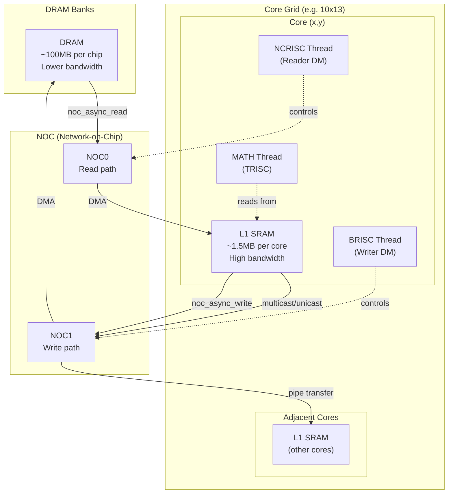

Sources: [python/ttl/ttl_api.py:98-98](), [benchmarks/matmul/config.py:76-78](), [benchmarks/matmul/NOTES.md:68-74]()
```


Relevant source files
*   [.editorconfig](https://github.com/tenstorrent/tt-lang/blob/d76e6233/.editorconfig)
*   [.github/ISSUE_TEMPLATE/config.yml](https://github.com/tenstorrent/tt-lang/blob/d76e6233/.github/ISSUE_TEMPLATE/config.yml)
*   [.github/ISSUE_TEMPLATE/feature_request.md](https://github.com/tenstorrent/tt-lang/blob/d76e6233/.github/ISSUE_TEMPLATE/feature_request.md?plain=1)
*   [.github/scripts/probe-docker-image.sh](https://github.com/tenstorrent/tt-lang/blob/d76e6233/.github/scripts/probe-docker-image.sh)
*   [.github/scripts/tests/test_probe_docker_image.bats](https://github.com/tenstorrent/tt-lang/blob/d76e6233/.github/scripts/tests/test_probe_docker_image.bats)
*   [.github/workflows/publish-s3-pypi.yml](https://github.com/tenstorrent/tt-lang/blob/d76e6233/.github/workflows/publish-s3-pypi.yml)
*   [.gitignore](https://github.com/tenstorrent/tt-lang/blob/d76e6233/.gitignore)
*   [CHANGELOG.md](https://github.com/tenstorrent/tt-lang/blob/d76e6233/CHANGELOG.md?plain=1)
*   [CITATION.cff](https://github.com/tenstorrent/tt-lang/blob/d76e6233/CITATION.cff)
*   [LICENSE](https://github.com/tenstorrent/tt-lang/blob/d76e6233/LICENSE)
*   [LICENSE_understanding.txt](https://github.com/tenstorrent/tt-lang/blob/d76e6233/LICENSE_understanding.txt)
*   [NOTICE](https://github.com/tenstorrent/tt-lang/blob/d76e6233/NOTICE)
*   [README.md](https://github.com/tenstorrent/tt-lang/blob/d76e6233/README.md?plain=1)
*   [docs/sphinx/getting-started.md](https://github.com/tenstorrent/tt-lang/blob/d76e6233/docs/sphinx/getting-started.md?plain=1)
*   [docs/sphinx/specs/TTLangSpecification.md](https://github.com/tenstorrent/tt-lang/blob/d76e6233/docs/sphinx/specs/TTLangSpecification.md?plain=1)
*   [examples/README.md](https://github.com/tenstorrent/tt-lang/blob/d76e6233/examples/README.md?plain=1)
*   [examples/elementwise-tutorial/step_0_ttnn_base.py](https://github.com/tenstorrent/tt-lang/blob/d76e6233/examples/elementwise-tutorial/step_0_ttnn_base.py)
*   [examples/elementwise-tutorial/step_1_single_node_single_tile_block.py](https://github.com/tenstorrent/tt-lang/blob/d76e6233/examples/elementwise-tutorial/step_1_single_node_single_tile_block.py)
*   [examples/elementwise-tutorial/step_2_single_node_multitile_block.py](https://github.com/tenstorrent/tt-lang/blob/d76e6233/examples/elementwise-tutorial/step_2_single_node_multitile_block.py)
*   [examples/elementwise-tutorial/step_3_multinode.py](https://github.com/tenstorrent/tt-lang/blob/d76e6233/examples/elementwise-tutorial/step_3_multinode.py)
*   [include/ttlang/Dialect/TTL/Transforms/DFBMaterialization.h](https://github.com/tenstorrent/tt-lang/blob/d76e6233/include/ttlang/Dialect/TTL/Transforms/DFBMaterialization.h)
*   [lib/Dialect/TTL/Transforms/DFBMaterialization.cpp](https://github.com/tenstorrent/tt-lang/blob/d76e6233/lib/Dialect/TTL/Transforms/DFBMaterialization.cpp)
*   [lib/Dialect/TTL/Transforms/TTLInsertIntermediateDFBs.cpp](https://github.com/tenstorrent/tt-lang/blob/d76e6233/lib/Dialect/TTL/Transforms/TTLInsertIntermediateDFBs.cpp)
*   [python/CMakeLists.txt](https://github.com/tenstorrent/tt-lang/blob/d76e6233/python/CMakeLists.txt)
*   [python/pykernel/_src/kernel_ast.py](https://github.com/tenstorrent/tt-lang/blob/d76e6233/python/pykernel/_src/kernel_ast.py)
*   [test/python/invalid/invalid_reduce_scalar_undefined.py](https://github.com/tenstorrent/tt-lang/blob/d76e6233/test/python/invalid/invalid_reduce_scalar_undefined.py)
*   [test/python/simple_reduce_scalar.py](https://github.com/tenstorrent/tt-lang/blob/d76e6233/test/python/simple_reduce_scalar.py)

tt-lang is a Python-based Domain-Specific Language (DSL) designed for authoring high-performance custom kernels on Tenstorrent hardware [README.md 20-21](https://github.com/tenstorrent/tt-lang/blob/d76e6233/README.md?plain=1#L20-L21) It provides an expressive yet ergonomic middle ground between high-level **TT-NN** (straightforward operations but limited expressivity) and low-level **TT-Metalium** (full hardware control but high management overhead) [README.md 27-29](https://github.com/tenstorrent/tt-lang/blob/d76e6233/README.md?plain=1#L27-L29)

The primary use case is **kernel fusion** for model deployment. Engineers porting models through TT-NN can take sequences of operations, express them as fused tt-lang kernels with explicit control over intermediate results and memory layout, validate correctness through simulation, and integrate the result as a drop-in replacement in their TT-NN graph [README.md 39-40](https://github.com/tenstorrent/tt-lang/blob/d76e6233/README.md?plain=1#L39-L40)

This page provides a high-level system overview. For detailed information, see: [What is tt-lang](https://deepwiki.com/tenstorrent/tt-lang/1.1-what-is-tt-lang), [Installation and Setup](https://deepwiki.com/tenstorrent/tt-lang/1.2-installation-and-setup), and [Quick Start Guide](https://deepwiki.com/tenstorrent/tt-lang/1.3-quick-start-guide).

## Purpose and Position in the Ecosystem

```mermaid
graph TB
    subgraph "Natural Language Space"
        ["High-Level Ops"]
        ["Custom Fused Kernels"]
        ["Hardware Primitives"]
    end

    subgraph "Code Entity Space"
        ["TT-NN"]
        ["tt-lang"]
        ["TT-Metalium"]
    end
    
    ["High-Level Ops"] --- ["TT-NN"]
    ["Custom Fused Kernels"] --- ["tt-lang"]
    ["Hardware Primitives"] --- ["TT-Metalium"]

    ["TT-NN"] -->|"Fusion / Custom Patterns"| ["tt-lang"]
    ["tt-lang"] -->|"Lowering / CodeGen"| ["TT-Metalium"]
    ["tt-lang"] -->|"Functional Validation"| ["ttlang-sim"]
```


tt-lang joins the Tenstorrent software ecosystem to provide a unified entrypoint with integrated simulation, performance analysis, and AI-assisted development [README.md 29-30](https://github.com/tenstorrent/tt-lang/blob/d76e6233/README.md?plain=1#L29-L30)

*   **TT-NN Layer**: Provides high-level operations that are straightforward to use but lack the expressivity needed for custom kernels [README.md 37](https://github.com/tenstorrent/tt-lang/blob/d76e6233/README.md?plain=1#L37-L37)
*   **TT-Lang Layer**: Expressive DSL where the compiler handles resource management (DST register allocation, NOC addressing, subblocking) while maintaining high expressivity for application-level concerns [README.md 37-39](https://github.com/tenstorrent/tt-lang/blob/d76e6233/README.md?plain=1#L37-L39)
*   **TT-Metalium Layer**: Provides direct access to hardware primitives without abstraction overhead for developers who need maximum control [README.md 37](https://github.com/tenstorrent/tt-lang/blob/d76e6233/README.md?plain=1#L37-L37)

**Diagram: Software Stack Positioning**

**Sources:**[README.md 27-40](https://github.com/tenstorrent/tt-lang/blob/d76e6233/README.md?plain=1#L27-L40)[docs/sphinx/specs/TTLangSpecification.md 53-58](https://github.com/tenstorrent/tt-lang/blob/d76e6233/docs/sphinx/specs/TTLangSpecification.md?plain=1#L53-L58)

## System Architecture

```mermaid
graph TB
    subgraph "User Interface Layer"
        ["Python_DSL"]
        ["ttl.operation"]
        ["ttl.compute"]
        ["ttl.datamovement"]
    end
    
    subgraph "Compilation Infrastructure"
        ["TTL_Dialect"]
        ["TTKernel_Dialect"]
        ["MLIR_Pass_Pipeline"]
        ["EmitC_Lowering"]
    end
    
    subgraph "Execution Backends"
        ["Hardware_Tensix_Cores"]
        ["ttlang-sim_Simulator"]
    end
    
    ["Python_DSL"] -->|"AST Parsing"| ["TTL_Dialect"]
    ["TTL_Dialect"] -->|"Transforms"| ["MLIR_Pass_Pipeline"]
    ["MLIR_Pass_Pipeline"] -->|"Lowering"| ["TTKernel_Dialect"]
    ["TTKernel_Dialect"] -->|"CodeGen"| ["EmitC_Lowering"]
    
    ["EmitC_Lowering"] -->|"Binary Execution"| ["Hardware_Tensix_Cores"]
    ["Python_DSL"] -->|"Direct Execution"| ["ttlang-sim_Simulator"]
```

The compilation infrastructure transforms Python AST to initial MLIR via `TTCompilerBase` [python/pykernel/_src/kernel_ast.py:61-62](), applies optimization passes such as `TTLInsertIntermediateDFBsPass` [lib/Dialect/TTL/Transforms/TTLInsertIntermediateDFBs.cpp:39-41](), and generates C++ code via `EmitC` [python/CMakeLists.txt:11-12](). Execution backends support both functional simulation for rapid development and hardware compilation for deployment [README.md:76-78]().
```


tt-lang consists of a Python-based frontend, an MLIR-based compilation pipeline, and dual execution backends (Hardware and Simulator).

**Diagram: System Layers and Components**

The compilation infrastructure transforms Python AST to initial MLIR via `TTCompilerBase`[python/pykernel/_src/kernel_ast.py 61-62](https://github.com/tenstorrent/tt-lang/blob/d76e6233/python/pykernel/_src/kernel_ast.py#L61-L62) applies optimization passes such as `TTLInsertIntermediateDFBsPass`[lib/Dialect/TTL/Transforms/TTLInsertIntermediateDFBs.cpp 39-41](https://github.com/tenstorrent/tt-lang/blob/d76e6233/lib/Dialect/TTL/Transforms/TTLInsertIntermediateDFBs.cpp#L39-L41) and generates C++ code via `EmitC`[python/CMakeLists.txt 11-12](https://github.com/tenstorrent/tt-lang/blob/d76e6233/python/CMakeLists.txt#L11-L12) Execution backends support both functional simulation for rapid development and hardware compilation for deployment [README.md 76-78](https://github.com/tenstorrent/tt-lang/blob/d76e6233/README.md?plain=1#L76-L78)

**Sources:**[README.md 27-40](https://github.com/tenstorrent/tt-lang/blob/d76e6233/README.md?plain=1#L27-L40)[python/pykernel/_src/kernel_ast.py 61-157](https://github.com/tenstorrent/tt-lang/blob/d76e6233/python/pykernel/_src/kernel_ast.py#L61-L157)[lib/Dialect/TTL/Transforms/TTLInsertIntermediateDFBs.cpp 32-114](https://github.com/tenstorrent/tt-lang/blob/d76e6233/lib/Dialect/TTL/Transforms/TTLInsertIntermediateDFBs.cpp#L32-L114)

## Key Components and Code Entities

```mermaid
graph TD
    subgraph "Operation: @ttl.operation"
        subgraph "Thread 1: @ttl.compute"
            ["Math_Ops_FPU_SFPU"]
        end
        subgraph "Thread 2: @ttl.datamovement"
            ["NCRISC_NOC_Read"]
        end
        subgraph "Thread 3: @ttl.datamovement"
            ["BRISC_NOC_Write"]
        end
    end
    
    ["NCRISC_NOC_Read"] -->|"Sync via DataflowBuffer"| ["Math_Ops_FPU_SFPU"]
    ["Math_Ops_FPU_SFPU"] -->|"Sync via DataflowBuffer"| ["BRISC_NOC_Write"]
```


The tt-lang API centers on decorators and specialized functions that define the kernel structure and data movement:

| API Entity | Location | Purpose |
| --- | --- | --- |
| `@ttl.operation()` | [docs/sphinx/specs/TTLangSpecification.md 67](https://github.com/tenstorrent/tt-lang/blob/d76e6233/docs/sphinx/specs/TTLangSpecification.md?plain=1#L67-L67) | Defines the operation entry point taking TT-NN tensors. |
| `@ttl.compute()` | [docs/sphinx/specs/TTLangSpecification.md 74](https://github.com/tenstorrent/tt-lang/blob/d76e6233/docs/sphinx/specs/TTLangSpecification.md?plain=1#L74-L74) | Marks a thread function for Tensix FPU/SFPU math operations. |
| `@ttl.datamovement()` | [docs/sphinx/specs/TTLangSpecification.md 78](https://github.com/tenstorrent/tt-lang/blob/d76e6233/docs/sphinx/specs/TTLangSpecification.md?plain=1#L78-L78) | Marks thread functions for data movement (BRISC/NCRISC). |
| `ttl.grid_size()` | [docs/sphinx/specs/TTLangSpecification.md 107](https://github.com/tenstorrent/tt-lang/blob/d76e6233/docs/sphinx/specs/TTLangSpecification.md?plain=1#L107-L107) | Returns the size of the execution grid for multi-core work. |
| `ttl.node()` | [docs/sphinx/specs/TTLangSpecification.md 144](https://github.com/tenstorrent/tt-lang/blob/d76e6233/docs/sphinx/specs/TTLangSpecification.md?plain=1#L144-L144) | Returns the coordinate of the current core within the grid. |
| `tt-lang-sim` | [README.md 78](https://github.com/tenstorrent/tt-lang/blob/d76e6233/README.md?plain=1#L78-L78) | CLI tool for running kernels in the functional simulator. |

**Diagram: Kernel Structure and Threads**

**Sources:**[docs/sphinx/specs/TTLangSpecification.md 60-84](https://github.com/tenstorrent/tt-lang/blob/d76e6233/docs/sphinx/specs/TTLangSpecification.md?plain=1#L60-L84)[examples/elementwise-tutorial/step_3_multinode.py 44-165](https://github.com/tenstorrent/tt-lang/blob/d76e6233/examples/elementwise-tutorial/step_3_multinode.py#L44-L165)[README.md 76-78](https://github.com/tenstorrent/tt-lang/blob/d76e6233/README.md?plain=1#L76-L78)

## Compilation Pipeline

The compiler transforms Python code through multiple MLIR dialects before generating the final C++ source for the hardware.

1.   **Initial IR**: Python AST is visited by `TTCompilerBase` to generate the `ttl` dialect [python/pykernel/_src/kernel_ast.py 61-127](https://github.com/tenstorrent/tt-lang/blob/d76e6233/python/pykernel/_src/kernel_ast.py#L61-L127)
2.   **Frontend Passes**: Handles transformations like inserting intermediate Dataflow Buffers (DFBs) [lib/Dialect/TTL/Transforms/TTLInsertIntermediateDFBs.cpp 9-13](https://github.com/tenstorrent/tt-lang/blob/d76e6233/lib/Dialect/TTL/Transforms/TTLInsertIntermediateDFBs.cpp#L9-L13)
3.   **Dialect Management**: Uses `TTL` and `TTKernel` dialects for hardware mapping [python/CMakeLists.txt 40-110](https://github.com/tenstorrent/tt-lang/blob/d76e6233/python/CMakeLists.txt#L40-L110)
4.   **Backend Lowering**: Generates hardware-ready C++ code using `EmitC`[python/CMakeLists.txt 11-12](https://github.com/tenstorrent/tt-lang/blob/d76e6233/python/CMakeLists.txt#L11-L12)

**Sources:**[python/pykernel/_src/kernel_ast.py 61-127](https://github.com/tenstorrent/tt-lang/blob/d76e6233/python/pykernel/_src/kernel_ast.py#L61-L127)[lib/Dialect/TTL/Transforms/TTLInsertIntermediateDFBs.cpp 9-114](https://github.com/tenstorrent/tt-lang/blob/d76e6233/lib/Dialect/TTL/Transforms/TTLInsertIntermediateDFBs.cpp#L9-L114)[python/CMakeLists.txt 1-135](https://github.com/tenstorrent/tt-lang/blob/d76e6233/python/CMakeLists.txt#L1-L135)

## Execution Modes

tt-lang supports two primary execution paths:

### Functional Simulator

The fastest way to iterate. It runs kernels as pure Python without requiring Tenstorrent hardware or the full compiler stack [README.md 35-36](https://github.com/tenstorrent/tt-lang/blob/d76e6233/README.md?plain=1#L35-L36)

*   **Command**: `tt-lang-sim <kernel>.py`[README.md 78](https://github.com/tenstorrent/tt-lang/blob/d76e6233/README.md?plain=1#L78-L78)
*   **Scheduling**: Uses greenlets to enable deterministic scheduling [CHANGELOG.md 95](https://github.com/tenstorrent/tt-lang/blob/d76e6233/CHANGELOG.md?plain=1#L95-L95)
*   **Setup**: Can be built separately with `-DTTLANG_SIM_ONLY=ON`[docs/sphinx/getting-started.md 140](https://github.com/tenstorrent/tt-lang/blob/d76e6233/docs/sphinx/getting-started.md?plain=1#L140-L140)

### Hardware Execution

Compiles the kernel into C++ binaries that run on Tensix cores.

*   **Setup**: Requires the full toolchain and `ttnn`[docs/sphinx/getting-started.md 9-12](https://github.com/tenstorrent/tt-lang/blob/d76e6233/docs/sphinx/getting-started.md?plain=1#L9-L12)
*   **Integration**: Works with `ttnn.Tensor` and requires hardware device access [docs/sphinx/getting-started.md 29-34](https://github.com/tenstorrent/tt-lang/blob/d76e6233/docs/sphinx/getting-started.md?plain=1#L29-L34)

**Sources:**[README.md 43-64](https://github.com/tenstorrent/tt-lang/blob/d76e6233/README.md?plain=1#L43-L64)[docs/sphinx/getting-started.md 128-130](https://github.com/tenstorrent/tt-lang/blob/d76e6233/docs/sphinx/getting-started.md?plain=1#L128-L130)[CHANGELOG.md 93-106](https://github.com/tenstorrent/tt-lang/blob/d76e6233/CHANGELOG.md?plain=1#L93-L106)

## Getting Started

To begin using tt-lang:

1.   **Installation**: Install via PyPI (`pip install tt-lang`) or use the provided Docker images [README.md 56-92](https://github.com/tenstorrent/tt-lang/blob/d76e6233/README.md?plain=1#L56-L92)
2.   **First Kernel**: Run the elementwise tutorial examples to understand the programming model [examples/elementwise-tutorial/step_1_single_node_single_tile_block.py](https://github.com/tenstorrent/tt-lang/blob/d76e6233/examples/elementwise-tutorial/step_1_single_node_single_tile_block.py)
3.   **Simulation**: Use `tt-lang-sim` to validate logic and debug before moving to hardware [README.md 78](https://github.com/tenstorrent/tt-lang/blob/d76e6233/README.md?plain=1#L78-L78)
4.   **Testing**: Verify your setup by running the test suite [examples/README.md 83-93](https://github.com/tenstorrent/tt-lang/blob/d76e6233/examples/README.md?plain=1#L83-L93)

**Sources:**[README.md 41-82](https://github.com/tenstorrent/tt-lang/blob/d76e6233/README.md?plain=1#L41-L82)[docs/sphinx/getting-started.md 7-42](https://github.com/tenstorrent/tt-lang/blob/d76e6233/docs/sphinx/getting-started.md?plain=1#L7-L42)[examples/README.md 1-28](https://github.com/tenstorrent/tt-lang/blob/d76e6233/examples/README.md?plain=1#L1-L28)

Dismiss
Refresh this wiki

Enter email to refresh


```mermaid
graph LR
    "SimpleKernels"["Simple Kernels<br/>- Minimal code<br/>- Compiler infers<br/>- High-level abstractions"]
    "Intermediate"["Intermediate<br/>- Explicit threading<br/>- Manual DFBs<br/>- Grid specification"]
    "Complex"["Complex Kernels<br/>- Custom pipelining<br/>- Semaphores<br/>- NOC patterns"]
    
    "SimpleKernels" -->|"Add complexity as needed"| "Intermediate"
    "Intermediate" -->|"Full control available"| "Complex"
```

### Related: Ecosystem Hierarchy

```mermaid
graph TB
    subgraph "High-Level Abstraction"
        "TTNN"["TT-NN<br/>• Pre-built operations<br/>• Easy to use<br/>• Limited expressivity"]
    end
    
    subgraph "Middle Layer (tt-lang)"
        "TTLang"["tt-lang<br/>• Python DSL<br/>• Compiler-managed resources<br/>• Custom kernel fusion<br/>• Simulation + profiling"]
    end
    
    subgraph "Low-Level Hardware"
        "TTMetal"["TT-Metalium<br/>• Full hardware control<br/>• Manual memory management<br/>• Explicit NOC addressing"]
    end
    
    "TTNN" -->|"Need custom kernels"| "TTLang"
    "TTLang" -->|"Need maximum control"| "TTMetal"
```

### Related: Execution Model

```mermaid
graph TB
    "KernelCode"["Kernel Code<br/>my_kernel.py"]
    
    subgraph "Development Path"
        "Sim"["Functional Simulator<br/>tt-lang-sim<br/>• Pure Python<br/>• No HW required"]
    end
    
    subgraph "Production Path"
        "HW"["Hardware Execution<br/>• Full Compiler Build<br/>• Tenstorrent Device"]
    end
    
    "KernelCode" -->|"tt-lang-sim"| "Sim"
    "KernelCode" -->|"python"| "HW"
```

### Related: Code Entity Map

```mermaid
graph TB
    subgraph "Frontend"
        "ASTVisitor"["TTCompilerBase<br/>[python/pykernel/_src/kernel_ast.py]"]
        "Spec"["Language Spec<br/>[docs/sphinx/specs/TTLangSpecification.md]"]
    end
    
    subgraph "Dialects & Passes"
        "TTLOps"["TTL Dialect<br/>[lib/Dialect/TTL]"]
        "IntermediatePass"["TTLInsertIntermediateDFBsPass<br/>[lib/Dialect/TTL/Transforms/TTLInsertIntermediateDFBs.cpp]"]
        "Materialization"["DFBMaterialization<br/>[lib/Dialect/TTL/Transforms/DFBMaterialization.cpp]"]
    end
    
    subgraph "Tooling"
        "Sim"["ttlang-sim CLI<br/>[docs/sphinx/getting-started.md]"]
        "Config"["Python Config<br/>[python/ttl/config.py.in]"]
    end
    
    "ASTVisitor" -.-> "TTLOps"
    "TTLOps" --> "IntermediatePass"
    "IntermediatePass" --> "Materialization"
    "Config" -.-> "ASTVisitor"
```

### Related: Kernel Structure and Hardware Mapping

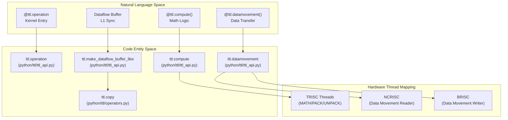

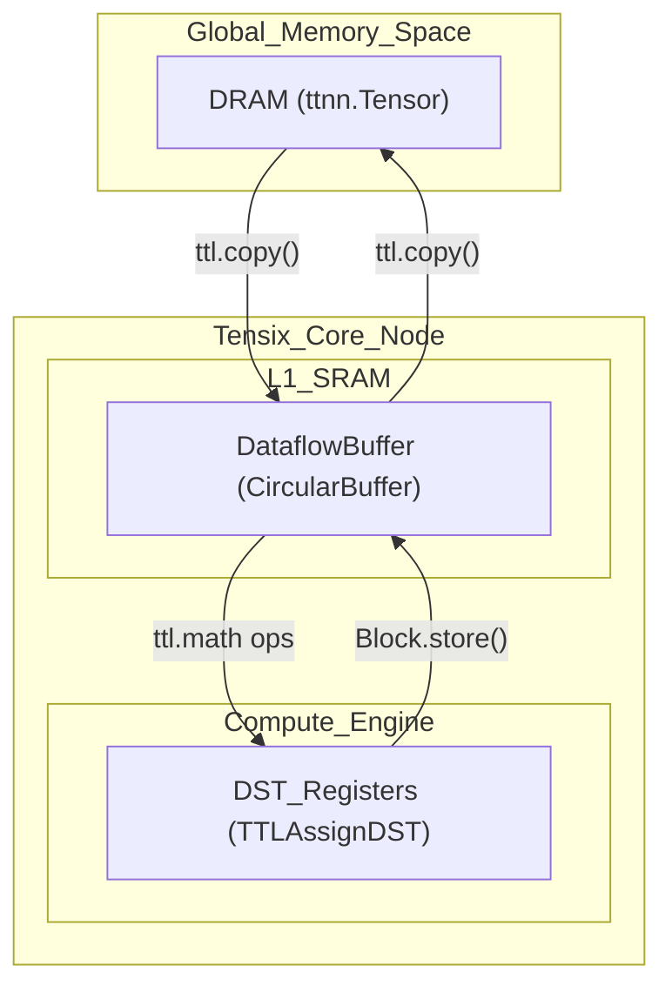

### Related: Code Entity Relationship Diagram

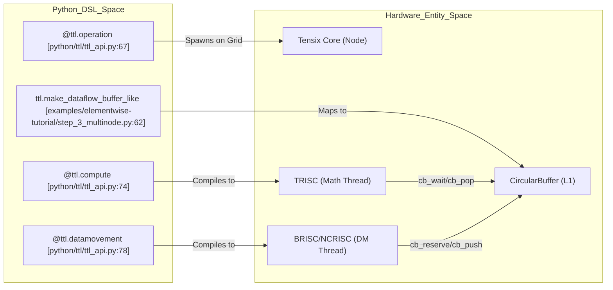

### Related: DSL Architecture Mapping

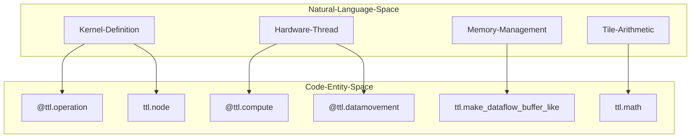

### Related: Kernel Structure Pattern

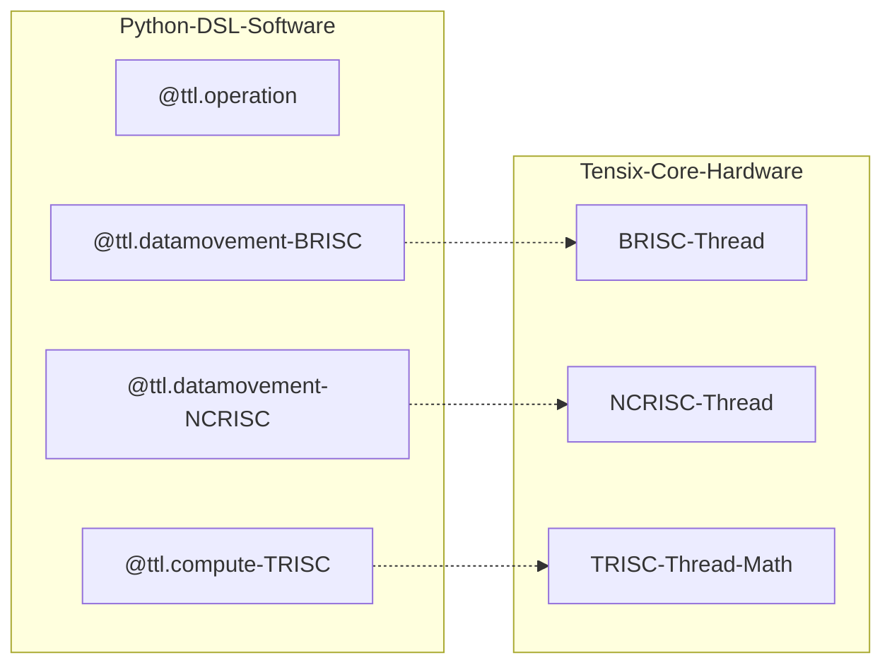

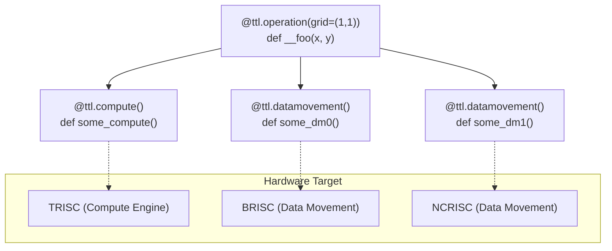

### Related: Key Transformation Passes

```mermaid
graph LR
    Python["Python AST"] -- "TTLGenericCompiler" --> TTL["TTL Dialect"]
    TTL -- "ttl-insert-intermediate-dfbs" --> IDFB["DFB Materialization"]
    IDFB -- "ttl-auto-sync" --> SYNC["CB Sync (Push/Pop)"]
    SYNC -- "ttl-assign-dst" --> DST["DST Allocation"]
    DST -- "convert-ttl-to-ttkernel" --> TTK["TTKernel Dialect"]
    TTK -- "convert-ttkernel-to-emitc" --> CPP["C++ Code"]
```

### Related: Thread Communication and Dataflow

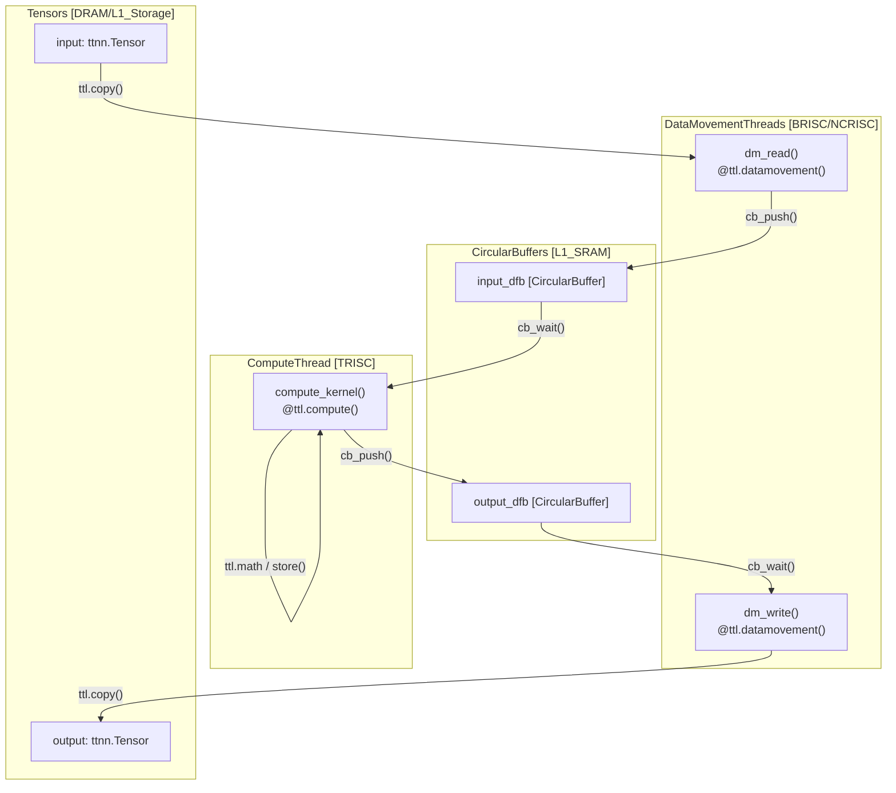

### Related: Compilation and Hardware Mapping

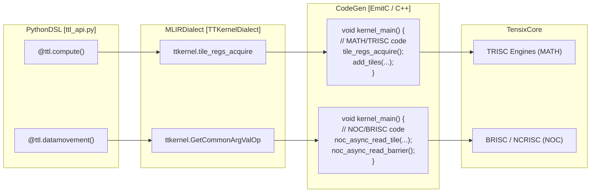

### Related: Producer-Consumer Pattern

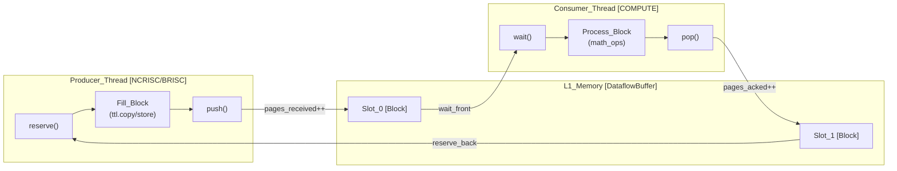

### Related: Implementation and Compilation

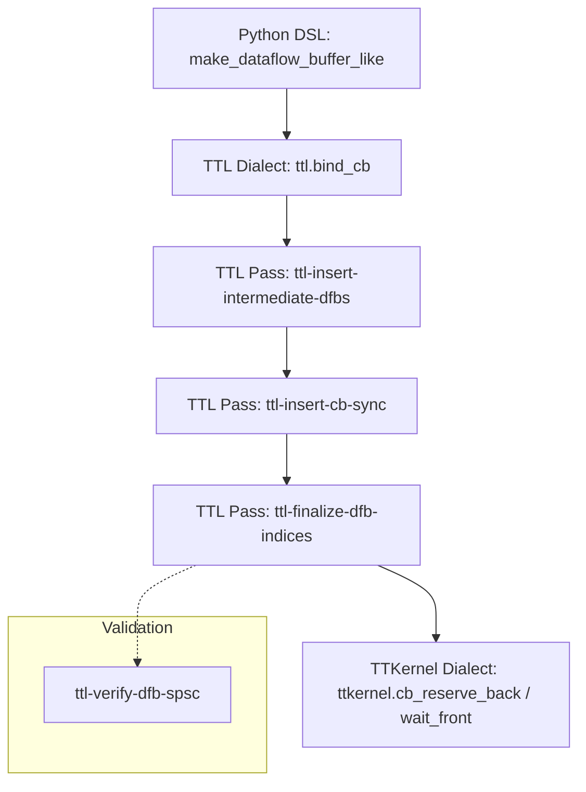

### Related: Hardware Mapping and Lowering

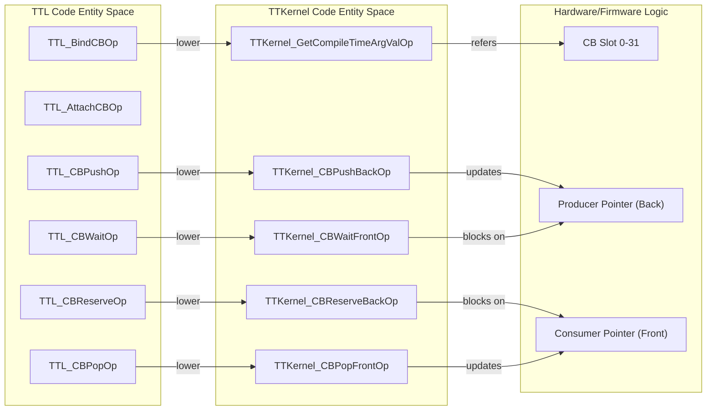

```mermaid
graph LR
    subgraph "Natural Language Space"
        "ND Coordinate" --> "Linearized Tile ID"
        "Squeezed Dim" --> "Static Offset"
    end

    subgraph "Code Entity Space"
        T_SLICE["ttl.tensor_slice"]
        L_MAP["arith.muli / arith.addi"]
        ACC["ttkernel.TensorAccessor"]
    end
    
    T_SLICE -->|"Lowering"| L_MAP
    L_MAP -->|"Address Gen"| ACC
```

```mermaid
graph TD
    subgraph "Code Entity Space"
        B_OP["ttl.block.broadcast"]
        R_OP["ttl.math.reduce_sum"]
        M_OP["ttl.math.mul_unary_const"]
    end

    subgraph "Data Flow"
        INPUT["Input Block"] --> R_OP
        R_OP --> M_OP
        M_OP --> OUTPUT["Output Block"]
    end
    
    B_OP -.->|"Align Shapes"| INPUT
```

### Related: Data Flow Space to Code Entity Space

```mermaid
graph LR
    subgraph "Natural Language Space"
        DRAM["DRAM/L1 Tensor"]
        L1DFB["Dataflow Buffer (L1)"]
        InterCore["Inter-core Pipe"]
    end

    subgraph "Code Entity Space (DSL/MLIR)"
        TensorOp["ttl.operators.TensorBlock"]
        DFBOp["ttl.dialects.ttl.CircularBufferType"]
        PipeOp["ttl.pipe.Pipe"]
        
        CopyOp["ttl.copy (TTL_CopyOp)"]
        WaitOp["ttl.wait (TTL_WaitOp)"]
        Handle["TransferHandle (!ttl.transfer_handle)"]
    end

    DRAM --- TensorOp
    L1DFB --- DFBOp
    InterCore --- PipeOp

    TensorOp -->|"src"| CopyOp
    DFBOp -->|"dst"| CopyOp
    CopyOp -->|"result"| Handle
    Handle -->|"operand"| WaitOp
```

### Related: Lowering to Hardware Operations

```mermaid
graph TB
    subgraph "TTL to TTKernel Lowering"
        TTL_Copy["TTL_CopyOp"]
        
        NOC_Read["ttkernel.noc_async_read_tile"]
        NOC_Write["ttkernel.noc_async_write_tile"]
        
        Barrier["ttkernel.noc_async_read_barrier<br/>or noc_async_write_barrier"]
    end
    
    TTL_Copy --> NOC_Read
    TTL_Copy --> NOC_Write
    
    TTL_Wait["TTL_WaitOp"] --> Barrier
```

### Related: Conditional Execution (if_src / if_dst)

```mermaid
graph TD
    subgraph "PipeNet_Role_Resolution"
        RoleCheck["PipeNet.if_src(callback) / PipeNet.if_dst(callback)"]
        IsSrc["ttl.pipenet_is_role(Source)"]
        IsDst["ttl.pipenet_is_role(Destination)"]
        ExecSrc["Execute_callback(SrcPipeIdentity)"]
        ExecDst["Execute_callback(DstPipeIdentity)"]
        Skip["Skip_Execution"]
    end

    RoleCheck --> IsSrc
    IsSrc -- "True" --> ExecSrc
    IsSrc -- "False" --> IsDst
    IsDst -- "True" --> ExecDst
    IsDst -- "False" --> Skip
```

### Related: Hardware to Code Entity Mapping

```mermaid
graph TB
    subgraph "Off-Chip_Storage"
        DRAM["DRAM<br/>'ttnn.DRAM_MEMORY_CONFIG'"]
    end
    
    subgraph "On-Chip_Per-Core_Memory_(L1)"
        L1["L1_Storage<br/>'ttnn.L1_MEMORY_CONFIG'"]
        
        subgraph "DataflowBuffer_(DFB)"
            CB["'ttl.CircularBuffer'<br/>'ttl.bind_cb()'"]
        end
    end
    
    subgraph "Compute_Engine_(Tensix)"
        DST["DST_Register_File<br/>'ttl.math'_operations<br/>(e.g.,_'ttl.add')"]
    end

    DRAM -- "'ttl.copy()'" --> CB
    L1 -- "'ttl.copy()'" --> CB
    CB -- "Implicit_Load" --> DST
    DST -- "'tensor.store()'" --> CB
    CB -- "'ttl.copy()'" --> DRAM
```

### Related: Memory Hierarchy Overview

```mermaid
graph TB
    subgraph "Off-Chip"
        DRAM["DRAM<br/>Persistent Storage<br/>ttnn.DRAM_MEMORY_CONFIG"]
    end
    
    subgraph "On-Chip L1 (Per-Core)"
        L1["L1 Cache"]
        CB["CircularBuffers / DFBs (L1)<br/>!ttl.cb<br/>ttl.bind_cb"]
    end
    
    subgraph "Compute Registers"
        DST["DST Registers<br/>!ttl.dst_reg<br/>tile_regs_acquire/release"]
    end
    
    DRAM -->|"ttl.copy(tensor_slice, cb)<br/>!ttl.transfer_handle"| CB
    CB -->|"ttl.copy_tile<br/>FPU Unpack"| DST
    DST -->|"ttl.store / pack_tile<br/>(MATH -> PACK thread)"| CB
    CB -->|"ttl.copy(cb, tensor_slice)<br/>!ttl.transfer_handle"| DRAM
    
    L1 -.->|"Association"| CB
```

### Related: Kernel Invocation to Code Entity Mapping

```mermaid
graph TB
    subgraph "Python DSL Space ([python/ttl/ttl_api.py]())"
        OperationDecorator["@ttl.operation()<br/>[python/ttl/ttl_api.py:45]()"]
        ComputeDecorator["@ttl.compute()<br/>[python/ttl/ttl_api.py:100]()"]
        DMDecorator["@ttl.datamovement()<br/>[python/ttl/ttl_api.py:100]()"]
    end

    subgraph "Compiler & Runner Space"
        TTLCompiler["TTLGenericCompiler<br/>[python/ttl/_src/ttl_ast.py:128]()"]
        KernelRunner["run_kernel_on_device()<br/>[python/ttl/ttl_api.py:93]()"]
        TTKernelDialect["ttkernel Dialect Ops<br/>[python/ttl/dialects/ttkernel.py]()"]
    end

    OperationDecorator --> TTLCompiler
    TTLCompiler --> KernelRunner
    KernelRunner --> TTKernelDialect
    ComputeDecorator -.-> TTLCompiler
    DMDecorator -.-> TTLCompiler
```

### Related: Thread Coordination via DFB

```mermaid
graph LR
    subgraph "Tensix Core"
        subgraph "NCRISC (Reader)"
            NCRISC_OP["ttl.copy(tensor, block)<br/>[python/ttl/ttl_api.py:96]()"]
        end
        
        subgraph "MATH (Compute)"
            MATH_OP["ttl.math ops<br/>[docs/sphinx/specs/TTLangSpecification.md:46]()"]
        end
        
        subgraph "BRISC (Writer)"
            BRISC_OP["ttl.copy(block, tensor)<br/>[python/ttl/ttl_api.py:96]()"]
        end
        
        DFB_IN["DataflowBuffer (Input)<br/>[python/ttl/ttl_api.py:74]()"]
        DFB_OUT["DataflowBuffer (Output)<br/>[python/ttl/ttl_api.py:74]()"]
        
        NCRISC_OP -->|"block.push()<br/>[docs/sphinx/specs/TTLangSpecification.md:38]()"| DFB_IN
        DFB_IN -->|"cb_wait()<br/>[include/ttlang/Dialect/TTL/Passes.td:8-12]()"| MATH_OP
        MATH_OP -->|"block.push()<br/>[docs/sphinx/specs/TTLangSpecification.md:38]()"| DFB_OUT
        DFB_OUT -->|"cb_wait()<br/>[include/ttlang/Dialect/TTL/Passes.td:8-12]()"| BRISC_OP
    end
```

### Related: Thread Execution Model

```mermaid
graph TB
    subgraph DSL["Python DSL Space"]
        Kernel["@ttl.operation(grid=(1,1))"]
        ComputeFn["@ttl.compute() def add_compute()"]
        DMReadFn["@ttl.datamovement() def dm_read()"]
        DMWriteFn["@ttl.datamovement() def dm_write()"]
    end

    subgraph Core["Code Entity Space (Tensix Core)"]
        TRISC["TRISC Thread (Compute)<br/>'#ttkernel.thread<compute>'"]
        BRISC["BRISC Thread (Data Movement)<br/>'#ttkernel.thread<noc>'"]
        NCRISC["NCRISC Thread (Data Movement)<br/>'#ttkernel.thread<noc>'"]
    end

    Kernel --> TRISC
    Kernel --> BRISC
    Kernel --> NCRISC

    ComputeFn -.->|Lowering| TRISC
    DMReadFn -.->|Lowering| BRISC
    DMWriteFn -.->|Lowering| NCRISC

    subgraph Memory["On-Chip Resources"]
        CB["Circular Buffer (DFB)<br/>ttl.bind_cb"]
        DST["DST Register File<br/>tile_regs_acquire()"]
    end

    TRISC -->|wait/pop| CB
    TRISC -->|Arithmetic| DST
    BRISC -->|reserve/push| CB
    NCRISC -->|wait/pop| CB
```

### Related: Execution Flow and Compilation Pipeline

```mermaid
graph TD
    AST["Python AST"] -->|TTLGenericCompiler| TTL_MLIR["TTL Dialect MLIR"]
    TTL_MLIR -->|TTLInsertCBSync| SYNC_MLIR["Synchronized MLIR<br/>(cb_push/cb_pop)"]
    SYNC_MLIR -->|TTLConvertTTLToCompute| COMP_MLIR["Compute Dialect MLIR"]
    COMP_MLIR -->|TTLAssignDST| DST_MLIR["DST Allocated MLIR<br/>(tile_regs_acquire)"]
    DST_MLIR -->|TTLConvertTTLToTTKernel| TTK_MLIR["TTKernel Dialect MLIR"]
    TTK_MLIR -->|ConvertTTKernelToEmitC| CPP["C++ Source Code"]
```

### Related: Grid Coordinate System

```mermaid
graph TD
    subgraph "Grid Layout: grid=(4, 3)"
        core00["Core (0,0)<br/>linear=0"]
        core10["Core (1,0)<br/>linear=1"]
        core20["Core (2,0)<br/>linear=2"]
        core30["Core (3,0)<br/>linear=3"]
        
        core01["Core (0,1)<br/>linear=4"]
        core11["Core (1,1)<br/>linear=5"]
        core21["Core (2,1)<br/>linear=6"]
        core31["Core (3,1)<br/>linear=7"]
        
        core02["Core (0,2)<br/>linear=8"]
        core12["Core (1,2)<br/>linear=9"]
        core22["Core (2,2)<br/>linear=10"]
        core32["Core (3,2)<br/>linear=11"]
        
        core00 --> core10
        core10 --> core20
        core20 --> core30
        core30 --> core01
        core01 --> core11
        core11 --> core21
        core21 --> core31
        core31 --> core02
        core02 --> core12
        core12 --> core22
        core22 --> core32
    end
```

### Related: Code Entity Mapping

```mermaid
graph TD
    subgraph "Natural Language Space"
        spec["Grid Definition"]
        dist["Work Partitioning"]
        coord["Node Identification"]
    end

    subgraph "Code Entity Space"
        kernel_dec["@ttl.operation(grid=...)"]
        node_fn["ttl.node()"]
        grid_fn["ttl.grid_size()"]
        copy_op["ttl.copy()"]
        ast_visitor["TTLGenericCompiler"]
        dfb_pass["TTLInsertIntermediateDFBs"]
        
        kernel_dec -- "defines" --> spec
        node_fn -- "implements" --> coord
        grid_fn -- "provides" --> dist
        copy_op -- "executes" --> dist
        ast_visitor -- "lowers AST" --> dist
        dfb_pass -- "manages L1" --> dist
    end
```

```mermaid
graph TB
    subgraph "Tensor-Level (High Level)"
        ElemOps["Elementwise Ops<br/>(ttl.add, ttl.exp, etc.)"]
        StoreOp["StoreOp"]
        AttachCB["AttachCBOp"]
    end
    
    subgraph "Structured Compute (Intermediate)"
        ComputeOp["ComputeOp<br/>(Implements TilingInterface)"]
        YieldOp["YieldOp"]
    end
    
    subgraph "Tile-Level (Low Level)"
        TileMath["Tile Math Ops<br/>(TileAddOp, TileExpOp)"]
        TileStore["TileStoreOp"]
        TileRegsAcquire["TileRegsAcquireOp"]
        TileRegsCommit["TileRegsCommitOp"]
    end
    
    subgraph "Data Movement"
        CopyOp["CopyOp<br/>(DRAM/L1 to CB)"]
        BindCB["BindCBOp"]
        CBPush["CBPushOp"]
    end
    
    ElemOps -- "fused into" --> ComputeOp
    ComputeOp -- "contains" --> TileMath
    ComputeOp -- "contains" --> TileStore
    TileMath -- "assigned" --> dst_idx["dst_idx attribute"]
    
    AttachCB -- "associates" --> BindCB
    CBPush -- "synchronizes" --> BindCB
```

### Related: Transformation Overview

```mermaid
graph LR
    subgraph "Input: Tensor-Level Operations"
        A["ttl.add<br/>%result1 = ttl.add %a, %b"]
        B["ttl.exp<br/>%result2 = ttl.exp %result1"]
        C["ttl.store<br/>ttl.store %result2, %view"]
        A --> B
        B --> C
    end
    
    subgraph "Output: ttl.compute with Tile Ops"
        D["ttl.compute<br/>ins(%a, %b)<br/>outs(%init)"]
        E["Body:<br/>%sum = ttl.tile_add<br/>%exp = ttl.tile_exp<br/>ttl.tile_store"]
        D --> E
    end
    
    A -.ConvertTTLToCompute.-> D
    B -.fused into.-> D
    C -.becomes tile_store.-> E
```

### Related: Pass Structure

```mermaid
graph TD
    Start["TTLConvertTTLToCompute<br/>Pass Entry"]
    Collect["Collect elementwise ops<br/>to fuse"]
    Trace["Trace elementwise chains<br/>findCBReserveForView()"]
    Build["Build fused compute<br/>emitTileOpFor()"]
    Replace["Replace fused ops<br/>with compute result"]
    
    Start --> Collect
    Collect --> Trace
    Trace --> Build
    Build --> Replace
    
    subgraph "Code Entities"
        TraceFunc["findCBReserveForView()<br/>include/ttlang/Dialect/TTL/IR/TTLOpsUtils.h"]
        BuildFunc["emitTileOpFor()<br/>lib/Dialect/TTL/Transforms/ConvertTTLToCompute.cpp"]
        EmitStores["emitTileStores()<br/>lib/Dialect/TTL/Transforms/ConvertTTLToCompute.cpp"]
    end
    
    Trace -.calls.-> TraceFunc
    Build -.calls.-> BuildFunc
    Build -.calls.-> EmitStores
```

### Related: Building the ttl.compute Operation

```mermaid
graph TD
    A["Create ttl.compute op<br/>with indexing_maps,<br/>iterator_types"]
    B["Create body block<br/>with tile-typed arguments"]
    C["Map tensor values<br/>to tile block args"]
    E["For each fused op:"]
    G["Call emitTileOpFor()<br/>to create tile op"]
    H["Update tensor→tile map"]
    I["Emit tile_store ops via<br/>emitTileStores()"]
    J["Create ttl.yield terminator"]
    
    A --> B
    B --> C
    C --> E
    E --> G
    G --> H
    H --> I
    I --> J
```

```mermaid
graph TB
    subgraph "ttl.compute (TTLOps.td)"
        Inputs["ins() operands<br/>Ranked Tensors"]
        Outputs["outs() operands<br/>Ranked Tensors"]
        Attrs["Attributes:<br/>- indexing_maps<br/>- iterator_types"]
        Body["Body block:<br/>- Block arguments (tiles)<br/>- ttl.tile_* ops<br/>- ttl.tile_store<br/>- ttl.yield"]
    end
    
    subgraph "MLIR Interfaces"
        DPS["DestinationStyleOpInterface"]
        Indexing["IndexingMapOpInterface"]
        Tiling["TilingInterface"]
    end
    
    Body -.implements.-> DPS
    Attrs -.implements.-> Indexing
    Body -.implements.-> Tiling
```

### Related: DST Register File Architecture

```mermaid
graph TD
    subgraph "Physical_DST_Register_File_16_tiles"
        P0["P_Tile_0"]
        P1["P_Tile_1"]
        Pdots["..."]
        P15["P_Tile_15"]
    end
    
    subgraph "bf16_Double_Buffered_capacity_8"
        BF16_0["DST_0"]
        BF16_1["DST_1"]
        BF16_dots["..."]
        BF16_7["DST_7"]
        BF16_reserved["8_tiles_reserved"]
    end
    
    subgraph "f32_Double_Buffered_capacity_4"
        F32_0["DST_0_2_physical"]
        F32_1["DST_1_2_physical"]
        F32_dots["..."]
        F32_3["DST_3_2_physical"]
        F32_reserved["8_tiles_reserved"]
    end
    
    P0 --> BF16_0
    P0 --> F32_0
```

```mermaid
graph TB
    Input["ttl.compute_op"]
    
    Phase0["Phase_0_FPU_Binary_Detection<br/>detectFPUBinaryOps"]
    Phase1["Phase_1_Copy_Insertion<br/>insertCopiesForMultiConsumerValues"]
    Phase2["Phase_2_Build_Live_Intervals<br/>buildLiveIntervals"]
    Phase3["Phase_3_Linear_Scan_Inputs<br/>linearScanAllocateFiltered"]
    Phase4["Phase_4_Linear_Scan_Outputs<br/>(Optional_separate_output_region)"]
    
    Finalize["Finalization<br/>createCopyTileForArg<br/>Assign_dst_idx"]
    
    Input --> Phase0
    Phase0 --> Phase1
    Phase1 --> Phase2
    Phase2 --> Phase3
    Phase3 --> Phase4
    Phase4 --> Finalize
    
    subgraph "Logic_Entities"
        MergedClasses["llvm::EquivalenceClasses"]
        Intervals["ValueLiveInterval"]
        AssignmentMap["DenseMap_Value_uint32"]
    end
    
    Phase2 -.-> MergedClasses
    Phase2 -.-> Intervals
    Phase3 -.-> AssignmentMap
```

### Related: Tiling Algorithm Implementation

```mermaid
graph LR
    subgraph "lib/Dialect/TTL/Transforms/DstSubblockUtils.cpp"
        API["computeMultiDimSubblockSizes"]
        Divs["allDivisors (SmallVector)"]
        Search["search (Recursive Lambda)"]
        Pref["prefersInner (Lambda)"]
    end
    
    API --> Divs
    Divs --> Search
    Search --> Pref
    Pref --> Search
    Search --> Result["bestSizes (SmallVector)"]
```

### Related: Position in Pipeline

```mermaid
graph LR
    A["ttl.compute<br/>(structured op)"] --> B["ttl-assign-dst"]
    B --> C["ttl-subblock-compute-for-dst"]
    C --> D["ttl-lower-to-loops"]
    D --> E["scf.for loops<br/>(explicit iteration)"]
    E --> F["ttl-schedule-operations"]
    F --> G["ttl-annotate-cb-associations"]
    G --> H["convert-ttl-to-ttkernel"]
    
    style D fill:#f9f9f9
```

```mermaid
graph TB
    A["ComputeOp [ttl.compute]"] --> B["getIterationDomain()"]
    B --> C["TilingInterface::getIterationDomain"]
    C --> D["Build Range for each dim:<br/>[lowerBound, upperBound, step]"]
    D --> E["Loop bounds generated for SCF"]
```

### Related: Data Movement: Copy Tile

```mermaid
graph LR
    subgraph "TTL Dialect Space"
        T_COPY["TTL_CopyOp[copy]"]
        T_CB["TTL_BindCBOp[bind_cb]"]
        T_SLICE["TTL_TensorSliceOp[tensor_slice]"]
    end
    subgraph "TTKernel Dialect Space"
        K_CB["ttkernel::CBType[CBType]"]
        K_COPY["ttkernel::CopyTileOp[copy_tile]"]
        K_INIT["ttkernel::CopyTileInitOp[copy_tile_init]"]
    end
    T_COPY --> K_COPY
    T_CB --> K_CB
    K_CB --> K_COPY
    T_SLICE --> K_COPY
    K_INIT -.->|"Inserted by TTKernelInsertInits[TTKernelInsertInits]"| K_COPY
```

### Related: Role in the Pipeline

```mermaid
graph LR
    TTKernel["TTKernel Dialect<br/>(Hardware Ops)"]
    Optimize["Optimization Passes<br/>canonicalize, cse<br/>lower-affine"]
    EmitC["EmitC Dialect<br/>(C++ Constructs)"]
    Translate["ttkernel-to-cpp<br/>Translation"]
    CPP["C++ Source<br/>kernel_main()"]
    
    TTKernel --> Optimize
    Optimize --> EmitC
    EmitC --> Translate
    Translate --> CPP
```

### Related: Standard Kernel Template

```mermaid
graph TD
    Entry["void kernel_main()"]
    Constants["Constant Declarations<br/>size_t bounds, page_size"]
    RTArgs["Runtime Arguments<br/>get_common_arg_val<br/>TensorAccessorArgs"]
    CBSetup["CB Setup<br/>CircularBuffer wrapper<br/>Pointer casting"]
    LoopNest["Tile Iteration<br/>scf.for -> for(...)"]
    MathOps["Math/DMA Logic<br/>tile_regs_acquire<br/>noc_async_read_tile"]
    Sync["Synchronization<br/>tile_regs_commit<br/>noc_async_read_barrier"]
    Return["return;"]
    
    Entry --> Constants
    Constants --> RTArgs
    RTArgs --> CBSetup
    CBSetup --> LoopNest
    LoopNest --> MathOps
    MathOps --> Sync
    Sync --> Return
```

### Related: Tile Typecasting Lowering

```mermaid
graph LR
    subgraph "MLIR Lowering Flow"
        TTL_TC["ttl.tile_typecast<br/>!ttcore.tile<32x32, bf16> -> !ttcore.tile<32x32, f32>"]
        TTK_INIT["ttkernel.typecast_tile_init(<bf16>, <f32>)"]
        TTK_OP["ttkernel.typecast_tile(%tile, <bf16>, <f32>)"]
    end
    TTL_TC -- "Lowering" --> TTK_INIT
    TTK_INIT -- "Followed by" --> TTK_OP
```

### Related: Kernel Anatomy

```mermaid
graph TB
    subgraph "Operation Definition"
        OpDec["@ttl.operation()<br/>def operation_name(inputs..., outputs...)"]
    end
    
    subgraph "Dataflow Buffer (DFB) Setup"
        CB1["lhs_dfb = ttl.make_dataflow_buffer_like(lhs, <br/>shape=(tiles_h, tiles_w), block_count=2)"]
        CB2["rhs_dfb = ttl.make_dataflow_buffer_like(...)"]
        CB3["out_dfb = ttl.make_dataflow_buffer_like(...)"]
    end
    
    subgraph "Thread Functions"
        Compute["@ttl.compute()<br/>def compute_func():<br/>  with dfb.wait() as blk:<br/>    # perform computation<br/>    # implicit pop()"]
        
        DM0["@ttl.datamovement()<br/>def dm_reader():<br/>  with dfb.reserve() as blk:<br/>    ttl.copy(tensor_slice, blk).wait()<br/>    # implicit push()"]
        
        DM1["@ttl.datamovement()<br/>def dm_writer():<br/>  with dfb.wait() as blk:<br/>    ttl.copy(blk, tensor_slice).wait()<br/>    # implicit pop()"]
    end
    
    OpDec --> CB1
    OpDec --> CB2
    OpDec --> CB3
    
    CB1 --> Compute
    CB2 --> Compute
    CB3 --> Compute
    
    CB1 --> DM0
    CB2 --> DM0
    CB3 --> DM1
    
    DM0 -.synchronizes via DFB.-> Compute
    Compute -.synchronizes via DFB.-> DM1
```

### Related: Data Movement Patterns

```mermaid
graph LR
    subgraph "Memory Hierarchy"
        DRAM["DRAM<br/>(ttnn.DRAM_MEMORY_CONFIG)"]
        L1["L1 Cache<br/>(ttnn.L1_MEMORY_CONFIG)"]
        DFB["Dataflow Buffers<br/>(L1 SRAM)"]
        DST["DST Registers<br/>(Compute engine)"]
    end
    
    subgraph "Data Movement Threads"
        BRISC["BRISC Processor"]
        NCRISC["NCRISC Processor"]
    end
    
    subgraph "Compute Thread"
        TRISC["TRISC Processor"]
    end
    
    DRAM -.NOC.-> DFB
    L1 -.NOC.-> DFB
    DFB --> DST
    DST --> DFB
    DFB -.NOC.-> DRAM
    DFB -.NOC.-> L1
    
    BRISC -.executes.-> "ttl.copy()"
    NCRISC -.executes.-> "ttl.copy()"
    TRISC -.executes.-> "ttl.math ops"
```

```mermaid
graph TB
    subgraph "Grid Context"
        GS["grid_cols, grid_rows = ttl.grid_size(dims=2)"]
        NC["node_col, node_row = ttl.node(dims=2)"]
    end
    
    subgraph "Work Partitioning"
        WP["rows_per_node = total_rows / grid_rows"]
    end
    
    GS --> WP
    NC --> WP
```

### Related: Inter-core Communication with Pipes

```mermaid
graph LR
    subgraph "Pipe Topology"
        P["ttl.Pipe(src, dst)"]
        PN["ttl.Pipenet([pipes])"]
    end
    
    subgraph "Conditional Execution"
        IS["PN.is_src()"]
        ID["PN.is_dst()"]
        IA["PN.is_active()"]
    end
    
    P --> PN
    PN --> IS
    PN --> ID
    PN --> IA
```

### Related: Kernel Architecture Overview

```mermaid
graph TB
    subgraph "Kernel_Definition"
        KernelDec["@ttl.operation(grid=(1,1))<br/>def add_kernel(lhs, rhs, out)"]
    end
    
    subgraph "Circular_Buffers_(Data_Staging)"
        LhsCB["lhs_dfb = ttl.make_dataflow_buffer_like(...)"]
        RhsCB["rhs_dfb = ttl.make_dataflow_buffer_like(...)"]
        OutCB["out_dfb = ttl.make_dataflow_buffer_like(...)"]
    end
    
    subgraph "Thread_Functions"
        direction LR
        DMRead["@ttl.datamovement()<br/>def dm_read():<br/>  Reserve DFB<br/>  ttl.copy(tensor -> DFB)<br/>  Push DFB"]
        
        Compute["@ttl.compute()<br/>def add_compute():<br/>  Wait for inputs<br/>  result = l + r<br/>  Store result<br/>  Pop/Push DFBs"]
        
        DMWrite["@ttl.datamovement()<br/>def dm_write():<br/>  Wait for output<br/>  ttl.copy(DFB -> tensor)<br/>  Pop DFB"]
    end
    
    KernelDec --> LhsCB
    KernelDec --> RhsCB
    KernelDec --> OutCB
    
    LhsCB --> DMRead
    RhsCB --> DMRead
    LhsCB --> Compute
    RhsCB --> Compute
    OutCB --> Compute
    OutCB --> DMWrite
```

### Related: DFB Lifecycle Operations

```mermaid
graph TB
    subgraph "Input_DFB_Lifecycle"
        WaitInput["lhs_dfb.wait()<br/>(Calls ttl.cb_wait)<br/>Returns: TensorBlock"]
        UseInput["result = l + r<br/>(Lowered to ttl.add)<br/>Uses: DST Registers"]
        PopInput["l.pop()<br/>(Calls ttl.cb_pop)<br/>Releases: L1 Space"]
        
        WaitInput --> UseInput --> PopInput
    end
    
    subgraph "Output_DFB_Lifecycle"
        ReserveOutput["out_dfb.reserve()<br/>(Calls ttl.cb_reserve)<br/>Returns: TensorBlock"]
        StoreOutput["o.store(result)<br/>(Calls ttl.store)<br/>Packs: DST to L1"]
        PushOutput["o.push()<br/>(Calls ttl.cb_push)<br/>Signals: Consumer"]
        
        ReserveOutput --> StoreOutput --> PushOutput
    end
```

```mermaid
graph TD
    TensorOp["Tensor Operation<br/>ttl.add(a, b)"]
    Fusion["ConvertTTLToCompute<br/>Fusion Pass"]
    Compute["ttl.compute<br/>Structured Operation"]
    TileOp["Tile Operation<br/>ttl.AddTileOp"]
    Loop["scf.for loops<br/>Iteration over tiles"]
    Hardware["TTKernel Operations<br/>AddBinaryTilesOp"]
    
    TensorOp --> Fusion
    Fusion --> Compute
    Compute --> TileOp
    TileOp --> Loop
    Loop --> Hardware
```

### Related: Data Flow and Memory Patterns

```mermaid
graph TD
    DRAM["DRAM/L1 Device Memory"]
    CB["Circular Buffer (L1)"]
    DST["DST Register File (MATH)"]
    
    DRAM -- "ttl.copy (DM Thread)" --> CB
    CB -- "wait() / reserve()" --> DST
    DST -- "Arithmetic Op" --> DST
    DST -- "store()" --> CB
    CB -- "ttl.copy (DM Thread)" --> DRAM
```

### Related: SPMD Work Distribution Mapping

```mermaid
graph TD
    subgraph "Tensor Space (ttnn.Tensor)"
        T["Input Tensor (M, N)"]
    end

    subgraph "Code Entity Space (tt-lang DSL)"
        GS["ttl.grid_size(dims=2) -> (grid_cols, grid_rows)"]
        CC["ttl.node(dims=2) -> (node_col, node_row)"]
        
        PM["rows_per_node = (M // TILE_SIZE) // grid_rows"]
        PN["cols_per_node = (N // TILE_SIZE) // grid_cols"]
        
        OR["start_row = node_row * rows_per_node"]
        OC["start_col = node_col * cols_per_node"]
    end

    subgraph "Hardware Execution"
        Grid["Core Grid (X, Y)"]
        C1["Core (node_col, node_row)"]
    end

    T --> GS
    GS --> PM
    GS --> PN
    PM --> OR
    PN --> OC
    CC --> OR
    CC --> OC
    OR --> C1
    OC --> C1
```

### Related: Multicast Pattern (1D/2D)

```mermaid
graph TD
    subgraph "Core_Source [Source Node]"
        SRC_DM["@ttl.datamovement"]
        SRC_NET["mcast_a_net: ttl.PipeNet"]
        SRC_PIPE["mcast_a_net.if_src(pipe_src)"]
        SRC_COPY["ttl.copy(a_blk, pipe)"]
    end

    subgraph "Core_Destination [Destination Nodes]"
        DST_DM["@ttl.datamovement"]
        DST_NET["mcast_a_net: ttl.PipeNet"]
        DST_PIPE["mcast_a_net.if_dst(pipe_dst)"]
        DST_COPY["ttl.copy(pipe, a_blk)"]
    end

    SRC_COPY -- "NOC Multicast" --> DST_COPY
```

### Related: Control Flow Translation Pipeline

```mermaid
graph TD
    "Python_DSL"["@ttl.compute / @ttl.datamovement"] --> "TTLGenericCompiler"["TTLGenericCompiler (ttl_ast.py)"]
    "TTLGenericCompiler" -- "inherits" --> "TTCompilerBase"["TTCompilerBase (kernel_ast.py)"]
    "TTCompilerBase" -- "calls" --> "visit_For"["visit_For()"]
    "TTCompilerBase" -- "calls" --> "visit_If"["visit_If()"]
    "visit_For" -- "emits" --> "SCF_For"["scf.for (MLIR)"]
    "visit_If" -- "emits" --> "SCF_If"["scf.if (MLIR)"]
    "SCF_For" -- "lowered_to" --> "EmitC"["EmitC Dialect"]
    "EmitC" -- "generates" --> "CPP_Loop"["C++ for loop"]
```

### Related: Validation Pipeline

```mermaid
graph LR
    UserCode["Python Kernel Code"]
    ASTValidation["AST-Level Validation<br/>TTLGenericCompiler"]
    MLIRValidation["MLIR Type Validation<br/>TTL Dialect Operations"]
    PassValidation["Pass-Level Validation<br/>convert-ttl-to-ttkernel"]
    RuntimeValidation["Runtime Validation<br/>Descriptor Building"]
    
    UserCode --> ASTValidation
    ASTValidation --> MLIRValidation
    MLIRValidation --> PassValidation
    PassValidation --> RuntimeValidation
    
    ASTValidation -.rejects.-> Err1["Grid dimension errors<br/>Tensor shape errors<br/>Thread parameter errors"]
    MLIRValidation -.rejects.-> Err2["Type conversion errors<br/>Invalid CB operations<br/>Missing wait() on copy"]
    PassValidation -.rejects.-> Err3["Incompatible tile operations<br/>Invalid data flow"]
    RuntimeValidation -.rejects.-> Err4["Device configuration errors<br/>Resource allocation failures"]

    subgraph "Code Entities"
        TTLGenericCompiler["TTLGenericCompiler<br/>(python/ttl/_src/ttl_ast.py)"]
        CircularBuffer["CircularBuffer.__init__<br/>(python/ttl/circular_buffer.py)"]
        BuildTensorType["_build_tensor_type<br/>(python/ttl/_src/ttl_ast.py)"]
        CopyOpVerifier["isValidWaitOperand<br/>(lib/Dialect/TTL/IR/TTLOpsVerifyUtils.cpp)"]
    end

    ASTValidation --- TTLGenericCompiler
    ASTValidation --- CircularBuffer
    MLIRValidation --- BuildTensorType
    MLIRValidation --- CopyOpVerifier
```

### Related: Memory Configuration Patterns

```mermaid
graph TB
    subgraph "Data_Flow"
        PT["torch.Tensor"]
        DRAM["ttnn.Tensor (DRAM)"]
        L1["ttnn.Tensor (L1)"]
    end
    
    subgraph "Access_Mechanisms"
        DRAM_DMA["ttl.copy(DRAM_Tensor, DFB)"]
        L1_DMA["ttl.copy(L1_Tensor, DFB)"]
    end
    
    PT --> DRAM
    DRAM --> L1
    
    DRAM --> DRAM_DMA
    L1 --> L1_DMA
```

### Related: Tensor Data Flow

```mermaid
graph LR
    PyTorch["PyTorch Tensor<br/>torch.Tensor<br/>CPU/GPU Memory"]
    TTNN_DRAM["TTNN Tensor (DRAM)<br/>ttnn.Tensor<br/>ttnn.BufferType.DRAM"]
    TTNN_L1["TTNN Tensor (L1)<br/>ttnn.Tensor<br/>ttnn.BufferType.L1"]
    Kernel["tt-lang Kernel<br/>@ttl.operation / @ttl.kernel"]
    
    PyTorch -->|"ttnn.from_torch()"| TTNN_DRAM
    PyTorch -->|"ttnn.from_torch()<br/>with L1 config"| TTNN_L1
    TTNN_DRAM -->|"ttnn.to_memory_config()"| TTNN_L1
    TTNN_L1 -->|"kernel execution"| Kernel
    TTNN_DRAM -->|"kernel execution"| Kernel
    Kernel -->|"ttnn.to_torch()"| PyTorch
```

### Related: Hardware Memory Hierarchy Diagram

```mermaid
graph TB
    subgraph Host["Host (PyTorch)"]
        PT["torch.Tensor"]
    end
    
    subgraph Device_Global["Device Global Memory"]
        DRAM["ttnn.DRAM_MEMORY_CONFIG<br/>(BufferType.DRAM)"]
    end
    
    subgraph Core_Local["Tensix Core (L1)"]
        L1["ttnn.L1_MEMORY_CONFIG<br/>(BufferType.L1)"]
        DFB["ttl.make_dataflow_buffer_like<br/>(DataflowBuffer)"]
    end
    
    subgraph Math_Engine["Compute Engine"]
        DST["DST Registers<br/>(Tile-based Math)"]
    end
    
    PT -->|"ttnn.from_torch()"| DRAM
    PT -->|"ttnn.to_memory_config()"| L1
    DRAM -->|"ttl.copy(tensor, block)"| DFB
    L1 -->|"ttl.copy(tensor, block)"| DFB
    DFB -->|"ttl.compute / o.store()"| DST
    DST -->|"pop / push"| DFB
    DFB -->|"ttl.copy(block, tensor)"| DRAM
```

### Related: Code Entity Mapping

```mermaid
graph TD
    subgraph Concept_Space["Natural Language Space"]
        creation["Tensor Creation"]
        mem_mgmt["Memory Management"]
        sharding["Tensor Sharding"]
        dtype_conv["Type Conversion"]
    end

    subgraph Code_Space["Code Entity Space"]
        ttnn_from["ttnn.from_torch()"]
        to_dram["ttlang_test_utils.to_dram()"]
        to_l1["ttlang_test_utils.to_l1()"]
        mem_cfg["test.me2e.config.MemoryLayout"]
        buf_type["test.me2e.config.BufferType"]
        dtype_util["ttl.dtype_utils.torch_dtype_to_ttnn_datatype()"]
        tile_calc["ttl.dtype_utils.tile_bytes_from_dtype()"]
    end

    creation --- ttnn_from
    creation --- to_dram
    mem_mgmt --- to_l1
    mem_mgmt --- buf_type
    sharding --- mem_cfg
    dtype_conv --- dtype_util
    dtype_conv --- tile_calc
```

### Related: Architecture Overview

```mermaid
graph TB
    subgraph "User Code Space"
        Kernel["@ttl.operation(grid='auto')<br/>Kernel Entry"]
        ComputeThread["@ttl.compute()"]
        DMThread["@ttl.datamovement()"]
    end
    
    subgraph "Simulator Core (Code Entity Space)"
        Program["Program Class<br/>python/sim/program.py"]
        Scheduler["GreenletScheduler<br/>python/sim/greenlet_scheduler.py"]
        Context["SimulatorContext<br/>python/sim/context_types.py"]
    end
    
    subgraph "Resource Management"
        DFB["DataflowBuffer<br/>python/sim/dfb.py"]
        CopySystem["CopySystemState<br/>python/sim/context_types.py"]
        PipeNet["PipeNet<br/>python/sim/pipe.py"]
    end
    
    subgraph "Monitoring"
        Trace["TraceEvent<br/>python/sim/context_types.py"]
        Stats["tt-lang-sim-stats<br/>python/sim_stats"]
    end
    
    Kernel --> Program
    ComputeThread --> Program
    DMThread --> Program
    Program --> Context
    Program --> Scheduler
    Context --> CopySystem
    Context --> Trace
    Scheduler --> DFB
    CopySystem --> PipeNet
    Trace --> Stats
```

### Related: Cooperative Scheduling with Greenlets

```mermaid
graph LR
    subgraph "Scheduler (python/sim/greenlet_scheduler.py)"
        GS["GreenletScheduler"]
        ActiveDict["_active: Dict[name, greenlet]"]
    end
    
    subgraph "Thread Greenlets"
        C0_MATH["Core 0: MATH"]
        C0_BRISC["Core 0: BRISC"]
        C0_NCRISC["Core 0: NCRISC"]
    end
    
    GS --> ActiveDict
    ActiveDict --> C0_MATH
    ActiveDict --> C0_BRISC
    ActiveDict --> C0_NCRISC
    C0_MATH -- "yield/switch" --> GS
    GS -- "switch" --> C0_BRISC
```

### Related: Component Mapping

```mermaid
graph TB
    subgraph "Entry Point"
        CLI["ttlang_sim CLI<br/>(python/sim/ttlang_sim.py)"]
        Kernel["@ttl.operation / @ttl.kernel<br/>(python/sim/ttl.py)"]
    end
    
    subgraph "Execution Framework"
        Program["Program class<br/>(python/sim/operation.py)"]
        Scheduler["GreenletScheduler<br/>(python/sim/greenlet_scheduler.py)"]
        Context["Context Management<br/>(python/sim/context.py)"]
    end
    
    subgraph "Data Structures"
        DFB["DataflowBuffer<br/>(python/sim/dfb.py)"]
        Block["Block<br/>(python/sim/dfb.py)"]
        BSM["BlockStateMachine<br/>(python/sim/blockstate.py)"]
        Tensor["Tensor (ttnn)<br/>(python/sim/ttnnsim.py)"]
    end
    
    subgraph "State Management"
        Grid["set_default_grid<br/>(python/sim/operation.py)"]
    end
    
    CLI --> Kernel
    Kernel --> Program
    Program --> Scheduler
    Program --> Context
    Program --> DFB
    DFB --> Block
    Block --> BSM
    Block --> Tensor
    CLI --> Grid
```

```mermaid
graph TD
    subgraph "Kernel Definition"
        Compute["@ttl.compute"]
        DM0["@ttl.datamovement (DM0)"]
        DM1["@ttl.datamovement (DM1)"]
    end
    
    subgraph "Virtual Core (0,0)"
        T0_0["Greenlet: MATH"]
        T0_1["Greenlet: BRISC"]
        T0_2["Greenlet: NCRISC"]
    end

    subgraph "Virtual Core (0,1)"
        T1_0["Greenlet: MATH"]
        T1_1["Greenlet: BRISC"]
        T1_2["Greenlet: NCRISC"]
    end
    
    Compute -- "Spawns per core" --> T0_0
    Compute -- "Spawns per core" --> T1_0
    DM0 -- "Spawns per core" --> T0_1
    DM0 -- "Spawns per core" --> T1_1
    DM1 -- "Spawns per core" --> T0_2
    DM1 -- "Spawns per core" --> T1_2
```

```mermaid
graph TB
    subgraph "Program_Function"
        ProgramFunc["Program(*funcs, grid)<br/>[program.py:97]"]
        ProgramImpl["ProgramImpl class<br/>[program.py:107]"]
    end
    
    subgraph "ProgramImpl_State"
        Functions["self.functions<br/>Tuple[BindableTemplate, ...]<br/>[program.py:112]"]
        Context["self.context: Dict[str, Any]<br/>grid stored here<br/>[program.py:113]"]
        PipeNets["self.pipenets<br/>[program.py:114]"]
    end
    
    subgraph "Core_Methods"
        Init["__init__(*functions)<br/>[program.py:108-114]"]
        Call["__call__(*args, **kwargs)<br/>[program.py:116-151]<br/>Entry point"]
        BuildNodeContext["_build_node_context(node)<br/>[program.py:153-197]"]
        RunCoop["_run_cooperative(...)<br/>[program.py:199-253]"]
    end
    
    ProgramFunc --> ProgramImpl
    ProgramImpl --> Init
    Init --> Functions
    Init --> Context
    
    Call --> BuildNodeContext
    Call --> RunCoop
```

```mermaid
graph TB
    subgraph "Program_Orchestration"
        RunCoop["_run_cooperative<br/>[program.py:199]"]
        SchedInit["scheduler = GreenletScheduler()<br/>[program.py:218]"]
        NodeLoop["for node in range(total_nodes)<br/>[program.py:220]"]
    end
    
    subgraph "Scheduler_Registration"
        Bind["tmpl.bind(node_context)<br/>[program.py:233]"]
        KernelId["KernelId(node, kind, name)<br/>[program.py:234]"]
        AddKernel["scheduler.add_kernel(kid, bound_func)<br/>[program.py:235]"]
    end
    
    RunCoop --> SchedInit
    SchedInit --> NodeLoop
    NodeLoop --> Bind
    Bind --> KernelId
    KernelId --> AddKernel
```

### Related: Architecture

```mermaid
graph TB
    subgraph "Program_Execution_Space"
        RunCoop["ProgramImpl._run_cooperative()"]
        BuildNodeCtx["ProgramImpl._build_node_context()"]
        AddKernels["ProgramImpl._add_node_kernels()"]
    end
    
    subgraph "Greenlet_Scheduler_Space"
        GS["GreenletScheduler"]
        Active["_active: Dict[KernelId, Tuple]"]
        Loop["GreenletScheduler.run()"]
        Switch["greenlet.switch()"]
    end
    
    subgraph "Blocking_Operations"
        DFB_Wait["DataflowBuffer.wait()"]
        DFB_Res["DataflowBuffer.reserve()"]
        TX_Wait["CopyTransaction.wait()"]
    end

    RunCoop --> GS
    BuildNodeCtx --> AddKernels
    AddKernels --> GS
    GS --> Active
    Active --> Loop
    Loop --> Switch
    Switch --> DFB_Wait
    Switch --> DFB_Res
    Switch --> TX_Wait
    DFB_Wait -- "yields via block_if_needed" --> GS
    TX_Wait -- "yields via block_if_needed" --> GS
```

### Related: Simulation Flow Diagram

```mermaid
graph TD
    subgraph "KernelThread[Greenlet]"
        A["ttl.make_dataflow_buffer_like()"] --> B["DataflowBuffer"]
        B --> C["dfb.reserve()"]
        D["dfb.push()"]
    end

    subgraph "DataflowBuffer_Entity"
        C --> C1["Block[acquisition=RESERVE]"]
        C1 --> C2["BlockStateMachine.initialize()"]
    end

    subgraph "BlockStateMachine_Logic"
        C2 --> S1["AccessState.MW[MustWrite]"]
        S1 -- "block.store()" --> S2["AccessState.MR[MustRead]"]
        S2 -- "block.push()" --> S3["AccessState.DONE"]
    end

    subgraph "Program_Execution"
        P["Program._run_cooperative()"] --> G["GreenletScheduler"]
        G -- "yield" --> W["WaitOnBuffer"]
    end

    S3 --> E["DFBSlotUpdated"]
```

### Related: Handler Registry Pattern

```mermaid
graph TB
    subgraph "Registry Pattern [python/sim/copyhandlers.py]"
        Registry["HANDLER_REGISTRY<br/>Dict[Tuple[Type, Type], Handler]"]
        Decorator["@register_copy_handler(src_type, dst_type)"]
        
        Decorator -->|"Registers"| Registry
    end
    
    subgraph "Handler Protocol [python/sim/copyhandlers.py]"
        Protocol["CopyTransferHandler Protocol"]
        Validate["validate(src, dst)<br/>Shape/Tile validation"]
        Transfer["transfer(src, dst)<br/>Data movement"]
        CanWait["can_wait(src, dst)<br/>Non-blocking check"]
        
        Protocol --> Validate
        Protocol --> Transfer
        Protocol --> CanWait
    end
    
    subgraph "Handler Implementations"
        TensorToBlock["TensorToBlockHandler"]
        BlockToTensor["BlockToTensorHandler"]
        BlockToPipe["BlockToPipeHandler"]
        PipeToBlock["PipeToBlockHandler"]
        
        TensorToBlock -.->|"implements"| Protocol
        BlockToTensor -.->|"implements"| Protocol
        BlockToPipe -.->|"implements"| Protocol
        PipeToBlock -.->|"implements"| Protocol
    end
    
    subgraph "Copy Operation [python/sim/copy.py]"
        CopyFunc["copy(src, dst)"]
        LookupHandler["_lookup_handler(src_t, dst_t)"]
        CreateTx["CopyTransaction(src, dst)"]
        
        CopyFunc --> CreateTx
        CreateTx --> LookupHandler
        LookupHandler --> Registry
    end
```

### Related: Pipe Data Flow

```mermaid
graph LR
    subgraph "Core A (Sender) [python/sim/copyhandlers.py]"
        SrcBlock["Block"]
        PipeObj["Pipe"]
        CopySend["copy(SrcBlock, PipeObj)"]
    end

    subgraph "Simulation Context [python/sim/copyhandlers.py]"
        PipeBuffer["pipe_buffer<br/>Dict[Pipe, PipeEntry]"]
        PipeEntry["PipeEntry<br/>queue: Deque<br/>next_msg_id: int"]
        
        PipeBuffer -->|"lookup"| PipeEntry
    end

    subgraph "Core B (Receiver) [python/sim/copyhandlers.py]"
        DstBlock["Block"]
        PipeObjR["Pipe"]
        CopyRecv["copy(PipeObjR, DstBlock)"]
    end

    CopySend -->|"transfer()"| PipeEntry
    PipeEntry -->|"can_wait() / transfer()"| CopyRecv
```

### Related: Natural Language to Code Entity Mapping

```mermaid
graph TB
    subgraph "Compilation Logic"
        DSL["Python DSL Kernel"]
        Pass["TTLLowerSignpostToEmitCPass"]
        EmitC["createEmitCVerbatim"]
        Skipper["isSkippedOp"]
    end

    subgraph "Execution & Collection"
        Metal["TT-Metalium Profiler"]
        CSV["profile_log_device.csv"]
    end

    subgraph "Analysis & Reporting"
        Parser["parse_device_profile_csv"]
        Mapper["SourceLineMapper"]
        Result["ProfileResult"]
        Reporter["print_profile_report"]
        SignpostRep["format_report"]
    end

    DSL -- "transformed by" --> Pass
    Pass -- "filters via" --> Skipper
    Pass -- "emits C++ via" --> EmitC
    EmitC -- "triggers" --> Metal
    Metal -- "generates" --> CSV
    CSV -- "parsed by" --> Parser
    Parser -- "uses" --> Mapper
    Parser -- "creates" --> Result
    Result -- "input for" --> Reporter
    CSV -- "analyzed by" --> SignpostRep
```

### Related: Data Flow Diagram

```mermaid
graph TB
    subgraph "Profiler Data Source"
        [profile_log_device.csv] --> ["Device profiler output<br/>ZONE_START/ZONE_END pairs"]
        [CSV Header] --> ["CHIP_FREQ[MHz]<br/>Core coordinates"]
    end
    
    subgraph "Trace Conversion"
        Parser["csv_to_trace_events()"]
        Filter["Filter Wrapper Zones<br/>_WRAPPER_ZONES<br/>BRISC-FW, TRISC-KERNEL, etc"]
        Normalize["Normalize Timestamps<br/>Start at 0"]
        Events["Chrome Trace Events<br/>{name, cat, ph:X, ts, dur, pid, tid}"]
    end
    
    subgraph "HTTP Server"
        Handler["_TraceHandler<br/>BaseHTTPRequestHandler"]
        Landing["Landing Page<br/>_LANDING_HTML<br/>Fetch + postMessage"]
        TraceJSON["trace.json<br/>Cached in memory"]
    end
    
    subgraph "Client Browser"
        OpenPage["Open http://localhost:PORT"]
        FetchTrace["Fetch /trace.json"]
        OpenPerfetto["Open Perfetto UI<br/>ui.perfetto.dev"]
        PostMessage["postMessage to Perfetto<br/>with ArrayBuffer"]
    end
    
    Parser --> Filter
    Filter --> Normalize
    Normalize --> Events
    Events --> TraceJSON
    
    TraceJSON --> Handler
    Landing --> Handler
    
    Handler --> OpenPage
    OpenPage --> Landing
    Landing --> FetchTrace
    FetchTrace --> TraceJSON
    Landing --> OpenPerfetto
    OpenPerfetto --> PostMessage
    PostMessage --> TraceJSON
```

### Related: Simulator Tracing Architecture

```mermaid
graph TD
    subgraph "Simulation Core"
        Scheduler["GreenletScheduler"]
        Context["SimulatorContext"]
    end

    subgraph "Instrumentation Space"
        DFB["CircularBuffer<br/>python/ttl/dataflow_buffer.py"]
        Copy["CopyTransferHandler<br/>python/ttl/operators.py"]
        TraceFn["trace()<br/>docs/TRACING.md"]
    end

    subgraph "Output Space"
        JSONL["JSON Lines Trace<br/>_write_jsonl_trace()"]
        Stats["tt-lang-sim-stats<br/>python/sim_stats/__main__.py"]
    end

    Scheduler -- "Increments Tick" --> Context
    DFB -- "dfb_reserve/push/pop" --> TraceFn
    Copy -- "copy_start/end" --> TraceFn
    TraceFn -- "Append TraceEvent" --> Context
    Context -- "Dump on exit" --> JSONL
    JSONL --> Stats
```

```mermaid
graph TB
    subgraph "Pass Input"
        Module["MLIR Module<br/>with ttl.signpost ops"]
    end
    
    subgraph "SignpostLowering Pattern"
        BeginOp["SignpostOp<br/>is_end=false"]
        FindEnd["findMatchingEnd()<br/>Walk forward in block"]
        CheckOps["containsTTKernelOp()<br/>Ignore 'cheap' lookups"]
        CheckEscape["hasEscapingValues()<br/>Check if result used after scope"]
        
        Decision{{"Worthy & Safe?"}}
        
        EmitScope["createEmitCVerbatim<br/>{ DeviceZoneScopedN(...)"]
        Track["keptEndNames.insert(name)"]
        
        EndOp["SignpostOp<br/>is_end=true"]
        EmitClose["createEmitCVerbatim<br/> }"]
        
        EraseOps["rewriter.eraseOp(op)"]
    end
    
    subgraph "Pass Output"
        EmitCModule["MLIR Module<br/>with emitc.verbatim"]
    end
    
    Module --> BeginOp
    BeginOp --> FindEnd
    FindEnd --> CheckOps
    CheckOps --> CheckEscape
    CheckEscape --> Decision
    
    Decision -->|"Yes"| EmitScope
    EmitScope --> Track
    Decision -->|"No"| EraseOps
    
    Track --> EndOp
    EndOp -->|"tracked"| EmitClose
    EndOp -->|"not tracked"| EraseOps
    
    EmitClose --> EraseOps
    EraseOps --> EmitCModule
```

### Related: Code to System Mapping: Performance Entities

```mermaid
graph LR
    subgraph "Python_DSL" ["Python DSL (ttl_api.py)"]
        CopyOp["ttl.copy()"]
        WaitOp["ttl.wait()"]
        DFB["DataflowBuffer"]
        Kernel["@ttl.kernel"]
    end

    subgraph "Hardware_Events" ["Hardware Events (NOC)"]
        NocRead["NOC_0 (Read)"]
        NocWrite["NOC_1 (Write)"]
        Barrier["Barrier Event"]
        CycleCount["Cycle Count"]
    end

    subgraph "Perf_Analysis" ["Performance Analysis"]
        DramRead["DRAM read (MB)"]
        DramWrite["DRAM write (MB)"]
        Barriers["barriers count"]
        EffBW["effective BW"]
        Duration["duration (cycles)"]
    end

    CopyOp -->|"lowers to"| NocRead
    CopyOp -->|"lowers to"| NocWrite
    WaitOp -->|"lowers to"| Barrier
    DFB -->|"monitored by"| CycleCount
    Kernel -->|"measures"| CycleCount

    NocRead --> DramRead
    NocWrite --> DramWrite
    Barrier --> Barriers
    DramRead & DramWrite & Duration --> EffBW
    CycleCount --> Duration
```

### Related: Optimization Process Overview

```mermaid
graph LR
    Baseline["1. Baseline<br/>Measurement<br/>(--perf --hw)"]
    Identify["2. Bottleneck<br/>Identification<br/>(Analyze Logs)"]
    Propose["3. Optimization<br/>Plan<br/>(Identify Targets)"]
    Implement["4. Implementation<br/>(DSL or Flags)"]
    Validate["5. Correctness<br/>Validation<br/>(--hw)"]
    Measure["6. Impact<br/>Measurement<br/>(--perf --hw)"]
    Decide{"Improvement?"}
    
    Baseline --> Identify
    Identify --> Propose
    Propose --> Implement
    Implement --> Validate
    Validate --> Measure
    Measure --> Decide
    Decide -->|Yes| Identify
    Decide -->|No, Revert| Propose
    Decide -->|Diminishing Returns| End["Done"]
```

### Related: The `/ttl-optimize` Command

```mermaid
graph TD
    subgraph "Claude_Interface"
        OptCmd["/ttl-optimize"]
        ProfCmd["/ttl-profile"]
    end

    subgraph "Remote_Scripts"
        RunTest["run-test.sh"]
        RemoteRun["remote-run.sh"]
    end

    subgraph "Hardware_Metrics"
        HW["--hw"]
        Perf["--perf"]
        AutoProf["--auto-profile"]
    end

    OptCmd --> RunTest
    ProfCmd --> RunTest
    RunTest --> RemoteRun
    RemoteRun --> HW
    HW --> Perf
    HW --> AutoProf
```

### Related: Test Hierarchy Diagram

```mermaid
graph TB
    subgraph "Test_Suites_(Code_Entities)"
        ["test/ttlang/ (*.mlir)"]
        ["test/python/ (non-test_*.py)"]
        ["test/python/ (test_*.py)"]
        ["test/sim/"]
        ["test/me2e/"]
    end
    
    subgraph "Runners_&_Tools"
        LitRunner["llvm-lit"]
        PytestRunner["pytest"]
        FileCheck["FileCheck"]
        TTLangOpt["ttlang-opt"]
        TTLangTranslate["ttlang-translate"]
    end

    subgraph "Hardware/Sim_Targets"
        HW["Tenstorrent Hardware"]
        SIM["ttlang-sim"]
    end

    ["test/ttlang/ (*.mlir)"] --> LitRunner
    ["test/python/ (non-test_*.py)"] --> LitRunner
    ["test/python/ (test_*.py)"] --> PytestRunner
    ["test/sim/"] --> PytestRunner
    ["test/me2e/"] --> PytestRunner

    LitRunner --> FileCheck
    LitRunner --> TTLangOpt
    LitRunner --> TTLangTranslate
    
    PytestRunner --> HW
    PytestRunner --> SIM
```

### Related: Test Infrastructure Architecture

```mermaid
graph TB
    subgraph "Execution_Drivers"
        ["check-ttlang-all"] -- "Sequential_Calls" --> ["cmake_--build"]
        ["lit.cfg.py"] -- "Configures" --> ["llvm-lit"]
        ["pytest"] -- "Runs" --> ["test_*.py"]
        ["tt-lang-sim"] -- "Invokes" --> ["sim_module"]
    end
    
    subgraph "Validation_Engines"
        ["FileCheck"] -- "Parses" --> ["Initial_MLIR_/_C++_Output"]
        ["ttlang-opt"] -- "Transforms" --> ["MLIR_Passes"]
        ["ttlang-translate"] -- "Generates" --> ["C++_Code"]
    end
    
    subgraph "Environment_Management"
        ["TTLangUtils.cmake"] -- "Detects" --> ["tt-device"]
        ["lit.cfg.py"] -- "Sets" --> ["PYTHONPATH"]
    end

    ["llvm-lit"] --> ["FileCheck"]
    ["cmake_--build"] --> ["ttlang-opt"]
    ["cmake_--build"] --> ["ttlang-translate"]
    ["check-ttlang-all"] --> ["check-ttlang-pytest"]
    ["check-ttlang-all"] --> ["check-ttlang-python-lit"]
```

### Related: Test Execution Flow

```mermaid
graph TB
    subgraph "Initialization"
        pytest["pytest Discovery<br/>(test_*.py)"]
        conftest["conftest.py<br/>Load fixtures"]
    end
    
    subgraph "Per-Test Logic"
        params["@pytest.mark.parametrize<br/>(Op, Shape)"]
        factory["Kernel Factory<br/>make_binary_kernel()"]
        cache{"Kernel Cache<br/>Hit?"}
    end
    
    subgraph "Dynamic Generation"
        template["Code Template<br/>BINARY_KERNEL_TEMPLATE"]
        tempfile["tempfile.NamedTemporaryFile()"]
        import_mod["importlib.util.module_from_spec()"]
    end
    
    subgraph "Execution"
        device_fix["device Fixture<br/>ttnn.open_device()"]
        to_dram["to_dram()<br/>Move inputs to device"]
        kernel_call["kernel(lhs, rhs, out)<br/>Execute on Hardware"]
        validate["assert_allclose()<br/>Verify vs PyTorch"]
    end
    
    pytest --> conftest
    conftest --> params
    params --> factory
    factory --> cache
    cache -- "Miss" --> template
    template --> tempfile
    tempfile --> import_mod
    import_mod --> device_fix
    cache -- "Hit" --> device_fix
    device_fix --> to_dram
    to_dram --> kernel_call
    kernel_call --> validate
```

### Related: Simulator Test Infrastructure Diagram

```mermaid
graph TB
    subgraph "Test Suite (test/sim/)"
        ExampleTests["test_examples.py<br/>CLI & Example Validation"]
        ProgramTests["test_program.py<br/>Execution Framework"]
        DFBTests["test_dfb.py<br/>DataflowBuffer & State"]
        CopyTests["test_copyhandlers.py<br/>Copy Registry & Pipes"]
        TTNNTests["test_ttnnsim.py<br/>TTNN Compatibility Layer"]
    end
    
    subgraph "Core Simulation Logic (python/sim/)"
        Launcher["ttlang_sim.py<br/>execute_script_with_simulator()"]
        Prog["program.py<br/>Program / _build_node_context()"]
        DFB["dfb.py<br/>DataflowBuffer / Block"]
        Handlers["copyhandlers.py<br/>HANDLER_REGISTRY"]
        TTNNSim["ttnnsim.py<br/>Tensor / Device"]
    end

    ExampleTests --> Launcher
    ProgramTests --> Prog
    DFBTests --> DFB
    CopyTests --> Handlers
    TTNNTests --> TTNNSim
```

### Related: Test Execution Flow

```mermaid
graph LR
    Start["Start pytest"] --> Reset["reset_context()"]
    Reset --> Setup["Shadow sys.modules<br/>'ttl' and 'ttnn'"]
    Setup --> Run["execute_script_with_simulator()"]
    Run --> Capture["capture_output=True"]
    Capture --> Validate["assert code == 0"]

    subgraph "Code Entities"
        reset_context["python.sim.context:reset_context"]
        execute_script["python.sim.ttlang_sim:execute_script_with_simulator"]
        set_max_l1["python.sim.program:set_max_l1_bytes"]
        shadow_imports["test.sim.test_examples:run_script_in_process"]
        disable_promo["python.sim.ttnnsim:set_disable_float32_promotion"]
    end

    Reset -.-> reset_context
    Setup -.-> shadow_imports
    Setup -.-> set_max_l1
    Setup -.-> disable_promo
    Run -.-> execute_script
```

### Related: Test File Organization

```mermaid
graph TB
    subgraph "test/ttlang/"
        DialectTests["Dialect/<br/>Operation verification"]
        TransformTests["Transforms/<br/>Pass validation"]
        ConversionTests["Conversion/<br/>Dialect lowering"]
        TranslateTests["Translate/<br/>C++ CodeGen"]
    end
    
    subgraph "Dialect Test Structure"
        TTLDir["TTL/"]
        TTLTransformTests["Transforms/AssignDST/"]
    end
    
    subgraph "Conversion Test Structure"
        TTLToCompute["TTLToCompute/<br/>elementwise_basic.mlir<br/>elementwise_coverage.mlir"]
        TTLToTTKernel["TTLToTTKernel/<br/>compute_fused_chain.mlir"]
    end

    subgraph "Translate Test Structure"
        TTLToCpp["TTLToCpp/<br/>compute_with_data_movement.mlir<br/>compute_fused_chain_to_cpp.mlir"]
    end

    DialectTests --> TTLDir
    TTLDir --> TTLTransformTests
    ConversionTests --> TTLToCompute
    ConversionTests --> TTLToTTKernel
    TranslateTests --> TTLToCpp
```

```mermaid
graph TD
    subgraph "Natural Language Space"
        FPU_Path["FPU Execution Path"]
        SFPU_Path["SFPU Execution Path"]
    end
    
    subgraph "Code Entity Space"
        AddTiles["ttkernel.add_tiles"]
        AddBinaryTile["ttkernel.add_binary_tile"]
        CopyTile["ttkernel.copy_tile"]
        AssignDST["ttl-assign-dst"]
        KernelConfig["ttl-set-compute-kernel-config"]
    end
    
    FPU_Path -- "Uses" --> AddTiles
    SFPU_Path -- "Requires" --> CopyTile
    SFPU_Path -- "Uses" --> AddBinaryTile
    KernelConfig -- "Configures" --> AssignDST
    AssignDST -- "Determines Path" --> FPU_Path
```

```mermaid
graph TD
    subgraph "Natural Language Space"
        InPlaceMerging["In-Place Merging"]
        LinearScan["Linear Scan Allocation"]
    end
    
    subgraph "Code Entity Space"
        TileRegsAcquire["ttkernel.tile_regs_acquire"]
        TileRegsCommit["ttkernel.tile_regs_commit"]
        AssignDSTPass["ttl-assign-dst"]
        DSTIdx["dst_idx"]
    end
    
    InPlaceMerging -- "Controlled by" --> AssignDSTPass
    LinearScan -- "Assigns" --> DSTIdx
    AssignDSTPass -- "Inserts Sync" --> TileRegsAcquire
    AssignDSTPass -- "Inserts Sync" --> TileRegsCommit
```

### Related: Test Infrastructure Mapping

```mermaid
graph TD
    subgraph "Natural Language / DSL Space"
        Kernel["@ttl.kernel / @ttl.operation"]
        DFB["Dataflow Buffer (ttl.make_dataflow_buffer_like)"]
        Dialect["TTL / TTKernel Dialect Ops"]
    end

    subgraph "Code Entity Space (Runners & Tools)"
        PytestRunner["pytest (test/python/test_*.py)"]
        LitRunner["llvm-lit (test/lit.cfg.py)"]
        FileCheck["FileCheck (LLVM Tool)"]
        SimRunner["pytest test/sim/"]
    end

    subgraph "Execution Space"
        HW["Tenstorrent Hardware (via TT-Metalium)"]
        Sim["Functional Simulator (Greenlet-based)"]
        MLIR["MLIR Textual Representation"]
    end

    Kernel --> PytestRunner
    Kernel --> LitRunner
    DFB --> SimRunner
    Dialect --> LitRunner
    
    PytestRunner --> HW
    LitRunner --> HW
    LitRunner --> MLIR
    MLIR --> FileCheck
    SimRunner --> Sim
```

### Related: Simulation Workflow

```mermaid
graph LR
    subgraph "CI Triggers"
        PR["Pull Request"]
        Push["Push to Main"]
    end

    subgraph "Build Jobs"
        Docker["Build Docker Image (.github/containers/)"]
        Build["Build tt-lang (cmake --build)"]
    end

    subgraph "Test Jobs"
        Sim["test-sim (Simulator)"]
        Lit["check-ttlang-mlir (Lit)"]
        HW["test-n150 (Hardware)"]
    end

    PR --> Docker
    Push --> Docker
    Docker --> Build
    Build --> Sim
    Build --> Lit
    Build --> HW
    
    HW --> Report["JUnit XML Reports"]
    Sim --> Report
```

### Related: Anatomy of a tt-lang Operation

```mermaid
graph TB
    subgraph "Operation Definition"
        Decorator["@ttl.operation(grid=(4,4))"]
        OpFunc["def __tutorial_operation(a, b, c, y)"]
    end
    
    subgraph "Dataflow Buffer (DFB) Setup"
        DFB1["a_dfb = ttl.make_dataflow_buffer_like(a, shape=(4,4), block_count=2)"]
        DFB2["y_dfb = ttl.make_dataflow_buffer_like(y, shape=(4,4), block_count=2)"]
    end
    
    subgraph "Thread Definitions"
        Compute["@ttl.compute()<br/>def tutorial_compute():<br/>    with a_dfb.wait() as a_blk, y_dfb.reserve() as y_blk:<br/>        y_blk.store(a_blk * b_blk + c_blk)"]
        DMRead["@ttl.datamovement()<br/>def tutorial_read():<br/>    with a_dfb.reserve() as a_blk:<br/>        ttl.copy(a[s_row:e_row, s_col:e_col], a_blk).wait()"]
        DMWrite["@ttl.datamovement()<br/>def tutorial_write():<br/>    with y_dfb.wait() as y_blk:<br/>        ttl.copy(y_blk, y[s_row:e_row, s_col:e_col]).wait()"]
    end
    
    Decorator --> OpFunc
    OpFunc --> DFB1
    OpFunc --> DFB2
    DFB1 --> Compute
    DFB1 --> DMRead
    DFB2 --> DMWrite
```

### Related: Multi-Core Work Distribution Pattern

```mermaid
graph TB
    subgraph "Grid Configuration"
        Grid["@ttl.operation(grid=(4, 4))<br/>Fixed 4x4 Core Grid"]
    end
    
    subgraph "Core Coordinate System"
        CoreFunc["node_col, node_row = ttl.node(dims=2)<br/>grid_cols, grid_rows = ttl.grid_size(dims=2)"]
    end
    
    subgraph "Work Calculation"
        Calc["rows_per_node = total_rows // grid_rows<br/>cols_per_node = total_cols // grid_cols<br/>row = node_row * rows_per_node + local_row"]
    end
    
    Grid --> CoreFunc
    CoreFunc --> Calc
```

### Related: Inter-Core Communication with Pipes

```mermaid
graph LR
    subgraph "Source Node (0,0)"
        SrcDM["dm0: pipe_src"]
        SrcDFB["c_in_dfb"]
    end
    
    subgraph "PipeNet Multicast"
        PN["ttl.PipeNet([pipe])"]
    end
    
    subgraph "Destination Nodes (0,1..3)"
        DstDM["dm0: pipe_dst"]
        DstDFB["c_in_dfb"]
    end
    
    SrcDFB --> SrcDM
    SrcDM --> PN
    PN --> DstDM
    DstDM --> DstDFB
```

### Related: System Mapping Diagram

```mermaid
graph TB
    subgraph DSL_Space["Python DSL Space"]
        Kernel["@ttl.operation"]
        DFB["ttl.make_dataflow_buffer_like"]
        Copy["ttl.copy"]
        Math["l + r"]
    end

    subgraph Entity_Space["Code Entity Space"]
        BindCB["ttl.bind_cb (MLIR)"]
        CBWait["ttl.cb_wait / ttl.cb_reserve"]
        TTK_Add["ttk.AddBinaryTilesOp"]
        DMA["noc_async_read_tile / noc_async_write_tile"]
    end

    subgraph Hardware_Space["Hardware Thread Space"]
        MATH["Compute Thread (TRISC)"]
        BRISC["Data Movement 0 (dm_read)"]
        NCRISC["Data Movement 1 (dm_write)"]
    end

    Kernel --> MATH
    Kernel --> BRISC
    Kernel --> NCRISC
    DFB --> BindCB
    Math --> TTK_Add
    Copy --> DMA
    CBWait -.-> MATH
    DMA -.-> BRISC
```

### Related: Mapping 2D to 1D

```mermaid
graph TD
    subgraph "Logical 2D Grid (shape=2x2)"
        T00["Tile (0,0)"]
        T01["Tile (0,1)"]
        T10["Tile (1,0)"]
        T11["Tile (1,1)"]
    end

    subgraph "Linearized Buffer (L1 Memory)"
        B0["Index 0"]
        B1["Index 1"]
        B2["Index 2"]
        B3["Index 3"]
    end

    T00 -- "i=0, j=0" --> B0
    T01 -- "i=0, j=1" --> B1
    T10 -- "i=1, j=0" --> B2
    T11 -- "i=1, j=1" --> B3

    style B0 stroke-dasharray: 5 5
    style B1 stroke-dasharray: 5 5
    style B2 stroke-dasharray: 5 5
    style B3 stroke-dasharray: 5 5
```

```mermaid
graph LR
    subgraph "Python DSL"
        PY["l + r"]
    end

    subgraph "MLIR Transformation"
        OP1["ttl.add (Tensor level)"]
        PASS1["ConvertTTLToCompute"]
        OP2["ttl.compute (Region level)"]
        PASS2["ConvertTTLComputeToSCF"]
        OP3["scf.for (Loop level)"]
    end

    subgraph "EmitC / C++"
        CPP["for(size_t i...)\
copy_tile(...)\
add_tiles(...)"]
    end

    PY --> OP1
    OP1 --> PASS1
    PASS1 --> OP2
    OP2 --> PASS2
    PASS2 --> OP3
    OP3 --> CPP
```

```mermaid
graph LR
    subgraph "Logical Dimensions"
        RowDim["Row Dimension<br/>(Outermost)"]
        ColDim["Column Dimension<br/>(Innermost)"]
    end
    
    subgraph "Code Entities (ttl.block)"
        BcastOp["broadcast()"]
        DimZero["dims=[0]"]
        DimNegOne["dims=[-1]"]
        DimBoth["dims=[0, 1]"]
    end

    subgraph "Usage Patterns (examples/)"
        RowPattern["Row Broadcast<br/>(1, M) → (N, M)<br/>general_broadcast.py"]
        ColPattern["Col Broadcast<br/>(N, 1) → (N, M)<br/>broadcast.py"]
        ScalarPattern["Scalar Broadcast<br/>(1, 1) → (N, M)<br/>general_broadcast.py"]
    end
    
    RowDim --> DimZero
    ColDim --> DimNegOne
    RowDim & ColDim --> DimBoth
    
    DimZero --> BcastOp
    DimNegOne --> BcastOp
    DimBoth --> BcastOp
    
    BcastOp --> RowPattern
    BcastOp --> ColPattern
    BcastOp --> ScalarPattern
```

### Related: Multi-Core Grid Broadcasting

```mermaid
graph TD
    subgraph "Core Coordinate Logic"
        NodeXY["ttl.node(dims=2)"]
        NodeX["node_x"]
        NodeY["node_y"]
    end
    
    subgraph "Data Movement (dm_read)"
        RowCalc["row = node_x * rows_per_node + node_row"]
        ColCalc["col = node_y * cols_per_node + node_col"]
        BcastCheck["If b.shape[0] <= TILE_SIZE: use index 0"]
    end

    NodeXY --> NodeX
    NodeXY --> NodeY
    NodeX --> RowCalc
    NodeY --> ColCalc
    RowCalc --> BcastCheck
    ColCalc --> BcastCheck
```

### Related: Pipe Structure and Code Entities

```mermaid
graph LR
    subgraph "DSL_Entities"
        Pipe["ttl.Pipe(src, dst)"]
        PipeNet["ttl.PipeNet([pipes])"]
    end
    
    subgraph "Communication_Patterns"
        Unicast["Unicast<br/>src=(0,0)<br/>dst=(0,1)"]
        Multicast["Multicast<br/>src=(0,0)<br/>dst=(0, slice(1, 4))"]
    end
    
    subgraph "Hardware_Grid_Mapping"
        C00["Core (0,0)"]
        C01["Core (0,1)"]
        C02["Core (0,2)"]
        C03["Core (0,3)"]
    end
    
    Pipe --> PipeNet
    PipeNet --> Unicast
    PipeNet --> Multicast
    
    Unicast --> C00
    Unicast --> C01
    C00 -- "ttl.copy(blk, pipe_id)" --> C01
    
    Multicast --> C00
    Multicast --> C01
    Multicast --> C02
    Multicast --> C03
    C00 -- "NOC Multicast" --> C01
    C00 -- "NOC Multicast" --> C02
    C00 -- "NOC Multicast" --> C03
```

### Related: Role-Based Execution Flow

```mermaid
graph TB
    subgraph "Pipe_Execution_Logic"
        Kernel["@ttl.datamovement"]
        Net["pipe_net = ttl.PipeNet([pipe])"]
        
        IfSrc["pipe_net.if_src(pipe_src_func)"]
        IfDst["pipe_net.if_dst(pipe_dst_func)"]
        
        CoreCheck{"Core Role Check"}
        
        SrcNode["Source Node Identity"]
        DstNode["Destination Node Identity"]
        
        SrcExec["pipe_src_func(SrcPipeIdentity)"]
        DstExec["pipe_dst_func(DstPipeIdentity)"]
    end
    
    Kernel --> Net
    Net --> IfSrc
    Net --> IfDst
    
    IfSrc --> CoreCheck
    IfDst --> CoreCheck
    
    CoreCheck -->|"is_src"| SrcNode
    CoreCheck -->|"is_dst"| DstNode
    
    SrcNode --> SrcExec
    DstNode --> DstExec
```

### Related: Streaming Data Flow Diagram

```mermaid
graph TB
    subgraph "DRAM_Space [DRAM (Large Capacity)]"
        TensorA["ttnn.Tensor A<br/>10240x10240<br/>~200MB"]
        TensorB["ttnn.Tensor B<br/>10240x10240<br/>~200MB"]
        TensorOut["ttnn.Tensor Output<br/>10240x10240<br/>~200MB"]
    end
    
    subgraph "L1_Space [L1 (Small Buffers)]"
        DFB_A["ttl.make_dataflow_buffer_like(a, shape=(2,2))<br/>8 tiles<br/>16KB"]
        DFB_B["ttl.make_dataflow_buffer_like(b, shape=(2,2))<br/>8 tiles<br/>16KB"]
        DFB_Out["ttl.make_dataflow_buffer_like(y, shape=(2,2))<br/>8 tiles<br/>16KB"]
    end
    
    subgraph "Compute_Engine [Compute (DST Registers)]"
        Compute["ttl.math operations<br/>a * b + c<br/>Operates on tiles"]
    end
    
    subgraph "Control_Logic [Loop Control]"
        Loop["for row in range(rows):<br/>  for col in range(cols):"]
    end
    
    TensorA -->|"ttl.copy(a[slice], a_blk)"| DFB_A
    TensorB -->|"ttl.copy(b[slice], b_blk)"| DFB_B
    DFB_A -->|"a_dfb.wait()"| Compute
    DFB_B -->|"b_dfb.wait()"| Compute
    Compute -->|"y_block.store()"| DFB_Out
    DFB_Out -->|"ttl.copy(y_blk, y[slice])"| TensorOut
    
    Loop -.controls.-> DFB_A
    Loop -.controls.-> DFB_B
    Loop -.controls.-> DFB_Out
```

### Related: Fusion Chain Lowering

```mermaid
graph TD
    subgraph "MATH_Thread_Pipeline"
        CB0["CB 0 (Input A)"] -- "add_tiles" --> DST0["DST[0] (Sum)"]
        CB1["CB 1 (Input B)"] -- "add_tiles" --> DST0
        CB1 -- "copy_tile" --> DST1["DST[1] (Operand B)"]
        DST0 -- "mul_binary_tile" --> DST0["DST[0] (Product)"]
        DST1 -- "mul_binary_tile" --> DST0
        DST0 -- "exp_tile" --> DST0["DST[0] (Result)"]
        DST0 -- "pack_tile" --> CB2["CB 2 (Output)"]
    end
    
    subgraph "Code_Entities"
        direction LR
        A["ttkernel.add_tiles"]
        B["ttkernel.copy_tile"]
        C["ttkernel.mul_binary_tile"]
        D["ttkernel.exp_tile"]
    end
```

### Related: Diagram: K-Split Execution Flow

```mermaid
graph TD
    subgraph "Core (col_c, row_c)"
        DM_Read["dm_read()"]
        DM_Write["dm_write()"]
        Compute["compute()"]
        
        A_CB["a_cb (DFB)"]
        B_CB["b_cb (DFB)"]
        P_CB["partial_cb (DFB)"]
        R_CB["recv_cb (DFB)"]
    end

    A_DRAM[("Tensor A (DRAM)")] -->|ttl.copy| DM_Read
    B_DRAM[("Tensor B (DRAM)")] -->|ttl.copy| DM_Write
    
    DM_Read -->|push| A_CB
    DM_Write -->|push| B_CB
    
    A_CB -->|wait| Compute
    B_CB -->|wait| Compute
    
    Compute -->|matmul| P_CB
    
    subgraph "Inter-Core Communication"
        Pipe_Reduce["reduce_net (PipeNet)"]
    end
    
    P_CB -->|if_src| Pipe_Reduce
    Pipe_Reduce -->|if_dst| R_CB
    
    R_CB -->|wait| Compute
    Compute -->|accumulate| Out_CB["out_cb"]
    Out_CB -->|store| Out_DRAM[("Output (DRAM)")]

```

### Related: Step 6 & 7: Shard K and All-Reduce

```mermaid
graph LR
    subgraph "Host Code (Python)"
        Mesh["ttnn.open_mesh_device"]
        Shard["ttnn.ShardTensorToMesh"]
        OpCall["tutorial_operation(a, b, c, y)"]
    end

    subgraph "Device Kernel (@ttl.operation)"
        DFB_Init["ttl.make_dataflow_buffer_like"]
        Read_K["tutorial_read()"]
        Compute_K["tutorial_compute()"]
        Write_K["tutorial_write()"]
    end

    Mesh --> Shard
    Shard --> OpCall
    OpCall --> DFB_Init
    DFB_Init --> Read_K
    Read_K -->|DFB.push| Compute_K
    Compute_K -->|DFB.push| Write_K
```

### Related: Natural Language to Code Mapping

```mermaid
graph TB
    subgraph "Public API (ttl.ttl_api)"
        Decorators["Decorators<br/>@ttl.operation<br/>@ttl.compute<br/>@ttl.datamovement"]
        DataStructures["Data Structures<br/>DataflowBuffer<br/>TensorBlock<br/>CopyTransferHandler"]
        MemOps["Memory Operations<br/>ttl.copy()<br/>Tensor Slicing"]
        TypeUtils["Type Utilities<br/>dtype_utils.py<br/>tile_bytes_from_dtype"]
        Intrinsics["Intrinsics<br/>ttl.grid_size()<br/>ttl.node()"]
        MathOps["Math Operations<br/>ttl.math.reduce_sum<br/>ttl.math.abs"]
    end
    
    subgraph "Implementation Modules"
        ttl_api["ttl_api.py<br/>Decorator & Kernel Runner"]
        ttl_ast["_src/ttl_ast.py<br/>MLIR Generation"]
        operators["operators.py<br/>TensorBlock, Copy"]
        dfb["dataflow_buffer.py<br/>DataflowBuffer/CircularBuffer"]
    end
    
    Decorators --> ttl_api
    Decorators --> ttl_ast
    DataStructures --> dfb
    DataStructures --> operators
    MemOps --> operators
    Intrinsics --> ttl_ast
```

### Related: Mapping to Hardware

```mermaid
graph LR
    subgraph "Natural Language Space"
        Grid["Grid Specification"]
        CoreCoord["Core Coordinates"]
    end
    
    subgraph "Code Entity Space"
        GS["ttl.grid_size()"]
        NC["ttl.node()"]
        TO["@ttl.operation(grid=...)"]
    end
    
    Grid --- GS
    CoreCoord --- NC
    Grid --- TO
```

### Related: Decorator Structure and Hardware Mapping

```mermaid
graph TB
    subgraph "User Code Layer"
        UserFunc["Python Function<br/>with ttnn.Tensor args"]
    end
    
    subgraph "Kernel Decorator"
        KernelDec["@ttl.operation(grid=...)<br/>Defines outer kernel"]
        GridSpec["grid parameter:<br/>(H, W) or 'auto'"]
    end
    
    subgraph "Thread Decorators (nested)"
        ComputeDec["@ttl.compute()<br/>Defines compute thread"]
        DM0Dec["@ttl.datamovement()<br/>Defines reader thread"]
        DM1Dec["@ttl.datamovement()<br/>Defines writer thread"]
    end
    
    subgraph "Hardware Mapping"
        TRISC["TRISC<br/>Compute processor"]
        NCRISC["NCRISC<br/>Reader processor"]
        BRISC["BRISC<br/>Writer processor"]
    end
    
    subgraph "MLIR Compilation Entities"
        KernelFunc["func.func @kernel_name<br/>(ttl.kernel_thread attrs)"]
        ComputeFunc["func.func @compute_func<br/>(ttl.kernel_thread = compute)"]
        DM0Func["func.func @dm0<br/>(ttl.kernel_thread = datamovement)"]
        DM1Func["func.func @dm1<br/>(ttl.kernel_thread = datamovement)"]
    end
    
    UserFunc --> KernelDec
    GridSpec --> KernelDec
    KernelDec --> ComputeDec
    KernelDec --> DM0Dec
    KernelDec --> DM1Dec
    
    ComputeDec --> TRISC
    DM0Dec --> NCRISC
    DM1Dec --> BRISC
    
    KernelDec -. "TTLGenericCompiler" .-> KernelFunc
    ComputeDec -. "TTLGenericCompiler" .-> ComputeFunc
    DM0Dec -. "TTLGenericCompiler" .-> DM0Func
    DM1Dec -. "TTLGenericCompiler" .-> DM1Func
```

### Related: Compute Thread Data Flow and C++ Mapping

```mermaid
graph LR
    subgraph "Python DSL (Compute)"
        MathOp["result = a + b"]
        StoreOp["out.store(result)"]
    end

    subgraph "MLIR (TTL Dialect)"
        TTLAdd["ttl.add"]
        TTLStore["ttl.store"]
    end

    subgraph "C++ (EmitC / TT-Kernel)"
        TileAcq["tile_regs_acquire()"]
        MathInit["add_tiles_init()"]
        MathExec["add_tiles()"]
        Pack["pack_tile()"]
        TileRel["tile_regs_release()"]
    end

    MathOp --> TTLAdd
    StoreOp --> TTLStore
    TTLAdd --> MathInit
    TTLAdd --> MathExec
    TTLStore --> Pack
    TileAcq --> MathInit
    MathExec --> TileRel
```

### Related: API Workflow

```mermaid
graph TB
    subgraph "Kernel Definition"
        FACTORY["ttl.make_dataflow_buffer_like()"]
        DFB["ttl.DataflowBuffer<br/>(shape, block_count)"]
    end
    
    subgraph "Producer Thread (reserve/push)"
        RESERVE["dfb.reserve()"]
        RESERVE_BLOCK["ttl.Block<br/>(reserved memory)"]
        STORE["block.store(data)"]
        PUSH["block.push()"]
    end
    
    subgraph "Consumer Thread (wait/pop)"
        WAIT["dfb.wait()"]
        WAIT_BLOCK["ttl.Block<br/>(filled memory)"]
        READ["block operations (math)"]
        POP["block.pop()"]
    end
    
    subgraph "With-Statement Pattern"
        WITH_RESERVE["with dfb.reserve() as block"]
        AUTO_PUSH["auto block.push() on exit"]
        WITH_WAIT["with dfb.wait() as block"]
        AUTO_POP["auto block.pop() on exit"]
    end
    
    FACTORY --> DFB
    
    DFB --> RESERVE
    RESERVE --> RESERVE_BLOCK
    RESERVE_BLOCK --> STORE
    STORE --> PUSH
    PUSH --> DFB
    
    DFB --> WAIT
    WAIT --> WAIT_BLOCK
    WAIT_BLOCK --> READ
    READ --> POP
    POP --> DFB
    
    RESERVE --> WITH_RESERVE
    WITH_RESERVE --> AUTO_PUSH
    
    WAIT --> WITH_WAIT
    WITH_WAIT --> AUTO_POP
```

### Related: Natural Language to Code Entity Mapping

```mermaid
graph LR
    subgraph "Natural Language Concepts"
        S1["Single Producer"]
        S2["Single Consumer"]
        S3["Disjoint Core Domains"]
        S4["CB Index Limit"]
    end

    subgraph "Code Entity Space"
        E1["CBReserveOp"]
        E2["CBWaitOp"]
        E3["LaunchNodeDomainAnalysis"]
        E4["ttl-finalize-dfb-indices"]
        E5["TTLVerifyDFBSPSC"]
    end

    S1 --- E1
    S2 --- E2
    S3 --- E3
    S4 --- E4
    E1 --- E5
    E2 --- E5
```

### Related: Simulation State Machine and Locking

```mermaid
graph TD
    subgraph "Natural Language Space"
        Move["Initiate Transfer"]
        Sync["Wait for Completion"]
        Lock["Resource Locking"]
    end

    subgraph "Code Entity Space"
        CopyFn["copy() in python/sim/copy.py"]
        Tx["CopyTransaction in python/sim/copy.py"]
        Handler["CopyTransferHandler in python/sim/copyhandlers.py"]
        HANDLER_REG["HANDLER_REGISTRY in python/sim/copyhandlers.py"]
        State["BlockState in python/sim/blockstate.py"]
        TTLCopyOp["TTL_CopyOp in include/ttlang/Dialect/TTL/IR/TTLOps.td"]
    end

    Move --> CopyFn
    Move --> TTLCopyOp
    CopyFn --> HANDLER_REG
    HANDLER_REG --> Handler
    Handler --> Tx
    Sync --> Tx
    Tx -->|"wait()"| State
    Lock --> State

    style CopyFn stroke-width:2px
    style Tx stroke-width:2px
    style State stroke-width:2px
    style TTLCopyOp stroke-width:2px
```

### Related: Operation Mapping Architecture

```mermaid
graph LR
    subgraph "Python DSL (ttl.math / ttl.block)"
        PythonOp["Block operators<br/>(+, -, *, /)"]
        TTLMath["ttl.math functions<br/>(exp, log, sqrt, etc)"]
        GenOps["python/sim/math.py<br/>_create_unary_op_wrapper"]
    end
    
    subgraph "TTL Dialect (MLIR)"
        TensorOps["Tensor Operations<br/>ttl.add, ttl.mul, ttl.exp<br/>RankedTensorType inputs/outputs"]
        ComputeOp["ttl.compute<br/>Structured iteration over tiles"]
        TileOps["Tile Operations<br/>ttl.tile_add, ttl.tile_exp<br/>!ttcore.tile types"]
    end
    
    subgraph "TTKernel Dialect (Hardware)"
        TTK_Init["TTKernel Init Ops<br/>AddBinaryTilesInitOp<br/>ExpTileInitOp"]
        TTK_Compute["TTKernel Compute Ops<br/>AddBinaryTilesOp<br/>ExpTileOp"]
    end
    
    PythonOp --> GenOps
    TTLMath --> GenOps
    GenOps --> TensorOps
    TensorOps --> ComputeOp
    ComputeOp --> TileOps
    TileOps --> TTK_Init
    TileOps --> TTK_Compute
```

### Related: Data Flow and Synchronization

```mermaid
graph TD
    subgraph "Data Movement Thread"
        DM_Read["ttl.copy(Tensor, DFB)"]
        DM_Wait["tx.wait()"]
    end
    
    subgraph "Compute Thread"
        Wait["DFB.wait() as blk"]
        Reserve["Out_DFB.reserve() as y_blk"]
        Bcast["ttl.block.broadcast(blk, ...)"]
        Math["y_blk.store(blk * Bcast)"]
    end
    
    DM_Read --> DM_Wait
    DM_Wait -.-> Wait
    Wait --> Bcast
    Bcast --> Math
    Reserve --> Math
```

### Related: Grid vs Tensor Coordinate Systems

```mermaid
graph LR
    subgraph "Physical_Grid_Space"
        direction LR
        Node["ttl.node(dims=2)"]
        X["node_col (X-Coord)"]
        Y["node_row (Y-Coord)"]
    end
    
    subgraph "Code_Tensor_Space"
        direction LR
        TIdx["mlir::RankedTensorType"]
        TRow["Row Index (Dim -2)"]
        TCol["Col Index (Dim -1)"]
    end
    
    Node --> X
    Node --> Y
    
    Y -.->|"maps to"| TRow
    X -.->|"maps to"| TCol
    
    TIdx --> TRow
    TIdx --> TCol
```

### Related: Dialect Entity Mapping

```mermaid
graph LR
    subgraph "Logic Space"
        CB["Circular Buffer"]
        DMA["Data Movement"]
        Compute["Tile Math"]
        Sync["DST Sync"]
        Red["Reduction"]
    end

    subgraph "Code Entity Space (TTL Dialect & Passes)"
        CB_Op["TTL_BindCBOp<br/>ttl.bind_cb"]
        DMA_Op["TTL_CopyOp<br/>ttl.copy"]
        Math_Op["TTL_ComputeOp<br/>ttl.compute"]
        Reg_Op["TTKernelTypeConverter<br/>TTLToTTKernelTypeConverter"]
        L1Acc["L1AccLoopAttr<br/>ttl.l1_acc_loop"]
    end

    CB --> CB_Op
    DMA --> DMA_Op
    Compute --> Math_Op
    Sync --> Reg_Op
    Red --> L1Acc
```

### Related: Lowering and Transformation Pipeline

```mermaid
graph LR
    subgraph "Frontend (python/ttl/operators.py)"
        DSL["TensorBlock Ops<br/>(@ttl.compute)"]
        PipeDSL["Pipe/PipeNet Ops"]
    end
    
    subgraph "TTL Dialect (Transforms)"
        FUSE["ConvertTTLToCompute<br/>(Elementwise Fusion)"]
        DST["TTLAssignDST<br/>(Linear Scan Allocation)"]
        SUB["TTLSubblockComputeForDST<br/>(TilingInterface)"]
        LOOP["LowerToLoops<br/>(SCF Generation)"]
    end
    
    subgraph "Backend"
        TTK["TTKernel Dialect<br/>(Hardware Mapping)"]
        EMIT["EmitC<br/>(C++ Generation)"]
    end
    
    DSL -->|AST Visit| FUSE
    PipeDSL -->|AST Visit| LOOP
    FUSE --> DST
    DST --> SUB
    SUB --> LOOP
    LOOP --> TTK
    TTK --> EMIT
```

### Related: Thread Architecture Mapping

```mermaid
graph TD
    subgraph "Kernel Function (func.func)"
        ATTR["ttkernel.thread = #ttkernel.thread<type>"]
    end

    subgraph "Thread Types"
        COMPUTE["compute (TRISC)"]
        NOC["noc (BRISC/NCRISC)"]
    end

    ATTR -- "mapped to" --> COMPUTE
    ATTR -- "mapped to" --> NOC

    subgraph "Valid Ops for compute"
        SFPU["ttkernel.exp_tile"]
        FPU["ttkernel.add_tiles"]
        DST_OPS["ttkernel.tile_regs_acquire"]
    end

    subgraph "Valid Ops for noc"
        DMA["ttkernel.noc_async_read_tile"]
        BARRIER["ttkernel.noc_async_read_barrier"]
    end

    COMPUTE --- SFPU
    COMPUTE --- FPU
    COMPUTE --- DST_OPS
    NOC --- DMA
    NOC --- BARRIER
```

### Related: Pass Categories and Execution Model

```mermaid
graph TD
    subgraph "Phase 1: TTL Dialect Transformations"
        InsertDFB["ttl-insert-intermediate-dfbs<br/>Allocate compiler-managed DFBs"]
        InsertWait["ttl-insert-copy-wait<br/>Add missing ttl.wait"]
        InsertSync["ttl-insert-cb-sync<br/>Add cb_push/cb_pop/reserve/wait"]
        Coalesce["ttl-coalesce-dfb-acquires<br/>Merge consecutive waits/pops"]
        AnnotateL1["ttl-annotate-l1-acc-loops<br/>Detect += loops"]
        ToCompute["convert-ttl-to-compute<br/>Fuse elementwise ops"]
        SetConfig["ttl-set-compute-kernel-config<br/>Set fp32_dest_acc_en, dst_full_sync_en"]
        AssignDST["ttl-assign-dst<br/>DST register allocation"]
        Subblock["ttl-subblock-compute-for-dst<br/>Partition iteration space"]
        LowerLoops["ttl-lower-to-loops<br/>Convert ttl.compute to scf.for"]
        Schedule["ttl-schedule-operations<br/>Group tile ops by kind"]
        FinalizeDFB["ttl-finalize-dfb-indices<br/>Register compiler DFBs"]
        AnnotateCB["ttl-annotate-cb-associations<br/>Add CB index attributes"]
    end
    
    subgraph "Phase 2: TTL to TTKernel Lowering"
        ToTTKernel["convert-ttl-to-ttkernel<br/>Lower DMA and tile ops"]
    end
    
    subgraph "Phase 3: TTKernel Transformations"
        InsertInits["ttkernel-insert-inits<br/>Add init ops"]
        L1Acc["ttkernel-insert-l1-accumulation<br/>Add L1 reduction guards"]
        CombinePack["ttkernel-combine-pack-tiles<br/>Merge pack_tile to block"]
    end
    
    subgraph "Phase 4: Code Generation"
        LowerAffine["lower-affine<br/>Standard MLIR pass"]
        ToEmitC["convert-ttkernel-to-emitc<br/>Generate C++"]
        FormExpr["emitc-form-expressions<br/>Cleanup EmitC"]
    end
    
    InsertDFB --> InsertWait
    InsertWait --> InsertSync
    InsertSync --> Coalesce
    Coalesce --> AnnotateL1
    AnnotateL1 --> ToCompute
    ToCompute --> SetConfig
    SetConfig --> AssignDST
    AssignDST --> Subblock
    Subblock --> LowerLoops
    LowerLoops --> Schedule
    Schedule --> FinalizeDFB
    FinalizeDFB --> AnnotateCB
    AnnotateCB --> ToTTKernel
    ToTTKernel --> InsertInits
    InsertInits --> L1Acc
    L1Acc --> CombinePack
    CombinePack --> LowerAffine
    LowerAffine --> ToEmitC
    ToEmitC --> FormExpr
```

```mermaid
graph TB
    ["SourceVal"] -- "original type" --> ["MaterializeCall"]
    ["TargetType"] -- "converted type" --> ["MaterializeCall"]
    
    ["MaterializeCall"] -- "TypeConverter Materialization callback" --> ["CastOp"]
    
    ["CastOp"] -- "mlir::UnrealizedConversionCastOp lib/Dialect/Utils/ConversionUtils.h:107" --> ["TargetVal"]
```

```mermaid
graph LR
    ["Producer Op"] -- "RankedTensor" --> ["Materialization Pass"]
    ["Materialization Pass"] -- "ttl.cb_reserve" --> ["StoreOp"]
    ["StoreOp"] -- "ttl.cb_push" --> ["Intermediate DFB"]
    ["Intermediate DFB"] -- "ttl.cb_wait" --> ["Consumer Op"]
```

### Related: Development Workflow: From Code to Validation

```mermaid
graph TB
    subgraph "Natural Language Space"
        DSL["Python DSL Extension"]
        Pass["MLIR Pass Development"]
        Sim["Simulator Enhancement"]
    end

    subgraph "Code Entity Space"
        API["python/ttl/ttl_api.py"]
        Transforms["lib/Dialect/TTL/Transforms/"]
        SimCode["python/sim/"]
        
        CMake["cmake --build build"]
        Activate["source build/env/activate"]
        
        Lit["check-ttlang-mlir"]
        PyLit["check-ttlang-python-lit"]
        PyTest["check-ttlang-pytest"]
        SimTest["pytest test/sim"]
    end
    
    DSL --> API
    Pass --> Transforms
    Sim --> SimCode
    
    API --> Activate
    Transforms --> CMake
    SimCode --> Activate
    
    CMake --> Lit
    Activate --> PyLit
    Activate --> PyTest
    Activate --> SimTest
```

### Related: Compiler Pipeline Architecture

```mermaid
graph LR
    subgraph "Frontend"
        AST["Python AST"]
        TGC["TTLGenericCompiler"]
    end

    subgraph "Dialects"
        TTL["TTL Dialect"]
        TTK["TTKernel Dialect"]
        EC["EmitC Dialect"]
    end

    subgraph "Tools"
        OPT["ttlang-opt"]
        TRANS["ttlang-translate"]
    end

    AST --> TGC
    TGC --> TTL
    TTL -- "Passes (lib/Dialect/TTL/Transforms)" --> TTL
    TTL -- "Lowering" --> TTK
    TTK --> EC
    EC -- "EmitC" --> CPP["C++ Kernel"]
    
    TTL -.-> OPT
    TTK -.-> OPT
    EC -.-> TRANS
```

```mermaid
graph TD
    subgraph "Python_DSL_Space"
        DSL["@ttl.kernel DSL"]
        TTL_API["python/ttl/ttl_api.py"]
        SIM["python/sim/ttlang_sim.py"]
    end

    subgraph "Compiler_Space_(C++)"
        OPT["ttlang-opt"]
        TRANS["ttlang-translate"]
        DIALECT["TTL Dialect"]
        TRANSFORMS["MLIR Passes"]
    end

    subgraph "Hardware/Runtime_Space"
        METAL["third-party/tt-metal"]
        MLIR_DEP["third-party/tt-mlir"]
    end

    DSL -- "Lowered via" --> TTL_API
    TTL_API -- "Invokes" --> TRANS
    TRANS -- "Uses Dialects" --> DIALECT
    TRANS -- "Runs Passes" --> TRANSFORMS
    TRANS -- "Emits C++ for" --> METAL
    SIM -- "Directly interprets" --> DSL
```

### Related: Testing Infrastructure

```mermaid
graph TD
    subgraph "check-ttlang-all"
        MLIR["check-ttlang-mlir (lit)"]
        BIND["check-ttlang-python-bindings (lit)"]
        PLIT["check-ttlang-python-lit (lit)"]
        PYT["check-ttlang-pytest (pytest)"]
        ME2E["check-ttlang-me2e (pytest)"]
    end

    SIM["test/sim (pytest)"]

    MLIR -- "Verifies" --> OPT["ttlang-opt"]
    BIND -- "Verifies" --> PYBIND["python_packages/"]
    PLIT -- "Verifies" --> CPP["Generated C++"]
    PYT -- "Verifies" --> HW["TT Device / Simulator"]
    SIM -- "Verifies" --> SCHED["Greenlet Scheduler"]
```

### Related: Pass Architecture in tt-lang

```mermaid
graph TB
    subgraph "1._TableGen_Definition"
        PassTD["Passes.td<br/>Pass metadata<br/>- summary/description<br/>- options<br/>- dependent dialects"]
    end
    
    subgraph "2._C++_Implementation"
        PassImpl["Pass Implementation<br/>- runOnOperation()<br/>- Pattern rewriting<br/>- Analysis/transformation"]
        PassHeader["Passes.h.inc<br/>Generated from .td<br/>- Base class definitions<br/>- Option structs"]
    end
    
    subgraph "3._Build_System"
        CMake["CMakeLists.txt<br/>- add_mlir_dialect_library<br/>- DEPENDS PassesIncGen<br/>- LINK_LIBS"]
    end
    
    subgraph "4._Registration"
        Pipeline["TTLPipelines.cpp<br/>- createPass() calls<br/>- Pipeline ordering<br/>- Pass options"]
        CLI["ttlang-opt tool<br/>--pass-pipeline flag<br/>-debug-only flag"]
    end
    
    PassTD --> PassHeader
    PassHeader --> PassImpl
    PassImpl --> CMake
    CMake --> Pipeline
    Pipeline --> CLI
```

### Related: Pass Structure Components

```mermaid
graph LR
    TD["Passes.td"]
    Gen["mlir-tblgen<br/>(build time)"]
    Inc["Passes.h.inc"]
    Impl["ConvertTTLToCompute.cpp"]
    Lib["TTLangTTLTransforms.a"]
    Opt["ttlang-opt"]
    
    TD -->|"TableGen processing"| Gen
    Gen --> Inc
    Inc -->|"#include"| Impl
    Impl -->|"compiled into"| Lib
    Lib -->|"linked into"| Opt
```

### Related: Pattern 2: Lowering to Hardware Ops (`ConvertTTLTileOpsToTTKernel`)

```mermaid
graph TD
    subgraph "Natural_Language_Space"
        TTL["TTL Tile Operation"]
        CB_Map["Map Operand to CB"]
        Idx["Calculate Tile Index"]
    end

    subgraph "Code_Entity_Space"
        TTL_Op["ttl::TileAddOp"]
        Lookup["lookupAndConvertCB()"]
        Calc["computeCBTileIndex()"]
        TTK_Op["ttkernel::AddTilesOp"]
    end

    TTL --> TTL_Op
    CB_Map --> Lookup
    Idx --> Calc
    TTL_Op --> Lookup
    Lookup --> TTK_Op
    Calc --> TTK_Op
```

### Related: Error Detection Pipeline

```mermaid
graph TB
    subgraph "User_Code"
        ["KernelDef"] -- "@ttl.kernel decorated function" --> ["Python_Function"]
        ["ThreadDef"] -- "@ttl.compute/@ttl.datamovement" --> ["Thread_Function"]
    end
    
    subgraph "Validation_Stages"
        direction TB
        
        ["PythonVal"] -- "Python DSL Validation<br/>Decorator argument checks<br/>Thread signature checks" --> ["ASTVal"]
        
        ["ASTVal"] -- "AST Analysis Validation<br/>Type inference<br/>Closure capture checks<br/>Control flow analysis" --> ["MLIRTypeVal"]
        
        ["MLIRTypeVal"] -- "MLIR Type Construction<br/>Tensor shape validation<br/>Layout validation<br/>Memory config checks" --> ["MLIROpVal"]
        
        ["MLIROpVal"] -- "MLIR Operation Validation<br/>ttl.copy argument checks<br/>CB operation sequencing<br/>Type compatibility" --> ["PassVal"]
        
        ["PassVal"] -- "MLIR Pass Validation<br/>Register allocation<br/>Loop lowering<br/>Type conversion" --> ["Success"]
    end
    
    subgraph "Error_Reporting"
        direction TB
        
        ["ErrorMsg"] -- "Error Message with Source Location<br/>File path, line number, column<br/>Code snippet with caret" --> ["ExitCode"]
        
        ["ExitCode"] -- "Non-zero exit code<br/>Compilation halted" --> ["Stop"]
    end
    
    ["Python_Function"] --> ["PythonVal"]
    ["Thread_Function"] --> ["PythonVal"]
    
    ["PythonVal"] -- "Fail" --> ["ErrorMsg"]
    ["ASTVal"] -- "Fail" --> ["ErrorMsg"]
    ["MLIRTypeVal"] -- "Fail" --> ["ErrorMsg"]
    ["MLIROpVal"] -- "Fail" --> ["ErrorMsg"]
    ["PassVal"] -- "Fail" --> ["ErrorMsg"]
```

### Related: Tensor and Device Constraints

```mermaid
graph LR
    subgraph "API_Validation"
        ["_require_device"] -- "Checks tensor location" --> ["DeviceCheck"]
        ["_same_device"] -- "Compares device IDs" --> ["IDCheck"]
    end

    subgraph "Input_Scenarios"
        ["HostTensor"] -- "No device found" --> ["ValueError"]
        ["MixedDevices"] -- "different devices" --> ["ValueError"]
        ["ValidDevice"] -- "Device ID 0" --> ["Success"]
    end

    ["DeviceCheck"] --> ["HostTensor"]
    ["IDCheck"] --> ["MixedDevices"]
```

### Related: Error Formatting Features

```mermaid
graph TD
    subgraph "Diagnostic_Engine"
        ["format_mlir_error"] -- "Extracts groups" --> ["_extract_diagnostic_groups"]
        ["_extract_diagnostic_groups"] -- "Renders blocks" --> ["_render_diagnostic_block"]
    end

    subgraph "SourceDiagnostic_Class"
        ["SourceDiagnostic"] -- "finds assignment" --> ["find_variable_assignment"]
        ["SourceDiagnostic"] -- "formats context" --> ["format_error"]
    end

    subgraph "Output_Format"
        ["Header"] -- "label: message" --> ["Final_String"]
        ["Context"] -- "--> file:line:col" --> ["Final_String"]
        ["Snippet"] -- "line | source_code" --> ["Final_String"]
        ["Caret"] -- "     | ^^^" --> ["Final_String"]
    end

    ["_render_diagnostic_block"] --> ["SourceDiagnostic"]
    ["format_error"] --> ["Header"]
    ["format_error"] --> ["Context"]
    ["format_error"] --> ["Snippet"]
```

### Related: /ttl-import: Kernel Translation

```mermaid
graph TD
    subgraph "Natural Language Space"
        UserCode["User Kernel (CUDA/Triton)"]
        Claude["Claude AI"]
    end

    subgraph "Code Entity Space (tt-lang)"
        DSL["@ttl.operation Python DSL"]
        Sim["tt-lang-sim (Functional Simulator)"]
        RunTest["run-test.sh"]
        RemoteRun["remote-run.sh"]
    end

    UserCode --> Claude
    Claude -- "Generates" --> DSL
    DSL -- "Passed to" --> RunTest
    RunTest -- "Invokes" --> RemoteRun
    RemoteRun -- "Executes" --> Sim
    Sim -- "Writes Log" --> Log["/tmp/ttlang_test_output.log"]
```

### Related: /ttl-export: Lowering to TT-Metalium

```mermaid
graph TD
    subgraph "DSL Entities"
        PyDSL["Python Kernel File"]
        EmitRunner["TTLANG_EMIT_RUNNER=1"]
    end

    subgraph "Generated C++ Entities"
        CKernel["ttlang_kernel_compute.cpp"]
        RKernel["ttlang_kernel_dm_read.cpp"]
        WKernel["ttlang_kernel_dm_write.cpp"]
        PyRunner["ttlang_kernel_runner.py"]
    end

    PyDSL --> EmitRunner
    EmitRunner --> CKernel
    EmitRunner --> RKernel
    EmitRunner --> WKernel
    EmitRunner --> PyRunner
    
    PyRunner -- "Configures" --> CB["Circular Buffers"]
    PyRunner -- "Launches" --> CKernel
```

### Related: Tile and Tensor Organization

```mermaid
graph TD
    subgraph "Natural_Language_Space"
        UserTensor["TTNN_Tensor_(DRAM/L1)"]
        SubRegion["Tensor_Block_(e.g._2x2_tiles)"]
        TileData["32x32_Tile_Unit"]
    end

    subgraph "Code_Entity_Space"
        Op_Func["@ttl.kernel"]
        DFB_Obj["ttl.make_dataflow_buffer_like"]
        Block_Obj["ttl.Block"]
        Tile_Op["ttl.math.reduce_sum"]
    end

    UserTensor --> Op_Func
    UserTensor --> DFB_Obj
    SubRegion --> Block_Obj
    TileData --> Tile_Op
    DFB_Obj --> Block_Obj
```

### Related: Tensix Thread Coordination

```mermaid
graph LR
    subgraph "Data_Movement_(BRISC/NCRISC)"
        NOC_In["ttl.copy"]
        Reserve["ttl.Block.reserve"]
        Push["ttl.Block.push"]
    end

    subgraph "L1_Memory_(DFB/CB)"
        CB_Storage[("Circular_Buffer_Slots")]
    end

    subgraph "Compute_(MATH)"
        Wait["ttl.Block.wait"]
        Pop["ttl.Block.pop"]
        DST_Reg["DST_Register_File"]
    end

    NOC_In --> Reserve
    Reserve --> CB_Storage
    CB_Storage --> Wait
    Wait --> DST_Reg
    Push -.-> Wait
    Pop -.-> Reserve
```

### Related: Core System Architecture

```mermaid
graph TD
    subgraph "Python DSL Space (python/ttl/)"
        KERNEL["@ttl.kernel<br/>(ttl_api.py)"]
        COMPUTE["@ttl.compute<br/>(ttl_api.py)"]
        DM["@ttl.datamovement<br/>(ttl_api.py)"]
        DFB["DataflowBuffer<br/>(dataflow_buffer.py)"]
        COPY["ttl.copy<br/>(operators.py)"]
        BLOCK["TensorBlock<br/>(operators.py)"]
    end
    
    subgraph "MLIR Dialect Space (include/ttlang/Dialect/)"
        TTL_OP["TTL Dialect Ops<br/>(TTL/IR/TTLOps.td)"]
        TTK_OP["TTKernel Dialect Ops<br/>(TTKernel/IR/TTKernelOps.td)"]
        TTL_TYPE["TTL Types<br/>!ttl.cb, !ttl.transfer_handle<br/>(TTL/IR/TTLOpsTypes.td)"]
    end
    
    subgraph "Hardware Mapping"
        BRISC["BRISC<br/>(Data Movement 0)"]
        NCRISC["NCRISC<br/>(Data Movement 1)"]
        TRISC["TRISC<br/>(Compute Threads)"]
        DST["DST Registers<br/>(Accumulation)"]
    end

    KERNEL --> TTL_OP
    COMPUTE --> TRISC
    DM --> BRISC
    DM --> NCRISC
    DFB --> TTL_TYPE
    COPY --> TTK_OP
    BLOCK --> TTL_OP
    TRISC --> DST
```

### Related: Simulation Infrastructure

```mermaid
graph LR
    subgraph "Simulator Core"
        PROG["Program<br/>(python/sim/program.py)"]
        SCHED["GreenletScheduler<br/>(python/sim/greenlet_scheduler.py)"]
        DFB_SIM["DataflowBuffer<br/>(python/sim/dfb.py)"]
    end
    
    subgraph "Execution"
        GL["Greenlet<br/>(Cooperative Thread)"]
        VAL["Validation<br/>(Deadlock Detection)"]
    end

    PROG --> SCHED
    SCHED --> GL
    GL --> DFB_SIM
    DFB_SIM --> VAL
```

### Related: Dataflow Buffers (DFB) and Blocks

```mermaid
graph LR
    subgraph "Thread_Coordination"
        DM["Data Movement Thread"]
        COMP["Compute Thread"]
    end

    subgraph "Block_Lifecycle"
        RES["reserve()"]
        PUSH["push()"]
        WAIT["wait()"]
        POP["pop()"]
    end

    DM --> RES
    RES --> PUSH
    PUSH --> WAIT
    WAIT --> COMP
    COMP --> POP
```

```mermaid
graph TB
    subgraph "TensixCore[Tensix Core]"
        "MATH[MATH Thread<br/>(ttl.compute)]"
        "BRISC[BRISC Thread<br/>(ttl.datamovement - Write)]"
        "NCRISC[NCRISC Thread<br/>(ttl.datamovement - Read)]"
        
        "L1[L1 SRAM<br/>(!ttl.cb / DFB)]"
        "DST[DST Register File<br/>(16 physical tiles)]"
        
        "MATH" -->|"read/write"| "DST"
        "MATH" -->|"cb_wait / copy_tile"| "L1"
        "BRISC" -->|"cb_push / cb_pop"| "L1"
        "NCRISC" -->|"cb_reserve / cb_wait"| "L1"
    end
    
    "DRAM[DRAM<br/>(Global Memory)]"
    "NOC[Network-on-Chip<br/>(Inter-Core / TT-Fabric)]"
    
    "BRISC" -->|"noc_async_write"| "DRAM"
    "NCRISC" -->|"noc_async_read"| "DRAM"
    "BRISC" -->|"noc_async_write"| "NOC"
    "NCRISC" -->|"noc_async_read"| "NOC"
```
