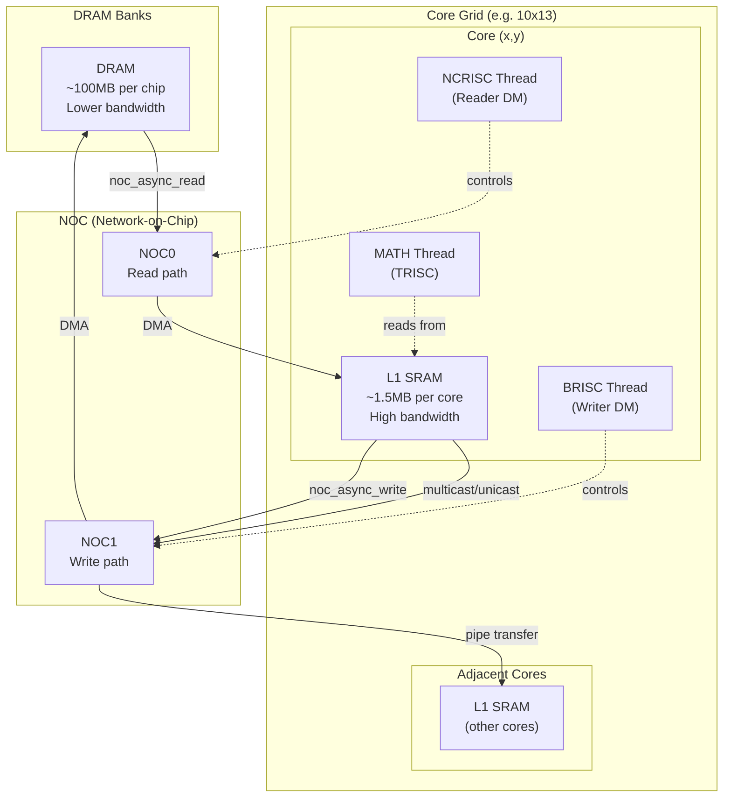

# What is tt-lang

Relevant source files
*   [.github/scripts/probe-docker-image.sh](https://github.com/tenstorrent/tt-lang/blob/d76e6233/.github/scripts/probe-docker-image.sh)
*   [.github/scripts/tests/test_probe_docker_image.bats](https://github.com/tenstorrent/tt-lang/blob/d76e6233/.github/scripts/tests/test_probe_docker_image.bats)
*   [.github/workflows/publish-s3-pypi.yml](https://github.com/tenstorrent/tt-lang/blob/d76e6233/.github/workflows/publish-s3-pypi.yml)
*   [.gitignore](https://github.com/tenstorrent/tt-lang/blob/d76e6233/.gitignore)
*   [CLAUDE.md](https://github.com/tenstorrent/tt-lang/blob/d76e6233/CLAUDE.md?plain=1)
*   [README.md](https://github.com/tenstorrent/tt-lang/blob/d76e6233/README.md?plain=1)
*   [docs/sphinx/getting-started.md](https://github.com/tenstorrent/tt-lang/blob/d76e6233/docs/sphinx/getting-started.md?plain=1)
*   [docs/sphinx/index.rst](https://github.com/tenstorrent/tt-lang/blob/d76e6233/docs/sphinx/index.rst)
*   [docs/sphinx/overview.md](https://github.com/tenstorrent/tt-lang/blob/d76e6233/docs/sphinx/overview.md?plain=1)
*   [docs/sphinx/programming-guide.md](https://github.com/tenstorrent/tt-lang/blob/d76e6233/docs/sphinx/programming-guide.md?plain=1)
*   [docs/sphinx/reference/performance-tools.md](https://github.com/tenstorrent/tt-lang/blob/d76e6233/docs/sphinx/reference/performance-tools.md?plain=1)
*   [docs/sphinx/specs/TTLangSpecification.md](https://github.com/tenstorrent/tt-lang/blob/d76e6233/docs/sphinx/specs/TTLangSpecification.md?plain=1)
*   [docs/sphinx/testing.md](https://github.com/tenstorrent/tt-lang/blob/d76e6233/docs/sphinx/testing.md?plain=1)
*   [docs/sphinx/tour/dataflow-buffers.md](https://github.com/tenstorrent/tt-lang/blob/d76e6233/docs/sphinx/tour/dataflow-buffers.md?plain=1)
*   [docs/sphinx/tour/index.md](https://github.com/tenstorrent/tt-lang/blob/d76e6233/docs/sphinx/tour/index.md?plain=1)
*   [examples/elementwise-tutorial/step_0_ttnn_base.py](https://github.com/tenstorrent/tt-lang/blob/d76e6233/examples/elementwise-tutorial/step_0_ttnn_base.py)
*   [examples/elementwise-tutorial/step_1_single_node_single_tile_block.py](https://github.com/tenstorrent/tt-lang/blob/d76e6233/examples/elementwise-tutorial/step_1_single_node_single_tile_block.py)
*   [examples/elementwise-tutorial/step_2_single_node_multitile_block.py](https://github.com/tenstorrent/tt-lang/blob/d76e6233/examples/elementwise-tutorial/step_2_single_node_multitile_block.py)
*   [examples/elementwise-tutorial/step_3_multinode.py](https://github.com/tenstorrent/tt-lang/blob/d76e6233/examples/elementwise-tutorial/step_3_multinode.py)
*   [examples/eltwise_pipe_node3.py](https://github.com/tenstorrent/tt-lang/blob/d76e6233/examples/eltwise_pipe_node3.py)
*   [include/ttlang/Dialect/TTL/Transforms/DFBMaterialization.h](https://github.com/tenstorrent/tt-lang/blob/d76e6233/include/ttlang/Dialect/TTL/Transforms/DFBMaterialization.h)
*   [lib/Dialect/TTL/Transforms/DFBMaterialization.cpp](https://github.com/tenstorrent/tt-lang/blob/d76e6233/lib/Dialect/TTL/Transforms/DFBMaterialization.cpp)
*   [lib/Dialect/TTL/Transforms/TTLInsertIntermediateDFBs.cpp](https://github.com/tenstorrent/tt-lang/blob/d76e6233/lib/Dialect/TTL/Transforms/TTLInsertIntermediateDFBs.cpp)
*   [python/CMakeLists.txt](https://github.com/tenstorrent/tt-lang/blob/d76e6233/python/CMakeLists.txt)
*   [python/pykernel/_src/kernel_ast.py](https://github.com/tenstorrent/tt-lang/blob/d76e6233/python/pykernel/_src/kernel_ast.py)
*   [test/python/invalid/invalid_reduce_scalar_undefined.py](https://github.com/tenstorrent/tt-lang/blob/d76e6233/test/python/invalid/invalid_reduce_scalar_undefined.py)
*   [test/python/simple_reduce_scalar.py](https://github.com/tenstorrent/tt-lang/blob/d76e6233/test/python/simple_reduce_scalar.py)

This document explains the goals, design philosophy, and key features of tt-lang, including its Python-based DSL and MLIR-based compilation infrastructure. For installation instructions, see [Installation and Setup](https://deepwiki.com/tenstorrent/tt-lang/1.2-installation-and-setup). For a quick hands-on introduction, see [Quick Start Guide](https://deepwiki.com/tenstorrent/tt-lang/1.3-quick-start-guide).

* * *

## Overview

tt-lang is a Python-based domain-specific language (DSL) for authoring high-performance custom kernels on Tenstorrent hardware. It occupies a strategic middle ground between [TT-NN](https://docs.tenstorrent.com/tt-metal/latest/ttnn/index.html) (high-level tensor operations) and [TT-Metalium](https://docs.tenstorrent.com/tt-metal/latest/tt-metalium/index.html) (low-level hardware primitives), providing compiler-managed resource allocation and optimization while maintaining fine-grained control over execution. [README.md 27-30](https://github.com/tenstorrent/tt-lang/blob/d76e6233/README.md?plain=1#L27-L30)

The language is tightly integrated with TT-NN, allowing users to express fused operations and custom patterns that TT-NN cannot represent, while avoiding the complexity of manual memory management, NOC addressing, and register allocation required in TT-Metalium. [docs/sphinx/specs/TTLangSpecification.md 52-54](https://github.com/tenstorrent/tt-lang/blob/d76e6233/docs/sphinx/specs/TTLangSpecification.md?plain=1#L52-L54)

**Sources:**[README.md 27-40](https://github.com/tenstorrent/tt-lang/blob/d76e6233/README.md?plain=1#L27-L40)[docs/sphinx/specs/TTLangSpecification.md 52-58](https://github.com/tenstorrent/tt-lang/blob/d76e6233/docs/sphinx/specs/TTLangSpecification.md?plain=1#L52-L58)

* * *




Sources: [python/ttl/ttl_api.py:98-98](), [benchmarks/matmul/config.py:76-78](), [benchmarks/matmul/NOTES.md:68-74]()
```
## Design Philosophy: Progressive Disclosure

tt-lang follows a **progressive disclosure** design philosophy: simple kernels require minimal specification where the compiler infers details like NOC addressing and DST register allocation, while complex kernels allow developers to specify fine-grained control over pipelining, memory layout, and synchronization. [README.md 39-40](https://github.com/tenstorrent/tt-lang/blob/d76e6233/README.md?plain=1#L39-L40)

### Complexity Progression

**Sources:**[README.md 39-40](https://github.com/tenstorrent/tt-lang/blob/d76e6233/README.md?plain=1#L39-L40)

* * *


```mermaid
graph LR
    "SimpleKernels"["Simple Kernels<br/>- Minimal code<br/>- Compiler infers<br/>- High-level abstractions"]
    "Intermediate"["Intermediate<br/>- Explicit threading<br/>- Manual DFBs<br/>- Grid specification"]
    "Complex"["Complex Kernels<br/>- Custom pipelining<br/>- Semaphores<br/>- NOC patterns"]
    
    "SimpleKernels" -->|"Add complexity as needed"| "Intermediate"
    "Intermediate" -->|"Full control available"| "Complex"
```
## Positioning in the Software Ecosystem

tt-lang bridges the gap between TT-NN's high-level operations and TT-Metalium's hardware primitives:

### Ecosystem Hierarchy

| Layer | Use When | Tradeoffs |
| --- | --- | --- |
| **TT-NN** | Standard operations, rapid prototyping | Easy, but limited to pre-built ops |
| **tt-lang** | Custom fusion, model optimization | Balance of control and productivity |
| **TT-Metalium** | Maximum performance, new primitives | Full control, but high complexity |

**Sources:**[README.md 27-40](https://github.com/tenstorrent/tt-lang/blob/d76e6233/README.md?plain=1#L27-L40)

* * *


```mermaid
graph TB
    subgraph "High-Level Abstraction"
        "TTNN"["TT-NN<br/>• Pre-built operations<br/>• Easy to use<br/>• Limited expressivity"]
    end
    
    subgraph "Middle Layer (tt-lang)"
        "TTLang"["tt-lang<br/>• Python DSL<br/>• Compiler-managed resources<br/>• Custom kernel fusion<br/>• Simulation + profiling"]
    end
    
    subgraph "Low-Level Hardware"
        "TTMetal"["TT-Metalium<br/>• Full hardware control<br/>• Manual memory management<br/>• Explicit NOC addressing"]
    end
    
    "TTNN" -->|"Need custom kernels"| "TTLang"
    "TTLang" -->|"Need maximum control"| "TTMetal"
```

| Layer | Use When | Tradeoffs |
|-------|----------|-----------|
| **TT-NN** | Standard operations, rapid prototyping | Easy, but limited to pre-built ops |
| **tt-lang** | Custom fusion, model optimization | Balance of control and productivity |
| **TT-Metalium** | Maximum performance, new primitives | Full control, but high complexity |
```
## Core Goals

1.   **Kernel Fusion for Model Deployment**: The primary use case is fusing sequences of TT-NN operations into optimized kernels to avoid the overhead of rewriting in TT-Metalium. [README.md 39-40](https://github.com/tenstorrent/tt-lang/blob/d76e6233/README.md?plain=1#L39-L40)
2.   **Compiler-Managed Resources**: Automated DST register allocation, Circular Buffer (CB) lifecycle management, and NOC address generation eliminate manual bookkeeping. [README.md 39-40](https://github.com/tenstorrent/tt-lang/blob/d76e6233/README.md?plain=1#L39-L40)
3.   **Fast Validation Cycle**: Functional simulator enables correctness checking without hardware, catching bugs in the IDE rather than on device. [README.md 35-36](https://github.com/tenstorrent/tt-lang/blob/d76e6233/README.md?plain=1#L35-L36)
4.   **AI-Assisted Development**: Python as the host language enables reliable translation from GPU DSLs (Triton, CUDA, cuTile, TileLang) to Tenstorrent hardware. [README.md 35-36](https://github.com/tenstorrent/tt-lang/blob/d76e6233/README.md?plain=1#L35-L36)
5.   **Integrated Performance Analysis**: Line-by-line cycle counts and data flow graphs guide optimization. [README.md 35-36](https://github.com/tenstorrent/tt-lang/blob/d76e6233/README.md?plain=1#L35-L36)

**Sources:**[README.md 27-40](https://github.com/tenstorrent/tt-lang/blob/d76e6233/README.md?plain=1#L27-L40)[docs/sphinx/specs/TTLangSpecification.md 52-58](https://github.com/tenstorrent/tt-lang/blob/d76e6233/docs/sphinx/specs/TTLangSpecification.md?plain=1#L52-L58)

* * *

## Key Features

### Python DSL with Decorators

Kernels are defined as Python functions with `@ttl.operation`. Inside, logic is partitioned into thread functions using `@ttl.compute` and `@ttl.datamovement` decorators. [docs/sphinx/specs/TTLangSpecification.md 59-61](https://github.com/tenstorrent/tt-lang/blob/d76e6233/docs/sphinx/specs/TTLangSpecification.md?plain=1#L59-L61)

`@ttl.operation()def __foo(x: ttnn.Tensor, y: ttnn.Tensor) -> None:    @ttl.compute()    def some_compute():        # MATH thread logic        pass     @ttl.datamovement()    def some_dm():        # BRISC/NCRISC logic        pass`
[docs/sphinx/specs/TTLangSpecification.md 65-83](https://github.com/tenstorrent/tt-lang/blob/d76e6233/docs/sphinx/specs/TTLangSpecification.md?plain=1#L65-L83)

### MLIR-Based Compilation Pipeline

tt-lang uses a multi-stage compilation pipeline built on MLIR infrastructure to lower high-level Python AST into hardware-specific C++. This includes specific dialects for representing TT-specific operations. [python/pykernel/_src/kernel_ast.py 11-13](https://github.com/tenstorrent/tt-lang/blob/d76e6233/python/pykernel/_src/kernel_ast.py#L11-L13)

### Compilation Data Flow

**Sources:**[python/pykernel/_src/kernel_ast.py 61-127](https://github.com/tenstorrent/tt-lang/blob/d76e6233/python/pykernel/_src/kernel_ast.py#L61-L127)[lib/Dialect/TTL/Transforms/TTLInsertIntermediateDFBs.cpp 33-42](https://github.com/tenstorrent/tt-lang/blob/d76e6233/lib/Dialect/TTL/Transforms/TTLInsertIntermediateDFBs.cpp#L33-L42)

### Dual Execution Paths

tt-lang provides two execution paths for different development stages:

### Execution Model

| Path | Use When | Key Features |
| --- | --- | --- |
| **Simulator** | Logic validation, rapid debugging | Pure Python execution, no hardware needed. [docs/sphinx/getting-started.md 128](https://github.com/tenstorrent/tt-lang/blob/d76e6233/docs/sphinx/getting-started.md?plain=1#L128-L128) |
| **Hardware** | Performance profiling, deployment | Full MLIR compilation to C++, runs on Tenstorrent cores. [docs/sphinx/getting-started.md 129](https://github.com/tenstorrent/tt-lang/blob/d76e6233/docs/sphinx/getting-started.md?plain=1#L129-L129) |

**Sources:**[docs/sphinx/getting-started.md 125-130](https://github.com/tenstorrent/tt-lang/blob/d76e6233/docs/sphinx/getting-started.md?plain=1#L125-L130)[README.md 75-80](https://github.com/tenstorrent/tt-lang/blob/d76e6233/README.md?plain=1#L75-L80)


```mermaid
graph TB
    "KernelCode"["Kernel Code<br/>my_kernel.py"]
    
    subgraph "Development Path"
        "Sim"["Functional Simulator<br/>tt-lang-sim<br/>• Pure Python<br/>• No HW required"]
    end
    
    subgraph "Production Path"
        "HW"["Hardware Execution<br/>• Full Compiler Build<br/>• Tenstorrent Device"]
    end
    
    "KernelCode" -->|"tt-lang-sim"| "Sim"
    "KernelCode" -->|"python"| "HW"
```

| Path | Use When | Key Features |
|------|----------|--------------|
| **Simulator** | Logic validation, rapid debugging | Pure Python execution, no hardware needed. [docs/sphinx/getting-started.md:128-128](). |
| **Hardware** | Performance profiling, deployment | Full MLIR compilation to C++, runs on Tenstorrent cores. [docs/sphinx/getting-started.md:129-129](). |
```
### Explicit Thread Model

The programming model is centered around explicit specification of data movement and compute threads and explicit synchronization between them. [docs/sphinx/specs/TTLangSpecification.md 52-54](https://github.com/tenstorrent/tt-lang/blob/d76e6233/docs/sphinx/specs/TTLangSpecification.md?plain=1#L52-L54)

| Thread Type | Decorator | Hardware Mapping | Purpose |
| --- | --- | --- | --- |
| **Compute** | `@ttl.compute()` | Tensix MATH (TRISC) | Tile math operations, matrix multiply, SFPU. [docs/sphinx/specs/TTLangSpecification.md 74-75](https://github.com/tenstorrent/tt-lang/blob/d76e6233/docs/sphinx/specs/TTLangSpecification.md?plain=1#L74-L75) |
| **Data Movement** | `@ttl.datamovement()` | BRISC / NCRISC | Data transfers between DRAM/L1 and Dataflow Buffers. [docs/sphinx/specs/TTLangSpecification.md 78-83](https://github.com/tenstorrent/tt-lang/blob/d76e6233/docs/sphinx/specs/TTLangSpecification.md?plain=1#L78-L83) |

Threads communicate via **Dataflow Buffers** (DFBs), which provide producer-consumer synchronization. [docs/sphinx/specs/TTLangSpecification.md 36-38](https://github.com/tenstorrent/tt-lang/blob/d76e6233/docs/sphinx/specs/TTLangSpecification.md?plain=1#L36-L38)

**Sources:**[docs/sphinx/specs/TTLangSpecification.md 52-83](https://github.com/tenstorrent/tt-lang/blob/d76e6233/docs/sphinx/specs/TTLangSpecification.md?plain=1#L52-L83)[docs/sphinx/specs/TTLangSpecification.md 36-38](https://github.com/tenstorrent/tt-lang/blob/d76e6233/docs/sphinx/specs/TTLangSpecification.md?plain=1#L36-L38)

* * *

## System Components

The following diagram maps high-level concepts to concrete code entities in the repository:

### Code Entity Map

**Sources:**[python/pykernel/_src/kernel_ast.py 61-65](https://github.com/tenstorrent/tt-lang/blob/d76e6233/python/pykernel/_src/kernel_ast.py#L61-L65)[lib/Dialect/TTL/Transforms/TTLInsertIntermediateDFBs.cpp 39-42](https://github.com/tenstorrent/tt-lang/blob/d76e6233/lib/Dialect/TTL/Transforms/TTLInsertIntermediateDFBs.cpp#L39-L42)[lib/Dialect/TTL/Transforms/DFBMaterialization.cpp 66-70](https://github.com/tenstorrent/tt-lang/blob/d76e6233/lib/Dialect/TTL/Transforms/DFBMaterialization.cpp#L66-L70)[python/CMakeLists.txt 157-161](https://github.com/tenstorrent/tt-lang/blob/d76e6233/python/CMakeLists.txt#L157-L161)

* * *


```mermaid
graph TB
    subgraph "Frontend"
        "ASTVisitor"["TTCompilerBase<br/>[python/pykernel/_src/kernel_ast.py]"]
        "Spec"["Language Spec<br/>[docs/sphinx/specs/TTLangSpecification.md]"]
    end
    
    subgraph "Dialects & Passes"
        "TTLOps"["TTL Dialect<br/>[lib/Dialect/TTL]"]
        "IntermediatePass"["TTLInsertIntermediateDFBsPass<br/>[lib/Dialect/TTL/Transforms/TTLInsertIntermediateDFBs.cpp]"]
        "Materialization"["DFBMaterialization<br/>[lib/Dialect/TTL/Transforms/DFBMaterialization.cpp]"]
    end
    
    subgraph "Tooling"
        "Sim"["ttlang-sim CLI<br/>[docs/sphinx/getting-started.md]"]
        "Config"["Python Config<br/>[python/ttl/config.py.in]"]
    end
    
    "ASTVisitor" -.-> "TTLOps"
    "TTLOps" --> "IntermediatePass"
    "IntermediatePass" --> "Materialization"
    "Config" -.-> "ASTVisitor"
```
## Summary

tt-lang provides a productive middle ground for custom kernel development on Tenstorrent hardware by combining:

*   **Python DSL** with familiar syntax and integration with TT-NN. [docs/sphinx/specs/TTLangSpecification.md 52-54](https://github.com/tenstorrent/tt-lang/blob/d76e6233/docs/sphinx/specs/TTLangSpecification.md?plain=1#L52-L54)
*   **MLIR compilation** for automated resource management including DFB materialization and transformation. [lib/Dialect/TTL/Transforms/DFBMaterialization.cpp 12-14](https://github.com/tenstorrent/tt-lang/blob/d76e6233/lib/Dialect/TTL/Transforms/DFBMaterialization.cpp#L12-L14)
*   **Functional simulator** for rapid iteration without hardware. [README.md 35-36](https://github.com/tenstorrent/tt-lang/blob/d76e6233/README.md?plain=1#L35-L36)
*   **Integrated profiling** to identify bottlenecks early. [README.md 35-36](https://github.com/tenstorrent/tt-lang/blob/d76e6233/README.md?plain=1#L35-L36)

For detailed language specification, see [TT-Lang Specification](https://github.com/tenstorrent/tt-lang/blob/d76e6233/TT-Lang%20Specification) For hands-on examples, see [Quick Start Guide](https://deepwiki.com/tenstorrent/tt-lang/1.3-quick-start-guide).

**Sources:**[README.md 27-40](https://github.com/tenstorrent/tt-lang/blob/d76e6233/README.md?plain=1#L27-L40)[docs/sphinx/specs/TTLangSpecification.md 1-100](https://github.com/tenstorrent/tt-lang/blob/d76e6233/docs/sphinx/specs/TTLangSpecification.md?plain=1#L1-L100)[lib/Dialect/TTL/Transforms/DFBMaterialization.cpp 1-89](https://github.com/tenstorrent/tt-lang/blob/d76e6233/lib/Dialect/TTL/Transforms/DFBMaterialization.cpp#L1-L89)

Dismiss
Refresh this wiki

Enter email to refresh
