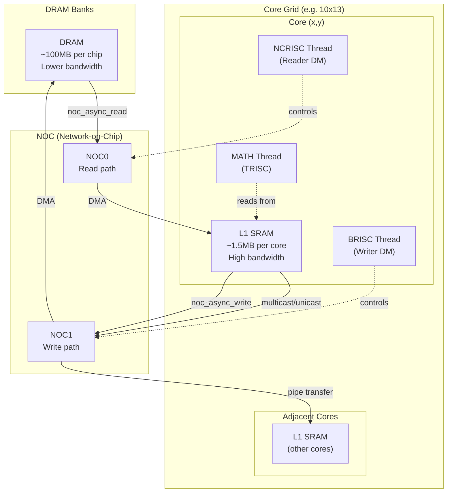
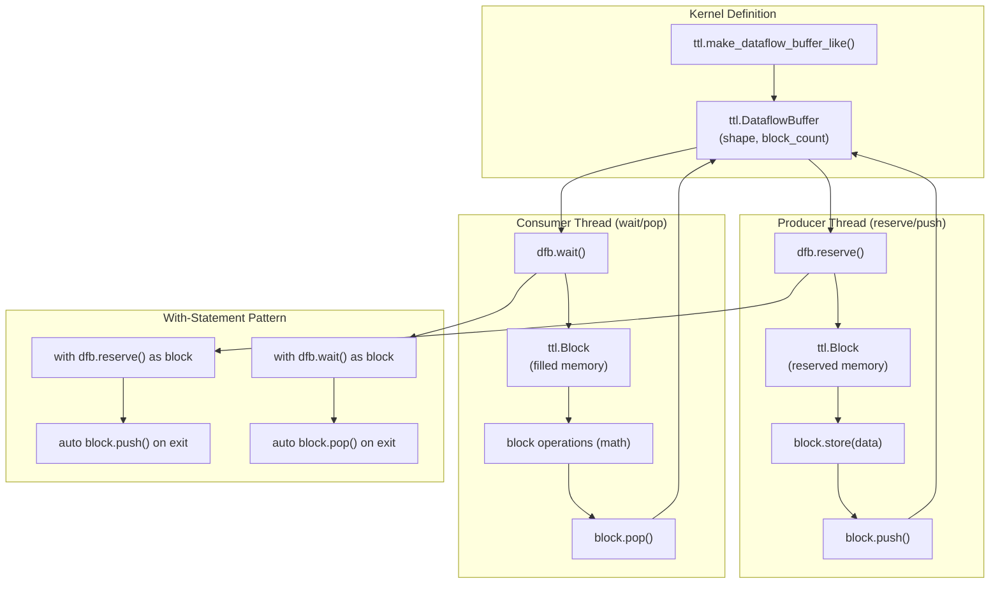
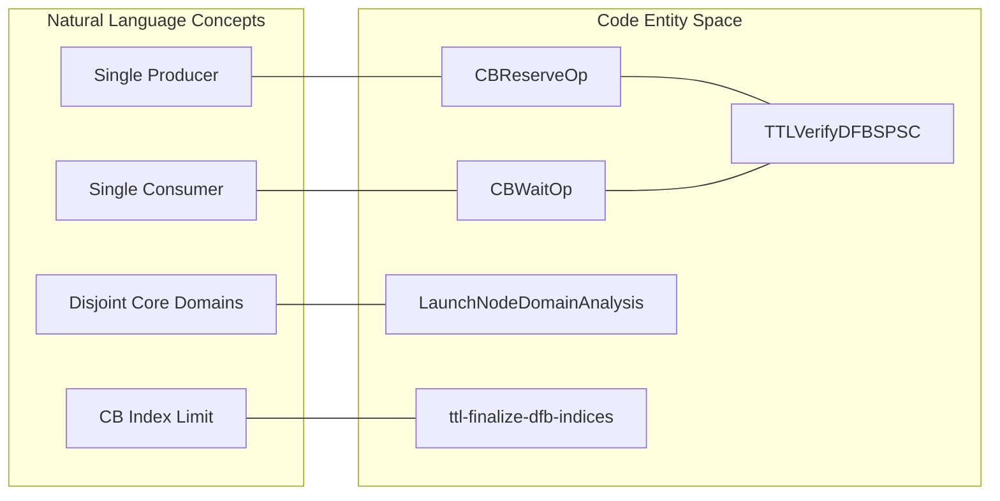
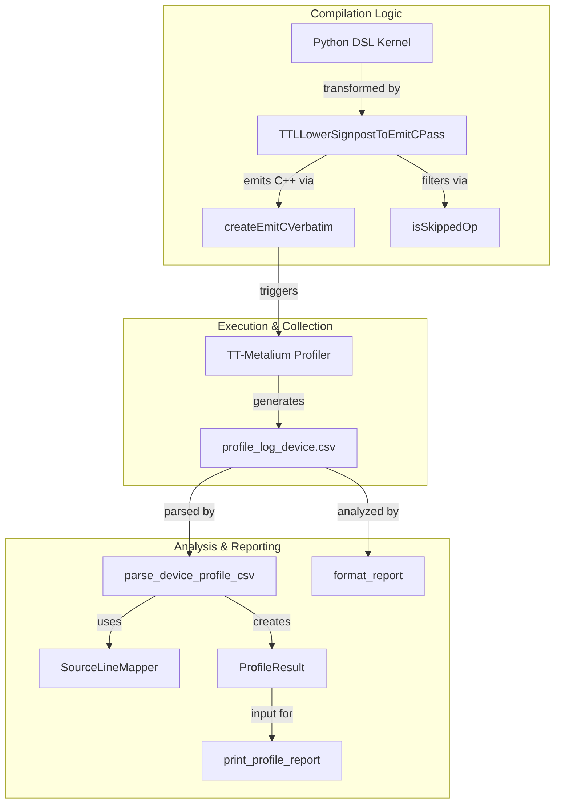

# Dataflow Buffer API

Relevant source files
*   [docs/development/DFBManagement.md](https://github.com/tenstorrent/tt-lang/blob/d76e6233/docs/development/DFBManagement.md?plain=1)
*   [docs/sphinx/specs/TTLangSpecification.md](https://github.com/tenstorrent/tt-lang/blob/d76e6233/docs/sphinx/specs/TTLangSpecification.md?plain=1)
*   [examples/elementwise-tutorial/step_0_ttnn_base.py](https://github.com/tenstorrent/tt-lang/blob/d76e6233/examples/elementwise-tutorial/step_0_ttnn_base.py)
*   [examples/elementwise-tutorial/step_1_single_node_single_tile_block.py](https://github.com/tenstorrent/tt-lang/blob/d76e6233/examples/elementwise-tutorial/step_1_single_node_single_tile_block.py)
*   [examples/elementwise-tutorial/step_2_single_node_multitile_block.py](https://github.com/tenstorrent/tt-lang/blob/d76e6233/examples/elementwise-tutorial/step_2_single_node_multitile_block.py)
*   [examples/elementwise-tutorial/step_3_multinode.py](https://github.com/tenstorrent/tt-lang/blob/d76e6233/examples/elementwise-tutorial/step_3_multinode.py)
*   [include/ttlang/Dialect/TTL/Transforms/DFBMaterialization.h](https://github.com/tenstorrent/tt-lang/blob/d76e6233/include/ttlang/Dialect/TTL/Transforms/DFBMaterialization.h)
*   [lib/Dialect/TTL/Transforms/DFBMaterialization.cpp](https://github.com/tenstorrent/tt-lang/blob/d76e6233/lib/Dialect/TTL/Transforms/DFBMaterialization.cpp)
*   [lib/Dialect/TTL/Transforms/TTLInsertIntermediateDFBs.cpp](https://github.com/tenstorrent/tt-lang/blob/d76e6233/lib/Dialect/TTL/Transforms/TTLInsertIntermediateDFBs.cpp)
*   [lib/Dialect/TTL/Transforms/TTLVerifyDFBSPSC.cpp](https://github.com/tenstorrent/tt-lang/blob/d76e6233/lib/Dialect/TTL/Transforms/TTLVerifyDFBSPSC.cpp)
*   [python/pykernel/_src/kernel_ast.py](https://github.com/tenstorrent/tt-lang/blob/d76e6233/python/pykernel/_src/kernel_ast.py)
*   [test/python/invalid/invalid_reduce_scalar_undefined.py](https://github.com/tenstorrent/tt-lang/blob/d76e6233/test/python/invalid/invalid_reduce_scalar_undefined.py)
*   [test/python/simple_reduce_scalar.py](https://github.com/tenstorrent/tt-lang/blob/d76e6233/test/python/simple_reduce_scalar.py)
*   [test/ttlang/Dialect/TTL/IR/raw_element_ops.mlir](https://github.com/tenstorrent/tt-lang/blob/d76e6233/test/ttlang/Dialect/TTL/IR/raw_element_ops.mlir)
*   [test/ttlang/Dialect/TTL/IR/raw_element_ops_invalid.mlir](https://github.com/tenstorrent/tt-lang/blob/d76e6233/test/ttlang/Dialect/TTL/IR/raw_element_ops_invalid.mlir)
*   [test/ttlang/Dialect/TTL/Transforms/verify_dfb_spsc.mlir](https://github.com/tenstorrent/tt-lang/blob/d76e6233/test/ttlang/Dialect/TTL/Transforms/verify_dfb_spsc.mlir)
*   [test/ttlang/Dialect/TTL/Transforms/verify_dfb_spsc_invalid.mlir](https://github.com/tenstorrent/tt-lang/blob/d76e6233/test/ttlang/Dialect/TTL/Transforms/verify_dfb_spsc_invalid.mlir)

This page provides the API reference for dataflow buffers (DFBs), the primary communication primitive for synchronizing data flow between thread functions within a Tensix core. A dataflow buffer manages a fixed-size circular buffer with producer-consumer semantics, enabling double-buffering and pipelining between compute and data movement threads.

For conceptual documentation on dataflow buffers, see page 2.1.3 (Dataflow Buffers). For information about kernel decorators, see page 10.1. For memory operations including `ttl.copy()`, see page 10.3. For tile operations that work on `Block` objects, see page 10.4.

## Overview

The dataflow buffer API consists of factory functions for creation and acquisition/release methods for lifecycle management. In version 0.15 of the specification, `buffer_factor` was renamed to `block_count`[docs/sphinx/specs/TTLangSpecification.md 47](https://github.com/tenstorrent/tt-lang/blob/d76e6233/docs/sphinx/specs/TTLangSpecification.md?plain=1#L47-L47)

| API Component | Purpose | Usage Context |
| --- | --- | --- |
| `ttl.make_dataflow_buffer_like()` | Factory function for creating dataflow buffers | Kernel definition scope |
| `ttl.DataflowBuffer` | Dataflow buffer handle | Both thread types |
| `ttl.DataflowBuffer.reserve()` | Producer acquire operation (returns Block) | Producer thread (typically datamovement) |
| `ttl.DataflowBuffer.wait()` | Consumer acquire operation (returns Block) | Consumer thread (typically compute) |
| `ttl.Block` | Memory window with push/pop/store operations | Returned by reserve/wait |
| `ttl.Block.push()` | Producer release operation | After reserve |
| `ttl.Block.pop()` | Consumer release operation | After wait |
| `ttl.Block.store()` | Store data into block | Compute thread |

Sources: [docs/sphinx/specs/TTLangSpecification.md 130-175](https://github.com/tenstorrent/tt-lang/blob/d76e6233/docs/sphinx/specs/TTLangSpecification.md?plain=1#L130-L175)[docs/sphinx/specs/TTLangSpecification.md 47](https://github.com/tenstorrent/tt-lang/blob/d76e6233/docs/sphinx/specs/TTLangSpecification.md?plain=1#L47-L47)[docs/sphinx/specs/TTLangSpecification.md 38](https://github.com/tenstorrent/tt-lang/blob/d76e6233/docs/sphinx/specs/TTLangSpecification.md?plain=1#L38-L38)




Sources: [python/ttl/ttl_api.py:98-98](), [benchmarks/matmul/config.py:76-78](), [benchmarks/matmul/NOTES.md:68-74]()
```
## API Workflow

**Diagram: Dataflow Buffer API Call Flow**

Sources: [docs/sphinx/specs/TTLangSpecification.md 142-166](https://github.com/tenstorrent/tt-lang/blob/d76e6233/docs/sphinx/specs/TTLangSpecification.md?plain=1#L142-L166)[docs/sphinx/specs/TTLangSpecification.md 38-40](https://github.com/tenstorrent/tt-lang/blob/d76e6233/docs/sphinx/specs/TTLangSpecification.md?plain=1#L38-L40)




Sources: [docs/sphinx/specs/TTLangSpecification.md:142-166](), [docs/sphinx/specs/TTLangSpecification.md:38-40]()
```
## make_dataflow_buffer_like()

### Function Signature

Factory function for creating dataflow buffers. The `block_count` determines how many blocks of the specified `shape` are allocated in the circular buffer. The compiler uses this to manage L1 memory and physical CB indices [docs/development/DFBManagement.md 3-9](https://github.com/tenstorrent/tt-lang/blob/d76e6233/docs/development/DFBManagement.md?plain=1#L3-L9)

Sources: [docs/sphinx/specs/TTLangSpecification.md 108-113](https://github.com/tenstorrent/tt-lang/blob/d76e6233/docs/sphinx/specs/TTLangSpecification.md?plain=1#L108-L113)[docs/development/DFBManagement.md 3-9](https://github.com/tenstorrent/tt-lang/blob/d76e6233/docs/development/DFBManagement.md?plain=1#L3-L9)

### Parameters

| Parameter | Type | Description |
| --- | --- | --- |
| `likeness_tensor` | `ttnn.Tensor` | TT-NN tensor that determines data type and shape unit (Tile vs Row-Major) |
| `shape` | `ttl.Shape` | Shape of blocks returned by reserve/wait |
| `block_count` | `ttl.Size` | Total buffer capacity = block size × block_count (default: 2) |

The `likeness_tensor` determines the **shape unit**:

*   **Tiled layout** (`ttnn.TILE_LAYOUT`): Shape unit is one tile (32×32 scalars) [examples/elementwise-tutorial/step_3_multinode.py 36-37](https://github.com/tenstorrent/tt-lang/blob/d76e6233/examples/elementwise-tutorial/step_3_multinode.py#L36-L37)
*   **Row-major layout**: Shape unit is one scalar.

Sources: [examples/elementwise-tutorial/step_3_multinode.py 36-37](https://github.com/tenstorrent/tt-lang/blob/d76e6233/examples/elementwise-tutorial/step_3_multinode.py#L36-L37)[docs/sphinx/specs/TTLangSpecification.md 108-113](https://github.com/tenstorrent/tt-lang/blob/d76e6233/docs/sphinx/specs/TTLangSpecification.md?plain=1#L108-L113)

## DataflowBuffer Class

`ttl.DataflowBuffer` provides the main interface for producer-consumer synchronization.

### Acquisition Methods

| Method | Returns | Thread Type | Description |
| --- | --- | --- | --- |
| `reserve()` | `ttl.Block` | Producer | Reserves a free block for writing. Blocks until space available. |
| `wait()` | `ttl.Block` | Consumer | Waits for a filled block for reading. Blocks until data available. |

Sources: [docs/sphinx/specs/TTLangSpecification.md 137-175](https://github.com/tenstorrent/tt-lang/blob/d76e6233/docs/sphinx/specs/TTLangSpecification.md?plain=1#L137-L175)[docs/development/DFBManagement.md 39-45](https://github.com/tenstorrent/tt-lang/blob/d76e6233/docs/development/DFBManagement.md?plain=1#L39-L45)

### With-Statement Pattern (Recommended)

The Python DSL supports context manager usage for automatic lifecycle management [examples/elementwise-tutorial/step_3_multinode.py 82-88](https://github.com/tenstorrent/tt-lang/blob/d76e6233/examples/elementwise-tutorial/step_3_multinode.py#L82-L88)

Sources: [examples/elementwise-tutorial/step_3_multinode.py 82-88](https://github.com/tenstorrent/tt-lang/blob/d76e6233/examples/elementwise-tutorial/step_3_multinode.py#L82-L88)[docs/sphinx/specs/TTLangSpecification.md 142-166](https://github.com/tenstorrent/tt-lang/blob/d76e6233/docs/sphinx/specs/TTLangSpecification.md?plain=1#L142-L166)

## Block Class

`ttl.Block` represents a memory window acquired from a DFB.

### Release Methods

| Method | Returns | Usage Context | Description |
| --- | --- | --- | --- |
| `push()` | `None` | After reserve() | Producer release: signals block is available for consumers |
| `pop()` | `None` | After wait() | Consumer release: signals block is free for producers |

Sources: [docs/sphinx/specs/TTLangSpecification.md 38](https://github.com/tenstorrent/tt-lang/blob/d76e6233/docs/sphinx/specs/TTLangSpecification.md?plain=1#L38-L38)[docs/development/DFBManagement.md 41-42](https://github.com/tenstorrent/tt-lang/blob/d76e6233/docs/development/DFBManagement.md?plain=1#L41-L42)

### Block Operations

#### Data Storage

Materializes the result of a block expression into the block. This operation is lowered to `ttl.store` in the MLIR pipeline [lib/Dialect/TTL/Transforms/DFBMaterialization.cpp 51-58](https://github.com/tenstorrent/tt-lang/blob/d76e6233/lib/Dialect/TTL/Transforms/DFBMaterialization.cpp#L51-L58)

#### Arithmetic Operations

Blocks participate in expressions using Python operators which are lowered to fused compute operations.

| Operator | Operation |
| --- | --- |
| `+`, `-`, `*`, `/` | Element-wise arithmetic [examples/elementwise-tutorial/step_3_multinode.py 88](https://github.com/tenstorrent/tt-lang/blob/d76e6233/examples/elementwise-tutorial/step_3_multinode.py#L88-L88) |
| `@` | Matrix multiplication |

Sources: [examples/elementwise-tutorial/step_3_multinode.py 88](https://github.com/tenstorrent/tt-lang/blob/d76e6233/examples/elementwise-tutorial/step_3_multinode.py#L88-L88)[lib/Dialect/TTL/Transforms/DFBMaterialization.cpp 51-58](https://github.com/tenstorrent/tt-lang/blob/d76e6233/lib/Dialect/TTL/Transforms/DFBMaterialization.cpp#L51-L58)

## Compiler and Hardware Constraints

The `ttl-verify-dfb-spsc` pass enforces strict single-producer single-consumer semantics per core [lib/Dialect/TTL/Transforms/TTLVerifyDFBSPSC.cpp 9-12](https://github.com/tenstorrent/tt-lang/blob/d76e6233/lib/Dialect/TTL/Transforms/TTLVerifyDFBSPSC.cpp#L9-L12)

### Natural Language to Code Entity Mapping

**Diagram: SPSC Verification Entity Association**

Sources: [lib/Dialect/TTL/Transforms/TTLVerifyDFBSPSC.cpp 5-23](https://github.com/tenstorrent/tt-lang/blob/d76e6233/lib/Dialect/TTL/Transforms/TTLVerifyDFBSPSC.cpp#L5-L23)[docs/development/DFBManagement.md 51-66](https://github.com/tenstorrent/tt-lang/blob/d76e6233/docs/development/DFBManagement.md?plain=1#L51-L66)




Sources: [lib/Dialect/TTL/Transforms/TTLVerifyDFBSPSC.cpp:5-23](), [docs/development/DFBManagement.md:51-66]()
```



### Key Constraints

| Constraint | Description |
| --- | --- |
| **SPSC Semantics** | Each DFB index must have exactly one producer and one consumer thread per physical node [docs/development/DFBManagement.md 51-58](https://github.com/tenstorrent/tt-lang/blob/d76e6233/docs/development/DFBManagement.md?plain=1#L51-L58) |
| **Index Limit** | Hardware supports at most 32 DFBs per node (indices 0-31) [docs/development/DFBManagement.md 9](https://github.com/tenstorrent/tt-lang/blob/d76e6233/docs/development/DFBManagement.md?plain=1#L9-L9) |
| **Index Reuse** | The `ttl-finalize-dfb-indices` pass performs lifetime-based index reuse to fit within the 32-index limit [docs/development/DFBManagement.md 19-20](https://github.com/tenstorrent/tt-lang/blob/d76e6233/docs/development/DFBManagement.md?plain=1#L19-L20) |
| **Compiler DFBs** | The compiler automatically inserts intermediate DFBs at fusion split points where a CB-attached operand is required [lib/Dialect/TTL/Transforms/TTLInsertIntermediateDFBs.cpp 9-13](https://github.com/tenstorrent/tt-lang/blob/d76e6233/lib/Dialect/TTL/Transforms/TTLInsertIntermediateDFBs.cpp#L9-L13) |

Sources: [docs/development/DFBManagement.md 9-20](https://github.com/tenstorrent/tt-lang/blob/d76e6233/docs/development/DFBManagement.md?plain=1#L9-L20)[docs/development/DFBManagement.md 51-58](https://github.com/tenstorrent/tt-lang/blob/d76e6233/docs/development/DFBManagement.md?plain=1#L51-L58)[lib/Dialect/TTL/Transforms/TTLInsertIntermediateDFBs.cpp 9-13](https://github.com/tenstorrent/tt-lang/blob/d76e6233/lib/Dialect/TTL/Transforms/TTLInsertIntermediateDFBs.cpp#L9-L13)

Dismiss
Refresh this wiki

Enter email to refresh
