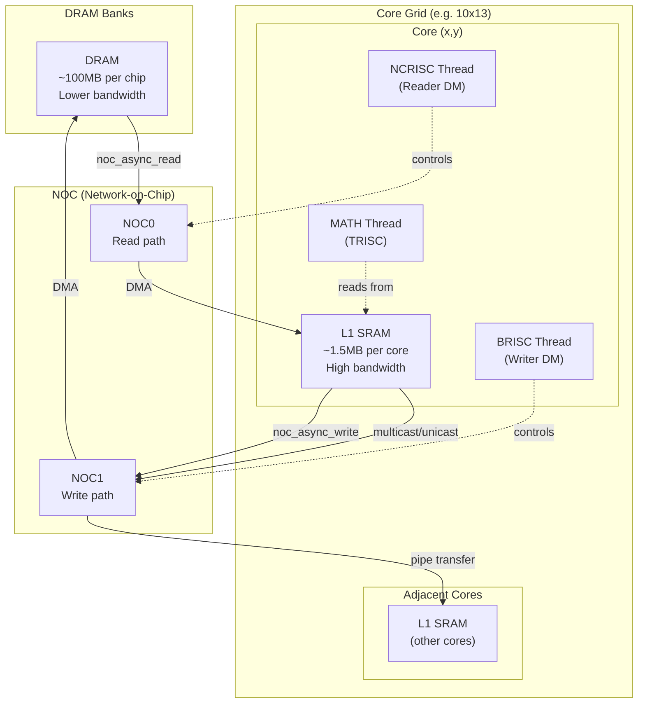
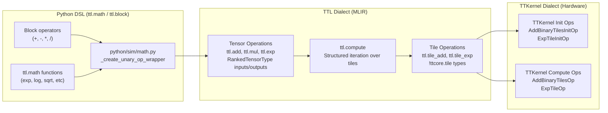
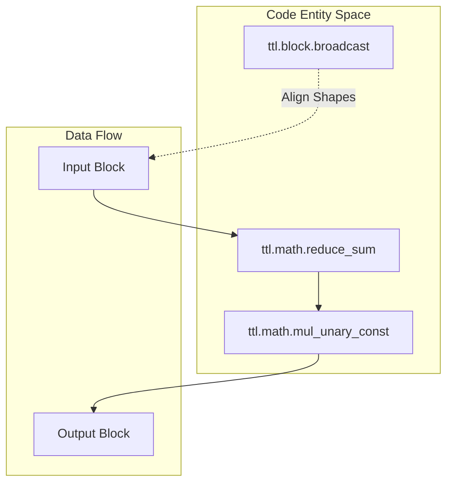
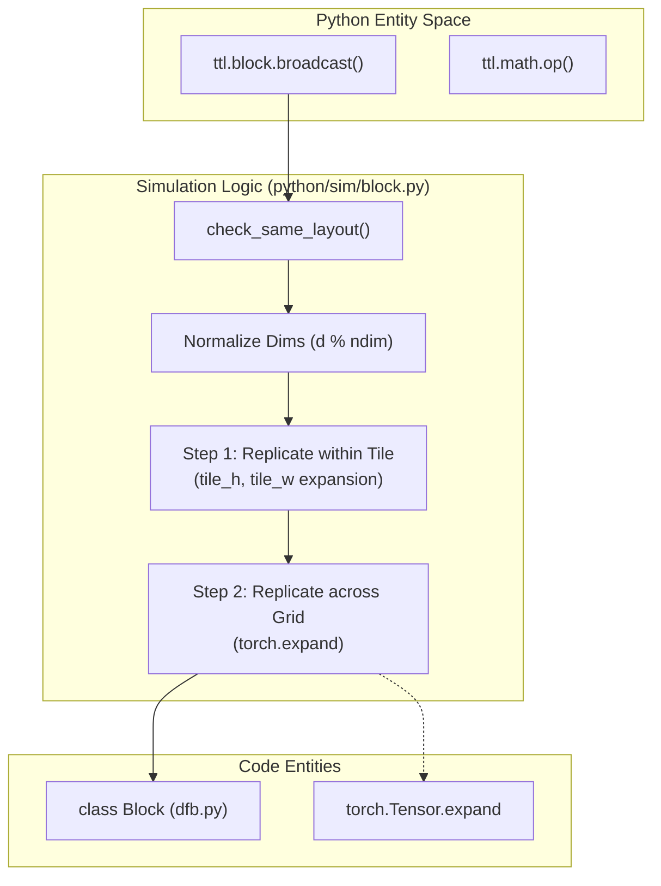
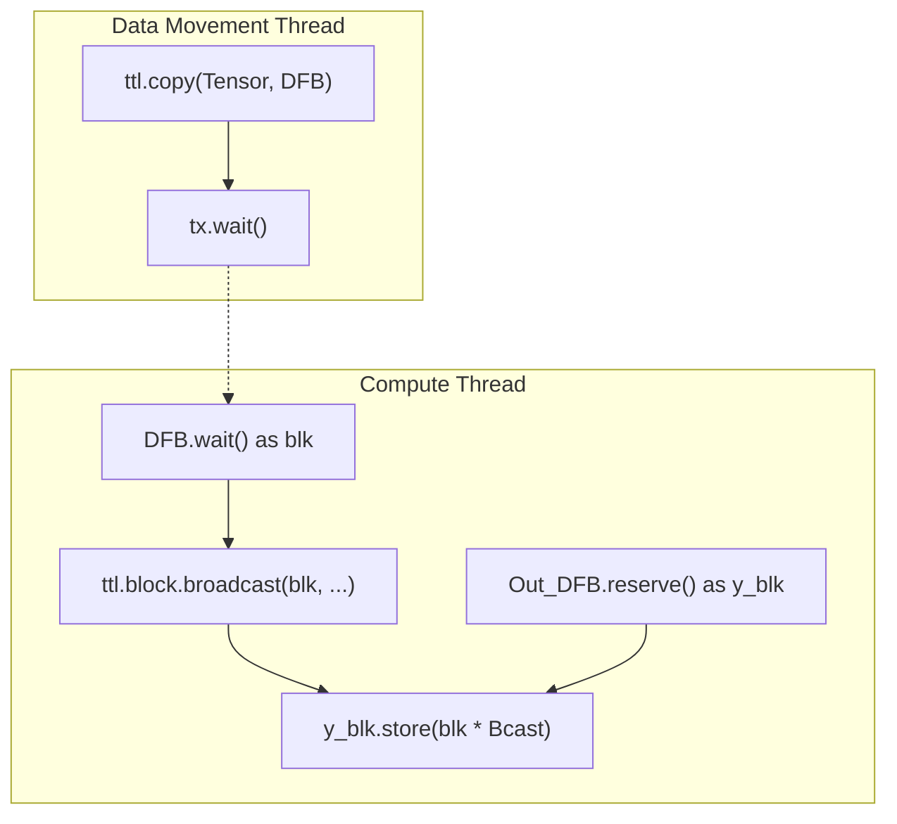

# Tile Math Operations

Relevant source files
*   [examples/broadcast.py](https://github.com/tenstorrent/tt-lang/blob/d76e6233/examples/broadcast.py)
*   [examples/general_broadcast.py](https://github.com/tenstorrent/tt-lang/blob/d76e6233/examples/general_broadcast.py)
*   [python/sim/block.py](https://github.com/tenstorrent/tt-lang/blob/d76e6233/python/sim/block.py)
*   [python/sim/math.py](https://github.com/tenstorrent/tt-lang/blob/d76e6233/python/sim/math.py)
*   [test/sim/test_math.py](https://github.com/tenstorrent/tt-lang/blob/d76e6233/test/sim/test_math.py)

This page documents the tile-level math operations available in the TTL dialect, including elementwise binary and unary operations, broadcasting, and reductions. For general tensor operations and data movement, see [10.3 Copy and Data Movement API](https://github.com/tenstorrent/tt-lang/blob/d76e6233/10.3%20Copy%20and%20Data%20Movement%20API) For the overall compute model, see [2.1.2 Compute vs Data Movement Threads](https://github.com/tenstorrent/tt-lang/blob/d76e6233/2.1.2%20Compute%20vs%20Data%20Movement%20Threads)

* * *

## Overview

TTL provides a hierarchy of math operations that operate at two levels:

1.   **Tensor-level operations** (e.g., `ttl.add`, `ttl.exp`) - High-level operations on full tensors that are fused into `ttl.compute` operations [include/ttlang/Dialect/TTL/TTLElementwiseOps.def 9-15](https://github.com/tenstorrent/tt-lang/blob/d76e6233/include/ttlang/Dialect/TTL/TTLElementwiseOps.def#L9-L15)
2.   **Tile-level operations** (e.g., `ttl.tile_add`, `ttl.tile_exp`) - Low-level operations on individual 32×32 tiles used inside `ttl.compute` bodies [include/ttlang/Dialect/TTL/TTLElementwiseOps.def 70-119](https://github.com/tenstorrent/tt-lang/blob/d76e6233/include/ttlang/Dialect/TTL/TTLElementwiseOps.def#L70-L119)

All tile operations operate within the `MATH` thread context and typically interact with DST (Destination) registers [include/ttlang/Dialect/TTL/TTLElementwiseOps.def 52-61](https://github.com/tenstorrent/tt-lang/blob/d76e6233/include/ttlang/Dialect/TTL/TTLElementwiseOps.def#L52-L61)




Sources: [python/ttl/ttl_api.py:98-98](), [benchmarks/matmul/config.py:76-78](), [benchmarks/matmul/NOTES.md:68-74]()
```
### Operation Mapping Architecture

The mapping from high-level Python DSL to hardware instructions is governed by the `TTLElementwiseOps.def` definition file, which uses X-macros to ensure consistency across the compiler, Python bindings, and test generation [include/ttlang/Dialect/TTL/TTLElementwiseOps.def 9-15](https://github.com/tenstorrent/tt-lang/blob/d76e6233/include/ttlang/Dialect/TTL/TTLElementwiseOps.def#L9-L15) In the simulation environment, these operations are mapped to PyTorch equivalents in `python/sim/math.py`[python/sim/math.py 5-14](https://github.com/tenstorrent/tt-lang/blob/d76e6233/python/sim/math.py#L5-L14)

Title: Tile Math Operation Hierarchy

Sources: [include/ttlang/Dialect/TTL/TTLElementwiseOps.def 9-35](https://github.com/tenstorrent/tt-lang/blob/d76e6233/include/ttlang/Dialect/TTL/TTLElementwiseOps.def#L9-L35)[python/sim/math.py 30-66](https://github.com/tenstorrent/tt-lang/blob/d76e6233/python/sim/math.py#L30-L66)[python/sim/math.py 71-110](https://github.com/tenstorrent/tt-lang/blob/d76e6233/python/sim/math.py#L71-L110)

* * *



Sources: [include/ttlang/Dialect/TTL/TTLElementwiseOps.def:9-35](), [python/sim/math.py:30-66](), [python/sim/math.py:71-110]()

---
```
## Binary Operations

### Tensor-Level Binary Operations

Binary operations at the tensor level operate on full blocks or tensors. These operations are fused into `ttl.compute` blocks during compilation [include/ttlang/Dialect/TTL/TTLElementwiseOps.def 71-74](https://github.com/tenstorrent/tt-lang/blob/d76e6233/include/ttlang/Dialect/TTL/TTLElementwiseOps.def#L71-L74) In the simulator, binary operations verify that both blocks share the same layout before applying the operation [python/sim/math.py 141-147](https://github.com/tenstorrent/tt-lang/blob/d76e6233/python/sim/math.py#L141-L147)

| Operation | Python Syntax | MLIR Op | TTKernel Compute Op |
| --- | --- | --- | --- |
| Addition | `a + b` | `ttl.add` | `AddBinaryTilesOp` |
| Subtraction | `a - b` | `ttl.sub` | `SubBinaryTilesOp` |
| Multiplication | `a * b` | `ttl.mul` | `MulBinaryTilesOp` |
| Division | `a / b` | `ttl.div` | `DivBinaryTilesOp` |
| Maximum | `ttl.math.max(a, b)` | `ttl.max` | `BinaryMaxTileOp` |
| Minimum | `ttl.math.min(a, b)` | `ttl.min` | `BinaryMinTileOp` |

**Python Example:**[examples/broadcast.py 58-61](https://github.com/tenstorrent/tt-lang/blob/d76e6233/examples/broadcast.py#L58-L61)

`@ttl.compute()def demo_compute():    with a_dfb.wait() as a_blk, b_dfb.wait() as b_blk, y_dfb.reserve() as y_blk:        # Binary multiplication and addition        y_blk.store(a_blk * b_blk + b_blk)`
Sources: [include/ttlang/Dialect/TTL/TTLElementwiseOps.def 71-78](https://github.com/tenstorrent/tt-lang/blob/d76e6233/include/ttlang/Dialect/TTL/TTLElementwiseOps.def#L71-L78)[python/sim/math.py 184-208](https://github.com/tenstorrent/tt-lang/blob/d76e6233/python/sim/math.py#L184-L208)[python/sim/math.py 120-158](https://github.com/tenstorrent/tt-lang/blob/d76e6233/python/sim/math.py#L120-L158)

* * *

## Unary Operations

### Supported Unary Operations

Unary operations apply a single-input mathematical function to each element. In the simulator, these are implemented via PyTorch wrappers generated dynamically from a mapping dictionary [python/sim/math.py 30-66](https://github.com/tenstorrent/tt-lang/blob/d76e6233/python/sim/math.py#L30-L66)[python/sim/math.py 113-116](https://github.com/tenstorrent/tt-lang/blob/d76e6233/python/sim/math.py#L113-L116)

| Operation | Python Syntax | MLIR Op | TTKernel Compute Op |
| --- | --- | --- | --- |
| Exponential | `ttl.math.exp(x)` | `ttl.exp` | `ExpTileOp` |
| Logarithm | `ttl.math.log(x)` | `ttl.log` | `LogTileOp` |
| Square Root | `ttl.math.sqrt(x)` | `ttl.sqrt` | `SqrtTileOp` |
| Absolute Value | `ttl.math.abs(x)` | `ttl.abs` | `AbsTileOp` |
| Sigmoid | `ttl.math.sigmoid(x)` | `ttl.sigmoid` | `SigmoidTileOp` |
| Relu | `ttl.math.relu(x)` | `ttl.relu` | `ReluTileOp` |
| Sine | `ttl.math.sin(x)` | `ttl.sin` | `SinTileOp` |
| Reciprocal | `ttl.math.recip(x)` | `ttl.recip` | `RecipTileOp` |

Sources: [include/ttlang/Dialect/TTL/TTLElementwiseOps.def 82-110](https://github.com/tenstorrent/tt-lang/blob/d76e6233/include/ttlang/Dialect/TTL/TTLElementwiseOps.def#L82-L110)[python/sim/math.py 71-110](https://github.com/tenstorrent/tt-lang/blob/d76e6233/python/sim/math.py#L71-L110)

* * *

## Broadcasting and Reductions

### Broadcasting

Broadcasting expands a block along specified grid dimensions to a target shape. This is essential for operations between operands of different shapes, such as adding a row vector to a matrix [python/sim/block.py 80-120](https://github.com/tenstorrent/tt-lang/blob/d76e6233/python/sim/block.py#L80-L120)

*   **Function**: `ttl.block.broadcast(block, dims, shape)`[python/sim/block.py 80](https://github.com/tenstorrent/tt-lang/blob/d76e6233/python/sim/block.py#L80-L80)
*   **Requirement**: The block must have a grid size of 1 in each dimension listed in `dims`[python/sim/block.py 101-103](https://github.com/tenstorrent/tt-lang/blob/d76e6233/python/sim/block.py#L101-L103)
*   **Layout Restriction**: Not supported for Row-Major layout blocks; requires TILE_LAYOUT [python/sim/block.py 125-126](https://github.com/tenstorrent/tt-lang/blob/d76e6233/python/sim/block.py#L125-L126)
*   **Within-Tile Broadcast**: If a logical dimension (e.g., column vector 32x1) is auto-padded to a full tile (32x32), `broadcast` replicates the data across the tile (e.g., replicating column 0 across columns 1-31) before replicating the tile across the grid [test/sim/test_math.py 117-146](https://github.com/tenstorrent/tt-lang/blob/d76e6233/test/sim/test_math.py#L117-L146)



### Reductions

Reductions aggregate values along specified dimensions (rows or columns) [python/sim/math.py 22-26](https://github.com/tenstorrent/tt-lang/blob/d76e6233/python/sim/math.py#L22-L26)

*   **Supported Ops**: `ttl.math.reduce_sum`, `ttl.math.reduce_max`.
*   **Dimensions**: Standard Python indexing applies. `dims=[0]` reduces across rows (producing a row vector), while `dims=[-1]` reduces across columns (producing a column vector) [python/sim/block.py 87-90](https://github.com/tenstorrent/tt-lang/blob/d76e6233/python/sim/block.py#L87-L90)

Title: Broadcasting Logic and Entity Mapping

Sources: [python/sim/block.py 80-181](https://github.com/tenstorrent/tt-lang/blob/d76e6233/python/sim/block.py#L80-L181)[test/sim/test_math.py 117-186](https://github.com/tenstorrent/tt-lang/blob/d76e6233/test/sim/test_math.py#L117-L186)[python/sim/math.py 141-158](https://github.com/tenstorrent/tt-lang/blob/d76e6233/python/sim/math.py#L141-L158)

* * *



Sources: [python/sim/block.py:80-181](), [test/sim/test_math.py:117-186](), [python/sim/math.py:141-158]()

---
```
## Validation and Data Flow

### Data Flow and Synchronization



Sources: [examples/broadcast.py:47-61](), [examples/general_broadcast.py:56-86](), [python/sim/math.py:151-158]()
62:T26e9,
```

Math operations must be performed within a `ttl.compute` thread. Data must be available in a Dataflow Buffer (via `wait()`) before it can be used as an operand [examples/broadcast.py 51-56](https://github.com/tenstorrent/tt-lang/blob/d76e6233/examples/broadcast.py#L51-L56) The `store()` method is used to write results back to a reserved buffer [examples/broadcast.py 58-61](https://github.com/tenstorrent/tt-lang/blob/d76e6233/examples/broadcast.py#L58-L61)

Title: Compute Operation Data Flow

Sources: [examples/broadcast.py 47-61](https://github.com/tenstorrent/tt-lang/blob/d76e6233/examples/broadcast.py#L47-L61)[examples/general_broadcast.py 56-86](https://github.com/tenstorrent/tt-lang/blob/d76e6233/examples/general_broadcast.py#L56-L86)[python/sim/math.py 151-158](https://github.com/tenstorrent/tt-lang/blob/d76e6233/python/sim/math.py#L151-L158)

Dismiss
Refresh this wiki

Enter email to refresh
