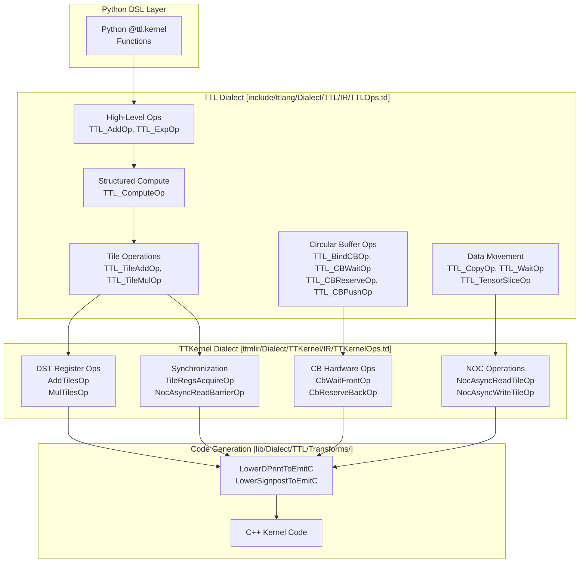
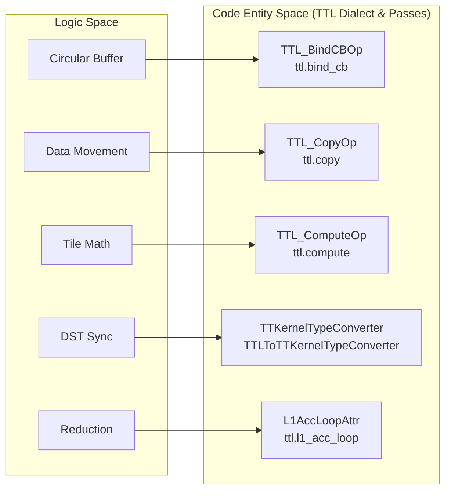

# MLIR Dialect Reference

Relevant source files
*   [docs/development/AccumulatingComputeLowering.md](https://github.com/tenstorrent/tt-lang/blob/d76e6233/docs/development/AccumulatingComputeLowering.md?plain=1)
*   [include/ttlang/Dialect/TTL/IR/TTL.h](https://github.com/tenstorrent/tt-lang/blob/d76e6233/include/ttlang/Dialect/TTL/IR/TTL.h)
*   [include/ttlang/Dialect/TTL/IR/TTLInterfaces.td](https://github.com/tenstorrent/tt-lang/blob/d76e6233/include/ttlang/Dialect/TTL/IR/TTLInterfaces.td)
*   [include/ttlang/Dialect/TTL/IR/TTLOps.td](https://github.com/tenstorrent/tt-lang/blob/d76e6233/include/ttlang/Dialect/TTL/IR/TTLOps.td)
*   [include/ttlang/Dialect/TTL/IR/TTLOpsAttrs.td](https://github.com/tenstorrent/tt-lang/blob/d76e6233/include/ttlang/Dialect/TTL/IR/TTLOpsAttrs.td)
*   [include/ttlang/Dialect/TTL/IR/TTLOpsEnums.td](https://github.com/tenstorrent/tt-lang/blob/d76e6233/include/ttlang/Dialect/TTL/IR/TTLOpsEnums.td)
*   [include/ttlang/Dialect/TTL/IR/TTLOpsTypes.td](https://github.com/tenstorrent/tt-lang/blob/d76e6233/include/ttlang/Dialect/TTL/IR/TTLOpsTypes.td)
*   [include/ttlang/Dialect/TTL/IR/TTLOpsUtils.h](https://github.com/tenstorrent/tt-lang/blob/d76e6233/include/ttlang/Dialect/TTL/IR/TTLOpsUtils.h)
*   [lib/Dialect/TTL/IR/TTLOps.cpp](https://github.com/tenstorrent/tt-lang/blob/d76e6233/lib/Dialect/TTL/IR/TTLOps.cpp)
*   [lib/Dialect/TTL/Transforms/ConvertTTLTileOpsToTTKernel.cpp](https://github.com/tenstorrent/tt-lang/blob/d76e6233/lib/Dialect/TTL/Transforms/ConvertTTLTileOpsToTTKernel.cpp)
*   [lib/Dialect/TTL/Transforms/ConvertTTLToCompute.cpp](https://github.com/tenstorrent/tt-lang/blob/d76e6233/lib/Dialect/TTL/Transforms/ConvertTTLToCompute.cpp)
*   [lib/Dialect/TTL/Transforms/ConvertTTLToTTKernel.cpp](https://github.com/tenstorrent/tt-lang/blob/d76e6233/lib/Dialect/TTL/Transforms/ConvertTTLToTTKernel.cpp)
*   [python/ttl/operators.py](https://github.com/tenstorrent/tt-lang/blob/d76e6233/python/ttl/operators.py)
*   [test/CMakeLists.txt](https://github.com/tenstorrent/tt-lang/blob/d76e6233/test/CMakeLists.txt)
*   [test/ttlang/Dialect/TTL/IR/accumulation_scope.mlir](https://github.com/tenstorrent/tt-lang/blob/d76e6233/test/ttlang/Dialect/TTL/IR/accumulation_scope.mlir)
*   [test/ttlang/Dialect/TTL/IR/accumulation_scope_invalid.mlir](https://github.com/tenstorrent/tt-lang/blob/d76e6233/test/ttlang/Dialect/TTL/IR/accumulation_scope_invalid.mlir)

This page provides a technical reference for the MLIR dialects and transformation passes used in `tt-lang` compilation. It covers the TTL (Tenstorrent Language) dialect, the TTKernel dialect, and the transformation pipeline that lowers high-level operations to hardware-specific code.

For practical usage of the Python DSL that generates these operations, see [Python DSL Fundamentals](https://deepwiki.com/tenstorrent/tt-lang/2.1-python-dsl-fundamentals). For detailed API documentation of specific operations, see [TTL Dialect Specification](https://deepwiki.com/tenstorrent/tt-lang/11.1-ttl-dialect-specification) and [TTKernel Dialect Specification](https://deepwiki.com/tenstorrent/tt-lang/11.2-ttkernel-dialect-specification). For implementation details of transformation passes, see [Transformation Pass Reference](https://deepwiki.com/tenstorrent/tt-lang/11.3-transformation-pass-reference).

## Overview: TTL and TTKernel Dialects

The `tt-lang` compiler uses two primary MLIR dialects that represent different abstraction levels:

**TTL Dialect**: High-level dialect produced by Python DSL compilation. Represents tensor operations, circular buffer semantics, and hardware-independent data movement. Operations include structured compute (`ttl.compute`), elementwise operations (`ttl.add`, `ttl.exp`), and circular buffer management (`ttl.bind_cb`, `ttl.cb_wait`). [include/ttlang/Dialect/TTL/IR/TTLOps.td 25-299](https://github.com/tenstorrent/tt-lang/blob/d76e6233/include/ttlang/Dialect/TTL/IR/TTLOps.td#L25-L299)

**TTKernel Dialect**: Hardware-specific dialect that maps directly to Tenstorrent kernel APIs. Represents NOC operations (`ttkernel.noc_async_read_tile`), DST register operations (`ttkernel.add_tiles`), and low-level circular buffer control (`ttkernel.cb_wait_front`). [lib/Dialect/TTL/Transforms/ConvertTTLToTTKernel.cpp 31-33](https://github.com/tenstorrent/tt-lang/blob/d76e6233/lib/Dialect/TTL/Transforms/ConvertTTLToTTKernel.cpp#L31-L33)

The transformation pipeline converts TTL operations through multiple stages, progressively lowering abstractions until reaching hardware-executable code via `EmitC`. [lib/Dialect/TTL/Transforms/ConvertTTLToTTKernel.cpp 61-92](https://github.com/tenstorrent/tt-lang/blob/d76e6233/lib/Dialect/TTL/Transforms/ConvertTTLToTTKernel.cpp#L61-L92)

### Dialect Relationship Diagram

The following diagram bridges the "Natural Language Space" of compiler concepts to the "Code Entity Space" of MLIR dialects and their specific implementation files.

**Sources**: [include/ttlang/Dialect/TTL/IR/TTLOps.td 1-154](https://github.com/tenstorrent/tt-lang/blob/d76e6233/include/ttlang/Dialect/TTL/IR/TTLOps.td#L1-L154)[lib/Dialect/TTL/Transforms/ConvertTTLToTTKernel.cpp 1-92](https://github.com/tenstorrent/tt-lang/blob/d76e6233/lib/Dialect/TTL/Transforms/ConvertTTLToTTKernel.cpp#L1-L92)[include/ttlang/Dialect/TTL/IR/TTL.h 1-170](https://github.com/tenstorrent/tt-lang/blob/d76e6233/include/ttlang/Dialect/TTL/IR/TTL.h#L1-L170)



## TTL Dialect Operation Categories

The TTL dialect organizes operations into functional categories based on their role in the computation pipeline.

### Circular Buffer Binding and Association

| Operation | Purpose | Result Type | Hardware Mapping |
| --- | --- | --- | --- |
| `ttl.bind_cb` | Declare use of a CB hardware slot | `!ttl.cb` | CB index (0-31) |
| `ttl.attach_cb` | Associate tensor SSA value with CB | Tensor | Identity (metadata) |

**Description**: `ttl.bind_cb` declares a hardware circular buffer slot index (0-31) and a `block_count` (default 2 for double buffering). [include/ttlang/Dialect/TTL/IR/TTLOps.td 25-50](https://github.com/tenstorrent/tt-lang/blob/d76e6233/include/ttlang/Dialect/TTL/IR/TTLOps.td#L25-L50)`ttl.attach_cb` associates a tensor with a CB handle, recording a mapping used by later passes to identify where tensor data resides in L1. [include/ttlang/Dialect/TTL/IR/TTLOps.td 52-77](https://github.com/tenstorrent/tt-lang/blob/d76e6233/include/ttlang/Dialect/TTL/IR/TTLOps.td#L52-L77)

**Sources**: [include/ttlang/Dialect/TTL/IR/TTLOps.td 25-77](https://github.com/tenstorrent/tt-lang/blob/d76e6233/include/ttlang/Dialect/TTL/IR/TTLOps.td#L25-L77)[lib/Dialect/TTL/IR/TTLOps.cpp 98-141](https://github.com/tenstorrent/tt-lang/blob/d76e6233/lib/Dialect/TTL/IR/TTLOps.cpp#L98-L141)

### Circular Buffer Synchronization Protocol

| Operation | Direction | Blocks Until | Side Effect |
| --- | --- | --- | --- |
| `ttl.cb_reserve` | Producer | Space available | Returns writable view |
| `ttl.cb_push` | Producer | None (non-blocking) | Increments producer pointer |
| `ttl.cb_wait` | Consumer | Data available | Returns readable view |
| `ttl.cb_pop` | Consumer | None (non-blocking) | Increments consumer pointer |

**Description**: Implements producer-consumer flow control. `ttl.cb_reserve` and `ttl.cb_wait` are blocking operations that acquire hardware locks and return views for compute/data-movement. [include/ttlang/Dialect/TTL/IR/TTLOps.td 638-733](https://github.com/tenstorrent/tt-lang/blob/d76e6233/include/ttlang/Dialect/TTL/IR/TTLOps.td#L638-L733)

**Sources**: [include/ttlang/Dialect/TTL/IR/TTLOps.td 638-733](https://github.com/tenstorrent/tt-lang/blob/d76e6233/include/ttlang/Dialect/TTL/IR/TTLOps.td#L638-L733)[lib/Dialect/TTL/Transforms/ConvertTTLTileOpsToTTKernel.cpp 147-173](https://github.com/tenstorrent/tt-lang/blob/d76e6233/lib/Dialect/TTL/Transforms/ConvertTTLTileOpsToTTKernel.cpp#L147-L173)

### Data Movement Operations

| Operation | Operands | Result | Hardware Mapping |
| --- | --- | --- | --- |
| `ttl.tensor_slice` | Tensor + indices | View | Metadata only |
| `ttl.copy` | Source + destination | Transfer handle | NOC async operations |
| `ttl.wait` | Transfer handle | None | NOC barrier |

**Description**: `ttl.copy` initiates an asynchronous transfer and returns a `!ttl.transfer_handle`. [include/ttlang/Dialect/TTL/IR/TTLOps.td 114-154](https://github.com/tenstorrent/tt-lang/blob/d76e6233/include/ttlang/Dialect/TTL/IR/TTLOps.td#L114-L154) The `ttl.tensor_slice` op creates a view into a tensor at specific tile coordinates. [include/ttlang/Dialect/TTL/IR/TTLOps.td 79-112](https://github.com/tenstorrent/tt-lang/blob/d76e6233/include/ttlang/Dialect/TTL/IR/TTLOps.td#L79-L112)

**Sources**: [include/ttlang/Dialect/TTL/IR/TTLOps.td 79-188](https://github.com/tenstorrent/tt-lang/blob/d76e6233/include/ttlang/Dialect/TTL/IR/TTLOps.td#L79-L188)[lib/Dialect/TTL/Transforms/ConvertTTLToTTKernel.cpp 61-92](https://github.com/tenstorrent/tt-lang/blob/d76e6233/lib/Dialect/TTL/Transforms/ConvertTTLToTTKernel.cpp#L61-L92)

### Structured Compute Operation

The `ttl.compute` operation represents a grid of tile-level computations. It implements `TilingInterface`, enabling the compiler to partition the iteration space into subblocks that fit in the DST register file. [include/ttlang/Dialect/TTL/IR/TTLOps.td 225-299](https://github.com/tenstorrent/tt-lang/blob/d76e6233/include/ttlang/Dialect/TTL/IR/TTLOps.td#L225-L299)

**Key Features**:

*   **Indexing Maps**: Relate iteration dimensions to operand tiles using affine maps. [lib/Dialect/TTL/Transforms/ConvertTTLToCompute.cpp 54-67](https://github.com/tenstorrent/tt-lang/blob/d76e6233/lib/Dialect/TTL/Transforms/ConvertTTLToCompute.cpp#L54-L67)
*   **Iterator Types**: Support `"parallel"` and `"reduction"`. [include/ttlang/Dialect/TTL/IR/TTL.h 99-100](https://github.com/tenstorrent/tt-lang/blob/d76e6233/include/ttlang/Dialect/TTL/IR/TTL.h#L99-L100)
*   **Fusion**: Elementwise operations are fused into `ttl.compute` using `ConvertTTLToCompute`. [lib/Dialect/TTL/Transforms/ConvertTTLToCompute.cpp 97-176](https://github.com/tenstorrent/tt-lang/blob/d76e6233/lib/Dialect/TTL/Transforms/ConvertTTLToCompute.cpp#L97-L176)

**Sources**: [include/ttlang/Dialect/TTL/IR/TTLOps.td 225-299](https://github.com/tenstorrent/tt-lang/blob/d76e6233/include/ttlang/Dialect/TTL/IR/TTLOps.td#L225-L299)[lib/Dialect/TTL/Transforms/ConvertTTLToCompute.cpp 54-176](https://github.com/tenstorrent/tt-lang/blob/d76e6233/lib/Dialect/TTL/Transforms/ConvertTTLToCompute.cpp#L54-L176)[include/ttlang/Dialect/TTL/IR/TTL.h 99-100](https://github.com/tenstorrent/tt-lang/blob/d76e6233/include/ttlang/Dialect/TTL/IR/TTL.h#L99-L100)

### Tile-Level Compute Operations

These execute inside `ttl.compute` bodies on `!ttcore.tile` types.

#### Unary and Binary Operations

*   **Unary**: `ttl.tile_exp`, `ttl.tile_abs`, `ttl.tile_relu`, etc. These typically operate in-place on DST. [include/ttlang/Dialect/TTL/IR/TTLOpsUtils.h 178-180](https://github.com/tenstorrent/tt-lang/blob/d76e6233/include/ttlang/Dialect/TTL/IR/TTLOpsUtils.h#L178-L180)
*   **Binary**: `ttl.tile_add`, `ttl.tile_mul`, `ttl.tile_sub`. These can read from CB if `ttl.enable_fpu_binary_ops` is set. [include/ttlang/Dialect/TTL/IR/TTL.h 73-75](https://github.com/tenstorrent/tt-lang/blob/d76e6233/include/ttlang/Dialect/TTL/IR/TTL.h#L73-L75)

#### DST Data Movement

*   `ttl.copy_tile`: CB → DST load. [lib/Dialect/TTL/Transforms/ConvertTTLTileOpsToTTKernel.cpp 54-58](https://github.com/tenstorrent/tt-lang/blob/d76e6233/lib/Dialect/TTL/Transforms/ConvertTTLTileOpsToTTKernel.cpp#L54-L58)
*   `ttl.tile_store`: DST → CB pack. [lib/Dialect/TTL/Transforms/ConvertTTLToCompute.cpp 184-186](https://github.com/tenstorrent/tt-lang/blob/d76e6233/lib/Dialect/TTL/Transforms/ConvertTTLToCompute.cpp#L184-L186)

**Sources**: [include/ttlang/Dialect/TTL/IR/TTLOpsUtils.h 178-180](https://github.com/tenstorrent/tt-lang/blob/d76e6233/include/ttlang/Dialect/TTL/IR/TTLOpsUtils.h#L178-L180)[include/ttlang/Dialect/TTL/IR/TTL.h 73-75](https://github.com/tenstorrent/tt-lang/blob/d76e6233/include/ttlang/Dialect/TTL/IR/TTL.h#L73-L75)[lib/Dialect/TTL/Transforms/ConvertTTLTileOpsToTTKernel.cpp 54-112](https://github.com/tenstorrent/tt-lang/blob/d76e6233/lib/Dialect/TTL/Transforms/ConvertTTLTileOpsToTTKernel.cpp#L54-L112)

## TTL Transformation Pass Pipeline

The pipeline lowers high-level TTL to hardware-ready TTKernel code.

### Key Transformation Passes

#### 1. convert-ttl-to-compute

Lowers elementwise tensor operations into `ttl.compute` with SSA-style tile operations in the body. This enables fusion and subsequent DST allocation. [lib/Dialect/TTL/Transforms/ConvertTTLToCompute.cpp 97-176](https://github.com/tenstorrent/tt-lang/blob/d76e6233/lib/Dialect/TTL/Transforms/ConvertTTLToCompute.cpp#L97-L176)

#### 2. ttl-assign-dst

Performs DST register allocation using linear scan with in-place operation merging. [include/ttlang/Dialect/TTL/IR/TTL.h 114-116](https://github.com/tenstorrent/tt-lang/blob/d76e6233/include/ttlang/Dialect/TTL/IR/TTL.h#L114-L116) (Referenced via `kPlaceholderCopyAttrName`).

#### 3. ttl-lower-to-loops

Partitions the iteration space of `ttl.compute` into loops and subblocks that fit in the DST register file. [include/ttlang/Dialect/TTL/IR/TTL.h 83-97](https://github.com/tenstorrent/tt-lang/blob/d76e6233/include/ttlang/Dialect/TTL/IR/TTL.h#L83-L97) (Referenced via subblock and tile loop stride attributes).

#### 4. ttkernel-insert-inits

Inserts both common inits (e.g., `init_sfpu`) and per-op inits (e.g., `exp_tile_init`) that configure the MATH pipeline and UNPACK/PACK routing. [lib/Dialect/TTL/Transforms/ConvertTTLTileOpsToTTKernel.cpp 5-15](https://github.com/tenstorrent/tt-lang/blob/d76e6233/lib/Dialect/TTL/Transforms/ConvertTTLTileOpsToTTKernel.cpp#L5-L15) (Associated with compute lowering logic).

**Sources**: [lib/Dialect/TTL/Transforms/ConvertTTLToCompute.cpp 1-185](https://github.com/tenstorrent/tt-lang/blob/d76e6233/lib/Dialect/TTL/Transforms/ConvertTTLToCompute.cpp#L1-L185)[include/ttlang/Dialect/TTL/IR/TTL.h 83-116](https://github.com/tenstorrent/tt-lang/blob/d76e6233/include/ttlang/Dialect/TTL/IR/TTL.h#L83-L116)[lib/Dialect/TTL/Transforms/ConvertTTLTileOpsToTTKernel.cpp 5-15](https://github.com/tenstorrent/tt-lang/blob/d76e6233/lib/Dialect/TTL/Transforms/ConvertTTLTileOpsToTTKernel.cpp#L5-L15)


| Pass Name | Role |
|-----------|------|
| `ttl-insert-intermediate-dfbs` | Materializes intermediate values to L1 via compiler-allocated DFBs at fusion split points [lib/Dialect/TTL/Transforms/TTLInsertIntermediateDFBs.cpp:9-13](). |
| `ttl-insert-cb-sync` | Inserts missing `cb_push`/`cb_pop` for unmatched `cb_reserve`/`cb_wait` [include/ttlang/Dialect/TTL/Passes.td:6-12](). |
| `ttl-coalesce-dfb-acquires` | Collapses consecutive same-DFB acquires into a single multi-tile acquire [include/ttlang/Dialect/TTL/Passes.td:28-48](). |
| `ttl-assign-dst` | Maps mathematical operations to hardware DST registers [lib/Dialect/TTL/Pipelines/TTLPipelines.cpp:36-36](). |
```
## Type System and Attributes

### TTL Types

*   `!ttl.cb<shape, dtype, factor>`: Circular buffer handle. [include/ttlang/Dialect/TTL/IR/TTLOpsTypes.td 31-50](https://github.com/tenstorrent/tt-lang/blob/d76e6233/include/ttlang/Dialect/TTL/IR/TTLOpsTypes.td#L31-L50)
*   `!ttl.transfer_handle<dir>`: Asynchronous transfer tracking. [include/ttlang/Dialect/TTL/IR/TTLOpsTypes.td 52-58](https://github.com/tenstorrent/tt-lang/blob/d76e6233/include/ttlang/Dialect/TTL/IR/TTLOpsTypes.td#L52-L58)
*   `!ttl.pipe`: Core-to-core communication relation. [include/ttlang/Dialect/TTL/IR/TTLOpsTypes.td 102-163](https://github.com/tenstorrent/tt-lang/blob/d76e6233/include/ttlang/Dialect/TTL/IR/TTLOpsTypes.td#L102-L163)

### Compilation Attributes

*   `ttl.unroll_factor`: Number of tiles to process per DST sync region. [include/ttlang/Dialect/TTL/IR/TTL.h 98-100](https://github.com/tenstorrent/tt-lang/blob/d76e6233/include/ttlang/Dialect/TTL/IR/TTL.h#L98-L100)
*   `ttl.enable_fpu_binary_ops`: Enables binary ops using the FPU path (reading from CB). [include/ttlang/Dialect/TTL/IR/TTL.h 89-92](https://github.com/tenstorrent/tt-lang/blob/d76e6233/include/ttlang/Dialect/TTL/IR/TTL.h#L89-L92)
*   `ttl.reduction_loop`: Marks an `scf.for` as a compiler-generated reduction loop. [include/ttlang/Dialect/TTL/IR/TTL.h 117-118](https://github.com/tenstorrent/tt-lang/blob/d76e6233/include/ttlang/Dialect/TTL/IR/TTL.h#L117-L118)

**Sources**: [include/ttlang/Dialect/TTL/IR/TTL.h 73-120](https://github.com/tenstorrent/tt-lang/blob/d76e6233/include/ttlang/Dialect/TTL/IR/TTL.h#L73-L120)[include/ttlang/Dialect/TTL/IR/TTLOpsTypes.td 31-163](https://github.com/tenstorrent/tt-lang/blob/d76e6233/include/ttlang/Dialect/TTL/IR/TTLOpsTypes.td#L31-L163)[lib/Dialect/TTL/Transforms/ConvertTTLToTTKernel.cpp 61-92](https://github.com/tenstorrent/tt-lang/blob/d76e6233/lib/Dialect/TTL/Transforms/ConvertTTLToTTKernel.cpp#L61-L92)

## Dialect Entity Mapping

The following diagram maps high-level compiler concepts to specific code entities within the TTL dialect and their corresponding transformation logic.

**Sources**: [include/ttlang/Dialect/TTL/IR/TTLOps.td 25-154](https://github.com/tenstorrent/tt-lang/blob/d76e6233/include/ttlang/Dialect/TTL/IR/TTLOps.td#L25-L154)[lib/Dialect/TTL/Transforms/ConvertTTLToTTKernel.cpp 65-96](https://github.com/tenstorrent/tt-lang/blob/d76e6233/lib/Dialect/TTL/Transforms/ConvertTTLToTTKernel.cpp#L65-L96)[include/ttlang/Dialect/TTL/IR/TTL.h 121-122](https://github.com/tenstorrent/tt-lang/blob/d76e6233/include/ttlang/Dialect/TTL/IR/TTL.h#L121-L122)



## Summary

The TTL and TTKernel MLIR dialects provide a multi-level representation for Tenstorrent hardware compilation:

*   **TTL Dialect** offers high-level abstractions for tensor operations, circular buffer management, and data movement.
*   **TTKernel Dialect** provides hardware-specific operations mapping to NOC, DST, and CB hardware primitives.
*   **Transformation Passes** progressively lower abstractions through fusion (`ConvertTTLToCompute`), DST allocation, subblocking, and hardware initialization insertion.

For detailed operation specifications and examples, see [TTL Dialect Specification](https://deepwiki.com/tenstorrent/tt-lang/11.1-ttl-dialect-specification), [TTKernel Dialect Specification](https://deepwiki.com/tenstorrent/tt-lang/11.2-ttkernel-dialect-specification), and [Transformation Pass Reference](https://deepwiki.com/tenstorrent/tt-lang/11.3-transformation-pass-reference).

Dismiss
Refresh this wiki

Enter email to refresh
