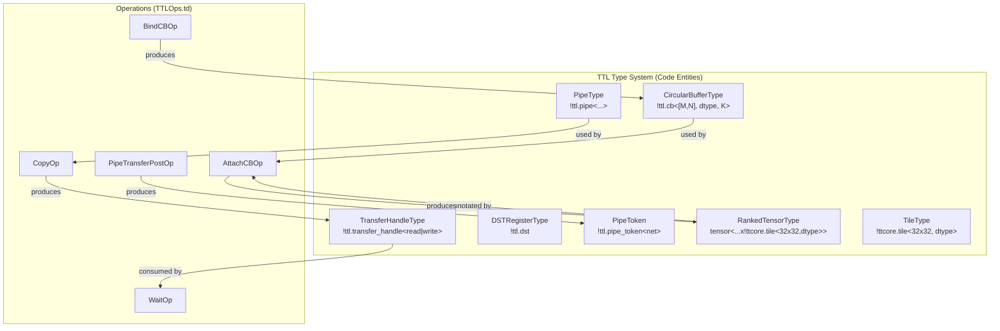
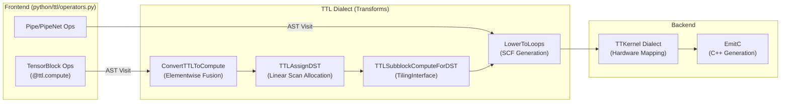

# TTL Dialect Specification

Relevant source files
*   [docs/development/AccumulatingComputeLowering.md](https://github.com/tenstorrent/tt-lang/blob/d76e6233/docs/development/AccumulatingComputeLowering.md?plain=1)
*   [include/ttlang/Dialect/TTL/IR/TTL.h](https://github.com/tenstorrent/tt-lang/blob/d76e6233/include/ttlang/Dialect/TTL/IR/TTL.h)
*   [include/ttlang/Dialect/TTL/IR/TTLBase.td](https://github.com/tenstorrent/tt-lang/blob/d76e6233/include/ttlang/Dialect/TTL/IR/TTLBase.td)
*   [include/ttlang/Dialect/TTL/IR/TTLInterfaces.td](https://github.com/tenstorrent/tt-lang/blob/d76e6233/include/ttlang/Dialect/TTL/IR/TTLInterfaces.td)
*   [include/ttlang/Dialect/TTL/IR/TTLOps.h](https://github.com/tenstorrent/tt-lang/blob/d76e6233/include/ttlang/Dialect/TTL/IR/TTLOps.h)
*   [include/ttlang/Dialect/TTL/IR/TTLOps.td](https://github.com/tenstorrent/tt-lang/blob/d76e6233/include/ttlang/Dialect/TTL/IR/TTLOps.td)
*   [include/ttlang/Dialect/TTL/IR/TTLOpsAttrs.td](https://github.com/tenstorrent/tt-lang/blob/d76e6233/include/ttlang/Dialect/TTL/IR/TTLOpsAttrs.td)
*   [include/ttlang/Dialect/TTL/IR/TTLOpsEnums.td](https://github.com/tenstorrent/tt-lang/blob/d76e6233/include/ttlang/Dialect/TTL/IR/TTLOpsEnums.td)
*   [include/ttlang/Dialect/TTL/IR/TTLOpsTypes.td](https://github.com/tenstorrent/tt-lang/blob/d76e6233/include/ttlang/Dialect/TTL/IR/TTLOpsTypes.td)
*   [include/ttlang/Dialect/TTL/IR/TTLOpsUtils.h](https://github.com/tenstorrent/tt-lang/blob/d76e6233/include/ttlang/Dialect/TTL/IR/TTLOpsUtils.h)
*   [lib/Dialect/TTL/IR/CMakeLists.txt](https://github.com/tenstorrent/tt-lang/blob/d76e6233/lib/Dialect/TTL/IR/CMakeLists.txt)
*   [lib/Dialect/TTL/IR/TTLOps.cpp](https://github.com/tenstorrent/tt-lang/blob/d76e6233/lib/Dialect/TTL/IR/TTLOps.cpp)
*   [lib/Dialect/TTL/Transforms/ConvertTTLTileOpsToTTKernel.cpp](https://github.com/tenstorrent/tt-lang/blob/d76e6233/lib/Dialect/TTL/Transforms/ConvertTTLTileOpsToTTKernel.cpp)
*   [lib/Dialect/TTL/Transforms/ConvertTTLToCompute.cpp](https://github.com/tenstorrent/tt-lang/blob/d76e6233/lib/Dialect/TTL/Transforms/ConvertTTLToCompute.cpp)
*   [lib/Dialect/TTL/Transforms/ConvertTTLToTTKernel.cpp](https://github.com/tenstorrent/tt-lang/blob/d76e6233/lib/Dialect/TTL/Transforms/ConvertTTLToTTKernel.cpp)
*   [python/ttl/operators.py](https://github.com/tenstorrent/tt-lang/blob/d76e6233/python/ttl/operators.py)
*   [test/CMakeLists.txt](https://github.com/tenstorrent/tt-lang/blob/d76e6233/test/CMakeLists.txt)
*   [test/ttlang/Dialect/TTL/IR/accumulation_scope.mlir](https://github.com/tenstorrent/tt-lang/blob/d76e6233/test/ttlang/Dialect/TTL/IR/accumulation_scope.mlir)
*   [test/ttlang/Dialect/TTL/IR/accumulation_scope_invalid.mlir](https://github.com/tenstorrent/tt-lang/blob/d76e6233/test/ttlang/Dialect/TTL/IR/accumulation_scope_invalid.mlir)

## Purpose and Scope

This document provides a complete reference for the TTL (Tenstorrent TT-Lang) MLIR dialect, which serves as the high-level intermediate representation in the tt-lang compilation pipeline. The TTL dialect represents tile-based tensor computations with explicit circular buffer management and hardware resource modeling.

The TTL dialect sits between the Python DSL frontend and the TTKernel dialect. It provides operations for:

*   Circular buffer lifecycle management (`bind_cb`, `attach_cb`, CB synchronization)
*   Tile-level computations (`ttl.compute`, tile operations)
*   Asynchronous data movement (`copy`, `wait`, `tensor_slice`)
*   Hardware resource control (DST registers, SFPU initialization)
*   Multi-core indexing (`core_x`, `core_y`)
*   Inter-core communication via Pipes (`create_pipe`, `pipe_transfer_create`)

**Sources:**[include/ttlang/Dialect/TTL/IR/TTLOps.td 1-25](https://github.com/tenstorrent/tt-lang/blob/d76e6233/include/ttlang/Dialect/TTL/IR/TTLOps.td#L1-L25)[include/ttlang/Dialect/TTL/IR/TTLBase.td 15-22](https://github.com/tenstorrent/tt-lang/blob/d76e6233/include/ttlang/Dialect/TTL/IR/TTLBase.td#L15-L22)

* * *

## Type System

### Core Types

The TTL dialect defines primary types that model hardware resources and asynchronous state:

| Type | Syntax | Purpose |
| --- | --- | --- |
| `CircularBufferType` | `!ttl.cb<[M, N], dtype, block_count>` | Represents a hardware circular buffer slot with shape, element type, and buffering capacity. |
| `TransferHandleType` | `!ttl.transfer_handle<read|write>` | Handle for asynchronous data transfers, typed by direction (`TransferKind`). |
| `DSTRegisterType` | `!ttl.dst` | Token representing a tile resident in a DST register slot; used for ordering. |
| `PipeType` | `!ttl.pipe<src, dst, net>` | Represents a communication channel for inter-core data movement between specific core coordinates. |
| `PipeToken` | `!ttl.pipe_token<net>` | Names a receiver-side completion dependency produced by a pipe receive post. |

**Sources:**[include/ttlang/Dialect/TTL/IR/TTLOpsTypes.td 31-82](https://github.com/tenstorrent/tt-lang/blob/d76e6233/include/ttlang/Dialect/TTL/IR/TTLOpsTypes.td#L31-L82)[include/ttlang/Dialect/TTL/IR/TTLOpsTypes.td 102-129](https://github.com/tenstorrent/tt-lang/blob/d76e6233/include/ttlang/Dialect/TTL/IR/TTLOpsTypes.td#L102-L129)[include/ttlang/Dialect/TTL/IR/TTLOpsEnums.td 18-26](https://github.com/tenstorrent/tt-lang/blob/d76e6233/include/ttlang/Dialect/TTL/IR/TTLOpsEnums.td#L18-L26)[lib/Dialect/TTL/IR/TTLOps.cpp 39-52](https://github.com/tenstorrent/tt-lang/blob/d76e6233/lib/Dialect/TTL/IR/TTLOps.cpp#L39-L52)

### CircularBufferType Details

```
!ttl.cb<shape, element_type, block_count>

shape          : [int64_t, ...] - Tile dimensions (e.g., [1, 1] for single tile, [2, 4] for 2x4 tile block)
element_type   : Type - Element type (f32, bf16, or !ttcore.tile<32x32, dtype>)
block_count    : int64_t - Number of blocks for double/multi-buffering (default 2)
```

The `block_count` determines circular buffer capacity. For a shape `[M, N]` with `block_count=K`, the CB can hold `K` blocks of `M*N` tiles. Common values:

*   `block_count=2`: Double buffering (one block producing, one consuming).
*   `block_count>2`: Multi-buffering for deeper pipelining.

**Sources:**[include/ttlang/Dialect/TTL/IR/TTLOpsTypes.td 31-50](https://github.com/tenstorrent/tt-lang/blob/d76e6233/include/ttlang/Dialect/TTL/IR/TTLOpsTypes.td#L31-L50)[lib/Dialect/TTL/IR/TTLOps.cpp 98-116](https://github.com/tenstorrent/tt-lang/blob/d76e6233/lib/Dialect/TTL/IR/TTLOps.cpp#L98-L116)

### Type Relationships

**TTL Type to Code Entity Mapping**

**Sources:**[include/ttlang/Dialect/TTL/IR/TTLOps.td 24-153](https://github.com/tenstorrent/tt-lang/blob/d76e6233/include/ttlang/Dialect/TTL/IR/TTLOps.td#L24-L153)[include/ttlang/Dialect/TTL/IR/TTLOpsTypes.td 1-163](https://github.com/tenstorrent/tt-lang/blob/d76e6233/include/ttlang/Dialect/TTL/IR/TTLOpsTypes.td#L1-L163)

* * *



## Operation Categories

### Circular Buffer Management Operations

#### `ttl.bind_cb` - Bind Circular Buffer Slot

Declares usage of a hardware circular buffer slot and returns a handle for that binding.

**Syntax:**

`%cb = ttl.bind_cb {cb_index = 0 : index, block_count = 2}      : !ttl.cb<[1, 1], f32, 2>`
**Attributes:**

*   `cb_index: index` - CB slot index (0-31, hardware limit `kMaxCircularBuffers`).
*   `block_count: i64` - Number of blocks (default 2).

**Semantics:**

*   Does **not** allocate the CB; runtime/host provisions the buffer.
*   Binding occurs at kernel scope.

**Verifier Rules:**

*   `cb_index` must be in range [0, 31].
*   `block_count` must be > 0 and match result type.

**Sources:**[include/ttlang/Dialect/TTL/IR/TTLOps.td 24-50](https://github.com/tenstorrent/tt-lang/blob/d76e6233/include/ttlang/Dialect/TTL/IR/TTLOps.td#L24-L50)[lib/Dialect/TTL/IR/TTLOps.cpp 98-116](https://github.com/tenstorrent/tt-lang/blob/d76e6233/lib/Dialect/TTL/IR/TTLOps.cpp#L98-L116)[include/ttlang/Dialect/TTL/IR/TTL.h 22-25](https://github.com/tenstorrent/tt-lang/blob/d76e6233/include/ttlang/Dialect/TTL/IR/TTL.h#L22-L25)

* * *

#### `ttl.attach_cb` - Associate Tensor with Circular Buffer

Associates a tensor SSA value with a circular buffer handle for downstream lowering.

**Syntax:**

`%t_attached = ttl.attach_cb %tensor, %cb    : (tensor<...>, !ttl.cb<...>) -> tensor<...>`
**Semantics:**

*   Records tensor → CB mapping for later passes (queried via `getAttachedCB`).
*   NOT marked `Pure` to prevent elimination of semantically meaningful bindings.

**Verifier Rules:**

*   Tensor element type must match CB element type.
*   Result type must equal input tensor type (identity).

**Sources:**[include/ttlang/Dialect/TTL/IR/TTLOps.td 52-77](https://github.com/tenstorrent/tt-lang/blob/d76e6233/include/ttlang/Dialect/TTL/IR/TTLOps.td#L52-L77)[lib/Dialect/TTL/IR/TTLOps.cpp 118-138](https://github.com/tenstorrent/tt-lang/blob/d76e6233/lib/Dialect/TTL/IR/TTLOps.cpp#L118-L138)

* * *

### Data Movement Operations

#### `ttl.tensor_slice` - Create Tensor View

Creates a view into a tensor at specific tile coordinates for use in `ttl.copy`.

**Syntax:**

`%slice = ttl.tensor_slice %tensor[%c0, %c1]         : tensor<2x2x!ttcore.tile<32x32, bf16>>            -> tensor<1x1x!ttcore.tile<32x32, bf16>>`
**Semantics:**

*   Indices are **tile coordinates**, not element coordinates.
*   Result retains original tensor's layout encoding (`LayoutAttr`).

**Verifier Rules:**

*   Index count must match tensor rank.
*   Result rank and element type must match source tensor.

**Sources:**[include/ttlang/Dialect/TTL/IR/TTLOps.td 79-112](https://github.com/tenstorrent/tt-lang/blob/d76e6233/include/ttlang/Dialect/TTL/IR/TTLOps.td#L79-L112)[lib/Dialect/TTL/IR/TTLOps.cpp 140-161](https://github.com/tenstorrent/tt-lang/blob/d76e6233/lib/Dialect/TTL/IR/TTLOps.cpp#L140-L161)

* * *

#### `ttl.copy` - Asynchronous Data Transfer

Initiates asynchronous transfer between tensor slice, circular buffer, or pipe.

**Syntax:**

`%xf = ttl.copy %src, %dst       : (src_type, dst_type) -> !ttl.transfer_handle<read>`
**Semantics:**

*   Non-blocking: returns a `!ttl.transfer_handle`.
*   Valid combinations: `CB <-> TensorSlice` or `CB <-> Pipe`.
*   Destination is not safe to use until `ttl.wait` completes.

**Verifier Rules:**

*   For pipe transfers, one operand must be `!ttl.pipe` and the other `!ttl.cb`.
*   For tensor transfers, exactly one operand must be `!ttl.cb`.

**Sources:**[include/ttlang/Dialect/TTL/IR/TTLOps.td 114-154](https://github.com/tenstorrent/tt-lang/blob/d76e6233/include/ttlang/Dialect/TTL/IR/TTLOps.td#L114-L154)[lib/Dialect/TTL/IR/TTLOps.cpp 164-202](https://github.com/tenstorrent/tt-lang/blob/d76e6233/lib/Dialect/TTL/IR/TTLOps.cpp#L164-L202)

* * *

### Structured Compute Operation

#### `ttl.compute` - Tile-Level Structured Compute

Central operation for expressing tile-level parallel computations with fusion.

**Syntax:**

`%result = ttl.compute    ins(%in0, %in1 : tensor<...>, tensor<...>)    outs(%out0 : tensor<...>)    {indexing_maps = [map0, map1, map2],     iterator_types = ["parallel", "parallel"]}{  ^bb0(%tile_in0: !ttcore.tile<...>, %tile_in1: !ttcore.tile<...>,        %tile_out0: !ttcore.tile<...>):    %0 = ttl.tile_add %tile_in0, %tile_in1 : !ttcore.tile<...>    ttl.tile_store %0, %tile_out0 : !ttcore.tile<...>, !ttcore.tile<...>    ttl.yield} -> tensor<...>`
**Semantics:**

*   Applies body computation to each tile position in the iteration domain.
*   Lowers to `scf.for` loops via `LowerToLoops`.
*   Elementwise operations (e.g. `ttl.exp`, `ttl.add`) are fused into the body by `ConvertTTLToCompute`.

**Verifier Rules:**

*   Indexing maps must be **projected permutations**.
*   Iterator types must be 'parallel' or 'reduction'.
*   All inputs/outputs must be CB-attached.

**Sources:**[include/ttlang/Dialect/TTL/IR/TTLOps.td 225-299](https://github.com/tenstorrent/tt-lang/blob/d76e6233/include/ttlang/Dialect/TTL/IR/TTLOps.td#L225-L299)[lib/Dialect/TTL/Transforms/ConvertTTLToCompute.cpp 141-159](https://github.com/tenstorrent/tt-lang/blob/d76e6233/lib/Dialect/TTL/Transforms/ConvertTTLToCompute.cpp#L141-L159)[include/ttlang/Dialect/TTL/IR/TTLOpsUtils.h 146-148](https://github.com/tenstorrent/tt-lang/blob/d76e6233/include/ttlang/Dialect/TTL/IR/TTLOpsUtils.h#L146-L148)

* * *

### Tile-Level Operations (Compute Body Ops)

Operations appearing inside `ttl.compute` body blocks, operating on `!ttcore.tile<...>` values.

#### `ttl.copy_tile` - Copy CB Tile to DST

**Syntax:**

`%dst_token, %dst_tile = ttl.copy_tile %src[%idx] into dst[%dst_idx]    : !ttcore.tile<...> -> !ttl.dst, !ttcore.tile<...>`
**Semantics:**

*   Traces back to the attached CB via `tensor.extract` to resolve hardware CB index.
*   `computeCBTileIndex` linearizes coordinates for indexing.
*   Lowers to `ttkernel.copy_tile`.

**Sources:**[include/ttlang/Dialect/TTL/IR/TTLOps.td 472-494](https://github.com/tenstorrent/tt-lang/blob/d76e6233/include/ttlang/Dialect/TTL/IR/TTLOps.td#L472-L494)[lib/Dialect/TTL/Transforms/ConvertTTLTileOpsToTTKernel.cpp 59-112](https://github.com/tenstorrent/tt-lang/blob/d76e6233/lib/Dialect/TTL/Transforms/ConvertTTLTileOpsToTTKernel.cpp#L59-L112)[lib/Dialect/TTL/Transforms/ConvertTTLTileOpsToTTKernel.cpp 133-153](https://github.com/tenstorrent/tt-lang/blob/d76e6233/lib/Dialect/TTL/Transforms/ConvertTTLTileOpsToTTKernel.cpp#L133-L153)

#### Elementwise Tile Operations

*   **Binary Operations**: `ttl.tile_add`, `ttl.tile_sub`, `ttl.tile_mul`, `ttl.tile_div`, `ttl.tile_max`, `ttl.tile_min`.
*   **Unary Operations (SFPU)**: `ttl.tile_exp`, `ttl.tile_log`, `ttl.tile_sqrt`, `ttl.tile_tanh`, `ttl.tile_sigmoid`, `ttl.tile_relu`.

**Sources:**[lib/Dialect/TTL/Transforms/ConvertTTLToCompute.cpp 27-50](https://github.com/tenstorrent/tt-lang/blob/d76e6233/lib/Dialect/TTL/Transforms/ConvertTTLToCompute.cpp#L27-L50)[include/ttlang/Dialect/TTL/IR/TTLOps.td 524-600](https://github.com/tenstorrent/tt-lang/blob/d76e6233/include/ttlang/Dialect/TTL/IR/TTLOps.td#L524-L600)[include/ttlang/Dialect/TTL/IR/TTLOpsUtils.h 151-158](https://github.com/tenstorrent/tt-lang/blob/d76e6233/include/ttlang/Dialect/TTL/IR/TTLOpsUtils.h#L151-L158)

* * *

## Lowering and Transformation Pipeline

**TTL Compilation Data Flow**

**Sources:**[lib/Dialect/TTL/Transforms/ConvertTTLToCompute.cpp 1-130](https://github.com/tenstorrent/tt-lang/blob/d76e6233/lib/Dialect/TTL/Transforms/ConvertTTLToCompute.cpp#L1-L130)[lib/Dialect/TTL/Transforms/ConvertTTLTileOpsToTTKernel.cpp 9-17](https://github.com/tenstorrent/tt-lang/blob/d76e6233/lib/Dialect/TTL/Transforms/ConvertTTLTileOpsToTTKernel.cpp#L9-L17)[python/ttl/operators.py 121-162](https://github.com/tenstorrent/tt-lang/blob/d76e6233/python/ttl/operators.py#L121-L162)



### Key Lowering Patterns

*   **CB Resolution**: `lookupCBByIndex` traces tile operands back to `tensor.extract` and `attach_cb` to find the corresponding `bind_cb` op by hardware index. [lib/Dialect/TTL/Transforms/ConvertTTLTileOpsToTTKernel.cpp 59-112](https://github.com/tenstorrent/tt-lang/blob/d76e6233/lib/Dialect/TTL/Transforms/ConvertTTLTileOpsToTTKernel.cpp#L59-L112)
*   **Linearization**: `computeCBTileIndex` linearizes tile coordinates into a 1D CB offset using `AffineLinearizeIndexOp` based on the operand's row-major layout. [lib/Dialect/TTL/Transforms/ConvertTTLTileOpsToTTKernel.cpp 133-153](https://github.com/tenstorrent/tt-lang/blob/d76e6233/lib/Dialect/TTL/Transforms/ConvertTTLTileOpsToTTKernel.cpp#L133-L153)
*   **Fusion**: `collectOutputCBs` and `emitTileStores` in `ConvertTTLToCompute` absorb elementwise operations into `ttl.compute` blocks, replacing block-level stores with `ttl.tile_store`. [lib/Dialect/TTL/Transforms/ConvertTTLToCompute.cpp 85-130](https://github.com/tenstorrent/tt-lang/blob/d76e6233/lib/Dialect/TTL/Transforms/ConvertTTLToCompute.cpp#L85-L130)
*   **SFPU Conversion**: `floatAttrToI32Bits` materializes scalar SFPU parameters as IEEE 754 bits for hardware compatibility. [lib/Dialect/TTL/Transforms/ConvertTTLTileOpsToTTKernel.cpp 47-52](https://github.com/tenstorrent/tt-lang/blob/d76e6233/lib/Dialect/TTL/Transforms/ConvertTTLTileOpsToTTKernel.cpp#L47-L52)
*   **Type Conversion**: `TTLToTTKernelTypeConverter` maps TTL types to TTKernel equivalents, such as `CircularBufferType` to `ttk::CBType` with flattened element counts. [lib/Dialect/TTL/Transforms/ConvertTTLToTTKernel.cpp 65-96](https://github.com/tenstorrent/tt-lang/blob/d76e6233/lib/Dialect/TTL/Transforms/ConvertTTLToTTKernel.cpp#L65-L96)

**Sources:**[lib/Dialect/TTL/Transforms/ConvertTTLTileOpsToTTKernel.cpp 1-160](https://github.com/tenstorrent/tt-lang/blob/d76e6233/lib/Dialect/TTL/Transforms/ConvertTTLTileOpsToTTKernel.cpp#L1-L160)[lib/Dialect/TTL/Transforms/ConvertTTLToCompute.cpp 1-130](https://github.com/tenstorrent/tt-lang/blob/d76e6233/lib/Dialect/TTL/Transforms/ConvertTTLToCompute.cpp#L1-L130)[include/ttlang/Dialect/TTL/IR/TTLOpsUtils.h 39-61](https://github.com/tenstorrent/tt-lang/blob/d76e6233/include/ttlang/Dialect/TTL/IR/TTLOpsUtils.h#L39-L61)[lib/Dialect/TTL/Transforms/ConvertTTLToTTKernel.cpp 65-96](https://github.com/tenstorrent/tt-lang/blob/d76e6233/lib/Dialect/TTL/Transforms/ConvertTTLToTTKernel.cpp#L65-L96)

Dismiss
Refresh this wiki

Enter email to refresh
