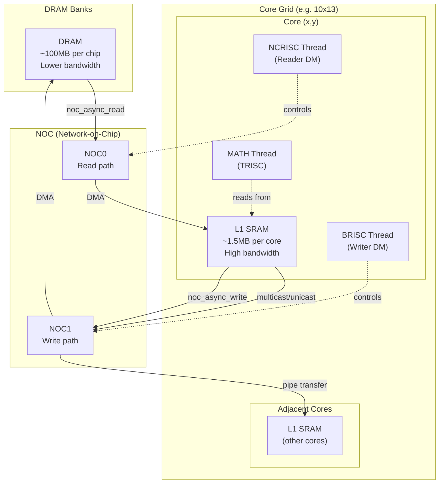
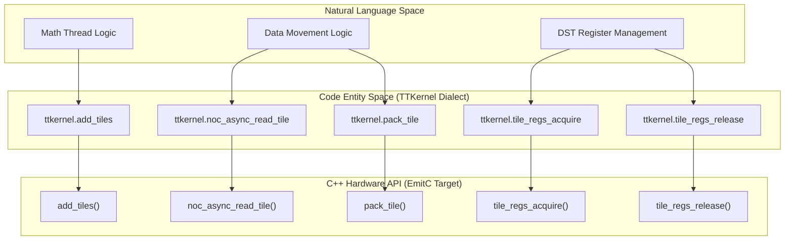
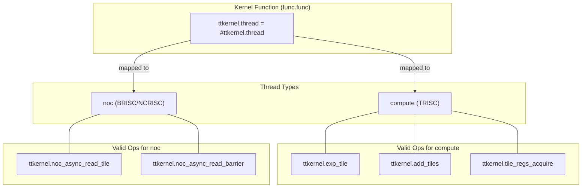

# TTKernel Dialect Specification

Relevant source files
*   [include/ttlang/Dialect/TTL/IR/TTL.h](https://github.com/tenstorrent/tt-lang/blob/d76e6233/include/ttlang/Dialect/TTL/IR/TTL.h)
*   [include/ttlang/Dialect/TTL/IR/TTLOps.td](https://github.com/tenstorrent/tt-lang/blob/d76e6233/include/ttlang/Dialect/TTL/IR/TTLOps.td)
*   [include/ttlang/Dialect/TTL/IR/TTLOpsUtils.h](https://github.com/tenstorrent/tt-lang/blob/d76e6233/include/ttlang/Dialect/TTL/IR/TTLOpsUtils.h)
*   [lib/Dialect/TTKernel/Transforms/TTKernelInsertInits.cpp](https://github.com/tenstorrent/tt-lang/blob/d76e6233/lib/Dialect/TTKernel/Transforms/TTKernelInsertInits.cpp)
*   [lib/Dialect/TTL/IR/TTLOps.cpp](https://github.com/tenstorrent/tt-lang/blob/d76e6233/lib/Dialect/TTL/IR/TTLOps.cpp)
*   [lib/Dialect/TTL/Transforms/ConvertTTLTileOpsToTTKernel.cpp](https://github.com/tenstorrent/tt-lang/blob/d76e6233/lib/Dialect/TTL/Transforms/ConvertTTLTileOpsToTTKernel.cpp)
*   [lib/Dialect/TTL/Transforms/ConvertTTLToCompute.cpp](https://github.com/tenstorrent/tt-lang/blob/d76e6233/lib/Dialect/TTL/Transforms/ConvertTTLToCompute.cpp)
*   [lib/Dialect/TTL/Transforms/ConvertTTLToTTKernel.cpp](https://github.com/tenstorrent/tt-lang/blob/d76e6233/lib/Dialect/TTL/Transforms/ConvertTTLToTTKernel.cpp)
*   [python/ttl/operators.py](https://github.com/tenstorrent/tt-lang/blob/d76e6233/python/ttl/operators.py)
*   [test/python/test_reduce.py](https://github.com/tenstorrent/tt-lang/blob/d76e6233/test/python/test_reduce.py)
*   [test/ttlang/Conversion/TTLToTTKernel/init_consolidation.mlir](https://github.com/tenstorrent/tt-lang/blob/d76e6233/test/ttlang/Conversion/TTLToTTKernel/init_consolidation.mlir)
*   [test/ttlang/Conversion/TTLToTTKernel/reduce_lowering.mlir](https://github.com/tenstorrent/tt-lang/blob/d76e6233/test/ttlang/Conversion/TTLToTTKernel/reduce_lowering.mlir)
*   [test/ttlang/Dialect/TTL/Transforms/SetComputeKernelConfig/set_compute_kernel_config.mlir](https://github.com/tenstorrent/tt-lang/blob/d76e6233/test/ttlang/Dialect/TTL/Transforms/SetComputeKernelConfig/set_compute_kernel_config.mlir)

## Purpose and Scope

This page documents the **TTKernel dialect**, a low-level MLIR dialect that represents hardware-specific operations for Tenstorrent accelerators. TTKernel operations directly map to hardware primitives and serve as the final MLIR representation before code generation to C++.

The TTKernel dialect is the target of the TTL-to-TTKernel conversion pipeline (see [3.4. TTL to TTKernel Conversion](https://github.com/tenstorrent/tt-lang/blob/d76e6233/3.4.%20TTL%20to%20TTKernel%20Conversion)). After TTKernel lowering, operations are converted to EmitC and then translated to C++ kernel code (see [3.5. Code Generation and EmitC](https://github.com/tenstorrent/tt-lang/blob/d76e6233/3.5.%20Code%20Generation%20and%20EmitC)).

**Scope of this document:**

*   TTKernel operation semantics and signatures
*   Type system (`CBType`, `TensorAccessorType`)
*   Thread types (NOC vs Compute)
*   Mapping to hardware C++ API
*   Runtime and compile-time argument model
*   Transformation passes (e.g., `TTKernelInsertInits`)

**Related pages:**

*   For the high-level TTL dialect, see [11.1. TTL Dialect Specification](https://github.com/tenstorrent/tt-lang/blob/d76e6233/11.1.%20TTL%20Dialect%20Specification)
*   For type conversion infrastructure, see [3.6. Type System and Type Conversion](https://github.com/tenstorrent/tt-lang/blob/d76e6233/3.6.%20Type%20System%20and%20Type%20Conversion)
*   For the compilation pipeline, see [3. Compilation Pipeline](https://github.com/tenstorrent/tt-lang/blob/d76e6233/3.%20Compilation%20Pipeline)

Sources: [lib/Dialect/TTL/Transforms/ConvertTTLToTTKernel.cpp 1-40](https://github.com/tenstorrent/tt-lang/blob/d76e6233/lib/Dialect/TTL/Transforms/ConvertTTLToTTKernel.cpp#L1-L40)[include/ttlang/Dialect/TTL/IR/TTLOps.td 12-20](https://github.com/tenstorrent/tt-lang/blob/d76e6233/include/ttlang/Dialect/TTL/IR/TTLOps.td#L12-L20)

* * *

## Overview

The TTKernel dialect provides a hardware-centric abstraction layer that:

1.   **Eliminates tensor abstractions**: Operates on circular buffers (CBs) and DST registers instead of tensors.
2.   **Exposes hardware primitives**: NOC DMA operations, circular buffer synchronization, SFPU tile compute.
3.   **Separates kernel types**: NOC kernels (data movement) vs Compute kernels (tile math).
4.   **Models hardware resources**: DST register allocation, CB indices, and initialization state.
5.   **Enables direct code generation**: Operations map 1:1 to C++ function calls via EmitC.




Sources: [python/ttl/ttl_api.py:98-98](), [benchmarks/matmul/config.py:76-78](), [benchmarks/matmul/NOTES.md:68-74]()
```
### TTL vs TTKernel Comparison

| Aspect | TTL Dialect | TTKernel Dialect |
| --- | --- | --- |
| **Abstraction Level** | Tensor-oriented (TTNN tensors) | Hardware-oriented (CBs, DST registers) |
| **Data Structures** | `!ttl.cb`, `tensor<...>`, `!ttl.transfer_handle` | `!ttkernel.cb`, `!ttkernel.tensor_accessor` |
| **Operations** | `ttl.copy`, `ttl.bind_cb`, `ttl.tile_add` | `ttkernel.noc_async_read_tile`, `ttkernel.add_tiles` |
| **Synchronization** | `ttl.wait` (transfer handle) | `ttkernel.noc_async_read_barrier` |
| **Memory Model** | Implicit (tensor → CB mapping) | Explicit (buffer addresses, CB pointers) |

Sources: [lib/Dialect/TTL/Transforms/ConvertTTLToTTKernel.cpp 61-81](https://github.com/tenstorrent/tt-lang/blob/d76e6233/lib/Dialect/TTL/Transforms/ConvertTTLToTTKernel.cpp#L61-L81)[lib/Dialect/TTL/Transforms/ConvertTTLToTTKernel.cpp 148-167](https://github.com/tenstorrent/tt-lang/blob/d76e6233/lib/Dialect/TTL/Transforms/ConvertTTLToTTKernel.cpp#L148-L167)

* * *

## Type System

### `!ttkernel.cb`

Represents a hardware circular buffer with flattened element count.

**Syntax:**`!ttkernel.cb<total_elements, element_type>`

**Conversion from TTL:** The conversion lowers `CircularBufferType` to `ttk::CBType` by calculating the total number of elements (shape product * block count) [lib/Dialect/TTL/Transforms/ConvertTTLToTTKernel.cpp 66-73](https://github.com/tenstorrent/tt-lang/blob/d76e6233/lib/Dialect/TTL/Transforms/ConvertTTLToTTKernel.cpp#L66-L73)

### `!ttkernel.tensor_accessor`

Opaque type representing a view into L1 or DRAM memory with tiling and paging metadata.

**Construction:** The `buildTensorAccessor` utility constructs the accessor using `tt-metal` constexpr CTA offset chaining [lib/Dialect/TTL/Transforms/ConvertTTLToTTKernel.cpp 148-167](https://github.com/tenstorrent/tt-lang/blob/d76e6233/lib/Dialect/TTL/Transforms/ConvertTTLToTTKernel.cpp#L148-L167)

**Fields (encoded in compile-time args):**

*   **Bank Base**: L1/DRAM buffer address (resolved from `GetCommonArgValOp`) [lib/Dialect/TTL/Transforms/ConvertTTLToTTKernel.cpp 146-153](https://github.com/tenstorrent/tt-lang/blob/d76e6233/lib/Dialect/TTL/Transforms/ConvertTTLToTTKernel.cpp#L146-L153)
*   **Page Size**: Bytes per page for addressing.
*   **CTA Expression**: C++ template expression for offset calculation [lib/Dialect/TTL/Transforms/ConvertTTLToTTKernel.cpp 167-169](https://github.com/tenstorrent/tt-lang/blob/d76e6233/lib/Dialect/TTL/Transforms/ConvertTTLToTTKernel.cpp#L167-L169)

Sources: [lib/Dialect/TTL/Transforms/ConvertTTLToTTKernel.cpp 62-96](https://github.com/tenstorrent/tt-lang/blob/d76e6233/lib/Dialect/TTL/Transforms/ConvertTTLToTTKernel.cpp#L62-L96)

* * *

## Operation Categories

### NOC Operations (Network-on-Chip DMA)

NOC operations perform asynchronous data transfers between DRAM/L1 and circular buffers.

#### `ttkernel.noc_async_read_tile`

Asynchronously read a single tile from L1/DRAM into a circular buffer.

*   **C++ Mapping**: `noc_async_read_tile(tile_offset, accessor, cb_ptr);`

#### `ttkernel.noc_async_write_tile`

Asynchronously write a single tile from a circular buffer to L1/DRAM.

*   **C++ Mapping**: `noc_async_write_tile(tile_offset, accessor, cb_ptr);`

#### `ttkernel.noc_async_read_barrier`

Synchronization barrier that blocks until all pending read transfers complete.

*   **C++ Mapping**: `noc_async_read_barrier();`

Sources: [lib/Dialect/TTL/Transforms/ConvertTTLToTTKernel.cpp 148-167](https://github.com/tenstorrent/tt-lang/blob/d76e6233/lib/Dialect/TTL/Transforms/ConvertTTLToTTKernel.cpp#L148-L167)[include/ttlang/Dialect/TTL/IR/TTLOps.td 122-154](https://github.com/tenstorrent/tt-lang/blob/d76e6233/include/ttlang/Dialect/TTL/IR/TTLOps.td#L122-L154)

### Circular Buffer Operations

CB operations provide producer-consumer synchronization primitives.

| TTKernel MLIR | C++ Mapping | TTL Source |
| --- | --- | --- |
| `ttkernel.cb_reserve_back` | `cb.reserve_back(num_pages)` | `ttl.cb_reserve` |
| `ttkernel.cb_push_back` | `cb.push_back(num_pages)` | `ttl.cb_push` |
| `ttkernel.cb_wait_front` | `cb.wait_front(num_pages)` | `ttl.cb_wait` |
| `ttkernel.cb_pop_front` | `cb.pop_front(num_pages)` | `ttl.cb_pop` |

Sources: [include/ttlang/Dialect/TTL/IR/TTLOps.td 26-51](https://github.com/tenstorrent/tt-lang/blob/d76e6233/include/ttlang/Dialect/TTL/IR/TTLOps.td#L26-L51)[include/ttlang/Dialect/TTL/IR/TTLOps.td 180-210](https://github.com/tenstorrent/tt-lang/blob/d76e6233/include/ttlang/Dialect/TTL/IR/TTLOps.td#L180-L210)

### Tile Compute Operations (SFPU/FPU)

Tile compute operations perform math on 32×32 tiles in DST registers.

#### Operation Pattern: Init + Compute

All SFPU/FPU operations follow a pattern where initialization is required before execution. The `TTKernelInsertInits` pass manages this by inserting the minimal set of init ops [lib/Dialect/TTKernel/Transforms/TTKernelInsertInits.cpp 6-20](https://github.com/tenstorrent/tt-lang/blob/d76e6233/lib/Dialect/TTKernel/Transforms/TTKernelInsertInits.cpp#L6-L20)

#### Binary Tile Operations

Binary operations compute: `DST[odst] = DST[src0] OP DST[src1]`.

*   `ttkernel.add_tiles`: FPU binary operation that reads operands directly from CBs [lib/Dialect/TTKernel/Transforms/TTKernelInsertInits.cpp 104-110](https://github.com/tenstorrent/tt-lang/blob/d76e6233/lib/Dialect/TTKernel/Transforms/TTKernelInsertInits.cpp#L104-L110)
*   `ttkernel.matmul_block`: High-performance matrix multiplication block [lib/Dialect/TTKernel/Transforms/TTKernelInsertInits.cpp 122-128](https://github.com/tenstorrent/tt-lang/blob/d76e6233/lib/Dialect/TTKernel/Transforms/TTKernelInsertInits.cpp#L122-L128)
*   `ttkernel.reduce_tile`: Reduction along a dimension (row/col) with optional full FP32 accumulation [lib/Dialect/TTKernel/Transforms/TTKernelInsertInits.cpp 140-151](https://github.com/tenstorrent/tt-lang/blob/d76e6233/lib/Dialect/TTKernel/Transforms/TTKernelInsertInits.cpp#L140-L151)

#### Unary Tile Operations

Unary operations compute in-place: `DST[dst_idx] = OP(DST[dst_idx])`.

*   `ttkernel.exp_tile`: Standard SFPU unary exponentiation [lib/Dialect/TTKernel/Transforms/TTKernelInsertInits.cpp 83-88](https://github.com/tenstorrent/tt-lang/blob/d76e6233/lib/Dialect/TTKernel/Transforms/TTKernelInsertInits.cpp#L83-L88)

### DST Lifecycle Operations

DST lifecycle operations manage mutual exclusion on the DST register bank between MATH and PACK threads.

| TTKernel Op | Hardware Action |
| --- | --- |
| `ttkernel.tile_regs_acquire` | Acquire lock for MATH thread [lib/Dialect/TTL/Transforms/ConvertTTLTileOpsToTTKernel.cpp 11-12](https://github.com/tenstorrent/tt-lang/blob/d76e6233/lib/Dialect/TTL/Transforms/ConvertTTLTileOpsToTTKernel.cpp#L11-L12) |
| `ttkernel.tile_regs_commit` | MATH thread releases lock |
| `ttkernel.tile_regs_wait` | PACK thread waits for MATH commit |
| `ttkernel.tile_regs_release` | PACK thread releases lock |

Sources: [lib/Dialect/TTL/Transforms/ConvertTTLTileOpsToTTKernel.cpp 10-12](https://github.com/tenstorrent/tt-lang/blob/d76e6233/lib/Dialect/TTL/Transforms/ConvertTTLTileOpsToTTKernel.cpp#L10-L12)[test/ttlang/Conversion/TTLToTTKernel/reduce_lowering.mlir 78-83](https://github.com/tenstorrent/tt-lang/blob/d76e6233/test/ttlang/Conversion/TTLToTTKernel/reduce_lowering.mlir#L78-L83)

* * *

## Dialect Transformations

### `TTKernelInsertInits` Pass

This pass inserts both common inits (e.g., `init_sfpu`, `binary_op_init_common`) and per-op inits (e.g., `exp_tile_init`, `add_tiles_init`) [lib/Dialect/TTKernel/Transforms/TTKernelInsertInits.cpp 6-10](https://github.com/tenstorrent/tt-lang/blob/d76e6233/lib/Dialect/TTKernel/Transforms/TTKernelInsertInits.cpp#L6-L10)

**Insertion Logic:**

1.   **Common Inits**: One per sync region, hoisted above enclosing loops. It scans `tile_regs_acquire` to `tile_regs_release` regions to determine the compute category [lib/Dialect/TTKernel/Transforms/TTKernelInsertInits.cpp 12-15](https://github.com/tenstorrent/tt-lang/blob/d76e6233/lib/Dialect/TTKernel/Transforms/TTKernelInsertInits.cpp#L12-L15)
2.   **Per-Op Inits**: Emitted in linear block order whenever the operation type changes (e.g., switching from unary SFPU to FPU binary). The init is inserted only when the key changes [lib/Dialect/TTKernel/Transforms/TTKernelInsertInits.cpp 16-19](https://github.com/tenstorrent/tt-lang/blob/d76e6233/lib/Dialect/TTKernel/Transforms/TTKernelInsertInits.cpp#L16-L19)

Sources: [lib/Dialect/TTKernel/Transforms/TTKernelInsertInits.cpp 1-45](https://github.com/tenstorrent/tt-lang/blob/d76e6233/lib/Dialect/TTKernel/Transforms/TTKernelInsertInits.cpp#L1-L45)[test/ttlang/Conversion/TTLToTTKernel/reduce_lowering.mlir 46-50](https://github.com/tenstorrent/tt-lang/blob/d76e6233/test/ttlang/Conversion/TTLToTTKernel/reduce_lowering.mlir#L46-L50)

* * *

## Hardware Mapping and Code Generation

Sources: [lib/Dialect/TTL/Transforms/ConvertTTLToTTKernel.cpp 9-17](https://github.com/tenstorrent/tt-lang/blob/d76e6233/lib/Dialect/TTL/Transforms/ConvertTTLToTTKernel.cpp#L9-L17)[lib/Dialect/TTKernel/Transforms/TTKernelInsertInits.cpp 104-115](https://github.com/tenstorrent/tt-lang/blob/d76e6233/lib/Dialect/TTKernel/Transforms/TTKernelInsertInits.cpp#L104-L115)




Sources: [lib/Dialect/TTL/Transforms/ConvertTTLToTTKernel.cpp:9-17](), [lib/Dialect/TTKernel/Transforms/TTKernelInsertInits.cpp:104-115]()
```
### Thread Architecture Mapping

The TTKernel dialect distinguishes between thread types via the `ttkernel.thread` attribute, which is converted from `ttl.kernel_thread`.

Sources: [lib/Dialect/TTL/Transforms/ConvertTTLToTTKernel.cpp 100-114](https://github.com/tenstorrent/tt-lang/blob/d76e6233/lib/Dialect/TTL/Transforms/ConvertTTLToTTKernel.cpp#L100-L114)[include/ttlang/Dialect/TTL/IR/TTLOpsUtils.h 31-37](https://github.com/tenstorrent/tt-lang/blob/d76e6233/include/ttlang/Dialect/TTL/IR/TTLOpsUtils.h#L31-L37)

* * *




Sources: [lib/Dialect/TTL/Transforms/ConvertTTLToTTKernel.cpp:100-114](), [include/ttlang/Dialect/TTL/IR/TTLOpsUtils.h:31-37]()

---
```
## Validation and Constraints

The TTKernel dialect enforces hardware-specific constraints during lowering and optimization:

*   **Compute Kernel Configuration**: Attributes like `fp32_dest_acc_en` and `dst_full_sync_en` are set on the `func.func` to control hardware behavior globally for the kernel [include/ttlang/Dialect/TTL/IR/TTL.h 41-43](https://github.com/tenstorrent/tt-lang/blob/d76e6233/include/ttlang/Dialect/TTL/IR/TTL.h#L41-L43)
*   **FPU vs SFPU Path**: The pipeline chooses between FPU binary ops (e.g., `add_tiles`) and SFPU binary ops based on configuration and operand location (CB vs DST) [lib/Dialect/TTKernel/Transforms/TTKernelInsertInits.cpp 104-110](https://github.com/tenstorrent/tt-lang/blob/d76e6233/lib/Dialect/TTKernel/Transforms/TTKernelInsertInits.cpp#L104-L110)
*   **FP32 Accumulation**: If f32 tile arguments are detected, the system enables `fp32_dest_acc_en`[test/ttlang/Dialect/TTL/Transforms/SetComputeKernelConfig/set_compute_kernel_config.mlir 13-18](https://github.com/tenstorrent/tt-lang/blob/d76e6233/test/ttlang/Dialect/TTL/Transforms/SetComputeKernelConfig/set_compute_kernel_config.mlir#L13-L18)
*   **CB Index Range**: CB indices are limited to a hardware capacity (typically 0-31) [include/ttlang/Dialect/TTL/IR/TTL.h 25](https://github.com/tenstorrent/tt-lang/blob/d76e6233/include/ttlang/Dialect/TTL/IR/TTL.h#L25-L25)

Sources: [include/ttlang/Dialect/TTL/IR/TTL.h 21-49](https://github.com/tenstorrent/tt-lang/blob/d76e6233/include/ttlang/Dialect/TTL/IR/TTL.h#L21-L49)[test/ttlang/Dialect/TTL/Transforms/SetComputeKernelConfig/set_compute_kernel_config.mlir 1-30](https://github.com/tenstorrent/tt-lang/blob/d76e6233/test/ttlang/Dialect/TTL/Transforms/SetComputeKernelConfig/set_compute_kernel_config.mlir#L1-L30)

Dismiss
Refresh this wiki

Enter email to refresh
