# Transformation Pass Reference

Relevant source files
*   [docs/sphinx/reference/compiler-options.md](https://github.com/tenstorrent/tt-lang/blob/d76e6233/docs/sphinx/reference/compiler-options.md?plain=1)
*   [include/ttlang/Dialect/TTL/Passes.td](https://github.com/tenstorrent/tt-lang/blob/d76e6233/include/ttlang/Dialect/TTL/Passes.td)
*   [include/ttlang/Dialect/TTL/Pipelines/TTLPipelines.h](https://github.com/tenstorrent/tt-lang/blob/d76e6233/include/ttlang/Dialect/TTL/Pipelines/TTLPipelines.h)
*   [lib/Dialect/TTL/Pipelines/TTLPipelines.cpp](https://github.com/tenstorrent/tt-lang/blob/d76e6233/lib/Dialect/TTL/Pipelines/TTLPipelines.cpp)
*   [lib/Dialect/TTL/Transforms/CMakeLists.txt](https://github.com/tenstorrent/tt-lang/blob/d76e6233/lib/Dialect/TTL/Transforms/CMakeLists.txt)
*   [python/ttl/__init__.py](https://github.com/tenstorrent/tt-lang/blob/d76e6233/python/ttl/__init__.py)
*   [python/ttl/_src/ttl_ast.py](https://github.com/tenstorrent/tt-lang/blob/d76e6233/python/ttl/_src/ttl_ast.py)
*   [python/ttl/compiler_options.py](https://github.com/tenstorrent/tt-lang/blob/d76e6233/python/ttl/compiler_options.py)
*   [python/ttl/ttl_api.py](https://github.com/tenstorrent/tt-lang/blob/d76e6233/python/ttl/ttl_api.py)
*   [test/me2e/builder/pipeline.py](https://github.com/tenstorrent/tt-lang/blob/d76e6233/test/me2e/builder/pipeline.py)
*   [test/python/simple_matmul_subblock.py](https://github.com/tenstorrent/tt-lang/blob/d76e6233/test/python/simple_matmul_subblock.py)
*   [test/python/test_compiler_options.py](https://github.com/tenstorrent/tt-lang/blob/d76e6233/test/python/test_compiler_options.py)

This page provides a comprehensive catalog of all MLIR transformation passes in the `tt-lang` compilation pipeline, including their purposes, options, algorithms, and execution order. Each pass is documented with its command-line flag, configuration options, input/output IR state, and implementation details.

For the high-level compilation pipeline overview, see [3.1 Pipeline Overview](https://github.com/tenstorrent/tt-lang/blob/d76e6233/3.1%20Pipeline%20Overview) For specific pass implementations like DST allocation, see [3.3.2 DST Register Assignment](https://github.com/tenstorrent/tt-lang/blob/d76e6233/3.3.2%20DST%20Register%20Assignment) For type system conversions used during lowering, see [3.6 Type System and Type Conversion](https://github.com/tenstorrent/tt-lang/blob/d76e6233/3.6%20Type%20System%20and%20Type%20Conversion)

## Pass Categories and Execution Model

Transformation passes in `tt-lang` are organized into four categories based on their role in the compilation pipeline:

**Compilation Pipeline Flow**

**Sources:**[lib/Dialect/TTL/Pipelines/TTLPipelines.cpp 19-75](https://github.com/tenstorrent/tt-lang/blob/d76e6233/lib/Dialect/TTL/Pipelines/TTLPipelines.cpp#L19-L75)[include/ttlang/Dialect/TTL/Passes.td 6-180](https://github.com/tenstorrent/tt-lang/blob/d76e6233/include/ttlang/Dialect/TTL/Passes.td#L6-L180)[lib/Dialect/TTL/Pipelines/TTLPipelines.cpp 78-81](https://github.com/tenstorrent/tt-lang/blob/d76e6233/lib/Dialect/TTL/Pipelines/TTLPipelines.cpp#L78-L81)

```mermaid
graph TD
    subgraph "Phase 1: TTL Dialect Transformations"
        InsertDFB["ttl-insert-intermediate-dfbs<br/>Allocate compiler-managed DFBs"]
        InsertWait["ttl-insert-copy-wait<br/>Add missing ttl.wait"]
        InsertSync["ttl-insert-cb-sync<br/>Add cb_push/cb_pop/reserve/wait"]
        Coalesce["ttl-coalesce-dfb-acquires<br/>Merge consecutive waits/pops"]
        AnnotateL1["ttl-annotate-l1-acc-loops<br/>Detect += loops"]
        ToCompute["convert-ttl-to-compute<br/>Fuse elementwise ops"]
        SetConfig["ttl-set-compute-kernel-config<br/>Set fp32_dest_acc_en, dst_full_sync_en"]
        AssignDST["ttl-assign-dst<br/>DST register allocation"]
        Subblock["ttl-subblock-compute-for-dst<br/>Partition iteration space"]
        LowerLoops["ttl-lower-to-loops<br/>Convert ttl.compute to scf.for"]
        Schedule["ttl-schedule-operations<br/>Group tile ops by kind"]
        FinalizeDFB["ttl-finalize-dfb-indices<br/>Register compiler DFBs"]
        AnnotateCB["ttl-annotate-cb-associations<br/>Add CB index attributes"]
    end
    
    subgraph "Phase 2: TTL to TTKernel Lowering"
        ToTTKernel["convert-ttl-to-ttkernel<br/>Lower DMA and tile ops"]
    end
    
    subgraph "Phase 3: TTKernel Transformations"
        InsertInits["ttkernel-insert-inits<br/>Add init ops"]
        L1Acc["ttkernel-insert-l1-accumulation<br/>Add L1 reduction guards"]
        CombinePack["ttkernel-combine-pack-tiles<br/>Merge pack_tile to block"]
    end
    
    subgraph "Phase 4: Code Generation"
        LowerAffine["lower-affine<br/>Standard MLIR pass"]
        ToEmitC["convert-ttkernel-to-emitc<br/>Generate C++"]
        FormExpr["emitc-form-expressions<br/>Cleanup EmitC"]
    end
    
    InsertDFB --> InsertWait
    InsertWait --> InsertSync
    InsertSync --> Coalesce
    Coalesce --> AnnotateL1
    AnnotateL1 --> ToCompute
    ToCompute --> SetConfig
    SetConfig --> AssignDST
    AssignDST --> Subblock
    Subblock --> LowerLoops
    LowerLoops --> Schedule
    Schedule --> FinalizeDFB
    FinalizeDFB --> AnnotateCB
    AnnotateCB --> ToTTKernel
    ToTTKernel --> InsertInits
    InsertInits --> L1Acc
    L1Acc --> CombinePack
    CombinePack --> LowerAffine
    LowerAffine --> ToEmitC
    ToEmitC --> FormExpr
```

## Pass Reference Table

| Pass Name | Command-Line Flag | Category | Key Options |
| --- | --- | --- | --- |
| TTLInsertIntermediateDFBs | `ttl-insert-intermediate-dfbs` | TTL Transform | `enable` |
| TTLInsertCopyWait | `ttl-insert-copy-wait` | TTL Transform | None |
| TTLInsertCBSync | `ttl-insert-cb-sync` | TTL Transform | None |
| TTLCoalesceDFBAcquires | `ttl-coalesce-dfb-acquires` | TTL Transform | None |
| TTLAnnotateL1AccLoops | `ttl-annotate-l1-acc-loops` | TTL Transform | None |
| ConvertTTLToCompute | `convert-ttl-to-compute` | TTL Transform | None |
| TTLSetComputeKernelConfig | `ttl-set-compute-kernel-config` | TTL Transform | `reduce-full-fp32`, `enable-fpu-binary-ops` |
| TTLAssignDST | `ttl-assign-dst` | TTL Transform | None |
| TTLSubblockComputeForDST | `ttl-subblock-compute-for-dst` | TTL Transform | `subblock-sync`, `strict-f32-acc` |
| TTLLowerToLoops | `ttl-lower-to-loops` | TTL Transform | `dst-accumulation`, `use-block-matmul` |
| TTLScheduleOperations | `ttl-schedule-operations` | TTL Transform | None |
| TTLFinalizeDFBIndices | `ttl-finalize-dfb-indices` | TTL Transform | None |
| TTLAnnotateCBAssociations | `ttl-annotate-cb-associations` | TTL Transform | None |
| ConvertTTLToTTKernel | `convert-ttl-to-ttkernel` | Lowering | `reduce-full-fp32` |
| TTKernelInsertInits | `ttkernel-insert-inits` | TTKernel Transform | None |
| TTKernelInsertL1Accumulation | `ttkernel-insert-l1-accumulation` | TTKernel Transform | None |
| TTKernelCombinePackTiles | `ttkernel-combine-pack-tiles` | TTKernel Transform | None |

**Sources:**[include/ttlang/Dialect/TTL/Passes.td 6-180](https://github.com/tenstorrent/tt-lang/blob/d76e6233/include/ttlang/Dialect/TTL/Passes.td#L6-L180)[lib/Dialect/TTL/Transforms/CMakeLists.txt 2-30](https://github.com/tenstorrent/tt-lang/blob/d76e6233/lib/Dialect/TTL/Transforms/CMakeLists.txt#L2-L30)[lib/Dialect/TTL/Pipelines/TTLPipelines.cpp 19-75](https://github.com/tenstorrent/tt-lang/blob/d76e6233/lib/Dialect/TTL/Pipelines/TTLPipelines.cpp#L19-L75)

## Phase 1: TTL Dialect Transformations

### ttl-insert-cb-sync

**Purpose:** Inserts missing `cb_push`/`cb_pop` for unmatched `cb_reserve`/`cb_wait` ops [include/ttlang/Dialect/TTL/Passes.td 7-8](https://github.com/tenstorrent/tt-lang/blob/d76e6233/include/ttlang/Dialect/TTL/Passes.td#L7-L8)

**Algorithm:**

*   Finds `ttl.cb_reserve` without `ttl.cb_push` and `ttl.cb_wait` without `ttl.cb_pop`[include/ttlang/Dialect/TTL/Passes.td 10-12](https://github.com/tenstorrent/tt-lang/blob/d76e6233/include/ttlang/Dialect/TTL/Passes.td#L10-L12)
*   Computes a transitive use closure starting from the acquire op: direct uses of the DFB value and the acquire result, plus uses of values those ops produce (e.g. `copy` ->`transfer_handle` ->`wait`) [include/ttlang/Dialect/TTL/Passes.td 14-16](https://github.com/tenstorrent/tt-lang/blob/d76e6233/include/ttlang/Dialect/TTL/Passes.td#L14-L16)
*   Direct DFB uses are bounded by the next acquire in the same DFB sync class because they do not carry an SSA link to the acquire that owns the slot [include/ttlang/Dialect/TTL/Passes.td 17-19](https://github.com/tenstorrent/tt-lang/blob/d76e6233/include/ttlang/Dialect/TTL/Passes.td#L17-L19)

**Sources:**[include/ttlang/Dialect/TTL/Passes.td 6-26](https://github.com/tenstorrent/tt-lang/blob/d76e6233/include/ttlang/Dialect/TTL/Passes.td#L6-L26)

* * *

### ttl-coalesce-dfb-acquires

**Purpose:** Rewrites consecutive same-DFB acquires into a single multi-tile acquire to match the canonical TT-Metal "cumulative wait + indexed reads + coalesced pop" pattern [include/ttlang/Dialect/TTL/Passes.td 30-41](https://github.com/tenstorrent/tt-lang/blob/d76e6233/include/ttlang/Dialect/TTL/Passes.td#L30-L41)

**Mechanism:**

*   Collapses a run of `N` consecutive `ttl.cb_wait` ops into one `ttl.cb_wait {num_tiles = N*k}` followed by `tensor.extract_slice` operations [include/ttlang/Dialect/TTL/Passes.td 60-78](https://github.com/tenstorrent/tt-lang/blob/d76e6233/include/ttlang/Dialect/TTL/Passes.td#L60-L78)
*   The producer side (`cb_reserve`/`cb_push`) is similarly collapsed into a single call with `num_tiles = N*k`[include/ttlang/Dialect/TTL/Passes.td 84-89](https://github.com/tenstorrent/tt-lang/blob/d76e6233/include/ttlang/Dialect/TTL/Passes.td#L84-L89)
*   Only acquires whose result tensor has shape `<1, k>` are coalesced; the coalesced result becomes `<1, N*k>`[include/ttlang/Dialect/TTL/Passes.td 97-100](https://github.com/tenstorrent/tt-lang/blob/d76e6233/include/ttlang/Dialect/TTL/Passes.td#L97-L100)

**Sources:**[include/ttlang/Dialect/TTL/Passes.td 28-106](https://github.com/tenstorrent/tt-lang/blob/d76e6233/include/ttlang/Dialect/TTL/Passes.td#L28-L106)

* * *

### ttl-assign-dst

**Purpose:** DST register allocator using linear scan allocation with in-place operation merging [include/ttlang/Dialect/TTL/Passes.td 161-164](https://github.com/tenstorrent/tt-lang/blob/d76e6233/include/ttlang/Dialect/TTL/Passes.td#L161-L164)

**Algorithm (4 Phases):**

1.   **Phase 1: Copy Insertion:** For values with multiple consumers where any consumer is in-place (overwrites input), it inserts `ttl.copy_dst` operations for all but the last consumer [include/ttlang/Dialect/TTL/Passes.td 167-169](https://github.com/tenstorrent/tt-lang/blob/d76e6233/include/ttlang/Dialect/TTL/Passes.td#L167-L169)
2.   **Phase 2: Build Live Intervals:** Builds interval `[start, end]` for each tile value and merges intervals for in-place ops (input and output share same DST) [include/ttlang/Dialect/TTL/Passes.td 171-173](https://github.com/tenstorrent/tt-lang/blob/d76e6233/include/ttlang/Dialect/TTL/Passes.td#L171-L173)
3.   **Phase 3: Linear Scan (Inputs):** Allocates DST registers `[0..k-1]` for input block arguments and intermediate values using interval-based linear scan [include/ttlang/Dialect/TTL/Passes.td 175-177](https://github.com/tenstorrent/tt-lang/blob/d76e6233/include/ttlang/Dialect/TTL/Passes.td#L175-L177)
4.   **Phase 4: Linear Scan (Outputs):** Allocates registers `[k..n]` for values yielded from the compute body to ensure they aren't overwritten during computation [include/ttlang/Dialect/TTL/Passes.td 179-181](https://github.com/tenstorrent/tt-lang/blob/d76e6233/include/ttlang/Dialect/TTL/Passes.td#L179-L181)

**Sources:**[include/ttlang/Dialect/TTL/Passes.td 160-189](https://github.com/tenstorrent/tt-lang/blob/d76e6233/include/ttlang/Dialect/TTL/Passes.td#L160-L189)

* * *

### ttl-subblock-compute-for-dst

**Purpose:** Partitions the iteration space of `ttl.compute` operations into DST-sized subblocks via `TilingInterface`[lib/Dialect/TTL/Transforms/CMakeLists.txt 30](https://github.com/tenstorrent/tt-lang/blob/d76e6233/lib/Dialect/TTL/Transforms/CMakeLists.txt#L30-L30)

**Mechanism:**

*   Skips non-matmul accumulating computes (e.g., `reduce_tile`) because subblocking would break reduction semantics [include/ttlang/Dialect/TTL/Passes.td 147-152](https://github.com/tenstorrent/tt-lang/blob/d76e6233/include/ttlang/Dialect/TTL/Passes.td#L147-L152)
*   For matmul, only parallel dimensions (M*N) count toward DST capacity; reduction (K) is free as it accumulates in-place [test/python/simple_matmul_subblock.py 11-15](https://github.com/tenstorrent/tt-lang/blob/d76e6233/test/python/simple_matmul_subblock.py#L11-L15)
*   The pass partitions the compute iteration space to ensure the resulting subblocks fit within the physical DST register capacity (e.g., 4 tiles for f32) [test/python/simple_matmul_subblock.py 13-15](https://github.com/tenstorrent/tt-lang/blob/d76e6233/test/python/simple_matmul_subblock.py#L13-L15)

**Options:**

*   `subblock-sync`: Refine DFB reserve/push to per-subblock granularity [include/ttlang/Dialect/TTL/Pipelines/TTLPipelines.h 33-38](https://github.com/tenstorrent/tt-lang/blob/d76e6233/include/ttlang/Dialect/TTL/Pipelines/TTLPipelines.h#L33-L38)
*   `strict-f32-acc`: Error if an accumulation loop's output block exceeds f32 DST capacity (4 tiles) [include/ttlang/Dialect/TTL/Passes.td 147-149](https://github.com/tenstorrent/tt-lang/blob/d76e6233/include/ttlang/Dialect/TTL/Passes.td#L147-L149)[docs/sphinx/reference/compiler-options.md 20](https://github.com/tenstorrent/tt-lang/blob/d76e6233/docs/sphinx/reference/compiler-options.md?plain=1#L20-L20)

**Sources:**[include/ttlang/Dialect/TTL/Passes.td 140-158](https://github.com/tenstorrent/tt-lang/blob/d76e6233/include/ttlang/Dialect/TTL/Passes.td#L140-L158)[include/ttlang/Dialect/TTL/Pipelines/TTLPipelines.h 33-50](https://github.com/tenstorrent/tt-lang/blob/d76e6233/include/ttlang/Dialect/TTL/Pipelines/TTLPipelines.h#L33-L50)[test/python/simple_matmul_subblock.py 11-32](https://github.com/tenstorrent/tt-lang/blob/d76e6233/test/python/simple_matmul_subblock.py#L11-L32)

* * *

### ttl-schedule-operations

**Purpose:** Reorders independent tile operations within a sync region to group them by kind [docs/sphinx/reference/compiler-options.md 15-16](https://github.com/tenstorrent/tt-lang/blob/d76e6233/docs/sphinx/reference/compiler-options.md?plain=1#L15-L16) This minimizes hardware initialization overhead by clustering operations that share pipeline configurations.

**Categories (Sorted by Priority):**

1.   `Bcast`: CB -> DST with PACK config.
2.   `Transpose`: CB -> DST transpose.
3.   `CopyTile`: CB -> DST copy.
4.   `FPUBinary`: CB -> DST FPU (UNPACK+MATH init).
5.   `SFPUUnary`: DST -> DST in-place.
6.   `SFPUBinary`: DST -> DST binary.
7.   `CopyDst`: DST -> DST copy.

**Sources:**[lib/Dialect/TTL/Pipelines/TTLPipelines.cpp 49-51](https://github.com/tenstorrent/tt-lang/blob/d76e6233/lib/Dialect/TTL/Pipelines/TTLPipelines.cpp#L49-L51)[lib/Dialect/TTL/Transforms/CMakeLists.txt 27](https://github.com/tenstorrent/tt-lang/blob/d76e6233/lib/Dialect/TTL/Transforms/CMakeLists.txt#L27-L27)

## Phase 3: TTKernel Transformations

### ttkernel-insert-l1-accumulation

**Purpose:** Inserts `pack_reconfig_l1_acc` guards inside reduction loops so that pack operations accumulate into L1 instead of overwriting [include/ttlang/Dialect/TTL/Passes.td 143-146](https://github.com/tenstorrent/tt-lang/blob/d76e6233/include/ttlang/Dialect/TTL/Passes.td#L143-L146)

**Mechanism:**

*   Groups consecutive sibling loops that pack to the same CB into accumulation scopes [include/ttlang/Dialect/TTL/Passes.td 151-152](https://github.com/tenstorrent/tt-lang/blob/d76e6233/include/ttlang/Dialect/TTL/Passes.td#L151-L152)
*   Inserts `pack_reconfig_l1_acc(0)` before the first loop and after the last `cb_push_back`[include/ttlang/Dialect/TTL/Passes.td 154-159](https://github.com/tenstorrent/tt-lang/blob/d76e6233/include/ttlang/Dialect/TTL/Passes.td#L154-L159)
*   Inserts `if (iv == lb) pack_reconfig_l1_acc(1)` after each loop's first iteration [include/ttlang/Dialect/TTL/Passes.td 155-157](https://github.com/tenstorrent/tt-lang/blob/d76e6233/include/ttlang/Dialect/TTL/Passes.td#L155-L157)
*   Loops are identified by `ttl.l1_acc_loop` (user-written) or `ttl.reduction_loop` (compiler-generated) attributes [include/ttlang/Dialect/TTL/Passes.td 161-164](https://github.com/tenstorrent/tt-lang/blob/d76e6233/include/ttlang/Dialect/TTL/Passes.td#L161-L164)

**Sources:**[include/ttlang/Dialect/TTL/Passes.td 143-172](https://github.com/tenstorrent/tt-lang/blob/d76e6233/include/ttlang/Dialect/TTL/Passes.td#L143-L172)

* * *

### ttkernel-combine-pack-tiles

**Purpose:** Combines consecutive `pack_tile` operations on the same CB with contiguous DST and CB indices into a single `pack_tile_block` call [docs/sphinx/reference/compiler-options.md 19-21](https://github.com/tenstorrent/tt-lang/blob/d76e6233/docs/sphinx/reference/compiler-options.md?plain=1#L19-L21)

**Sources:**[lib/Dialect/TTL/Pipelines/TTLPipelines.cpp 65-67](https://github.com/tenstorrent/tt-lang/blob/d76e6233/lib/Dialect/TTL/Pipelines/TTLPipelines.cpp#L65-L67)[include/ttlang/Dialect/TTL/Pipelines/TTLPipelines.h 39-42](https://github.com/tenstorrent/tt-lang/blob/d76e6233/include/ttlang/Dialect/TTL/Pipelines/TTLPipelines.h#L39-L42)

## Compiler Options Integration

Compiler options set via the Python DSL, environment variables, or CLI influence the construction of the `TTLToTTKernel` pipeline.

**Natural Language to Code Entity Mapping**

| Feature | CLI Flag | CompilerOptions Field | Pipeline Effect |
| --- | --- | --- | --- |
| DST Maximization | `--ttl-maximize-dst` | `maximize_dst` | Enables `ttl-subblock-compute-for-dst`[lib/Dialect/TTL/Pipelines/TTLPipelines.cpp 37-42](https://github.com/tenstorrent/tt-lang/blob/d76e6233/lib/Dialect/TTL/Pipelines/TTLPipelines.cpp#L37-L42) |
| FPU Binary Ops | `--ttl-fpu-binary-ops` | `enable_fpu_binary_ops` | Configures `ttl-set-compute-kernel-config`[lib/Dialect/TTL/Pipelines/TTLPipelines.cpp 31-35](https://github.com/tenstorrent/tt-lang/blob/d76e6233/lib/Dialect/TTL/Pipelines/TTLPipelines.cpp#L31-L35) |
| Block Matmul | `--ttl-block-matmul` | `use_block_matmul` | Enables `useBlockMatmul` in loop lowering [lib/Dialect/TTL/Pipelines/TTLPipelines.cpp 44-48](https://github.com/tenstorrent/tt-lang/blob/d76e6233/lib/Dialect/TTL/Pipelines/TTLPipelines.cpp#L44-L48) |
| Pack Combination | `--ttl-combine-pack-tiles` | `combine_pack_tiles` | Enables `ttkernel-combine-pack-tiles`[lib/Dialect/TTL/Pipelines/TTLPipelines.cpp 65-67](https://github.com/tenstorrent/tt-lang/blob/d76e6233/lib/Dialect/TTL/Pipelines/TTLPipelines.cpp#L65-L67) |
| Compiler DFBs | `--ttl-compiler-dfbs` | `compiler_dfbs` | Enables `ttl-insert-intermediate-dfbs`[lib/Dialect/TTL/Pipelines/TTLPipelines.cpp 21-25](https://github.com/tenstorrent/tt-lang/blob/d76e6233/lib/Dialect/TTL/Pipelines/TTLPipelines.cpp#L21-L25) |

**Sources:**[python/ttl/compiler_options.py 30-92](https://github.com/tenstorrent/tt-lang/blob/d76e6233/python/ttl/compiler_options.py#L30-L92)[lib/Dialect/TTL/Pipelines/TTLPipelines.cpp 19-75](https://github.com/tenstorrent/tt-lang/blob/d76e6233/lib/Dialect/TTL/Pipelines/TTLPipelines.cpp#L19-L75)[include/ttlang/Dialect/TTL/Pipelines/TTLPipelines.h 16-57](https://github.com/tenstorrent/tt-lang/blob/d76e6233/include/ttlang/Dialect/TTL/Pipelines/TTLPipelines.h#L16-L57)[test/me2e/builder/pipeline.py 38-77](https://github.com/tenstorrent/tt-lang/blob/d76e6233/test/me2e/builder/pipeline.py#L38-L77)

Dismiss
Refresh this wiki

Enter email to refresh
