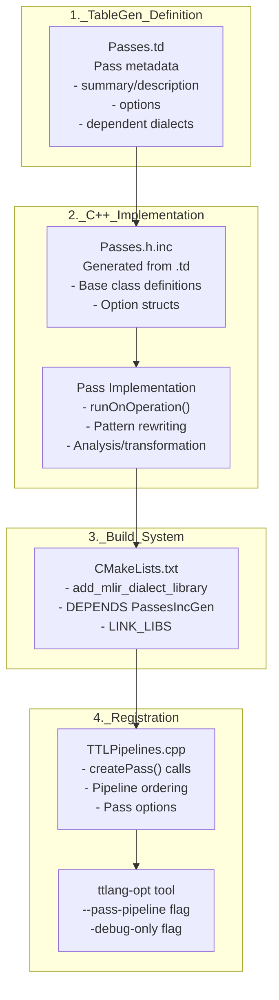
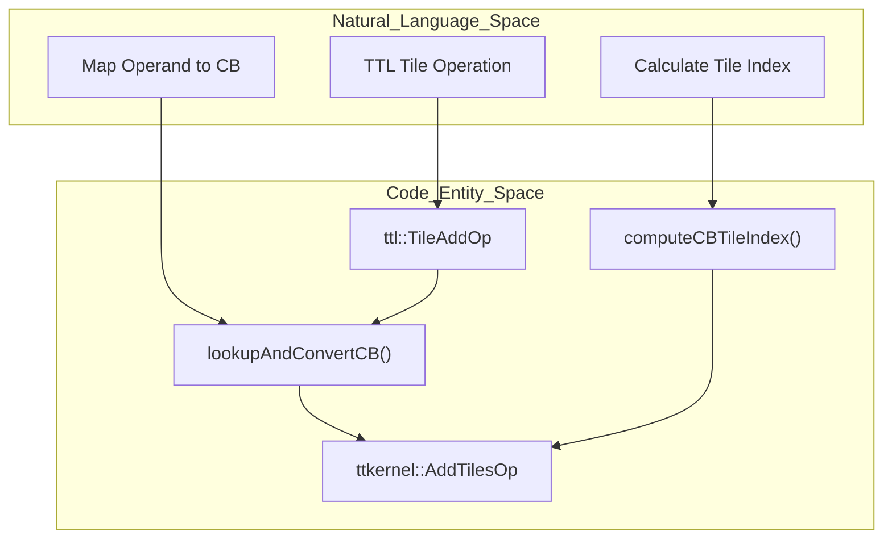

# MLIR Pass Development

Relevant source files
*   [include/ttlang/Dialect/TTL/IR/TTL.h](https://github.com/tenstorrent/tt-lang/blob/d76e6233/include/ttlang/Dialect/TTL/IR/TTL.h)
*   [include/ttlang/Dialect/TTL/IR/TTLOps.td](https://github.com/tenstorrent/tt-lang/blob/d76e6233/include/ttlang/Dialect/TTL/IR/TTLOps.td)
*   [include/ttlang/Dialect/TTL/IR/TTLOpsUtils.h](https://github.com/tenstorrent/tt-lang/blob/d76e6233/include/ttlang/Dialect/TTL/IR/TTLOpsUtils.h)
*   [include/ttlang/Dialect/TTL/Passes.td](https://github.com/tenstorrent/tt-lang/blob/d76e6233/include/ttlang/Dialect/TTL/Passes.td)
*   [lib/Dialect/TTL/IR/TTLOps.cpp](https://github.com/tenstorrent/tt-lang/blob/d76e6233/lib/Dialect/TTL/IR/TTLOps.cpp)
*   [lib/Dialect/TTL/Pipelines/TTLPipelines.cpp](https://github.com/tenstorrent/tt-lang/blob/d76e6233/lib/Dialect/TTL/Pipelines/TTLPipelines.cpp)
*   [lib/Dialect/TTL/Transforms/CMakeLists.txt](https://github.com/tenstorrent/tt-lang/blob/d76e6233/lib/Dialect/TTL/Transforms/CMakeLists.txt)
*   [lib/Dialect/TTL/Transforms/ConvertTTLTileOpsToTTKernel.cpp](https://github.com/tenstorrent/tt-lang/blob/d76e6233/lib/Dialect/TTL/Transforms/ConvertTTLTileOpsToTTKernel.cpp)
*   [lib/Dialect/TTL/Transforms/ConvertTTLToCompute.cpp](https://github.com/tenstorrent/tt-lang/blob/d76e6233/lib/Dialect/TTL/Transforms/ConvertTTLToCompute.cpp)
*   [lib/Dialect/TTL/Transforms/ConvertTTLToTTKernel.cpp](https://github.com/tenstorrent/tt-lang/blob/d76e6233/lib/Dialect/TTL/Transforms/ConvertTTLToTTKernel.cpp)
*   [python/ttl/_src/ttl_ast.py](https://github.com/tenstorrent/tt-lang/blob/d76e6233/python/ttl/_src/ttl_ast.py)
*   [python/ttl/operators.py](https://github.com/tenstorrent/tt-lang/blob/d76e6233/python/ttl/operators.py)
*   [python/ttl/ttl_api.py](https://github.com/tenstorrent/tt-lang/blob/d76e6233/python/ttl/ttl_api.py)
*   [test/me2e/builder/pipeline.py](https://github.com/tenstorrent/tt-lang/blob/d76e6233/test/me2e/builder/pipeline.py)

This page provides a comprehensive guide to developing MLIR transformation passes within the tt-lang compiler infrastructure. It covers pass structure, implementation patterns, registration, and testing methodologies specific to the `TTL` and `TTKernel` dialects.

For information about the overall compilation pipeline and how passes fit together, see [Compilation Pipeline](https://github.com/tenstorrent/tt-lang/blob/d76e6233/Compilation%20Pipeline) For details on specific passes like DST allocation or subblocking, see [TTL Dialect Transformations](https://github.com/tenstorrent/tt-lang/blob/d76e6233/TTL%20Dialect%20Transformations)

* * *

## Pass Architecture in tt-lang

Passes in tt-lang follow MLIR's standard pass infrastructure but are organized into two categories: **TTL dialect passes** that operate on high-level tile operations, and **TTKernel dialect passes** that operate on hardware-specific operations. The pass development lifecycle consists of four stages: TableGen definition, C++ implementation, build system integration, and pipeline registration.

**Diagram: Pass Development Lifecycle**

**Sources:**[lib/Dialect/TTL/Transforms/ConvertTTLToCompute.cpp 24-25](https://github.com/tenstorrent/tt-lang/blob/d76e6233/lib/Dialect/TTL/Transforms/ConvertTTLToCompute.cpp#L24-L25)[lib/Dialect/TTL/Transforms/ConvertTTLTileOpsToTTKernel.cpp 37-40](https://github.com/tenstorrent/tt-lang/blob/d76e6233/lib/Dialect/TTL/Transforms/ConvertTTLTileOpsToTTKernel.cpp#L37-L40)[lib/Dialect/TTL/Transforms/ConvertTTLToTTKernel.cpp 47-48](https://github.com/tenstorrent/tt-lang/blob/d76e6233/lib/Dialect/TTL/Transforms/ConvertTTLToTTKernel.cpp#L47-L48)

* * *

## Pass Structure Components

Each pass consists of three mandatory components and one optional component that work together to define and implement the transformation.

| Component | File | Purpose | Key Elements |
| --- | --- | --- | --- |
| **TableGen Definition** | `Passes.td` | Declares pass metadata | `summary`, `description`, `options`, `dependentDialects` |
| **C++ Implementation** | `*Pass.cpp` | Implements transformation logic | `runOnOperation()`, pattern sets, analysis helpers |
| **Build Integration** | `CMakeLists.txt` | Links pass into library | `DEPENDS PassesIncGen`, dialect dependencies |
| **Pipeline Registration** | `TTLPipelines.cpp` | Composes passes into pipelines | `createPass()` calls, pass options |

**Diagram: Pass Component Dependencies**

**Sources:**[lib/Dialect/TTL/Transforms/ConvertTTLToCompute.cpp 24-25](https://github.com/tenstorrent/tt-lang/blob/d76e6233/lib/Dialect/TTL/Transforms/ConvertTTLToCompute.cpp#L24-L25)[lib/Dialect/TTL/Transforms/ConvertTTLToTTKernel.cpp 47-48](https://github.com/tenstorrent/tt-lang/blob/d76e6233/lib/Dialect/TTL/Transforms/ConvertTTLToTTKernel.cpp#L47-L48)[lib/Dialect/TTL/Transforms/CMakeLists.txt 1-51](https://github.com/tenstorrent/tt-lang/blob/d76e6233/lib/Dialect/TTL/Transforms/CMakeLists.txt#L1-L51)

* * *

## Creating a New Pass: Step-by-step

### Step 1: Define Pass in TableGen

Add a new pass definition to `Passes.td` using the `Pass` class. The first template parameter is the pass name (used with `--pass-pipeline`), and the second is the operation type the pass runs on (typically `::mlir::func::FuncOp`). [include/ttlang/Dialect/TTL/Passes.td 6-26](https://github.com/tenstorrent/tt-lang/blob/d76e6233/include/ttlang/Dialect/TTL/Passes.td#L6-L26)

### Step 2: Implement Pass Class

Create a new `.cpp` file in `lib/Dialect/TTL/Transforms/` that implements the pass. The pass must inherit from the generated base class and implement `runOnOperation()`.

`#include "ttlang/Dialect/TTL/Passes.h" namespace mlir::tt::ttl {#define GEN_PASS_DEF_TTLMYNEWPASS#include "ttlang/Dialect/TTL/Passes.h.inc" struct TTLMyNewPass : public impl::TTLMyNewPassBase<TTLMyNewPass> {  void runOnOperation() override {    func::FuncOp func = getOperation();    // Implementation logic...  }};} // namespace mlir::tt::ttl`
**Sources:**[lib/Dialect/TTL/Transforms/ConvertTTLToCompute.cpp 22-25](https://github.com/tenstorrent/tt-lang/blob/d76e6233/lib/Dialect/TTL/Transforms/ConvertTTLToCompute.cpp#L22-L25)[lib/Dialect/TTL/Transforms/ConvertTTLToTTKernel.cpp 46-49](https://github.com/tenstorrent/tt-lang/blob/d76e6233/lib/Dialect/TTL/Transforms/ConvertTTLToTTKernel.cpp#L46-L49)

* * *

## Pass Implementation Patterns

### Pattern 1: Elementwise Fusion (`ConvertTTLToCompute`)

This pass transforms high-level tensor operations into `ttl.compute` blocks. It performs fusion by identifying producers and consumers that can be executed within a single compute kernel.

1.   **Collect Output CBs**: Identifies `ttl.store` users to determine which circular buffers will receive the compute results. [lib/Dialect/TTL/Transforms/ConvertTTLToCompute.cpp 101-119](https://github.com/tenstorrent/tt-lang/blob/d76e6233/lib/Dialect/TTL/Transforms/ConvertTTLToCompute.cpp#L101-L119)
2.   **Insertion Point Management**: Uses `insertAtLastStore` to ensure the new `ttl.compute` op is placed after all necessary `cb_reserve` calls. [lib/Dialect/TTL/Transforms/ConvertTTLToCompute.cpp 141-146](https://github.com/tenstorrent/tt-lang/blob/d76e6233/lib/Dialect/TTL/Transforms/ConvertTTLToCompute.cpp#L141-L146)
3.   **Tile Store Emission**: Replaces block-level stores with `tile_store` operations inside the compute body. [lib/Dialect/TTL/Transforms/ConvertTTLToCompute.cpp 151-205](https://github.com/tenstorrent/tt-lang/blob/d76e6233/lib/Dialect/TTL/Transforms/ConvertTTLToCompute.cpp#L151-L205)

**Sources:**[lib/Dialect/TTL/Transforms/ConvertTTLToCompute.cpp 101-205](https://github.com/tenstorrent/tt-lang/blob/d76e6233/lib/Dialect/TTL/Transforms/ConvertTTLToCompute.cpp#L101-L205)

### Pattern 2: Lowering to Hardware Ops (`ConvertTTLTileOpsToTTKernel`)

This pass converts `ttl.tile_*` operations to low-level `ttkernel` operations. It involves complex mapping of circular buffers and DST registers.

**Diagram: Tile Operation Lowering**

**Sources:**[lib/Dialect/TTL/Transforms/ConvertTTLTileOpsToTTKernel.cpp 133-176](https://github.com/tenstorrent/tt-lang/blob/d76e6233/lib/Dialect/TTL/Transforms/ConvertTTLTileOpsToTTKernel.cpp#L133-L176)

### Pattern 3: Dialect Conversion and Type Materialization

The `ConvertTTLToTTKernel` pass uses the MLIR `TypeConverter` to transition from TTL high-level types to TTKernel hardware types.

*   **CB Conversion**: `CircularBufferType` is lowered to `ttkernel::CBType` with flattened element counts. [lib/Dialect/TTL/Transforms/ConvertTTLToTTKernel.cpp 70-73](https://github.com/tenstorrent/tt-lang/blob/d76e6233/lib/Dialect/TTL/Transforms/ConvertTTLToTTKernel.cpp#L70-L73)
*   **Tensor Accessors**: Tensors with `#ttl.layout` are converted to `ttkernel::TensorAccessorType`. [lib/Dialect/TTL/Transforms/ConvertTTLToTTKernel.cpp 75-80](https://github.com/tenstorrent/tt-lang/blob/d76e6233/lib/Dialect/TTL/Transforms/ConvertTTLToTTKernel.cpp#L75-L80)
*   **Materialization**: Uses `UnrealizedConversionCastOp` to bridge type systems during the conversion process. [lib/Dialect/TTL/Transforms/ConvertTTLToTTKernel.cpp 87-95](https://github.com/tenstorrent/tt-lang/blob/d76e6233/lib/Dialect/TTL/Transforms/ConvertTTLToTTKernel.cpp#L87-L95)

**Sources:**[lib/Dialect/TTL/Transforms/ConvertTTLToTTKernel.cpp 65-96](https://github.com/tenstorrent/tt-lang/blob/d76e6233/lib/Dialect/TTL/Transforms/ConvertTTLToTTKernel.cpp#L65-L96)

* * *

## Common Utilities and Traits

Passes leverage shared utilities in `TTLOpsUtils.h` and `TTLOps.cpp` to classify operations and trace dataflow dependencies.

| Utility / Trait | Purpose |
| --- | --- |
| `findCBAcquireOp` | Traces through casts, extracts, and views to find the underlying Circular Buffer acquire op. [include/ttlang/Dialect/TTL/IR/TTLOpsUtils.h 116-133](https://github.com/tenstorrent/tt-lang/blob/d76e6233/include/ttlang/Dialect/TTL/IR/TTLOpsUtils.h#L116-L133) |
| `traceUnrealizedCasts` | Cycles-safe traversal through conversion casts to find original values. [include/ttlang/Dialect/TTL/IR/TTLOpsUtils.h 41-54](https://github.com/tenstorrent/tt-lang/blob/d76e6233/include/ttlang/Dialect/TTL/IR/TTLOpsUtils.h#L41-L54) |
| `getCBIndex` | Resolves the hardware CB index from a value, handling pre/post conversion ops. [include/ttlang/Dialect/TTL/IR/TTLOpsUtils.h 173-182](https://github.com/tenstorrent/tt-lang/blob/d76e6233/include/ttlang/Dialect/TTL/IR/TTLOpsUtils.h#L173-L182) |
| `verify` | Custom verifier logic for ops like `BindCBOp` or `CopyOp` to ensure IR integrity. [lib/Dialect/TTL/IR/TTLOps.cpp 98-203](https://github.com/tenstorrent/tt-lang/blob/d76e6233/lib/Dialect/TTL/IR/TTLOps.cpp#L98-L203) |

**Sources:**[include/ttlang/Dialect/TTL/IR/TTLOpsUtils.h 41-182](https://github.com/tenstorrent/tt-lang/blob/d76e6233/include/ttlang/Dialect/TTL/IR/TTLOpsUtils.h#L41-L182)[lib/Dialect/TTL/IR/TTLOps.cpp 98-203](https://github.com/tenstorrent/tt-lang/blob/d76e6233/lib/Dialect/TTL/IR/TTLOps.cpp#L98-L203)

* * *

## Testing Passes

### MLIR Lit Tests

Passes are primarily tested using `ttlang-opt` and `FileCheck`. These tests verify that transformations correctly lower operations and maintain dataflow invariants. Examples include testing the conversion of TTL DMA operations to TTKernel NOC operations. [lib/Dialect/TTL/Transforms/ConvertTTLToTTKernel.cpp 1-40](https://github.com/tenstorrent/tt-lang/blob/d76e6233/lib/Dialect/TTL/Transforms/ConvertTTLToTTKernel.cpp#L1-L40)

### Verifier Tests

The `CopyOp` and `WaitOp` verifiers ensure that illegal IR is rejected early.

*   **CB Constraint**: `ttl.copy` must have exactly one `!ttl.cb` operand. [lib/Dialect/TTL/IR/TTLOps.cpp 196-200](https://github.com/tenstorrent/tt-lang/blob/d76e6233/lib/Dialect/TTL/IR/TTLOps.cpp#L196-L200)
*   **Wait Constraint**: `ttl.wait` blocks until an asynchronous transfer is complete. [include/ttlang/Dialect/TTL/IR/TTLOps.td 164-171](https://github.com/tenstorrent/tt-lang/blob/d76e6233/include/ttlang/Dialect/TTL/IR/TTLOps.td#L164-L171)

**Sources:**[lib/Dialect/TTL/IR/TTLOps.cpp 168-203](https://github.com/tenstorrent/tt-lang/blob/d76e6233/lib/Dialect/TTL/IR/TTLOps.cpp#L168-L203)[include/ttlang/Dialect/TTL/IR/TTLOps.td 122-171](https://github.com/tenstorrent/tt-lang/blob/d76e6233/include/ttlang/Dialect/TTL/IR/TTLOps.td#L122-L171)

Dismiss
Refresh this wiki

Enter email to refresh
