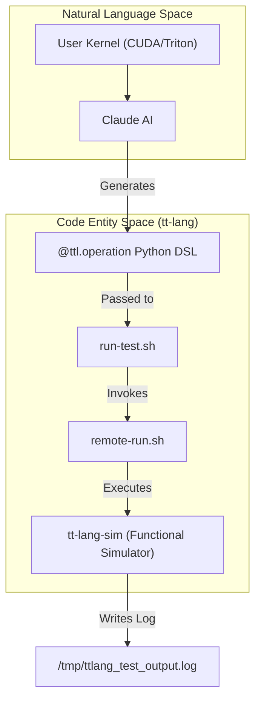
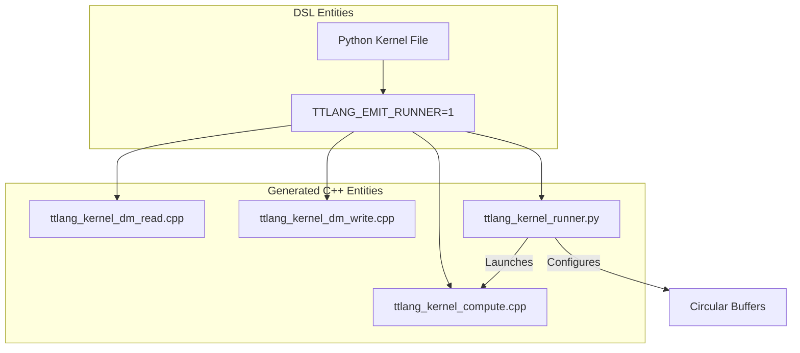

# Claude Slash Commands for tt-lang

Relevant source files
*   [CLAUDE.md](https://github.com/tenstorrent/tt-lang/blob/d76e6233/CLAUDE.md?plain=1)
*   [claude-slash-commands/install.sh](https://github.com/tenstorrent/tt-lang/blob/d76e6233/claude-slash-commands/install.sh)
*   [claude-slash-commands/tools/_lib.sh](https://github.com/tenstorrent/tt-lang/blob/d76e6233/claude-slash-commands/tools/_lib.sh)
*   [claude-slash-commands/tools/copy-file.sh](https://github.com/tenstorrent/tt-lang/blob/d76e6233/claude-slash-commands/tools/copy-file.sh)
*   [claude-slash-commands/tools/copy-from-remote.sh](https://github.com/tenstorrent/tt-lang/blob/d76e6233/claude-slash-commands/tools/copy-from-remote.sh)
*   [claude-slash-commands/tools/remote-run.sh](https://github.com/tenstorrent/tt-lang/blob/d76e6233/claude-slash-commands/tools/remote-run.sh)
*   [claude-slash-commands/tools/remote.conf.example](https://github.com/tenstorrent/tt-lang/blob/d76e6233/claude-slash-commands/tools/remote.conf.example)
*   [claude-slash-commands/tools/run-test.sh](https://github.com/tenstorrent/tt-lang/blob/d76e6233/claude-slash-commands/tools/run-test.sh)
*   [claude-slash-commands/tools/smoke-test.sh](https://github.com/tenstorrent/tt-lang/blob/d76e6233/claude-slash-commands/tools/smoke-test.sh)
*   [claude-slash-commands/ttl-bug.md](https://github.com/tenstorrent/tt-lang/blob/d76e6233/claude-slash-commands/ttl-bug.md?plain=1)
*   [claude-slash-commands/ttl-export.md](https://github.com/tenstorrent/tt-lang/blob/d76e6233/claude-slash-commands/ttl-export.md?plain=1)
*   [claude-slash-commands/ttl-import.md](https://github.com/tenstorrent/tt-lang/blob/d76e6233/claude-slash-commands/ttl-import.md?plain=1)
*   [claude-slash-commands/ttl-optimize.md](https://github.com/tenstorrent/tt-lang/blob/d76e6233/claude-slash-commands/ttl-optimize.md?plain=1)
*   [claude-slash-commands/ttl-profile.md](https://github.com/tenstorrent/tt-lang/blob/d76e6233/claude-slash-commands/ttl-profile.md?plain=1)
*   [docs/sphinx/index.rst](https://github.com/tenstorrent/tt-lang/blob/d76e6233/docs/sphinx/index.rst)
*   [docs/sphinx/overview.md](https://github.com/tenstorrent/tt-lang/blob/d76e6233/docs/sphinx/overview.md?plain=1)
*   [docs/sphinx/programming-guide.md](https://github.com/tenstorrent/tt-lang/blob/d76e6233/docs/sphinx/programming-guide.md?plain=1)
*   [docs/sphinx/reference/performance-tools.md](https://github.com/tenstorrent/tt-lang/blob/d76e6233/docs/sphinx/reference/performance-tools.md?plain=1)
*   [docs/sphinx/testing.md](https://github.com/tenstorrent/tt-lang/blob/d76e6233/docs/sphinx/testing.md?plain=1)
*   [docs/sphinx/tour/dataflow-buffers.md](https://github.com/tenstorrent/tt-lang/blob/d76e6233/docs/sphinx/tour/dataflow-buffers.md?plain=1)
*   [docs/sphinx/tour/index.md](https://github.com/tenstorrent/tt-lang/blob/d76e6233/docs/sphinx/tour/index.md?plain=1)
*   [examples/eltwise_pipe_node3.py](https://github.com/tenstorrent/tt-lang/blob/d76e6233/examples/eltwise_pipe_node3.py)

This page provides a technical guide to the AI-assisted development tools available as Claude slash commands for the `tt-lang` codebase. These commands facilitate the entire development lifecycle—from importing kernels from other frameworks to optimizing performance on Tenstorrent hardware.

## Overview and Installation

The `tt-lang` slash commands are a suite of automation scripts designed to run within the Claude Code environment. They bridge the gap between natural language intent and the complex MLIR-based compilation pipeline of `tt-lang`.

### Installation Process

The installation is handled by `claude-slash-commands/install.sh`[[claude-slash-commands/install.sh:1-119]](https://deepwiki.com/tenstorrent/tt-lang/12.5-claude-slash-commands-for-tt-lang). It performs the following actions:

1.   **Command Registration**: Copies `.md` command definitions (e.g., `ttl-import.md`, `ttl-optimize.md`, `ttl-profile.md`) to `~/.claude/commands/`[[claude-slash-commands/install.sh:12-21]](https://deepwiki.com/tenstorrent/tt-lang/12.5-claude-slash-commands-for-tt-lang)[[claude-slash-commands/install.sh:68-71]](https://deepwiki.com/tenstorrent/tt-lang/12.5-claude-slash-commands-for-tt-lang).
2.   **Toolchain Deployment**: Installs executable bash scripts to `~/.claude/commands/tools/`[[claude-slash-commands/install.sh:24-31]](https://deepwiki.com/tenstorrent/tt-lang/12.5-claude-slash-commands-for-tt-lang)[[claude-slash-commands/install.sh:75-80]](https://deepwiki.com/tenstorrent/tt-lang/12.5-claude-slash-commands-for-tt-lang).
3.   **Configuration**: Initializes `remote.conf` from a template to define the `REMOTE_SHELL` or `REMOTE_HOST`/`REMOTE_CONTAINER` for hardware access [[claude-slash-commands/install.sh:83-98]](https://deepwiki.com/tenstorrent/tt-lang/12.5-claude-slash-commands-for-tt-lang).

### The `run-test.sh` Toolchain

The core of the execution infrastructure is `run-test.sh`. It manages the environment variables that control the `tt-lang` compiler and selects the appropriate runner (functional simulator vs. hardware) [[claude-slash-commands/tools/run-test.sh:135-142]](https://deepwiki.com/tenstorrent/tt-lang/12.5-claude-slash-commands-for-tt-lang).

| Flag | Effect | Code Entity / Env Var |
| --- | --- | --- |
| `--hw` | Executes on Tenstorrent hardware | `RUNNER="python3"`[[claude-slash-commands/tools/run-test.sh:137]](https://deepwiki.com/tenstorrent/tt-lang/12.5-claude-slash-commands-for-tt-lang) |
| (default) | Executes in functional simulator | `RUNNER="tt-lang-sim"`[[claude-slash-commands/tools/run-test.sh:140]](https://deepwiki.com/tenstorrent/tt-lang/12.5-claude-slash-commands-for-tt-lang) |
| `--perf` | Enables NOC and DFB profiling | `TTLANG_PERF_DUMP=1`[[claude-slash-commands/tools/run-test.sh:176]](https://deepwiki.com/tenstorrent/tt-lang/12.5-claude-slash-commands-for-tt-lang) |
| `--auto-profile` | Enables per-line cycle counts | `TTLANG_AUTO_PROFILE=1`[[claude-slash-commands/tools/run-test.sh:167]](https://deepwiki.com/tenstorrent/tt-lang/12.5-claude-slash-commands-for-tt-lang) |
| `--emit-runner` | Generates standalone C++ kernels | `TTLANG_EMIT_RUNNER=1`[[claude-slash-commands/tools/run-test.sh:164]](https://deepwiki.com/tenstorrent/tt-lang/12.5-claude-slash-commands-for-tt-lang) |

**Sources:**[[claude-slash-commands/tools/run-test.sh:1-212]](https://deepwiki.com/tenstorrent/tt-lang/12.5-claude-slash-commands-for-tt-lang), [[claude-slash-commands/install.sh:1-119]](https://deepwiki.com/tenstorrent/tt-lang/12.5-claude-slash-commands-for-tt-lang)

* * *

## Command Reference

### /ttl-import: Kernel Translation

Purpose: Translates CUDA, Triton, PyTorch kernels, or TTNN programs into the `tt-lang` Python DSL [[claude-slash-commands/ttl-import.md:1-4]](https://deepwiki.com/tenstorrent/tt-lang/12.5-claude-slash-commands-for-tt-lang). It emphasizes the three-thread architecture (Compute, Reader, Writer) and the use of Dataflow Buffers (DFBs) for synchronization [[claude-slash-commands/ttl-import.md:83-92]](https://deepwiki.com/tenstorrent/tt-lang/12.5-claude-slash-commands-for-tt-lang).

**Data Flow: Translation to Execution** The following diagram illustrates how `/ttl-import` takes source code and moves it through the `tt-lang` infrastructure.

**Import and Simulation Flow**

**Sources:**[[claude-slash-commands/ttl-import.md:1-127]](https://deepwiki.com/tenstorrent/tt-lang/12.5-claude-slash-commands-for-tt-lang), [[claude-slash-commands/tools/run-test.sh:135-142]](https://deepwiki.com/tenstorrent/tt-lang/12.5-claude-slash-commands-for-tt-lang)

### /ttl-profile: Performance Analysis

Purpose: Reports per-line cycle counts and identifies bottlenecks [[claude-slash-commands/ttl-profile.md:1-4]](https://deepwiki.com/tenstorrent/tt-lang/12.5-claude-slash-commands-for-tt-lang). It relies on `TTLANG_AUTO_PROFILE` to generate detailed telemetry [[claude-slash-commands/ttl-profile.md:38-40]](https://deepwiki.com/tenstorrent/tt-lang/12.5-claude-slash-commands-for-tt-lang).

Key analysis sections extracted from logs [[claude-slash-commands/ttl-profile.md:47-53]](https://deepwiki.com/tenstorrent/tt-lang/12.5-claude-slash-commands-for-tt-lang):

*   **THREAD SUMMARY**: Cycle counts per thread (MATH, BRISC, NCRISC) and compute-vs-memory bound analysis.
*   **PERF SUMMARY**: Grid size, duration, DRAM bandwidth, and transfer patterns [[docs/sphinx/reference/performance-tools.md:42-61]](https://deepwiki.com/tenstorrent/tt-lang/12.5-claude-slash-commands-for-tt-lang).
*   **DFB FLOW GRAPH**: JSON representation of circular buffer producer/consumer relationships.

**Auto-Profiling Implementation** The auto-profiler instruments every line with signposts and prints per-line cycle counts [[docs/sphinx/reference/performance-tools.md:18]](https://deepwiki.com/tenstorrent/tt-lang/12.5-claude-slash-commands-for-tt-lang). This allows developers to see exactly where cycles are spent in the Python source code [[docs/sphinx/reference/performance-tools.md:103-124]](https://deepwiki.com/tenstorrent/tt-lang/12.5-claude-slash-commands-for-tt-lang).

**Sources:**[[claude-slash-commands/ttl-profile.md:1-80]](https://deepwiki.com/tenstorrent/tt-lang/12.5-claude-slash-commands-for-tt-lang), [[docs/sphinx/reference/performance-tools.md:1-128]](https://deepwiki.com/tenstorrent/tt-lang/12.5-claude-slash-commands-for-tt-lang)

### /ttl-optimize: Iterative Improvement

Purpose: Systematically improves kernel performance based on profiling data [[claude-slash-commands/ttl-optimize.md:1-4]](https://deepwiki.com/tenstorrent/tt-lang/12.5-claude-slash-commands-for-tt-lang).

1.   **Baseline**: Establish wall time using `--perf --hw`[[claude-slash-commands/ttl-optimize.md:79-85]](https://deepwiki.com/tenstorrent/tt-lang/12.5-claude-slash-commands-for-tt-lang).
2.   **Targeting**: Prioritize Core Utilization (Grid size), then DRAM traffic reduction, then DFB block size increases [[claude-slash-commands/ttl-optimize.md:52-70]](https://deepwiki.com/tenstorrent/tt-lang/12.5-claude-slash-commands-for-tt-lang).
3.   **Iteration**: Apply changes and measure wall time delta [[claude-slash-commands/ttl-optimize.md:104-113]](https://deepwiki.com/tenstorrent/tt-lang/12.5-claude-slash-commands-for-tt-lang).

**Sources:**[[claude-slash-commands/ttl-optimize.md:1-131]](https://deepwiki.com/tenstorrent/tt-lang/12.5-claude-slash-commands-for-tt-lang)

### /ttl-export: Lowering to TT-Metalium

Purpose: Converts the high-level Python DSL into standalone C++ kernels and a Python runner using `ttnn`[[claude-slash-commands/ttl-export.md:1-5]](https://deepwiki.com/tenstorrent/tt-lang/12.5-claude-slash-commands-for-tt-lang).

**Export Data Flow**

**Sources:**[[claude-slash-commands/tools/run-test.sh:163-165]](https://deepwiki.com/tenstorrent/tt-lang/12.5-claude-slash-commands-for-tt-lang), [[claude-slash-commands/tools/run-test.sh:107-108]](https://deepwiki.com/tenstorrent/tt-lang/12.5-claude-slash-commands-for-tt-lang), [[claude-slash-commands/ttl-export.md:1-5]](https://deepwiki.com/tenstorrent/tt-lang/12.5-claude-slash-commands-for-tt-lang)

* * *

## Remote Execution Architecture

The slash commands operate across a local-remote boundary, typically involving a local development machine and a remote server with Tenstorrent hardware.

### Implementation of `_lib.sh`

The `_lib.sh` script provides the abstraction layer for communication:

*   `remote_run()`: Executes commands via `ssh` and `docker exec`[[claude-slash-commands/tools/_lib.sh:7-15]](https://deepwiki.com/tenstorrent/tt-lang/12.5-claude-slash-commands-for-tt-lang).
*   `remote_copy_file()`: Transfers files to the remote environment. If `REMOTE_HOST` is configured, it uses `scp` followed by `docker cp` for reliability [[claude-slash-commands/tools/_lib.sh:19-33]](https://deepwiki.com/tenstorrent/tt-lang/12.5-claude-slash-commands-for-tt-lang).
*   `remote_copy_from()`: Retrieves files (like generated C++ code) from the remote [[claude-slash-commands/tools/_lib.sh:37-51]](https://deepwiki.com/tenstorrent/tt-lang/12.5-claude-slash-commands-for-tt-lang).

### Setup Verification

The `smoke-test.sh` script is the diagnostic entry point. It verifies three critical components:

1.   **Connectivity**: Basic `remote_run` echo [[claude-slash-commands/tools/smoke-test.sh:26-34]](https://deepwiki.com/tenstorrent/tt-lang/12.5-claude-slash-commands-for-tt-lang).
2.   **Filesystem**: Successful `remote_copy_file` and verification [[claude-slash-commands/tools/smoke-test.sh:38-53]](https://deepwiki.com/tenstorrent/tt-lang/12.5-claude-slash-commands-for-tt-lang).
3.   **Environment**: Successful `import ttnn` within the remote Python environment [[claude-slash-commands/tools/smoke-test.sh:58-66]](https://deepwiki.com/tenstorrent/tt-lang/12.5-claude-slash-commands-for-tt-lang).

**Sources:**[[claude-slash-commands/tools/_lib.sh:1-52]](https://deepwiki.com/tenstorrent/tt-lang/12.5-claude-slash-commands-for-tt-lang), [[claude-slash-commands/tools/smoke-test.sh:1-72]](https://deepwiki.com/tenstorrent/tt-lang/12.5-claude-slash-commands-for-tt-lang)

## Profiling and Debugging Environment

The `tt-lang` environment provides specific variables for capturing compiler artifacts and runtime logs.

| Variable | Role | Usage |
| --- | --- | --- |
| `TTLANG_INITIAL_MLIR` | Captures IR before transformation passes | `export TTLANG_INITIAL_MLIR=/tmp/initial.mlir`[[CLAUDE.md:68]](https://deepwiki.com/tenstorrent/tt-lang/12.5-claude-slash-commands-for-tt-lang) |
| `TTLANG_FINAL_MLIR` | Captures IR after all backend lowering | `export TTLANG_FINAL_MLIR=/tmp/final.mlir`[[CLAUDE.md:69]](https://deepwiki.com/tenstorrent/tt-lang/12.5-claude-slash-commands-for-tt-lang) |
| `TTLANG_VERBOSE_PASSES` | Streams IR dumps after every pass to stdout | `export TTLANG_VERBOSE_PASSES=1`[[CLAUDE.md:82]](https://deepwiki.com/tenstorrent/tt-lang/12.5-claude-slash-commands-for-tt-lang) |
| `TT_METAL_DPRINT_CORES` | Enables device-side `print()` from kernels | `export TT_METAL_DPRINT_CORES=0,0`[[docs/sphinx/programming-guide.md:24]](https://deepwiki.com/tenstorrent/tt-lang/12.5-claude-slash-commands-for-tt-lang) |

**Sources:**[[CLAUDE.md:64-108]](https://deepwiki.com/tenstorrent/tt-lang/12.5-claude-slash-commands-for-tt-lang), [[docs/sphinx/programming-guide.md:19-51]](https://deepwiki.com/tenstorrent/tt-lang/12.5-claude-slash-commands-for-tt-lang)

Dismiss
Refresh this wiki

Enter email to refresh
