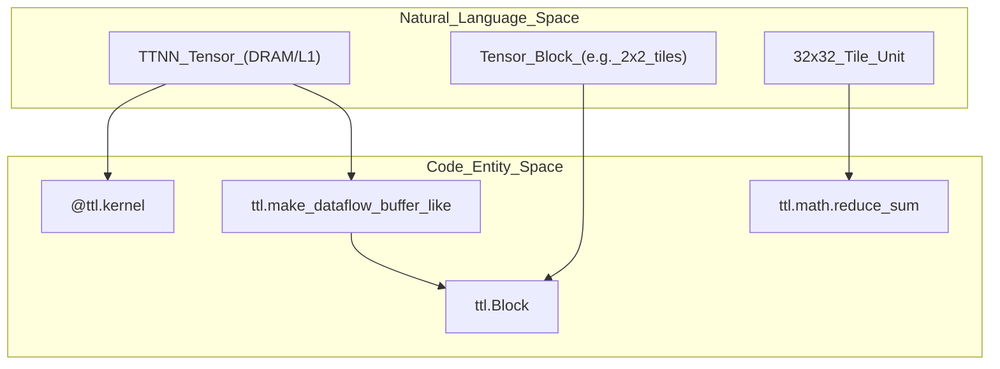
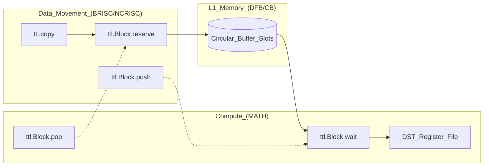

# Appendix

Relevant source files
*   [.editorconfig](https://github.com/tenstorrent/tt-lang/blob/d76e6233/.editorconfig)
*   [.github/ISSUE_TEMPLATE/config.yml](https://github.com/tenstorrent/tt-lang/blob/d76e6233/.github/ISSUE_TEMPLATE/config.yml)
*   [.github/ISSUE_TEMPLATE/feature_request.md](https://github.com/tenstorrent/tt-lang/blob/d76e6233/.github/ISSUE_TEMPLATE/feature_request.md?plain=1)
*   [.github/scripts/probe-docker-image.sh](https://github.com/tenstorrent/tt-lang/blob/d76e6233/.github/scripts/probe-docker-image.sh)
*   [.github/scripts/tests/test_probe_docker_image.bats](https://github.com/tenstorrent/tt-lang/blob/d76e6233/.github/scripts/tests/test_probe_docker_image.bats)
*   [.github/workflows/publish-s3-pypi.yml](https://github.com/tenstorrent/tt-lang/blob/d76e6233/.github/workflows/publish-s3-pypi.yml)
*   [.gitignore](https://github.com/tenstorrent/tt-lang/blob/d76e6233/.gitignore)
*   [CHANGELOG.md](https://github.com/tenstorrent/tt-lang/blob/d76e6233/CHANGELOG.md?plain=1)
*   [CITATION.cff](https://github.com/tenstorrent/tt-lang/blob/d76e6233/CITATION.cff)
*   [LICENSE](https://github.com/tenstorrent/tt-lang/blob/d76e6233/LICENSE)
*   [LICENSE_understanding.txt](https://github.com/tenstorrent/tt-lang/blob/d76e6233/LICENSE_understanding.txt)
*   [NOTICE](https://github.com/tenstorrent/tt-lang/blob/d76e6233/NOTICE)
*   [README.md](https://github.com/tenstorrent/tt-lang/blob/d76e6233/README.md?plain=1)
*   [docs/sphinx/getting-started.md](https://github.com/tenstorrent/tt-lang/blob/d76e6233/docs/sphinx/getting-started.md?plain=1)
*   [examples/README.md](https://github.com/tenstorrent/tt-lang/blob/d76e6233/examples/README.md?plain=1)
*   [python/CMakeLists.txt](https://github.com/tenstorrent/tt-lang/blob/d76e6233/python/CMakeLists.txt)

This appendix provides reference material and supplementary information for tt-lang developers. It includes a comprehensive terminology glossary, detailed memory layout specifications, and hardware architecture notes relevant to kernel development.

For conceptual explanations, see [Core Concepts](https://deepwiki.com/tenstorrent/tt-lang/2-core-concepts). For hands-on programming guidance, see [Programming Guide](https://deepwiki.com/tenstorrent/tt-lang/4-programming-guide). For complete API documentation, see [API Reference](https://deepwiki.com/tenstorrent/tt-lang/10-api-reference). For MLIR dialect specifications, see [MLIR Dialect Reference](https://deepwiki.com/tenstorrent/tt-lang/11-mlir-dialect-reference).

## Terminology Glossary

This glossary defines key terms used throughout the tt-lang documentation and codebase. For a deep dive into definitions, see the [Terminology Glossary](https://deepwiki.com/tenstorrent/tt-lang/13.1-terminology-glossary) child page.

### Core Concepts

**Operation function** : A Python function decorated with `@ttl.kernel` (or formerly `@ttl.operation`) that serves as the entry point. It defines kernel functions and shared objects [README.md 20-21](https://github.com/tenstorrent/tt-lang/blob/d76e6233/README.md?plain=1#L20-L21)

**Kernel function** : A function within an operation decorated with `@ttl.compute()` or `@ttl.datamovement()`. These define the logic for specific hardware threads [python/CMakeLists.txt 179-180](https://github.com/tenstorrent/tt-lang/blob/d76e6233/python/CMakeLists.txt#L179-L180)

**Grid** : The space of nodes (Tensix cores) to which the operation is submitted. Grids can be 2D (single chip) or higher dimensional (multi-chip/mesh via TT-Fabric) [CHANGELOG.md 49-50](https://github.com/tenstorrent/tt-lang/blob/d76e6233/CHANGELOG.md?plain=1#L49-L50)

**Dataflow Buffer (DFB)** : A communication primitive for synchronizing data passing between kernels within a node. It abstracts hardware Circular Buffers (CB) [python/ttl/dataflow_buffer.py 1-20](https://github.com/tenstorrent/tt-lang/blob/d76e6233/python/ttl/dataflow_buffer.py#L1-L20)

**Block** : A chunk of a tensor (typically a collection of tiles) that tt-lang operates on. Blocks are acquired from DFBs and are the primary unit for `push` and `pop` operations [CHANGELOG.md 42-43](https://github.com/tenstorrent/tt-lang/blob/d76e6233/CHANGELOG.md?plain=1#L42-L43)

**Tile** : The fundamental unit of data, typically 32x32 elements for tiled layouts [CHANGELOG.md 57-58](https://github.com/tenstorrent/tt-lang/blob/d76e6233/CHANGELOG.md?plain=1#L57-L58)

**Pipe / PipeNet** : Abstractions for node-to-node communication patterns. A `PipeNet` describes logical communication (unicast or multicast) between source and destination coordinates [CHANGELOG.md 41](https://github.com/tenstorrent/tt-lang/blob/d76e6233/CHANGELOG.md?plain=1#L41-L41)[python/ttl/pipe.py 1-10](https://github.com/tenstorrent/tt-lang/blob/d76e6233/python/ttl/pipe.py#L1-L10)

### Hardware & Execution

**TRISC (Thread RISC)** : The specialized processors within a Tensix core: `BRISC` (Data Movement), `NCRISC` (Data Movement), and `MATH` (Compute).

**DST Register File** : A high-speed register file used by the MATH thread to store intermediate tile results. Optimization passes in the compiler aim to maximize its usage [CHANGELOG.md 83-84](https://github.com/tenstorrent/tt-lang/blob/d76e6233/CHANGELOG.md?plain=1#L83-L84)

**NOC (Network on Chip)** : The interconnect used for moving data between L1 memory, DRAM, and other cores [CHANGELOG.md 90](https://github.com/tenstorrent/tt-lang/blob/d76e6233/CHANGELOG.md?plain=1#L90-L90)

**SPMD (Single Program Multiple Data)** : An execution mode where the same operation runs on multiple chips, each handling a different partition of data, simplified by TT-NN Mesh Devices [CHANGELOG.md 49](https://github.com/tenstorrent/tt-lang/blob/d76e6233/CHANGELOG.md?plain=1#L49-L49)

### Compilation & Tooling

**EmitC** : The MLIR dialect used for the final stage of lowering to C++ code [CHANGELOG.md 19](https://github.com/tenstorrent/tt-lang/blob/d76e6233/CHANGELOG.md?plain=1#L19-L19)

**Signpost** : A profiling marker inserted into code via `ttl.signpost()` to measure performance in tools like Perfetto [CHANGELOG.md 87-89](https://github.com/tenstorrent/tt-lang/blob/d76e6233/CHANGELOG.md?plain=1#L87-L89)

**Greenlet** : Used in the functional simulator to enable deterministic, cooperative scheduling between hardware threads [CHANGELOG.md 95](https://github.com/tenstorrent/tt-lang/blob/d76e6233/CHANGELOG.md?plain=1#L95-L95)

**Sources:**[README.md 20-40](https://github.com/tenstorrent/tt-lang/blob/d76e6233/README.md?plain=1#L20-L40)[CHANGELOG.md 8-121](https://github.com/tenstorrent/tt-lang/blob/d76e6233/CHANGELOG.md?plain=1#L8-L121)[python/CMakeLists.txt 168-187](https://github.com/tenstorrent/tt-lang/blob/d76e6233/python/CMakeLists.txt#L168-L187)

* * *

## Memory Layout Reference

This section provides a high-level overview of how data is organized. For details, see [Memory Layout Reference](https://deepwiki.com/tenstorrent/tt-lang/13.2-memory-layout-reference).

### Tile and Tensor Organization

TT-Lang primarily operates on tensors in `ttnn.TILE_LAYOUT`. Data is moved in blocks, where the `buffer_factor` determines the total L1 allocation to support patterns like double-buffering.

**Diagram: Tensor to Code Mapping**

**Sources:**[CHANGELOG.md 57-70](https://github.com/tenstorrent/tt-lang/blob/d76e6233/CHANGELOG.md?plain=1#L57-L70)[python/ttl/dataflow_buffer.py 1-20](https://github.com/tenstorrent/tt-lang/blob/d76e6233/python/ttl/dataflow_buffer.py#L1-L20)[python/ttl/layouts.py 1-10](https://github.com/tenstorrent/tt-lang/blob/d76e6233/python/ttl/layouts.py#L1-L10)

* * *

## Hardware Architecture Notes

Brief notes on the Tenstorrent architecture relevant to DSL programming. For details, see [Hardware Architecture Notes](https://deepwiki.com/tenstorrent/tt-lang/13.3-hardware-architecture-notes).

### Tensix Thread Coordination

The architecture relies on the coordination of three RISC threads. Data movement threads manage the `reserve/push` and `wait/pop` lifecycle of dataflow buffers to feed the compute engine.

**Diagram: Hardware Thread Interaction**

### Resource Constraints

*   **Dataflow Buffers:** The simulator enforces limits on the number of DFBs and L1 space usage [CHANGELOG.md 73-74](https://github.com/tenstorrent/tt-lang/blob/d76e6233/CHANGELOG.md?plain=1#L73-L74)[examples/README.md 69](https://github.com/tenstorrent/tt-lang/blob/d76e6233/examples/README.md?plain=1#L69-L69)
*   **DST Capacity:** Limited register space requires the compiler to perform tiling and unrolling to maximize usage [CHANGELOG.md 83-84](https://github.com/tenstorrent/tt-lang/blob/d76e6233/CHANGELOG.md?plain=1#L83-L84)
*   **Pipe Handshaking:** Multicast communication uses predicates like `is_src` and `is_dst` for flow control between senders and receivers [CHANGELOG.md 18](https://github.com/tenstorrent/tt-lang/blob/d76e6233/CHANGELOG.md?plain=1#L18-L18)[CHANGELOG.md 23](https://github.com/tenstorrent/tt-lang/blob/d76e6233/CHANGELOG.md?plain=1#L23-L23)

**Sources:**[CHANGELOG.md 12-106](https://github.com/tenstorrent/tt-lang/blob/d76e6233/CHANGELOG.md?plain=1#L12-L106)[examples/README.md 61-70](https://github.com/tenstorrent/tt-lang/blob/d76e6233/examples/README.md?plain=1#L61-L70)[python/ttl/pipe.py 1-15](https://github.com/tenstorrent/tt-lang/blob/d76e6233/python/ttl/pipe.py#L1-L15)

* * *

## Appendix Child Pages

*   [Terminology Glossary](https://deepwiki.com/tenstorrent/tt-lang/13.1-terminology-glossary)
*   [Memory Layout Reference](https://deepwiki.com/tenstorrent/tt-lang/13.2-memory-layout-reference)
*   [Hardware Architecture Notes](https://deepwiki.com/tenstorrent/tt-lang/13.3-hardware-architecture-notes)

**Sources:**[CHANGELOG.md 1-121](https://github.com/tenstorrent/tt-lang/blob/d76e6233/CHANGELOG.md?plain=1#L1-L121)[README.md 20-40](https://github.com/tenstorrent/tt-lang/blob/d76e6233/README.md?plain=1#L20-L40)

Dismiss
Refresh this wiki

Enter email to refresh
