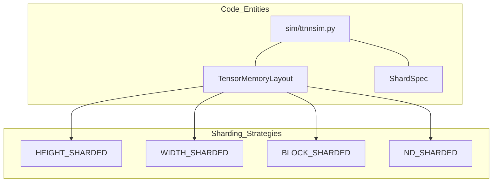
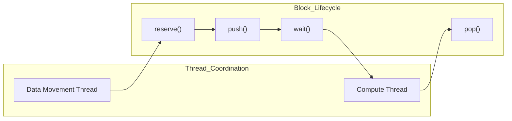

# Memory Layout Reference

Relevant source files
*   [.github/containers/cleanup-toolchain.sh](https://github.com/tenstorrent/tt-lang/blob/d76e6233/.github/containers/cleanup-toolchain.sh)
*   [docs/sphinx/simulator.md](https://github.com/tenstorrent/tt-lang/blob/d76e6233/docs/sphinx/simulator.md?plain=1)
*   [python/sim/dfb.py](https://github.com/tenstorrent/tt-lang/blob/d76e6233/python/sim/dfb.py)
*   [python/sim/ttlang_sim.py](https://github.com/tenstorrent/tt-lang/blob/d76e6233/python/sim/ttlang_sim.py)
*   [python/sim/ttnnsim.py](https://github.com/tenstorrent/tt-lang/blob/d76e6233/python/sim/ttnnsim.py)
*   [python/ttl/dtype_utils.py](https://github.com/tenstorrent/tt-lang/blob/d76e6233/python/ttl/dtype_utils.py)
*   [python/ttl/layouts.py](https://github.com/tenstorrent/tt-lang/blob/d76e6233/python/ttl/layouts.py)
*   [test/python/mesh_tensor_spmd.py](https://github.com/tenstorrent/tt-lang/blob/d76e6233/test/python/mesh_tensor_spmd.py)
*   [test/python/test_bfp8_dram_add.py](https://github.com/tenstorrent/tt-lang/blob/d76e6233/test/python/test_bfp8_dram_add.py)
*   [test/python/test_matmul_multinode_fused.py](https://github.com/tenstorrent/tt-lang/blob/d76e6233/test/python/test_matmul_multinode_fused.py)
*   [test/python/test_matmul_with_bias_spmd.py](https://github.com/tenstorrent/tt-lang/blob/d76e6233/test/python/test_matmul_with_bias_spmd.py)
*   [test/sim/test_examples.py](https://github.com/tenstorrent/tt-lang/blob/d76e6233/test/sim/test_examples.py)
*   [test/sim/test_no_mutable_globals.py](https://github.com/tenstorrent/tt-lang/blob/d76e6233/test/sim/test_no_mutable_globals.py)
*   [test/sim/test_ttlang_sim.py](https://github.com/tenstorrent/tt-lang/blob/d76e6233/test/sim/test_ttlang_sim.py)
*   [test/sim/test_ttnnsim.py](https://github.com/tenstorrent/tt-lang/blob/d76e6233/test/sim/test_ttnnsim.py)

**Purpose and Scope**

This page provides detailed technical reference for memory layouts in tt-lang, including tile structure, tensor layout modes, and memory addressing. It describes how high-level tensor shapes are mapped to hardware-specific memory regions like L1 and DRAM. This reference covers the implementation details found in the compiler, the Python DSL, and the functional simulator.

## Tile Layout Fundamentals

### Tile Dimensions

A tile is the fundamental unit of computation and data organization in tt-lang when using tiled layout. Each tile represents a 32×32 array of scalars. This fixed size is optimized for the Tenstorrent Tensix core compute engine.

**Tile Specifications:**

*   **Width**: 32 elements [python/sim/ttnnsim.py 54](https://github.com/tenstorrent/tt-lang/blob/d76e6233/python/sim/ttnnsim.py#L54-L54)
*   **Height**: 32 elements [python/sim/ttnnsim.py 54](https://github.com/tenstorrent/tt-lang/blob/d76e6233/python/sim/ttnnsim.py#L54-L54)
*   **Total elements per tile**: 1,024 scalars.
*   **Constants**: Defined as `TILE_SIZE` in the simulator [python/sim/ttnnsim.py 54](https://github.com/tenstorrent/tt-lang/blob/d76e6233/python/sim/ttnnsim.py#L54-L54) and `TILE_SHAPE` (1, 1) in block coordinates [python/sim/dfb.py 44](https://github.com/tenstorrent/tt-lang/blob/d76e6233/python/sim/dfb.py#L44-L44)

Sources: [python/sim/ttnnsim.py 50-54](https://github.com/tenstorrent/tt-lang/blob/d76e6233/python/sim/ttnnsim.py#L50-L54)[python/sim/dfb.py 44](https://github.com/tenstorrent/tt-lang/blob/d76e6233/python/sim/dfb.py#L44-L44)

### Memory Size Calculation

The size of data in L1 memory depends on the block shape, the data type, and the layout mode. For tiled tensors, the byte size depends on the data type's element size plus format-specific overhead.

**Tile Byte Sizes by DataType:**

| Data Type | Bytes per Tile (32×32) | Description |
| --- | --- | --- |
| `Float32`, `Int32`, `UInt32` | 4,096 | 4 bytes per element [python/ttl/dtype_utils.py 217-218](https://github.com/tenstorrent/tt-lang/blob/d76e6233/python/ttl/dtype_utils.py#L217-L218) |
| `BFloat16`, `UInt16` | 2,048 | 2 bytes per element [python/ttl/dtype_utils.py 215-216](https://github.com/tenstorrent/tt-lang/blob/d76e6233/python/ttl/dtype_utils.py#L215-L216) |
| `BFP8_B` | 1,088 | 1024 bytes mantissa + 64 bytes exponent metadata [python/ttl/dtype_utils.py 219-220](https://github.com/tenstorrent/tt-lang/blob/d76e6233/python/ttl/dtype_utils.py#L219-L220) |
| `BFP4_B` | 576 | 512 bytes mantissa + 64 bytes exponent metadata [python/ttl/dtype_utils.py 223-224](https://github.com/tenstorrent/tt-lang/blob/d76e6233/python/ttl/dtype_utils.py#L223-L224) |

**BFP8_B Implementation Detail:** The `BFP8_B` (bfloat8_b) format encodes $n$ elements as $n$ mantissa bytes plus one exponent byte per group of 16 elements. For a 32x32 tile (1024 elements), this results in $1024 + (1024 / 16) = 1088$ bytes [test/sim/test_ttnnsim.py 55-65](https://github.com/tenstorrent/tt-lang/blob/d76e6233/test/sim/test_ttnnsim.py#L55-L65) The `size_in_bytes` method on the tensor handles this ceiling division logic [test/sim/test_ttnnsim.py 98-100](https://github.com/tenstorrent/tt-lang/blob/d76e6233/test/sim/test_ttnnsim.py#L98-L100)

Sources: [python/ttl/dtype_utils.py 196-227](https://github.com/tenstorrent/tt-lang/blob/d76e6233/python/ttl/dtype_utils.py#L196-L227)[test/sim/test_ttnnsim.py 55-101](https://github.com/tenstorrent/tt-lang/blob/d76e6233/test/sim/test_ttnnsim.py#L55-L101)

## Tensor Layout Modes

The tt-lang system supports multiple memory layouts for tensors, which are mapped to `TensorMemoryLayout` and `ShardingStrategy` values.

### Layout and Sharding Mapping

Sources: [python/sim/ttnnsim.py 112-125](https://github.com/tenstorrent/tt-lang/blob/d76e6233/python/sim/ttnnsim.py#L112-L125)[python/sim/ttnnsim.py 59-67](https://github.com/tenstorrent/tt-lang/blob/d76e6233/python/sim/ttnnsim.py#L59-L67)




Sources: [python/sim/ttnnsim.py:112-125](), [python/sim/ttnnsim.py:59-67]()
```
### TILE_LAYOUT

In tiled layout, the two innermost dimensions are organized as 32×32 tiles. This is the required layout for high-performance math operations performed via `ttl.compute`.

**Characteristics:**

*   **Representation**: Tensors are marked with `TILE_LAYOUT` (mirrors `ttnn.TILE_LAYOUT`) [python/sim/ttnnsim.py 55](https://github.com/tenstorrent/tt-lang/blob/d76e6233/python/sim/ttnnsim.py#L55-L55)
*   **Indexing**: Accessing elements in a tiled tensor via `__getitem__` involves tile-based slicing (e.g., `tw[0, 0]` retrieves the tile at row 0, column 0) [test/sim/test_ttnnsim.py 189-191](https://github.com/tenstorrent/tt-lang/blob/d76e6233/test/sim/test_ttnnsim.py#L189-L191)
*   **Validation**: Tensors must be tile-aligned (multiples of 32) to support tile-based indexing [test/sim/test_ttnnsim.py 186-191](https://github.com/tenstorrent/tt-lang/blob/d76e6233/test/sim/test_ttnnsim.py#L186-L191)

Sources: [python/sim/ttnnsim.py 53-55](https://github.com/tenstorrent/tt-lang/blob/d76e6233/python/sim/ttnnsim.py#L53-L55)[test/sim/test_ttnnsim.py 180-196](https://github.com/tenstorrent/tt-lang/blob/d76e6233/test/sim/test_ttnnsim.py#L180-L196)

### Sharding and Memory Configurations

Tensors can be distributed across a core grid using various sharding strategies:

*   **INTERLEAVED**: Data is interleaved across DRAM or L1 banks [python/sim/ttnnsim.py 119](https://github.com/tenstorrent/tt-lang/blob/d76e6233/python/sim/ttnnsim.py#L119-L119)
*   **HEIGHT_SHARDED**: The tensor is split along the height dimension across cores [python/sim/ttnnsim.py 120](https://github.com/tenstorrent/tt-lang/blob/d76e6233/python/sim/ttnnsim.py#L120-L120)
*   **WIDTH_SHARDED**: The tensor is split along the width dimension [python/sim/ttnnsim.py 121](https://github.com/tenstorrent/tt-lang/blob/d76e6233/python/sim/ttnnsim.py#L121-L121)
*   **BLOCK_SHARDED**: The tensor is split into a 2D grid of shards [python/sim/ttnnsim.py 122](https://github.com/tenstorrent/tt-lang/blob/d76e6233/python/sim/ttnnsim.py#L122-L122)
*   **ND_SHARDED**: Generalization of sharding to N dimensions [python/sim/ttnnsim.py 123](https://github.com/tenstorrent/tt-lang/blob/d76e6233/python/sim/ttnnsim.py#L123-L123)

The `ShardSpec` class defines the grid and per-shard shape, allowing the system to resolve the `shard_grid` based on the selected `TensorMemoryLayout`[python/sim/ttnnsim.py 126-212](https://github.com/tenstorrent/tt-lang/blob/d76e6233/python/sim/ttnnsim.py#L126-L212)

Sources: [python/sim/ttnnsim.py 59-104](https://github.com/tenstorrent/tt-lang/blob/d76e6233/python/sim/ttnnsim.py#L59-L104)[python/sim/ttnnsim.py 189-212](https://github.com/tenstorrent/tt-lang/blob/d76e6233/python/sim/ttnnsim.py#L189-L212)

## Block Memory Structure and Dataflow

### Dataflow Buffers (DFB) and Blocks

`DataflowBuffer` (DFB) represents an L1 memory allocation for tile blocks. It manages a ring buffer of `Block` objects [python/sim/dfb.py 7-10](https://github.com/tenstorrent/tt-lang/blob/d76e6233/python/sim/dfb.py#L7-L10)

**Block State Machine:** Each `Block` maintains a state machine (`BlockStateMachine`) to enforce correct access patterns between Data Movement (DM) and Compute threads [python/sim/dfb.py 69-82](https://github.com/tenstorrent/tt-lang/blob/d76e6233/python/sim/dfb.py#L69-L82)

*   **Acquisition**: Blocks are acquired via `reserve()` (producer) or `wait()` (consumer) [python/sim/dfb.py 172-175](https://github.com/tenstorrent/tt-lang/blob/d76e6233/python/sim/dfb.py#L172-L175)
*   **Transitions**: A producer thread calls `reserve()`, writes data, and calls `push()`. A consumer thread calls `wait()`, reads data, and calls `pop()`[python/sim/dfb.py 190-200](https://github.com/tenstorrent/tt-lang/blob/d76e6233/python/sim/dfb.py#L190-L200)
*   **Context Management**: Using `with` statements on blocks automatically triggers `push()` or `pop()` on exit [python/sim/dfb.py 151-170](https://github.com/tenstorrent/tt-lang/blob/d76e6233/python/sim/dfb.py#L151-L170)

Sources: [python/sim/dfb.py 65-176](https://github.com/tenstorrent/tt-lang/blob/d76e6233/python/sim/dfb.py#L65-L176)[test/python/test_matmul_with_bias_spmd.py 80-140](https://github.com/tenstorrent/tt-lang/blob/d76e6233/test/python/test_matmul_with_bias_spmd.py#L80-L140)




Sources: [python/sim/dfb.py:65-176](), [test/python/test_matmul_with_bias_spmd.py:80-140]()
```
### Double Buffering

Double buffering is implemented by setting `block_count=2` in `make_dataflow_buffer_like`. This allows the Data Movement thread to `reserve` and `copy` the next block of data while the Compute thread is still `wait`ing on and processing the current block [test/python/test_matmul_with_bias_spmd.py 48-62](https://github.com/tenstorrent/tt-lang/blob/d76e6233/test/python/test_matmul_with_bias_spmd.py#L48-L62)

Sources: [test/python/test_matmul_with_bias_spmd.py 48-62](https://github.com/tenstorrent/tt-lang/blob/d76e6233/test/python/test_matmul_with_bias_spmd.py#L48-L62)

## Memory Addressing and Indexing

### SPMD and Mesh Tensors

In Multi-device (SPMD) scenarios, logical tensors are sharded across a mesh of devices. Each device executes the same kernel but operates on a local shard [test/python/test_matmul_with_bias_spmd.py 5-11](https://github.com/tenstorrent/tt-lang/blob/d76e6233/test/python/test_matmul_with_bias_spmd.py#L5-L11)

*   **Grid Sizing**: Kernels can query the core grid size using `ttl.grid_size(dims=2)` to determine how to partition work [test/python/test_matmul_with_bias_spmd.py 39](https://github.com/tenstorrent/tt-lang/blob/d76e6233/test/python/test_matmul_with_bias_spmd.py#L39-L39)
*   **Local Indexing**: Kernels use local indices (e.g., `a[start_m_tile:end_m_tile, ...]`) which are mapped to the device's local memory banks [test/python/test_matmul_with_bias_spmd.py 98-103](https://github.com/tenstorrent/tt-lang/blob/d76e6233/test/python/test_matmul_with_bias_spmd.py#L98-L103)

Sources: [test/python/test_matmul_with_bias_spmd.py 5-11](https://github.com/tenstorrent/tt-lang/blob/d76e6233/test/python/test_matmul_with_bias_spmd.py#L5-L11)[test/python/test_matmul_with_bias_spmd.py 184-200](https://github.com/tenstorrent/tt-lang/blob/d76e6233/test/python/test_matmul_with_bias_spmd.py#L184-L200)

### Layout Configuration in MLIR

The `LayoutConfig` and `create_layout` utility in `python/ttl/layouts.py` bridge the Python DSL to the MLIR `ttcore` dialect.

*   **Grid Mapping**: The Python API uses `(cols, rows)` for grid specification, which `create_layout` swaps to `[rows, cols]` for the MLIR `LayoutAttr`[python/ttl/layouts.py 79-81](https://github.com/tenstorrent/tt-lang/blob/d76e6233/python/ttl/layouts.py#L79-L81)
*   **TileType**: The element type of a layout is represented as a `TileType`, which encodes the 32x32 dimensions and the underlying `ttcore.DataType`[python/ttl/layouts.py 84-86](https://github.com/tenstorrent/tt-lang/blob/d76e6233/python/ttl/layouts.py#L84-L86)

Sources: [python/ttl/layouts.py 17-24](https://github.com/tenstorrent/tt-lang/blob/d76e6233/python/ttl/layouts.py#L17-L24)[python/ttl/layouts.py 57-98](https://github.com/tenstorrent/tt-lang/blob/d76e6233/python/ttl/layouts.py#L57-L98)

Dismiss
Refresh this wiki

Enter email to refresh
