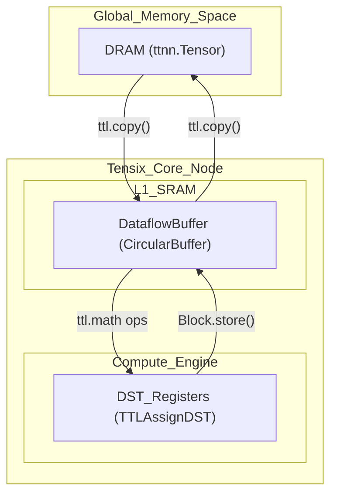
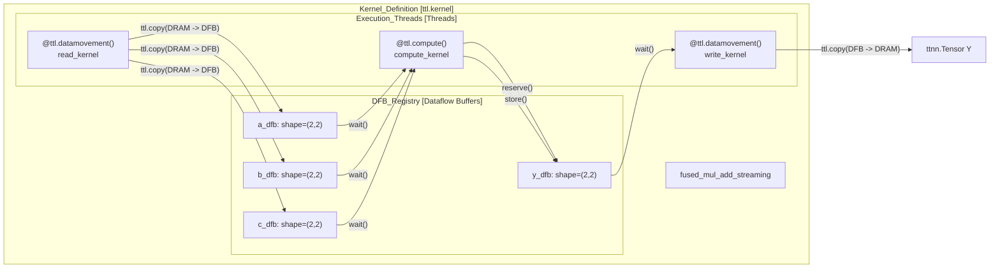
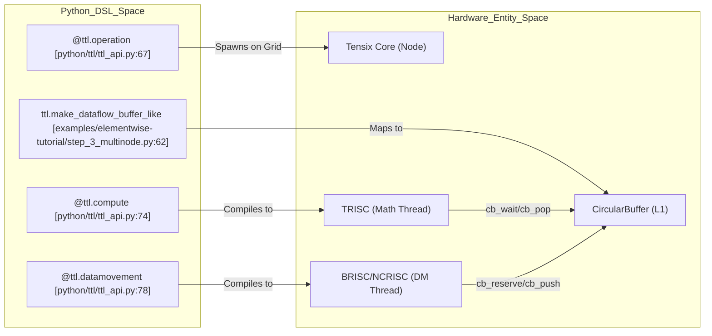

# Core Concepts

Relevant source files
*   [docs/sphinx/specs/TTLangSpecification.md](https://github.com/tenstorrent/tt-lang/blob/d76e6233/docs/sphinx/specs/TTLangSpecification.md?plain=1)
*   [examples/elementwise-tutorial/step_0_ttnn_base.py](https://github.com/tenstorrent/tt-lang/blob/d76e6233/examples/elementwise-tutorial/step_0_ttnn_base.py)
*   [examples/elementwise-tutorial/step_1_single_node_single_tile_block.py](https://github.com/tenstorrent/tt-lang/blob/d76e6233/examples/elementwise-tutorial/step_1_single_node_single_tile_block.py)
*   [examples/elementwise-tutorial/step_2_single_node_multitile_block.py](https://github.com/tenstorrent/tt-lang/blob/d76e6233/examples/elementwise-tutorial/step_2_single_node_multitile_block.py)
*   [examples/elementwise-tutorial/step_3_multinode.py](https://github.com/tenstorrent/tt-lang/blob/d76e6233/examples/elementwise-tutorial/step_3_multinode.py)
*   [include/ttlang/Dialect/TTL/Passes.td](https://github.com/tenstorrent/tt-lang/blob/d76e6233/include/ttlang/Dialect/TTL/Passes.td)
*   [include/ttlang/Dialect/TTL/Transforms/DFBMaterialization.h](https://github.com/tenstorrent/tt-lang/blob/d76e6233/include/ttlang/Dialect/TTL/Transforms/DFBMaterialization.h)
*   [lib/Dialect/TTL/Pipelines/TTLPipelines.cpp](https://github.com/tenstorrent/tt-lang/blob/d76e6233/lib/Dialect/TTL/Pipelines/TTLPipelines.cpp)
*   [lib/Dialect/TTL/Transforms/CMakeLists.txt](https://github.com/tenstorrent/tt-lang/blob/d76e6233/lib/Dialect/TTL/Transforms/CMakeLists.txt)
*   [lib/Dialect/TTL/Transforms/DFBMaterialization.cpp](https://github.com/tenstorrent/tt-lang/blob/d76e6233/lib/Dialect/TTL/Transforms/DFBMaterialization.cpp)
*   [lib/Dialect/TTL/Transforms/TTLInsertIntermediateDFBs.cpp](https://github.com/tenstorrent/tt-lang/blob/d76e6233/lib/Dialect/TTL/Transforms/TTLInsertIntermediateDFBs.cpp)
*   [python/pykernel/_src/kernel_ast.py](https://github.com/tenstorrent/tt-lang/blob/d76e6233/python/pykernel/_src/kernel_ast.py)
*   [python/ttl/_src/ttl_ast.py](https://github.com/tenstorrent/tt-lang/blob/d76e6233/python/ttl/_src/ttl_ast.py)
*   [python/ttl/ttl_api.py](https://github.com/tenstorrent/tt-lang/blob/d76e6233/python/ttl/ttl_api.py)
*   [test/me2e/builder/pipeline.py](https://github.com/tenstorrent/tt-lang/blob/d76e6233/test/me2e/builder/pipeline.py)
*   [test/python/invalid/invalid_reduce_scalar_undefined.py](https://github.com/tenstorrent/tt-lang/blob/d76e6233/test/python/invalid/invalid_reduce_scalar_undefined.py)
*   [test/python/simple_reduce_scalar.py](https://github.com/tenstorrent/tt-lang/blob/d76e6233/test/python/simple_reduce_scalar.py)

This page explains the fundamental concepts of the tt-lang programming model. tt-lang is a Python-based **Domain Specific Language (DSL)** designed to express kernel programs for Tenstorrent hardware [docs/sphinx/specs/TTLangSpecification.md 52-54](https://github.com/tenstorrent/tt-lang/blob/d76e6233/docs/sphinx/specs/TTLangSpecification.md?plain=1#L52-L54) It sits between high-level libraries like TT-NN and low-level kernel programming in C++ (TT-Metalium), providing explicit control over data movement and compute threads [docs/sphinx/specs/TTLangSpecification.md 54-56](https://github.com/tenstorrent/tt-lang/blob/d76e6233/docs/sphinx/specs/TTLangSpecification.md?plain=1#L54-L56)

## Python DSL Fundamentals

The programming model is centered around explicit specification of data movement and compute threads. An **Operation Function** is a Python function decorated with `@ttl.operation`[docs/sphinx/specs/TTLangSpecification.md 59-61](https://github.com/tenstorrent/tt-lang/blob/d76e6233/docs/sphinx/specs/TTLangSpecification.md?plain=1#L59-L61) Inside this function, programmers define thread functions using `@ttl.compute` or `@ttl.datamovement` decorators [docs/sphinx/specs/TTLangSpecification.md 60-61](https://github.com/tenstorrent/tt-lang/blob/d76e6233/docs/sphinx/specs/TTLangSpecification.md?plain=1#L60-L61)

### Thread Architecture

The DSL maps to the underlying Tensix core architecture, which consists of specialized RISC processors:

*   **MATH (TRISC):** Handles tile-based arithmetic operations on the FPU/SFPU. Defined via `@ttl.compute()`[docs/sphinx/specs/TTLangSpecification.md 73-75](https://github.com/tenstorrent/tt-lang/blob/d76e6233/docs/sphinx/specs/TTLangSpecification.md?plain=1#L73-L75)
*   **Data Movement (BRISC / NCRISC):** Handle data movement between L1 memory and DRAM/NOC. Defined via `@ttl.datamovement()`[docs/sphinx/specs/TTLangSpecification.md 77-83](https://github.com/tenstorrent/tt-lang/blob/d76e6233/docs/sphinx/specs/TTLangSpecification.md?plain=1#L77-L83)

For details, see [Python DSL Fundamentals](https://deepwiki.com/tenstorrent/tt-lang/2.1-python-dsl-fundamentals).

**Sources:**[docs/sphinx/specs/TTLangSpecification.md 59-83](https://github.com/tenstorrent/tt-lang/blob/d76e6233/docs/sphinx/specs/TTLangSpecification.md?plain=1#L59-L83)[python/ttl/ttl_api.py 100-118](https://github.com/tenstorrent/tt-lang/blob/d76e6233/python/ttl/ttl_api.py#L100-L118)

* * *

## Data Structures

tt-lang introduces high-level abstractions to manage the complexity of tensor memory layouts and hardware communication.

### Dataflow Buffer (DFB)

A **Dataflow Buffer** (formerly referred to as a Circular Buffer) is the primary synchronization primitive for inter-thread communication on a core [docs/sphinx/specs/TTLangSpecification.md 36-38](https://github.com/tenstorrent/tt-lang/blob/d76e6233/docs/sphinx/specs/TTLangSpecification.md?plain=1#L36-L38) It manages L1 memory and coordinates producers and consumers through `reserve`/`push` and `wait`/`pop` semantics [docs/sphinx/specs/TTLangSpecification.md 38-39](https://github.com/tenstorrent/tt-lang/blob/d76e6233/docs/sphinx/specs/TTLangSpecification.md?plain=1#L38-L39) The compiler can also insert implicit intermediate DFBs at fusion split points to satisfy compute requirements [lib/Dialect/TTL/Transforms/TTLInsertIntermediateDFBs.cpp 9-13](https://github.com/tenstorrent/tt-lang/blob/d76e6233/lib/Dialect/TTL/Transforms/TTLInsertIntermediateDFBs.cpp#L9-L13)

### Blocks and Tiles

*   **Tile:** The fundamental unit of computation, typically a 32x32 matrix [python/ttl/_src/ttl_ast.py 105-107](https://github.com/tenstorrent/tt-lang/blob/d76e6233/python/ttl/_src/ttl_ast.py#L105-L107)
*   **Block:** A `ttl.Block` represents a group of tiles held in L1 memory (within a DFB) [docs/sphinx/specs/TTLangSpecification.md 10-11](https://github.com/tenstorrent/tt-lang/blob/d76e6233/docs/sphinx/specs/TTLangSpecification.md?plain=1#L10-L11) It supports operations like `broadcast`, `transpose`, and `squeeze`[docs/sphinx/specs/TTLangSpecification.md 48-49](https://github.com/tenstorrent/tt-lang/blob/d76e6233/docs/sphinx/specs/TTLangSpecification.md?plain=1#L48-L49)

### Pipes and PipeNets

A **Pipe** defines a communication path between a source and one or more destinations, abstracting the underlying NOC or TT-Fabric transfers [docs/sphinx/specs/TTLangSpecification.md 12-13](https://github.com/tenstorrent/tt-lang/blob/d76e6233/docs/sphinx/specs/TTLangSpecification.md?plain=1#L12-L13)**PipeNet** describes logical communication patterns (unicast or multicast) and allows for predicates like `is_src()`, `is_dst()`, and `is_active()` to guard node-specific work [python/ttl/_src/ttl_ast.py 175-193](https://github.com/tenstorrent/tt-lang/blob/d76e6233/python/ttl/_src/ttl_ast.py#L175-L193)

For details, see [Data Structures](https://deepwiki.com/tenstorrent/tt-lang/2.2-data-structures).

**Sources:**[docs/sphinx/specs/TTLangSpecification.md 10-49](https://github.com/tenstorrent/tt-lang/blob/d76e6233/docs/sphinx/specs/TTLangSpecification.md?plain=1#L10-L49)[lib/Dialect/TTL/Transforms/TTLInsertIntermediateDFBs.cpp 9-13](https://github.com/tenstorrent/tt-lang/blob/d76e6233/lib/Dialect/TTL/Transforms/TTLInsertIntermediateDFBs.cpp#L9-L13)[python/ttl/_src/ttl_ast.py 105-193](https://github.com/tenstorrent/tt-lang/blob/d76e6233/python/ttl/_src/ttl_ast.py#L105-L193)

* * *

## Memory Architecture

tt-lang exposes a three-tier memory hierarchy that requires explicit management for maximum performance.

### Memory Hierarchy Mapping

1.   **DRAM:** Off-chip memory where `ttnn.Tensor` objects reside [docs/sphinx/specs/TTLangSpecification.md 68-69](https://github.com/tenstorrent/tt-lang/blob/d76e6233/docs/sphinx/specs/TTLangSpecification.md?plain=1#L68-L69)
2.   **L1 SRAM:** On-chip local memory (per core). Data is staged here in **Dataflow Buffers**[docs/sphinx/specs/TTLangSpecification.md 56-57](https://github.com/tenstorrent/tt-lang/blob/d76e6233/docs/sphinx/specs/TTLangSpecification.md?plain=1#L56-L57)
3.   **DST Registers:** The compute register file where tile math occurs. Data is moved from L1 to DST implicitly during compute operations. The compiler manages these registers via linear scan allocation and in-place merging [lib/Dialect/TTL/Transforms/CMakeLists.txt 26](https://github.com/tenstorrent/tt-lang/blob/d76e6233/lib/Dialect/TTL/Transforms/CMakeLists.txt#L26-L26)

### Data Flow Diagram

For details, see [Memory Architecture](https://deepwiki.com/tenstorrent/tt-lang/2.3-memory-architecture).

**Sources:**[docs/sphinx/specs/TTLangSpecification.md 56-69](https://github.com/tenstorrent/tt-lang/blob/d76e6233/docs/sphinx/specs/TTLangSpecification.md?plain=1#L56-L69)[lib/Dialect/TTL/Transforms/CMakeLists.txt 26](https://github.com/tenstorrent/tt-lang/blob/d76e6233/lib/Dialect/TTL/Transforms/CMakeLists.txt#L26-L26)[lib/Dialect/TTL/Transforms/TTLAssignDST.cpp 1-30](https://github.com/tenstorrent/tt-lang/blob/d76e6233/lib/Dialect/TTL/Transforms/TTLAssignDST.cpp#L1-L30)

* * *


```mermaid
graph TB
    subgraph "Profiler Data Source"
        [profile_log_device.csv] --> ["Device profiler output<br/>ZONE_START/ZONE_END pairs"]
        [CSV Header] --> ["CHIP_FREQ[MHz]<br/>Core coordinates"]
    end
    
    subgraph "Trace Conversion"
        Parser["csv_to_trace_events()"]
        Filter["Filter Wrapper Zones<br/>_WRAPPER_ZONES<br/>BRISC-FW, TRISC-KERNEL, etc"]
        Normalize["Normalize Timestamps<br/>Start at 0"]
        Events["Chrome Trace Events<br/>{name, cat, ph:X, ts, dur, pid, tid}"]
    end
    
    subgraph "HTTP Server"
        Handler["_TraceHandler<br/>BaseHTTPRequestHandler"]
        Landing["Landing Page<br/>_LANDING_HTML<br/>Fetch + postMessage"]
        TraceJSON["trace.json<br/>Cached in memory"]
    end
    
    subgraph "Client Browser"
        OpenPage["Open http://localhost:PORT"]
        FetchTrace["Fetch /trace.json"]
        OpenPerfetto["Open Perfetto UI<br/>ui.perfetto.dev"]
        PostMessage["postMessage to Perfetto<br/>with ArrayBuffer"]
    end
    
    Parser --> Filter
    Filter --> Normalize
    Normalize --> Events
    Events --> TraceJSON
    
    TraceJSON --> Handler
    Landing --> Handler
    
    Handler --> OpenPage
    OpenPage --> Landing
    Landing --> FetchTrace
    FetchTrace --> TraceJSON
    Landing --> OpenPerfetto
    OpenPerfetto --> PostMessage
    PostMessage --> TraceJSON
```




For details, see [Memory Architecture](#2.3).
```
## Execution Model

### Grid and Nodes

A **Grid** defines the space of nodes (Tensix Cores) to which the operation is submitted [docs/sphinx/specs/TTLangSpecification.md 99-101](https://github.com/tenstorrent/tt-lang/blob/d76e6233/docs/sphinx/specs/TTLangSpecification.md?plain=1#L99-L101) Kernels use `ttl.grid_size()` to determine total execution bounds and `ttl.node()` to determine their logical coordinates [docs/sphinx/specs/TTLangSpecification.md 43-113](https://github.com/tenstorrent/tt-lang/blob/d76e6233/docs/sphinx/specs/TTLangSpecification.md?plain=1#L43-L113)

### Single-core vs. Multi-core

*   **Single-core:** Focuses on the synchronization between MATH and Data Movement threads using DFB `reserve`/`push` (producer) and `wait`/`pop` (consumer) calls [docs/sphinx/specs/TTLangSpecification.md 38-39](https://github.com/tenstorrent/tt-lang/blob/d76e6233/docs/sphinx/specs/TTLangSpecification.md?plain=1#L38-L39)
*   **Multi-core:** Involves partitioning tensors across a grid, often using Single-Program-Multiple-Data (SPMD) mode [docs/sphinx/specs/TTLangSpecification.md 101-102](https://github.com/tenstorrent/tt-lang/blob/d76e6233/docs/sphinx/specs/TTLangSpecification.md?plain=1#L101-L102) Multi-core execution can be configured using TT-NN Mesh Devices for multi-chip grids [docs/sphinx/specs/TTLangSpecification.md 101-102](https://github.com/tenstorrent/tt-lang/blob/d76e6233/docs/sphinx/specs/TTLangSpecification.md?plain=1#L101-L102)

### Code Entity Relationship Diagram






For details, see [Execution Model](#2.4).
```

For details, see [Execution Model](https://deepwiki.com/tenstorrent/tt-lang/2.4-execution-model).

**Sources:**[docs/sphinx/specs/TTLangSpecification.md 38-113](https://github.com/tenstorrent/tt-lang/blob/d76e6233/docs/sphinx/specs/TTLangSpecification.md?plain=1#L38-L113)[python/ttl/ttl_api.py 67-78](https://github.com/tenstorrent/tt-lang/blob/d76e6233/python/ttl/ttl_api.py#L67-L78)[examples/elementwise-tutorial/step_3_multinode.py 62-73](https://github.com/tenstorrent/tt-lang/blob/d76e6233/examples/elementwise-tutorial/step_3_multinode.py#L62-L73)

Dismiss
Refresh this wiki

Enter email to refresh
