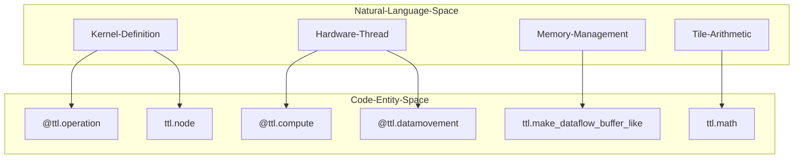
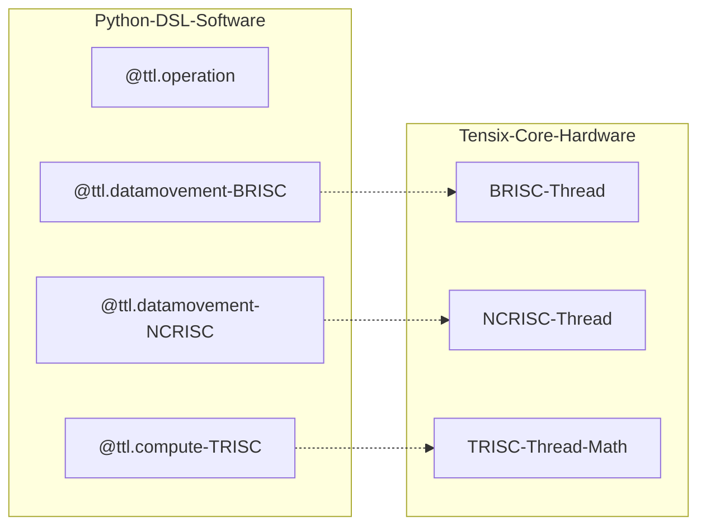

# Python DSL Fundamentals

Relevant source files
*   [docs/sphinx/specs/TTLangSpecification.md](https://github.com/tenstorrent/tt-lang/blob/d76e6233/docs/sphinx/specs/TTLangSpecification.md?plain=1)
*   [examples/elementwise-tutorial/step_0_ttnn_base.py](https://github.com/tenstorrent/tt-lang/blob/d76e6233/examples/elementwise-tutorial/step_0_ttnn_base.py)
*   [examples/elementwise-tutorial/step_1_single_node_single_tile_block.py](https://github.com/tenstorrent/tt-lang/blob/d76e6233/examples/elementwise-tutorial/step_1_single_node_single_tile_block.py)
*   [examples/elementwise-tutorial/step_2_single_node_multitile_block.py](https://github.com/tenstorrent/tt-lang/blob/d76e6233/examples/elementwise-tutorial/step_2_single_node_multitile_block.py)
*   [examples/elementwise-tutorial/step_3_multinode.py](https://github.com/tenstorrent/tt-lang/blob/d76e6233/examples/elementwise-tutorial/step_3_multinode.py)
*   [include/ttlang/Dialect/TTL/Passes.td](https://github.com/tenstorrent/tt-lang/blob/d76e6233/include/ttlang/Dialect/TTL/Passes.td)
*   [include/ttlang/Dialect/TTL/Transforms/DFBMaterialization.h](https://github.com/tenstorrent/tt-lang/blob/d76e6233/include/ttlang/Dialect/TTL/Transforms/DFBMaterialization.h)
*   [lib/Dialect/TTL/Pipelines/TTLPipelines.cpp](https://github.com/tenstorrent/tt-lang/blob/d76e6233/lib/Dialect/TTL/Pipelines/TTLPipelines.cpp)
*   [lib/Dialect/TTL/Transforms/CMakeLists.txt](https://github.com/tenstorrent/tt-lang/blob/d76e6233/lib/Dialect/TTL/Transforms/CMakeLists.txt)
*   [lib/Dialect/TTL/Transforms/DFBMaterialization.cpp](https://github.com/tenstorrent/tt-lang/blob/d76e6233/lib/Dialect/TTL/Transforms/DFBMaterialization.cpp)
*   [lib/Dialect/TTL/Transforms/TTLInsertIntermediateDFBs.cpp](https://github.com/tenstorrent/tt-lang/blob/d76e6233/lib/Dialect/TTL/Transforms/TTLInsertIntermediateDFBs.cpp)
*   [python/pykernel/_src/kernel_ast.py](https://github.com/tenstorrent/tt-lang/blob/d76e6233/python/pykernel/_src/kernel_ast.py)
*   [python/ttl/_src/ttl_ast.py](https://github.com/tenstorrent/tt-lang/blob/d76e6233/python/ttl/_src/ttl_ast.py)
*   [python/ttl/ttl_api.py](https://github.com/tenstorrent/tt-lang/blob/d76e6233/python/ttl/ttl_api.py)
*   [test/me2e/builder/pipeline.py](https://github.com/tenstorrent/tt-lang/blob/d76e6233/test/me2e/builder/pipeline.py)
*   [test/python/invalid/invalid_reduce_scalar_undefined.py](https://github.com/tenstorrent/tt-lang/blob/d76e6233/test/python/invalid/invalid_reduce_scalar_undefined.py)
*   [test/python/simple_reduce_scalar.py](https://github.com/tenstorrent/tt-lang/blob/d76e6233/test/python/simple_reduce_scalar.py)

## Purpose and Scope

This page introduces the Python Domain-Specific Language (DSL) provided by `tt-lang` for defining kernels that execute on Tenstorrent hardware. The DSL is positioned between high-level TT-NN and low-level TT-Metalium, allowing users to express computation and dataflow kernels separately with explicit synchronization [docs/sphinx/specs/TTLangSpecification.md 53-57](https://github.com/tenstorrent/tt-lang/blob/d76e6233/docs/sphinx/specs/TTLangSpecification.md?plain=1#L53-L57) The DSL is accessible through the `ttl` namespace and consists of decorators, data structures, and operations that allow expressing data movement and computation patterns in Python.

The `tt-lang` compiler translates this Python AST into the `TTL` MLIR dialect, which then undergoes a series of transformations to generate optimized C++ code for the Tensix processors [python/ttl/_src/ttl_ast.py 128-130](https://github.com/tenstorrent/tt-lang/blob/d76e6233/python/ttl/_src/ttl_ast.py#L128-L130)

This page covers the fundamental structure and available constructs. For detailed information about specific aspects, see:

*   [Kernel Definition with Decorators](https://deepwiki.com/tenstorrent/tt-lang/2.1.1-kernel-definition-with-decorators) — Explain `@ttl.operation` decorator, grid specification, and kernel function structure.
*   [Compute vs Data Movement Threads](https://deepwiki.com/tenstorrent/tt-lang/2.1.2-compute-vs-data-movement-threads) — Describe the three-thread architecture (MATH, BRISC, NCRISC) and their roles.
*   [Dataflow Buffers](https://deepwiki.com/tenstorrent/tt-lang/2.1.3-dataflow-buffers) — Explain DFB creation, lifecycle (reserve/wait/push/pop), `block_count`, and producer-consumer semantics.

* * *

## The ttl Namespace

The `tt-lang` DSL is organized under the `ttl` namespace, which provides all the constructs needed to define kernels. It acts as the primary interface for the `TTLGenericCompiler` to translate Python AST into MLIR [python/ttl/_src/ttl_ast.py 128-130](https://github.com/tenstorrent/tt-lang/blob/d76e6233/python/ttl/_src/ttl_ast.py#L128-L130) Note that in recent specification versions, `@ttl.kernel` has been renamed to `@ttl.operation`[docs/sphinx/specs/TTLangSpecification.md 45](https://github.com/tenstorrent/tt-lang/blob/d76e6233/docs/sphinx/specs/TTLangSpecification.md?plain=1#L45-L45)

### DSL Architecture Mapping

The following diagram maps natural language concepts to the specific code entities defined in the `ttl` namespace.

**Diagram: DSL Entity Mapping**

Sources: [python/ttl/ttl_api.py 5-107](https://github.com/tenstorrent/tt-lang/blob/d76e6233/python/ttl/ttl_api.py#L5-L107)[docs/sphinx/specs/TTLangSpecification.md 60-62](https://github.com/tenstorrent/tt-lang/blob/d76e6233/docs/sphinx/specs/TTLangSpecification.md?plain=1#L60-L62)[docs/sphinx/specs/TTLangSpecification.md 45](https://github.com/tenstorrent/tt-lang/blob/d76e6233/docs/sphinx/specs/TTLangSpecification.md?plain=1#L45-L45)



Sources: [python/ttl/ttl_api.py:5-107](), [docs/sphinx/specs/TTLangSpecification.md:60-62](), [docs/sphinx/specs/TTLangSpecification.md:45-45]()
```
### Core API Categories

The `ttl` namespace is implemented in `python/ttl/ttl_api.py` and defines the core API for the Python DSL [python/ttl/ttl_api.py 5-6](https://github.com/tenstorrent/tt-lang/blob/d76e6233/python/ttl/ttl_api.py#L5-L6)

| Category | Constructs | Purpose |
| --- | --- | --- |
| **Decorators** | `@ttl.operation`, `@ttl.compute`, `@ttl.datamovement` | Define kernel entry and specific RISC thread roles [docs/sphinx/specs/TTLangSpecification.md 60-62](https://github.com/tenstorrent/tt-lang/blob/d76e6233/docs/sphinx/specs/TTLangSpecification.md?plain=1#L60-L62) |
| **Execution Context** | `ttl.node()`, `ttl.grid_size()` | Query core coordinates and grid dimensions during execution [docs/sphinx/specs/TTLangSpecification.md 105-114](https://github.com/tenstorrent/tt-lang/blob/d76e6233/docs/sphinx/specs/TTLangSpecification.md?plain=1#L105-L114) |
| **Data Structures** | `TensorBlock`, `DataflowBuffer`, `Pipe` | Manage memory blocks, synchronization, and communication [python/ttl/ttl_api.py 69-77](https://github.com/tenstorrent/tt-lang/blob/d76e6233/python/ttl/ttl_api.py#L69-L77) |
| **Operations** | `ttl.copy()`, `ttl.signpost()` | Perform data movement and insert profiling markers [python/ttl/ttl_api.py 96](https://github.com/tenstorrent/tt-lang/blob/d76e6233/python/ttl/ttl_api.py#L96-L96)[docs/sphinx/specs/TTLangSpecification.md 41](https://github.com/tenstorrent/tt-lang/blob/d76e6233/docs/sphinx/specs/TTLangSpecification.md?plain=1#L41-L41) |
| **Math Operations** | `ttl.math.add()`, `ttl.math.matmul()` | Perform tile-based arithmetic on the SFPU/FPU [docs/sphinx/specs/TTLangSpecification.md 46](https://github.com/tenstorrent/tt-lang/blob/d76e6233/docs/sphinx/specs/TTLangSpecification.md?plain=1#L46-L46) |

**Sources:**

*   [python/ttl/ttl_api.py 5-107](https://github.com/tenstorrent/tt-lang/blob/d76e6233/python/ttl/ttl_api.py#L5-L107)
*   [docs/sphinx/specs/TTLangSpecification.md 45-114](https://github.com/tenstorrent/tt-lang/blob/d76e6233/docs/sphinx/specs/TTLangSpecification.md?plain=1#L45-L114)
*   [python/ttl/dataflow_buffer.py 72-74](https://github.com/tenstorrent/tt-lang/blob/d76e6233/python/ttl/dataflow_buffer.py#L72-L74)

* * *

## Kernel Structure Pattern

`tt-lang` kernels follow a hierarchical structure where an outer `@ttl.operation` decorator wraps a function containing inner thread functions decorated with `@ttl.compute` or `@ttl.datamovement`[docs/sphinx/specs/TTLangSpecification.md 60-62](https://github.com/tenstorrent/tt-lang/blob/d76e6233/docs/sphinx/specs/TTLangSpecification.md?plain=1#L60-L62) The compiler tracks these inner functions via a thread registry to assign them to physical RISC cores [python/ttl/ttl_api.py 98-116](https://github.com/tenstorrent/tt-lang/blob/d76e6233/python/ttl/ttl_api.py#L98-L116)

**Diagram: Hardware-Software Thread Association**

Sources: [python/ttl/ttl_api.py 98-116](https://github.com/tenstorrent/tt-lang/blob/d76e6233/python/ttl/ttl_api.py#L98-L116)[docs/sphinx/specs/TTLangSpecification.md 60-84](https://github.com/tenstorrent/tt-lang/blob/d76e6233/docs/sphinx/specs/TTLangSpecification.md?plain=1#L60-L84)



Sources: [python/ttl/ttl_api.py:98-116](), [docs/sphinx/specs/TTLangSpecification.md:60-84]()
```
### Structure Components

1.   **Operation Declaration**: The outermost function decorated with `@ttl.operation` accepts `ttnn.Tensor` arguments. It defines the grid of Tensix cores to which the work is distributed [docs/sphinx/specs/TTLangSpecification.md 60-71](https://github.com/tenstorrent/tt-lang/blob/d76e6233/docs/sphinx/specs/TTLangSpecification.md?plain=1#L60-L71)
2.   **Operation Body Setup**: Contains definitions of thread functions and local `DataflowBuffer` objects created via `ttl.make_dataflow_buffer_like()` for L1 scratchpad management [examples/elementwise-tutorial/step_3_multinode.py 62-73](https://github.com/tenstorrent/tt-lang/blob/d76e6233/examples/elementwise-tutorial/step_3_multinode.py#L62-L73)
3.   **Thread Functions**: Inner functions annotated by `@ttl.compute` or `@ttl.datamovement`. These map to the physical RISC processors (BRISC, NCRISC, TRISC) on the hardware [docs/sphinx/specs/TTLangSpecification.md 74-84](https://github.com/tenstorrent/tt-lang/blob/d76e6233/docs/sphinx/specs/TTLangSpecification.md?plain=1#L74-L84)

**Example structure (based on tutorial):**

**Sources:**

*   [python/ttl/ttl_api.py 98-116](https://github.com/tenstorrent/tt-lang/blob/d76e6233/python/ttl/ttl_api.py#L98-L116)
*   [docs/sphinx/specs/TTLangSpecification.md 60-84](https://github.com/tenstorrent/tt-lang/blob/d76e6233/docs/sphinx/specs/TTLangSpecification.md?plain=1#L60-L84)
*   [examples/elementwise-tutorial/step_3_multinode.py 44-91](https://github.com/tenstorrent/tt-lang/blob/d76e6233/examples/elementwise-tutorial/step_3_multinode.py#L44-L91)

* * *

## Core DSL Constructs

### Execution Context

*   **`ttl.grid_size(dims)`**: Returns the dimensions of the core grid allocated for this operation [docs/sphinx/specs/TTLangSpecification.md 105-114](https://github.com/tenstorrent/tt-lang/blob/d76e6233/docs/sphinx/specs/TTLangSpecification.md?plain=1#L105-L114)
*   **`ttl.node(dims)`**: Returns the coordinates of the Tensix core currently executing the code [docs/sphinx/specs/TTLangSpecification.md 43](https://github.com/tenstorrent/tt-lang/blob/d76e6233/docs/sphinx/specs/TTLangSpecification.md?plain=1#L43-L43)

### Data Structures & Memory

*   **`TensorBlock`**: A logical view of a tensor slice, used for targeted data movement [python/ttl/operators.py 96](https://github.com/tenstorrent/tt-lang/blob/d76e6233/python/ttl/operators.py#L96-L96)
*   **`DataflowBuffer` (DFB)**: Manages L1 memory slots and synchronization between threads. It uses a producer-consumer model with `reserve()`/`push()` and `wait()`/`pop()`[docs/sphinx/specs/TTLangSpecification.md 36-39](https://github.com/tenstorrent/tt-lang/blob/d76e6233/docs/sphinx/specs/TTLangSpecification.md?plain=1#L36-L39)
*   **`ttl.copy(src, dst)`**: High-level API for moving data between DRAM, L1, and other cores [python/ttl/ttl_api.py 96](https://github.com/tenstorrent/tt-lang/blob/d76e6233/python/ttl/ttl_api.py#L96-L96)
*   **Automatic Synchronization**: The MLIR pipeline includes passes like `ttl-insert-cb-sync` and `ttl-insert-copy-wait` that can automatically insert missing synchronization calls to simplify user code [lib/Dialect/TTL/Pipelines/TTLPipelines.cpp 26-27](https://github.com/tenstorrent/tt-lang/blob/d76e6233/lib/Dialect/TTL/Pipelines/TTLPipelines.cpp#L26-L27)[include/ttlang/Dialect/TTL/Passes.td 6-23](https://github.com/tenstorrent/tt-lang/blob/d76e6233/include/ttlang/Dialect/TTL/Passes.td#L6-L23)

### Profiling

*   **`ttl.signpost(name)`**: Inserts a named marker into the instruction stream, which is visible in performance traces for cycle-accurate analysis [docs/sphinx/specs/TTLangSpecification.md 41](https://github.com/tenstorrent/tt-lang/blob/d76e6233/docs/sphinx/specs/TTLangSpecification.md?plain=1#L41-L41)

**Sources:**

*   [docs/sphinx/specs/TTLangSpecification.md 36-114](https://github.com/tenstorrent/tt-lang/blob/d76e6233/docs/sphinx/specs/TTLangSpecification.md?plain=1#L36-L114)
*   [python/ttl/ttl_api.py 69-77](https://github.com/tenstorrent/tt-lang/blob/d76e6233/python/ttl/ttl_api.py#L69-L77)
*   [include/ttlang/Dialect/TTL/Passes.td 6-118](https://github.com/tenstorrent/tt-lang/blob/d76e6233/include/ttlang/Dialect/TTL/Passes.td#L6-L118)
*   [lib/Dialect/TTL/Pipelines/TTLPipelines.cpp 19-81](https://github.com/tenstorrent/tt-lang/blob/d76e6233/lib/Dialect/TTL/Pipelines/TTLPipelines.cpp#L19-L81)

* * *

## Summary of Child Pages

For deep dives into these fundamentals, refer to:

*   **[Kernel Definition with Decorators](https://deepwiki.com/tenstorrent/tt-lang/2.1.1-kernel-definition-with-decorators)**: Detailed usage of `@ttl.operation`, grid specifications (supporting 2D and multi-chip modes), and tensor argument handling [docs/sphinx/specs/TTLangSpecification.md 60-102](https://github.com/tenstorrent/tt-lang/blob/d76e6233/docs/sphinx/specs/TTLangSpecification.md?plain=1#L60-L102)
*   **[Compute vs Data Movement Threads](https://deepwiki.com/tenstorrent/tt-lang/2.1.2-compute-vs-data-movement-threads)**: Understanding how `@ttl.compute` and `@ttl.datamovement` map to physical hardware threads (TRISC vs BRISC/NCRISC) [docs/sphinx/specs/TTLangSpecification.md 74-84](https://github.com/tenstorrent/tt-lang/blob/d76e6233/docs/sphinx/specs/TTLangSpecification.md?plain=1#L74-L84)
*   **[Dataflow Buffers](https://deepwiki.com/tenstorrent/tt-lang/2.1.3-dataflow-buffers)**: Comprehensive guide to DFB lifecycles, `block_count` (double-buffering), and hardware mapping to Circular Buffers [docs/sphinx/specs/TTLangSpecification.md 36-39](https://github.com/tenstorrent/tt-lang/blob/d76e6233/docs/sphinx/specs/TTLangSpecification.md?plain=1#L36-L39)[include/ttlang/Dialect/TTL/Passes.td 28-106](https://github.com/tenstorrent/tt-lang/blob/d76e6233/include/ttlang/Dialect/TTL/Passes.td#L28-L106)

**Sources:**

*   [python/ttl/ttl_api.py 98-116](https://github.com/tenstorrent/tt-lang/blob/d76e6233/python/ttl/ttl_api.py#L98-L116)
*   [docs/sphinx/specs/TTLangSpecification.md 60-114](https://github.com/tenstorrent/tt-lang/blob/d76e6233/docs/sphinx/specs/TTLangSpecification.md?plain=1#L60-L114)
*   [python/ttl/dataflow_buffer.py 72-74](https://github.com/tenstorrent/tt-lang/blob/d76e6233/python/ttl/dataflow_buffer.py#L72-L74)

Dismiss
Refresh this wiki

Enter email to refresh
