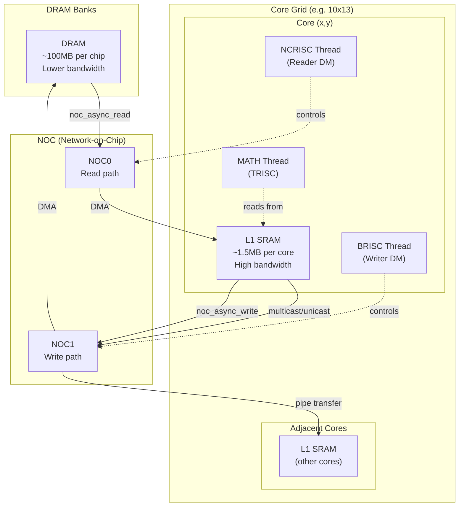
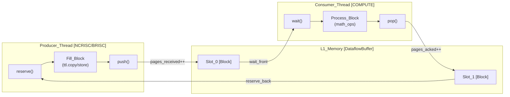
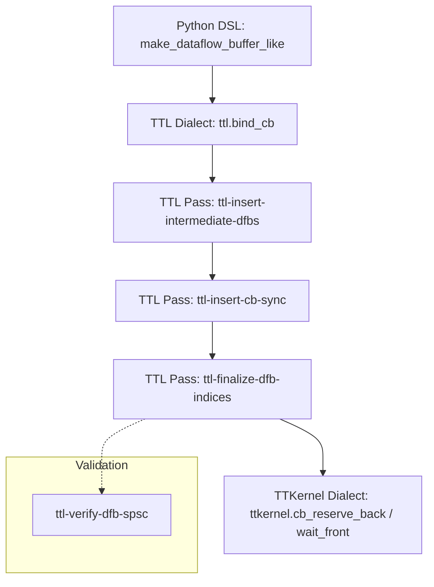

# Dataflow Buffers

Relevant source files
*   [docs/development/DFBManagement.md](https://github.com/tenstorrent/tt-lang/blob/d76e6233/docs/development/DFBManagement.md?plain=1)
*   [docs/sphinx/specs/TTLangSpecification.md](https://github.com/tenstorrent/tt-lang/blob/d76e6233/docs/sphinx/specs/TTLangSpecification.md?plain=1)
*   [docs/sphinx/specs/c-reserve-push.png](https://github.com/tenstorrent/tt-lang/blob/d76e6233/docs/sphinx/specs/c-reserve-push.png)
*   [docs/sphinx/specs/c-wait-pop.png](https://github.com/tenstorrent/tt-lang/blob/d76e6233/docs/sphinx/specs/c-wait-pop.png)
*   [docs/sphinx/specs/dm-reserve-push.png](https://github.com/tenstorrent/tt-lang/blob/d76e6233/docs/sphinx/specs/dm-reserve-push.png)
*   [docs/sphinx/specs/dm-wait-pop.png](https://github.com/tenstorrent/tt-lang/blob/d76e6233/docs/sphinx/specs/dm-wait-pop.png)
*   [examples/elementwise-tutorial/step_0_ttnn_base.py](https://github.com/tenstorrent/tt-lang/blob/d76e6233/examples/elementwise-tutorial/step_0_ttnn_base.py)
*   [examples/elementwise-tutorial/step_1_single_node_single_tile_block.py](https://github.com/tenstorrent/tt-lang/blob/d76e6233/examples/elementwise-tutorial/step_1_single_node_single_tile_block.py)
*   [examples/elementwise-tutorial/step_2_single_node_multitile_block.py](https://github.com/tenstorrent/tt-lang/blob/d76e6233/examples/elementwise-tutorial/step_2_single_node_multitile_block.py)
*   [examples/elementwise-tutorial/step_3_multinode.py](https://github.com/tenstorrent/tt-lang/blob/d76e6233/examples/elementwise-tutorial/step_3_multinode.py)
*   [include/ttlang/Dialect/TTL/Transforms/DFBMaterialization.h](https://github.com/tenstorrent/tt-lang/blob/d76e6233/include/ttlang/Dialect/TTL/Transforms/DFBMaterialization.h)
*   [lib/Dialect/TTL/Transforms/DFBMaterialization.cpp](https://github.com/tenstorrent/tt-lang/blob/d76e6233/lib/Dialect/TTL/Transforms/DFBMaterialization.cpp)
*   [lib/Dialect/TTL/Transforms/TTLInsertIntermediateDFBs.cpp](https://github.com/tenstorrent/tt-lang/blob/d76e6233/lib/Dialect/TTL/Transforms/TTLInsertIntermediateDFBs.cpp)
*   [lib/Dialect/TTL/Transforms/TTLVerifyDFBSPSC.cpp](https://github.com/tenstorrent/tt-lang/blob/d76e6233/lib/Dialect/TTL/Transforms/TTLVerifyDFBSPSC.cpp)
*   [python/pykernel/_src/kernel_ast.py](https://github.com/tenstorrent/tt-lang/blob/d76e6233/python/pykernel/_src/kernel_ast.py)
*   [test/python/invalid/invalid_reduce_scalar_undefined.py](https://github.com/tenstorrent/tt-lang/blob/d76e6233/test/python/invalid/invalid_reduce_scalar_undefined.py)
*   [test/python/simple_reduce_scalar.py](https://github.com/tenstorrent/tt-lang/blob/d76e6233/test/python/simple_reduce_scalar.py)
*   [test/ttlang/Dialect/TTL/IR/raw_element_ops.mlir](https://github.com/tenstorrent/tt-lang/blob/d76e6233/test/ttlang/Dialect/TTL/IR/raw_element_ops.mlir)
*   [test/ttlang/Dialect/TTL/IR/raw_element_ops_invalid.mlir](https://github.com/tenstorrent/tt-lang/blob/d76e6233/test/ttlang/Dialect/TTL/IR/raw_element_ops_invalid.mlir)
*   [test/ttlang/Dialect/TTL/Transforms/verify_dfb_spsc.mlir](https://github.com/tenstorrent/tt-lang/blob/d76e6233/test/ttlang/Dialect/TTL/Transforms/verify_dfb_spsc.mlir)
*   [test/ttlang/Dialect/TTL/Transforms/verify_dfb_spsc_invalid.mlir](https://github.com/tenstorrent/tt-lang/blob/d76e6233/test/ttlang/Dialect/TTL/Transforms/verify_dfb_spsc_invalid.mlir)

## Purpose and Scope

This page explains **Dataflow Buffers (DFBs)**, the primary synchronization primitive in `tt-lang` for coordinating data passing between thread functions within a single Tensix core. Dataflow buffers manage memory allocation in L1 and enforce producer-consumer semantics through explicit acquisition and release operations. [docs/sphinx/specs/TTLangSpecification.md 50-54](https://github.com/tenstorrent/tt-lang/blob/d76e6233/docs/sphinx/specs/TTLangSpecification.md?plain=1#L50-L54)

For low-level hardware circular buffer operations (`cb_wait`, `cb_reserve`, `cb_push`, `cb_pop`) that DFBs compile to, see **Circular Buffer Operations (2.2.1)**. For inter-core communication, see **Pipes and Inter-core Communication (2.2.4)**.

## Overview

A **dataflow buffer** is a communication primitive that synchronizes data passing between compute and data movement threads on the same Tensix core. It represents a fixed-size region of L1 memory organized as a circular buffer of **blocks**, where:

*   **Producers** (typically data movement threads) acquire **free** blocks via `reserve()`, fill them with data, then `push()` them as **filled**. [docs/development/DFBManagement.md 39-41](https://github.com/tenstorrent/tt-lang/blob/d76e6233/docs/development/DFBManagement.md?plain=1#L39-L41)
*   **Consumers** (typically compute threads) `wait()` for **filled** blocks, read/process the data, then `pop()` them back to **free**. [docs/development/DFBManagement.md 39-42](https://github.com/tenstorrent/tt-lang/blob/d76e6233/docs/development/DFBManagement.md?plain=1#L39-L42)

This producer-consumer pattern enables **pipelining**: while the consumer processes one block, the producer can simultaneously fill the next block, hiding memory latency and maximizing hardware utilization. [docs/sphinx/specs/TTLangSpecification.md 50-54](https://github.com/tenstorrent/tt-lang/blob/d76e6233/docs/sphinx/specs/TTLangSpecification.md?plain=1#L50-L54)

**Sources:**[docs/sphinx/specs/TTLangSpecification.md 50-54](https://github.com/tenstorrent/tt-lang/blob/d76e6233/docs/sphinx/specs/TTLangSpecification.md?plain=1#L50-L54)[docs/development/DFBManagement.md 30-49](https://github.com/tenstorrent/tt-lang/blob/d76e6233/docs/development/DFBManagement.md?plain=1#L30-L49)




Sources: [python/ttl/ttl_api.py:98-98](), [benchmarks/matmul/config.py:76-78](), [benchmarks/matmul/NOTES.md:68-74]()
```
## Creation and Configuration

### `make_dataflow_buffer_like` Function

Dataflow buffers are created in kernel scope using `ttl.make_dataflow_buffer_like`. [test/python/simple_reduce_scalar.py 26-33](https://github.com/tenstorrent/tt-lang/blob/d76e6233/test/python/simple_reduce_scalar.py#L26-L33)[examples/elementwise-tutorial/step_3_multinode.py 62-64](https://github.com/tenstorrent/tt-lang/blob/d76e6233/examples/elementwise-tutorial/step_3_multinode.py#L62-L64)

`dfb = ttl.make_dataflow_buffer_like(    tensor,         # TT-NN tensor for inheriting properties    shape=(2, 1),   # Block shape in tiles/scalars    block_count=2   # Number of blocks in circular buffer)`
**Parameters:**

*   **`tensor`**: Template tensor providing data type and layout information. [test/python/simple_reduce_scalar.py 25-33](https://github.com/tenstorrent/tt-lang/blob/d76e6233/test/python/simple_reduce_scalar.py#L25-L33)
*   **`shape`**: Shape of each block in shape units (outermost dimension first). [docs/sphinx/specs/TTLangSpecification.md 47-49](https://github.com/tenstorrent/tt-lang/blob/d76e6233/docs/sphinx/specs/TTLangSpecification.md?plain=1#L47-L49)
*   **`block_count`**: Total number of blocks allocated in L1 memory. This was renamed from `buffer_factor` in specification version 0.15. [docs/sphinx/specs/TTLangSpecification.md 47](https://github.com/tenstorrent/tt-lang/blob/d76e6233/docs/sphinx/specs/TTLangSpecification.md?plain=1#L47-L47)

**Sources:**[docs/sphinx/specs/TTLangSpecification.md 47-49](https://github.com/tenstorrent/tt-lang/blob/d76e6233/docs/sphinx/specs/TTLangSpecification.md?plain=1#L47-L49)[test/python/simple_reduce_scalar.py 25-33](https://github.com/tenstorrent/tt-lang/blob/d76e6233/test/python/simple_reduce_scalar.py#L25-L33)[examples/elementwise-tutorial/step_3_multinode.py 62-73](https://github.com/tenstorrent/tt-lang/blob/d76e6233/examples/elementwise-tutorial/step_3_multinode.py#L62-L73)

### Compiler-Allocated DFBs

In addition to user-declared DFBs, the compiler automatically inserts **intermediate DFBs** at fusion split points. This occurs when a tensor-level operation (like `reduce` or `matmul`) requires a CB-attached operand but receives the result of a fused elementwise expression chain. [docs/development/DFBManagement.md 7-10](https://github.com/tenstorrent/tt-lang/blob/d76e6233/docs/development/DFBManagement.md?plain=1#L7-L10)[lib/Dialect/TTL/Transforms/TTLInsertIntermediateDFBs.cpp 9-13](https://github.com/tenstorrent/tt-lang/blob/d76e6233/lib/Dialect/TTL/Transforms/TTLInsertIntermediateDFBs.cpp#L9-L13)

The `TTLInsertIntermediateDFBs` pass materializes these intermediates to L1 with a default `block_count = 2` to enable double-buffering between the producer and consumer logic within the same thread. [lib/Dialect/TTL/Transforms/TTLInsertIntermediateDFBs.cpp 40-44](https://github.com/tenstorrent/tt-lang/blob/d76e6233/lib/Dialect/TTL/Transforms/TTLInsertIntermediateDFBs.cpp#L40-L44)[lib/Dialect/TTL/Transforms/TTLInsertIntermediateDFBs.cpp 98-106](https://github.com/tenstorrent/tt-lang/blob/d76e6233/lib/Dialect/TTL/Transforms/TTLInsertIntermediateDFBs.cpp#L98-L106)

**Sources:**[docs/development/DFBManagement.md 7-10](https://github.com/tenstorrent/tt-lang/blob/d76e6233/docs/development/DFBManagement.md?plain=1#L7-L10)[lib/Dialect/TTL/Transforms/TTLInsertIntermediateDFBs.cpp 9-13](https://github.com/tenstorrent/tt-lang/blob/d76e6233/lib/Dialect/TTL/Transforms/TTLInsertIntermediateDFBs.cpp#L9-L13)[lib/Dialect/TTL/Transforms/TTLInsertIntermediateDFBs.cpp 40-54](https://github.com/tenstorrent/tt-lang/blob/d76e6233/lib/Dialect/TTL/Transforms/TTLInsertIntermediateDFBs.cpp#L40-L54)

## Producer-Consumer Pattern

The following diagram illustrates the interaction between threads and the buffer state.

**Thread Interaction Flow**

**Single-Producer Single-Consumer (SPSC) Rule**: Each DFB must have exactly one producer thread and one consumer thread active on the same launched node. Sharing a DFB across multiple consumers (e.g., a compute thread and a DM thread both waiting on the same CB index) is a violation that leads to data corruption due to non-atomic shared counters (`pages_received`, `pages_acked`). [docs/development/DFBManagement.md 51-63](https://github.com/tenstorrent/tt-lang/blob/d76e6233/docs/development/DFBManagement.md?plain=1#L51-L63)[lib/Dialect/TTL/Transforms/TTLVerifyDFBSPSC.cpp 9-12](https://github.com/tenstorrent/tt-lang/blob/d76e6233/lib/Dialect/TTL/Transforms/TTLVerifyDFBSPSC.cpp#L9-L12)

The `ttl-verify-dfb-spsc` pass statically enforces this rule by analyzing the launch domains of all kernel threads participating in a DFB. [lib/Dialect/TTL/Transforms/TTLVerifyDFBSPSC.cpp 181-185](https://github.com/tenstorrent/tt-lang/blob/d76e6233/lib/Dialect/TTL/Transforms/TTLVerifyDFBSPSC.cpp#L181-L185)[test/ttlang/Dialect/TTL/Transforms/verify_dfb_spsc_invalid.mlir 5-15](https://github.com/tenstorrent/tt-lang/blob/d76e6233/test/ttlang/Dialect/TTL/Transforms/verify_dfb_spsc_invalid.mlir#L5-L15)

**Sources:**[docs/development/DFBManagement.md 51-86](https://github.com/tenstorrent/tt-lang/blob/d76e6233/docs/development/DFBManagement.md?plain=1#L51-L86)[lib/Dialect/TTL/Transforms/TTLVerifyDFBSPSC.cpp 9-12](https://github.com/tenstorrent/tt-lang/blob/d76e6233/lib/Dialect/TTL/Transforms/TTLVerifyDFBSPSC.cpp#L9-L12)[test/ttlang/Dialect/TTL/Transforms/verify_dfb_spsc_invalid.mlir 5-15](https://github.com/tenstorrent/tt-lang/blob/d76e6233/test/ttlang/Dialect/TTL/Transforms/verify_dfb_spsc_invalid.mlir#L5-L15)




**Single-Producer Single-Consumer (SPSC) Rule**: Each DFB must have exactly one producer thread and one consumer thread active on the same launched node. Sharing a DFB across multiple consumers (e.g., a compute thread and a DM thread both waiting on the same CB index) is a violation that leads to data corruption due to non-atomic shared counters (`pages_received`, `pages_acked`). [docs/development/DFBManagement.md:51-63](), [lib/Dialect/TTL/Transforms/TTLVerifyDFBSPSC.cpp:9-12]()

The `ttl-verify-dfb-spsc` pass statically enforces this rule by analyzing the launch domains of all kernel threads participating in a DFB. [lib/Dialect/TTL/Transforms/TTLVerifyDFBSPSC.cpp:181-185](), [test/ttlang/Dialect/TTL/Transforms/verify_dfb_spsc_invalid.mlir:5-15]()
```
## Block Acquisition and Release

### Lifecycle Operations

| DSL Function | MLIR Operation | Semantics |
| --- | --- | --- |
| `reserve()` | `ttl.cb_reserve` | Blocks until a **free** block is available in L1. [docs/development/DFBManagement.md 45](https://github.com/tenstorrent/tt-lang/blob/d76e6233/docs/development/DFBManagement.md?plain=1#L45-L45) |
| `wait()` | `ttl.cb_wait` | Blocks until a **filled** block is available. [docs/development/DFBManagement.md 45](https://github.com/tenstorrent/tt-lang/blob/d76e6233/docs/development/DFBManagement.md?plain=1#L45-L45) |
| `push()` | `ttl.cb_push` | Signals that the block is filled and ready for the consumer. [docs/development/DFBManagement.md 45](https://github.com/tenstorrent/tt-lang/blob/d76e6233/docs/development/DFBManagement.md?plain=1#L45-L45) |
| `pop()` | `ttl.cb_pop` | Signals that the block has been read and is now free. [docs/development/DFBManagement.md 45](https://github.com/tenstorrent/tt-lang/blob/d76e6233/docs/development/DFBManagement.md?plain=1#L45-L45) |

**Sources:**[docs/development/DFBManagement.md 39-46](https://github.com/tenstorrent/tt-lang/blob/d76e6233/docs/development/DFBManagement.md?plain=1#L39-L46)[docs/sphinx/specs/TTLangSpecification.md 38-39](https://github.com/tenstorrent/tt-lang/blob/d76e6233/docs/sphinx/specs/TTLangSpecification.md?plain=1#L38-L39)

### Automatic Lifecycle Management

The DSL uses Python context managers (`with` statements) to scope block lifetimes. [test/python/simple_reduce_scalar.py 37-44](https://github.com/tenstorrent/tt-lang/blob/d76e6233/test/python/simple_reduce_scalar.py#L37-L44)[examples/elementwise-tutorial/step_3_multinode.py 82-87](https://github.com/tenstorrent/tt-lang/blob/d76e6233/examples/elementwise-tutorial/step_3_multinode.py#L82-L87)

`@ttl.compute()def compute_fn():    with inp_dfb.wait() as inp_blk, out_dfb.reserve() as out_blk:        # inp_blk is ready to read        # out_blk is ready to write        result = ttl.math.reduce_sum(inp_blk, dims=[0, 1])        out_blk.store(result)    # Automatically inserts cb_pop(inp_dfb) and cb_push(out_dfb)`
**Sources:**[test/python/simple_reduce_scalar.py 31-48](https://github.com/tenstorrent/tt-lang/blob/d76e6233/test/python/simple_reduce_scalar.py#L31-L48)[examples/elementwise-tutorial/step_3_multinode.py 82-89](https://github.com/tenstorrent/tt-lang/blob/d76e6233/examples/elementwise-tutorial/step_3_multinode.py#L82-L89)

## Implementation and Compilation

The DFB lifecycle is managed through a series of MLIR transformation passes that lower high-level buffer abstractions to hardware-specific circular buffer (CB) configurations.

**Compilation Pipeline Mapping**



### Index Management

Hardware supports a maximum of 32 DFBs per core (indices 0-31). The compiler assigns indices sequentially, starting after user-declared DFBs, and applies lifetime-based index reuse in the `ttl-finalize-dfb-indices` pass to stay within hardware limits. [docs/development/DFBManagement.md 9-11](https://github.com/tenstorrent/tt-lang/blob/d76e6233/docs/development/DFBManagement.md?plain=1#L9-L11)[docs/development/DFBManagement.md 19-21](https://github.com/tenstorrent/tt-lang/blob/d76e6233/docs/development/DFBManagement.md?plain=1#L19-L21)

**Sources:**[docs/development/DFBManagement.md 9-24](https://github.com/tenstorrent/tt-lang/blob/d76e6233/docs/development/DFBManagement.md?plain=1#L9-L24)[lib/Dialect/TTL/Transforms/TTLInsertIntermediateDFBs.cpp 56-65](https://github.com/tenstorrent/tt-lang/blob/d76e6233/lib/Dialect/TTL/Transforms/TTLInsertIntermediateDFBs.cpp#L56-L65)

## Raw Element Access

For data movement threads (`noc`), `tt-lang` provides low-level element-wise access to DFB memory via `raw_element_read` and `raw_element_write`. These operations are only valid in data movement threads and require the tensor to be explicitly acquired via `cb_wait` (for reading) or `cb_reserve` (for writing). [test/ttlang/Dialect/TTL/IR/raw_element_ops.mlir 1-11](https://github.com/tenstorrent/tt-lang/blob/d76e6233/test/ttlang/Dialect/TTL/IR/raw_element_ops.mlir#L1-L11)[test/ttlang/Dialect/TTL/IR/raw_element_ops_invalid.mlir 17-25](https://github.com/tenstorrent/tt-lang/blob/d76e6233/test/ttlang/Dialect/TTL/IR/raw_element_ops_invalid.mlir#L17-L25)[test/ttlang/Dialect/TTL/IR/raw_element_ops_invalid.mlir 129-151](https://github.com/tenstorrent/tt-lang/blob/d76e6233/test/ttlang/Dialect/TTL/IR/raw_element_ops_invalid.mlir#L129-L151)

`# MLIR representation of raw access%val = ttl.raw_element_read %block[%c0, %c5] : tensor<1x1x!ttcore.tile<32x32, f32>> -> f32ttl.raw_element_write %block[%c0, %c7], %val : tensor<1x1x!ttcore.tile<32x32, f32>>, f32`
**Sources:**[test/ttlang/Dialect/TTL/IR/raw_element_ops.mlir 7-20](https://github.com/tenstorrent/tt-lang/blob/d76e6233/test/ttlang/Dialect/TTL/IR/raw_element_ops.mlir#L7-L20)[test/ttlang/Dialect/TTL/IR/raw_element_ops_invalid.mlir 29-37](https://github.com/tenstorrent/tt-lang/blob/d76e6233/test/ttlang/Dialect/TTL/IR/raw_element_ops_invalid.mlir#L29-L37)[test/ttlang/Dialect/TTL/IR/raw_element_ops_invalid.mlir 129-151](https://github.com/tenstorrent/tt-lang/blob/d76e6233/test/ttlang/Dialect/TTL/IR/raw_element_ops_invalid.mlir#L129-L151)

Dismiss
Refresh this wiki

Enter email to refresh
