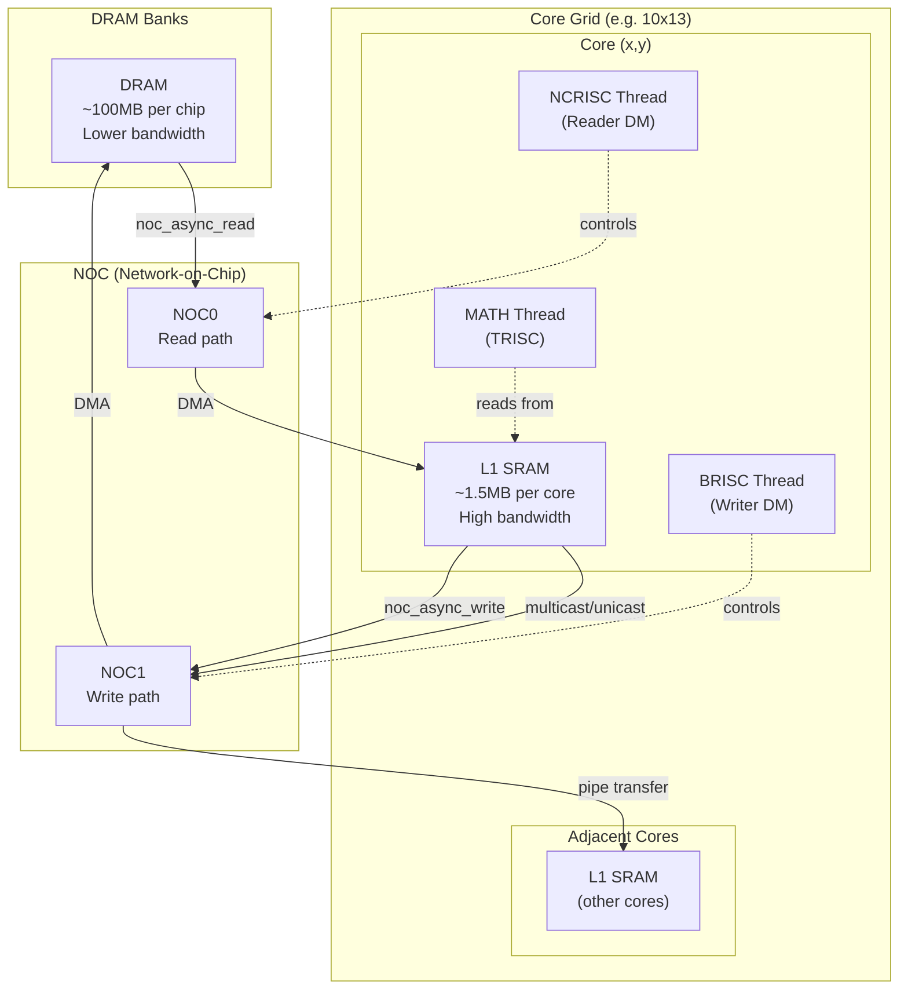
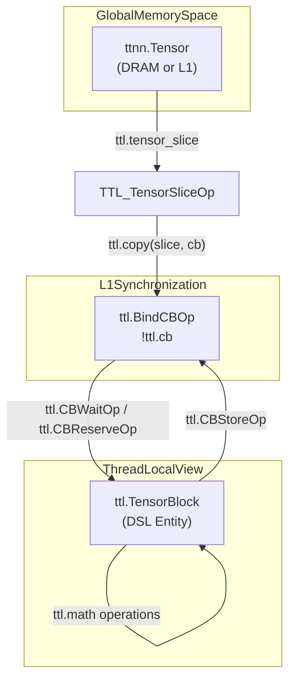
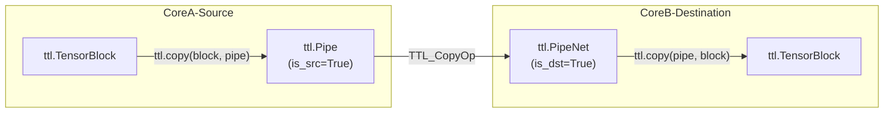

# Data Structures

Relevant source files
*   [docs/sphinx/specs/TTLangSpecification.md](https://github.com/tenstorrent/tt-lang/blob/d76e6233/docs/sphinx/specs/TTLangSpecification.md?plain=1)
*   [examples/elementwise-tutorial/step_0_ttnn_base.py](https://github.com/tenstorrent/tt-lang/blob/d76e6233/examples/elementwise-tutorial/step_0_ttnn_base.py)
*   [examples/elementwise-tutorial/step_1_single_node_single_tile_block.py](https://github.com/tenstorrent/tt-lang/blob/d76e6233/examples/elementwise-tutorial/step_1_single_node_single_tile_block.py)
*   [examples/elementwise-tutorial/step_2_single_node_multitile_block.py](https://github.com/tenstorrent/tt-lang/blob/d76e6233/examples/elementwise-tutorial/step_2_single_node_multitile_block.py)
*   [examples/elementwise-tutorial/step_3_multinode.py](https://github.com/tenstorrent/tt-lang/blob/d76e6233/examples/elementwise-tutorial/step_3_multinode.py)
*   [include/ttlang/Dialect/TTL/IR/TTL.h](https://github.com/tenstorrent/tt-lang/blob/d76e6233/include/ttlang/Dialect/TTL/IR/TTL.h)
*   [include/ttlang/Dialect/TTL/IR/TTLOps.td](https://github.com/tenstorrent/tt-lang/blob/d76e6233/include/ttlang/Dialect/TTL/IR/TTLOps.td)
*   [include/ttlang/Dialect/TTL/IR/TTLOpsUtils.h](https://github.com/tenstorrent/tt-lang/blob/d76e6233/include/ttlang/Dialect/TTL/IR/TTLOpsUtils.h)
*   [include/ttlang/Dialect/TTL/Transforms/DFBMaterialization.h](https://github.com/tenstorrent/tt-lang/blob/d76e6233/include/ttlang/Dialect/TTL/Transforms/DFBMaterialization.h)
*   [lib/Dialect/TTL/IR/TTLOps.cpp](https://github.com/tenstorrent/tt-lang/blob/d76e6233/lib/Dialect/TTL/IR/TTLOps.cpp)
*   [lib/Dialect/TTL/Transforms/ConvertTTLTileOpsToTTKernel.cpp](https://github.com/tenstorrent/tt-lang/blob/d76e6233/lib/Dialect/TTL/Transforms/ConvertTTLTileOpsToTTKernel.cpp)
*   [lib/Dialect/TTL/Transforms/ConvertTTLToCompute.cpp](https://github.com/tenstorrent/tt-lang/blob/d76e6233/lib/Dialect/TTL/Transforms/ConvertTTLToCompute.cpp)
*   [lib/Dialect/TTL/Transforms/ConvertTTLToTTKernel.cpp](https://github.com/tenstorrent/tt-lang/blob/d76e6233/lib/Dialect/TTL/Transforms/ConvertTTLToTTKernel.cpp)
*   [lib/Dialect/TTL/Transforms/DFBMaterialization.cpp](https://github.com/tenstorrent/tt-lang/blob/d76e6233/lib/Dialect/TTL/Transforms/DFBMaterialization.cpp)
*   [lib/Dialect/TTL/Transforms/TTLInsertIntermediateDFBs.cpp](https://github.com/tenstorrent/tt-lang/blob/d76e6233/lib/Dialect/TTL/Transforms/TTLInsertIntermediateDFBs.cpp)
*   [python/pykernel/_src/kernel_ast.py](https://github.com/tenstorrent/tt-lang/blob/d76e6233/python/pykernel/_src/kernel_ast.py)
*   [python/ttl/operators.py](https://github.com/tenstorrent/tt-lang/blob/d76e6233/python/ttl/operators.py)
*   [test/python/invalid/invalid_reduce_scalar_undefined.py](https://github.com/tenstorrent/tt-lang/blob/d76e6233/test/python/invalid/invalid_reduce_scalar_undefined.py)
*   [test/python/simple_reduce_scalar.py](https://github.com/tenstorrent/tt-lang/blob/d76e6233/test/python/simple_reduce_scalar.py)

This page provides an overview of the core data structures used in `tt-lang` programming for managing data, memory, and synchronization. These structures enable explicit control over tile-level operations, inter-core communication, and hardware resource management.

For information about how to define kernels using these data structures, see [Kernel Definition with Decorators](https://deepwiki.com/tenstorrent/tt-lang/2.1.1-kernel-definition-with-decorators). For details on the memory hierarchy these structures operate within, see [Memory Hierarchy: DRAM, L1, and DST Registers](https://deepwiki.com/tenstorrent/tt-lang/2.3.1-memory-hierarchy:-dram-l1-and-dst-registers).

## Overview

`tt-lang` provides several high-level abstractions that wrap the complexity of tensor memory layout, compute APIs, and node-to-node communication [docs/sphinx/specs/TTLangSpecification.md 52-57](https://github.com/tenstorrent/tt-lang/blob/d76e6233/docs/sphinx/specs/TTLangSpecification.md?plain=1#L52-L57)

| Data Structure | Purpose | Primary Use Case |
| --- | --- | --- |
| `CircularBuffer` / `DataflowBuffer` | Inter-thread communication | Producer-consumer synchronization in L1 [docs/sphinx/specs/TTLangSpecification.md 36](https://github.com/tenstorrent/tt-lang/blob/d76e6233/docs/sphinx/specs/TTLangSpecification.md?plain=1#L36-L36) |
| `TensorBlock` | Tile-level computation | Represents a set of tiles for math operations [python/ttl/operators.py 121-132](https://github.com/tenstorrent/tt-lang/blob/d76e6233/python/ttl/operators.py#L121-L132) |
| `Tensor` | Global memory storage | Source/Destination for DMA (DRAM/L1) [docs/sphinx/specs/TTLangSpecification.md 61](https://github.com/tenstorrent/tt-lang/blob/d76e6233/docs/sphinx/specs/TTLangSpecification.md?plain=1#L61-L61) |
| `Pipe` | Inter-core communication | Unicast/Multicast data movement [docs/sphinx/specs/TTLangSpecification.md 12](https://github.com/tenstorrent/tt-lang/blob/d76e6233/docs/sphinx/specs/TTLangSpecification.md?plain=1#L12-L12) |
| `TensorSlice` | Sub-tensor view | Addressing specific tiles within a larger tensor [docs/sphinx/specs/TTLangSpecification.md 14](https://github.com/tenstorrent/tt-lang/blob/d76e6233/docs/sphinx/specs/TTLangSpecification.md?plain=1#L14-L14) |

These structures form the building blocks for all kernel operations.

**Sources:**[docs/sphinx/specs/TTLangSpecification.md 52-57](https://github.com/tenstorrent/tt-lang/blob/d76e6233/docs/sphinx/specs/TTLangSpecification.md?plain=1#L52-L57)[include/ttlang/Dialect/TTL/IR/TTLOps.td 25-112](https://github.com/tenstorrent/tt-lang/blob/d76e6233/include/ttlang/Dialect/TTL/IR/TTLOps.td#L25-L112)

* * *




Sources: [python/ttl/ttl_api.py:98-98](), [benchmarks/matmul/config.py:76-78](), [benchmarks/matmul/NOTES.md:68-74]()
```
## Data Structure Relationships

The following diagrams bridge the "Natural Language Space" of the programming model to the "Code Entity Space" of the DSL and compiler.

### Relationship: Tensor, CircularBuffer, and Block

Title: Data Flow from Global Memory to Compute

**Sources:**[docs/sphinx/specs/TTLangSpecification.md 9-15](https://github.com/tenstorrent/tt-lang/blob/d76e6233/docs/sphinx/specs/TTLangSpecification.md?plain=1#L9-L15)[include/ttlang/Dialect/TTL/IR/TTLOps.td 25-154](https://github.com/tenstorrent/tt-lang/blob/d76e6233/include/ttlang/Dialect/TTL/IR/TTLOps.td#L25-L154)[lib/Dialect/TTL/Transforms/ConvertTTLTileOpsToTTKernel.cpp 59-112](https://github.com/tenstorrent/tt-lang/blob/d76e6233/lib/Dialect/TTL/Transforms/ConvertTTLTileOpsToTTKernel.cpp#L59-L112)

* * *



## Circular Buffer (CB) / DataflowBuffer

The `CircularBuffer` (referred to as `DataflowBuffer` in newer specs [docs/sphinx/specs/TTLangSpecification.md 36](https://github.com/tenstorrent/tt-lang/blob/d76e6233/docs/sphinx/specs/TTLangSpecification.md?plain=1#L36-L36)) provides explicit producer-consumer synchronization between compute and data movement threads. It manages memory in L1 with explicit acquire/release semantics.

### API and Hardware Mapping

A CB is declared via `ttl.bind_cb`, which associates a hardware slot (0-31) with a buffer configuration [include/ttlang/Dialect/TTL/IR/TTLOps.td 25-42](https://github.com/tenstorrent/tt-lang/blob/d76e6233/include/ttlang/Dialect/TTL/IR/TTLOps.td#L25-L42) It uses a `block_count` (formerly `buffer_factor`) to determine how many `Blocks` it can hold simultaneously for double or multi-buffering [docs/sphinx/specs/TTLangSpecification.md 47](https://github.com/tenstorrent/tt-lang/blob/d76e6233/docs/sphinx/specs/TTLangSpecification.md?plain=1#L47-L47)[include/ttlang/Dialect/TTL/IR/TTLOps.td 45](https://github.com/tenstorrent/tt-lang/blob/d76e6233/include/ttlang/Dialect/TTL/IR/TTLOps.td#L45-L45)

*   **`ttl.attach_cb`**: Associates a specific tensor SSA value with a CB handle for later data-movement/compute lowering [include/ttlang/Dialect/TTL/IR/TTLOps.td 52-69](https://github.com/tenstorrent/tt-lang/blob/d76e6233/include/ttlang/Dialect/TTL/IR/TTLOps.td#L52-L69)
*   **Intermediate DFBs**: The compiler may automatically insert `BindCBOp` and `CBReserveOp` instances during fusion passes to materialize intermediate results to L1 [lib/Dialect/TTL/Transforms/TTLInsertIntermediateDFBs.cpp 43-106](https://github.com/tenstorrent/tt-lang/blob/d76e6233/lib/Dialect/TTL/Transforms/TTLInsertIntermediateDFBs.cpp#L43-L106)

For details, see [Circular Buffer Operations](https://deepwiki.com/tenstorrent/tt-lang/2.2.1-circular-buffer-operations).

**Sources:**[docs/sphinx/specs/TTLangSpecification.md 36-47](https://github.com/tenstorrent/tt-lang/blob/d76e6233/docs/sphinx/specs/TTLangSpecification.md?plain=1#L36-L47)[include/ttlang/Dialect/TTL/IR/TTLOps.td 25-77](https://github.com/tenstorrent/tt-lang/blob/d76e6233/include/ttlang/Dialect/TTL/IR/TTLOps.td#L25-L77)[lib/Dialect/TTL/IR/TTLOps.cpp 98-116](https://github.com/tenstorrent/tt-lang/blob/d76e6233/lib/Dialect/TTL/IR/TTLOps.cpp#L98-L116)[lib/Dialect/TTL/Transforms/TTLInsertIntermediateDFBs.cpp 9-15](https://github.com/tenstorrent/tt-lang/blob/d76e6233/lib/Dialect/TTL/Transforms/TTLInsertIntermediateDFBs.cpp#L9-L15)

* * *

## Block and TensorSlice

A `Block` (represented by `TensorBlock` in the Python DSL) represents a rectangular collection of tiles (32x32 elements) [docs/sphinx/specs/TTLangSpecification.md 10](https://github.com/tenstorrent/tt-lang/blob/d76e6233/docs/sphinx/specs/TTLangSpecification.md?plain=1#L10-L10)[python/ttl/operators.py 121](https://github.com/tenstorrent/tt-lang/blob/d76e6233/python/ttl/operators.py#L121-L121) It is the fundamental unit of computation.

### TensorSlice

`ttl.tensor_slice` creates a view into a tensor at specific tile indices [include/ttlang/Dialect/TTL/IR/TTLOps.td 79-85](https://github.com/tenstorrent/tt-lang/blob/d76e6233/include/ttlang/Dialect/TTL/IR/TTLOps.td#L79-L85) This is used to define which part of a global tensor is being moved into a local `CircularBuffer` during a `ttl.copy` operation [include/ttlang/Dialect/TTL/IR/TTLOps.td 100-103](https://github.com/tenstorrent/tt-lang/blob/d76e6233/include/ttlang/Dialect/TTL/IR/TTLOps.td#L100-L103)

### Block Operations and States

Blocks are acquired from a CB via `reserve()` or `wait()`[docs/sphinx/specs/TTLangSpecification.md 11](https://github.com/tenstorrent/tt-lang/blob/d76e6233/docs/sphinx/specs/TTLangSpecification.md?plain=1#L11-L11)

*   **Producer Side**: Uses `ttl.cb_reserve` to get a block for writing and `ttl.cb_push` to make it available to consumers [docs/sphinx/specs/TTLangSpecification.md 38](https://github.com/tenstorrent/tt-lang/blob/d76e6233/docs/sphinx/specs/TTLangSpecification.md?plain=1#L38-L38)
*   **Consumer Side**: Uses `ttl.cb_wait` to access data and `ttl.cb_pop` to release the memory back to the producer [docs/sphinx/specs/TTLangSpecification.md 38](https://github.com/tenstorrent/tt-lang/blob/d76e6233/docs/sphinx/specs/TTLangSpecification.md?plain=1#L38-L38)
*   **Accumulation**: The `TensorBlock` supports in-place accumulation via `__iadd__`, which emits `ttl.store` with accumulation attributes for L1 packer reconfig [python/ttl/operators.py 210-215](https://github.com/tenstorrent/tt-lang/blob/d76e6233/python/ttl/operators.py#L210-L215)

For details on indexing and slicing, see [Block and Tile Access](https://deepwiki.com/tenstorrent/tt-lang/2.2.2-block-and-tile-access).

**Sources:**[docs/sphinx/specs/TTLangSpecification.md 10-15](https://github.com/tenstorrent/tt-lang/blob/d76e6233/docs/sphinx/specs/TTLangSpecification.md?plain=1#L10-L15)[include/ttlang/Dialect/TTL/IR/TTLOps.td 79-112](https://github.com/tenstorrent/tt-lang/blob/d76e6233/include/ttlang/Dialect/TTL/IR/TTLOps.td#L79-L112)[lib/Dialect/TTL/IR/TTLOps.cpp 140-162](https://github.com/tenstorrent/tt-lang/blob/d76e6233/lib/Dialect/TTL/IR/TTLOps.cpp#L140-L162)[python/ttl/operators.py 193-215](https://github.com/tenstorrent/tt-lang/blob/d76e6233/python/ttl/operators.py#L193-L215)

* * *

## Copy Operations and Pipes

Data movement is handled via asynchronous `ttl.copy` and `Pipe` abstractions.

### ttl.copy and Transfer Handles

The `ttl.copy` operation initiates an asynchronous transfer and returns a `!ttl.transfer_handle`[include/ttlang/Dialect/TTL/IR/TTLOps.td 122-126](https://github.com/tenstorrent/tt-lang/blob/d76e6233/include/ttlang/Dialect/TTL/IR/TTLOps.td#L122-L126) This handle must be explicitly synchronized using `ttl.wait` to ensure the destination data is valid [include/ttlang/Dialect/TTL/IR/TTLOps.td 164-168](https://github.com/tenstorrent/tt-lang/blob/d76e6233/include/ttlang/Dialect/TTL/IR/TTLOps.td#L164-L168)

### Pipes and PipeNet

`Pipe` and `PipeNet` enable communication between different Tensix cores or chips [docs/sphinx/specs/TTLangSpecification.md 12-13](https://github.com/tenstorrent/tt-lang/blob/d76e6233/docs/sphinx/specs/TTLangSpecification.md?plain=1#L12-L13)

*   **Unicast**: One-to-one communication.
*   **Multicast**: One-to-many communication patterns via `PipeNet`[docs/sphinx/specs/TTLangSpecification.md 13](https://github.com/tenstorrent/tt-lang/blob/d76e6233/docs/sphinx/specs/TTLangSpecification.md?plain=1#L13-L13)
*   **Conditional Execution**: Uses `if_src` and `if_dst` to specify logic that only runs on the source or destination nodes of a pipe [docs/sphinx/specs/TTLangSpecification.md 13](https://github.com/tenstorrent/tt-lang/blob/d76e6233/docs/sphinx/specs/TTLangSpecification.md?plain=1#L13-L13)

Title: Inter-Core Pipe Communication Entity Mapping

For details, see [Copy Operations and Synchronization](https://deepwiki.com/tenstorrent/tt-lang/2.2.3-copy-operations-and-synchronization) and [Pipes and Inter-core Communication](https://deepwiki.com/tenstorrent/tt-lang/2.2.4-pipes-and-inter-core-communication).

**Sources:**[docs/sphinx/specs/TTLangSpecification.md 12-16](https://github.com/tenstorrent/tt-lang/blob/d76e6233/docs/sphinx/specs/TTLangSpecification.md?plain=1#L12-L16)[include/ttlang/Dialect/TTL/IR/TTLOps.td 122-175](https://github.com/tenstorrent/tt-lang/blob/d76e6233/include/ttlang/Dialect/TTL/IR/TTLOps.td#L122-L175)[python/ttl/operators.py 27-28](https://github.com/tenstorrent/tt-lang/blob/d76e6233/python/ttl/operators.py#L27-L28)

* * *




For details, see [Copy Operations and Synchronization](#2.2.3) and [Pipes and Inter-core Communication](#2.2.4).
```
## Summary of Operation Mapping

| DSL Operation | Code Entity (MLIR) | Hardware Mapping (TT-Kernel) |
| --- | --- | --- |
| `cb.reserve()` | `TTL_CBReserveOp` | `cb_reserve_back` |
| `cb.wait()` | `TTL_CBWaitOp` | `cb_wait_front` |
| `cb.push()` | `TTL_CBPushOp` | `cb_push_back` |
| `cb.pop()` | `TTL_CBPopOp` | `cb_pop_front` |
| `ttl.copy()` | `TTL_CopyOp` | `noc_async_read` / `noc_async_write` |

**Sources:**[docs/sphinx/specs/TTLangSpecification.md 38](https://github.com/tenstorrent/tt-lang/blob/d76e6233/docs/sphinx/specs/TTLangSpecification.md?plain=1#L38-L38)[include/ttlang/Dialect/TTL/IR/TTLOps.td 25-162](https://github.com/tenstorrent/tt-lang/blob/d76e6233/include/ttlang/Dialect/TTL/IR/TTLOps.td#L25-L162)[lib/Dialect/TTL/Transforms/ConvertTTLTileOpsToTTKernel.cpp 65-85](https://github.com/tenstorrent/tt-lang/blob/d76e6233/lib/Dialect/TTL/Transforms/ConvertTTLTileOpsToTTKernel.cpp#L65-L85)

Dismiss
Refresh this wiki

Enter email to refresh
