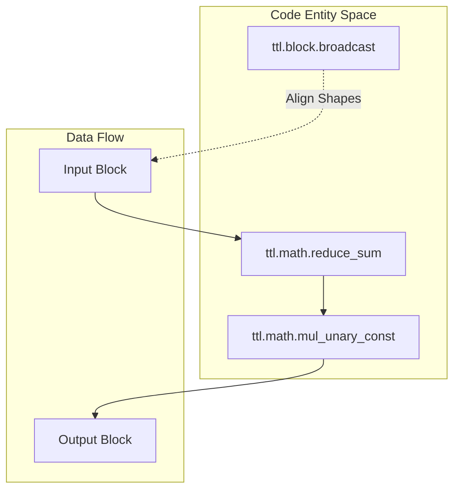

# Block and Tile Access

Relevant source files
*   [docs/sphinx/specs/TTLangSpecification.md](https://github.com/tenstorrent/tt-lang/blob/d76e6233/docs/sphinx/specs/TTLangSpecification.md?plain=1)
*   [docs/sphinx/specs/ttl-block.png](https://github.com/tenstorrent/tt-lang/blob/d76e6233/docs/sphinx/specs/ttl-block.png)
*   [docs/sphinx/specs/ttl-pipe-identity.png](https://github.com/tenstorrent/tt-lang/blob/d76e6233/docs/sphinx/specs/ttl-pipe-identity.png)
*   [examples/elementwise-tutorial/step_0_ttnn_base.py](https://github.com/tenstorrent/tt-lang/blob/d76e6233/examples/elementwise-tutorial/step_0_ttnn_base.py)
*   [examples/elementwise-tutorial/step_1_single_node_single_tile_block.py](https://github.com/tenstorrent/tt-lang/blob/d76e6233/examples/elementwise-tutorial/step_1_single_node_single_tile_block.py)
*   [examples/elementwise-tutorial/step_2_single_node_multitile_block.py](https://github.com/tenstorrent/tt-lang/blob/d76e6233/examples/elementwise-tutorial/step_2_single_node_multitile_block.py)
*   [examples/elementwise-tutorial/step_3_multinode.py](https://github.com/tenstorrent/tt-lang/blob/d76e6233/examples/elementwise-tutorial/step_3_multinode.py)
*   [include/ttlang/Dialect/TTL/Transforms/DFBMaterialization.h](https://github.com/tenstorrent/tt-lang/blob/d76e6233/include/ttlang/Dialect/TTL/Transforms/DFBMaterialization.h)
*   [lib/Dialect/TTL/Transforms/DFBMaterialization.cpp](https://github.com/tenstorrent/tt-lang/blob/d76e6233/lib/Dialect/TTL/Transforms/DFBMaterialization.cpp)
*   [lib/Dialect/TTL/Transforms/TTLInsertIntermediateDFBs.cpp](https://github.com/tenstorrent/tt-lang/blob/d76e6233/lib/Dialect/TTL/Transforms/TTLInsertIntermediateDFBs.cpp)
*   [python/pykernel/_src/kernel_ast.py](https://github.com/tenstorrent/tt-lang/blob/d76e6233/python/pykernel/_src/kernel_ast.py)
*   [test/python/invalid/invalid_reduce_scalar_undefined.py](https://github.com/tenstorrent/tt-lang/blob/d76e6233/test/python/invalid/invalid_reduce_scalar_undefined.py)
*   [test/python/simple_reduce_scalar.py](https://github.com/tenstorrent/tt-lang/blob/d76e6233/test/python/simple_reduce_scalar.py)
*   [test/python/test_rank_reducing_slice.py](https://github.com/tenstorrent/tt-lang/blob/d76e6233/test/python/test_rank_reducing_slice.py)
*   [test/ttlang/Conversion/TTLToTTKernel/rank_reducing_copy.mlir](https://github.com/tenstorrent/tt-lang/blob/d76e6233/test/ttlang/Conversion/TTLToTTKernel/rank_reducing_copy.mlir)
*   [test/ttlang/Dialect/TTL/IR/tensor_slice.mlir](https://github.com/tenstorrent/tt-lang/blob/d76e6233/test/ttlang/Dialect/TTL/IR/tensor_slice.mlir)
*   [test/ttlang/Dialect/TTL/IR/tensor_slice_invalid.mlir](https://github.com/tenstorrent/tt-lang/blob/d76e6233/test/ttlang/Dialect/TTL/IR/tensor_slice_invalid.mlir)

## Purpose and Scope

This page explains the fundamental data access patterns in tt-lang: **tiles** (the basic 32×32 element unit) and **blocks** (tile-shaped memory regions acquired from dataflow buffers). It covers tile shapes, block dimensionality, indexing patterns for tensor slicing, and the block state lifecycle that governs when blocks can be read or written.

For operations on circular buffers themselves (reserve/wait/push/pop), see [Circular Buffer Operations](https://deepwiki.com/tenstorrent/tt-lang/2.2.1-circular-buffer-operations). For data transfer operations using blocks, see [Copy Operations and Synchronization](https://deepwiki.com/tenstorrent/tt-lang/2.2.3-copy-operations-and-synchronization).

* * *

## Tiles: The Fundamental Unit

A **tile** is the atomic unit of data in tt-lang, representing a 32×32 grid of scalar elements. All tensor operations in tiled layout work at tile granularity. [docs/sphinx/specs/TTLangSpecification.md 55-57](https://github.com/tenstorrent/tt-lang/blob/d76e6233/docs/sphinx/specs/TTLangSpecification.md?plain=1#L55-L57)

### Tile Type and Size

The tile shape is fixed by the hardware architecture:

*   **Fixed dimensions**: Always 32×32 elements. [test/ttlang/Dialect/TTL/IR/tensor_slice_invalid.mlir 4-5](https://github.com/tenstorrent/tt-lang/blob/d76e6233/test/ttlang/Dialect/TTL/IR/tensor_slice_invalid.mlir#L4-L5)
*   **Element type**: Determined by tensor dtype (e.g., `f32`, `bf16`). [test/ttlang/Dialect/TTL/IR/tensor_slice_invalid.mlir 37-38](https://github.com/tenstorrent/tt-lang/blob/d76e6233/test/ttlang/Dialect/TTL/IR/tensor_slice_invalid.mlir#L37-L38)
*   **Layout**: Tensors must typically be in `ttnn.TILE_LAYOUT` to be processed by tt-lang kernels. [docs/sphinx/specs/TTLangSpecification.md 88](https://github.com/tenstorrent/tt-lang/blob/d76e6233/docs/sphinx/specs/TTLangSpecification.md?plain=1#L88-L88)

**Sources:**[docs/sphinx/specs/TTLangSpecification.md 55-88](https://github.com/tenstorrent/tt-lang/blob/d76e6233/docs/sphinx/specs/TTLangSpecification.md?plain=1#L55-L88)[test/ttlang/Dialect/TTL/IR/tensor_slice_invalid.mlir 4-38](https://github.com/tenstorrent/tt-lang/blob/d76e6233/test/ttlang/Dialect/TTL/IR/tensor_slice_invalid.mlir#L4-L38)

* * *

## Blocks: Tile-Shaped Memory Regions

A **block** represents a logically contiguous window into a dataflow buffer (circular buffer) acquired via `reserve()` or `wait()`. [docs/sphinx/specs/TTLangSpecification.md 57-58](https://github.com/tenstorrent/tt-lang/blob/d76e6233/docs/sphinx/specs/TTLangSpecification.md?plain=1#L57-L58)

### Block Shape Definition

The block's shape is determined by the Dataflow Buffer's (DFB) `shape` parameter, specified in **tile coordinates**.

[examples/elementwise-tutorial/step_3_multinode.py 62-64](https://github.com/tenstorrent/tt-lang/blob/d76e6233/examples/elementwise-tutorial/step_3_multinode.py#L62-L64)

The `shape` parameter defines the rectangular region of tiles that a single `reserve` or `wait` call will provide. [docs/sphinx/specs/TTLangSpecification.md 55-57](https://github.com/tenstorrent/tt-lang/blob/d76e6233/docs/sphinx/specs/TTLangSpecification.md?plain=1#L55-L57)

**Sources:**[examples/elementwise-tutorial/step_3_multinode.py 62-64](https://github.com/tenstorrent/tt-lang/blob/d76e6233/examples/elementwise-tutorial/step_3_multinode.py#L62-L64)[docs/sphinx/specs/TTLangSpecification.md 55-58](https://github.com/tenstorrent/tt-lang/blob/d76e6233/docs/sphinx/specs/TTLangSpecification.md?plain=1#L55-L58)

* * *

## Tile Indexing and Tensor Slicing

When copying data between tensors and blocks, tile indices specify which portion of the tensor to access. tt-lang supports both standard slicing and **rank-reducing slices**. [test/python/test_rank_reducing_slice.py 8-14](https://github.com/tenstorrent/tt-lang/blob/d76e6233/test/python/test_rank_reducing_slice.py#L8-L14)

### Rank-Reducing Slices

A slice result (block) may have a lower rank than the source tensor. The leading `(tensor_rank - block_rank)` dimensions are "squeezed" using scalar subscripts. [test/python/test_rank_reducing_slice.py 8-12](https://github.com/tenstorrent/tt-lang/blob/d76e6233/test/python/test_rank_reducing_slice.py#L8-L12)

[test/python/test_rank_reducing_slice.py 113-114](https://github.com/tenstorrent/tt-lang/blob/d76e6233/test/python/test_rank_reducing_slice.py#L113-L114)

### Indexing Rules and Constraints

*   **Index Count**: The number of indices provided in a slice must match the tensor's rank. [test/ttlang/Dialect/TTL/IR/tensor_slice_invalid.mlir 10-11](https://github.com/tenstorrent/tt-lang/blob/d76e6233/test/ttlang/Dialect/TTL/IR/tensor_slice_invalid.mlir#L10-L11)
*   **Result Rank**: The rank of the resulting slice cannot exceed the rank of the source tensor. [test/ttlang/Dialect/TTL/IR/tensor_slice_invalid.mlir 24-25](https://github.com/tenstorrent/tt-lang/blob/d76e6233/test/ttlang/Dialect/TTL/IR/tensor_slice_invalid.mlir#L24-L25)
*   **Squeezing**: Squeezed dimensions must use scalar syntax (not ranges) in the Python DSL. [test/python/test_rank_reducing_slice.py 18-19](https://github.com/tenstorrent/tt-lang/blob/d76e6233/test/python/test_rank_reducing_slice.py#L18-L19)

### Tile Coordinate Mapping

The compiler linearizes N-D tile indices against the full tensor tile grid to calculate hardware addresses. [test/ttlang/Conversion/TTLToTTKernel/rank_reducing_copy.mlir 3-6](https://github.com/tenstorrent/tt-lang/blob/d76e6233/test/ttlang/Conversion/TTLToTTKernel/rank_reducing_copy.mlir#L3-L6)

**Sources:**[test/python/test_rank_reducing_slice.py 8-114](https://github.com/tenstorrent/tt-lang/blob/d76e6233/test/python/test_rank_reducing_slice.py#L8-L114)[test/ttlang/Dialect/TTL/IR/tensor_slice_invalid.mlir 10-25](https://github.com/tenstorrent/tt-lang/blob/d76e6233/test/ttlang/Dialect/TTL/IR/tensor_slice_invalid.mlir#L10-L25)[test/ttlang/Conversion/TTLToTTKernel/rank_reducing_copy.mlir 3-40](https://github.com/tenstorrent/tt-lang/blob/d76e6233/test/ttlang/Conversion/TTLToTTKernel/rank_reducing_copy.mlir#L3-L40)

* * *


```mermaid
graph LR
    subgraph "Natural Language Space"
        "ND Coordinate" --> "Linearized Tile ID"
        "Squeezed Dim" --> "Static Offset"
    end

    subgraph "Code Entity Space"
        T_SLICE["ttl.tensor_slice"]
        L_MAP["arith.muli / arith.addi"]
        ACC["ttkernel.TensorAccessor"]
    end
    
    T_SLICE -->|"Lowering"| L_MAP
    L_MAP -->|"Address Gen"| ACC
```
## Block Access Patterns

### Multi-Core Work Distribution

In multi-core kernels, each node (core) calculates its local work partition using its grid coordinates. [examples/elementwise-tutorial/step_3_multinode.py 96-110](https://github.com/tenstorrent/tt-lang/blob/d76e6233/examples/elementwise-tutorial/step_3_multinode.py#L96-L110)

[examples/elementwise-tutorial/step_3_multinode.py 96-103](https://github.com/tenstorrent/tt-lang/blob/d76e6233/examples/elementwise-tutorial/step_3_multinode.py#L96-L103)

### Linearized Access

While the user interacts with N-D blocks, the hardware and low-level kernels often treat these as linearized sequences of tiles, especially during `noc_async_read_tile` or `noc_async_write_tile` operations. [test/ttlang/Conversion/TTLToTTKernel/rank_reducing_copy.mlir 32-40](https://github.com/tenstorrent/tt-lang/blob/d76e6233/test/ttlang/Conversion/TTLToTTKernel/rank_reducing_copy.mlir#L32-L40)

**Sources:**[examples/elementwise-tutorial/step_3_multinode.py 96-103](https://github.com/tenstorrent/tt-lang/blob/d76e6233/examples/elementwise-tutorial/step_3_multinode.py#L96-L103)[test/ttlang/Conversion/TTLToTTKernel/rank_reducing_copy.mlir 32-40](https://github.com/tenstorrent/tt-lang/blob/d76e6233/test/ttlang/Conversion/TTLToTTKernel/rank_reducing_copy.mlir#L32-L40)

* * *

## Block States and Lifecycle

The `TT-Lang Specification` defines formal states for blocks to ensure memory safety and synchronization. [docs/sphinx/specs/TTLangSpecification.md 39](https://github.com/tenstorrent/tt-lang/blob/d76e6233/docs/sphinx/specs/TTLangSpecification.md?plain=1#L39-L39)

### Formal Block States

| State | Description |
| --- | --- |
| **Reserved** | Block is allocated in L1 but contents are undefined. |
| **Valid** | Block contains valid data (after `wait` or `store`). |
| **Pushed/Popped** | Block has been returned to the DFB and is no longer accessible. |

[docs/sphinx/specs/TTLangSpecification.md 11](https://github.com/tenstorrent/tt-lang/blob/d76e6233/docs/sphinx/specs/TTLangSpecification.md?plain=1#L11-L11)

### Context Manager Lifecycle

The Python DSL uses `with` statements to manage block lifetimes, ensuring that `reserve`/`push` and `wait`/`pop` pairs are correctly executed. [examples/elementwise-tutorial/step_3_multinode.py 82-88](https://github.com/tenstorrent/tt-lang/blob/d76e6233/examples/elementwise-tutorial/step_3_multinode.py#L82-L88)

[examples/elementwise-tutorial/step_3_multinode.py 82-88](https://github.com/tenstorrent/tt-lang/blob/d76e6233/examples/elementwise-tutorial/step_3_multinode.py#L82-L88)

**Sources:**[docs/sphinx/specs/TTLangSpecification.md 11-39](https://github.com/tenstorrent/tt-lang/blob/d76e6233/docs/sphinx/specs/TTLangSpecification.md?plain=1#L11-L39)[examples/elementwise-tutorial/step_3_multinode.py 82-88](https://github.com/tenstorrent/tt-lang/blob/d76e6233/examples/elementwise-tutorial/step_3_multinode.py#L82-L88)

* * *

## Tile Operations and Broadcasting

Inside `@ttl.compute` functions, block data is manipulated using math operations and explicit broadcasting. [docs/sphinx/specs/TTLangSpecification.md 49](https://github.com/tenstorrent/tt-lang/blob/d76e6233/docs/sphinx/specs/TTLangSpecification.md?plain=1#L49-L49)

### Math and Block Operators

The `ttl.block` and `ttl.math` namespaces provide operations that work on entire blocks of tiles:

*   **Reductions**: `ttl.math.reduce_sum` can perform scalar, column, or row reductions. [test/python/simple_reduce_scalar.py 45-47](https://github.com/tenstorrent/tt-lang/blob/d76e6233/test/python/simple_reduce_scalar.py#L45-L47)
*   **Unary/Binary**: `ttl.math.abs`, `ttl.math.neg`, and standard operators (`+`, `*`). [docs/sphinx/specs/TTLangSpecification.md 46](https://github.com/tenstorrent/tt-lang/blob/d76e6233/docs/sphinx/specs/TTLangSpecification.md?plain=1#L46-L46)
*   **Transformations**: `ttl.block.transpose`, `ttl.block.squeeze`, `ttl.block.unsqueeze`. [docs/sphinx/specs/TTLangSpecification.md 48-49](https://github.com/tenstorrent/tt-lang/blob/d76e6233/docs/sphinx/specs/TTLangSpecification.md?plain=1#L48-L49)

### Broadcasting

Broadcasting is handled via `ttl.block.broadcast`. It allows a smaller block (e.g., a single tile or a row/column of tiles) to be expanded to match the shape of another block for element-wise operations. [docs/sphinx/specs/TTLangSpecification.md 35](https://github.com/tenstorrent/tt-lang/blob/d76e6233/docs/sphinx/specs/TTLangSpecification.md?plain=1#L35-L35)

**Sources:**[docs/sphinx/specs/TTLangSpecification.md 35-49](https://github.com/tenstorrent/tt-lang/blob/d76e6233/docs/sphinx/specs/TTLangSpecification.md?plain=1#L35-L49)[test/python/simple_reduce_scalar.py 45-47](https://github.com/tenstorrent/tt-lang/blob/d76e6233/test/python/simple_reduce_scalar.py#L45-L47)

* * *



## Intermediate DFB Materialization

The compiler can automatically insert intermediate DFBs when fused expression chains require L1-resident operands. [lib/Dialect/TTL/Transforms/TTLInsertIntermediateDFBs.cpp 9-13](https://github.com/tenstorrent/tt-lang/blob/d76e6233/lib/Dialect/TTL/Transforms/TTLInsertIntermediateDFBs.cpp#L9-L13)

*   **Materialization**: If an operation requires a DFB-attached input but receives a "naked" tensor SSA value, the `TTLInsertIntermediateDFBs` pass inserts a `store` to a compiler-allocated DFB. [lib/Dialect/TTL/Transforms/TTLInsertIntermediateDFBs.cpp 99-104](https://github.com/tenstorrent/tt-lang/blob/d76e6233/lib/Dialect/TTL/Transforms/TTLInsertIntermediateDFBs.cpp#L99-L104)
*   **Allocation**: These buffers are allocated with a `block_count` of 2 at the function entry. [lib/Dialect/TTL/Transforms/DFBMaterialization.cpp 19-20](https://github.com/tenstorrent/tt-lang/blob/d76e6233/lib/Dialect/TTL/Transforms/DFBMaterialization.cpp#L19-L20)

**Sources:**[lib/Dialect/TTL/Transforms/TTLInsertIntermediateDFBs.cpp 9-104](https://github.com/tenstorrent/tt-lang/blob/d76e6233/lib/Dialect/TTL/Transforms/TTLInsertIntermediateDFBs.cpp#L9-L104)[lib/Dialect/TTL/Transforms/DFBMaterialization.cpp 19-20](https://github.com/tenstorrent/tt-lang/blob/d76e6233/lib/Dialect/TTL/Transforms/DFBMaterialization.cpp#L19-L20)

Dismiss
Refresh this wiki

Enter email to refresh
