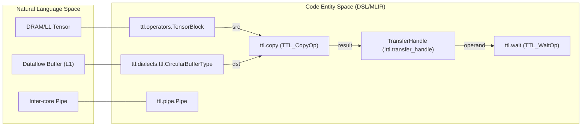
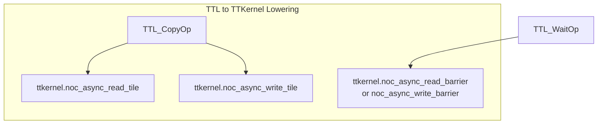

# Copy Operations and Synchronization

Relevant source files
*   [include/ttlang/Dialect/TTL/IR/TTL.h](https://github.com/tenstorrent/tt-lang/blob/d76e6233/include/ttlang/Dialect/TTL/IR/TTL.h)
*   [include/ttlang/Dialect/TTL/IR/TTLOps.td](https://github.com/tenstorrent/tt-lang/blob/d76e6233/include/ttlang/Dialect/TTL/IR/TTLOps.td)
*   [include/ttlang/Dialect/TTL/IR/TTLOpsUtils.h](https://github.com/tenstorrent/tt-lang/blob/d76e6233/include/ttlang/Dialect/TTL/IR/TTLOpsUtils.h)
*   [lib/Dialect/TTL/IR/TTLOps.cpp](https://github.com/tenstorrent/tt-lang/blob/d76e6233/lib/Dialect/TTL/IR/TTLOps.cpp)
*   [lib/Dialect/TTL/IR/TTLOpsVerifyUtils.h](https://github.com/tenstorrent/tt-lang/blob/d76e6233/lib/Dialect/TTL/IR/TTLOpsVerifyUtils.h)
*   [lib/Dialect/TTL/Transforms/ConvertTTLTileOpsToTTKernel.cpp](https://github.com/tenstorrent/tt-lang/blob/d76e6233/lib/Dialect/TTL/Transforms/ConvertTTLTileOpsToTTKernel.cpp)
*   [lib/Dialect/TTL/Transforms/ConvertTTLToCompute.cpp](https://github.com/tenstorrent/tt-lang/blob/d76e6233/lib/Dialect/TTL/Transforms/ConvertTTLToCompute.cpp)
*   [lib/Dialect/TTL/Transforms/ConvertTTLToTTKernel.cpp](https://github.com/tenstorrent/tt-lang/blob/d76e6233/lib/Dialect/TTL/Transforms/ConvertTTLToTTKernel.cpp)
*   [lib/Dialect/TTL/Transforms/TTLInsertCopyWait.cpp](https://github.com/tenstorrent/tt-lang/blob/d76e6233/lib/Dialect/TTL/Transforms/TTLInsertCopyWait.cpp)
*   [python/ttl/operators.py](https://github.com/tenstorrent/tt-lang/blob/d76e6233/python/ttl/operators.py)
*   [test/ttlang/Dialect/TTL/IR/dma_single_core_invalid.mlir](https://github.com/tenstorrent/tt-lang/blob/d76e6233/test/ttlang/Dialect/TTL/IR/dma_single_core_invalid.mlir)
*   [test/ttlang/Dialect/TTL/Transforms/insert_copy_wait.mlir](https://github.com/tenstorrent/tt-lang/blob/d76e6233/test/ttlang/Dialect/TTL/Transforms/insert_copy_wait.mlir)

## Purpose and Scope

This page describes the `ttl.copy` operation for asynchronous data transfer between memory locations, the **transfer handle** mechanism for tracking in-flight transfers, and `wait()` synchronization for ensuring transfer completion. Copy operations enable data movement between tensors (DRAM/L1), dataflow buffers (L1), and pipes (inter-core communication).

For dataflow buffer lifecycle operations (reserve/wait/push/pop), see [Circular Buffer Operations](https://deepwiki.com/tenstorrent/tt-lang/2.2.1-circular-buffer-operations). For pipe communication patterns, see [Pipes and Inter-core Communication](https://deepwiki.com/tenstorrent/tt-lang/2.2.4-pipes-and-inter-core-communication).

* * *

## Copy Operation Overview

The `ttl.copy` operation initiates an **asynchronous** data transfer and returns a transfer handle (`!ttl.transfer_handle`) that must be explicitly synchronized with `wait()`. This non-blocking design allows overlapping computation with data movement.

### Data Flow Space to Code Entity Space

**Sources**: [include/ttlang/Dialect/TTL/IR/TTLOps.td 122-154](https://github.com/tenstorrent/tt-lang/blob/d76e6233/include/ttlang/Dialect/TTL/IR/TTLOps.td#L122-L154)[python/ttl/operators.py 122-133](https://github.com/tenstorrent/tt-lang/blob/d76e6233/python/ttl/operators.py#L122-L133)[include/ttlang/Dialect/TTL/IR/TTLOpsTypes.td 45-55](https://github.com/tenstorrent/tt-lang/blob/d76e6233/include/ttlang/Dialect/TTL/IR/TTLOpsTypes.td#L45-L55)

* * *



## Transfer Endpoints

Copy operations support transfers between the following endpoint types:

| Source Type | Destination Type | Use Case |
| --- | --- | --- |
| `tensor` (slice) | `!ttl.cb` | Read tiles from DRAM/L1 into a reserved Circular Buffer slot |
| `!ttl.cb` | `tensor` (slice) | Write tiles from a wait-acquired CB to DRAM/L1 |
| `!ttl.cb` | `!ttl.pipe` | Send tiles to other cores (Unicast/Multicast) |
| `!ttl.pipe` | `!ttl.cb` | Receive tiles from other cores into a reserved CB slot |

The `TTL_CopyOp` verifier ensures that exactly one operand is a circular buffer (`!ttl.cb`) or a pipe, and the other is a ranked tensor result from a slice.

**Sources**: [include/ttlang/Dialect/TTL/IR/TTLOps.cpp 168-203](https://github.com/tenstorrent/tt-lang/blob/d76e6233/include/ttlang/Dialect/TTL/IR/TTLOps.cpp#L168-L203)[include/ttlang/Dialect/TTL/IR/TTLOps.td 122-136](https://github.com/tenstorrent/tt-lang/blob/d76e6233/include/ttlang/Dialect/TTL/IR/TTLOps.td#L122-L136)

* * *

## Python DSL Usage

### Basic Copy Syntax

In the Python DSL, `ttl.copy` is used within `@ttl.datamovement` or `@ttl.compute` decorated functions. It returns a `TransferHandle` that identifies the transaction.

### Automatic Synchronization

The `ttl-insert-copy-wait` transformation pass automatically inserts missing `ttl.wait` operations for `ttl.copy` calls whose handles have no explicit wait user. This ensures functional correctness even if the programmer omits the synchronization call, placing the wait immediately after the copy.

**Sources**: [lib/Dialect/TTL/Transforms/TTLInsertCopyWait.cpp 28-46](https://github.com/tenstorrent/tt-lang/blob/d76e6233/lib/Dialect/TTL/Transforms/TTLInsertCopyWait.cpp#L28-L46)[test/ttlang/Dialect/TTL/Transforms/insert_copy_wait.mlir 11-22](https://github.com/tenstorrent/tt-lang/blob/d76e6233/test/ttlang/Dialect/TTL/Transforms/insert_copy_wait.mlir#L11-L22)

* * *

## Tensor Slicing

### Python Subscript Syntax

In Python, tensor subscripting allows addressing specific tiles. This is implemented via `ttl.tensor_slice` in MLIR, which creates a view into a tensor at a specific tile position.

### MLIR Lowering

The `ttl.tensor_slice` operation takes a tensor and a variadic list of indices. The verifier ensures the index count matches the tensor rank. The result is a ranked tensor with a reduced shape (typically matching the CB block shape) but retaining the original tensor's layout encoding.

**Sources**: [include/ttlang/Dialect/TTL/IR/TTLOps.td 80-120](https://github.com/tenstorrent/tt-lang/blob/d76e6233/include/ttlang/Dialect/TTL/IR/TTLOps.td#L80-L120)[include/ttlang/Dialect/TTL/IR/TTLOps.cpp 140-166](https://github.com/tenstorrent/tt-lang/blob/d76e6233/include/ttlang/Dialect/TTL/IR/TTLOps.cpp#L140-L166)

* * *

## Transfer Handles and Synchronization

### TransferHandle Type

The `!ttl.transfer_handle` type tracks asynchronous operations. It is parameterized by a direction (`read` or `write`).

*   **Read**: Data moving from external memory (Tensor) or Pipe into L1 (CB).
*   **Write**: Data moving from L1 (CB) into external memory (Tensor) or Pipe.

**Sources**: [include/ttlang/Dialect/TTL/IR/TTLOpsTypes.td 45-55](https://github.com/tenstorrent/tt-lang/blob/d76e6233/include/ttlang/Dialect/TTL/IR/TTLOpsTypes.td#L45-L55)[include/ttlang/Dialect/TTL/IR/TTLOps.td 149-150](https://github.com/tenstorrent/tt-lang/blob/d76e6233/include/ttlang/Dialect/TTL/IR/TTLOps.td#L149-L150)

### wait() Synchronization

The `ttl.wait` operation blocks execution until the asynchronous transfer identified by the handle is complete. In the MLIR verifier, it is checked that the operand to `ttl.wait` is derived from a `ttl.copy` or a pipe operation, tracing through loop-carried state or tensor containers if necessary.

**Sources**: [include/ttlang/Dialect/TTL/IR/TTLOps.td 164-173](https://github.com/tenstorrent/tt-lang/blob/d76e6233/include/ttlang/Dialect/TTL/IR/TTLOps.td#L164-L173)[lib/Dialect/TTL/IR/TTLOpsVerifyUtils.h 12-17](https://github.com/tenstorrent/tt-lang/blob/d76e6233/lib/Dialect/TTL/IR/TTLOpsVerifyUtils.h#L12-L17)[include/ttlang/Dialect/TTL/IR/TTLOpsUtils.h 58-110](https://github.com/tenstorrent/tt-lang/blob/d76e6233/include/ttlang/Dialect/TTL/IR/TTLOpsUtils.h#L58-L110)

* * *

## Lowering to Hardware Operations

The compilation pipeline lowers `ttl.copy` and `ttl.wait` to hardware-specific NOC operations in the `TTKernel` dialect via the `ConvertTTLToTTKernel` pass.

**NOC Operations**:

*   **Read** (Tensor → CB): Lowered to `ttkernel.noc_async_read_tile`. The source address is calculated using `TensorAccessor` logic which handles memory layouts (Interleaved/Sharded).
*   **Write** (CB → Tensor): Lowered to `ttkernel.noc_async_write_tile`.
*   **Synchronization**: `ttl.wait` is implemented using `ttkernel.noc_async_read_barrier` or `noc_async_write_barrier`.

**Sources**: [lib/Dialect/TTL/Transforms/ConvertTTLTileOpsToTTKernel.cpp 59-112](https://github.com/tenstorrent/tt-lang/blob/d76e6233/lib/Dialect/TTL/Transforms/ConvertTTLTileOpsToTTKernel.cpp#L59-L112)[lib/Dialect/TTL/Transforms/ConvertTTLToTTKernel.cpp 65-85](https://github.com/tenstorrent/tt-lang/blob/d76e6233/lib/Dialect/TTL/Transforms/ConvertTTLToTTKernel.cpp#L65-L85)[include/ttlang/Dialect/TTL/IR/TTLOps.td 168-173](https://github.com/tenstorrent/tt-lang/blob/d76e6233/include/ttlang/Dialect/TTL/IR/TTLOps.td#L168-L173)

* * *




**NOC Operations**:
- **Read** (Tensor → CB): Lowered to `ttkernel.noc_async_read_tile`. The source address is calculated using `TensorAccessor` logic which handles memory layouts (Interleaved/Sharded).
- **Write** (CB → Tensor): Lowered to `ttkernel.noc_async_write_tile`.
- **Synchronization**: `ttl.wait` is implemented using `ttkernel.noc_async_read_barrier` or `noc_async_write_barrier`.
```
## Copy Validation Rules

The `TTL_CopyOp` verifier enforces several constraints to ensure hardware compatibility:

1.   **CB Presence**: Exactly one operand must be a `!ttl.cb` (or a `!ttl.pipe`).
2.   **Layout Encoding**: The non-CB operand (Tensor) must carry a `ttl.layout` encoding.
3.   **Type Consistency**: The element type of the Tensor must match the element type of the Circular Buffer.
4.   **Shape Consistency**: The shape of the Tensor slice must match the shape dimensions of the Circular Buffer. For example, a 2D CB of shape `[1, 1]` can only be a destination for a `1x1` tensor slice.

**Sources**: [include/ttlang/Dialect/TTL/IR/TTLOps.cpp 168-203](https://github.com/tenstorrent/tt-lang/blob/d76e6233/include/ttlang/Dialect/TTL/IR/TTLOps.cpp#L168-L203)[test/ttlang/Dialect/TTL/IR/dma_single_core_invalid.mlir 34-90](https://github.com/tenstorrent/tt-lang/blob/d76e6233/test/ttlang/Dialect/TTL/IR/dma_single_core_invalid.mlir#L34-L90)

* * *

## Dataflow Buffer and Copy Interaction

In the `tt-lang` programming model, `ttl.copy` interacts closely with the lifecycle of Dataflow Buffers (DFBs).

*   **Read Transfer**: Typically occurs after a `ttl.cb_reserve`. The DFB provides the destination L1 memory, and `ttl.copy` fills it.
*   **Write Transfer**: Typically occurs after a `ttl.cb_wait`. The DFB provides the source L1 memory containing computed results, and `ttl.copy` drains it to DRAM/L1.

The `findCBAcquireOp` utility is used by the compiler to trace a tensor value back to its originating `ttl.cb_wait` or `ttl.cb_reserve` to ensure correct buffer synchronization.

**Sources**: [include/ttlang/Dialect/TTL/IR/TTLOpsUtils.h 116-133](https://github.com/tenstorrent/tt-lang/blob/d76e6233/include/ttlang/Dialect/TTL/IR/TTLOpsUtils.h#L116-L133)[include/ttlang/Dialect/TTL/IR/TTLOps.cpp 190-193](https://github.com/tenstorrent/tt-lang/blob/d76e6233/include/ttlang/Dialect/TTL/IR/TTLOps.cpp#L190-L193)

Dismiss
Refresh this wiki

Enter email to refresh
