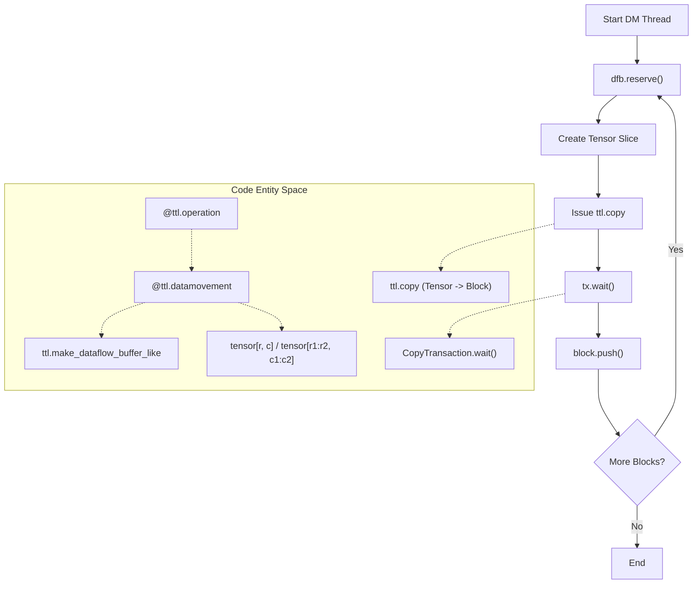
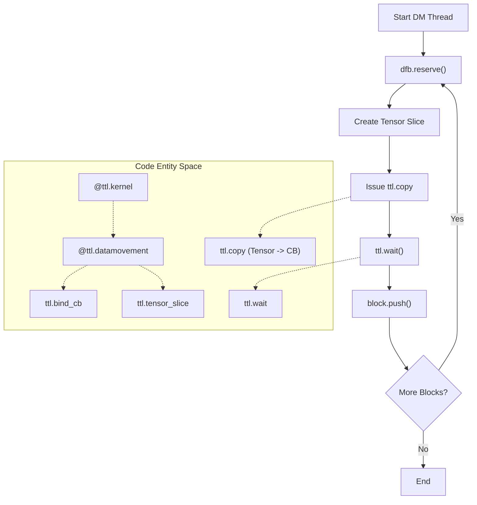
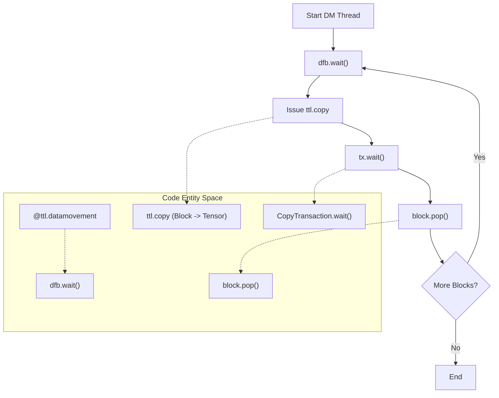

# Data Movement Patterns

Relevant source files
*   [docs/LOWERING_MULTITILE.md](https://github.com/tenstorrent/tt-lang/blob/d76e6233/docs/LOWERING_MULTITILE.md?plain=1)
*   [test/ttlang/Translate/TTLToCpp/cb_to_tensor_single_tile_write.mlir](https://github.com/tenstorrent/tt-lang/blob/d76e6233/test/ttlang/Translate/TTLToCpp/cb_to_tensor_single_tile_write.mlir)
*   [test/ttlang/Translate/TTLToCpp/dma_batched_single_tile.mlir](https://github.com/tenstorrent/tt-lang/blob/d76e6233/test/ttlang/Translate/TTLToCpp/dma_batched_single_tile.mlir)
*   [test/ttlang/Translate/TTLToCpp/dma_loop_multi_tile_nontrivial_cb.mlir](https://github.com/tenstorrent/tt-lang/blob/d76e6233/test/ttlang/Translate/TTLToCpp/dma_loop_multi_tile_nontrivial_cb.mlir)
*   [test/ttlang/Translate/TTLToCpp/dma_loop_single_tile.mlir](https://github.com/tenstorrent/tt-lang/blob/d76e6233/test/ttlang/Translate/TTLToCpp/dma_loop_single_tile.mlir)
*   [test/ttlang/Translate/TTLToCpp/dma_multi_tile_batched_in_user_loop.mlir](https://github.com/tenstorrent/tt-lang/blob/d76e6233/test/ttlang/Translate/TTLToCpp/dma_multi_tile_batched_in_user_loop.mlir)
*   [test/ttlang/Translate/TTLToCpp/dma_multi_tile_read.mlir](https://github.com/tenstorrent/tt-lang/blob/d76e6233/test/ttlang/Translate/TTLToCpp/dma_multi_tile_read.mlir)
*   [test/ttlang/Translate/TTLToCpp/dma_multi_tile_same_layout_different_cb.mlir](https://github.com/tenstorrent/tt-lang/blob/d76e6233/test/ttlang/Translate/TTLToCpp/dma_multi_tile_same_layout_different_cb.mlir)
*   [test/ttlang/Translate/TTLToCpp/dma_single_tile_read.mlir](https://github.com/tenstorrent/tt-lang/blob/d76e6233/test/ttlang/Translate/TTLToCpp/dma_single_tile_read.mlir)
*   [test/ttlang/Translate/TTLToCpp/loopback_full_single_tile.mlir](https://github.com/tenstorrent/tt-lang/blob/d76e6233/test/ttlang/Translate/TTLToCpp/loopback_full_single_tile.mlir)

This page describes common patterns for moving data in `tt-lang` kernels, focusing on reader and writer thread implementations, streaming techniques, tensor slicing, and pipelining. These patterns are the building blocks for implementing efficient data movement operations in `@ttl.datamovement()` decorated functions.

The programming model of `tt-lang` is centered around explicit specification of data movement and compute threads and explicit synchronization between them. This allows fine-grained control of the execution schedule and its performance implications.

## Core Data Movement Abstractions

Data movement in `tt-lang` relies on several key abstractions that bridge the gap between high-level Python and hardware-specific operations:

| Entity | Description | Code Reference |
| --- | --- | --- |
| **Dataflow Buffer (DFB)** | Also known as Circular Buffer (CB). A managed memory region in L1 for inter-thread communication. | [test/ttlang/Translate/TTLToCpp/dma_multi_tile_read.mlir 50](https://github.com/tenstorrent/tt-lang/blob/d76e6233/test/ttlang/Translate/TTLToCpp/dma_multi_tile_read.mlir#L50-L50) |
| **Block** | A rectangular grid of tiles within a DFB. It is the unit of reservation, waiting, and copying. | [test/ttlang/Translate/TTLToCpp/dma_loop_multi_tile_nontrivial_cb.mlir 101-102](https://github.com/tenstorrent/tt-lang/blob/d76e6233/test/ttlang/Translate/TTLToCpp/dma_loop_multi_tile_nontrivial_cb.mlir#L101-L102) |
| **Tensor Slice** | A view of a subset of a tensor, used as a source or destination for copy operations. | [test/ttlang/Translate/TTLToCpp/dma_multi_tile_read.mlir 51](https://github.com/tenstorrent/tt-lang/blob/d76e6233/test/ttlang/Translate/TTLToCpp/dma_multi_tile_read.mlir#L51-L51) |
| **Transfer Handle** | An object returned by `ttl.copy` used to synchronize asynchronous data transfers via `ttl.wait`. | [test/ttlang/Translate/TTLToCpp/dma_multi_tile_read.mlir 52-53](https://github.com/tenstorrent/tt-lang/blob/d76e6233/test/ttlang/Translate/TTLToCpp/dma_multi_tile_read.mlir#L52-L53) |

### Data Movement Thread Roles

A standard `tt-lang` kernel typically defines three threads:

1.   **DM0 (Reader)**: Usually maps to the **BRISC** processor. Responsible for moving data from DRAM/L1 tensors into DFBs. [test/ttlang/Translate/TTLToCpp/dma_multi_tile_read.mlir 48](https://github.com/tenstorrent/tt-lang/blob/d76e6233/test/ttlang/Translate/TTLToCpp/dma_multi_tile_read.mlir#L48-L48)
2.   **Compute**: Maps to the **TRISC** processors. Performs math operations on data in DFBs. [docs/LOWERING_MULTITILE.md 39](https://github.com/tenstorrent/tt-lang/blob/d76e6233/docs/LOWERING_MULTITILE.md?plain=1#L39-L39)
3.   **DM1 (Writer)**: Usually maps to the **NCRISC** processor. Responsible for moving results from DFBs back to tensors. [test/ttlang/Translate/TTLToCpp/cb_to_tensor_single_tile_write.mlir 25](https://github.com/tenstorrent/tt-lang/blob/d76e6233/test/ttlang/Translate/TTLToCpp/cb_to_tensor_single_tile_write.mlir#L25-L25)

**Sources:**[test/ttlang/Translate/TTLToCpp/dma_multi_tile_read.mlir 48-53](https://github.com/tenstorrent/tt-lang/blob/d76e6233/test/ttlang/Translate/TTLToCpp/dma_multi_tile_read.mlir#L48-L53)[docs/LOWERING_MULTITILE.md 39](https://github.com/tenstorrent/tt-lang/blob/d76e6233/docs/LOWERING_MULTITILE.md?plain=1#L39-L39)[test/ttlang/Translate/TTLToCpp/cb_to_tensor_single_tile_write.mlir 25](https://github.com/tenstorrent/tt-lang/blob/d76e6233/test/ttlang/Translate/TTLToCpp/cb_to_tensor_single_tile_write.mlir#L25-L25)

## Reader Pattern (Tensor to DFB)

The **reader pattern** is the standard approach for loading data from tensors into dataflow buffers. This is typically implemented in a `@ttl.datamovement()` function.

### Basic Reader Flow

Title: Reader Thread Dataflow

**Sources:**[test/ttlang/Translate/TTLToCpp/dma_multi_tile_read.mlir 48-53](https://github.com/tenstorrent/tt-lang/blob/d76e6233/test/ttlang/Translate/TTLToCpp/dma_multi_tile_read.mlir#L48-L53)[test/ttlang/Translate/TTLToCpp/dma_loop_multi_tile_nontrivial_cb.mlir 106-113](https://github.com/tenstorrent/tt-lang/blob/d76e6233/test/ttlang/Translate/TTLToCpp/dma_loop_multi_tile_nontrivial_cb.mlir#L106-L113)

### Implementation Mechanics

When `ttl.copy` is called from a tensor to a `CB`, the system lowers this to specific hardware instructions during compilation.

*   **Multi-Tile Lowering**: For multi-tile transfers, the compiler generates nested loops in C++ that iterate through the requested tile range [test/ttlang/Translate/TTLToCpp/dma_multi_tile_read.mlir 29-30](https://github.com/tenstorrent/tt-lang/blob/d76e6233/test/ttlang/Translate/TTLToCpp/dma_multi_tile_read.mlir#L29-L30)
*   **Indexing**: Tile offsets are calculated using row-major ordering: `tile_y * tiles_x + tile_x`[test/ttlang/Translate/TTLToCpp/dma_multi_tile_read.mlir 10](https://github.com/tenstorrent/tt-lang/blob/d76e6233/test/ttlang/Translate/TTLToCpp/dma_multi_tile_read.mlir#L10-L10)
*   **Address Computation**: Destination L1 addresses are computed as `cb_ptr + tile_offset * page_size`[test/ttlang/Translate/TTLToCpp/dma_multi_tile_read.mlir 33-35](https://github.com/tenstorrent/tt-lang/blob/d76e6233/test/ttlang/Translate/TTLToCpp/dma_multi_tile_read.mlir#L33-L35)
*   **Hardware Mapping**: At the MLIR level, `ttl.copy` is lowered to `noc_async_read_tile` calls in the generated C++ code [test/ttlang/Translate/TTLToCpp/dma_multi_tile_read.mlir 41](https://github.com/tenstorrent/tt-lang/blob/d76e6233/test/ttlang/Translate/TTLToCpp/dma_multi_tile_read.mlir#L41-L41)

## Writer Pattern (DFB to Tensor)

The **writer pattern** extracts results from dataflow buffers and writes them to output tensors.

### Basic Writer Flow

Title: Writer Thread Dataflow

**Sources:**[test/ttlang/Translate/TTLToCpp/cb_to_tensor_single_tile_write.mlir 25-31](https://github.com/tenstorrent/tt-lang/blob/d76e6233/test/ttlang/Translate/TTLToCpp/cb_to_tensor_single_tile_write.mlir#L25-L31)[test/ttlang/Translate/TTLToCpp/loopback_full_single_tile.mlir 46-51](https://github.com/tenstorrent/tt-lang/blob/d76e6233/test/ttlang/Translate/TTLToCpp/loopback_full_single_tile.mlir#L46-L51)

### Implementation Mechanics

*   **Synchronization**: The `ttl.wait` call ensures the transfer is complete before proceeding. In C++, this maps to a `noc_async_write_barrier`[test/ttlang/Translate/TTLToCpp/cb_to_tensor_single_tile_write.mlir 21](https://github.com/tenstorrent/tt-lang/blob/d76e6233/test/ttlang/Translate/TTLToCpp/cb_to_tensor_single_tile_write.mlir#L21-L21)
*   **Access Control**: The writer uses `get_read_ptr()` to access the source data in the Circular Buffer [test/ttlang/Translate/TTLToCpp/cb_to_tensor_single_tile_write.mlir 20](https://github.com/tenstorrent/tt-lang/blob/d76e6233/test/ttlang/Translate/TTLToCpp/cb_to_tensor_single_tile_write.mlir#L20-L20)
*   **Hardware Mapping**: In the generated C++, this becomes `noc_async_write_tile` followed by a `noc_async_write_barrier`[test/ttlang/Translate/TTLToCpp/cb_to_tensor_single_tile_write.mlir 20-21](https://github.com/tenstorrent/tt-lang/blob/d76e6233/test/ttlang/Translate/TTLToCpp/cb_to_tensor_single_tile_write.mlir#L20-L21)

## Efficient Data Movement Techniques

### Tensor Slicing and Multi-Tile Transfers

Tensors are often processed in chunks (blocks). `tt-lang` uses `ttl.tensor_slice` to define sub-regions for `ttl.copy`[test/ttlang/Translate/TTLToCpp/dma_multi_tile_read.mlir 51](https://github.com/tenstorrent/tt-lang/blob/d76e6233/test/ttlang/Translate/TTLToCpp/dma_multi_tile_read.mlir#L51-L51)

*   **Single Tile**: A slice can represent a single 32x32 tile [test/ttlang/Translate/TTLToCpp/dma_single_tile_read.mlir 28](https://github.com/tenstorrent/tt-lang/blob/d76e6233/test/ttlang/Translate/TTLToCpp/dma_single_tile_read.mlir#L28-L28)
*   **Tile Block**: Slices can also represent rectangular grids (e.g., 2x2 tiles) [test/ttlang/Translate/TTLToCpp/dma_multi_tile_read.mlir 51](https://github.com/tenstorrent/tt-lang/blob/d76e6233/test/ttlang/Translate/TTLToCpp/dma_multi_tile_read.mlir#L51-L51)
*   **Layout Independence**: Tile loop bounds are determined by the tensor layout, even if the destination CB has a different shape [test/ttlang/Translate/TTLToCpp/dma_multi_tile_same_layout_different_cb.mlir 13-14](https://github.com/tenstorrent/tt-lang/blob/d76e6233/test/ttlang/Translate/TTLToCpp/dma_multi_tile_same_layout_different_cb.mlir#L13-L14)

### Double-Buffering (`block_count`)

To overlap data movement with computation, `block_count=2` is typically used when binding a CB [test/ttlang/Translate/TTLToCpp/dma_multi_tile_read.mlir 50](https://github.com/tenstorrent/tt-lang/blob/d76e6233/test/ttlang/Translate/TTLToCpp/dma_multi_tile_read.mlir#L50-L50)

*   **Pipelining**: A common pattern is to issue a copy for the _next_ iteration before waiting for the _current_ iteration to finish [test/ttlang/Translate/TTLToCpp/dma_loop_single_tile.mlir 43-46](https://github.com/tenstorrent/tt-lang/blob/d76e6233/test/ttlang/Translate/TTLToCpp/dma_loop_single_tile.mlir#L43-L46)
*   **Functional Loop**: In MLIR, this is often represented as an `scf.for` loop where the transfer handle is passed as an `iter_arg`[test/ttlang/Translate/TTLToCpp/dma_loop_single_tile.mlir 44-48](https://github.com/tenstorrent/tt-lang/blob/d76e6233/test/ttlang/Translate/TTLToCpp/dma_loop_single_tile.mlir#L44-L48)

### Batching Transfers

When multiple independent transfers are issued before a barrier, the compiler can optimize the synchronization.

*   **Deduplication**: Consecutive `wait` calls on different handles are deduplicated to a single `noc.async_read_barrier` in the final C++ code [test/ttlang/Translate/TTLToCpp/dma_batched_single_tile.mlir 29-30](https://github.com/tenstorrent/tt-lang/blob/d76e6233/test/ttlang/Translate/TTLToCpp/dma_batched_single_tile.mlir#L29-L30)
*   **Batching in Loops**: Multiple copies can be issued within a user loop before a single barrier to improve throughput [test/ttlang/Translate/TTLToCpp/dma_multi_tile_batched_in_user_loop.mlir 114-121](https://github.com/tenstorrent/tt-lang/blob/d76e6233/test/ttlang/Translate/TTLToCpp/dma_multi_tile_batched_in_user_loop.mlir#L114-L121)

### Large Tensor Streaming

When processing tensors that are much larger than L1 memory, kernels use a streaming pattern where small blocks are moved through DFBs in a loop.

*   **L1 Residency**: Only a subset of the tensor (the "block") is resident in L1 at any time [docs/LOWERING_MULTITILE.md 12-14](https://github.com/tenstorrent/tt-lang/blob/d76e6233/docs/LOWERING_MULTITILE.md?plain=1#L12-L14)
*   **Subblocking**: The `ttl-lower-to-loops` pass materializes `ttl.compute` into explicit nested `scf.for` loops based on the block shape [docs/LOWERING_MULTITILE.md 130-136](https://github.com/tenstorrent/tt-lang/blob/d76e6233/docs/LOWERING_MULTITILE.md?plain=1#L130-L136)

## Summary of Patterns

| Pattern | Source | Destination | Synchronization | Typical Use |
| --- | --- | --- | --- | --- |
| **Streaming** | DRAM Tensor | L1 CB | `ttl.wait` | Loading large inputs in chunks [test/ttlang/Translate/TTLToCpp/dma_loop_multi_tile_nontrivial_cb.mlir 106-113](https://github.com/tenstorrent/tt-lang/blob/d76e6233/test/ttlang/Translate/TTLToCpp/dma_loop_multi_tile_nontrivial_cb.mlir#L106-L113) |
| **Double-Buffering** | Tensor | CB (`block_count=2`) | Pipelined `copy/wait` | Overlapping IO and Compute [test/ttlang/Translate/TTLToCpp/dma_loop_single_tile.mlir 43-46](https://github.com/tenstorrent/tt-lang/blob/d76e6233/test/ttlang/Translate/TTLToCpp/dma_loop_single_tile.mlir#L43-L46) |
| **Batched DMA** | Multiple Tensors | Multiple CBs | Single Barrier | Parallelizing NOC reads [test/ttlang/Translate/TTLToCpp/dma_batched_single_tile.mlir 23-30](https://github.com/tenstorrent/tt-lang/blob/d76e6233/test/ttlang/Translate/TTLToCpp/dma_batched_single_tile.mlir#L23-L30) |
| **Loopback** | DRAM (Src) | DRAM (Dst) | Read then Write | Simple data movement kernels [test/ttlang/Translate/TTLToCpp/loopback_full_single_tile.mlir 46-51](https://github.com/tenstorrent/tt-lang/blob/d76e6233/test/ttlang/Translate/TTLToCpp/loopback_full_single_tile.mlir#L46-L51) |

**Sources:**[test/ttlang/Translate/TTLToCpp/dma_multi_tile_read.mlir 6-56](https://github.com/tenstorrent/tt-lang/blob/d76e6233/test/ttlang/Translate/TTLToCpp/dma_multi_tile_read.mlir#L6-L56)[test/ttlang/Translate/TTLToCpp/loopback_full_single_tile.mlir 6-55](https://github.com/tenstorrent/tt-lang/blob/d76e6233/test/ttlang/Translate/TTLToCpp/loopback_full_single_tile.mlir#L6-L55)[test/ttlang/Translate/TTLToCpp/dma_batched_single_tile.mlir 6-46](https://github.com/tenstorrent/tt-lang/blob/d76e6233/test/ttlang/Translate/TTLToCpp/dma_batched_single_tile.mlir#L6-L46)[test/ttlang/Translate/TTLToCpp/dma_loop_single_tile.mlir 6-52](https://github.com/tenstorrent/tt-lang/blob/d76e6233/test/ttlang/Translate/TTLToCpp/dma_loop_single_tile.mlir#L6-L52)[docs/LOWERING_MULTITILE.md 130-156](https://github.com/tenstorrent/tt-lang/blob/d76e6233/docs/LOWERING_MULTITILE.md?plain=1#L130-L156)

Dismiss
Refresh this wiki

Enter email to refresh
