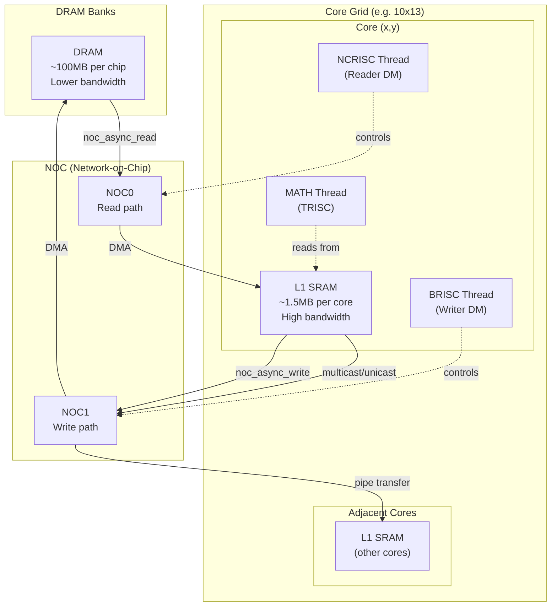
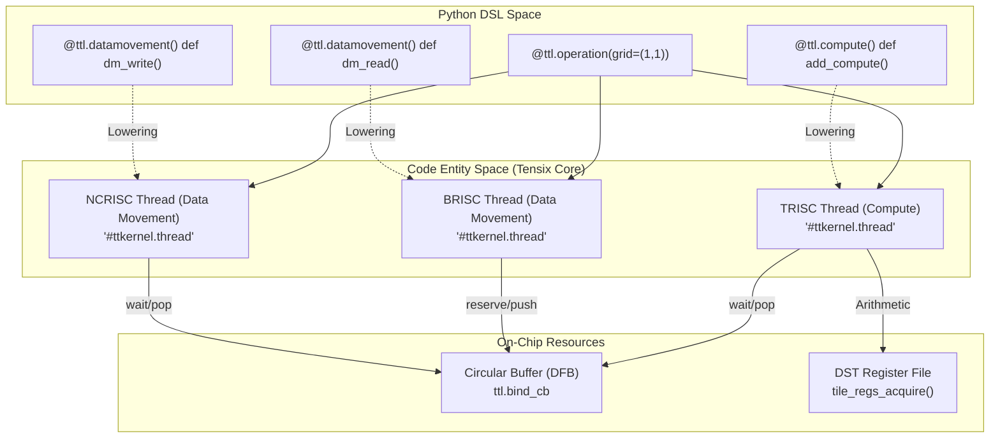
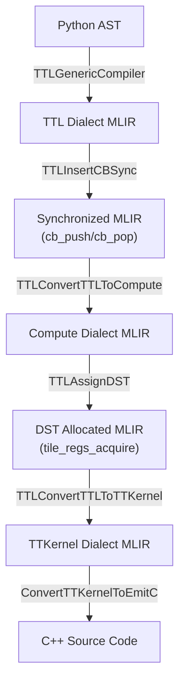

# Single-core Execution

Relevant source files
*   [include/ttlang/Dialect/TTL/Passes.td](https://github.com/tenstorrent/tt-lang/blob/d76e6233/include/ttlang/Dialect/TTL/Passes.td)
*   [lib/Dialect/TTL/Pipelines/TTLPipelines.cpp](https://github.com/tenstorrent/tt-lang/blob/d76e6233/lib/Dialect/TTL/Pipelines/TTLPipelines.cpp)
*   [lib/Dialect/TTL/Transforms/CMakeLists.txt](https://github.com/tenstorrent/tt-lang/blob/d76e6233/lib/Dialect/TTL/Transforms/CMakeLists.txt)
*   [python/ttl/_src/ttl_ast.py](https://github.com/tenstorrent/tt-lang/blob/d76e6233/python/ttl/_src/ttl_ast.py)
*   [python/ttl/ttl_api.py](https://github.com/tenstorrent/tt-lang/blob/d76e6233/python/ttl/ttl_api.py)
*   [test/me2e/builder/pipeline.py](https://github.com/tenstorrent/tt-lang/blob/d76e6233/test/me2e/builder/pipeline.py)
*   [test/python/simple_add.py](https://github.com/tenstorrent/tt-lang/blob/d76e6233/test/python/simple_add.py)
*   [test/python/simple_add_dram.py](https://github.com/tenstorrent/tt-lang/blob/d76e6233/test/python/simple_add_dram.py)
*   [test/python/simple_add_loop.py](https://github.com/tenstorrent/tt-lang/blob/d76e6233/test/python/simple_add_loop.py)
*   [test/python/simple_add_multitile.py](https://github.com/tenstorrent/tt-lang/blob/d76e6233/test/python/simple_add_multitile.py)
*   [test/python/simple_add_with_stmt.py](https://github.com/tenstorrent/tt-lang/blob/d76e6233/test/python/simple_add_with_stmt.py)
*   [test/python/test_dram_interleaved_add.py](https://github.com/tenstorrent/tt-lang/blob/d76e6233/test/python/test_dram_interleaved_add.py)
*   [test/python/test_ttnn_interop_add.py](https://github.com/tenstorrent/tt-lang/blob/d76e6233/test/python/test_ttnn_interop_add.py)

## Purpose and Scope

This document describes the fundamental execution model for tt-lang kernels running on a single Tensix core. It covers how compute and data movement threads coordinate via circular buffers, the producer-consumer synchronization protocol, and how Python DSL operations translate to hardware execution. For multi-core execution across multiple cores in a grid, see [Multi-core Grid Execution and Work Distribution](https://deepwiki.com/tenstorrent/tt-lang/2.4.2-multi-core-grid-execution-and-work-distribution).

## Overview

A single-core kernel is defined with `@ttl.operation(grid=(1, 1))` (or `@ttl.kernel`), indicating execution on one Tensix core [test/python/simple_add.py 26-27](https://github.com/tenstorrent/tt-lang/blob/d76e6233/test/python/simple_add.py#L26-L27) The kernel consists of three types of threads that execute concurrently:

1.   **Compute thread** (`@ttl.compute()`) - Performs tile-based arithmetic operations using DST registers [test/python/simple_add.py 32-33](https://github.com/tenstorrent/tt-lang/blob/d76e6233/test/python/simple_add.py#L32-L33)
2.   **Data movement read thread** (`@ttl.datamovement()`) - Transfers data from memory (DRAM/L1) into circular buffers [test/python/simple_add.py 43-44](https://github.com/tenstorrent/tt-lang/blob/d76e6233/test/python/simple_add.py#L43-L44)
3.   **Data movement write thread** (`@ttl.datamovement()`) - Transfers results from circular buffers back to memory [test/python/simple_add.py 57-58](https://github.com/tenstorrent/tt-lang/blob/d76e6233/test/python/simple_add.py#L57-L58)

These threads communicate exclusively through circular buffers (CBs), represented in the DSL as `DataflowBuffer` (DFB) objects created via `ttl.make_dataflow_buffer_like`[test/python/simple_add.py 28-30](https://github.com/tenstorrent/tt-lang/blob/d76e6233/test/python/simple_add.py#L28-L30) DFBs provide a producer-consumer synchronization mechanism with explicit `reserve`/`push` and `wait`/`pop` operations [test/python/simple_add.py 34-41](https://github.com/tenstorrent/tt-lang/blob/d76e6233/test/python/simple_add.py#L34-L41)

Sources: [test/python/simple_add.py 26-62](https://github.com/tenstorrent/tt-lang/blob/d76e6233/test/python/simple_add.py#L26-L62)[test/python/simple_add_dram.py 28-65](https://github.com/tenstorrent/tt-lang/blob/d76e6233/test/python/simple_add_dram.py#L28-L65)[python/ttl/ttl_api.py 98-117](https://github.com/tenstorrent/tt-lang/blob/d76e6233/python/ttl/ttl_api.py#L98-L117)




Sources: [python/ttl/ttl_api.py:98-98](), [benchmarks/matmul/config.py:76-78](), [benchmarks/matmul/NOTES.md:68-74]()
```
## Thread Execution Model

The diagram below illustrates the relationship between the high-level Python DSL constructs and the underlying hardware thread architecture.

**Diagram: DSL to Thread Mapping**

Sources: [test/python/simple_add.py 27-62](https://github.com/tenstorrent/tt-lang/blob/d76e6233/test/python/simple_add.py#L27-L62)[test/python/simple_add.py 70-75](https://github.com/tenstorrent/tt-lang/blob/d76e6233/test/python/simple_add.py#L70-L75)[test/python/simple_add.py 104](https://github.com/tenstorrent/tt-lang/blob/d76e6233/test/python/simple_add.py#L104-L104)[python/ttl/ttl_api.py 98-117](https://github.com/tenstorrent/tt-lang/blob/d76e6233/python/ttl/ttl_api.py#L98-L117)



Sources: [test/python/simple_add.py:27-62](), [test/python/simple_add.py:70-75](), [test/python/simple_add.py:104-104](), [python/ttl/ttl_api.py:98-117]()
```
### Thread Attributes in Generated MLIR

Each thread function is compiled to a separate MLIR function with distinct attributes that guide the backend:

*   **Compute thread**: `ttl.kernel_thread = #ttkernel.thread<compute>`[test/python/simple_add.py 70](https://github.com/tenstorrent/tt-lang/blob/d76e6233/test/python/simple_add.py#L70-L70)
*   **Data movement thread**: `ttl.kernel_thread = #ttkernel.thread<noc>`[test/python/simple_add.py 104](https://github.com/tenstorrent/tt-lang/blob/d76e6233/test/python/simple_add.py#L104-L104)

MLIR example from a compiled kernel:

`func.func @add_compute() attributes {  ttl.kernel_thread = #ttkernel.thread<compute>,  ttl.base_cta_index = 3 : i32}`
Sources: [test/python/simple_add.py 69-70](https://github.com/tenstorrent/tt-lang/blob/d76e6233/test/python/simple_add.py#L69-L70)[test/python/simple_add.py 101-104](https://github.com/tenstorrent/tt-lang/blob/d76e6233/test/python/simple_add.py#L101-L104)[python/ttl/ttl_api.py 98-117](https://github.com/tenstorrent/tt-lang/blob/d76e6233/python/ttl/ttl_api.py#L98-L117)

## Circular Buffer Synchronization Protocol

Circular buffers implement a producer-consumer queue. The protocol ensures data is never read before it is written and buffer space is not overwritten before it is consumed.

### CB Operations

| Operation | Thread Role | Purpose | Generated C++ Hardware Call |
| --- | --- | --- | --- |
| `reserve()` | Producer | Acquire space for writing | `cb_reserve_back(cb_id, n_tiles)` |
| `push()` | Producer | Commit written data to consumer | `cb_push_back(cb_id, n_tiles)` |
| `wait()` | Consumer | Block until data is available | `cb_wait_front(cb_id, n_tiles)` |
| `pop()` | Consumer | Release consumed data space | `cb_pop_front(cb_id, n_tiles)` |

Sources: [test/python/simple_add.py 144-148](https://github.com/tenstorrent/tt-lang/blob/d76e6233/test/python/simple_add.py#L144-L148)[test/python/simple_add.py 171-173](https://github.com/tenstorrent/tt-lang/blob/d76e6233/test/python/simple_add.py#L171-L173)[include/ttlang/Dialect/TTL/Passes.td 6-23](https://github.com/tenstorrent/tt-lang/blob/d76e6233/include/ttlang/Dialect/TTL/Passes.td#L6-L23)

### Automatic Lifecycle with `with` Statements

The DSL supports a `with` statement pattern for DFBs, which automatically handles the synchronization sequence [test/python/simple_add_with_stmt.py 43-46](https://github.com/tenstorrent/tt-lang/blob/d76e6233/test/python/simple_add_with_stmt.py#L43-L46)

*   **Entry**: Calls `wait()` or `reserve()`[test/python/simple_add_with_stmt.py 83-87](https://github.com/tenstorrent/tt-lang/blob/d76e6233/test/python/simple_add_with_stmt.py#L83-L87)
*   **Exit**: Calls `pop()` or `push()` automatically in reverse order of acquisition [test/python/simple_add_with_stmt.py 96-98](https://github.com/tenstorrent/tt-lang/blob/d76e6233/test/python/simple_add_with_stmt.py#L96-L98)

The `TTLInsertCBSync` pass ensures that even if explicit `push`/`pop` are missing in MLIR, they are inserted after the last operation accessing the CB data [include/ttlang/Dialect/TTL/Passes.td 6-23](https://github.com/tenstorrent/tt-lang/blob/d76e6233/include/ttlang/Dialect/TTL/Passes.td#L6-L23)

Sources: [test/python/simple_add_with_stmt.py 43-68](https://github.com/tenstorrent/tt-lang/blob/d76e6233/test/python/simple_add_with_stmt.py#L43-L68)[include/ttlang/Dialect/TTL/Passes.td 6-23](https://github.com/tenstorrent/tt-lang/blob/d76e6233/include/ttlang/Dialect/TTL/Passes.td#L6-L23)

## Execution Flow and Compilation Pipeline

The compilation from Python DSL to executable C++ involves several passes that coordinate thread synchronization.

**Diagram: Single-Core Compilation Pipeline**

Sources: [lib/Dialect/TTL/Pipelines/TTLPipelines.cpp 19-76](https://github.com/tenstorrent/tt-lang/blob/d76e6233/lib/Dialect/TTL/Pipelines/TTLPipelines.cpp#L19-L76)[test/me2e/builder/pipeline.py 18-93](https://github.com/tenstorrent/tt-lang/blob/d76e6233/test/me2e/builder/pipeline.py#L18-L93)



Sources: [lib/Dialect/TTL/Pipelines/TTLPipelines.cpp:19-76](), [test/me2e/builder/pipeline.py:18-93]()
```
## Compute Execution Modes: FPU vs SFPU

The compute thread can execute operations using either the **FPU** (Floating Point Unit) for high-throughput binary operations or the **SFPU** (Special Floating Point Unit) for unary/complex operations [test/python/simple_add.py 150-158](https://github.com/tenstorrent/tt-lang/blob/d76e6233/test/python/simple_add.py#L150-L158)

1.   **FPU Binary Path**: Optimized for `add`, `sub`, `mul`. Data is read directly from CBs into the FPU [test/python/simple_add.py 156-158](https://github.com/tenstorrent/tt-lang/blob/d76e6233/test/python/simple_add.py#L156-L158)
    *   Calls `binary_op_init_common()` and `add_tiles()`[test/python/simple_add.py 151-158](https://github.com/tenstorrent/tt-lang/blob/d76e6233/test/python/simple_add.py#L151-L158)

2.   **SFPU Path**: Used for unary ops or when FPU binary is disabled [test/python/simple_add.py 148-151](https://github.com/tenstorrent/tt-lang/blob/d76e6233/test/python/simple_add.py#L148-L151)
    *   Calls `init_sfpu()` and `add_binary_tile()`[test/python/simple_add_dram.py 140-145](https://github.com/tenstorrent/tt-lang/blob/d76e6233/test/python/simple_add_dram.py#L140-L145)

Sources: [test/python/simple_add.py 150-163](https://github.com/tenstorrent/tt-lang/blob/d76e6233/test/python/simple_add.py#L150-L163)[test/python/simple_add_dram.py 133-154](https://github.com/tenstorrent/tt-lang/blob/d76e6233/test/python/simple_add_dram.py#L133-L154)[test/python/simple_add_loop.py 122-150](https://github.com/tenstorrent/tt-lang/blob/d76e6233/test/python/simple_add_loop.py#L122-L150)

## Data Movement and Memory Hierarchy

Single-core kernels interact with two primary memory tiers:

*   **DRAM**: Tensors reside here by default for large data [test/python/simple_add_dram.py 13-17](https://github.com/tenstorrent/tt-lang/blob/d76e6233/test/python/simple_add_dram.py#L13-L17)
*   **L1**: Per-core local memory where Circular Buffers are allocated [test/python/simple_add.py 102](https://github.com/tenstorrent/tt-lang/blob/d76e6233/test/python/simple_add.py#L102-L102)

The data movement threads use `ttl.copy` which lowers to `noc_async_read_tile` and `noc_async_write_tile` to move data between DRAM/L1 and the L1-resident Circular Buffers [test/python/simple_add.py 187](https://github.com/tenstorrent/tt-lang/blob/d76e6233/test/python/simple_add.py#L187-L187)[test/python/simple_add.py 205](https://github.com/tenstorrent/tt-lang/blob/d76e6233/test/python/simple_add.py#L205-L205) The `TTLInsertCopyWait` pass ensures that every `ttl.copy` is followed by a `ttl.wait` (noc barrier) if not explicitly provided [include/ttlang/Dialect/TTL/Passes.td 108-115](https://github.com/tenstorrent/tt-lang/blob/d76e6233/include/ttlang/Dialect/TTL/Passes.td#L108-L115)

Sources: [test/python/simple_add.py 179-190](https://github.com/tenstorrent/tt-lang/blob/d76e6233/test/python/simple_add.py#L179-L190)[test/python/simple_add_dram.py 160-170](https://github.com/tenstorrent/tt-lang/blob/d76e6233/test/python/simple_add_dram.py#L160-L170)[include/ttlang/Dialect/TTL/Passes.td 108-115](https://github.com/tenstorrent/tt-lang/blob/d76e6233/include/ttlang/Dialect/TTL/Passes.td#L108-L115)

## Control Flow in Kernels

Single-core execution supports standard Python control flow like `for` loops within the `@ttl.compute` and `@ttl.datamovement` blocks [test/python/simple_add_loop.py 39-40](https://github.com/tenstorrent/tt-lang/blob/d76e6233/test/python/simple_add_loop.py#L39-L40) These are lowered to `scf.for` loops in MLIR and subsequently to C++ loops [test/python/simple_add_loop.py 73-74](https://github.com/tenstorrent/tt-lang/blob/d76e6233/test/python/simple_add_loop.py#L73-L74)[test/python/simple_add_loop.py 103](https://github.com/tenstorrent/tt-lang/blob/d76e6233/test/python/simple_add_loop.py#L103-L103)

When loops involve accumulation (e.g., `out_blk += r`), the compiler uses the `TTKernelInsertL1Accumulation` pass to insert `pack_reconfig_l1_acc` guards, ensuring the hardware packer accumulates into L1 rather than overwriting [include/ttlang/Dialect/TTL/Passes.td 143-165](https://github.com/tenstorrent/tt-lang/blob/d76e6233/include/ttlang/Dialect/TTL/Passes.td#L143-L165)

Sources: [test/python/simple_add_loop.py 28-62](https://github.com/tenstorrent/tt-lang/blob/d76e6233/test/python/simple_add_loop.py#L28-L62)[include/ttlang/Dialect/TTL/Passes.td 143-172](https://github.com/tenstorrent/tt-lang/blob/d76e6233/include/ttlang/Dialect/TTL/Passes.td#L143-L172)

Dismiss
Refresh this wiki

Enter email to refresh
