# Compilation Pipeline

Relevant source files
*   [include/ttlang/Dialect/TTL/IR/TTL.h](https://github.com/tenstorrent/tt-lang/blob/d76e6233/include/ttlang/Dialect/TTL/IR/TTL.h)
*   [include/ttlang/Dialect/TTL/IR/TTLOps.td](https://github.com/tenstorrent/tt-lang/blob/d76e6233/include/ttlang/Dialect/TTL/IR/TTLOps.td)
*   [include/ttlang/Dialect/TTL/IR/TTLOpsUtils.h](https://github.com/tenstorrent/tt-lang/blob/d76e6233/include/ttlang/Dialect/TTL/IR/TTLOpsUtils.h)
*   [include/ttlang/Dialect/TTL/Passes.td](https://github.com/tenstorrent/tt-lang/blob/d76e6233/include/ttlang/Dialect/TTL/Passes.td)
*   [lib/Dialect/TTL/IR/TTLOps.cpp](https://github.com/tenstorrent/tt-lang/blob/d76e6233/lib/Dialect/TTL/IR/TTLOps.cpp)
*   [lib/Dialect/TTL/Pipelines/TTLPipelines.cpp](https://github.com/tenstorrent/tt-lang/blob/d76e6233/lib/Dialect/TTL/Pipelines/TTLPipelines.cpp)
*   [lib/Dialect/TTL/Transforms/CMakeLists.txt](https://github.com/tenstorrent/tt-lang/blob/d76e6233/lib/Dialect/TTL/Transforms/CMakeLists.txt)
*   [lib/Dialect/TTL/Transforms/ConvertTTLTileOpsToTTKernel.cpp](https://github.com/tenstorrent/tt-lang/blob/d76e6233/lib/Dialect/TTL/Transforms/ConvertTTLTileOpsToTTKernel.cpp)
*   [lib/Dialect/TTL/Transforms/ConvertTTLToCompute.cpp](https://github.com/tenstorrent/tt-lang/blob/d76e6233/lib/Dialect/TTL/Transforms/ConvertTTLToCompute.cpp)
*   [lib/Dialect/TTL/Transforms/ConvertTTLToTTKernel.cpp](https://github.com/tenstorrent/tt-lang/blob/d76e6233/lib/Dialect/TTL/Transforms/ConvertTTLToTTKernel.cpp)
*   [python/ttl/_src/ttl_ast.py](https://github.com/tenstorrent/tt-lang/blob/d76e6233/python/ttl/_src/ttl_ast.py)
*   [python/ttl/operators.py](https://github.com/tenstorrent/tt-lang/blob/d76e6233/python/ttl/operators.py)
*   [python/ttl/ttl_api.py](https://github.com/tenstorrent/tt-lang/blob/d76e6233/python/ttl/ttl_api.py)
*   [test/me2e/builder/pipeline.py](https://github.com/tenstorrent/tt-lang/blob/d76e6233/test/me2e/builder/pipeline.py)

This page provides a comprehensive technical overview of the tt-lang compilation pipeline, which transforms Python kernel definitions into C++ code for execution on Tenstorrent hardware. The pipeline consists of multiple stages: Python AST to MLIR TTL dialect, TTL transformations, TTL to TTKernel conversion, and final C++ code generation.

For information about writing kernels using the Python DSL, see [Python DSL Fundamentals](https://deepwiki.com/tenstorrent/tt-lang/2.1-python-dsl-fundamentals). For details about the MLIR dialect specifications, see [MLIR Dialect Reference](https://deepwiki.com/tenstorrent/tt-lang/11-mlir-dialect-reference).

## Pipeline Overview

The tt-lang compilation pipeline operates in distinct stages, each responsible for progressively lowering abstractions from high-level Python to hardware-executable C++ code.

### System Architecture to Code Entity Mapping
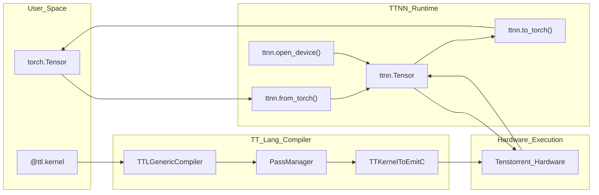


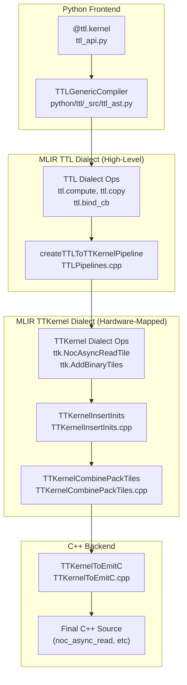


The following diagram associates the logical stages of the compilation pipeline with the specific code entities that implement them.

**Sources:**[python/ttl/ttl_api.py 39-68](https://github.com/tenstorrent/tt-lang/blob/d76e6233/python/ttl/ttl_api.py#L39-L68)[lib/Dialect/TTL/Pipelines/TTLPipelines.cpp 19-75](https://github.com/tenstorrent/tt-lang/blob/d76e6233/lib/Dialect/TTL/Pipelines/TTLPipelines.cpp#L19-L75)[python/ttl/_src/ttl_ast.py 128-168](https://github.com/tenstorrent/tt-lang/blob/d76e6233/python/ttl/_src/ttl_ast.py#L128-L168)

### Stage Boundaries

| Stage | Input | Output | Primary Component |
| --- | --- | --- | --- |
| AST Compilation | Python kernel source | TTL MLIR | `TTLGenericCompiler` |
| TTL Transforms | TTL MLIR | Transformed TTL MLIR | `createTTLToTTKernelPipeline` |
| TTL→TTKernel | TTL MLIR | TTKernel MLIR | `TTLConvertTTLToTTKernel` |
| Code Generation | TTKernel MLIR | C++ source | `ConvertTTKernelToEmitC` |

**Sources:**[lib/Dialect/TTL/Pipelines/TTLPipelines.cpp 19-75](https://github.com/tenstorrent/tt-lang/blob/d76e6233/lib/Dialect/TTL/Pipelines/TTLPipelines.cpp#L19-L75)[python/ttl/_src/ttl_ast.py 128-168](https://github.com/tenstorrent/tt-lang/blob/d76e6233/python/ttl/_src/ttl_ast.py#L128-L168)[include/ttlang/Dialect/TTL/Passes.td 120-141](https://github.com/tenstorrent/tt-lang/blob/d76e6233/include/ttlang/Dialect/TTL/Passes.td#L120-L141)

## Python AST to MLIR TTL

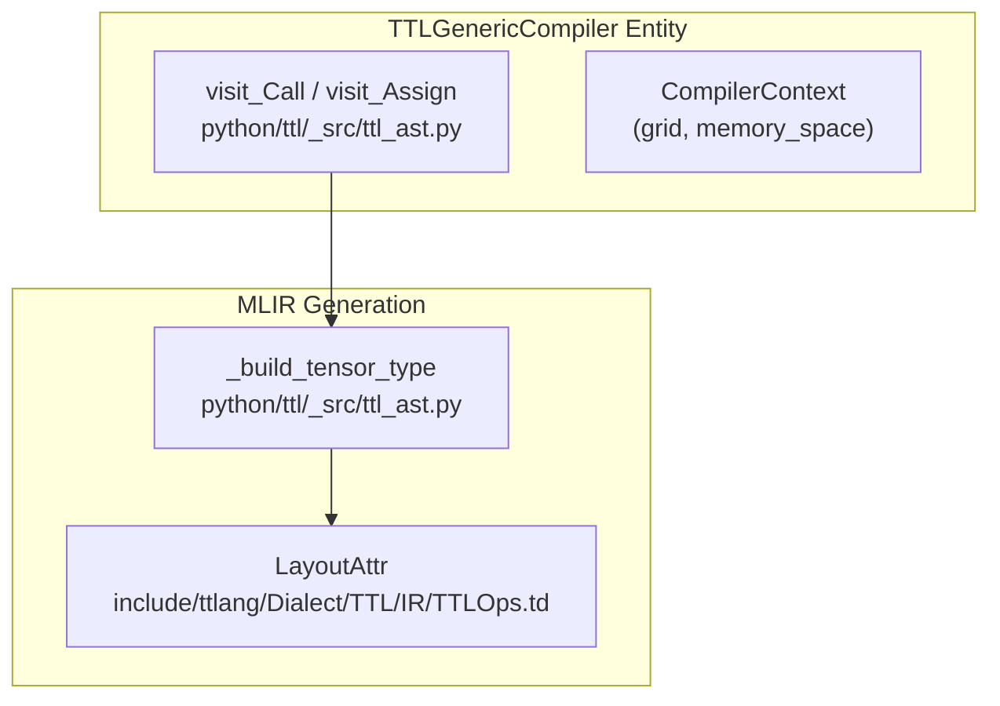


The `TTLGenericCompiler` class implements an AST visitor pattern to transform Python kernel functions into MLIR TTL dialect operations. For details, see [Python AST to Initial TTL MLIR](https://deepwiki.com/tenstorrent/tt-lang/3.2-python-ast-to-initial-ttl-mlir).

**Sources:**[python/ttl/_src/ttl_ast.py 128-200](https://github.com/tenstorrent/tt-lang/blob/d76e6233/python/ttl/_src/ttl_ast.py#L128-L200)[include/ttlang/Dialect/TTL/IR/TTLOps.td 79-112](https://github.com/tenstorrent/tt-lang/blob/d76e6233/include/ttlang/Dialect/TTL/IR/TTLOps.td#L79-L112)

### Key Compiler Components

**TTLGenericCompiler** ([python/ttl/_src/ttl_ast.py 128-168](https://github.com/tenstorrent/tt-lang/blob/d76e6233/python/ttl/_src/ttl_ast.py#L128-L168)):

*   Inherits from `TTCompilerBase`.
*   Maintains `CompilerContext` with grid configuration and memory space.
*   Supports debug locations and auto-profiling.

**visit_Assign** ([python/ttl/_src/ttl_ast.py 177-187](https://github.com/tenstorrent/tt-lang/blob/d76e6233/python/ttl/_src/ttl_ast.py#L177-L187)):

*   Handles variable assignment and updates the symbol table.
*   Special handling for `PipeNet` object names to aid diagnostics.

**_build_tensor_type** ([python/ttl/_src/ttl_ast.py 69-116](https://github.com/tenstorrent/tt-lang/blob/d76e6233/python/ttl/_src/ttl_ast.py#L69-L116)):

*   Constructs MLIR tensor types with `LayoutAttr` encoding.
*   Maps logical shapes to hardware-compatible tile grids.

**Sources:**[python/ttl/_src/ttl_ast.py 69-189](https://github.com/tenstorrent/tt-lang/blob/d76e6233/python/ttl/_src/ttl_ast.py#L69-L189)[include/ttlang/Dialect/TTL/IR/TTLOps.td 79-112](https://github.com/tenstorrent/tt-lang/blob/d76e6233/include/ttlang/Dialect/TTL/IR/TTLOps.td#L79-L112)

## TTL Dialect Operations

The TTL dialect provides operations for circular buffer management, data movement, and compute structuring. For details, see [TTL Dialect Specification](https://deepwiki.com/tenstorrent/tt-lang/11.1-ttl-dialect-specification).

**Circular Buffer Management**:

*   `ttl.bind_cb`: Declares hardware circular buffer slot usage [include/ttlang/Dialect/TTL/IR/TTLOps.td 26-51](https://github.com/tenstorrent/tt-lang/blob/d76e6233/include/ttlang/Dialect/TTL/IR/TTLOps.td#L26-L51)
*   `ttl.attach_cb`: Associates a tensor SSA value with a circular buffer for lowering [include/ttlang/Dialect/TTL/IR/TTLOps.td 53-78](https://github.com/tenstorrent/tt-lang/blob/d76e6233/include/ttlang/Dialect/TTL/IR/TTLOps.td#L53-L78)

**Data Movement**:

*   `ttl.copy`: Initiates asynchronous transfer between a tensor slice and a circular buffer [include/ttlang/Dialect/TTL/IR/TTLOps.td 122-162](https://github.com/tenstorrent/tt-lang/blob/d76e6233/include/ttlang/Dialect/TTL/IR/TTLOps.td#L122-L162)
*   `ttl.wait`: Blocks until the asynchronous transfer identified by a `!ttl.transfer_handle` is complete [include/ttlang/Dialect/TTL/IR/TTLOps.td 164-177](https://github.com/tenstorrent/tt-lang/blob/d76e6233/include/ttlang/Dialect/TTL/IR/TTLOps.td#L164-L177)

**Compute Operations**:

*   `ttl.compute`: Structured operation for tile-based computation, supporting fusion and subblocking [lib/Dialect/TTL/Transforms/ConvertTTLToCompute.cpp 156-175](https://github.com/tenstorrent/tt-lang/blob/d76e6233/lib/Dialect/TTL/Transforms/ConvertTTLToCompute.cpp#L156-L175)

**Sources:**[include/ttlang/Dialect/TTL/IR/TTLOps.td 26-177](https://github.com/tenstorrent/tt-lang/blob/d76e6233/include/ttlang/Dialect/TTL/IR/TTLOps.td#L26-L177)[lib/Dialect/TTL/Transforms/ConvertTTLToCompute.cpp 156-175](https://github.com/tenstorrent/tt-lang/blob/d76e6233/lib/Dialect/TTL/Transforms/ConvertTTLToCompute.cpp#L156-L175)

## TTL Dialect Transformations

The pipeline applies several passes to optimize the TTL IR before lowering. For details, see [TTL Dialect Transformations](https://deepwiki.com/tenstorrent/tt-lang/3.3-ttl-dialect-transformations).

**TTLPipelines** ([lib/Dialect/TTL/Pipelines/TTLPipelines.cpp 19-75](https://github.com/tenstorrent/tt-lang/blob/d76e6233/lib/Dialect/TTL/Pipelines/TTLPipelines.cpp#L19-L75)):

*   `TTLConvertTTLToCompute`: Fuses elementwise operations into compute blocks [lib/Dialect/TTL/Pipelines/TTLPipelines.cpp 29](https://github.com/tenstorrent/tt-lang/blob/d76e6233/lib/Dialect/TTL/Pipelines/TTLPipelines.cpp#L29-L29)
*   `TTLAssignDST`: Performs DST register allocation using linear scan with in-place merging [lib/Dialect/TTL/Pipelines/TTLPipelines.cpp 36](https://github.com/tenstorrent/tt-lang/blob/d76e6233/lib/Dialect/TTL/Pipelines/TTLPipelines.cpp#L36-L36)
*   `TTLSubblockComputeForDST`: Partitions compute operations to fit hardware DST capacity [lib/Dialect/TTL/Pipelines/TTLPipelines.cpp 41](https://github.com/tenstorrent/tt-lang/blob/d76e6233/lib/Dialect/TTL/Pipelines/TTLPipelines.cpp#L41-L41)
*   `TTLLowerToLoops`: Lowers computes to `scf.for` loops [lib/Dialect/TTL/Pipelines/TTLPipelines.cpp 47](https://github.com/tenstorrent/tt-lang/blob/d76e6233/lib/Dialect/TTL/Pipelines/TTLPipelines.cpp#L47-L47)
*   `TTLInsertCBSync`: Inserts missing `cb_push`/`cb_pop` for unmatched acquires [include/ttlang/Dialect/TTL/Passes.td 6-26](https://github.com/tenstorrent/tt-lang/blob/d76e6233/include/ttlang/Dialect/TTL/Passes.td#L6-L26)
*   `TTLCoalesceDFBAcquires`: Coalesces consecutive same-DFB acquires into multi-tile waits [include/ttlang/Dialect/TTL/Passes.td 28-106](https://github.com/tenstorrent/tt-lang/blob/d76e6233/include/ttlang/Dialect/TTL/Passes.td#L28-L106)

**Sources:**[lib/Dialect/TTL/Pipelines/TTLPipelines.cpp 19-75](https://github.com/tenstorrent/tt-lang/blob/d76e6233/lib/Dialect/TTL/Pipelines/TTLPipelines.cpp#L19-L75)[include/ttlang/Dialect/TTL/Passes.td 6-106](https://github.com/tenstorrent/tt-lang/blob/d76e6233/include/ttlang/Dialect/TTL/Passes.td#L6-L106)

## TTL to TTKernel Conversion

The conversion process lowers high-level TTL operations to the `TTKernel` dialect, which maps 1:1 with Tenstorrent's hardware APIs. For details, see [TTL to TTKernel Conversion](https://deepwiki.com/tenstorrent/tt-lang/3.4-ttl-to-ttkernel-conversion).

*   **CB Lowering**: TTL CB handles are converted to `ttkernel.cb` types [lib/Dialect/TTL/Transforms/ConvertTTLToTTKernel.cpp 70-73](https://github.com/tenstorrent/tt-lang/blob/d76e6233/lib/Dialect/TTL/Transforms/ConvertTTLToTTKernel.cpp#L70-L73)
*   **DMA Lowering**: `ttl.copy` is lowered to `ttkernel` NOC operations [include/ttlang/Dialect/TTL/Passes.td 120-130](https://github.com/tenstorrent/tt-lang/blob/d76e6233/include/ttlang/Dialect/TTL/Passes.td#L120-L130)
*   **L1 Accumulation**: `TTKernelInsertL1Accumulation` inserts guards for reduction loops to accumulate in L1 [include/ttlang/Dialect/TTL/Passes.td 143-172](https://github.com/tenstorrent/tt-lang/blob/d76e6233/include/ttlang/Dialect/TTL/Passes.td#L143-L172)
*   **Tile Indexing**: `computeCBTileIndex` linearizes `tensor.extract` indices to hardware-compatible CB indices [lib/Dialect/TTL/Transforms/ConvertTTLTileOpsToTTKernel.cpp 133-153](https://github.com/tenstorrent/tt-lang/blob/d76e6233/lib/Dialect/TTL/Transforms/ConvertTTLTileOpsToTTKernel.cpp#L133-L153)

**Sources:**[lib/Dialect/TTL/Transforms/ConvertTTLTileOpsToTTKernel.cpp 133-172](https://github.com/tenstorrent/tt-lang/blob/d76e6233/lib/Dialect/TTL/Transforms/ConvertTTLTileOpsToTTKernel.cpp#L133-L172)[include/ttlang/Dialect/TTL/Passes.td 120-172](https://github.com/tenstorrent/tt-lang/blob/d76e6233/include/ttlang/Dialect/TTL/Passes.td#L120-L172)[lib/Dialect/TTL/Transforms/ConvertTTLToTTKernel.cpp 65-96](https://github.com/tenstorrent/tt-lang/blob/d76e6233/lib/Dialect/TTL/Transforms/ConvertTTLToTTKernel.cpp#L65-L96)

## Code Generation and EmitC

The final stage converts the optimized TTKernel IR into C++ source code. For details, see [Code Generation and EmitC](https://deepwiki.com/tenstorrent/tt-lang/3.5-code-generation-and-emitc).

*   **EmitC Conversion**: Uses `createConvertTTKernelToEmitC` to map MLIR operations to C++ function calls [lib/Dialect/TTL/Pipelines/TTLPipelines.cpp 72](https://github.com/tenstorrent/tt-lang/blob/d76e6233/lib/Dialect/TTL/Pipelines/TTLPipelines.cpp#L72-L72)
*   **Expression Forming**: `FormExpressionsPass` cleans up the generated C++ to use natural operator syntax [lib/Dialect/TTL/Pipelines/TTLPipelines.cpp 74](https://github.com/tenstorrent/tt-lang/blob/d76e6233/lib/Dialect/TTL/Pipelines/TTLPipelines.cpp#L74-L74)

**Sources:**[lib/Dialect/TTL/Pipelines/TTLPipelines.cpp 69-75](https://github.com/tenstorrent/tt-lang/blob/d76e6233/lib/Dialect/TTL/Pipelines/TTLPipelines.cpp#L69-L75)

## Compilation Caching

To avoid redundant compilation, tt-lang caches compiled kernels based on their input properties and compiler configuration. For details, see [Compilation Caching](https://deepwiki.com/tenstorrent/tt-lang/3.7-compilation-caching).

*   **Cache Key**: Includes tensor shapes, dtypes, memory space, layout, and `CompilerOptions`[python/ttl/ttl_api.py 133-158](https://github.com/tenstorrent/tt-lang/blob/d76e6233/python/ttl/ttl_api.py#L133-L158)
*   **Compiler Options**: Users can override defaults via the `CompilerOptions` class or environment variables [python/ttl/ttl_api.py 137](https://github.com/tenstorrent/tt-lang/blob/d76e6233/python/ttl/ttl_api.py#L137-L137)
*   **Compile-Only Mode**: Setting `TTLANG_COMPILE_ONLY=1` allows verifying the pipeline without executing on hardware [python/ttl/ttl_api.py 161-163](https://github.com/tenstorrent/tt-lang/blob/d76e6233/python/ttl/ttl_api.py#L161-L163)

**Sources:**[python/ttl/ttl_api.py 133-163](https://github.com/tenstorrent/tt-lang/blob/d76e6233/python/ttl/ttl_api.py#L133-L163)

Dismiss
Refresh this wiki

Enter email to refresh

## Additional Diagrams


#### Build Architecture


```mermaid
graph LR
    subgraph "External_Dependencies"
        [S_LLVM] --> ["third-party/llvm-project"]
        [S_TTMLIR] --> ["third-party/tt-mlir"]
        [S_METAL] --> ["third-party/tt-metal"]
    end

    subgraph "tt-lang_Build_Targets"
        [T_MLIR] --> ["check-ttlang-mlir"]
        [T_PY] --> ["check-ttlang-python-bindings"]
        [T_DOCS] --> ["ttlang-docs"]
    end

    ["third-party/llvm-project"] --> ["check-ttlang-mlir"]
    ["third-party/tt-mlir"] --> ["check-ttlang-mlir"]
    ["third-party/tt-metal"] --> ["check-ttlang-python-bindings"]
```


#### Pipes and PipeNet


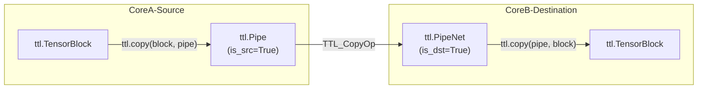

For details, see [Copy Operations and Synchronization](#2.2.3) and [Pipes and Inter-core Communication](#2.2.4).
```


### Circular Buffer Lifecycle


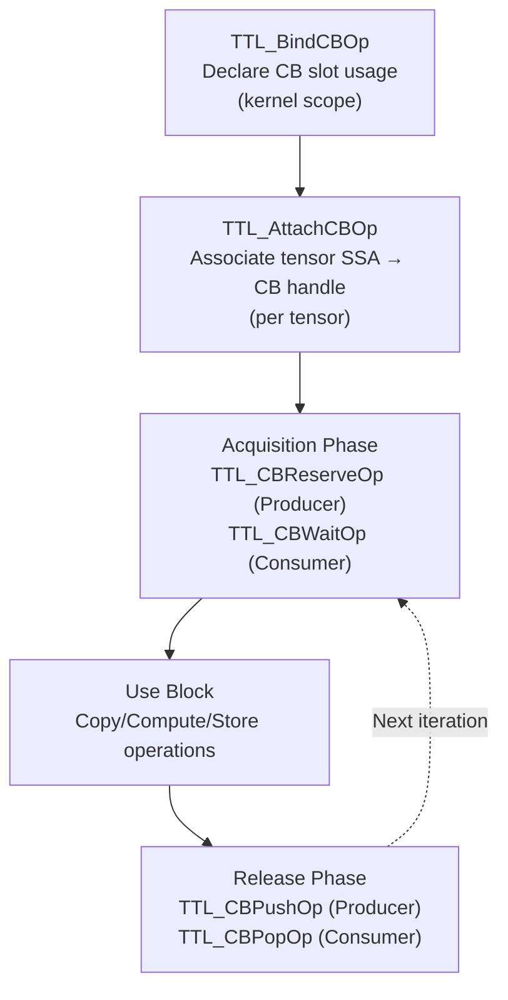

**Lifecycle Stages:**

1.  **Binding** (`ttl.bind_cb`): Declares that a kernel will use a specific hardware slot (0-31). This op produces an SSA handle (`!ttl.cb`) but does not allocate memory [include/ttlang/Dialect/TTL/IR/TTLOps.td:25-49]().
2.  **Attachment** (`ttl.attach_cb`): Associates a tensor value with a CB handle. This allows the compiler to trace back from a `ttl.compute` or `ttl.copy` operation to the specific hardware CB slot [include/ttlang/Dialect/TTL/IR/TTLOps.td:52-76]().
3.  **Acquisition**:
    *   **Producers** call `ttl.cb_reserve` to get writable space in L1 [include/ttlang/Dialect/TTL/IR/TTLOps.td:638-654]().
    *   **Consumers** call `ttl.cb_wait` to ensure data is available for reading [include/ttlang/Dialect/TTL/IR/TTLOps.td:687-703]().
4.  **Use**: Operations like `ttl.tile_store` or `ttl.copy` act on the "view" (tensor) returned by the acquisition phase [test/ttlang/Dialect/TTL/IR/cb_ops.mlir:95-101]().
5.  **Release**:
    *   **Producers** call `ttl.cb_push` to signal data is ready for the consumer [include/ttlang/Dialect/TTL/IR/TTLOps.td:664-678]().
    *   **Consumers** call `ttl.cb_pop` to free the space in L1 [include/ttlang/Dialect/TTL/IR/TTLOps.td:712-726]().
```


### DST Capacity and Pressure Calculation


```mermaid
graph TB
    Physical["Physical DST Capacity<br/>(C)"]
    
    F32{"fp32_dest_acc_en"}
    Capacity4["C = 4 tiles"]
    Capacity8["C = 8 tiles"]
    
    F32 -->|"True"| Capacity4
    F32 -->|"False"| Capacity8
    
    ComputeBody["Compute Body Analysis"]
    Pressure["Register Pressure (D)"]
    
    FPU_Binary{"FPU Eligible?"}
    Pressure1["D = 1 slot"]
    Pressure3["D = 3 slots"]
    
    ComputeBody --> FPU_Binary
    FPU_Binary -->|"Yes (Inputs in CB)"| Pressure1
    FPU_Binary -->|"No (Inputs in DST)"| Pressure3
    
    Capacity4 --> Unroll["N = C / D"]
    Capacity8 --> Unroll
    Pressure1 --> Unroll
    Pressure3 --> Unroll
``` |
```


#### Loop Nest Construction


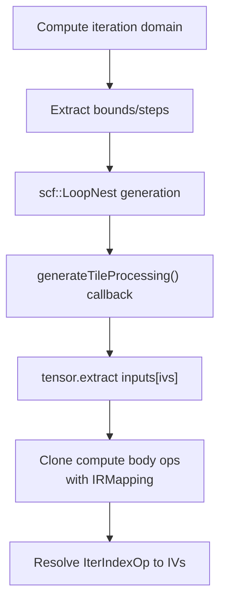

**Diagram: Loop nest construction flow**

Key characteristics:
- **Side-effect-only loops**: No `iter_args`, no tensor results from `scf.for` [lib/Dialect/TTL/Transforms/ConvertTTLComputeToSCF.cpp:49-50]().
- **Perfect nesting**: Inner loops are the only operations in outer loop bodies.
- **Indexing Mapping**: Uses `extractTilesAtIndices` to resolve tile coordinates [lib/Dialect/TTL/Transforms/ConvertTTLComputeToSCF.cpp:56-59]().
- **IterIndex Resolution**: `IterIndexOp` values are replaced by induction variables during cloning [lib/Dialect/TTL/Transforms/ConvertTTLComputeToSCF.cpp:66-74]().
```


### Handling Accumulating Computes


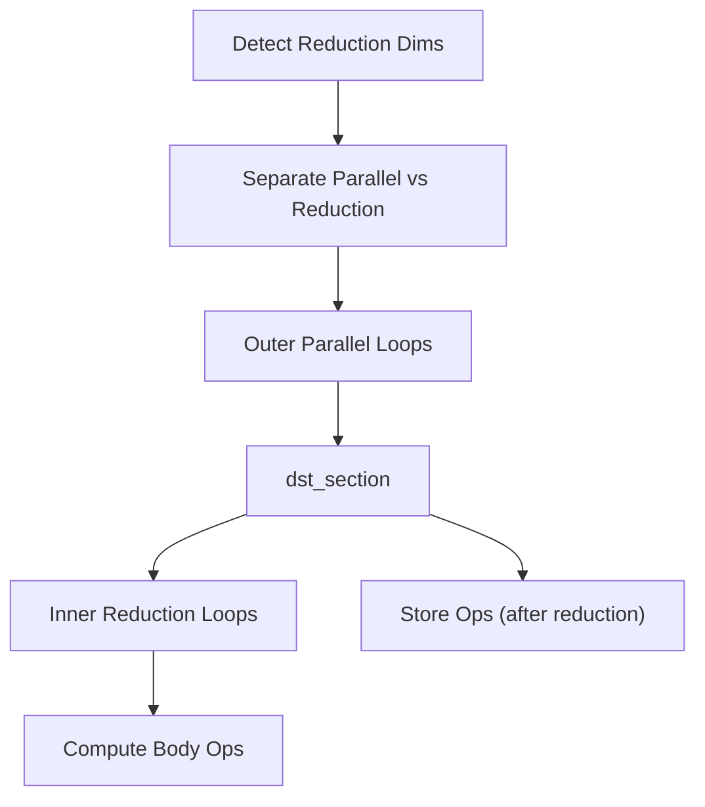

**Diagram: Accumulating loop structure with dst_section**

The `generateAccumulatingLoops` function [lib/Dialect/TTL/Transforms/ConvertTTLComputeToSCF.cpp:100-132]() wraps the reduction loop and stores in a `dst_section` to ensure the `DST` register contents persist across reduction iterations before being packed. Reduction loops are identified by checking the `iterator_types` for "reduction" [lib/Dialect/TTL/Transforms/ConvertTTLComputeToSCF.cpp:108-114]().
```


#### Type Conversion Architecture


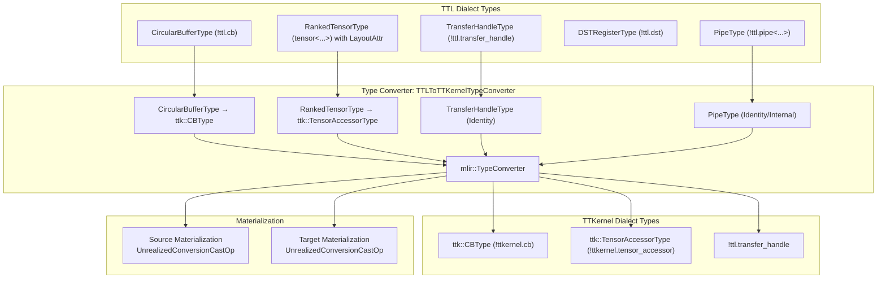

Sources: [include/ttlang/Dialect/TTL/IR/TTLOpsTypes.td:31-67](), [include/ttlang/Dialect/TTL/IR/TTLOpsTypes.td:102-128](), [include/ttlang/Dialect/Utils/ConversionUtils.h:74-107]()

---
```


#### CB Lifecycle Operations


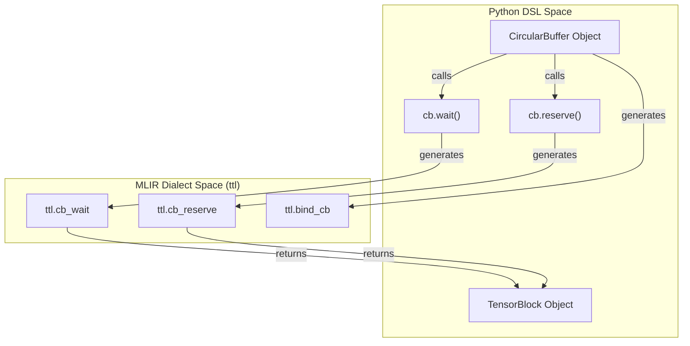


#### Error: Debugging with Source Locations


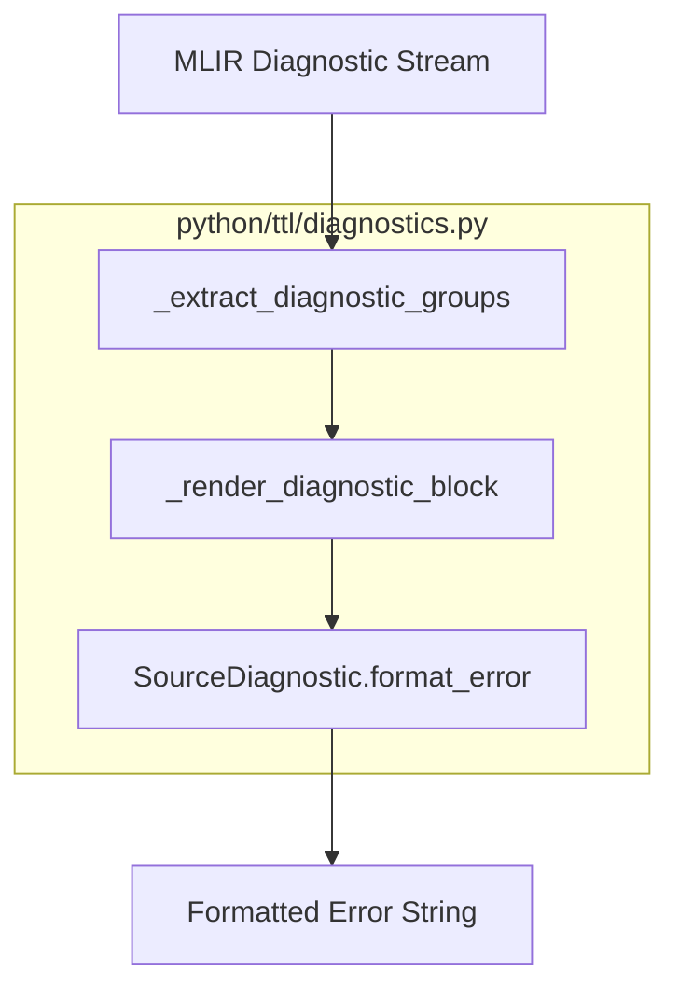

Multiple unrelated violations are rendered as separate `error:` blocks rather than being folded into a single primary error. The `format_mlir_error` function in `python/ttl/diagnostics.py` handles this grouping and source mapping.
```


#### Per-Node Context Building


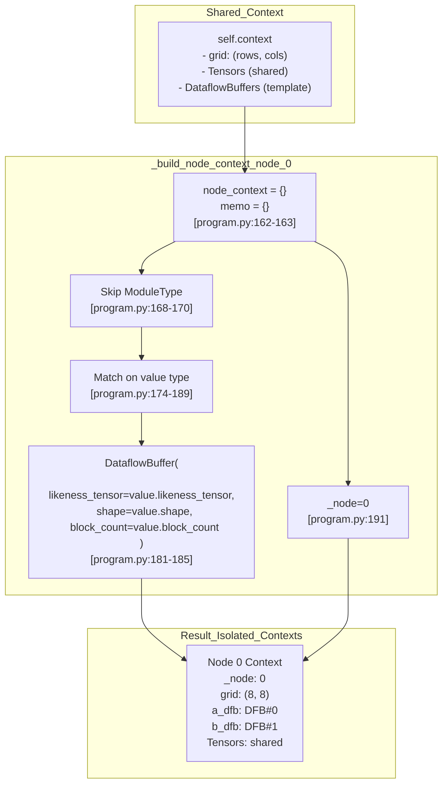


### Profiling System Architecture


```mermaid
graph TB
    subgraph "Compilation Phase"
        [TTLGenericCompiler] -->|"line-based signposts"| [is_auto_profile_enabled]
        [is_auto_profile_enabled] -->|"track mapping"| [SourceLineMapper]
    end
    
    subgraph "MLIR Transformation"
        [SignpostOp] -->|"pass"| [TTLLowerSignpostToEmitCPass]
        [TTLLowerSignpostToEmitCPass] -->|"generate"| [DeviceZoneScopedN]
    end
    
    subgraph "Runtime Execution"
        [DeviceZoneScopedN] -->|"execute on"| [DeviceProfiler]
        [DeviceProfiler] -->|"dump"| [profile_log_device_csv]
    end
    
    subgraph "Analysis & Visualization"
        [profile_log_device_csv] -->|"read"| [parse_device_profile_csv]
        [profile_log_device_csv] -->|"read"| [parse_signpost_zones]
        [parse_device_profile_csv] -->|"generate"| [print_profile_report]
        [SourceLineMapper] -->|"source mapping"| [print_profile_report]
    end
```

**Diagram: Profiling System Data Flow**

The system operates in four phases:
1. **Compilation**: The `TTLGenericCompiler` [python/ttl/_src/ttl_ast.py:128]() emits signpost operations and tracks source line mappings via `SourceLineMapper` [python/ttl/_src/auto_profile.py:57-63]().
2. **MLIR Transformation**: `SignpostOp` [lib/Dialect/TTL/Transforms/LowerSignpostToEmitC.cpp:149]() operations are lowered to C++ profiler instrumentation via the `TTLLowerSignpostToEmitCPass` [lib/Dialect/TTL/Transforms/LowerSignpostToEmitC.cpp:142-143]().
3. **Runtime**: Device profiler captures zone timestamps during kernel execution, dumping to `profile_log_device.csv` [python/ttl/_src/auto_profile.py:126-129]().
4. **Analysis**: Post-execution tools like `parse_device_profile_csv()` [python/ttl/_src/auto_profile.py:126-129]() and `parse_signpost_zones()` [python/ttl/_src/signpost_profile.py:28-30]() parse profiler data and generate reports.
```


#### Signpost Generation Strategy


```mermaid
graph LR
    subgraph "Source Code Line 42"
        [LineSignpost] -->|"contains"| [CBWait]
        [LineSignpost] -->|"contains"| [CBPop]
    end
    
    [CBWait] -->|"emit"| [ZONE_START]
    [CBWait] -->|"emit"| [ZONE_END]
    [ZONE_START] --> [Duration]
    [ZONE_END] --> [Duration]
```

**Diagram: Auto-Profiling Signpost Hierarchy**
```


#### Environment Mapping


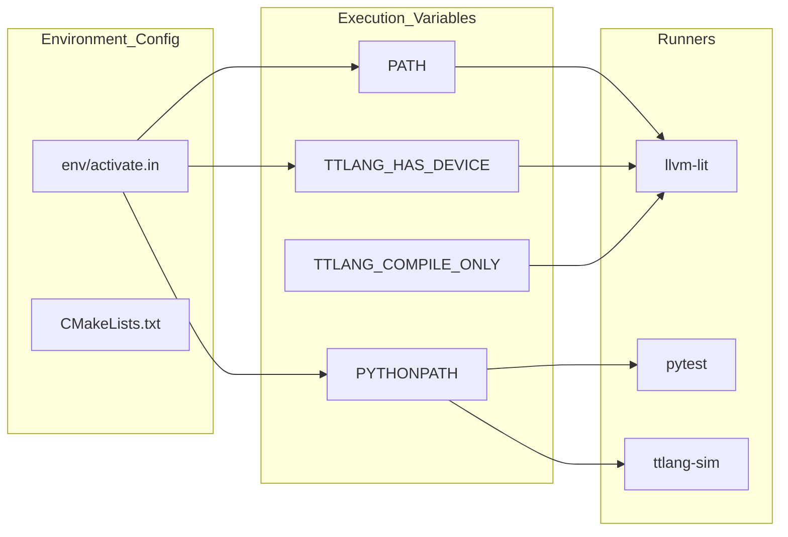
Sources: [env/activate.in:29-61](), [test/ttlang_test_utils.py:27-44](), [test/TESTING.md:10-12]()
```


#### DFB Shape Configuration


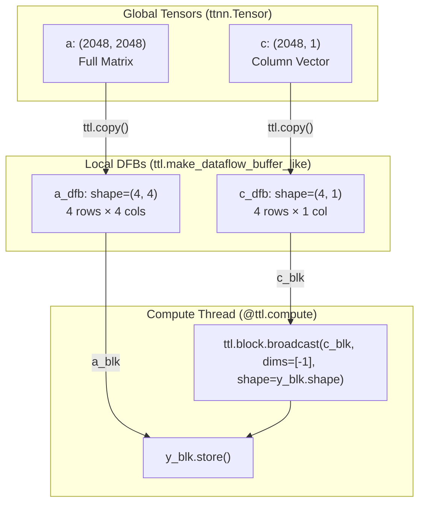

The DFB shapes are configured using `ttl.make_dataflow_buffer_like` with specific `shape` overrides:

```python
```


#### Profiling Pipeline Entity Mapping


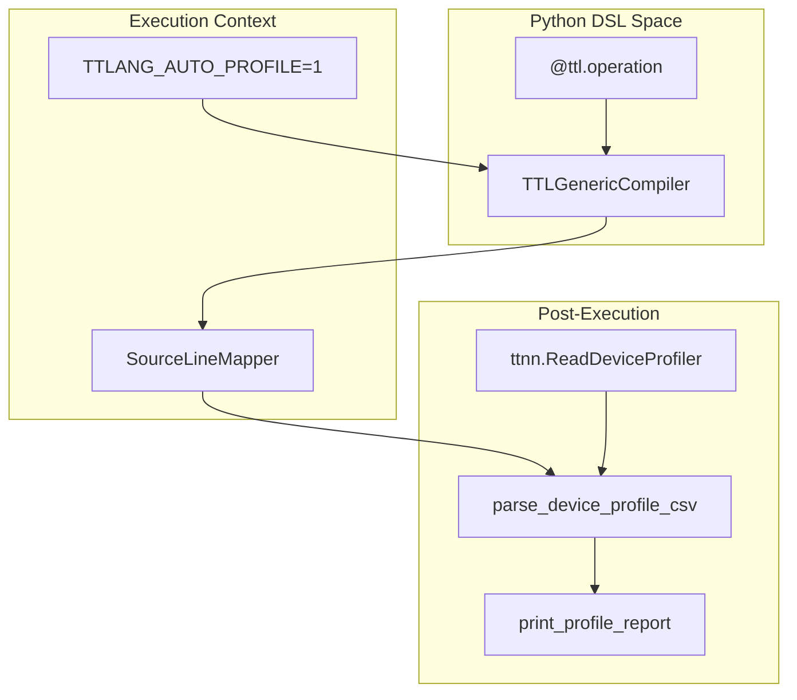
Sources: [python/ttl/ttl_api.py:133-158](), [python/ttl/ttl_api.py:166-235](), [python/ttl/_src/ttl_ast.py:160-165]()
5f:T2a55,
```


#### Context Resolution during AST Lowering


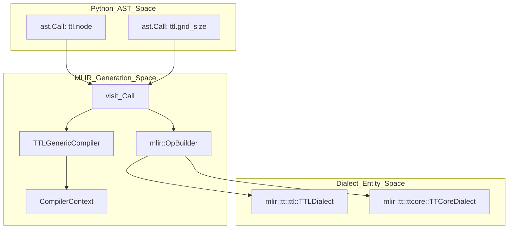

**Compiler Behavior**:
The `TTLGenericCompiler` maintains a `CompilerContext` which stores the `grid` dimensions [python/ttl/_src/ttl_ast.py:119-126](). This context is initialized during compiler instantiation [python/ttl/_src/ttl_ast.py:141-145](). When generating MLIR, the compiler uses these dimensions to build `RankedTensorType` with appropriate `TTLLayoutAttr` encoding [python/ttl/_src/ttl_ast.py:69-116]().

Sources: [python/ttl/_src/ttl_ast.py:119-145](), [lib/Dialect/TTL/Pipelines/TTLPipelines.cpp:47-51]()

---
```


#### Type Relationships


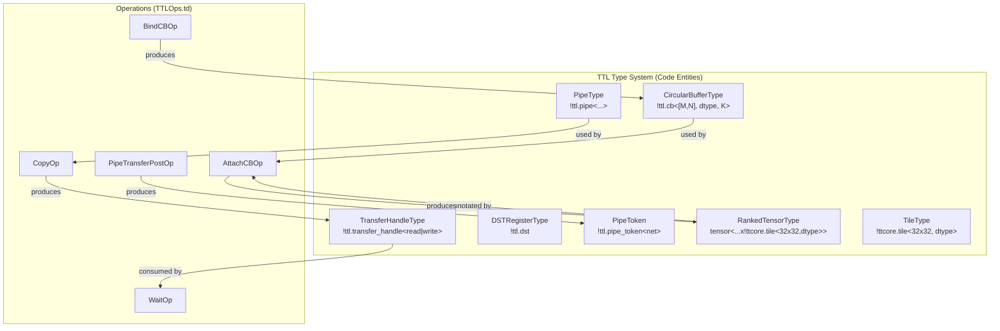


### Hardware Mapping and Code Generation


```mermaid
graph TB
    subgraph "Natural Language Space"
        MATH_THREAD["Math Thread Logic"]
        DATA_MOVE["Data Movement Logic"]
        DST_MGMT["DST Register Management"]
    end

    subgraph "Code Entity Space (TTKernel Dialect)"
        direction LR
        TTK_ADD["ttkernel.add_tiles"]
        TTK_PACK["ttkernel.pack_tile"]
        TTK_ACQ["ttkernel.tile_regs_acquire"]
        TTK_REL["ttkernel.tile_regs_release"]
        TTK_READ["ttkernel.noc_async_read_tile"]
    end

    subgraph "C++ Hardware API (EmitC Target)"
        CPP_ADD["add_tiles()"]
        CPP_PACK["pack_tile()"]
        CPP_ACQ["tile_regs_acquire()"]
        CPP_REL["tile_regs_release()"]
        CPP_READ["noc_async_read_tile()"]
    end

    MATH_THREAD --> TTK_ADD
    DATA_MOVE --> TTK_READ
    DATA_MOVE --> TTK_PACK
    DST_MGMT --> TTK_ACQ
    DST_MGMT --> TTK_REL

    TTK_ADD --> CPP_ADD
    TTK_PACK --> CPP_PACK
    TTK_ACQ --> CPP_ACQ
    TTK_REL --> CPP_REL
    TTK_READ --> CPP_READ
```

Sources: [lib/Dialect/TTL/Transforms/ConvertTTLToTTKernel.cpp:9-17](), [lib/Dialect/TTKernel/Transforms/TTKernelInsertInits.cpp:104-115]()
```


### Type Converter Architecture


```mermaid
graph TB
    ["TTLToTTKernelTypeConverter"] -- "inherits" --> ["mlir::TypeConverter"]
    ["TTLToTTKernelTypeConverter"] -- "lib/Dialect/TTL/Transforms/ConvertTTLTileOpsToTTKernel.cpp:157" --> ["ConversionRules"]
    
    subgraph "ConversionRules"
        ["CBConv"] -- "CircularBufferType to CBType" --> ["ResultCB"]
        ["TensorConv"] -- "RankedTensorType to TensorAccessorType" --> ["ResultAcc"]
        ["HandleConv"] -- "TransferHandleType preservation" --> ["ResultHandle"]
    end
    
    subgraph "MaterializationCallbacks"
        ["SourceMat"] -- "lib/Dialect/Utils/ConversionUtils.h:99" --> ["CastOp"]
        ["TargetMat"] -- "lib/Dialect/Utils/ConversionUtils.h:107" --> ["CastOp"]
        ["CastOp"] -- "UnrealizedConversionCastOp" --> ["SSAValue"]
    end
    
    ["TTLToTTKernelTypeConverter"] --> ["SourceMat"]
    ["TTLToTTKernelTypeConverter"] --> ["TargetMat"]
```


### Example: Type Transformation from TTL to TTKernel Dialect


```mermaid
graph LR
    subgraph "TTL Dialect Entity"
        ["TCB"] -- "CircularBufferType !ttl.cb<[2, 2], f32, 2>" --> ["Conversion"]
        ["TTen"] -- "RankedTensorType tensor<2x2x!ttcore.tile<32x32, f32>>" --> ["Conversion"]
    end
    
    subgraph "TTKernel Dialect Entity"
        ["Conversion"] -- "TTLToTTKernelTypeConverter" --> ["KCB"]
        ["Conversion"] -- "TTLToTTKernelTypeConverter" --> ["KAcc"]
        ["KCB"] -- "ttkernel::CBType !ttkernel.cb<8, f32>" --> ["Final"]
        ["KAcc"] -- "ttkernel::TensorAccessorType" --> ["Final"]
    end
```

**Implementation**:
- `lookupAndConvertCB`: Traces an operand back to its defining `bind_cb` and converts the type [lib/Dialect/TTL/Transforms/ConvertTTLTileOpsToTTKernel.cpp:157-175]().
- `computeCBTileIndex`: Calculates the linear index into a CB by tracing through `tensor.extract` and applying slice offsets [lib/Dialect/TTL/Transforms/ConvertTTLTileOpsToTTKernel.cpp:133-153]().
```

