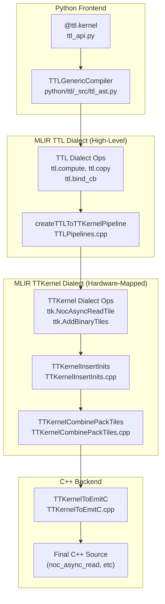
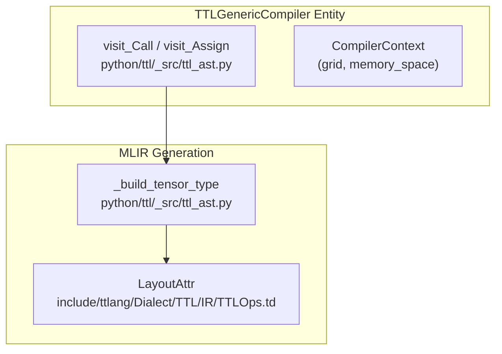

# Compilation Pipeline

Relevant source files
*   [include/ttlang/Dialect/TTL/IR/TTL.h](https://github.com/tenstorrent/tt-lang/blob/d76e6233/include/ttlang/Dialect/TTL/IR/TTL.h)
*   [include/ttlang/Dialect/TTL/IR/TTLOps.td](https://github.com/tenstorrent/tt-lang/blob/d76e6233/include/ttlang/Dialect/TTL/IR/TTLOps.td)
*   [include/ttlang/Dialect/TTL/IR/TTLOpsUtils.h](https://github.com/tenstorrent/tt-lang/blob/d76e6233/include/ttlang/Dialect/TTL/IR/TTLOpsUtils.h)
*   [include/ttlang/Dialect/TTL/Passes.td](https://github.com/tenstorrent/tt-lang/blob/d76e6233/include/ttlang/Dialect/TTL/Passes.td)
*   [lib/Dialect/TTL/IR/TTLOps.cpp](https://github.com/tenstorrent/tt-lang/blob/d76e6233/lib/Dialect/TTL/IR/TTLOps.cpp)
*   [lib/Dialect/TTL/Pipelines/TTLPipelines.cpp](https://github.com/tenstorrent/tt-lang/blob/d76e6233/lib/Dialect/TTL/Pipelines/TTLPipelines.cpp)
*   [lib/Dialect/TTL/Transforms/CMakeLists.txt](https://github.com/tenstorrent/tt-lang/blob/d76e6233/lib/Dialect/TTL/Transforms/CMakeLists.txt)
*   [lib/Dialect/TTL/Transforms/ConvertTTLTileOpsToTTKernel.cpp](https://github.com/tenstorrent/tt-lang/blob/d76e6233/lib/Dialect/TTL/Transforms/ConvertTTLTileOpsToTTKernel.cpp)
*   [lib/Dialect/TTL/Transforms/ConvertTTLToCompute.cpp](https://github.com/tenstorrent/tt-lang/blob/d76e6233/lib/Dialect/TTL/Transforms/ConvertTTLToCompute.cpp)
*   [lib/Dialect/TTL/Transforms/ConvertTTLToTTKernel.cpp](https://github.com/tenstorrent/tt-lang/blob/d76e6233/lib/Dialect/TTL/Transforms/ConvertTTLToTTKernel.cpp)
*   [python/ttl/_src/ttl_ast.py](https://github.com/tenstorrent/tt-lang/blob/d76e6233/python/ttl/_src/ttl_ast.py)
*   [python/ttl/operators.py](https://github.com/tenstorrent/tt-lang/blob/d76e6233/python/ttl/operators.py)
*   [python/ttl/ttl_api.py](https://github.com/tenstorrent/tt-lang/blob/d76e6233/python/ttl/ttl_api.py)
*   [test/me2e/builder/pipeline.py](https://github.com/tenstorrent/tt-lang/blob/d76e6233/test/me2e/builder/pipeline.py)

This page provides a comprehensive technical overview of the tt-lang compilation pipeline, which transforms Python kernel definitions into C++ code for execution on Tenstorrent hardware. The pipeline consists of multiple stages: Python AST to MLIR TTL dialect, TTL transformations, TTL to TTKernel conversion, and final C++ code generation.

For information about writing kernels using the Python DSL, see [Python DSL Fundamentals](https://deepwiki.com/tenstorrent/tt-lang/2.1-python-dsl-fundamentals). For details about the MLIR dialect specifications, see [MLIR Dialect Reference](https://deepwiki.com/tenstorrent/tt-lang/11-mlir-dialect-reference).

## Pipeline Overview

The tt-lang compilation pipeline operates in distinct stages, each responsible for progressively lowering abstractions from high-level Python to hardware-executable C++ code.

### System Architecture to Code Entity Mapping

The following diagram associates the logical stages of the compilation pipeline with the specific code entities that implement them.

**Sources:**[python/ttl/ttl_api.py 39-68](https://github.com/tenstorrent/tt-lang/blob/d76e6233/python/ttl/ttl_api.py#L39-L68)[lib/Dialect/TTL/Pipelines/TTLPipelines.cpp 19-75](https://github.com/tenstorrent/tt-lang/blob/d76e6233/lib/Dialect/TTL/Pipelines/TTLPipelines.cpp#L19-L75)[python/ttl/_src/ttl_ast.py 128-168](https://github.com/tenstorrent/tt-lang/blob/d76e6233/python/ttl/_src/ttl_ast.py#L128-L168)

### Stage Boundaries

| Stage | Input | Output | Primary Component |
| --- | --- | --- | --- |
| AST Compilation | Python kernel source | TTL MLIR | `TTLGenericCompiler` |
| TTL Transforms | TTL MLIR | Transformed TTL MLIR | `createTTLToTTKernelPipeline` |
| TTL→TTKernel | TTL MLIR | TTKernel MLIR | `TTLConvertTTLToTTKernel` |
| Code Generation | TTKernel MLIR | C++ source | `ConvertTTKernelToEmitC` |

**Sources:**[lib/Dialect/TTL/Pipelines/TTLPipelines.cpp 19-75](https://github.com/tenstorrent/tt-lang/blob/d76e6233/lib/Dialect/TTL/Pipelines/TTLPipelines.cpp#L19-L75)[python/ttl/_src/ttl_ast.py 128-168](https://github.com/tenstorrent/tt-lang/blob/d76e6233/python/ttl/_src/ttl_ast.py#L128-L168)[include/ttlang/Dialect/TTL/Passes.td 120-141](https://github.com/tenstorrent/tt-lang/blob/d76e6233/include/ttlang/Dialect/TTL/Passes.td#L120-L141)

## Python AST to MLIR TTL

The `TTLGenericCompiler` class implements an AST visitor pattern to transform Python kernel functions into MLIR TTL dialect operations. For details, see [Python AST to Initial TTL MLIR](https://deepwiki.com/tenstorrent/tt-lang/3.2-python-ast-to-initial-ttl-mlir).

**Sources:**[python/ttl/_src/ttl_ast.py 128-200](https://github.com/tenstorrent/tt-lang/blob/d76e6233/python/ttl/_src/ttl_ast.py#L128-L200)[include/ttlang/Dialect/TTL/IR/TTLOps.td 79-112](https://github.com/tenstorrent/tt-lang/blob/d76e6233/include/ttlang/Dialect/TTL/IR/TTLOps.td#L79-L112)

### Key Compiler Components

**TTLGenericCompiler** ([python/ttl/_src/ttl_ast.py 128-168](https://github.com/tenstorrent/tt-lang/blob/d76e6233/python/ttl/_src/ttl_ast.py#L128-L168)):

*   Inherits from `TTCompilerBase`.
*   Maintains `CompilerContext` with grid configuration and memory space.
*   Supports debug locations and auto-profiling.

**visit_Assign** ([python/ttl/_src/ttl_ast.py 177-187](https://github.com/tenstorrent/tt-lang/blob/d76e6233/python/ttl/_src/ttl_ast.py#L177-L187)):

*   Handles variable assignment and updates the symbol table.
*   Special handling for `PipeNet` object names to aid diagnostics.

**_build_tensor_type** ([python/ttl/_src/ttl_ast.py 69-116](https://github.com/tenstorrent/tt-lang/blob/d76e6233/python/ttl/_src/ttl_ast.py#L69-L116)):

*   Constructs MLIR tensor types with `LayoutAttr` encoding.
*   Maps logical shapes to hardware-compatible tile grids.

**Sources:**[python/ttl/_src/ttl_ast.py 69-189](https://github.com/tenstorrent/tt-lang/blob/d76e6233/python/ttl/_src/ttl_ast.py#L69-L189)[include/ttlang/Dialect/TTL/IR/TTLOps.td 79-112](https://github.com/tenstorrent/tt-lang/blob/d76e6233/include/ttlang/Dialect/TTL/IR/TTLOps.td#L79-L112)

## TTL Dialect Operations

The TTL dialect provides operations for circular buffer management, data movement, and compute structuring. For details, see [TTL Dialect Specification](https://deepwiki.com/tenstorrent/tt-lang/11.1-ttl-dialect-specification).

**Circular Buffer Management**:

*   `ttl.bind_cb`: Declares hardware circular buffer slot usage [include/ttlang/Dialect/TTL/IR/TTLOps.td 26-51](https://github.com/tenstorrent/tt-lang/blob/d76e6233/include/ttlang/Dialect/TTL/IR/TTLOps.td#L26-L51)
*   `ttl.attach_cb`: Associates a tensor SSA value with a circular buffer for lowering [include/ttlang/Dialect/TTL/IR/TTLOps.td 53-78](https://github.com/tenstorrent/tt-lang/blob/d76e6233/include/ttlang/Dialect/TTL/IR/TTLOps.td#L53-L78)

**Data Movement**:

*   `ttl.copy`: Initiates asynchronous transfer between a tensor slice and a circular buffer [include/ttlang/Dialect/TTL/IR/TTLOps.td 122-162](https://github.com/tenstorrent/tt-lang/blob/d76e6233/include/ttlang/Dialect/TTL/IR/TTLOps.td#L122-L162)
*   `ttl.wait`: Blocks until the asynchronous transfer identified by a `!ttl.transfer_handle` is complete [include/ttlang/Dialect/TTL/IR/TTLOps.td 164-177](https://github.com/tenstorrent/tt-lang/blob/d76e6233/include/ttlang/Dialect/TTL/IR/TTLOps.td#L164-L177)

**Compute Operations**:

*   `ttl.compute`: Structured operation for tile-based computation, supporting fusion and subblocking [lib/Dialect/TTL/Transforms/ConvertTTLToCompute.cpp 156-175](https://github.com/tenstorrent/tt-lang/blob/d76e6233/lib/Dialect/TTL/Transforms/ConvertTTLToCompute.cpp#L156-L175)

**Sources:**[include/ttlang/Dialect/TTL/IR/TTLOps.td 26-177](https://github.com/tenstorrent/tt-lang/blob/d76e6233/include/ttlang/Dialect/TTL/IR/TTLOps.td#L26-L177)[lib/Dialect/TTL/Transforms/ConvertTTLToCompute.cpp 156-175](https://github.com/tenstorrent/tt-lang/blob/d76e6233/lib/Dialect/TTL/Transforms/ConvertTTLToCompute.cpp#L156-L175)

## TTL Dialect Transformations

The pipeline applies several passes to optimize the TTL IR before lowering. For details, see [TTL Dialect Transformations](https://deepwiki.com/tenstorrent/tt-lang/3.3-ttl-dialect-transformations).

**TTLPipelines** ([lib/Dialect/TTL/Pipelines/TTLPipelines.cpp 19-75](https://github.com/tenstorrent/tt-lang/blob/d76e6233/lib/Dialect/TTL/Pipelines/TTLPipelines.cpp#L19-L75)):

*   `TTLConvertTTLToCompute`: Fuses elementwise operations into compute blocks [lib/Dialect/TTL/Pipelines/TTLPipelines.cpp 29](https://github.com/tenstorrent/tt-lang/blob/d76e6233/lib/Dialect/TTL/Pipelines/TTLPipelines.cpp#L29-L29)
*   `TTLAssignDST`: Performs DST register allocation using linear scan with in-place merging [lib/Dialect/TTL/Pipelines/TTLPipelines.cpp 36](https://github.com/tenstorrent/tt-lang/blob/d76e6233/lib/Dialect/TTL/Pipelines/TTLPipelines.cpp#L36-L36)
*   `TTLSubblockComputeForDST`: Partitions compute operations to fit hardware DST capacity [lib/Dialect/TTL/Pipelines/TTLPipelines.cpp 41](https://github.com/tenstorrent/tt-lang/blob/d76e6233/lib/Dialect/TTL/Pipelines/TTLPipelines.cpp#L41-L41)
*   `TTLLowerToLoops`: Lowers computes to `scf.for` loops [lib/Dialect/TTL/Pipelines/TTLPipelines.cpp 47](https://github.com/tenstorrent/tt-lang/blob/d76e6233/lib/Dialect/TTL/Pipelines/TTLPipelines.cpp#L47-L47)
*   `TTLInsertCBSync`: Inserts missing `cb_push`/`cb_pop` for unmatched acquires [include/ttlang/Dialect/TTL/Passes.td 6-26](https://github.com/tenstorrent/tt-lang/blob/d76e6233/include/ttlang/Dialect/TTL/Passes.td#L6-L26)
*   `TTLCoalesceDFBAcquires`: Coalesces consecutive same-DFB acquires into multi-tile waits [include/ttlang/Dialect/TTL/Passes.td 28-106](https://github.com/tenstorrent/tt-lang/blob/d76e6233/include/ttlang/Dialect/TTL/Passes.td#L28-L106)

**Sources:**[lib/Dialect/TTL/Pipelines/TTLPipelines.cpp 19-75](https://github.com/tenstorrent/tt-lang/blob/d76e6233/lib/Dialect/TTL/Pipelines/TTLPipelines.cpp#L19-L75)[include/ttlang/Dialect/TTL/Passes.td 6-106](https://github.com/tenstorrent/tt-lang/blob/d76e6233/include/ttlang/Dialect/TTL/Passes.td#L6-L106)

## TTL to TTKernel Conversion

The conversion process lowers high-level TTL operations to the `TTKernel` dialect, which maps 1:1 with Tenstorrent's hardware APIs. For details, see [TTL to TTKernel Conversion](https://deepwiki.com/tenstorrent/tt-lang/3.4-ttl-to-ttkernel-conversion).

*   **CB Lowering**: TTL CB handles are converted to `ttkernel.cb` types [lib/Dialect/TTL/Transforms/ConvertTTLToTTKernel.cpp 70-73](https://github.com/tenstorrent/tt-lang/blob/d76e6233/lib/Dialect/TTL/Transforms/ConvertTTLToTTKernel.cpp#L70-L73)
*   **DMA Lowering**: `ttl.copy` is lowered to `ttkernel` NOC operations [include/ttlang/Dialect/TTL/Passes.td 120-130](https://github.com/tenstorrent/tt-lang/blob/d76e6233/include/ttlang/Dialect/TTL/Passes.td#L120-L130)
*   **L1 Accumulation**: `TTKernelInsertL1Accumulation` inserts guards for reduction loops to accumulate in L1 [include/ttlang/Dialect/TTL/Passes.td 143-172](https://github.com/tenstorrent/tt-lang/blob/d76e6233/include/ttlang/Dialect/TTL/Passes.td#L143-L172)
*   **Tile Indexing**: `computeCBTileIndex` linearizes `tensor.extract` indices to hardware-compatible CB indices [lib/Dialect/TTL/Transforms/ConvertTTLTileOpsToTTKernel.cpp 133-153](https://github.com/tenstorrent/tt-lang/blob/d76e6233/lib/Dialect/TTL/Transforms/ConvertTTLTileOpsToTTKernel.cpp#L133-L153)

**Sources:**[lib/Dialect/TTL/Transforms/ConvertTTLTileOpsToTTKernel.cpp 133-172](https://github.com/tenstorrent/tt-lang/blob/d76e6233/lib/Dialect/TTL/Transforms/ConvertTTLTileOpsToTTKernel.cpp#L133-L172)[include/ttlang/Dialect/TTL/Passes.td 120-172](https://github.com/tenstorrent/tt-lang/blob/d76e6233/include/ttlang/Dialect/TTL/Passes.td#L120-L172)[lib/Dialect/TTL/Transforms/ConvertTTLToTTKernel.cpp 65-96](https://github.com/tenstorrent/tt-lang/blob/d76e6233/lib/Dialect/TTL/Transforms/ConvertTTLToTTKernel.cpp#L65-L96)

## Code Generation and EmitC

The final stage converts the optimized TTKernel IR into C++ source code. For details, see [Code Generation and EmitC](https://deepwiki.com/tenstorrent/tt-lang/3.5-code-generation-and-emitc).

*   **EmitC Conversion**: Uses `createConvertTTKernelToEmitC` to map MLIR operations to C++ function calls [lib/Dialect/TTL/Pipelines/TTLPipelines.cpp 72](https://github.com/tenstorrent/tt-lang/blob/d76e6233/lib/Dialect/TTL/Pipelines/TTLPipelines.cpp#L72-L72)
*   **Expression Forming**: `FormExpressionsPass` cleans up the generated C++ to use natural operator syntax [lib/Dialect/TTL/Pipelines/TTLPipelines.cpp 74](https://github.com/tenstorrent/tt-lang/blob/d76e6233/lib/Dialect/TTL/Pipelines/TTLPipelines.cpp#L74-L74)

**Sources:**[lib/Dialect/TTL/Pipelines/TTLPipelines.cpp 69-75](https://github.com/tenstorrent/tt-lang/blob/d76e6233/lib/Dialect/TTL/Pipelines/TTLPipelines.cpp#L69-L75)

## Compilation Caching

To avoid redundant compilation, tt-lang caches compiled kernels based on their input properties and compiler configuration. For details, see [Compilation Caching](https://deepwiki.com/tenstorrent/tt-lang/3.7-compilation-caching).

*   **Cache Key**: Includes tensor shapes, dtypes, memory space, layout, and `CompilerOptions`[python/ttl/ttl_api.py 133-158](https://github.com/tenstorrent/tt-lang/blob/d76e6233/python/ttl/ttl_api.py#L133-L158)
*   **Compiler Options**: Users can override defaults via the `CompilerOptions` class or environment variables [python/ttl/ttl_api.py 137](https://github.com/tenstorrent/tt-lang/blob/d76e6233/python/ttl/ttl_api.py#L137-L137)
*   **Compile-Only Mode**: Setting `TTLANG_COMPILE_ONLY=1` allows verifying the pipeline without executing on hardware [python/ttl/ttl_api.py 161-163](https://github.com/tenstorrent/tt-lang/blob/d76e6233/python/ttl/ttl_api.py#L161-L163)

**Sources:**[python/ttl/ttl_api.py 133-163](https://github.com/tenstorrent/tt-lang/blob/d76e6233/python/ttl/ttl_api.py#L133-L163)

Dismiss
Refresh this wiki

Enter email to refresh