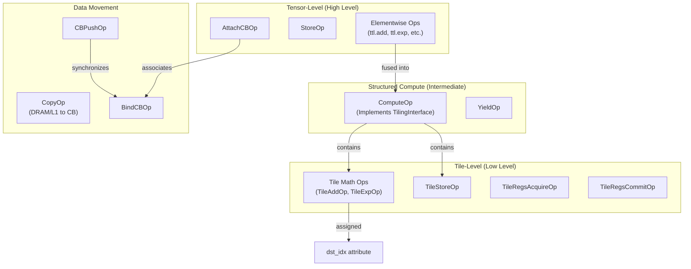

# TTL Dialect Transformations

Relevant source files
*   [include/ttlang/Dialect/TTL/IR/TTL.h](https://github.com/tenstorrent/tt-lang/blob/d76e6233/include/ttlang/Dialect/TTL/IR/TTL.h)
*   [include/ttlang/Dialect/TTL/IR/TTLOps.td](https://github.com/tenstorrent/tt-lang/blob/d76e6233/include/ttlang/Dialect/TTL/IR/TTLOps.td)
*   [include/ttlang/Dialect/TTL/IR/TTLOpsUtils.h](https://github.com/tenstorrent/tt-lang/blob/d76e6233/include/ttlang/Dialect/TTL/IR/TTLOpsUtils.h)
*   [include/ttlang/Dialect/TTL/Passes.td](https://github.com/tenstorrent/tt-lang/blob/d76e6233/include/ttlang/Dialect/TTL/Passes.td)
*   [lib/Dialect/TTL/IR/TTLOps.cpp](https://github.com/tenstorrent/tt-lang/blob/d76e6233/lib/Dialect/TTL/IR/TTLOps.cpp)
*   [lib/Dialect/TTL/Pipelines/TTLPipelines.cpp](https://github.com/tenstorrent/tt-lang/blob/d76e6233/lib/Dialect/TTL/Pipelines/TTLPipelines.cpp)
*   [lib/Dialect/TTL/Transforms/CMakeLists.txt](https://github.com/tenstorrent/tt-lang/blob/d76e6233/lib/Dialect/TTL/Transforms/CMakeLists.txt)
*   [lib/Dialect/TTL/Transforms/ConvertTTLTileOpsToTTKernel.cpp](https://github.com/tenstorrent/tt-lang/blob/d76e6233/lib/Dialect/TTL/Transforms/ConvertTTLTileOpsToTTKernel.cpp)
*   [lib/Dialect/TTL/Transforms/ConvertTTLToCompute.cpp](https://github.com/tenstorrent/tt-lang/blob/d76e6233/lib/Dialect/TTL/Transforms/ConvertTTLToCompute.cpp)
*   [lib/Dialect/TTL/Transforms/ConvertTTLToTTKernel.cpp](https://github.com/tenstorrent/tt-lang/blob/d76e6233/lib/Dialect/TTL/Transforms/ConvertTTLToTTKernel.cpp)
*   [python/ttl/_src/ttl_ast.py](https://github.com/tenstorrent/tt-lang/blob/d76e6233/python/ttl/_src/ttl_ast.py)
*   [python/ttl/operators.py](https://github.com/tenstorrent/tt-lang/blob/d76e6233/python/ttl/operators.py)
*   [python/ttl/ttl_api.py](https://github.com/tenstorrent/tt-lang/blob/d76e6233/python/ttl/ttl_api.py)
*   [test/me2e/builder/pipeline.py](https://github.com/tenstorrent/tt-lang/blob/d76e6233/test/me2e/builder/pipeline.py)

## Purpose and Scope

This page provides an overview of the transformation passes that operate on the TTL (Tenstorrent Language) dialect within the MLIR compilation pipeline. These passes transform high-level TTL operations into hardware-optimized representations suitable for execution on Tenstorrent accelerators.

TTL dialect transformations constitute Phase 2 of the compilation pipeline (see [Pipeline Overview](https://deepwiki.com/tenstorrent/tt-lang/3.1-pipeline-overview)). They operate on TTL IR after initial generation from Python AST (see [Python AST to Initial TTL MLIR](https://deepwiki.com/tenstorrent/tt-lang/3.2-python-ast-to-initial-ttl-mlir)) and before lowering to TTKernel dialect (see [TTL to TTKernel Conversion](https://deepwiki.com/tenstorrent/tt-lang/3.4-ttl-to-ttkernel-conversion)).

For detailed information on specific transformation passes, see:

*   [Elementwise Fusion (ConvertTTLToCompute)](https://deepwiki.com/tenstorrent/tt-lang/3.3.1-elementwise-fusion-(convertttltocompute)) — Explain how elementwise operations are fused into `ttl.compute` operations.
*   [DST Register Assignment](https://deepwiki.com/tenstorrent/tt-lang/3.3.2-dst-register-assignment) — Detailed explanation of linear scan allocation, in-place merging, and `dst_idx` assignment.
*   [Subblocking and Tiling Strategy](https://deepwiki.com/tenstorrent/tt-lang/3.3.3-subblocking-and-tiling-strategy) — Explain `unroll_factor calculation`, subblock partitioning, and `TilingInterface`.
*   [Loop Lowering to SCF](https://deepwiki.com/tenstorrent/tt-lang/3.3.4-loop-lowering-to-scf) — Explain conversion of `ttl.compute` to `scf.for` loops, with and without subblocking.

**Sources:**[include/ttlang/Dialect/TTL/Passes.td 1-205](https://github.com/tenstorrent/tt-lang/blob/d76e6233/include/ttlang/Dialect/TTL/Passes.td#L1-L205)[lib/Dialect/TTL/Transforms/CMakeLists.txt 1-31](https://github.com/tenstorrent/tt-lang/blob/d76e6233/lib/Dialect/TTL/Transforms/CMakeLists.txt#L1-L31)

## Transformation Pass Pipeline

The TTL dialect transformations execute in a specific order to progressively lower high-level tensor operations to tile-level computations with explicit hardware resource management. The pipeline is defined in `createTTLToTTKernelPipeline`[lib/Dialect/TTL/Pipelines/TTLPipelines.cpp 19-76](https://github.com/tenstorrent/tt-lang/blob/d76e6233/lib/Dialect/TTL/Pipelines/TTLPipelines.cpp#L19-L76)

### Pipeline Flow Diagram

**Sources:**[lib/Dialect/TTL/Pipelines/TTLPipelines.cpp 19-76](https://github.com/tenstorrent/tt-lang/blob/d76e6233/lib/Dialect/TTL/Pipelines/TTLPipelines.cpp#L19-L76)[test/me2e/builder/pipeline.py 44-77](https://github.com/tenstorrent/tt-lang/blob/d76e6233/test/me2e/builder/pipeline.py#L44-L77)

## Pass Categories

TTL transformations are grouped into four functional categories based on their role in the lowering process.

### Fusion and Compute Formation

| Pass | Class | Purpose |
| --- | --- | --- |
| `convert-ttl-to-compute` | `TTLConvertTTLToCompute` | Lowers elementwise tensor operations (add, mul, exp, etc.) to `ttl.compute` with tile ops in the body [include/ttlang/Dialect/TTL/Passes.td 142-158](https://github.com/tenstorrent/tt-lang/blob/d76e6233/include/ttlang/Dialect/TTL/Passes.td#L142-L158) |
| `ttl-insert-intermediate-dfbs` | `TTLInsertIntermediateDFBs` | Inserts compiler-allocated DFBs at fusion split points where operands are not DFB-attached [include/ttlang/Dialect/TTL/Passes.td 107-140](https://github.com/tenstorrent/tt-lang/blob/d76e6233/include/ttlang/Dialect/TTL/Passes.td#L107-L140) |

This category transforms tensor-level operations into structured compute blocks. `ConvertTTLToCompute` identifies output CBs by searching for `StoreOp` users and tracing back to `CBReserveOp`[lib/Dialect/TTL/Transforms/ConvertTTLToCompute.cpp 101-119](https://github.com/tenstorrent/tt-lang/blob/d76e6233/lib/Dialect/TTL/Transforms/ConvertTTLToCompute.cpp#L101-L119)

**Sources:**[include/ttlang/Dialect/TTL/Passes.td 107-158](https://github.com/tenstorrent/tt-lang/blob/d76e6233/include/ttlang/Dialect/TTL/Passes.td#L107-L158)[lib/Dialect/TTL/Transforms/ConvertTTLToCompute.cpp 1-130](https://github.com/tenstorrent/tt-lang/blob/d76e6233/lib/Dialect/TTL/Transforms/ConvertTTLToCompute.cpp#L1-L130)

### Resource Allocation and Configuration

| Pass | Class | Purpose |
| --- | --- | --- |
| `ttl-assign-dst` | `TTLAssignDST` | DST register allocator using linear scan with in-place operation merging [include/ttlang/Dialect/TTL/Passes.td 160-184](https://github.com/tenstorrent/tt-lang/blob/d76e6233/include/ttlang/Dialect/TTL/Passes.td#L160-L184) |
| `ttl-set-compute-kernel-config` | `TTLSetComputeKernelConfig` | Configures target-specific flags like `reduceFullFp32` and `enableFPUBinaryOps`[lib/Dialect/TTL/Pipelines/TTLPipelines.cpp 31-35](https://github.com/tenstorrent/tt-lang/blob/d76e6233/lib/Dialect/TTL/Pipelines/TTLPipelines.cpp#L31-L35) |
| `ttl-finalize-dfb-indices` | `TTLFinalizeDFBIndices` | Assigns final hardware indices to compiler-allocated circular buffers [lib/Dialect/TTL/Pipelines/TTLPipelines.cpp 52](https://github.com/tenstorrent/tt-lang/blob/d76e6233/lib/Dialect/TTL/Pipelines/TTLPipelines.cpp#L52-L52) |

`TTLAssignDST` performs interval analysis to manage the limited DST register file (typically 16-32 tiles) and sets the `ttl.unroll_factor`[include/ttlang/Dialect/TTL/Passes.td 160-184](https://github.com/tenstorrent/tt-lang/blob/d76e6233/include/ttlang/Dialect/TTL/Passes.td#L160-L184)

**Sources:**[include/ttlang/Dialect/TTL/Passes.td 160-184](https://github.com/tenstorrent/tt-lang/blob/d76e6233/include/ttlang/Dialect/TTL/Passes.td#L160-L184)[lib/Dialect/TTL/Pipelines/TTLPipelines.cpp 31-52](https://github.com/tenstorrent/tt-lang/blob/d76e6233/lib/Dialect/TTL/Pipelines/TTLPipelines.cpp#L31-L52)

### Iteration Space Partitioning

| Pass | Class | Purpose |
| --- | --- | --- |
| `ttl-subblock-compute-for-dst` | `TTLSubblockComputeForDST` | Partitions `ttl.compute` into subblocks that fit in DST using `TilingInterface`[include/ttlang/Dialect/TTL/Passes.td 186-193](https://github.com/tenstorrent/tt-lang/blob/d76e6233/include/ttlang/Dialect/TTL/Passes.td#L186-L193) |
| `ttl-schedule-operations` | `TTLScheduleOperations` | Reorders tile operations within sync regions to group by operation kind (e.g., all SFPU together) [lib/Dialect/TTL/Pipelines/TTLPipelines.cpp 50](https://github.com/tenstorrent/tt-lang/blob/d76e6233/lib/Dialect/TTL/Pipelines/TTLPipelines.cpp#L50-L50) |

These passes ensure computations fit hardware constraints. `TTLSubblockComputeForDST` produces smaller `ttl.compute` ops wrapped in `scf.for` loops [include/ttlang/Dialect/TTL/Passes.td 186-193](https://github.com/tenstorrent/tt-lang/blob/d76e6233/include/ttlang/Dialect/TTL/Passes.td#L186-L193)

**Sources:**[include/ttlang/Dialect/TTL/Passes.td 186-199](https://github.com/tenstorrent/tt-lang/blob/d76e6233/include/ttlang/Dialect/TTL/Passes.td#L186-L199)[lib/Dialect/TTL/Pipelines/TTLPipelines.cpp 38-51](https://github.com/tenstorrent/tt-lang/blob/d76e6233/lib/Dialect/TTL/Pipelines/TTLPipelines.cpp#L38-L51)

### Loop Lowering and Hardware Prep

| Pass | Class | Purpose |
| --- | --- | --- |
| `ttl-lower-to-loops` | `TTLLowerToLoops` | Lowers structured `ttl.compute` to `scf.for` loops with `tensor.extract`/`tensor.insert`[include/ttlang/Dialect/TTL/Passes.td 201-205](https://github.com/tenstorrent/tt-lang/blob/d76e6233/include/ttlang/Dialect/TTL/Passes.td#L201-L205) |
| `ttl-insert-cb-sync` | `TTLInsertCBSync` | Inserts missing `cb_push`/`cb_pop` for unmatched `cb_reserve`/`cb_wait`[include/ttlang/Dialect/TTL/Passes.td 6-24](https://github.com/tenstorrent/tt-lang/blob/d76e6233/include/ttlang/Dialect/TTL/Passes.td#L6-L24) |
| `ttl-annotate-cb-associations` | `TTLAnnotateCBAssociations` | Maps tensor values to their underlying Circular Buffer indices for lowering [lib/Dialect/TTL/Pipelines/TTLPipelines.cpp 53](https://github.com/tenstorrent/tt-lang/blob/d76e6233/lib/Dialect/TTL/Pipelines/TTLPipelines.cpp#L53-L53) |

**Sources:**[include/ttlang/Dialect/TTL/Passes.td 6-205](https://github.com/tenstorrent/tt-lang/blob/d76e6233/include/ttlang/Dialect/TTL/Passes.td#L6-L205)[lib/Dialect/TTL/Pipelines/TTLPipelines.cpp 44-53](https://github.com/tenstorrent/tt-lang/blob/d76e6233/lib/Dialect/TTL/Pipelines/TTLPipelines.cpp#L44-L53)

## Key IR Constructs and Code Entities

The following diagram bridges the natural language concepts of the transformation pipeline to the specific code entities in the `TTL` dialect.

### Concept to Code Mapping

**Sources:**[include/ttlang/Dialect/TTL/IR/TTLOps.td 26-210](https://github.com/tenstorrent/tt-lang/blob/d76e6233/include/ttlang/Dialect/TTL/IR/TTLOps.td#L26-L210)[lib/Dialect/TTL/Transforms/ConvertTTLToCompute.cpp 152-190](https://github.com/tenstorrent/tt-lang/blob/d76e6233/lib/Dialect/TTL/Transforms/ConvertTTLToCompute.cpp#L152-L190)[lib/Dialect/TTL/IR/TTLOps.cpp 98-166](https://github.com/tenstorrent/tt-lang/blob/d76e6233/lib/Dialect/TTL/IR/TTLOps.cpp#L98-L166)

## Key Transformation Mechanisms

### ConvertTTLToCompute: Fusion Strategy

The `ConvertTTLToCompute` pass identifies fusible elementwise chains by looking for `StoreOp` users that define output CBs [lib/Dialect/TTL/Transforms/ConvertTTLToCompute.cpp 101-119](https://github.com/tenstorrent/tt-lang/blob/d76e6233/lib/Dialect/TTL/Transforms/ConvertTTLToCompute.cpp#L101-L119) It positions the new `ComputeOp` at the last store to ensure all `CBReserveOp` views dominate the compute body [lib/Dialect/TTL/Transforms/ConvertTTLToCompute.cpp 141-146](https://github.com/tenstorrent/tt-lang/blob/d76e6233/lib/Dialect/TTL/Transforms/ConvertTTLToCompute.cpp#L141-L146)

### TTLAssignDST: Register Allocation

The `TTLAssignDST` pass implements a multi-phase linear scan. Phase 1 inserts `ttl.copy_dst` for multi-consumer values where an in-place op is present. Phase 2 merges live intervals for in-place operations to share the same DST index [include/ttlang/Dialect/TTL/Passes.td 160-184](https://github.com/tenstorrent/tt-lang/blob/d76e6233/include/ttlang/Dialect/TTL/Passes.td#L160-L184)

### TTLSubblockComputeForDST: Tiling

This pass uses the `TilingInterface` to partition large `ttl.compute` operations into subblocks. The subblock size is determined by hardware DST capacity and the `unroll_factor` attribute [include/ttlang/Dialect/TTL/Passes.td 186-193](https://github.com/tenstorrent/tt-lang/blob/d76e6233/include/ttlang/Dialect/TTL/Passes.td#L186-L193)

### TTLInsertCBSync: Dataflow Protection

To ensure data integrity, `TTLInsertCBSync` computes a transitive use closure starting from `cb_reserve` or `cb_wait`. It inserts the corresponding `cb_push` or `cb_pop` after the last operation in this closure [include/ttlang/Dialect/TTL/Passes.td 6-24](https://github.com/tenstorrent/tt-lang/blob/d76e6233/include/ttlang/Dialect/TTL/Passes.td#L6-L24)

**Sources:**[include/ttlang/Dialect/TTL/Passes.td 6-205](https://github.com/tenstorrent/tt-lang/blob/d76e6233/include/ttlang/Dialect/TTL/Passes.td#L6-L205)[lib/Dialect/TTL/Transforms/ConvertTTLToCompute.cpp 47-176](https://github.com/tenstorrent/tt-lang/blob/d76e6233/lib/Dialect/TTL/Transforms/ConvertTTLToCompute.cpp#L47-L176)[lib/Dialect/TTL/Pipelines/TTLPipelines.cpp 21-56](https://github.com/tenstorrent/tt-lang/blob/d76e6233/lib/Dialect/TTL/Pipelines/TTLPipelines.cpp#L21-L56)

Dismiss
Refresh this wiki

Enter email to refresh
