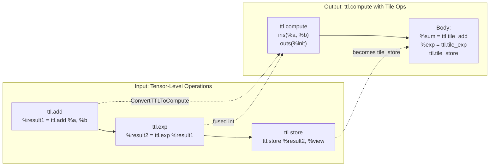
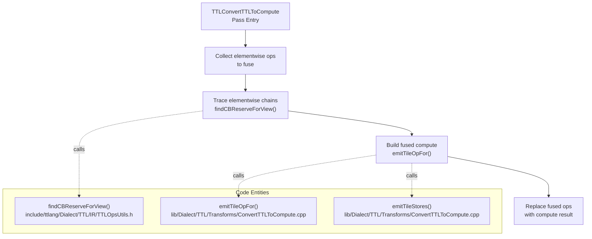
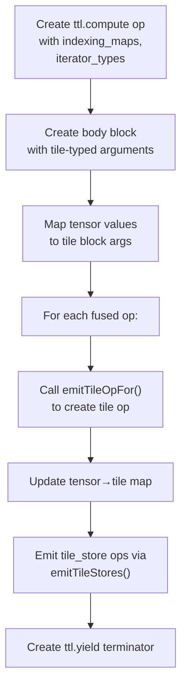
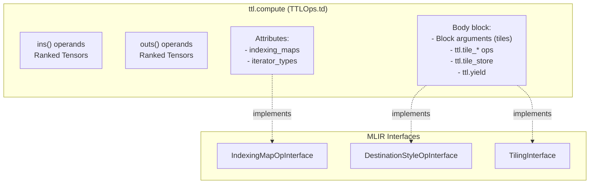

# Elementwise Fusion (ConvertTTLToCompute)

Relevant source files
*   [include/ttlang/Dialect/TTL/IR/TTL.h](https://github.com/tenstorrent/tt-lang/blob/d76e6233/include/ttlang/Dialect/TTL/IR/TTL.h)
*   [include/ttlang/Dialect/TTL/IR/TTLOps.td](https://github.com/tenstorrent/tt-lang/blob/d76e6233/include/ttlang/Dialect/TTL/IR/TTLOps.td)
*   [include/ttlang/Dialect/TTL/IR/TTLOpsUtils.h](https://github.com/tenstorrent/tt-lang/blob/d76e6233/include/ttlang/Dialect/TTL/IR/TTLOpsUtils.h)
*   [lib/Dialect/TTL/IR/TTLOps.cpp](https://github.com/tenstorrent/tt-lang/blob/d76e6233/lib/Dialect/TTL/IR/TTLOps.cpp)
*   [lib/Dialect/TTL/Transforms/ConvertTTLTileOpsToTTKernel.cpp](https://github.com/tenstorrent/tt-lang/blob/d76e6233/lib/Dialect/TTL/Transforms/ConvertTTLTileOpsToTTKernel.cpp)
*   [lib/Dialect/TTL/Transforms/ConvertTTLToCompute.cpp](https://github.com/tenstorrent/tt-lang/blob/d76e6233/lib/Dialect/TTL/Transforms/ConvertTTLToCompute.cpp)
*   [lib/Dialect/TTL/Transforms/ConvertTTLToTTKernel.cpp](https://github.com/tenstorrent/tt-lang/blob/d76e6233/lib/Dialect/TTL/Transforms/ConvertTTLToTTKernel.cpp)
*   [lib/Dialect/TTL/Transforms/TTLSetComputeKernelConfig.cpp](https://github.com/tenstorrent/tt-lang/blob/d76e6233/lib/Dialect/TTL/Transforms/TTLSetComputeKernelConfig.cpp)
*   [python/ttl/operators.py](https://github.com/tenstorrent/tt-lang/blob/d76e6233/python/ttl/operators.py)
*   [test/python/test_typecast.py](https://github.com/tenstorrent/tt-lang/blob/d76e6233/test/python/test_typecast.py)
*   [test/ttlang/Conversion/TTLToCompute/dst_assignment.mlir](https://github.com/tenstorrent/tt-lang/blob/d76e6233/test/ttlang/Conversion/TTLToCompute/dst_assignment.mlir)
*   [test/ttlang/Conversion/TTLToCompute/elementwise_basic.mlir](https://github.com/tenstorrent/tt-lang/blob/d76e6233/test/ttlang/Conversion/TTLToCompute/elementwise_basic.mlir)
*   [test/ttlang/Conversion/TTLToCompute/elementwise_coverage.mlir](https://github.com/tenstorrent/tt-lang/blob/d76e6233/test/ttlang/Conversion/TTLToCompute/elementwise_coverage.mlir)
*   [test/ttlang/Conversion/TTLToCompute/elementwise_ops.mlir](https://github.com/tenstorrent/tt-lang/blob/d76e6233/test/ttlang/Conversion/TTLToCompute/elementwise_ops.mlir)
*   [test/ttlang/Conversion/TTLToCompute/matmul_fusion.mlir](https://github.com/tenstorrent/tt-lang/blob/d76e6233/test/ttlang/Conversion/TTLToCompute/matmul_fusion.mlir)
*   [test/ttlang/Dialect/TTL/Transforms/AssignDST/dst_add_mul_exp_chain.mlir](https://github.com/tenstorrent/tt-lang/blob/d76e6233/test/ttlang/Dialect/TTL/Transforms/AssignDST/dst_add_mul_exp_chain.mlir)
*   [test/ttlang/Dialect/TTL/Transforms/AssignDST/dst_corner_cases.mlir](https://github.com/tenstorrent/tt-lang/blob/d76e6233/test/ttlang/Dialect/TTL/Transforms/AssignDST/dst_corner_cases.mlir)
*   [test/ttlang/Dialect/TTL/Transforms/AssignDST/dst_fpu_binary.mlir](https://github.com/tenstorrent/tt-lang/blob/d76e6233/test/ttlang/Dialect/TTL/Transforms/AssignDST/dst_fpu_binary.mlir)
*   [test/ttlang/Dialect/TTL/Transforms/AssignDST/dst_multi_use_patterns.mlir](https://github.com/tenstorrent/tt-lang/blob/d76e6233/test/ttlang/Dialect/TTL/Transforms/AssignDST/dst_multi_use_patterns.mlir)
*   [test/ttlang/Dialect/TTL/Transforms/AssignDST/dst_register_reuse.mlir](https://github.com/tenstorrent/tt-lang/blob/d76e6233/test/ttlang/Dialect/TTL/Transforms/AssignDST/dst_register_reuse.mlir)
*   [test/ttlang/Dialect/TTL/Transforms/AssignDST/dst_seven_op_chain.mlir](https://github.com/tenstorrent/tt-lang/blob/d76e6233/test/ttlang/Dialect/TTL/Transforms/AssignDST/dst_seven_op_chain.mlir)
*   [test/ttlang/Dialect/TTL/Transforms/AssignDST/dst_tile_regs_acquire.mlir](https://github.com/tenstorrent/tt-lang/blob/d76e6233/test/ttlang/Dialect/TTL/Transforms/AssignDST/dst_tile_regs_acquire.mlir)
*   [test/ttlang/Dialect/TTL/Transforms/AssignDST/dst_typecast_mixed_dtypes.mlir](https://github.com/tenstorrent/tt-lang/blob/d76e6233/test/ttlang/Dialect/TTL/Transforms/AssignDST/dst_typecast_mixed_dtypes.mlir)
*   [test/ttlang/Dialect/TTL/Transforms/SetComputeKernelConfig/unpack_to_dest_fp32_negative.mlir](https://github.com/tenstorrent/tt-lang/blob/d76e6233/test/ttlang/Dialect/TTL/Transforms/SetComputeKernelConfig/unpack_to_dest_fp32_negative.mlir)
*   [test/ttlang/Dialect/TTL/Transforms/SetComputeKernelConfig/unpack_to_dest_fp32_positive.mlir](https://github.com/tenstorrent/tt-lang/blob/d76e6233/test/ttlang/Dialect/TTL/Transforms/SetComputeKernelConfig/unpack_to_dest_fp32_positive.mlir)

## Purpose and Scope

The `ConvertTTLToCompute` pass transforms high-level tensor elementwise operations (e.g., `ttl.add`, `ttl.mul`, `ttl.exp`) into fused `ttl.compute` operations containing tile-level ops. This pass is the first transformation in the TTL compilation pipeline, enabling:

*   **Fusion of elementwise chains**: Multiple sequential elementwise operations are fused into a single compute body, reducing memory traffic. [lib/Dialect/TTL/Transforms/ConvertTTLToCompute.cpp 159-183](https://github.com/tenstorrent/tt-lang/blob/d76e6233/lib/Dialect/TTL/Transforms/ConvertTTLToCompute.cpp#L159-L183)
*   **SSA-style tile operations**: Results in clean SSA form suitable for downstream optimizations (CSE, DCE, canonicalization). [lib/Dialect/TTL/Transforms/ConvertTTLToCompute.cpp 18-20](https://github.com/tenstorrent/tt-lang/blob/d76e6233/lib/Dialect/TTL/Transforms/ConvertTTLToCompute.cpp#L18-L20)
*   **DST register allocation**: Provides the IR structure required by the DST assignment pass [3.3.2](https://github.com/tenstorrent/tt-lang/blob/d76e6233/3.3.2)[lib/Dialect/TTL/Transforms/ConvertTTLTileOpsToTTKernel.cpp 10-12](https://github.com/tenstorrent/tt-lang/blob/d76e6233/lib/Dialect/TTL/Transforms/ConvertTTLTileOpsToTTKernel.cpp#L10-L12)
*   **Subblocking via TilingInterface**: The structured `ttl.compute` op implements `TilingInterface`, enabling subblocking [3.3.3](https://github.com/tenstorrent/tt-lang/blob/d76e6233/3.3.3)[include/ttlang/Dialect/TTL/IR/TTLOps.td 18](https://github.com/tenstorrent/tt-lang/blob/d76e6233/include/ttlang/Dialect/TTL/IR/TTLOps.td#L18-L18)

For loop lowering from `ttl.compute` to `scf.for` loops, see [3.3.4](https://github.com/tenstorrent/tt-lang/blob/d76e6233/3.3.4)

**Sources:**[lib/Dialect/TTL/Transforms/ConvertTTLToCompute.cpp 1-25](https://github.com/tenstorrent/tt-lang/blob/d76e6233/lib/Dialect/TTL/Transforms/ConvertTTLToCompute.cpp#L1-L25)[include/ttlang/Dialect/TTL/IR/TTLOps.td 1-21](https://github.com/tenstorrent/tt-lang/blob/d76e6233/include/ttlang/Dialect/TTL/IR/TTLOps.td#L1-L21)

* * *

## Transformation Overview

The pass identifies chains of elementwise operations and groups them into a single `ttl.compute` region. This effectively moves computation from the "tensor-at-a-time" abstraction to a "tile-at-a-time" loop body. [lib/Dialect/TTL/Transforms/ConvertTTLToCompute.cpp 159-183](https://github.com/tenstorrent/tt-lang/blob/d76e6233/lib/Dialect/TTL/Transforms/ConvertTTLToCompute.cpp#L159-L183)

| Feature | Before (Tensor Ops) | After (Compute Op) |
| --- | --- | --- |
| **Granularity** | Entire Tensor | Single Tile (32x32) |
| **Storage** | Circular Buffers (L1) | DST Registers |
| **Operation Type** | `ttl.add`, `ttl.exp` | `ttl.tile_add`, `ttl.tile_exp` |
| **Output Pattern** | `ttl.store` to CB | `ttl.tile_store` to CB |

Title: Elementwise Fusion Transformation

**Sources:**[lib/Dialect/TTL/Transforms/ConvertTTLToCompute.cpp 97-153](https://github.com/tenstorrent/tt-lang/blob/d76e6233/lib/Dialect/TTL/Transforms/ConvertTTLToCompute.cpp#L97-L153)[include/ttlang/Dialect/TTL/IR/TTLOps.td 225-240](https://github.com/tenstorrent/tt-lang/blob/d76e6233/include/ttlang/Dialect/TTL/IR/TTLOps.td#L225-L240)

* * *

## Input: Tensor-Level Elementwise Operations

### Elementwise Operations Table

The following operations are categorized and supported for fusion. They are defined via traits and categorized in the rewriter logic. [include/ttlang/Dialect/TTL/IR/TTL.h 161-176](https://github.com/tenstorrent/tt-lang/blob/d76e6233/include/ttlang/Dialect/TTL/IR/TTL.h#L161-L176)

| Category | Operations | Tensor Op Example | Tile Op Result |
| --- | --- | --- | --- |
| **Binary** | add, sub, mul, div | `ttl.add %a, %b` | `ttl.tile_add %a_tile, %b_tile` |
| **Binary (MinMax)** | max, min | `ttl.max %a, %b` | `ttl.tile_max %a_tile, %b_tile` |
| **Unary** | exp, log, sqrt, rsqrt | `ttl.exp %x` | `ttl.tile_exp %x_tile` |
| **Unary (Activation)** | tanh, sigmoid, relu | `ttl.relu %x` | `ttl.tile_relu %x_tile` |
| **Unary (Math)** | neg, abs, floor, recip | `ttl.abs %x` | `ttl.tile_abs %x_tile` |

**Sources:**[lib/Dialect/TTL/Transforms/ConvertTTLToCompute.cpp 161-183](https://github.com/tenstorrent/tt-lang/blob/d76e6233/lib/Dialect/TTL/Transforms/ConvertTTLToCompute.cpp#L161-L183)[include/ttlang/Dialect/TTL/IR/TTL.h 161-181](https://github.com/tenstorrent/tt-lang/blob/d76e6233/include/ttlang/Dialect/TTL/IR/TTL.h#L161-L181)

* * *

## Fusion Algorithm

### Pass Structure

The pass utilizes a greedy pattern rewriter to find sink operations (like `ttl.store`) and trace their producer chains. [lib/Dialect/TTL/Transforms/ConvertTTLToCompute.cpp 18-20](https://github.com/tenstorrent/tt-lang/blob/d76e6233/lib/Dialect/TTL/Transforms/ConvertTTLToCompute.cpp#L18-L20)

Title: ConvertTTLToCompute Logic Flow

**Sources:**[lib/Dialect/TTL/Transforms/ConvertTTLToCompute.cpp 159-183](https://github.com/tenstorrent/tt-lang/blob/d76e6233/lib/Dialect/TTL/Transforms/ConvertTTLToCompute.cpp#L159-L183)[lib/Dialect/TTL/Transforms/ConvertTTLToCompute.cpp 97-153](https://github.com/tenstorrent/tt-lang/blob/d76e6233/lib/Dialect/TTL/Transforms/ConvertTTLToCompute.cpp#L97-L153)

### Tracing Elementwise Chains

The pass identifies fusible elementwise chains by tracing backward from sink operations. [lib/Dialect/TTL/Transforms/ConvertTTLToCompute.cpp 101-119](https://github.com/tenstorrent/tt-lang/blob/d76e6233/lib/Dialect/TTL/Transforms/ConvertTTLToCompute.cpp#L101-L119)

**Fusion criteria:**

*   Operations must be elementwise (checked via traits such as `TTLUnaryElementwiseOpTrait`). [include/ttlang/Dialect/TTL/IR/TTL.h 166-176](https://github.com/tenstorrent/tt-lang/blob/d76e6233/include/ttlang/Dialect/TTL/IR/TTL.h#L166-L176)
*   Roots must be attached to a circular buffer via `ttl.attach_cb`. [include/ttlang/Dialect/TTL/IR/TTLOps.td 53-61](https://github.com/tenstorrent/tt-lang/blob/d76e6233/include/ttlang/Dialect/TTL/IR/TTLOps.td#L53-L61)
*   The sink is typically a `ttl.store` operation writing to a `cb_reserve` view. [lib/Dialect/TTL/Transforms/ConvertTTLToCompute.cpp 107-111](https://github.com/tenstorrent/tt-lang/blob/d76e6233/lib/Dialect/TTL/Transforms/ConvertTTLToCompute.cpp#L107-L111)

**Sources:**[lib/Dialect/TTL/Transforms/ConvertTTLToCompute.cpp 101-119](https://github.com/tenstorrent/tt-lang/blob/d76e6233/lib/Dialect/TTL/Transforms/ConvertTTLToCompute.cpp#L101-L119)[include/ttlang/Dialect/TTL/IR/TTLOpsUtils.h 162-164](https://github.com/tenstorrent/tt-lang/blob/d76e6233/include/ttlang/Dialect/TTL/IR/TTLOpsUtils.h#L162-L164)

### Building the ttl.compute Operation

The transformation creates a structured compute operation that encapsulates the logic:

1.   **Output CB Collection**: Identifies all unique output CBs from `store` users via `collectOutputCBs`. [lib/Dialect/TTL/Transforms/ConvertTTLToCompute.cpp 97-119](https://github.com/tenstorrent/tt-lang/blob/d76e6233/lib/Dialect/TTL/Transforms/ConvertTTLToCompute.cpp#L97-L119)
2.   **Compute Body Generation**: Creates a block where arguments represent single tiles from the input tensors. [lib/Dialect/TTL/Transforms/ConvertTTLToCompute.cpp 141-146](https://github.com/tenstorrent/tt-lang/blob/d76e6233/lib/Dialect/TTL/Transforms/ConvertTTLToCompute.cpp#L141-L146)
3.   **Tile Operation Emission**: Maps each tensor-level op to its tile-level counterpart via `emitTileOpFor`. [lib/Dialect/TTL/Transforms/ConvertTTLToCompute.cpp 161-183](https://github.com/tenstorrent/tt-lang/blob/d76e6233/lib/Dialect/TTL/Transforms/ConvertTTLToCompute.cpp#L161-L183)
4.   **Store Operation Lowering**: Block-level `ttl.store` operations are transformed into `ttl.tile_store` operations via `emitTileStores`. [lib/Dialect/TTL/Transforms/ConvertTTLToCompute.cpp 151-187](https://github.com/tenstorrent/tt-lang/blob/d76e6233/lib/Dialect/TTL/Transforms/ConvertTTLToCompute.cpp#L151-L187)

Title: Compute Body Generation Pipeline

**Sources:**[lib/Dialect/TTL/Transforms/ConvertTTLToCompute.cpp 136-187](https://github.com/tenstorrent/tt-lang/blob/d76e6233/lib/Dialect/TTL/Transforms/ConvertTTLToCompute.cpp#L136-L187)[lib/Dialect/TTL/Transforms/ConvertTTLToCompute.cpp 161-183](https://github.com/tenstorrent/tt-lang/blob/d76e6233/lib/Dialect/TTL/Transforms/ConvertTTLToCompute.cpp#L161-L183)

* * *

## FPU Binary Optimization

The fusion pass and downstream DST assignment distinguish between **SFPU** and **FPU** execution engines.

*   **FPU Binary Ops**: Ops like `add`, `sub`, and `mul` can execute on the FPU engine if both operands are block arguments (reading directly from CB). [test/ttlang/Dialect/TTL/Transforms/AssignDST/dst_fpu_binary.mlir 23-39](https://github.com/tenstorrent/tt-lang/blob/d76e6233/test/ttlang/Dialect/TTL/Transforms/AssignDST/dst_fpu_binary.mlir#L23-L39)
*   **Configuration**: The pass `TTLSetComputeKernelConfig` sets attributes like `ttl.enable_fpu_binary_ops` to enable this path. [lib/Dialect/TTL/Transforms/TTLSetComputeKernelConfig.cpp 89-92](https://github.com/tenstorrent/tt-lang/blob/d76e6233/lib/Dialect/TTL/Transforms/TTLSetComputeKernelConfig.cpp#L89-L92)
*   **Benefit**: FPU ops consume 0 DST input slots, effectively doubling the achievable `unroll_factor` for simple binary patterns. [test/ttlang/Dialect/TTL/Transforms/AssignDST/dst_fpu_binary.mlir 31](https://github.com/tenstorrent/tt-lang/blob/d76e6233/test/ttlang/Dialect/TTL/Transforms/AssignDST/dst_fpu_binary.mlir#L31-L31)

**Sources:**[lib/Dialect/TTL/Transforms/TTLSetComputeKernelConfig.cpp 70-82](https://github.com/tenstorrent/tt-lang/blob/d76e6233/lib/Dialect/TTL/Transforms/TTLSetComputeKernelConfig.cpp#L70-L82)[test/ttlang/Dialect/TTL/Transforms/AssignDST/dst_fpu_binary.mlir 1-10](https://github.com/tenstorrent/tt-lang/blob/d76e6233/test/ttlang/Dialect/TTL/Transforms/AssignDST/dst_fpu_binary.mlir#L1-L10)

* * *

## Broadcast Semantics

Broadcast logic is handled by building input affine maps that use constant 0 for broadcast dimensions. This is used when an input tensor has a size-1 dimension that must be expanded to match the output iteration domain. [lib/Dialect/TTL/Transforms/ConvertTTLToCompute.cpp 54-67](https://github.com/tenstorrent/tt-lang/blob/d76e6233/lib/Dialect/TTL/Transforms/ConvertTTLToCompute.cpp#L54-L67)

The hardware-level broadcast type (`Scalar`, `Row`, `Col`) is derived from these normalized broadcast dimensions to determine which SFPU/FPU broadcast instruction to use. [lib/Dialect/TTL/Transforms/ConvertTTLToCompute.cpp 35-50](https://github.com/tenstorrent/tt-lang/blob/d76e6233/lib/Dialect/TTL/Transforms/ConvertTTLToCompute.cpp#L35-L50)

**Sources:**[lib/Dialect/TTL/Transforms/ConvertTTLToCompute.cpp 35-67](https://github.com/tenstorrent/tt-lang/blob/d76e6233/lib/Dialect/TTL/Transforms/ConvertTTLToCompute.cpp#L35-L67)[lib/Dialect/TTL/Transforms/ConvertTTLToCompute.cpp 71-83](https://github.com/tenstorrent/tt-lang/blob/d76e6233/lib/Dialect/TTL/Transforms/ConvertTTLToCompute.cpp#L71-L83)

* * *

## Matmul Fusion Patterns

Specialized fusion patterns exist for `matmul` operations:

*   **Matmul+Add Fold**: `ttl.add(matmul(a, b), c)` is folded into a 3-operand `ttl.tile_matmul_block %a, %b, %c`. [test/ttlang/Conversion/TTLToCompute/matmul_fusion.mlir 3-21](https://github.com/tenstorrent/tt-lang/blob/d76e6233/test/ttlang/Conversion/TTLToCompute/matmul_fusion.mlir#L3-L21)
*   **Post-Matmul Unary**: Unary ops like `relu` or `sigmoid` following a matmul are applied in-place in the same fused compute body. [test/ttlang/Conversion/TTLToCompute/matmul_fusion.mlir 87-98](https://github.com/tenstorrent/tt-lang/blob/d76e6233/test/ttlang/Conversion/TTLToCompute/matmul_fusion.mlir#L87-L98)

**Sources:**[test/ttlang/Conversion/TTLToCompute/matmul_fusion.mlir 3-98](https://github.com/tenstorrent/tt-lang/blob/d76e6233/test/ttlang/Conversion/TTLToCompute/matmul_fusion.mlir#L3-L98)

* * *

## Output: ttl.compute Operation

### Interface Implementations

The `ttl.compute` operation is the central artifact of this pass. It implements several critical MLIR interfaces:

*   **DestinationStyleOpInterface**: Outputs are destination operands that are updated in-place. [include/ttlang/Dialect/TTL/IR/TTLOps.td 14](https://github.com/tenstorrent/tt-lang/blob/d76e6233/include/ttlang/Dialect/TTL/IR/TTLOps.td#L14-L14)
*   **IndexingMapOpInterface**: Provides indexing maps for iteration domain to operand space mapping. [include/ttlang/Dialect/TTL/IR/TTLOps.td 17](https://github.com/tenstorrent/tt-lang/blob/d76e6233/include/ttlang/Dialect/TTL/IR/TTLOps.td#L17-L17)
*   **TilingInterface**: Enables subblocking via implementation of tiling methods. [include/ttlang/Dialect/TTL/IR/TTLOps.td 18](https://github.com/tenstorrent/tt-lang/blob/d76e6233/include/ttlang/Dialect/TTL/IR/TTLOps.td#L18-L18)

Title: ttl.compute Operation Architecture

**Sources:**[include/ttlang/Dialect/TTL/IR/TTLOps.td 10-20](https://github.com/tenstorrent/tt-lang/blob/d76e6233/include/ttlang/Dialect/TTL/IR/TTLOps.td#L10-L20)[lib/Dialect/TTL/IR/TTLOps.cpp 142-164](https://github.com/tenstorrent/tt-lang/blob/d76e6233/lib/Dialect/TTL/IR/TTLOps.cpp#L142-L164)

* * *

## Related Passes

After `ConvertTTLToCompute`, the compilation pipeline continues with:

1.   **[DST Register Assignment (3.3.2)](https://github.com/tenstorrent/tt-lang/blob/d76e6233/DST%20Register%20Assignment%20(3.3.2))**: Allocates DST registers to tile values. This pass adds `dst_idx` attributes and handles `copy_tile` insertion for SFPU/FPU operands. [lib/Dialect/TTL/Transforms/ConvertTTLTileOpsToTTKernel.cpp 10-12](https://github.com/tenstorrent/tt-lang/blob/d76e6233/lib/Dialect/TTL/Transforms/ConvertTTLTileOpsToTTKernel.cpp#L10-L12)
2.   **[Subblocking (3.3.3)](https://github.com/tenstorrent/tt-lang/blob/d76e6233/Subblocking%20(3.3.3))**: Partitions large compute ops into DST-sized chunks via `TilingInterface`. [include/ttlang/Dialect/TTL/IR/TTLOps.td 18](https://github.com/tenstorrent/tt-lang/blob/d76e6233/include/ttlang/Dialect/TTL/IR/TTLOps.td#L18-L18)
3.   **[Loop Lowering (3.3.4)](https://github.com/tenstorrent/tt-lang/blob/d76e6233/Loop%20Lowering%20(3.3.4))**: Converts `ttl.compute` to `scf.for` loops. [lib/Dialect/TTL/Transforms/ConvertTTLTileOpsToTTKernel.cpp 123-143](https://github.com/tenstorrent/tt-lang/blob/d76e6233/lib/Dialect/TTL/Transforms/ConvertTTLTileOpsToTTKernel.cpp#L123-L143)

**Sources:**[lib/Dialect/TTL/Transforms/ConvertTTLTileOpsToTTKernel.cpp 1-17](https://github.com/tenstorrent/tt-lang/blob/d76e6233/lib/Dialect/TTL/Transforms/ConvertTTLTileOpsToTTKernel.cpp#L1-L17)[lib/Dialect/TTL/Transforms/ConvertTTLTileOpsToTTKernel.cpp 123-143](https://github.com/tenstorrent/tt-lang/blob/d76e6233/lib/Dialect/TTL/Transforms/ConvertTTLTileOpsToTTKernel.cpp#L123-L143)

Dismiss
Refresh this wiki

Enter email to refresh
