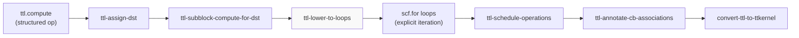
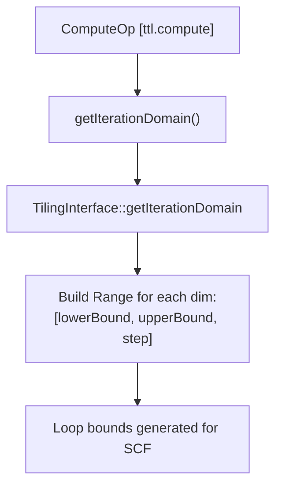
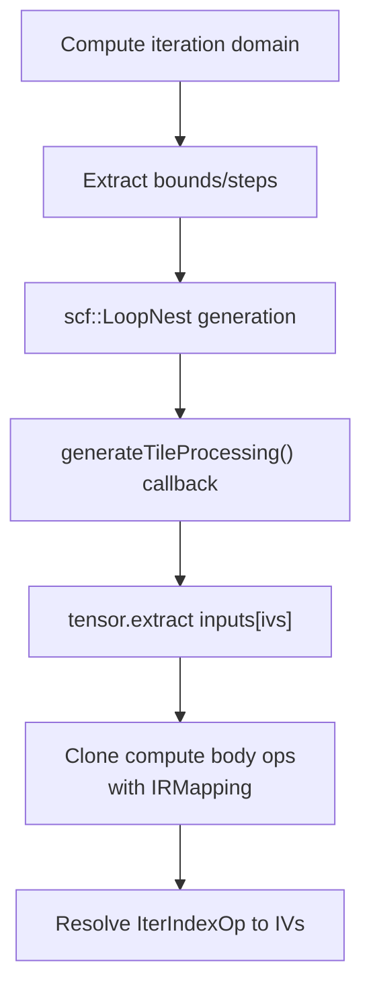
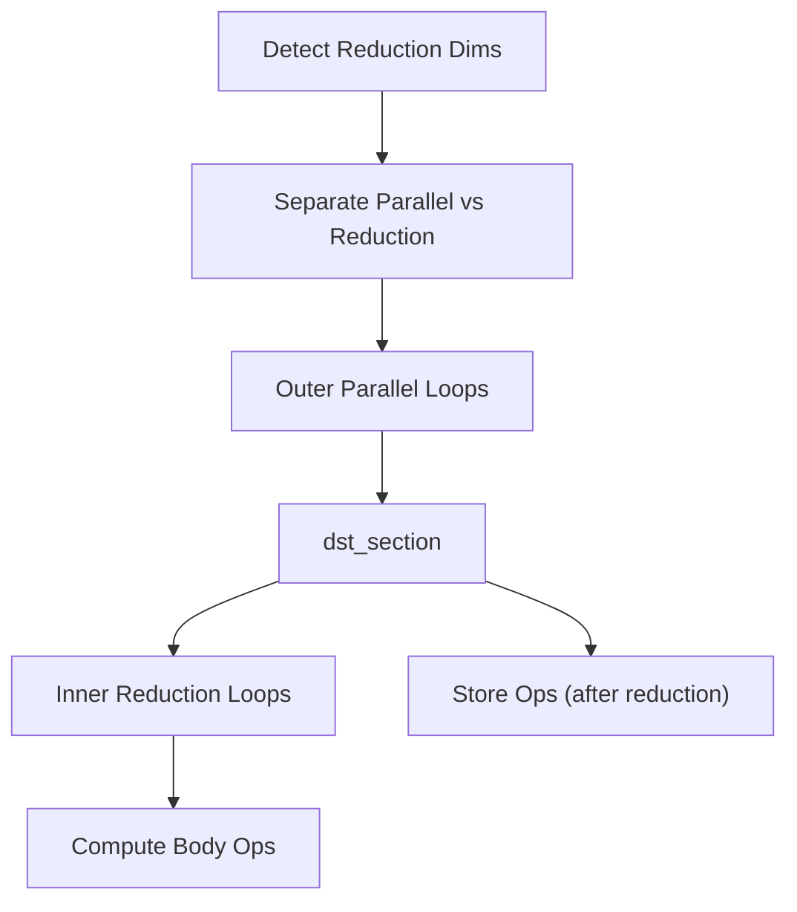

# Loop Lowering to SCF

Relevant source files
*   [lib/Dialect/TTL/Transforms/ConvertTTLComputeToSCF.cpp](https://github.com/tenstorrent/tt-lang/blob/d76e6233/lib/Dialect/TTL/Transforms/ConvertTTLComputeToSCF.cpp)
*   [lib/Dialect/TTL/Transforms/TTLScheduleOperations.cpp](https://github.com/tenstorrent/tt-lang/blob/d76e6233/lib/Dialect/TTL/Transforms/TTLScheduleOperations.cpp)
*   [test/ttlang/Dialect/TTL/IR/compute_invalid.mlir](https://github.com/tenstorrent/tt-lang/blob/d76e6233/test/ttlang/Dialect/TTL/IR/compute_invalid.mlir)
*   [test/ttlang/Dialect/TTL/Transforms/ScheduleOperations/bcast_init_grouping.mlir](https://github.com/tenstorrent/tt-lang/blob/d76e6233/test/ttlang/Dialect/TTL/Transforms/ScheduleOperations/bcast_init_grouping.mlir)
*   [test/ttlang/Dialect/TTL/Transforms/ScheduleOperations/schedule_dst_hazards.mlir](https://github.com/tenstorrent/tt-lang/blob/d76e6233/test/ttlang/Dialect/TTL/Transforms/ScheduleOperations/schedule_dst_hazards.mlir)
*   [test/ttlang/Dialect/TTL/Transforms/ScheduleOperations/schedule_edge_cases.mlir](https://github.com/tenstorrent/tt-lang/blob/d76e6233/test/ttlang/Dialect/TTL/Transforms/ScheduleOperations/schedule_edge_cases.mlir)
*   [test/ttlang/Dialect/TTL/Transforms/ScheduleOperations/schedule_operations.mlir](https://github.com/tenstorrent/tt-lang/blob/d76e6233/test/ttlang/Dialect/TTL/Transforms/ScheduleOperations/schedule_operations.mlir)
*   [test/ttlang/Dialect/TTL/Transforms/ScheduleOperations/schedule_subblock.mlir](https://github.com/tenstorrent/tt-lang/blob/d76e6233/test/ttlang/Dialect/TTL/Transforms/ScheduleOperations/schedule_subblock.mlir)

## Purpose and Scope

This page describes the **`ttl-lower-to-loops`** pass, which converts high-level `ttl.compute` structured operations into explicit nested `scf.for` loops. This is a critical transformation in the compilation pipeline (Phase 2, after DST assignment and subblocking) that exposes the iteration structure over tile blocks, enabling subsequent passes to lower individual tile operations to hardware instructions.

For information about the `ttl.compute` operation and its semantics, see [Elementwise Fusion](https://deepwiki.com/tenstorrent/tt-lang/3.3.1-elementwise-fusion-(convertttltocompute)). For DST register assignment that precedes this pass, see [DST Register Assignment](https://deepwiki.com/tenstorrent/tt-lang/3.3.2-dst-register-assignment). For subblocking that determines how computes are partitioned, see [Subblocking and Tiling Strategy](https://deepwiki.com/tenstorrent/tt-lang/3.3.3-subblocking-and-tiling-strategy).

**Sources:**[lib/Dialect/TTL/Transforms/ConvertTTLComputeToSCF.cpp 1-35](https://github.com/tenstorrent/tt-lang/blob/d76e6233/lib/Dialect/TTL/Transforms/ConvertTTLComputeToSCF.cpp#L1-L35)[lib/Dialect/TTL/Transforms/ConvertTTLComputeToSCF.cpp 32-35](https://github.com/tenstorrent/tt-lang/blob/d76e6233/lib/Dialect/TTL/Transforms/ConvertTTLComputeToSCF.cpp#L32-L35)

* * *

## Pass Overview

### Position in Pipeline

**Diagram: Position of ttl-lower-to-loops in the compilation pipeline**

The pass runs after DST assignment (`ttl-assign-dst`) and subblocking (`ttl-subblock-compute-for-dst`) but before operation scheduling (`ttl-schedule-operations`) and TTL-to-TTKernel conversion. It operates at function scope and processes each `ttl.compute` operation independently.

**Sources:**[lib/Dialect/TTL/Transforms/ConvertTTLComputeToSCF.cpp 32-35](https://github.com/tenstorrent/tt-lang/blob/d76e6233/lib/Dialect/TTL/Transforms/ConvertTTLComputeToSCF.cpp#L32-L35)[test/ttlang/Dialect/TTL/Transforms/ScheduleOperations/schedule_operations.mlir 3-5](https://github.com/tenstorrent/tt-lang/blob/d76e6233/test/ttlang/Dialect/TTL/Transforms/ScheduleOperations/schedule_operations.mlir#L3-L5)[test/ttlang/Dialect/TTL/Transforms/ScheduleOperations/schedule_subblock.mlir 3-5](https://github.com/tenstorrent/tt-lang/blob/d76e6233/test/ttlang/Dialect/TTL/Transforms/ScheduleOperations/schedule_subblock.mlir#L3-L5)




**Diagram: Position of ttl-lower-to-loops in the compilation pipeline**

The pass runs after DST assignment (`ttl-assign-dst`) and subblocking (`ttl-subblock-compute-for-dst`) but before operation scheduling (`ttl-schedule-operations`) and TTL-to-TTKernel conversion. It operates at function scope and processes each `ttl.compute` operation independently.
```
### Input and Output

| Aspect | Before Pass | After Pass |
| --- | --- | --- |
| **Operation** | `ttl.compute` with region | `scf.for` nested loops |
| **Body** | Block arguments represent tiles | `tensor.extract` from input tensors |
| **Iteration** | Implicit (indexing maps) | Explicit loop induction variables |
| **Results** | SSA values from compute | Side effects via `ttl.tile_store` |
| **Body Mapping** | `ttl.iter_index` ops | Loop induction variables (IVs) |

**Sources:**[lib/Dialect/TTL/Transforms/ConvertTTLComputeToSCF.cpp 51-87](https://github.com/tenstorrent/tt-lang/blob/d76e6233/lib/Dialect/TTL/Transforms/ConvertTTLComputeToSCF.cpp#L51-L87)[lib/Dialect/TTL/Transforms/ConvertTTLComputeToSCF.cpp 137-170](https://github.com/tenstorrent/tt-lang/blob/d76e6233/lib/Dialect/TTL/Transforms/ConvertTTLComputeToSCF.cpp#L137-L170)[test/ttlang/Dialect/TTL/IR/compute_invalid.mlir 24-36](https://github.com/tenstorrent/tt-lang/blob/d76e6233/test/ttlang/Dialect/TTL/IR/compute_invalid.mlir#L24-L36)

* * *

## Loop Generation Process

### Iteration Domain Computation

The pass determines loop bounds by analyzing the shapes of input and output tensors. It uses the iteration domain from the `ComputeOp`'s `TilingInterface`, which correctly handles complex cases like matmul's 3D iteration space (M, N, K) where the domain rank may exceed operand ranks.

**Diagram: Iteration domain computation from ComputeOp**

The `getIterationDomain` function at [lib/Dialect/TTL/Transforms/ConvertTTLComputeToSCF.cpp 45-47](https://github.com/tenstorrent/tt-lang/blob/d76e6233/lib/Dialect/TTL/Transforms/ConvertTTLComputeToSCF.cpp#L45-L47) leverages the `TilingInterface` to resolve bounds.

**Sources:**[lib/Dialect/TTL/Transforms/ConvertTTLComputeToSCF.cpp 38-47](https://github.com/tenstorrent/tt-lang/blob/d76e6233/lib/Dialect/TTL/Transforms/ConvertTTLComputeToSCF.cpp#L38-L47)




**Diagram: Iteration domain computation from ComputeOp**

The `getIterationDomain` function at [lib/Dialect/TTL/Transforms/ConvertTTLComputeToSCF.cpp:45-47]() leverages the `TilingInterface` to resolve bounds.
```
### Loop Nest Construction

The pass creates perfectly nested loops. Results flow through side effects (`ttl.tile_store`) rather than SSA values, since stores write directly to circular buffers via `DST` registers.

**Diagram: Loop nest construction flow**

Key characteristics:

*   **Side-effect-only loops**: No `iter_args`, no tensor results from `scf.for`[lib/Dialect/TTL/Transforms/ConvertTTLComputeToSCF.cpp 49-50](https://github.com/tenstorrent/tt-lang/blob/d76e6233/lib/Dialect/TTL/Transforms/ConvertTTLComputeToSCF.cpp#L49-L50)
*   **Perfect nesting**: Inner loops are the only operations in outer loop bodies.
*   **Indexing Mapping**: Uses `extractTilesAtIndices` to resolve tile coordinates [lib/Dialect/TTL/Transforms/ConvertTTLComputeToSCF.cpp 56-59](https://github.com/tenstorrent/tt-lang/blob/d76e6233/lib/Dialect/TTL/Transforms/ConvertTTLComputeToSCF.cpp#L56-L59)
*   **IterIndex Resolution**: `IterIndexOp` values are replaced by induction variables during cloning [lib/Dialect/TTL/Transforms/ConvertTTLComputeToSCF.cpp 66-74](https://github.com/tenstorrent/tt-lang/blob/d76e6233/lib/Dialect/TTL/Transforms/ConvertTTLComputeToSCF.cpp#L66-L74)

**Sources:**[lib/Dialect/TTL/Transforms/ConvertTTLComputeToSCF.cpp 49-87](https://github.com/tenstorrent/tt-lang/blob/d76e6233/lib/Dialect/TTL/Transforms/ConvertTTLComputeToSCF.cpp#L49-L87)




**Diagram: Loop nest construction flow**

Key characteristics:
- **Side-effect-only loops**: No `iter_args`, no tensor results from `scf.for` [lib/Dialect/TTL/Transforms/ConvertTTLComputeToSCF.cpp:49-50]().
- **Perfect nesting**: Inner loops are the only operations in outer loop bodies.
- **Indexing Mapping**: Uses `extractTilesAtIndices` to resolve tile coordinates [lib/Dialect/TTL/Transforms/ConvertTTLComputeToSCF.cpp:56-59]().
- **IterIndex Resolution**: `IterIndexOp` values are replaced by induction variables during cloning [lib/Dialect/TTL/Transforms/ConvertTTLComputeToSCF.cpp:66-74]().
```
### Body Generation

The `generateTileProcessing()` function creates the loop body:

1.   **Extract input tiles**: Emits `tensor.extract` for each input using induction variables [lib/Dialect/TTL/Transforms/ConvertTTLComputeToSCF.cpp 55-57](https://github.com/tenstorrent/tt-lang/blob/d76e6233/lib/Dialect/TTL/Transforms/ConvertTTLComputeToSCF.cpp#L55-L57)
2.   **Extract output tiles**: Creates dummy extracts for output block arguments needed for SSA mapping [lib/Dialect/TTL/Transforms/ConvertTTLComputeToSCF.cpp 58-59](https://github.com/tenstorrent/tt-lang/blob/d76e6233/lib/Dialect/TTL/Transforms/ConvertTTLComputeToSCF.cpp#L58-L59)
3.   **Resolve iter_index**: Replaces `ttl.iter_index` operations with loop induction variables via `IRMapping`[lib/Dialect/TTL/Transforms/ConvertTTLComputeToSCF.cpp 66-74](https://github.com/tenstorrent/tt-lang/blob/d76e6233/lib/Dialect/TTL/Transforms/ConvertTTLComputeToSCF.cpp#L66-L74)
4.   **Clone body operations**: Maps block arguments to extracted tiles and clones all operations from the original compute body [lib/Dialect/TTL/Transforms/ConvertTTLComputeToSCF.cpp 83](https://github.com/tenstorrent/tt-lang/blob/d76e6233/lib/Dialect/TTL/Transforms/ConvertTTLComputeToSCF.cpp#L83-L83)

**Sources:**[lib/Dialect/TTL/Transforms/ConvertTTLComputeToSCF.cpp 51-87](https://github.com/tenstorrent/tt-lang/blob/d76e6233/lib/Dialect/TTL/Transforms/ConvertTTLComputeToSCF.cpp#L51-L87)

* * *

## Handling Accumulating Computes

For computes involving reductions (e.g., matmul), the pass generates a specific loop structure to manage `DST` persistence and L1 accumulation.

**Diagram: Accumulating loop structure with dst_section**

The `generateAccumulatingLoops` function [lib/Dialect/TTL/Transforms/ConvertTTLComputeToSCF.cpp 100-132](https://github.com/tenstorrent/tt-lang/blob/d76e6233/lib/Dialect/TTL/Transforms/ConvertTTLComputeToSCF.cpp#L100-L132) wraps the reduction loop and stores in a `dst_section` to ensure the `DST` register contents persist across reduction iterations before being packed. Reduction loops are identified by checking the `iterator_types` for "reduction" [lib/Dialect/TTL/Transforms/ConvertTTLComputeToSCF.cpp 108-114](https://github.com/tenstorrent/tt-lang/blob/d76e6233/lib/Dialect/TTL/Transforms/ConvertTTLComputeToSCF.cpp#L108-L114)

**Sources:**[lib/Dialect/TTL/Transforms/ConvertTTLComputeToSCF.cpp 100-132](https://github.com/tenstorrent/tt-lang/blob/d76e6233/lib/Dialect/TTL/Transforms/ConvertTTLComputeToSCF.cpp#L100-L132)[lib/Dialect/TTL/Transforms/ConvertTTLComputeToSCF.cpp 105-115](https://github.com/tenstorrent/tt-lang/blob/d76e6233/lib/Dialect/TTL/Transforms/ConvertTTLComputeToSCF.cpp#L105-L115)

* * *




**Diagram: Accumulating loop structure with dst_section**

The `generateAccumulatingLoops` function [lib/Dialect/TTL/Transforms/ConvertTTLComputeToSCF.cpp:100-132]() wraps the reduction loop and stores in a `dst_section` to ensure the `DST` register contents persist across reduction iterations before being packed. Reduction loops are identified by checking the `iterator_types` for "reduction" [lib/Dialect/TTL/Transforms/ConvertTTLComputeToSCF.cpp:108-114]().
```
## Post-Lowering Operation Scheduling

After loops are generated, the scheduler groups tile operations within sync regions to optimize hardware utilization and minimize re-initialization overhead.

| Feature | Description |
| --- | --- |
| **Dependency Tracking** | Tracks SSA RAW, DST RAW, WAW, and WAR hazards to ensure correctness during reordering [lib/Dialect/TTL/Transforms/TTLScheduleOperations.cpp 112-121](https://github.com/tenstorrent/tt-lang/blob/d76e6233/lib/Dialect/TTL/Transforms/TTLScheduleOperations.cpp#L112-L121) |
| **Init Affinity** | Groups operations by "affinity" (e.g., grouping all Column Broadcasts together) to share a single init call [lib/Dialect/TTL/Transforms/TTLScheduleOperations.cpp 45-67](https://github.com/tenstorrent/tt-lang/blob/d76e6233/lib/Dialect/TTL/Transforms/TTLScheduleOperations.cpp#L45-L67) |
| **WAR Hazard Handling** | Prevents moving a write to a DST slot before a prior read of that slot is completed [test/ttlang/Dialect/TTL/Transforms/ScheduleOperations/schedule_dst_hazards.mlir 14-17](https://github.com/tenstorrent/tt-lang/blob/d76e6233/test/ttlang/Dialect/TTL/Transforms/ScheduleOperations/schedule_dst_hazards.mlir#L14-L17) |
| **Categorization** | Groups operations into categories (Copy, FPU, SFPU) to align with hardware execution stages [lib/Dialect/TTL/Transforms/TTLScheduleOperations.cpp 84-88](https://github.com/tenstorrent/tt-lang/blob/d76e6233/lib/Dialect/TTL/Transforms/TTLScheduleOperations.cpp#L84-L88) |

**Sources:**[lib/Dialect/TTL/Transforms/TTLScheduleOperations.cpp 34-106](https://github.com/tenstorrent/tt-lang/blob/d76e6233/lib/Dialect/TTL/Transforms/TTLScheduleOperations.cpp#L34-L106)[lib/Dialect/TTL/Transforms/TTLScheduleOperations.cpp 112-184](https://github.com/tenstorrent/tt-lang/blob/d76e6233/lib/Dialect/TTL/Transforms/TTLScheduleOperations.cpp#L112-L184)[test/ttlang/Dialect/TTL/Transforms/ScheduleOperations/schedule_dst_hazards.mlir 5-25](https://github.com/tenstorrent/tt-lang/blob/d76e6233/test/ttlang/Dialect/TTL/Transforms/ScheduleOperations/schedule_dst_hazards.mlir#L5-L25)

* * *

## Transformation Examples

### Binary Operation Lowering with Subblocking

When subblocking is enabled, the loop structure is modified to handle subblock tiles within the `DST` register capacity.

**FPU Path Example:** In a 2x2 grid where all tiles fit in one subblock, the scheduler groups all `add_tiles` followed by all `exp_tiles` to maximize instruction throughput.

**After Lowering and Scheduling (FPU):**

`// Grouped: all add_tiles, then all exp_tilesttkernel.add_tiles_init(%CB0, %CB1)ttkernel.add_tiles(%CB0, %CB1, %c0, %c0, %c0)ttkernel.add_tiles(%CB0, %CB1, %c1, %c1, %c1)ttkernel.exp_tile_initttkernel.exp_tile(%c0)ttkernel.exp_tile(%c1)`
**Sources:**[test/ttlang/Dialect/TTL/Transforms/ScheduleOperations/schedule_operations.mlir 40-50](https://github.com/tenstorrent/tt-lang/blob/d76e6233/test/ttlang/Dialect/TTL/Transforms/ScheduleOperations/schedule_operations.mlir#L40-L50)[test/ttlang/Dialect/TTL/Transforms/ScheduleOperations/schedule_subblock.mlir 39-50](https://github.com/tenstorrent/tt-lang/blob/d76e6233/test/ttlang/Dialect/TTL/Transforms/ScheduleOperations/schedule_subblock.mlir#L39-L50)

* * *

## Key Functions and Utilities

| Symbol | Location | Role |
| --- | --- | --- |
| `generateTileProcessing` | [lib/Dialect/TTL/Transforms/ConvertTTLComputeToSCF.cpp 51](https://github.com/tenstorrent/tt-lang/blob/d76e6233/lib/Dialect/TTL/Transforms/ConvertTTLComputeToSCF.cpp#L51-L51) | Core logic for cloning ComputeOp body into SCF loop body. |
| `generateAccumulatingLoops` | [lib/Dialect/TTL/Transforms/ConvertTTLComputeToSCF.cpp 100](https://github.com/tenstorrent/tt-lang/blob/d76e6233/lib/Dialect/TTL/Transforms/ConvertTTLComputeToSCF.cpp#L100-L100) | Specialized loop generation for reduction/accumulation. |
| `getIterationDomain` | [lib/Dialect/TTL/Transforms/ConvertTTLComputeToSCF.cpp 45](https://github.com/tenstorrent/tt-lang/blob/d76e6233/lib/Dialect/TTL/Transforms/ConvertTTLComputeToSCF.cpp#L45-L45) | Computes iteration bounds using `TilingInterface`. |
| `computeDepthLevels` | [lib/Dialect/TTL/Transforms/TTLScheduleOperations.cpp 122](https://github.com/tenstorrent/tt-lang/blob/d76e6233/lib/Dialect/TTL/Transforms/TTLScheduleOperations.cpp#L122-L122) | Computes dependency depth for tile operations considering DST hazards. |
| `getInitAffinity` | [lib/Dialect/TTL/Transforms/TTLScheduleOperations.cpp 45](https://github.com/tenstorrent/tt-lang/blob/d76e6233/lib/Dialect/TTL/Transforms/TTLScheduleOperations.cpp#L45-L45) | Computes key for grouping operations that share hardware initialization. |
| `TileOpSortKey` | [lib/Dialect/TTL/Transforms/TTLScheduleOperations.cpp 70](https://github.com/tenstorrent/tt-lang/blob/d76e6233/lib/Dialect/TTL/Transforms/TTLScheduleOperations.cpp#L70-L70) | Defines the multi-level sorting criteria for the operation scheduler. |

**Sources:**[lib/Dialect/TTL/Transforms/ConvertTTLComputeToSCF.cpp 45-132](https://github.com/tenstorrent/tt-lang/blob/d76e6233/lib/Dialect/TTL/Transforms/ConvertTTLComputeToSCF.cpp#L45-L132)[lib/Dialect/TTL/Transforms/TTLScheduleOperations.cpp 45-106](https://github.com/tenstorrent/tt-lang/blob/d76e6233/lib/Dialect/TTL/Transforms/TTLScheduleOperations.cpp#L45-L106)[lib/Dialect/TTL/Transforms/TTLScheduleOperations.cpp 122-184](https://github.com/tenstorrent/tt-lang/blob/d76e6233/lib/Dialect/TTL/Transforms/TTLScheduleOperations.cpp#L122-L184)

Dismiss
Refresh this wiki

Enter email to refresh
