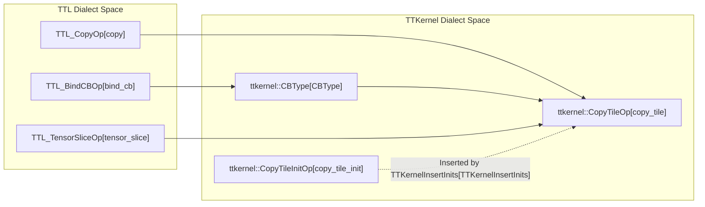

# TTL to TTKernel Conversion

Relevant source files
*   [include/ttlang/Dialect/TTL/IR/TTL.h](https://github.com/tenstorrent/tt-lang/blob/d76e6233/include/ttlang/Dialect/TTL/IR/TTL.h)
*   [include/ttlang/Dialect/TTL/IR/TTLOps.td](https://github.com/tenstorrent/tt-lang/blob/d76e6233/include/ttlang/Dialect/TTL/IR/TTLOps.td)
*   [include/ttlang/Dialect/TTL/IR/TTLOpsUtils.h](https://github.com/tenstorrent/tt-lang/blob/d76e6233/include/ttlang/Dialect/TTL/IR/TTLOpsUtils.h)
*   [lib/Dialect/TTKernel/Transforms/TTKernelInsertInits.cpp](https://github.com/tenstorrent/tt-lang/blob/d76e6233/lib/Dialect/TTKernel/Transforms/TTKernelInsertInits.cpp)
*   [lib/Dialect/TTL/IR/TTLOps.cpp](https://github.com/tenstorrent/tt-lang/blob/d76e6233/lib/Dialect/TTL/IR/TTLOps.cpp)
*   [lib/Dialect/TTL/Transforms/ConvertTTLTileOpsToTTKernel.cpp](https://github.com/tenstorrent/tt-lang/blob/d76e6233/lib/Dialect/TTL/Transforms/ConvertTTLTileOpsToTTKernel.cpp)
*   [lib/Dialect/TTL/Transforms/ConvertTTLToCompute.cpp](https://github.com/tenstorrent/tt-lang/blob/d76e6233/lib/Dialect/TTL/Transforms/ConvertTTLToCompute.cpp)
*   [lib/Dialect/TTL/Transforms/ConvertTTLToTTKernel.cpp](https://github.com/tenstorrent/tt-lang/blob/d76e6233/lib/Dialect/TTL/Transforms/ConvertTTLToTTKernel.cpp)
*   [python/ttl/operators.py](https://github.com/tenstorrent/tt-lang/blob/d76e6233/python/ttl/operators.py)
*   [test/python/test_fpu_binary_mismatched_buffer_factor.py](https://github.com/tenstorrent/tt-lang/blob/d76e6233/test/python/test_fpu_binary_mismatched_buffer_factor.py)
*   [test/python/test_reduce.py](https://github.com/tenstorrent/tt-lang/blob/d76e6233/test/python/test_reduce.py)
*   [test/ttlang/Conversion/TTLToTTKernel/fpu_binary_lowering.mlir](https://github.com/tenstorrent/tt-lang/blob/d76e6233/test/ttlang/Conversion/TTLToTTKernel/fpu_binary_lowering.mlir)
*   [test/ttlang/Conversion/TTLToTTKernel/init_consolidation.mlir](https://github.com/tenstorrent/tt-lang/blob/d76e6233/test/ttlang/Conversion/TTLToTTKernel/init_consolidation.mlir)
*   [test/ttlang/Conversion/TTLToTTKernel/reduce_lowering.mlir](https://github.com/tenstorrent/tt-lang/blob/d76e6233/test/ttlang/Conversion/TTLToTTKernel/reduce_lowering.mlir)
*   [test/ttlang/Dialect/TTL/Transforms/SetComputeKernelConfig/set_compute_kernel_config.mlir](https://github.com/tenstorrent/tt-lang/blob/d76e6233/test/ttlang/Dialect/TTL/Transforms/SetComputeKernelConfig/set_compute_kernel_config.mlir)

## Purpose and Scope

This document describes the lowering of TTL tile operations to hardware-specific TTKernel operations. This transformation is primarily implemented in `ConvertTTLToTTKernel.cpp` and occurs after loop lowering has converted structured `ttl.compute` operations into explicit `scf.for` loops containing `tensor.extract` operations [[lib/Dialect/TTL/Transforms/ConvertTTLToTTKernel.cpp:5-25]](https://deepwiki.com/tenstorrent/tt-lang/3.4-ttl-to-ttkernel-conversion).

The conversion handles:

*   **Compute Operations**: Unary SFPU ops (exp, log, sqrt), binary SFPU ops (add, sub, mul), and FPU binary ops [[lib/Dialect/TTL/Transforms/ConvertTTLToTTKernel.cpp:50-54]](https://deepwiki.com/tenstorrent/tt-lang/3.4-ttl-to-ttkernel-conversion).
*   **Data Movement**: `copy_tile` (CB → DST), `copy_dst` (DST → DST), and `tile_bcast`[[lib/Dialect/TTL/Transforms/ConvertTTLToTTKernel.cpp:112-115]](https://deepwiki.com/tenstorrent/tt-lang/3.4-ttl-to-ttkernel-conversion).
*   **Synchronization**: Lowering of `ttl.tile_regs_acquire`, `ttl.tile_regs_release`, and CB synchronization primitives [[lib/Dialect/TTL/Transforms/ConvertTTLToTTKernel.cpp:180-185]](https://deepwiki.com/tenstorrent/tt-lang/3.4-ttl-to-ttkernel-conversion).
*   **Inter-Core Communication**: Lowering of Pipe and PipeNet operations [[lib/Dialect/TTL/Transforms/ConvertTTLToTTKernel.cpp:7-8]](https://deepwiki.com/tenstorrent/tt-lang/3.4-ttl-to-ttkernel-conversion).

**Sources:**[[lib/Dialect/TTL/Transforms/ConvertTTLToTTKernel.cpp:1-45]](https://deepwiki.com/tenstorrent/tt-lang/3.4-ttl-to-ttkernel-conversion)

* * *

## Tile Operation Categories

TTL tile operations are classified into categories to determine their hardware initialization and scheduling requirements. This classification is performed by `classifyTileOp`[[lib/Dialect/TTL/IR/TTLOpsUtils.cpp:13-41]](https://deepwiki.com/tenstorrent/tt-lang/3.4-ttl-to-ttkernel-conversion).

**Table: Tile Operation Categories**

| Category | Description | Example Ops |
| --- | --- | --- |
| `Bcast` | CB → DST with PACK config | `ttl.tile_bcast` |
| `CopyTile` | CB → DST simple passthrough | `ttl.copy_tile` |
| `FPUBinary` | CB → DST FPU (UNPACK+MATH init) | `ttl.tile_matmul_block`, FPU-marked binary |
| `SFPUUnary` | DST → DST in-place (MATH-only) | `ttl.tile_exp`, `ttl.tile_sqrt` |
| `SFPUBinary` | DST → DST binary (MATH-only) | `ttl.tile_add`, `ttl.tile_mul` |
| `CopyDst` | DST → DST copy | `ttl.copy_dst` |

**Sources:**[[lib/Dialect/TTL/IR/TTLOpsUtils.cpp:13-41]](https://deepwiki.com/tenstorrent/tt-lang/3.4-ttl-to-ttkernel-conversion)

* * *

## Conversion Architecture

The lowering uses a `DialectConversion` framework where TTL operations are marked illegal and replaced by TTKernel operations. A specialized `TTLToTTKernelTypeConverter` handles the mapping of TTL types to hardware-level types, such as converting `CircularBufferType` to `ttkernel::CBType` with flattened element counts [[lib/Dialect/TTL/Transforms/ConvertTTLToTTKernel.cpp:65-73]](https://deepwiki.com/tenstorrent/tt-lang/3.4-ttl-to-ttkernel-conversion).

### Circular Buffer (CB) Lookup

Since tile operations execute on data residing in circular buffers or DST registers, the lowering must trace tile operands back to their source CB. This is handled by `lookupCBByIndex` and `lookupAndConvertCB`[[lib/Dialect/TTL/Transforms/ConvertTTLTileOpsToTTKernel.cpp:59-112]](https://deepwiki.com/tenstorrent/tt-lang/3.4-ttl-to-ttkernel-conversion)[[lib/Dialect/TTL/Transforms/ConvertTTLTileOpsToTTKernel.cpp:157-173]](https://deepwiki.com/tenstorrent/tt-lang/3.4-ttl-to-ttkernel-conversion).

**Diagram: CB Lookup and Resolution Flow**

The `getAttachedCB` utility traces through `ViewLikeOpInterface` and `attach_cb` operations to find the underlying buffer [[include/ttlang/Dialect/TTL/IR/TTLOpsUtils.h:116-133]](https://deepwiki.com/tenstorrent/tt-lang/3.4-ttl-to-ttkernel-conversion). The conversion also maps function arguments to runtime addresses using `getBufferAddressFromRuntimeArg` for data movement threads [[lib/Dialect/TTL/Transforms/ConvertTTLToTTKernel.cpp:146-153]](https://deepwiki.com/tenstorrent/tt-lang/3.4-ttl-to-ttkernel-conversion).

**Sources:**[[lib/Dialect/TTL/Transforms/ConvertTTLToTTKernel.cpp:65-96]](https://deepwiki.com/tenstorrent/tt-lang/3.4-ttl-to-ttkernel-conversion), [[lib/Dialect/TTL/Transforms/ConvertTTLToTTKernel.cpp:129-153]](https://deepwiki.com/tenstorrent/tt-lang/3.4-ttl-to-ttkernel-conversion), [[lib/Dialect/TTL/Transforms/ConvertTTLTileOpsToTTKernel.cpp:59-112]](https://deepwiki.com/tenstorrent/tt-lang/3.4-ttl-to-ttkernel-conversion), [[include/ttlang/Dialect/TTL/IR/TTLOpsUtils.h:116-133]](https://deepwiki.com/tenstorrent/tt-lang/3.4-ttl-to-ttkernel-conversion)

* * *


```mermaid
graph TD
    "OperandValue[Value]" --> IsBArg{"Is BlockArgument?"}
    IsBArg -- "Yes" --> "Read cb_index attr from ComputeOp[ComputeOp]"
    "Read cb_index attr from ComputeOp[ComputeOp]" --> "Find BindCBOp[BindCBOp] in Function"
    IsBArg -- "No" --> IsExtract{"Is tensor.extract?"}
    IsExtract -- "Yes" --> "Trace through extract_slice/casts"
    "Trace through extract_slice/casts" --> "getAttachedCB[getAttachedCB] Utility"
    "getAttachedCB[getAttachedCB] Utility" --> "Return ttkernel::CBType[CBType]"
```

The `getAttachedCB` utility traces through `ViewLikeOpInterface` and `attach_cb` operations to find the underlying buffer [[include/ttlang/Dialect/TTL/IR/TTLOpsUtils.h:116-133]](). The conversion also maps function arguments to runtime addresses using `getBufferAddressFromRuntimeArg` for data movement threads [[lib/Dialect/TTL/Transforms/ConvertTTLToTTKernel.cpp:146-153]]().
```
## Lowering Patterns

### Unary and Binary SFPU Operations

Unary and binary operations are lowered via generic template patterns instantiated from `TTLElementwiseOps.def`[[lib/Dialect/TTL/Transforms/ConvertTTLTileOpsToTTKernel.cpp:14-16]](https://deepwiki.com/tenstorrent/tt-lang/3.4-ttl-to-ttkernel-conversion).

*   **Unary Ops**: Lowered to `ttkernel` equivalents that operate in-place on a DST index (e.g., `ttl.tile_exp` to `ttkernel.exp_tile`) [[lib/Dialect/TTKernel/Transforms/TTKernelInsertInits.cpp:83-88]](https://deepwiki.com/tenstorrent/tt-lang/3.4-ttl-to-ttkernel-conversion).
*   **Binary Ops**: Lowered to `ttkernel` equivalents that read from two source DST indices and write to a destination DST index (e.g., `ttl.tile_add` to `ttkernel.add_binary_tile`) [[lib/Dialect/TTKernel/Transforms/TTKernelInsertInits.cpp:90-95]](https://deepwiki.com/tenstorrent/tt-lang/3.4-ttl-to-ttkernel-conversion).

### Data Movement: Copy Tile

The `ttl.copy_tile` operation is lowered to `ttkernel.copy_tile`. It requires resolving the source circular buffer and linearizing indices for the source (CB) using `computeCBTileIndex`[[lib/Dialect/TTL/Transforms/ConvertTTLTileOpsToTTKernel.cpp:133-153]](https://deepwiki.com/tenstorrent/tt-lang/3.4-ttl-to-ttkernel-conversion).

**Diagram: Copy Tile Entity Mapping**

**Sources:**[[lib/Dialect/TTL/Transforms/ConvertTTLTileOpsToTTKernel.cpp:133-153]](https://deepwiki.com/tenstorrent/tt-lang/3.4-ttl-to-ttkernel-conversion), [[lib/Dialect/TTKernel/Transforms/TTKernelInsertInits.cpp:112-115]](https://deepwiki.com/tenstorrent/tt-lang/3.4-ttl-to-ttkernel-conversion)



### FPU vs SFPU Binary Lowering

Binary operations follow paths determined by the `enable-fpu-binary-ops` configuration set during `TTLSetComputeKernelConfig`[[test/ttlang/Conversion/TTLToTTKernel/fpu_binary_lowering.mlir:1-14]](https://deepwiki.com/tenstorrent/tt-lang/3.4-ttl-to-ttkernel-conversion).

1.   **FPU Path**: When both operands are in CBs and FPU binary ops are enabled, they lower to `ttkernel.add_tiles`. These ops read directly from CBs and write to DST [[test/ttlang/Conversion/TTLToTTKernel/fpu_binary_lowering.mlir:44-48]](https://deepwiki.com/tenstorrent/tt-lang/3.4-ttl-to-ttkernel-conversion).
2.   **SFPU Path**: When operands are in DST (intermediate results) or FPU ops are disabled, they lower to `ttkernel.add_binary_tile` (SFPU). If a CB operand is needed for an SFPU op, an explicit `ttkernel.copy_tile` is inserted [[test/ttlang/Conversion/TTLToTTKernel/fpu_binary_lowering.mlir:78-92]](https://deepwiki.com/tenstorrent/tt-lang/3.4-ttl-to-ttkernel-conversion).

**Sources:**[[test/ttlang/Conversion/TTLToTTKernel/fpu_binary_lowering.mlir:1-110]](https://deepwiki.com/tenstorrent/tt-lang/3.4-ttl-to-ttkernel-conversion), [[test/ttlang/Dialect/TTL/Transforms/SetComputeKernelConfig/set_compute_kernel_config.mlir:13-18]](https://deepwiki.com/tenstorrent/tt-lang/3.4-ttl-to-ttkernel-conversion)

* * *

## Hardware Initialization (TTKernelInsertInits)

The `TTKernelInsertInits` pass ensures that the hardware MATH pipeline and UNPACK/PACK units are correctly configured before tile operations execute [[lib/Dialect/TTKernel/Transforms/TTKernelInsertInits.cpp:6-10]](https://deepwiki.com/tenstorrent/tt-lang/3.4-ttl-to-ttkernel-conversion).

**Phases:**

1.   **Common Inits**: Inserts `init_sfpu` or `binary_op_init_common` at the start of sync regions (between `tile_regs_acquire` and `tile_regs_release`). These configure UNPACK + PACK data format routing [[lib/Dialect/TTKernel/Transforms/TTKernelInsertInits.cpp:12-15]](https://deepwiki.com/tenstorrent/tt-lang/3.4-ttl-to-ttkernel-conversion).
2.   **Per-Op Inits**: Inserts specific init calls (e.g., `exp_tile_init`, `add_tiles_init`) whenever the compute operation type changes. The pass tracks the current state and only inserts an init when the "init key" (Op TypeID + operands) changes [[lib/Dialect/TTKernel/Transforms/TTKernelInsertInits.cpp:16-19]](https://deepwiki.com/tenstorrent/tt-lang/3.4-ttl-to-ttkernel-conversion).

**Sources:**[[lib/Dialect/TTKernel/Transforms/TTKernelInsertInits.cpp:1-23]](https://deepwiki.com/tenstorrent/tt-lang/3.4-ttl-to-ttkernel-conversion), [[lib/Dialect/TTKernel/Transforms/TTKernelInsertInits.cpp:80-111]](https://deepwiki.com/tenstorrent/tt-lang/3.4-ttl-to-ttkernel-conversion)

* * *

## Summary of Mapping

| TTL Operation | TTKernel Operation | Lowering Logic |
| --- | --- | --- |
| `ttl.tile_add` (FPU) | `ttkernel.add_tiles` | Reads from 2 CBs, writes to 1 DST [[test/ttlang/Conversion/TTLToTTKernel/fpu_binary_lowering.mlir:45]](https://deepwiki.com/tenstorrent/tt-lang/3.4-ttl-to-ttkernel-conversion) |
| `ttl.tile_add` (SFPU) | `ttkernel.add_binary_tile` | Reads from 2 DST, writes to 1 DST [[test/ttlang/Conversion/TTLToTTKernel/fpu_binary_lowering.mlir:89]](https://deepwiki.com/tenstorrent/tt-lang/3.4-ttl-to-ttkernel-conversion) |
| `ttl.tile_exp` | `ttkernel.exp_tile` | Unary SFPU (In-place in DST) [[lib/Dialect/TTKernel/Transforms/TTKernelInsertInits.cpp:83-87]](https://deepwiki.com/tenstorrent/tt-lang/3.4-ttl-to-ttkernel-conversion) |
| `ttl.copy_tile` | `ttkernel.copy_tile` | Moves 1 tile from CB to DST [[lib/Dialect/TTKernel/Transforms/TTKernelInsertInits.cpp:112]](https://deepwiki.com/tenstorrent/tt-lang/3.4-ttl-to-ttkernel-conversion) |
| `ttl.tile_reduce` | `ttkernel.reduce_tile` | Lowers with `full_fp32` support if configured [[lib/Dialect/TTKernel/Transforms/TTKernelInsertInits.cpp:140-151]](https://deepwiki.com/tenstorrent/tt-lang/3.4-ttl-to-ttkernel-conversion) |
| `ttl.tile_matmul_block` | `ttkernel.matmul_block` | Lowers to block-based hardware matmul [[lib/Dialect/TTKernel/Transforms/TTKernelInsertInits.cpp:122-128]](https://deepwiki.com/tenstorrent/tt-lang/3.4-ttl-to-ttkernel-conversion) |

**Sources:**[[lib/Dialect/TTKernel/Transforms/TTKernelInsertInits.cpp:80-155]](https://deepwiki.com/tenstorrent/tt-lang/3.4-ttl-to-ttkernel-conversion), [[test/ttlang/Conversion/TTLToTTKernel/fpu_binary_lowering.mlir:1-110]](https://deepwiki.com/tenstorrent/tt-lang/3.4-ttl-to-ttkernel-conversion)

Dismiss
Refresh this wiki

Enter email to refresh
