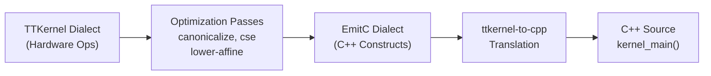
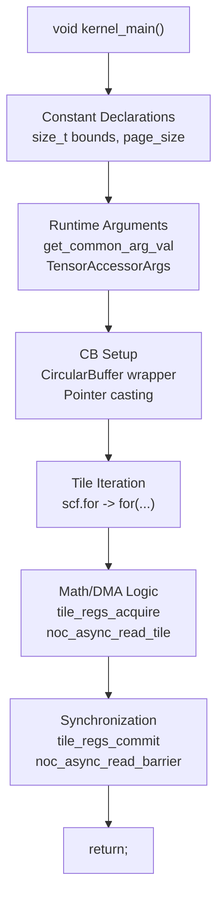
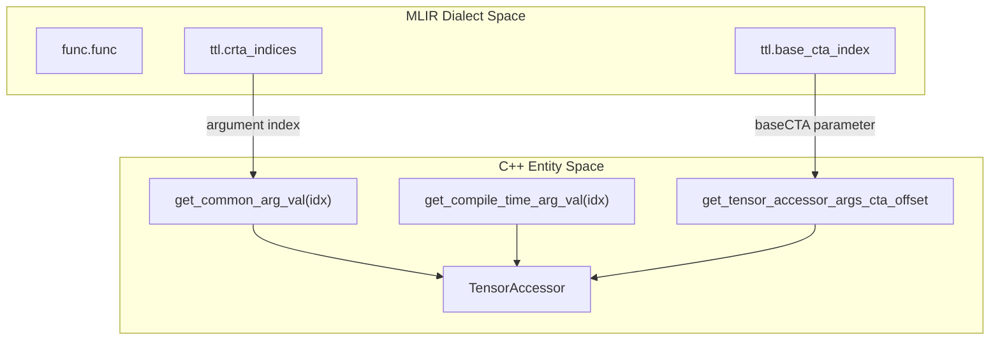

# Code Generation and EmitC

Relevant source files
*   [test/ttlang/Conversion/TTLToTTKernel/compute_fused_chain.mlir](https://github.com/tenstorrent/tt-lang/blob/d76e6233/test/ttlang/Conversion/TTLToTTKernel/compute_fused_chain.mlir)
*   [test/ttlang/Translate/TTLToCpp/cb_to_tensor_single_tile_write.mlir](https://github.com/tenstorrent/tt-lang/blob/d76e6233/test/ttlang/Translate/TTLToCpp/cb_to_tensor_single_tile_write.mlir)
*   [test/ttlang/Translate/TTLToCpp/compute_fused_chain_to_cpp.mlir](https://github.com/tenstorrent/tt-lang/blob/d76e6233/test/ttlang/Translate/TTLToCpp/compute_fused_chain_to_cpp.mlir)
*   [test/ttlang/Translate/TTLToCpp/compute_with_data_movement.mlir](https://github.com/tenstorrent/tt-lang/blob/d76e6233/test/ttlang/Translate/TTLToCpp/compute_with_data_movement.mlir)
*   [test/ttlang/Translate/TTLToCpp/dma_batched_single_tile.mlir](https://github.com/tenstorrent/tt-lang/blob/d76e6233/test/ttlang/Translate/TTLToCpp/dma_batched_single_tile.mlir)
*   [test/ttlang/Translate/TTLToCpp/dma_loop_multi_tile_nontrivial_cb.mlir](https://github.com/tenstorrent/tt-lang/blob/d76e6233/test/ttlang/Translate/TTLToCpp/dma_loop_multi_tile_nontrivial_cb.mlir)
*   [test/ttlang/Translate/TTLToCpp/dma_loop_single_tile.mlir](https://github.com/tenstorrent/tt-lang/blob/d76e6233/test/ttlang/Translate/TTLToCpp/dma_loop_single_tile.mlir)
*   [test/ttlang/Translate/TTLToCpp/dma_multi_tile_batched_in_user_loop.mlir](https://github.com/tenstorrent/tt-lang/blob/d76e6233/test/ttlang/Translate/TTLToCpp/dma_multi_tile_batched_in_user_loop.mlir)
*   [test/ttlang/Translate/TTLToCpp/dma_multi_tile_read.mlir](https://github.com/tenstorrent/tt-lang/blob/d76e6233/test/ttlang/Translate/TTLToCpp/dma_multi_tile_read.mlir)
*   [test/ttlang/Translate/TTLToCpp/dma_multi_tile_same_layout_different_cb.mlir](https://github.com/tenstorrent/tt-lang/blob/d76e6233/test/ttlang/Translate/TTLToCpp/dma_multi_tile_same_layout_different_cb.mlir)
*   [test/ttlang/Translate/TTLToCpp/dma_single_tile_read.mlir](https://github.com/tenstorrent/tt-lang/blob/d76e6233/test/ttlang/Translate/TTLToCpp/dma_single_tile_read.mlir)
*   [test/ttlang/Translate/TTLToCpp/loopback_full_single_tile.mlir](https://github.com/tenstorrent/tt-lang/blob/d76e6233/test/ttlang/Translate/TTLToCpp/loopback_full_single_tile.mlir)

## Purpose and Scope

This page describes the final phase of the tt-lang compilation pipeline: lowering from the **TTKernel** dialect to C++ source code via the **EmitC** dialect. This transformation produces executable kernel functions (`kernel_main()`) that run on Tenstorrent hardware cores (BRISC, NCRISC, and TRISC).

The pipeline transitions from high-level Python AST to MLIR, performs hardware-specific optimizations (like DST register allocation and subblocking), and finally emits C++ code that calls the low-level **TT-Metalium** APIs.

**Sources:**[test/ttlang/Translate/TTLToCpp/dma_single_tile_read.mlir 1-7](https://github.com/tenstorrent/tt-lang/blob/d76e6233/test/ttlang/Translate/TTLToCpp/dma_single_tile_read.mlir#L1-L7)[test/ttlang/Translate/TTLToCpp/compute_with_data_movement.mlir 17-19](https://github.com/tenstorrent/tt-lang/blob/d76e6233/test/ttlang/Translate/TTLToCpp/compute_with_data_movement.mlir#L17-L19)

* * *

## EmitC Dialect Overview

The **EmitC** dialect is an MLIR dialect that represents C/C++ code constructs. It serves as the bridge between MLIR's SSA representation and imperative C++ code, providing operations that directly map to C++ syntax.

### Role in the Pipeline

The compilation flow for code generation follows this path:

**Key EmitC Operations:**

*   `emitc.verbatim`: Used for direct C++ code injection (e.g., `#include` or complex macros).
*   `emitc.call`: Represents a call to a TT-Metalium C++ function.
*   `emitc.variable`: Declares C++ variables with specific types.
*   `emitc.constant`: Represents literal values in the generated code.

The conversion is orchestrated by the `convert-ttkernel-to-emitc` pass, followed by the `ttkernel-to-cpp` translation which serializes the IR into a string.

**Sources:**[test/ttlang/Translate/TTLToCpp/dma_multi_tile_read.mlir 1-4](https://github.com/tenstorrent/tt-lang/blob/d76e6233/test/ttlang/Translate/TTLToCpp/dma_multi_tile_read.mlir#L1-L4)[test/ttlang/Translate/TTLToCpp/dma_multi_tile_same_layout_different_cb.mlir 1-4](https://github.com/tenstorrent/tt-lang/blob/d76e6233/test/ttlang/Translate/TTLToCpp/dma_multi_tile_same_layout_different_cb.mlir#L1-L4)

* * *




**Key EmitC Operations:**
- `emitc.verbatim`: Used for direct C++ code injection (e.g., `#include` or complex macros).
- `emitc.call`: Represents a call to a TT-Metalium C++ function.
- `emitc.variable`: Declares C++ variables with specific types.
- `emitc.constant`: Represents literal values in the generated code.

The conversion is orchestrated by the `convert-ttkernel-to-emitc` pass, followed by the `ttkernel-to-cpp` translation which serializes the IR into a string.
```
## TTKernel Operation Mapping

The lowering process maps TTKernel operations to specific C++ API calls. The mapping varies depending on whether the operation targets the Compute (TRISC) or Data Movement (BRISC/NCRISC) processors.

### Circular Buffer (CB) Operations

| TTKernel Op | C++ API | Description |
| --- | --- | --- |
| `ttkernel.cb_wait_front` | `cb_wait_front(cb_id, tiles)` | Blocks until tiles are available. |
| `ttkernel.cb_reserve_back` | `cb_reserve_back(cb_id, tiles)` | Reserves space in CB for writing. |
| `ttkernel.cb_push_back` | `cb_push_back(cb_id, tiles)` | Signals that data is ready for consumers. |
| `ttkernel.cb_pop_front` | `cb_pop_front(cb_id, tiles)` | Releases consumed tiles. |
| `ttkernel.get_write_ptr` | `get_write_ptr()` | Returns the local L1 write address for a CB. |

### Data Movement (NOC) Operations

| TTKernel Op | C++ API | Description |
| --- | --- | --- |
| `ttkernel.noc_async_read_tile` | `noc_async_read_tile(tile_idx, accessor, addr)` | Asynchronous read from NOC to L1. |
| `ttkernel.noc_async_write_tile` | `noc_async_write_tile(tile_idx, accessor, addr)` | Asynchronous write from L1 to NOC. |
| `ttkernel.noc_async_read_barrier` | `noc.async_read_barrier<Noc::BarrierMode::FULL>()` | Waits for all pending reads to finish. |
| `ttkernel.noc_async_write_barrier` | `noc.async_write_barrier<Noc::BarrierMode::FULL>()` | Waits for all pending writes to finish. |

### Compute (TRISC) Operations

| TTKernel Op | C++ API | Description |
| --- | --- | --- |
| `ttkernel.tile_regs_acquire` | `tile_regs_acquire()` | Locks the DST register file. |
| `ttkernel.tile_regs_commit` | `tile_regs_commit()` | Signals completion of math ops. |
| `ttkernel.tile_regs_wait` | `tile_regs_wait()` | Waits for the FPU/SFPU to finish. |
| `ttkernel.add_tiles` | `add_tiles(cb0, cb1, ...)` | FPU binary addition from CBs. |
| `ttkernel.copy_tile` | `copy_tile(cb_id, tile_idx, dst_idx)` | Moves tile from L1 (CB) to DST. |
| `ttkernel.pack_tile` | `pack_tile<true>(dst_idx, cb_out, tile_idx)` | Moves tile from DST to L1 (CB). |
| `ttkernel.binary_op_init_common` | `binary_op_init_common(cb0, cb1, cb2)` | Initializes FPU for binary operations. |

**Sources:**[test/ttlang/Translate/TTLToCpp/loopback_full_single_tile.mlir 21-33](https://github.com/tenstorrent/tt-lang/blob/d76e6233/test/ttlang/Translate/TTLToCpp/loopback_full_single_tile.mlir#L21-L33)[test/ttlang/Translate/TTLToCpp/cb_to_tensor_single_tile_write.mlir 19-21](https://github.com/tenstorrent/tt-lang/blob/d76e6233/test/ttlang/Translate/TTLToCpp/cb_to_tensor_single_tile_write.mlir#L19-L21)[test/ttlang/Translate/TTLToCpp/compute_with_data_movement.mlir 101-107](https://github.com/tenstorrent/tt-lang/blob/d76e6233/test/ttlang/Translate/TTLToCpp/compute_with_data_movement.mlir#L101-L107)[test/ttlang/Conversion/TTLToTTKernel/compute_fused_chain.mlir 29-32](https://github.com/tenstorrent/tt-lang/blob/d76e6233/test/ttlang/Conversion/TTLToTTKernel/compute_fused_chain.mlir#L29-L32)

* * *

## Generated Kernel Structure

### Standard Kernel Template

Every generated kernel follows a strict structure to ensure compatibility with the Tenstorrent runtime environment.



### Addressing and Pointer Casting

The generated code uses a specific casting chain to handle L1 addresses. Because `get_write_ptr` (accessed via the `CircularBuffer` wrapper) returns a pointer, but index arithmetic is performed in `size_t`, the following pattern is emitted to satisfy hardware alignment and NOC API requirements:

`// Example logic from dma_multi_tile_read.mlirptrdiff_t cb_ptr_ptrdiff = (ptrdiff_t) cb.get_write_ptr();size_t cb_ptr_idx = (size_t) cb_ptr_ptrdiff; // ... inside loop ...size_t byte_off = tile_offset_x * page_size;size_t cb_addr_idx = cb_ptr_idx + byte_off;ptrdiff_t cb_addr_ptr = (ptrdiff_t) cb_addr_idx;int32_t cb_addr = (int32_t) cb_addr_ptr;noc_async_read_tile(tile_offset_i32, accessor, cb_addr);`
**Sources:**[test/ttlang/Translate/TTLToCpp/dma_multi_tile_read.mlir 25-41](https://github.com/tenstorrent/tt-lang/blob/d76e6233/test/ttlang/Translate/TTLToCpp/dma_multi_tile_read.mlir#L25-L41)[test/ttlang/Translate/TTLToCpp/dma_multi_tile_same_layout_different_cb.mlir 31-48](https://github.com/tenstorrent/tt-lang/blob/d76e6233/test/ttlang/Translate/TTLToCpp/dma_multi_tile_same_layout_different_cb.mlir#L31-L48)

* * *

## Argument Mapping: From MLIR to C++

The bridge between the IR and the generated C++ relies on **Runtime Arguments (RTAs)** and **Compile-time Arguments (CTAs)**.

*   **Compile-time Arguments (CTAs)**: Usually represent CB indices. They are passed to the kernel via the `get_compile_time_arg_val` macro.
*   **Runtime Arguments (RTAs)**: Represent dynamic data like tensor base addresses in DRAM/L1. They are accessed via `get_common_arg_val`.
*   **Tensor Accessors**: Objects that encapsulate the tensor layout (shape, strides) and base address. The CTA offset for tensor N is computed at device compile time via `get_tensor_accessor_args_cta_offset<N, baseCTA>()`.

**Sources:**[test/ttlang/Translate/TTLToCpp/dma_single_tile_read.mlir 16-19](https://github.com/tenstorrent/tt-lang/blob/d76e6233/test/ttlang/Translate/TTLToCpp/dma_single_tile_read.mlir#L16-L19)[test/ttlang/Translate/TTLToCpp/dma_multi_tile_read.mlir 22-25](https://github.com/tenstorrent/tt-lang/blob/d76e6233/test/ttlang/Translate/TTLToCpp/dma_multi_tile_read.mlir#L22-L25)[test/ttlang/Translate/TTLToCpp/compute_with_data_movement.mlir 41-42](https://github.com/tenstorrent/tt-lang/blob/d76e6233/test/ttlang/Translate/TTLToCpp/compute_with_data_movement.mlir#L41-L42)

* * *




- **Compile-time Arguments (CTAs)**: Usually represent CB indices. They are passed to the kernel via the `get_compile_time_arg_val` macro.
- **Runtime Arguments (RTAs)**: Represent dynamic data like tensor base addresses in DRAM/L1. They are accessed via `get_common_arg_val`.
- **Tensor Accessors**: Objects that encapsulate the tensor layout (shape, strides) and base address. The CTA offset for tensor N is computed at device compile time via `get_tensor_accessor_args_cta_offset<N, baseCTA>()`.
```
## Multi-Tile DMA and Loop Generation

For operations involving multiple tiles, the compiler generates nested C++ loops. The bounds of these loops are determined by the tensor layout (e.g., a 64x64 tensor results in a 2x2 tile grid).

### Tile Loop Bounds vs CB Shape

The generated tile loops iterate over the tensor grid dimensions, even if the destination Circular Buffer has a different shape (e.g., flattened or different aspect ratio).

`// Example: 64x64 tensor (2x2 tiles) to CB [4,1]// The loops are based on the 2x2 tensor layoutfor (size_t tile2_y = 0; tile2_y < 2; tile2_y += 1) {  for (size_t tile2_x = 0; tile2_x < 2; tile2_x += 1) {    // ... address calculation ...    noc_async_read_tile(tile_offset, accessor, cb_addr);  }}`
**Sources:**[test/ttlang/Translate/TTLToCpp/dma_multi_tile_same_layout_different_cb.mlir 61-75](https://github.com/tenstorrent/tt-lang/blob/d76e6233/test/ttlang/Translate/TTLToCpp/dma_multi_tile_same_layout_different_cb.mlir#L61-L75)[test/ttlang/Translate/TTLToCpp/dma_multi_tile_read.mlir 29-43](https://github.com/tenstorrent/tt-lang/blob/d76e6233/test/ttlang/Translate/TTLToCpp/dma_multi_tile_read.mlir#L29-L43)[test/ttlang/Translate/TTLToCpp/dma_loop_multi_tile_nontrivial_cb.mlir 54-68](https://github.com/tenstorrent/tt-lang/blob/d76e6233/test/ttlang/Translate/TTLToCpp/dma_loop_multi_tile_nontrivial_cb.mlir#L54-L68)

* * *

## Translation and Extraction

Once the IR is fully lowered to the EmitC dialect, the `ttkernel-to-cpp` translation pass is called. This pass generates the final C++ string for each kernel in the module.

1.   **Barrier Deduplication**: Consecutive `ttl.wait` operations (which lower to `noc_async_read_barrier` or `noc_async_write_barrier`) are deduplicated into a single C++ barrier call (`Noc::BarrierMode::FULL`) to improve performance.
2.   **Loop Lowering**: `scf.for` loops (both user-defined and compiler-generated) are translated into standard C++ `for` loops using `size_t` indices.
3.   **FPU vs SFPU Paths**: Depending on the compute kernel configuration (e.g., `enable-fpu-binary-ops`), the generator emits either `add_tiles` (FPU) or a sequence of `copy_tile` + `add_binary_tile` (SFPU).

**Sources:**[test/ttlang/Translate/TTLToCpp/dma_batched_single_tile.mlir 28-30](https://github.com/tenstorrent/tt-lang/blob/d76e6233/test/ttlang/Translate/TTLToCpp/dma_batched_single_tile.mlir#L28-L30)[test/ttlang/Translate/TTLToCpp/dma_multi_tile_batched_in_user_loop.mlir 94-96](https://github.com/tenstorrent/tt-lang/blob/d76e6233/test/ttlang/Translate/TTLToCpp/dma_multi_tile_batched_in_user_loop.mlir#L94-L96)[test/ttlang/Translate/TTLToCpp/compute_fused_chain_to_cpp.mlir 1-15](https://github.com/tenstorrent/tt-lang/blob/d76e6233/test/ttlang/Translate/TTLToCpp/compute_fused_chain_to_cpp.mlir#L1-L15)[test/ttlang/Translate/TTLToCpp/compute_with_data_movement.mlir 1-15](https://github.com/tenstorrent/tt-lang/blob/d76e6233/test/ttlang/Translate/TTLToCpp/compute_with_data_movement.mlir#L1-L15)

Dismiss
Refresh this wiki

Enter email to refresh
