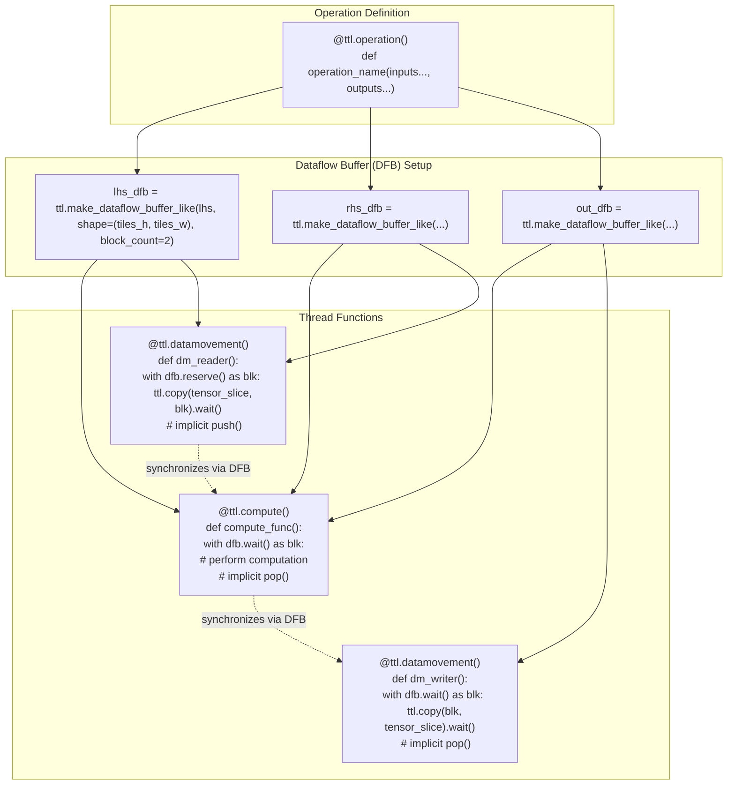
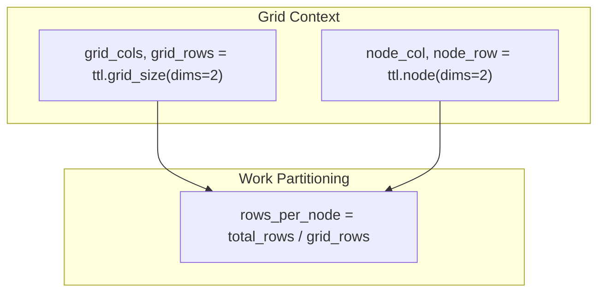
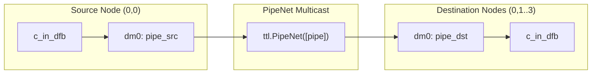
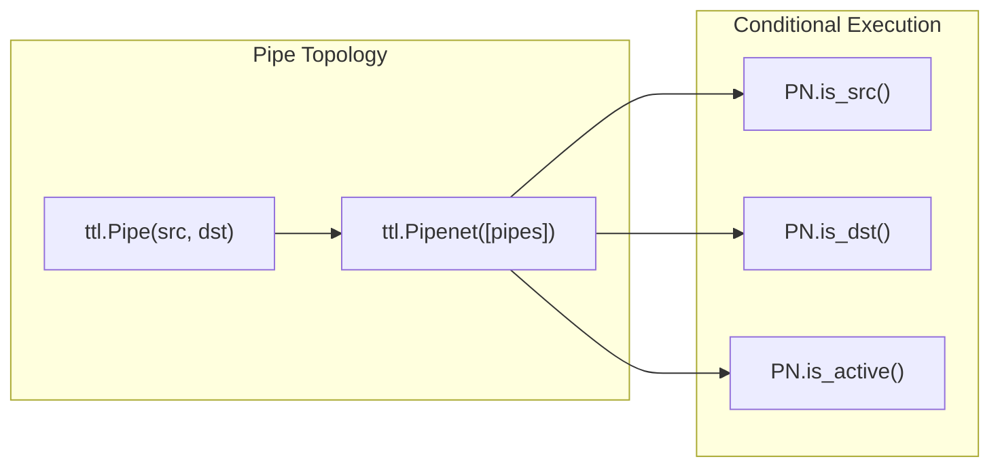

# Programming Guide

Relevant source files
*   [docs/sphinx/specs/TTLangSpecification.md](https://github.com/tenstorrent/tt-lang/blob/d76e6233/docs/sphinx/specs/TTLangSpecification.md?plain=1)
*   [examples/elementwise-tutorial/step_0_ttnn_base.py](https://github.com/tenstorrent/tt-lang/blob/d76e6233/examples/elementwise-tutorial/step_0_ttnn_base.py)
*   [examples/elementwise-tutorial/step_1_single_node_single_tile_block.py](https://github.com/tenstorrent/tt-lang/blob/d76e6233/examples/elementwise-tutorial/step_1_single_node_single_tile_block.py)
*   [examples/elementwise-tutorial/step_2_single_node_multitile_block.py](https://github.com/tenstorrent/tt-lang/blob/d76e6233/examples/elementwise-tutorial/step_2_single_node_multitile_block.py)
*   [examples/elementwise-tutorial/step_3_multinode.py](https://github.com/tenstorrent/tt-lang/blob/d76e6233/examples/elementwise-tutorial/step_3_multinode.py)
*   [include/ttlang/Dialect/TTL/Passes.td](https://github.com/tenstorrent/tt-lang/blob/d76e6233/include/ttlang/Dialect/TTL/Passes.td)
*   [include/ttlang/Dialect/TTL/Transforms/DFBMaterialization.h](https://github.com/tenstorrent/tt-lang/blob/d76e6233/include/ttlang/Dialect/TTL/Transforms/DFBMaterialization.h)
*   [lib/Dialect/TTL/Pipelines/TTLPipelines.cpp](https://github.com/tenstorrent/tt-lang/blob/d76e6233/lib/Dialect/TTL/Pipelines/TTLPipelines.cpp)
*   [lib/Dialect/TTL/Transforms/CMakeLists.txt](https://github.com/tenstorrent/tt-lang/blob/d76e6233/lib/Dialect/TTL/Transforms/CMakeLists.txt)
*   [lib/Dialect/TTL/Transforms/DFBMaterialization.cpp](https://github.com/tenstorrent/tt-lang/blob/d76e6233/lib/Dialect/TTL/Transforms/DFBMaterialization.cpp)
*   [lib/Dialect/TTL/Transforms/TTLInsertIntermediateDFBs.cpp](https://github.com/tenstorrent/tt-lang/blob/d76e6233/lib/Dialect/TTL/Transforms/TTLInsertIntermediateDFBs.cpp)
*   [python/pykernel/_src/kernel_ast.py](https://github.com/tenstorrent/tt-lang/blob/d76e6233/python/pykernel/_src/kernel_ast.py)
*   [python/ttl/_src/ttl_ast.py](https://github.com/tenstorrent/tt-lang/blob/d76e6233/python/ttl/_src/ttl_ast.py)
*   [python/ttl/ttl_api.py](https://github.com/tenstorrent/tt-lang/blob/d76e6233/python/ttl/ttl_api.py)
*   [test/me2e/builder/pipeline.py](https://github.com/tenstorrent/tt-lang/blob/d76e6233/test/me2e/builder/pipeline.py)
*   [test/python/invalid/invalid_reduce_scalar_undefined.py](https://github.com/tenstorrent/tt-lang/blob/d76e6233/test/python/invalid/invalid_reduce_scalar_undefined.py)
*   [test/python/simple_reduce_scalar.py](https://github.com/tenstorrent/tt-lang/blob/d76e6233/test/python/simple_reduce_scalar.py)

This page provides practical guidance for writing tt-lang kernels using the Python DSL. It covers kernel structure, common patterns, data movement strategies, multi-core programming, and best practices. tt-lang serves as an expressive middle ground between high-level **TT-NN** and low-level **TT-Metalium**[docs/sphinx/specs/TTLangSpecification.md 52-54](https://github.com/tenstorrent/tt-lang/blob/d76e6233/docs/sphinx/specs/TTLangSpecification.md?plain=1#L52-L54)

## Kernel Anatomy

A tt-lang kernel consists of three main components: the kernel decorator specifying grid configuration, nested compute and data movement thread functions, and Dataflow Buffer (DFB) declarations that connect them. In the current specification, the primary entry point is the `ttl.operation` decorator [docs/sphinx/specs/TTLangSpecification.md 45](https://github.com/tenstorrent/tt-lang/blob/d76e6233/docs/sphinx/specs/TTLangSpecification.md?plain=1#L45-L45)

**Kernel Structure Diagram**

**Key Components:**

| Component | Purpose | Code Construct |
| --- | --- | --- |
| Operation decorator | Entry point for TT-NN integration | `@ttl.operation()`[docs/sphinx/specs/TTLangSpecification.md 66](https://github.com/tenstorrent/tt-lang/blob/d76e6233/docs/sphinx/specs/TTLangSpecification.md?plain=1#L66-L66) |
| DFB creation | Allocate L1 staging buffers | `ttl.make_dataflow_buffer_like()`[python/ttl/ttl_api.py 71-76](https://github.com/tenstorrent/tt-lang/blob/d76e6233/python/ttl/ttl_api.py#L71-L76) |
| Compute thread | Perform tile operations in DST registers | `@ttl.compute()`[docs/sphinx/specs/TTLangSpecification.md 73](https://github.com/tenstorrent/tt-lang/blob/d76e6233/docs/sphinx/specs/TTLangSpecification.md?plain=1#L73-L73) |
| Data movement threads | Transfer data between DRAM/L1 and DFBs | `@ttl.datamovement()`[docs/sphinx/specs/TTLangSpecification.md 77](https://github.com/tenstorrent/tt-lang/blob/d76e6233/docs/sphinx/specs/TTLangSpecification.md?plain=1#L77-L77) |
| Synchronization | Producer-consumer coordination | `wait()`, `reserve()`, `push()`, `pop()`[docs/sphinx/specs/TTLangSpecification.md 38](https://github.com/tenstorrent/tt-lang/blob/d76e6233/docs/sphinx/specs/TTLangSpecification.md?plain=1#L38-L38) |

Sources: [docs/sphinx/specs/TTLangSpecification.md 59-88](https://github.com/tenstorrent/tt-lang/blob/d76e6233/docs/sphinx/specs/TTLangSpecification.md?plain=1#L59-L88)[python/ttl/ttl_api.py 71-76](https://github.com/tenstorrent/tt-lang/blob/d76e6233/python/ttl/ttl_api.py#L71-L76)[python/ttl/_src/ttl_ast.py 128-145](https://github.com/tenstorrent/tt-lang/blob/d76e6233/python/ttl/_src/ttl_ast.py#L128-L145)




**Key Components:**

| Component | Purpose | Code Construct |
|-----------|---------|----------------|
| Operation decorator | Entry point for TT-NN integration | `@ttl.operation()` [docs/sphinx/specs/TTLangSpecification.md:66-66]() |
| DFB creation | Allocate L1 staging buffers | `ttl.make_dataflow_buffer_like()` [python/ttl/ttl_api.py:71-76]() |
| Compute thread | Perform tile operations in DST registers | `@ttl.compute()` [docs/sphinx/specs/TTLangSpecification.md:73-73]() |
| Data movement threads | Transfer data between DRAM/L1 and DFBs | `@ttl.datamovement()` [docs/sphinx/specs/TTLangSpecification.md:77-77]() |
| Synchronization | Producer-consumer coordination | `wait()`, `reserve()`, `push()`, `pop()` [docs/sphinx/specs/TTLangSpecification.md:38-38]() |

Sources: [docs/sphinx/specs/TTLangSpecification.md:59-88](), [python/ttl/ttl_api.py:71-76](), [python/ttl/_src/ttl_ast.py:128-145]()
```
## Basic Pattern: Element-wise Addition

The simplest kernel pattern performs element-wise operations on single tiles. tt-lang uses Python `with` statements to manage DFB lifecycles automatically via `reserve()` and `wait()` contexts, which trigger implicit `push()` and `pop()` operations [include/ttlang/Dialect/TTL/Passes.td 6-23](https://github.com/tenstorrent/tt-lang/blob/d76e6233/include/ttlang/Dialect/TTL/Passes.td#L6-L23)

**Minimal Add Kernel Structure:**

`@ttl.operation()def add_op(lhs: ttnn.Tensor, rhs: ttnn.Tensor, out: ttnn.Tensor):    # 1. Create dataflow buffers (block_count=2 for double buffering)    lhs_dfb = ttl.make_dataflow_buffer_like(lhs, shape=(1, 1), block_count=2)    rhs_dfb = ttl.make_dataflow_buffer_like(rhs, shape=(1, 1), block_count=2)    out_dfb = ttl.make_dataflow_buffer_like(out, shape=(1, 1), block_count=2)        @ttl.compute()    def compute():        # 2. Use 'with' for automatic push/pop synchronization        with lhs_dfb.wait() as l, rhs_dfb.wait() as r, out_dfb.reserve() as o:            result = l + r          # Tile math operation            o.store(result)         # Store from DST to DFB        @ttl.datamovement()    def dm_read():        with lhs_dfb.reserve() as l_blk, rhs_dfb.reserve() as r_blk:            ttl.copy(lhs[0, 0], l_blk).wait() # Tensor slice to DFB            ttl.copy(rhs[0, 0], r_blk).wait()`
**Operation Sequence:**

| Step | Thread | Operation | Synchronization Point |
| --- | --- | --- | --- |
| 1 | dm_read | `reserve()` DFB space | Blocks if buffer full [include/ttlang/Dialect/TTL/Passes.td 17-19](https://github.com/tenstorrent/tt-lang/blob/d76e6233/include/ttlang/Dialect/TTL/Passes.td#L17-L19) |
| 2 | dm_read | `ttl.copy(...).wait()` | DMA barrier [include/ttlang/Dialect/TTL/Passes.td 108-118](https://github.com/tenstorrent/tt-lang/blob/d76e6233/include/ttlang/Dialect/TTL/Passes.td#L108-L118) |
| 3 | dm_read | `push()` (via `with`) | Data available for consumer [include/ttlang/Dialect/TTL/Passes.td 8-12](https://github.com/tenstorrent/tt-lang/blob/d76e6233/include/ttlang/Dialect/TTL/Passes.td#L8-L12) |
| 4 | compute | `wait()` for inputs | Blocks until data ready [include/ttlang/Dialect/TTL/Passes.td 17-19](https://github.com/tenstorrent/tt-lang/blob/d76e6233/include/ttlang/Dialect/TTL/Passes.td#L17-L19) |
| 5 | compute | `reserve()` out DFB | Blocks if buffer full |
| 6 | compute | `l + r` | Math thread execution [docs/sphinx/specs/TTLangSpecification.md 46](https://github.com/tenstorrent/tt-lang/blob/d76e6233/docs/sphinx/specs/TTLangSpecification.md?plain=1#L46-L46) |
| 7 | compute | `o.store(result)` | Pack thread execution [docs/sphinx/specs/TTLangSpecification.md 44](https://github.com/tenstorrent/tt-lang/blob/d76e6233/docs/sphinx/specs/TTLangSpecification.md?plain=1#L44-L44) |

Sources: [docs/sphinx/specs/TTLangSpecification.md 59-96](https://github.com/tenstorrent/tt-lang/blob/d76e6233/docs/sphinx/specs/TTLangSpecification.md?plain=1#L59-L96)[include/ttlang/Dialect/TTL/Passes.td 6-118](https://github.com/tenstorrent/tt-lang/blob/d76e6233/include/ttlang/Dialect/TTL/Passes.td#L6-L118)[examples/elementwise-tutorial/step_1_single_node_single_tile_block.py 44-88](https://github.com/tenstorrent/tt-lang/blob/d76e6233/examples/elementwise-tutorial/step_1_single_node_single_tile_block.py#L44-L88)

## Data Movement Patterns

Data movement threads transfer data between tensor memory (DRAM or L1) and Dataflow Buffers using `ttl.copy()`. The compiler maps these to `BRISC` and `NCRISC` processors [docs/sphinx/specs/TTLangSpecification.md 59-61](https://github.com/tenstorrent/tt-lang/blob/d76e6233/docs/sphinx/specs/TTLangSpecification.md?plain=1#L59-L61)

**Data Flow Architecture**

**Key Patterns:**

*   **Streaming**: For tensors larger than L1, use loops to process slices and reuse DFB slots [docs/sphinx/specs/TTLangSpecification.md 52-54](https://github.com/tenstorrent/tt-lang/blob/d76e6233/docs/sphinx/specs/TTLangSpecification.md?plain=1#L52-L54)
*   **Double Buffering**: Set `block_count=2` to overlap DMA transfers with computation [docs/sphinx/specs/TTLangSpecification.md 47](https://github.com/tenstorrent/tt-lang/blob/d76e6233/docs/sphinx/specs/TTLangSpecification.md?plain=1#L47-L47)
*   **Tensor Slicing**: Use `tensor[y, x]` syntax to create `TensorBlock` objects for `ttl.copy`[docs/sphinx/specs/TTLangSpecification.md 14-15](https://github.com/tenstorrent/tt-lang/blob/d76e6233/docs/sphinx/specs/TTLangSpecification.md?plain=1#L14-L15)

Sources: [docs/sphinx/specs/TTLangSpecification.md 52-57](https://github.com/tenstorrent/tt-lang/blob/d76e6233/docs/sphinx/specs/TTLangSpecification.md?plain=1#L52-L57)[lib/Dialect/TTL/Transforms/TTLInsertIntermediateDFBs.cpp 9-14](https://github.com/tenstorrent/tt-lang/blob/d76e6233/lib/Dialect/TTL/Transforms/TTLInsertIntermediateDFBs.cpp#L9-L14)[python/ttl/ttl_api.py 96-97](https://github.com/tenstorrent/tt-lang/blob/d76e6233/python/ttl/ttl_api.py#L96-L97)


```mermaid
graph LR
    subgraph "Memory Hierarchy"
        DRAM["DRAM<br/>(ttnn.DRAM_MEMORY_CONFIG)"]
        L1["L1 Cache<br/>(ttnn.L1_MEMORY_CONFIG)"]
        DFB["Dataflow Buffers<br/>(L1 SRAM)"]
        DST["DST Registers<br/>(Compute engine)"]
    end
    
    subgraph "Data Movement Threads"
        BRISC["BRISC Processor"]
        NCRISC["NCRISC Processor"]
    end
    
    subgraph "Compute Thread"
        TRISC["TRISC Processor"]
    end
    
    DRAM -.NOC.-> DFB
    L1 -.NOC.-> DFB
    DFB --> DST
    DST --> DFB
    DFB -.NOC.-> DRAM
    DFB -.NOC.-> L1
    
    BRISC -.executes.-> "ttl.copy()"
    NCRISC -.executes.-> "ttl.copy()"
    TRISC -.executes.-> "ttl.math ops"
```

**Key Patterns:**

- **Streaming**: For tensors larger than L1, use loops to process slices and reuse DFB slots [docs/sphinx/specs/TTLangSpecification.md:52-54]().
- **Double Buffering**: Set `block_count=2` to overlap DMA transfers with computation [docs/sphinx/specs/TTLangSpecification.md:47-47]().
- **Tensor Slicing**: Use `tensor[y, x]` syntax to create `TensorBlock` objects for `ttl.copy` [docs/sphinx/specs/TTLangSpecification.md:14-15]().

Sources: [docs/sphinx/specs/TTLangSpecification.md:52-57](), [lib/Dialect/TTL/Transforms/TTLInsertIntermediateDFBs.cpp:9-14](), [python/ttl/ttl_api.py:96-97]()
```
## Multi-core Programming

Multi-core kernels distribute work across a grid of nodes (Tensix cores). tt-lang supports SPMD mode where the same operation executes on multiple chips or cores [docs/sphinx/specs/TTLangSpecification.md 99-101](https://github.com/tenstorrent/tt-lang/blob/d76e6233/docs/sphinx/specs/TTLangSpecification.md?plain=1#L99-L101)

**Work Distribution Pattern**

**Key APIs:**

*   `ttl.grid_size(dims)`: Returns execution grid dimensions [docs/sphinx/specs/TTLangSpecification.md 106-113](https://github.com/tenstorrent/tt-lang/blob/d76e6233/docs/sphinx/specs/TTLangSpecification.md?plain=1#L106-L113)
*   `ttl.node(dims)`: Returns logical coordinates of the current core [docs/sphinx/specs/TTLangSpecification.md 43](https://github.com/tenstorrent/tt-lang/blob/d76e6233/docs/sphinx/specs/TTLangSpecification.md?plain=1#L43-L43)

Sources: [docs/sphinx/specs/TTLangSpecification.md 99-113](https://github.com/tenstorrent/tt-lang/blob/d76e6233/docs/sphinx/specs/TTLangSpecification.md?plain=1#L99-L113)[examples/elementwise-tutorial/step_3_multinode.py 54-96](https://github.com/tenstorrent/tt-lang/blob/d76e6233/examples/elementwise-tutorial/step_3_multinode.py#L54-L96)




**Key APIs:**
- `ttl.grid_size(dims)`: Returns execution grid dimensions [docs/sphinx/specs/TTLangSpecification.md:106-113]().
- `ttl.node(dims)`: Returns logical coordinates of the current core [docs/sphinx/specs/TTLangSpecification.md:43-43]().

Sources: [docs/sphinx/specs/TTLangSpecification.md:99-113](), [examples/elementwise-tutorial/step_3_multinode.py:54-96]()
```
## Inter-core Communication with Pipes

Pipes wrap the complexity of node-to-node communication over NoC or TT-Fabric [docs/sphinx/specs/TTLangSpecification.md 54-57](https://github.com/tenstorrent/tt-lang/blob/d76e6233/docs/sphinx/specs/TTLangSpecification.md?plain=1#L54-L57)

**Pipe Communication Pattern**

Sources: [docs/sphinx/specs/TTLangSpecification.md 12-13](https://github.com/tenstorrent/tt-lang/blob/d76e6233/docs/sphinx/specs/TTLangSpecification.md?plain=1#L12-L13)[python/ttl/ttl_api.py 77](https://github.com/tenstorrent/tt-lang/blob/d76e6233/python/ttl/ttl_api.py#L77-L77)[python/ttl/_src/ttl_ast.py 170-188](https://github.com/tenstorrent/tt-lang/blob/d76e6233/python/ttl/_src/ttl_ast.py#L170-L188)




**Key Code Entities:**
- `ttl.Pipe((0, 0), (0, slice(1, 4)))`: Defines a pipe from node (0,0) to nodes (0,1), (0,2), and (0,3).
- `pipe_net.is_src()`: Predicate used to identify if the current node is the source in the `PipeNet`. [CHANGELOG.md:18]()
- `pipe_net.is_dst()`: Predicate used to identify if the current node is a destination. [CHANGELOG.md:18]()
- `ttl.copy(block, pipe)`: Moves data from a local buffer into the pipe for transmission.
```




Sources: [docs/sphinx/specs/TTLangSpecification.md:12-13](), [python/ttl/ttl_api.py:77-77](), [python/ttl/_src/ttl_ast.py:170-188]()
```
## Detailed Topic Guides

For more in-depth information on specific programming topics, see the following child pages:

*   [Writing Your First Kernel](https://deepwiki.com/tenstorrent/tt-lang/4.1-writing-your-first-kernel) — Step-by-step tutorial for creating a simple element-wise kernel.
*   [Data Movement Patterns](https://deepwiki.com/tenstorrent/tt-lang/4.2-data-movement-patterns) — Common patterns for efficient data transfer: streaming, slicing, multi-tile blocks.
*   [Tile Operations and Broadcasting](https://deepwiki.com/tenstorrent/tt-lang/4.3-tile-operations-and-broadcasting) — Explain tile math operations, broadcasting semantics, and common computation patterns.
*   [Multi-core Programming](https://deepwiki.com/tenstorrent/tt-lang/4.4-multi-core-programming) — Strategies for work distribution, grid sizing, and core coordination.
*   [Control Flow and Loops](https://deepwiki.com/tenstorrent/tt-lang/4.5-control-flow-and-loops) — Using Python control flow (for loops, if statements) within kernels.
*   [Validation Rules and Common Errors](https://deepwiki.com/tenstorrent/tt-lang/4.6-validation-rules-and-common-errors) — Explain validation checks, common errors (3D grids, invalid dims), and how to fix them.

Dismiss
Refresh this wiki

Enter email to refresh
