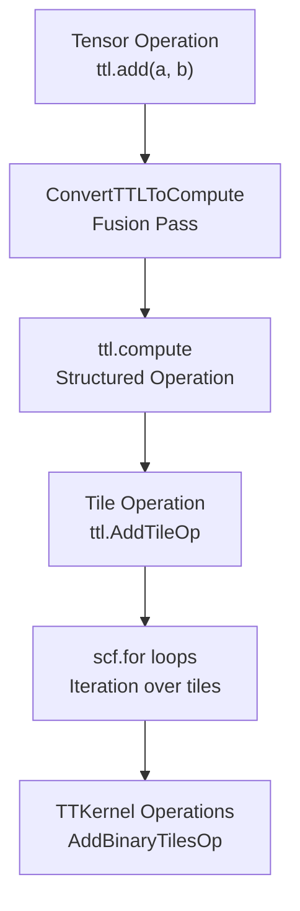
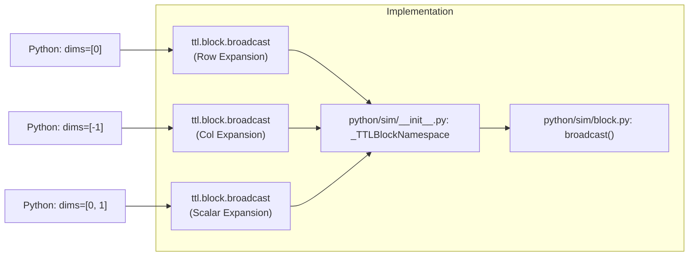
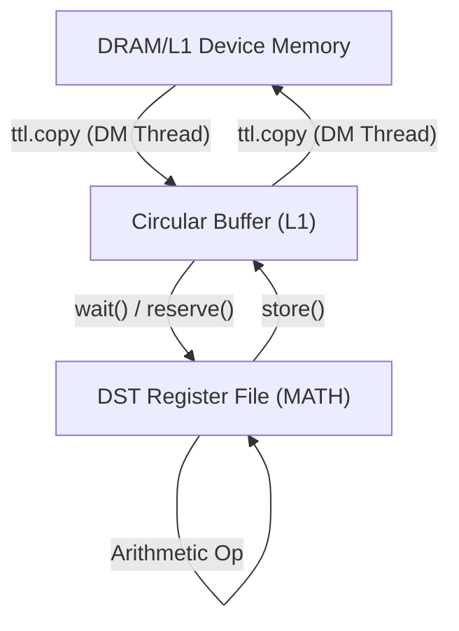

# Tile Operations and Broadcasting

Relevant source files
*   [examples/broadcast.py](https://github.com/tenstorrent/tt-lang/blob/d76e6233/examples/broadcast.py)
*   [examples/general_broadcast.py](https://github.com/tenstorrent/tt-lang/blob/d76e6233/examples/general_broadcast.py)
*   [include/ttlang/Dialect/TTL/TTLElementwiseOps.def](https://github.com/tenstorrent/tt-lang/blob/d76e6233/include/ttlang/Dialect/TTL/TTLElementwiseOps.def)
*   [python/sim/block.py](https://github.com/tenstorrent/tt-lang/blob/d76e6233/python/sim/block.py)
*   [python/sim/math.py](https://github.com/tenstorrent/tt-lang/blob/d76e6233/python/sim/math.py)
*   [test/me2e/base.py](https://github.com/tenstorrent/tt-lang/blob/d76e6233/test/me2e/base.py)
*   [test/me2e/config.py](https://github.com/tenstorrent/tt-lang/blob/d76e6233/test/me2e/config.py)
*   [test/me2e/config_specs.py](https://github.com/tenstorrent/tt-lang/blob/d76e6233/test/me2e/config_specs.py)
*   [test/me2e/op_specs.py](https://github.com/tenstorrent/tt-lang/blob/d76e6233/test/me2e/op_specs.py)
*   [test/me2e/ops/__init__.py](https://github.com/tenstorrent/tt-lang/blob/d76e6233/test/me2e/ops/__init__.py)
*   [test/me2e/ops/test_binary.py](https://github.com/tenstorrent/tt-lang/blob/d76e6233/test/me2e/ops/test_binary.py)
*   [test/me2e/runner.py](https://github.com/tenstorrent/tt-lang/blob/d76e6233/test/me2e/runner.py)
*   [test/me2e/test_compute_ops.py](https://github.com/tenstorrent/tt-lang/blob/d76e6233/test/me2e/test_compute_ops.py)
*   [test/python/invalid/invalid_cb_shape_mismatch.py](https://github.com/tenstorrent/tt-lang/blob/d76e6233/test/python/invalid/invalid_cb_shape_mismatch.py)
*   [test/python/simple_bcast.py](https://github.com/tenstorrent/tt-lang/blob/d76e6233/test/python/simple_bcast.py)
*   [test/python/test_bcast_ops.py](https://github.com/tenstorrent/tt-lang/blob/d76e6233/test/python/test_bcast_ops.py)
*   [test/python/test_bcast_shape_expansion.py](https://github.com/tenstorrent/tt-lang/blob/d76e6233/test/python/test_bcast_shape_expansion.py)
*   [test/python/test_elementwise_ops.py](https://github.com/tenstorrent/tt-lang/blob/d76e6233/test/python/test_elementwise_ops.py)
*   [test/sim/test_math.py](https://github.com/tenstorrent/tt-lang/blob/d76e6233/test/sim/test_math.py)
*   [test/ttlang/Conversion/TTLToTTKernel/tile_ops_to_ttkernel.mlir](https://github.com/tenstorrent/tt-lang/blob/d76e6233/test/ttlang/Conversion/TTLToTTKernel/tile_ops_to_ttkernel.mlir)
*   [test/ttlang_test_utils.py](https://github.com/tenstorrent/tt-lang/blob/d76e6233/test/ttlang_test_utils.py)

## Purpose and Scope

This page explains tile-level mathematical operations and broadcasting semantics in tt-lang. It covers the available operations for computing on tiles, how broadcasting enables operations on tensors with different shapes, and practical usage patterns within compute kernels.

For information about the `ttl.compute` structured operation that contains tile operations, see [Elementwise Fusion (ConvertTTLToCompute)](https://github.com/tenstorrent/tt-lang/blob/d76e6233/Elementwise%20Fusion%20(ConvertTTLToCompute))). For data movement between tensors and circular buffers, see [Data Movement Patterns](https://github.com/tenstorrent/tt-lang/blob/d76e6233/Data%20Movement%20Patterns)).

* * *

## Tile Operations Overview

Tile operations are the fundamental computational primitives in tt-lang. A **tile** is a fixed 32×32 block of elements that is the atomic unit of computation on Tenstorrent hardware [examples/general_broadcast.py 25](https://github.com/tenstorrent/tt-lang/blob/d76e6233/examples/general_broadcast.py#L25-L25) All tile operations execute on the DST (Destination) register file in the MATH thread.

### Tile vs Tensor Operations

tt-lang provides two levels of operations:

| Level | Operation Type | Example | Execution Context |
| --- | --- | --- | --- |
| **Tensor-level** | `ttl.add`, `ttl.mul`, `ttl.exp` | `result = a + b` | Block-level (Python DSL) |
| **Tile-level** | `ttl.math.add`, `ttl.math.exp` | Operates on individual tiles | Inside `ttl.compute` body |

Tensor-level operations are automatically lowered to `ttl.compute` operations containing tile-level operations during compilation. The `ConvertTTLToCompute` pass fuses chains of elementwise operations into a single compute block for efficiency.

Title: Compilation Flow to Hardware

Sources: [include/ttlang/Dialect/TTL/TTLElementwiseOps.def 71](https://github.com/tenstorrent/tt-lang/blob/d76e6233/include/ttlang/Dialect/TTL/TTLElementwiseOps.def#L71-L71)[examples/general_broadcast.py 56-91](https://github.com/tenstorrent/tt-lang/blob/d76e6233/examples/general_broadcast.py#L56-L91)[python/sim/__init__.py 65-87](https://github.com/tenstorrent/tt-lang/blob/d76e6233/python/sim/__init__.py#L65-L87)

* * *




Sources: [include/ttlang/Dialect/TTL/TTLElementwiseOps.def:71](), [examples/general_broadcast.py:56-91](), [python/sim/__init__.py:65-87]()

---
```
## Binary Tile Operations

Binary tile operations perform element-wise operations on two input tiles, producing a result tile. In the Python DSL, these are available via operator overloading or the `ttl.math` module [python/sim/__init__.py 65-87](https://github.com/tenstorrent/tt-lang/blob/d76e6233/python/sim/__init__.py#L65-L87)

### Available Binary Operations

The following mappings are available for binary operations, as defined in the dialect [include/ttlang/Dialect/TTL/TTLElementwiseOps.def 71-82](https://github.com/tenstorrent/tt-lang/blob/d76e6233/include/ttlang/Dialect/TTL/TTLElementwiseOps.def#L71-L82):

| Operation | Python Operator | `ttl.math` Function | TTKernel Mapping |
| --- | --- | --- | --- |
| Addition | `a + b` | `ttl.math.add(a, b)` | `AddBinaryTilesOp` |
| Subtraction | `a - b` | `ttl.math.sub(a, b)` | `SubBinaryTilesOp` |
| Multiplication | `a * b` | `ttl.math.mul(a, b)` | `MulBinaryTilesOp` |
| Division | `a / b` | `ttl.math.div(a, b)` | `DivBinaryTilesOp` |
| Maximum | N/A | `ttl.math.max(a, b)` | `BinaryMaxTileOp` |
| Minimum | N/A | `ttl.math.min(a, b)` | `BinaryMinTileOp` |
| Greater Than | N/A | `ttl.math.gt(a, b)` | `GtBinaryTilesOp` |
| Less Than | N/A | `ttl.math.lt(a, b)` | `LtBinaryTilesOp` |
| Equal | N/A | `ttl.math.eq(a, b)` | `EqBinaryTilesOp` |
| Not Equal | N/A | `ttl.math.ne(a, b)` | `NeBinaryTilesOp` |

### Python DSL Usage

The `Block` class (often referred to as `blk` in kernel code) provides operator overloading for arithmetic operations [test/python/test_elementwise_ops.py 47](https://github.com/tenstorrent/tt-lang/blob/d76e6233/test/python/test_elementwise_ops.py#L47-L47):

`# Inside a compute kernelwith (    lhs_dfb.wait() as l,    rhs_dfb.wait() as r,    out_dfb.reserve() as o,):    # Operator overloading generates fused tile operations    o.store(l + r)        # Function call syntax is also supported    result = ttl.math.max(l, r)    o.store(result)`
Sources: [test/python/test_elementwise_ops.py 32-63](https://github.com/tenstorrent/tt-lang/blob/d76e6233/test/python/test_elementwise_ops.py#L32-L63)[python/sim/math.py 184-208](https://github.com/tenstorrent/tt-lang/blob/d76e6233/python/sim/math.py#L184-L208)[include/ttlang/Dialect/TTL/TTLElementwiseOps.def 71-78](https://github.com/tenstorrent/tt-lang/blob/d76e6233/include/ttlang/Dialect/TTL/TTLElementwiseOps.def#L71-L78)[test/me2e/ops/__init__.py 28-69](https://github.com/tenstorrent/tt-lang/blob/d76e6233/test/me2e/ops/__init__.py#L28-L69)

* * *

## Unary Tile Operations

Unary tile operations perform element-wise transformations on a single input tile. These are typically SFPU (Special Function Processing Unit) operations.

### Available Unary Operations

Extensive unary operations are supported through the `ttl.math` namespace [python/sim/math.py 71-110](https://github.com/tenstorrent/tt-lang/blob/d76e6233/python/sim/math.py#L71-L110):

| Operation | Python Function | TTKernel Mapping |
| --- | --- | --- |
| Exponential | `ttl.math.exp(x)` | `ExpTileOp` |
| Logarithm | `ttl.math.log(x)` | `LogTileOp` |
| Square Root | `ttl.math.sqrt(x)` | `SqrtTileOp` |
| Absolute | `ttl.math.abs(x)` | `AbsTileOp` |
| Relu | `ttl.math.relu(x)` | `ReluTileOp` |
| Sigmoid | `ttl.math.sigmoid(x)` | `SigmoidTileOp` |
| Tanh | `ttl.math.tanh(x)` | `TanhTileOp` |
| Reciprocal | `ttl.math.recip(x)` | `RecipTileOp` |

### Python DSL Usage

Unary operations are available through the `ttl.math` module [test/python/test_elementwise_ops.py 111](https://github.com/tenstorrent/tt-lang/blob/d76e6233/test/python/test_elementwise_ops.py#L111-L111):

`# Inside a compute kernelwith inp_dfb.wait() as x, out_dfb.reserve() as o:    # Apply activation function    result = ttl.math.exp(x)    o.store(result)`
Sources: [python/sim/math.py 71-110](https://github.com/tenstorrent/tt-lang/blob/d76e6233/python/sim/math.py#L71-L110)[include/ttlang/Dialect/TTL/TTLElementwiseOps.def 82-110](https://github.com/tenstorrent/tt-lang/blob/d76e6233/include/ttlang/Dialect/TTL/TTLElementwiseOps.def#L82-L110)[test/python/test_elementwise_ops.py 107-113](https://github.com/tenstorrent/tt-lang/blob/d76e6233/test/python/test_elementwise_ops.py#L107-L113)

* * *

## Broadcasting Operations

Broadcasting enables operations between tiles or blocks of different shapes by replicating values along specific dimensions. tt-lang requires **explicit** broadcasting calls via `ttl.block.broadcast`[python/sim/block.py 80](https://github.com/tenstorrent/tt-lang/blob/d76e6233/python/sim/block.py#L80-L80)

### Broadcast Dimensions

Broadcasting uses dimension indexing [python/sim/block.py 82-90](https://github.com/tenstorrent/tt-lang/blob/d76e6233/python/sim/block.py#L82-L90):

*   `dims=[0]`: Broadcast along the row dimension (outermost/vertical expansion). Replicates row 0 across all 32 rows within each tile [python/sim/block.py 118](https://github.com/tenstorrent/tt-lang/blob/d76e6233/python/sim/block.py#L118-L118)
*   `dims=[1]` or `dims=[-1]`: Broadcast along the column dimension (innermost/horizontal expansion). Replicates column 0 across all 32 columns [python/sim/block.py 116](https://github.com/tenstorrent/tt-lang/blob/d76e6233/python/sim/block.py#L116-L116)
*   `dims=[0, 1]`: Scalar broadcast (both dimensions) [test/sim/test_math.py 93](https://github.com/tenstorrent/tt-lang/blob/d76e6233/test/sim/test_math.py#L93-L93)

Title: Broadcast Dimensions to Code Entities



### Shape Expansion

Broadcasting in tt-lang automatically handles "shape expansion" where a smaller input DFB (e.g., a single tile) is expanded to fill a larger output DFB (e.g., a block of tiles) [test/python/test_bcast_shape_expansion.py 41-48](https://github.com/tenstorrent/tt-lang/blob/d76e6233/test/python/test_bcast_shape_expansion.py#L41-L48)

`# Example from test_bcast_shape_expansion.py# inp_dfb has shape (2, 1), out_dfb has shape (2, 2)with inp_dfb.wait() as i, out_dfb.reserve() as o:    # bcast handles the (2,1) -> (2,2) expansion internally    result = ttl.block.broadcast(i, dims=[1], shape=(2, 2))    o.store(result)`
Sources: [python/sim/block.py 80-120](https://github.com/tenstorrent/tt-lang/blob/d76e6233/python/sim/block.py#L80-L120)[test/python/test_bcast_shape_expansion.py 35-48](https://github.com/tenstorrent/tt-lang/blob/d76e6233/test/python/test_bcast_shape_expansion.py#L35-L48)[test/sim/test_math.py 18-31](https://github.com/tenstorrent/tt-lang/blob/d76e6233/test/sim/test_math.py#L18-L31)

* * *

## Data Flow and Memory Patterns

Tile operations often interact with different memory tiers. Data is typically moved from DRAM or L1 into Circular Buffers (CBs) via Dataflow Buffers (DFBs) before the MATH thread processes it [test/python/test_elementwise_ops.py 44-46](https://github.com/tenstorrent/tt-lang/blob/d76e6233/test/python/test_elementwise_ops.py#L44-L46)

Title: Memory Data Flow for Tile Ops

Sources: [test/python/test_elementwise_ops.py 38-69](https://github.com/tenstorrent/tt-lang/blob/d76e6233/test/python/test_elementwise_ops.py#L38-L69)[test/ttlang_test_utils.py 123-163](https://github.com/tenstorrent/tt-lang/blob/d76e6233/test/ttlang_test_utils.py#L123-L163)[examples/general_broadcast.py 43-54](https://github.com/tenstorrent/tt-lang/blob/d76e6233/examples/general_broadcast.py#L43-L54)

* * *




Sources: [test/python/test_elementwise_ops.py:38-69](), [test/ttlang_test_utils.py:123-163](), [examples/general_broadcast.py:43-54]()

---
```
## Common Computation Patterns

### Pattern 1: Scalar and Vector Broadcast

A common pattern is broadcasting a vector or scalar to match a larger activation grid for element-wise operations [test/sim/test_math.py 57-86](https://github.com/tenstorrent/tt-lang/blob/d76e6233/test/sim/test_math.py#L57-L86)

`# Example logic similar to broadcast.py# b_blk shape (1, 1), broadcast along innermost (cols) to match a_blk (1, 3)b_broadcast = ttl.block.broadcast(b_squared, dims=[-1], shape=(1, 3))result = a_squared + b_broadcast`
### Pattern 2: Generic Broadcasting Logic

In generic kernels, broadcasting can be applied conditionally based on the input tensor shapes [examples/general_broadcast.py 68-84](https://github.com/tenstorrent/tt-lang/blob/d76e6233/examples/general_broadcast.py#L68-L84)

`# Determine if broadcast is needed based on tile countsb_dims = ([0] if b_row_tiles == 1 and row_tiles_per_block > 1 else []) + \         ([-1] if b_col_tiles == 1 and col_tiles_per_block > 1 else []) b_expr = ttl.block.broadcast(b_blk, dims=b_dims, shape=y_shape) if b_dims else b_blk`
### Pattern 3: Within-Tile Regression Protection

The simulator specifically validates that broadcasting replicates data correctly within the 32x32 tile structure, ensuring that auto-padded zeros do not leak into the computation. This is critical for column vectors or row vectors that only occupy the first column/row of a tile [test/sim/test_math.py 117-146](https://github.com/tenstorrent/tt-lang/blob/d76e6233/test/sim/test_math.py#L117-L146)

Sources: [examples/general_broadcast.py 66-86](https://github.com/tenstorrent/tt-lang/blob/d76e6233/examples/general_broadcast.py#L66-L86)[test/sim/test_math.py 117-173](https://github.com/tenstorrent/tt-lang/blob/d76e6233/test/sim/test_math.py#L117-L173)

* * *

## Validation and Error Handling

1.   **Layout Constraints**: `ttl.block.broadcast` is not supported for Row-Major layout blocks; tensors must be in `TILE_LAYOUT`[python/sim/block.py 125-126](https://github.com/tenstorrent/tt-lang/blob/d76e6233/python/sim/block.py#L125-L126)
2.   **Grid Size Constraints**: The block must have a grid size of 1 in each dimension listed in `dims` for broadcasting to be valid [python/sim/block.py 153-157](https://github.com/tenstorrent/tt-lang/blob/d76e6233/python/sim/block.py#L153-L157)
3.   **Rank Matching**: The target `shape` rank must match the rank of the input block [python/sim/block.py 139-142](https://github.com/tenstorrent/tt-lang/blob/d76e6233/python/sim/block.py#L139-L142)
4.   **Dimension Range**: Broadcast dimensions must be within the valid range of the block's rank (supporting negative indexing) [python/sim/block.py 146-151](https://github.com/tenstorrent/tt-lang/blob/d76e6233/python/sim/block.py#L146-L151)

Sources: [python/sim/block.py 125-162](https://github.com/tenstorrent/tt-lang/blob/d76e6233/python/sim/block.py#L125-L162)[test/python/invalid/invalid_cb_shape_mismatch.py 1-20](https://github.com/tenstorrent/tt-lang/blob/d76e6233/test/python/invalid/invalid_cb_shape_mismatch.py#L1-L20)

Dismiss
Refresh this wiki

Enter email to refresh
