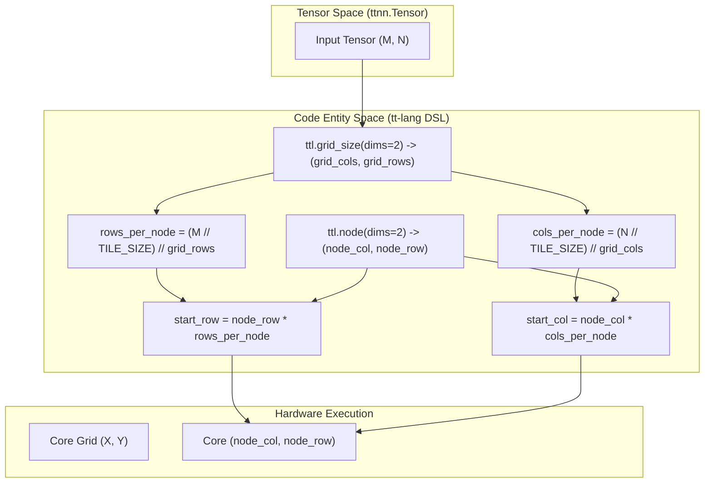
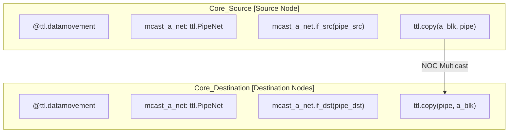

# Multi-core Programming

Relevant source files
*   [.github/containers/cleanup-toolchain.sh](https://github.com/tenstorrent/tt-lang/blob/d76e6233/.github/containers/cleanup-toolchain.sh)
*   [docs/sphinx/specs/TTLangSpecification.md](https://github.com/tenstorrent/tt-lang/blob/d76e6233/docs/sphinx/specs/TTLangSpecification.md?plain=1)
*   [examples/elementwise-tutorial/step_0_ttnn_base.py](https://github.com/tenstorrent/tt-lang/blob/d76e6233/examples/elementwise-tutorial/step_0_ttnn_base.py)
*   [examples/elementwise-tutorial/step_1_single_node_single_tile_block.py](https://github.com/tenstorrent/tt-lang/blob/d76e6233/examples/elementwise-tutorial/step_1_single_node_single_tile_block.py)
*   [examples/elementwise-tutorial/step_2_single_node_multitile_block.py](https://github.com/tenstorrent/tt-lang/blob/d76e6233/examples/elementwise-tutorial/step_2_single_node_multitile_block.py)
*   [examples/elementwise-tutorial/step_3_multinode.py](https://github.com/tenstorrent/tt-lang/blob/d76e6233/examples/elementwise-tutorial/step_3_multinode.py)
*   [examples/matmul_1d.py](https://github.com/tenstorrent/tt-lang/blob/d76e6233/examples/matmul_1d.py)
*   [examples/matmul_1d_mcast.py](https://github.com/tenstorrent/tt-lang/blob/d76e6233/examples/matmul_1d_mcast.py)
*   [examples/metal_examples/1d_mcast_matmul/ttlang/1d_tt_lang.py](https://github.com/tenstorrent/tt-lang/blob/d76e6233/examples/metal_examples/1d_mcast_matmul/ttlang/1d_tt_lang.py)
*   [examples/metal_examples/multinode_matmul/ttlang/multinode_matmul.py](https://github.com/tenstorrent/tt-lang/blob/d76e6233/examples/metal_examples/multinode_matmul/ttlang/multinode_matmul.py)
*   [examples/metal_examples/multinode_reuse_matmul/ttlang/multinode_reuse_matmul.py](https://github.com/tenstorrent/tt-lang/blob/d76e6233/examples/metal_examples/multinode_reuse_matmul/ttlang/multinode_reuse_matmul.py)
*   [examples/metal_examples/single_node_matmul/ttlang/single_node_matmul.py](https://github.com/tenstorrent/tt-lang/blob/d76e6233/examples/metal_examples/single_node_matmul/ttlang/single_node_matmul.py)
*   [examples/multinode_matmul.py](https://github.com/tenstorrent/tt-lang/blob/d76e6233/examples/multinode_matmul.py)
*   [examples/single_node_matmul.py](https://github.com/tenstorrent/tt-lang/blob/d76e6233/examples/single_node_matmul.py)
*   [include/ttlang/Dialect/TTL/Transforms/DFBMaterialization.h](https://github.com/tenstorrent/tt-lang/blob/d76e6233/include/ttlang/Dialect/TTL/Transforms/DFBMaterialization.h)
*   [lib/Dialect/TTL/Transforms/DFBMaterialization.cpp](https://github.com/tenstorrent/tt-lang/blob/d76e6233/lib/Dialect/TTL/Transforms/DFBMaterialization.cpp)
*   [lib/Dialect/TTL/Transforms/TTLInsertIntermediateDFBs.cpp](https://github.com/tenstorrent/tt-lang/blob/d76e6233/lib/Dialect/TTL/Transforms/TTLInsertIntermediateDFBs.cpp)
*   [python/pykernel/_src/kernel_ast.py](https://github.com/tenstorrent/tt-lang/blob/d76e6233/python/pykernel/_src/kernel_ast.py)
*   [python/ttl/dtype_utils.py](https://github.com/tenstorrent/tt-lang/blob/d76e6233/python/ttl/dtype_utils.py)
*   [test/python/invalid/invalid_reduce_scalar_undefined.py](https://github.com/tenstorrent/tt-lang/blob/d76e6233/test/python/invalid/invalid_reduce_scalar_undefined.py)
*   [test/python/mesh_tensor_spmd.py](https://github.com/tenstorrent/tt-lang/blob/d76e6233/test/python/mesh_tensor_spmd.py)
*   [test/python/simple_reduce_scalar.py](https://github.com/tenstorrent/tt-lang/blob/d76e6233/test/python/simple_reduce_scalar.py)
*   [test/python/test_bfp8_dram_add.py](https://github.com/tenstorrent/tt-lang/blob/d76e6233/test/python/test_bfp8_dram_add.py)
*   [test/python/test_matmul_multinode_fused.py](https://github.com/tenstorrent/tt-lang/blob/d76e6233/test/python/test_matmul_multinode_fused.py)
*   [test/python/test_matmul_with_bias_spmd.py](https://github.com/tenstorrent/tt-lang/blob/d76e6233/test/python/test_matmul_with_bias_spmd.py)

This page explains how to write kernels that execute across multiple cores in a 2D grid. Multi-core execution enables parallel processing of large tensors by distributing work across available hardware cores using a Single Program, Multiple Data (SPMD) model.

For basic kernel structure and single-core execution, see [Single-core Execution](https://deepwiki.com/tenstorrent/tt-lang/2.4.1-single-core-execution). For data movement patterns in multi-core contexts, see [Data Movement Patterns](https://deepwiki.com/tenstorrent/tt-lang/4.2-data-movement-patterns).

* * *

## Grid Specification

Kernels specify the number of cores they require using the `grid` parameter in the `@ttl.kernel` or `@ttl.operation` decorator [docs/sphinx/specs/TTLangSpecification.md 67](https://github.com/tenstorrent/tt-lang/blob/d76e6233/docs/sphinx/specs/TTLangSpecification.md?plain=1#L67-L67) Grids are always 2-dimensional with the format `(cols, rows)`.

### Fixed Grid Size

Specify an explicit grid shape using a tuple:

`@ttl.operation(grid=(4, 4))def my_kernel(a, b, c, y):    # This kernel will execute on a 4x4 grid (16 cores)    ...`
**Sources:**[examples/elementwise-tutorial/step_3_multinode.py 44](https://github.com/tenstorrent/tt-lang/blob/d76e6233/examples/elementwise-tutorial/step_3_multinode.py#L44-L44)[examples/multinode_matmul.py 30](https://github.com/tenstorrent/tt-lang/blob/d76e6233/examples/multinode_matmul.py#L30-L30)[docs/sphinx/specs/TTLangSpecification.md 123](https://github.com/tenstorrent/tt-lang/blob/d76e6233/docs/sphinx/specs/TTLangSpecification.md?plain=1#L123-L123)

### Automatic Grid Selection

Use `grid="full"` to let the system select an appropriate grid size based on device availability. This is the recommended way to write portable kernels that scale with hardware.

`@ttl.operation(grid="full")def my_kernel(a, b, out):    # Grid dimensions determined automatically by the compiler    grid_n, grid_m = ttl.grid_size(dims=2)    ...`
**Sources:**[examples/matmul_1d.py 15](https://github.com/tenstorrent/tt-lang/blob/d76e6233/examples/matmul_1d.py#L15-L15)[examples/matmul_1d_mcast.py 15](https://github.com/tenstorrent/tt-lang/blob/d76e6233/examples/matmul_1d_mcast.py#L15-L15)[test/python/test_matmul_with_bias_spmd.py 28](https://github.com/tenstorrent/tt-lang/blob/d76e6233/test/python/test_matmul_with_bias_spmd.py#L28-L28)

### Constraints and Validation

*   **2D Only:** Grids must be 2-dimensional. [docs/sphinx/specs/TTLangSpecification.md 101](https://github.com/tenstorrent/tt-lang/blob/d76e6233/docs/sphinx/specs/TTLangSpecification.md?plain=1#L101-L101)
*   **Hardware Limits:** Maximum grid size is hardware-dependent. [docs/sphinx/specs/TTLangSpecification.md 100](https://github.com/tenstorrent/tt-lang/blob/d76e6233/docs/sphinx/specs/TTLangSpecification.md?plain=1#L100-L100)
*   **Mesh Devices:** In multi-chip cases, `tt-lang` supports SPMD execution across multiple chips using `ttnn.open_mesh_device`. [docs/sphinx/specs/TTLangSpecification.md 102](https://github.com/tenstorrent/tt-lang/blob/d76e6233/docs/sphinx/specs/TTLangSpecification.md?plain=1#L102-L102)[test/python/test_matmul_with_bias_spmd.py 179](https://github.com/tenstorrent/tt-lang/blob/d76e6233/test/python/test_matmul_with_bias_spmd.py#L179-L179)

* * *

## Core Coordinates and Grid Query

### Querying Core Position

Each core determines its identity in the grid using `ttl.node()`. You can query coordinates in 1D (linear index) or 2D.

| Function Call | Returns | Role |
| --- | --- | --- |
| `ttl.node(dims=1)` | `node_id` | Linear index of the core in the grid |
| `ttl.node(dims=2)` | `(col, row)` | 2D coordinates of the core |

**Sources:**[examples/elementwise-tutorial/step_3_multinode.py 96](https://github.com/tenstorrent/tt-lang/blob/d76e6233/examples/elementwise-tutorial/step_3_multinode.py#L96-L96)[examples/matmul_1d.py 64](https://github.com/tenstorrent/tt-lang/blob/d76e6233/examples/matmul_1d.py#L64-L64)[test/python/test_matmul_with_bias_spmd.py 66](https://github.com/tenstorrent/tt-lang/blob/d76e6233/test/python/test_matmul_with_bias_spmd.py#L66-L66)[docs/sphinx/specs/TTLangSpecification.md 133](https://github.com/tenstorrent/tt-lang/blob/d76e6233/docs/sphinx/specs/TTLangSpecification.md?plain=1#L133-L133)

### Querying Grid Dimensions

Query the total grid size using `ttl.grid_size(dims=2)`, which returns `(cols, rows)`:

`grid_cols, grid_rows = ttl.grid_size(dims=2)`
This is essential when using `grid="full"` mode, as the grid dimensions are determined at runtime. If `dims=1` is used, it returns the total number of cores in the grid. [docs/sphinx/specs/TTLangSpecification.md 114](https://github.com/tenstorrent/tt-lang/blob/d76e6233/docs/sphinx/specs/TTLangSpecification.md?plain=1#L114-L114)

**Sources:**[examples/elementwise-tutorial/step_3_multinode.py 54](https://github.com/tenstorrent/tt-lang/blob/d76e6233/examples/elementwise-tutorial/step_3_multinode.py#L54-L54)[examples/matmul_1d.py 40](https://github.com/tenstorrent/tt-lang/blob/d76e6233/examples/matmul_1d.py#L40-L40)[test/python/test_matmul_with_bias_spmd.py 39](https://github.com/tenstorrent/tt-lang/blob/d76e6233/test/python/test_matmul_with_bias_spmd.py#L39-L39)

* * *

## Work Distribution Patterns

### SPMD Work Distribution Mapping

The following diagram bridges the high-level concept of a 2D Tensor to the code entities used to partition it across a Core Grid.

Title: Tensor Partitioning to Core Grid

**Sources:**[examples/elementwise-tutorial/step_3_multinode.py 54-60](https://github.com/tenstorrent/tt-lang/blob/d76e6233/examples/elementwise-tutorial/step_3_multinode.py#L54-L60)[examples/elementwise-tutorial/step_3_multinode.py 96-102](https://github.com/tenstorrent/tt-lang/blob/d76e6233/examples/elementwise-tutorial/step_3_multinode.py#L96-L102)

### Pattern: Tiled Parallelism (2D Grid)

Each core processes a rectangular sub-block of the input tensor. This is the standard pattern for operations like Matrix Multiplication where output tiles are assigned to cores.

`@ttl.operation(grid="full")def multinode_op(a, b, y):    grid_cols, grid_rows = ttl.grid_size(dims=2)    rows_per_node = a.shape[0] // TILE_SIZE // grid_rows    cols_per_node = a.shape[1] // TILE_SIZE // grid_cols     @ttl.compute()    def compute():        # Compute logic iterates through rows_per_node and cols_per_node        ...`
**Sources:**[examples/elementwise-tutorial/step_3_multinode.py 54-81](https://github.com/tenstorrent/tt-lang/blob/d76e6233/examples/elementwise-tutorial/step_3_multinode.py#L54-L81)[test/python/test_matmul_with_bias_spmd.py 117-125](https://github.com/tenstorrent/tt-lang/blob/d76e6233/test/python/test_matmul_with_bias_spmd.py#L117-L125)

* * *

## Inter-core Coordination and Communication

Multi-core programming in `tt-lang` often involves coordination via `ttl.Pipe` and `ttl.PipeNet` for multicasting or point-to-point transfers. [docs/sphinx/specs/TTLangSpecification.md 57](https://github.com/tenstorrent/tt-lang/blob/d76e6233/docs/sphinx/specs/TTLangSpecification.md?plain=1#L57-L57)

### Multicast Pattern (1D/2D)

In a multicast matmul, one core acts as a source (`if_src`) and broadcasts data (e.g., activations) to other cores in the grid (`if_dst`) that reuse that same data.

Title: Inter-Core Multicast Dataflow

**Sources:**[examples/matmul_1d_mcast.py 60](https://github.com/tenstorrent/tt-lang/blob/d76e6233/examples/matmul_1d_mcast.py#L60-L60)[examples/matmul_1d_mcast.py 112-113](https://github.com/tenstorrent/tt-lang/blob/d76e6233/examples/matmul_1d_mcast.py#L112-L113)[docs/sphinx/specs/TTLangSpecification.md 13](https://github.com/tenstorrent/tt-lang/blob/d76e6233/docs/sphinx/specs/TTLangSpecification.md?plain=1#L13-L13)

### Handling Uneven Workloads

When the total work (e.g., number of tiles) is not perfectly divisible by the number of cores, logic must be implemented to partition the remainder or deactivate idle cores using `divceil` logic.

`# Calculate ceil division for work distributionnb_per_node = -(-Nb // ttl.grid_size(dims=1))num_working_nodes = -(-Nb // nb_per_node) node_index = ttl.node(dims=1)if node_index < num_working_nodes:    # Active cores perform work    ...`
**Sources:**[examples/matmul_1d.py 40-41](https://github.com/tenstorrent/tt-lang/blob/d76e6233/examples/matmul_1d.py#L40-L41)[examples/matmul_1d.py 64-69](https://github.com/tenstorrent/tt-lang/blob/d76e6233/examples/matmul_1d.py#L64-L69)[examples/multinode_matmul.py 62-66](https://github.com/tenstorrent/tt-lang/blob/d76e6233/examples/multinode_matmul.py#L62-L66)

* * *

## Summary of Key Functions

| Function | File Reference | Purpose |
| --- | --- | --- |
| `ttl.grid_size(dims=2)` | [docs/sphinx/specs/TTLangSpecification.md 114](https://github.com/tenstorrent/tt-lang/blob/d76e6233/docs/sphinx/specs/TTLangSpecification.md?plain=1#L114-L114) | Returns `(cols, rows)` in the allocated grid. |
| `ttl.node(dims=2)` | [docs/sphinx/specs/TTLangSpecification.md 133](https://github.com/tenstorrent/tt-lang/blob/d76e6233/docs/sphinx/specs/TTLangSpecification.md?plain=1#L133-L133) | Returns current core's coordinates `(col, row)`. |
| `ttl.PipeNet([pipes])` | [docs/sphinx/specs/TTLangSpecification.md 13](https://github.com/tenstorrent/tt-lang/blob/d76e6233/docs/sphinx/specs/TTLangSpecification.md?plain=1#L13-L13) | Defines a network of inter-core communication pipes. |
| `net.if_src(fn)` | [examples/matmul_1d_mcast.py 112](https://github.com/tenstorrent/tt-lang/blob/d76e6233/examples/matmul_1d_mcast.py#L112-L112) | Executes `fn` if the core is the source for the pipe net. |
| `net.if_dst(fn)` | [examples/matmul_1d_mcast.py 113](https://github.com/tenstorrent/tt-lang/blob/d76e6233/examples/matmul_1d_mcast.py#L113-L113) | Executes `fn` if the core is a destination for the pipe net. |

**Sources:**[docs/sphinx/specs/TTLangSpecification.md 100-140](https://github.com/tenstorrent/tt-lang/blob/d76e6233/docs/sphinx/specs/TTLangSpecification.md?plain=1#L100-L140)[examples/matmul_1d_mcast.py 60-113](https://github.com/tenstorrent/tt-lang/blob/d76e6233/examples/matmul_1d_mcast.py#L60-L113)[examples/elementwise-tutorial/step_3_multinode.py 54-96](https://github.com/tenstorrent/tt-lang/blob/d76e6233/examples/elementwise-tutorial/step_3_multinode.py#L54-L96)

Dismiss
Refresh this wiki

Enter email to refresh
