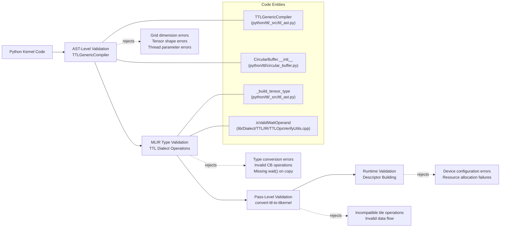
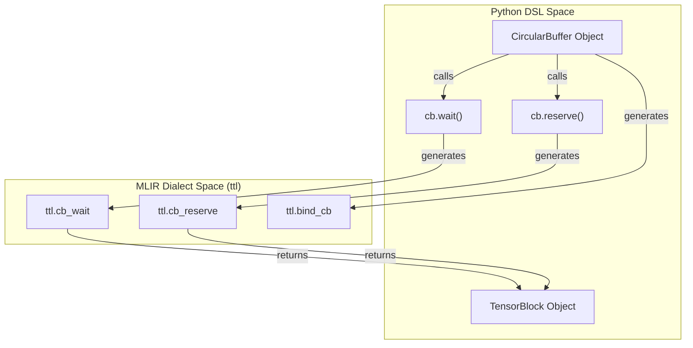
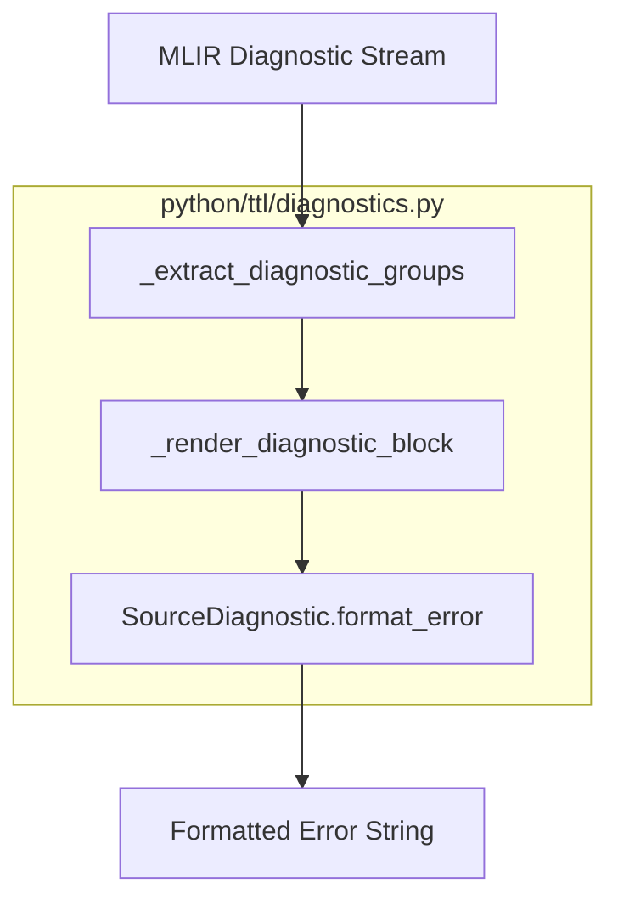

# Validation Rules and Common Errors

Relevant source files
*   [python/ttl/diagnostics.py](https://github.com/tenstorrent/tt-lang/blob/d76e6233/python/ttl/diagnostics.py)
*   [test/python/diagnostics_multi_error.py](https://github.com/tenstorrent/tt-lang/blob/d76e6233/test/python/diagnostics_multi_error.py)
*   [test/python/invalid/invalid_3d_grid.py](https://github.com/tenstorrent/tt-lang/blob/d76e6233/test/python/invalid/invalid_3d_grid.py)
*   [test/python/invalid/invalid_cb_buffer_factor.py](https://github.com/tenstorrent/tt-lang/blob/d76e6233/test/python/invalid/invalid_cb_buffer_factor.py)
*   [test/python/invalid/invalid_cb_shape_not_2tuple.py](https://github.com/tenstorrent/tt-lang/blob/d76e6233/test/python/invalid/invalid_cb_shape_not_2tuple.py)
*   [test/python/invalid/invalid_copy_no_cb.py](https://github.com/tenstorrent/tt-lang/blob/d76e6233/test/python/invalid/invalid_copy_no_cb.py)
*   [test/python/invalid/invalid_multicore_grid.py](https://github.com/tenstorrent/tt-lang/blob/d76e6233/test/python/invalid/invalid_multicore_grid.py)
*   [test/python/invalid/invalid_multitile_cb_index_syntax.py](https://github.com/tenstorrent/tt-lang/blob/d76e6233/test/python/invalid/invalid_multitile_cb_index_syntax.py)
*   [test/python/invalid/invalid_non_2d_cb.py](https://github.com/tenstorrent/tt-lang/blob/d76e6233/test/python/invalid/invalid_non_2d_cb.py)
*   [test/python/invalid/invalid_non_tiled.py](https://github.com/tenstorrent/tt-lang/blob/d76e6233/test/python/invalid/invalid_non_tiled.py)
*   [test/python/invalid/invalid_with_non_cb.py](https://github.com/tenstorrent/tt-lang/blob/d76e6233/test/python/invalid/invalid_with_non_cb.py)

This page documents validation rules enforced by the tt-lang compiler and common errors encountered when writing kernels. It covers constraints on grid dimensions, tensor shapes, memory configurations, and CircularBuffer operations, along with diagnostic guidance for interpreting error messages.

For information about writing kernels correctly from the start, see [Writing Your First Kernel](https://github.com/tenstorrent/tt-lang/blob/d76e6233/Writing%20Your%20First%20Kernel) For debugging compilation issues and interpreting MLIR errors, see [Debugging Techniques](https://github.com/tenstorrent/tt-lang/blob/d76e6233/Debugging%20Techniques)

* * *

## Validation Overview

The tt-lang compiler enforces validation at multiple stages, from Python AST parsing to final C++ code generation.

### Validation Pipeline

The following diagram maps the validation stages to the specific code entities responsible for enforcing rules:

**Validation Flow and Responsible Entities**

**Sources:**[python/ttl/_src/ttl_ast.py 105-641](https://github.com/tenstorrent/tt-lang/blob/d76e6233/python/ttl/_src/ttl_ast.py#L105-L641)[python/ttl/circular_buffer.py 57-73](https://github.com/tenstorrent/tt-lang/blob/d76e6233/python/ttl/circular_buffer.py#L57-L73)[python/ttl/_src/ttl_ast.py 65-90](https://github.com/tenstorrent/tt-lang/blob/d76e6233/python/ttl/_src/ttl_ast.py#L65-L90)[lib/Dialect/TTL/IR/TTLOpsVerifyUtils.cpp 78-96](https://github.com/tenstorrent/tt-lang/blob/d76e6233/lib/Dialect/TTL/IR/TTLOpsVerifyUtils.cpp#L78-L96)

* * *



## Grid and Core Validation Rules

### Supported Grid Dimensions

tt-lang **only supports 2D grids**. Grid dimensions are specified as `(cols, rows)` in the `@ttl.kernel` or `@ttl.operation` decorator. Specifying a 3D grid like `(1, 1, 1)` will trigger a `ValueError`.

| Rule | Valid | Invalid |
| --- | --- | --- |
| Grid must be 2D | `grid=(1, 1)`, `grid=(8, 8)` | `grid=(1, 1, 1)` |
| Grid dimensions must be positive integers | `grid=(2, 3)` | `grid=(0, 1)`, `grid=(-1, 2)` |

**Error Example:**

`@ttl.operation(grid=(1, 1, 1))  # INVALID: 3D griddef invalid_kernel(lhs, rhs, out):    ...`
**Error Message:**

```
ValueError: Only 2D grids supported, got grid (1, 1, 1)
```

**Sources:**[test/python/invalid/invalid_3d_grid.py 9-28](https://github.com/tenstorrent/tt-lang/blob/d76e6233/test/python/invalid/invalid_3d_grid.py#L9-L28)[python/ttl/_src/ttl_ast.py 65-90](https://github.com/tenstorrent/tt-lang/blob/d76e6233/python/ttl/_src/ttl_ast.py#L65-L90)

### Core Coordinate Access

The `ttl.node(dims=N)` function returns the current core's coordinates. **Only `dims=2` is supported.** Requesting `dims=3` is currently unsupported and will result in a compiler error.

| Function Call | Returns | Status |
| --- | --- | --- |
| `ttl.node(dims=2)` | `(x, y)` where x=col, y=row | ✓ Valid |
| `ttl.node(dims=3)` | - | ✗ Error |

**Sources:**[test/python/invalid/invalid_multicore_grid.py 9-50](https://github.com/tenstorrent/tt-lang/blob/d76e6233/test/python/invalid/invalid_multicore_grid.py#L9-L50)

* * *

## Thread and Function Rules

### Thread Parameters

Thread functions decorated with `@ttl.compute()` or `@ttl.datamovement()`**must have no parameters**. Dataflow buffers (DFBs) should be created in the kernel body and captured via closure.

**Error Example:**

`@ttl.compute()def add_compute(some_param): # INVALID: parameters not allowed    ...`
**Error Message:**

```
error: Thread functions must have no parameters
```

**Sources:**[test/python/invalid/invalid_thread_with_params.py 24-39](https://github.com/tenstorrent/tt-lang/blob/d76e6233/test/python/invalid/invalid_thread_with_params.py#L24-L39)

* * *

## Tensor Shape and Indexing Rules

### Tensor Dimensionality and Layout

tt-lang requires tensors to be tiled and at least 2D. All shape dimensions must be positive. Non-tiled tensors (e.g., `tiled=False` in `@ttl.operation`) are explicitly rejected.

| Rule | Requirement | Source |
| --- | --- | --- |
| Rank | At least 2D | [python/ttl/circular_buffer.py 63-64](https://github.com/tenstorrent/tt-lang/blob/d76e6233/python/ttl/circular_buffer.py#L63-L64) |
| Shape Values | All dimensions must be > 0 | [test/python/invalid/invalid_negative_shape.py 17-20](https://github.com/tenstorrent/tt-lang/blob/d76e6233/test/python/invalid/invalid_negative_shape.py#L17-L20) |
| Math Ops | `ttl.math.broadcast` only supports 2D | [test/python/invalid/invalid_nd_bcast.py 23-34](https://github.com/tenstorrent/tt-lang/blob/d76e6233/test/python/invalid/invalid_nd_bcast.py#L23-L34) |
| Layout | Only `ttnn.TILE_LAYOUT` supported | [test/python/invalid/invalid_non_tiled.py 9-29](https://github.com/tenstorrent/tt-lang/blob/d76e6233/test/python/invalid/invalid_non_tiled.py#L9-L29) |

**Sources:**[python/ttl/circular_buffer.py 63-64](https://github.com/tenstorrent/tt-lang/blob/d76e6233/python/ttl/circular_buffer.py#L63-L64)[test/python/invalid/invalid_negative_shape.py 17-20](https://github.com/tenstorrent/tt-lang/blob/d76e6233/test/python/invalid/invalid_negative_shape.py#L17-L20)[test/python/invalid/invalid_nd_bcast.py 23-34](https://github.com/tenstorrent/tt-lang/blob/d76e6233/test/python/invalid/invalid_nd_bcast.py#L23-L34)[test/python/invalid/invalid_non_tiled.py 9-29](https://github.com/tenstorrent/tt-lang/blob/d76e6233/test/python/invalid/invalid_non_tiled.py#L9-L29)

### Tensor Indexing Syntax

Tensor indexing supports both **single-tile access** and **slice notation**, but there are strict rules for multi-tile Dataflow Buffers (DFBs).

**Multi-tile Indexing Rule:** If a DFB has a shape larger than `(1, 1)`, tensor indexing **must** use range syntax (e.g., `tensor[0:2, 0:2]`). Using index syntax (e.g., `tensor[0, 0]`) with a multi-tile DFB will raise an error.

**Error Example:**

`inp_dfb = ttl.make_dataflow_buffer_like(inp, shape=(2, 2))# INVALID: using index syntax with 2x2 DFBtx = ttl.copy(inp[0, 0], inp_blk)`
**Error Message:**

```
error: CB shape [2, 2] requires range syntax (e.g., tensor[0:2, 0:2]), but got index syntax
```

**Sources:**[test/python/invalid/invalid_multitile_cb_index_syntax.py 9-42](https://github.com/tenstorrent/tt-lang/blob/d76e6233/test/python/invalid/invalid_multitile_cb_index_syntax.py#L9-L42)[test/python/simple_add_multitile.py 48-60](https://github.com/tenstorrent/tt-lang/blob/d76e6233/test/python/simple_add_multitile.py#L48-L60)

* * *

## CircularBuffer Validation Rules

### CB Shape and Buffer Factor

The `CircularBuffer` (DFB) constructor enforces constraints on shape and capacity. Specifically, the CB rank must be less than or equal to the rank of the tensor it is associated with.

| Constraint | Rule | Source |
| --- | --- | --- |
| Minimum Dimensions | Shape must have at least 2 dimensions | [python/ttl/circular_buffer.py 63-64](https://github.com/tenstorrent/tt-lang/blob/d76e6233/python/ttl/circular_buffer.py#L63-L64) |
| Buffer Factor | Must be in range [1, 32] | [python/ttl/circular_buffer.py 65-68](https://github.com/tenstorrent/tt-lang/blob/d76e6233/python/ttl/circular_buffer.py#L65-L68) |
| Rank Mismatch | CB rank must be <= Tensor rank | [test/python/invalid/invalid_non_2d_cb.py 9-24](https://github.com/tenstorrent/tt-lang/blob/d76e6233/test/python/invalid/invalid_non_2d_cb.py#L9-L24) |

**Sources:**[python/ttl/circular_buffer.py 63-68](https://github.com/tenstorrent/tt-lang/blob/d76e6233/python/ttl/circular_buffer.py#L63-L68)[test/python/invalid/invalid_cb_shape_not_2tuple.py 8-15](https://github.com/tenstorrent/tt-lang/blob/d76e6233/test/python/invalid/invalid_cb_shape_not_2tuple.py#L8-L15)[test/python/invalid/invalid_non_2d_cb.py 9-24](https://github.com/tenstorrent/tt-lang/blob/d76e6233/test/python/invalid/invalid_non_2d_cb.py#L9-L24)[test/python/invalid/invalid_cb_buffer_factor.py 8-15](https://github.com/tenstorrent/tt-lang/blob/d76e6233/test/python/invalid/invalid_cb_buffer_factor.py#L8-L15)

### CB Lifecycle Operations

The `with` statement is the preferred way to manage CB lifetimes. It handles the `wait`/`pop` or `reserve`/`push` protocol automatically. Attempting to use `with` on a `TensorBlock` (the result of a `wait()` call) rather than the `CircularBuffer` itself is an error because `TensorBlock` does not support the buffer lifecycle protocol.

**Code Entity Association: CB Operations**

**Sources:**[python/ttl/circular_buffer.py 79-116](https://github.com/tenstorrent/tt-lang/blob/d76e6233/python/ttl/circular_buffer.py#L79-L116)[test/python/invalid/invalid_with_non_cb.py 9-43](https://github.com/tenstorrent/tt-lang/blob/d76e6233/test/python/invalid/invalid_with_non_cb.py#L9-L43)[test/python/simple_add_multitile.py 73-82](https://github.com/tenstorrent/tt-lang/blob/d76e6233/test/python/simple_add_multitile.py#L73-L82)

* * *



## Common Compilation Errors

### Error: Missing wait() on copy

Every `ttl.copy()` operation returns a `!ttl.transfer_handle` that **must** be synchronized using `.wait()`. Failure to do so is caught by the MLIR verifier in `isValidWaitOperand`. Additionally, `ttl.copy()` requires exactly one operand to be a Dataflow Buffer (DFB) block; copying directly between two tensor accessors (memory-to-memory) is not supported.

**Invalid Code (No Wait):**

`tx = ttl.copy(lhs[0, 0], lhs_blk)# BUG: Forgot tx.wait()lhs_blk.push()`
**Invalid Code (No DFB):**

`# INVALID: Both operands are tensor accessorstx = ttl.copy(lhs[0, 0], rhs[0, 0])`
**Sources:**[test/python/invalid/invalid_copy_no_wait.py 49-65](https://github.com/tenstorrent/tt-lang/blob/d76e6233/test/python/invalid/invalid_copy_no_wait.py#L49-L65)[test/python/invalid/invalid_copy_no_cb.py 9-52](https://github.com/tenstorrent/tt-lang/blob/d76e6233/test/python/invalid/invalid_copy_no_cb.py#L9-L52)[lib/Dialect/TTL/IR/TTLOpsVerifyUtils.cpp 78-96](https://github.com/tenstorrent/tt-lang/blob/d76e6233/lib/Dialect/TTL/IR/TTLOpsVerifyUtils.cpp#L78-L96)

### Error: Debugging with Source Locations

When compilation fails, the compiler provides Rust-style diagnostic formatting. This system uses `SourceDiagnostic` to render error messages with ASCII arrows pointing to the exact line and column in the Python source code.

**Diagnostic Rendering Entity Mapping**

Multiple unrelated violations are rendered as separate `error:` blocks rather than being folded into a single primary error. The `format_mlir_error` function in `python/ttl/diagnostics.py` handles this grouping and source mapping.

**Sources:**[python/ttl/diagnostics.py 44-138](https://github.com/tenstorrent/tt-lang/blob/d76e6233/python/ttl/diagnostics.py#L44-L138)[python/ttl/diagnostics.py 150-210](https://github.com/tenstorrent/tt-lang/blob/d76e6233/python/ttl/diagnostics.py#L150-L210)[test/python/diagnostics_multi_error.py 7-132](https://github.com/tenstorrent/tt-lang/blob/d76e6233/test/python/diagnostics_multi_error.py#L7-L132)[test/python/debug_locations.py 10-20](https://github.com/tenstorrent/tt-lang/blob/d76e6233/test/python/debug_locations.py#L10-L20)

* * *




Multiple unrelated violations are rendered as separate `error:` blocks rather than being folded into a single primary error. The `format_mlir_error` function in `python/ttl/diagnostics.py` handles this grouping and source mapping.
```
## Validation Error Reference Table

| Error Message | Cause | Fix | Source |
| --- | --- | --- | --- |
| "ValueError: Only 2D grids supported" | Grid rank > 2 | Use `grid=(x, y)` | [test/python/invalid/invalid_3d_grid.py 22](https://github.com/tenstorrent/tt-lang/blob/d76e6233/test/python/invalid/invalid_3d_grid.py#L22-L22) |
| "Thread functions must have no parameters" | Argument in `@ttl.compute` | Use closure capture | [test/python/invalid/invalid_thread_with_params.py 24](https://github.com/tenstorrent/tt-lang/blob/d76e6233/test/python/invalid/invalid_thread_with_params.py#L24-L24) |
| "error: CB shape [X, Y] requires range syntax" | Index syntax on multi-tile DFB | Use `tensor[0:X, 0:Y]` | [test/python/invalid/invalid_multitile_cb_index_syntax.py 23](https://github.com/tenstorrent/tt-lang/blob/d76e6233/test/python/invalid/invalid_multitile_cb_index_syntax.py#L23-L23) |
| "DFB shape must have at least 2 dimensions" | 1D DFB shape | Use at least 2D shape | [test/python/invalid/invalid_cb_shape_not_2tuple.py 11](https://github.com/tenstorrent/tt-lang/blob/d76e6233/test/python/invalid/invalid_cb_shape_not_2tuple.py#L11-L11) |
| "CB shape rank (X) must be <= tensor rank (Y)" | Dimensionality mismatch | Reduce CB rank or match Tensor | [test/python/invalid/invalid_non_2d_cb.py 24](https://github.com/tenstorrent/tt-lang/blob/d76e6233/test/python/invalid/invalid_non_2d_cb.py#L24-L24) |
| "block_count must be in range [1, 32]" | Invalid capacity | Use factor 1-32 | [test/python/invalid/invalid_cb_buffer_factor.py 11](https://github.com/tenstorrent/tt-lang/blob/d76e6233/test/python/invalid/invalid_cb_buffer_factor.py#L11-L11) |
| "expects operand to be the result of ttl.copy" | Invalid `ttl.wait` target | Ensure target is from `ttl.copy` | [lib/Dialect/TTL/IR/TTLOpsVerifyUtils.cpp 95](https://github.com/tenstorrent/tt-lang/blob/d76e6233/lib/Dialect/TTL/IR/TTLOpsVerifyUtils.cpp#L95-L95) |
| "error: copy() with tensor subscript dst requires block src" | No DFB in copy | Ensure one arg is a DFB block | [test/python/invalid/invalid_copy_no_cb.py 23](https://github.com/tenstorrent/tt-lang/blob/d76e6233/test/python/invalid/invalid_copy_no_cb.py#L23-L23) |
| "error: Expected CircularBufferType, got..." | `with` on non-DFB | Use `with dfb.wait()` | [test/python/invalid/invalid_with_non_cb.py 23](https://github.com/tenstorrent/tt-lang/blob/d76e6233/test/python/invalid/invalid_with_non_cb.py#L23-L23) |
| "core() currently only supports dims=2" | Requested 3D coordinates | Use `ttl.node(dims=2)` | [test/python/invalid/invalid_multicore_grid.py 22](https://github.com/tenstorrent/tt-lang/blob/d76e6233/test/python/invalid/invalid_multicore_grid.py#L22-L22) |
| "ValueError: Only tiled tensors supported" | `tiled=False` used | Use `ttnn.TILE_LAYOUT` | [test/python/invalid/invalid_non_tiled.py 23](https://github.com/tenstorrent/tt-lang/blob/d76e6233/test/python/invalid/invalid_non_tiled.py#L23-L23) |

**Sources:**[python/ttl/circular_buffer.py 63-68](https://github.com/tenstorrent/tt-lang/blob/d76e6233/python/ttl/circular_buffer.py#L63-L68)[test/python/invalid/invalid_3d_grid.py 22-25](https://github.com/tenstorrent/tt-lang/blob/d76e6233/test/python/invalid/invalid_3d_grid.py#L22-L25)[test/python/invalid/invalid_multitile_cb_index_syntax.py 23-25](https://github.com/tenstorrent/tt-lang/blob/d76e6233/test/python/invalid/invalid_multitile_cb_index_syntax.py#L23-L25)[test/python/invalid/invalid_thread_with_params.py 24](https://github.com/tenstorrent/tt-lang/blob/d76e6233/test/python/invalid/invalid_thread_with_params.py#L24-L24)[test/python/invalid/invalid_copy_no_cb.py 23-26](https://github.com/tenstorrent/tt-lang/blob/d76e6233/test/python/invalid/invalid_copy_no_cb.py#L23-L26)[test/python/invalid/invalid_non_2d_cb.py 24](https://github.com/tenstorrent/tt-lang/blob/d76e6233/test/python/invalid/invalid_non_2d_cb.py#L24-L24)[test/python/invalid/invalid_with_non_cb.py 23-26](https://github.com/tenstorrent/tt-lang/blob/d76e6233/test/python/invalid/invalid_with_non_cb.py#L23-L26)[test/python/invalid/invalid_multicore_grid.py 22](https://github.com/tenstorrent/tt-lang/blob/d76e6233/test/python/invalid/invalid_multicore_grid.py#L22-L22)[test/python/invalid/invalid_non_tiled.py 23](https://github.com/tenstorrent/tt-lang/blob/d76e6233/test/python/invalid/invalid_non_tiled.py#L23-L23)[lib/Dialect/TTL/IR/TTLOpsVerifyUtils.cpp 78-96](https://github.com/tenstorrent/tt-lang/blob/d76e6233/lib/Dialect/TTL/IR/TTLOpsVerifyUtils.cpp#L78-L96)[test/python/invalid/invalid_cb_buffer_factor.py 11](https://github.com/tenstorrent/tt-lang/blob/d76e6233/test/python/invalid/invalid_cb_buffer_factor.py#L11-L11)[test/python/invalid/invalid_cb_shape_not_2tuple.py 11](https://github.com/tenstorrent/tt-lang/blob/d76e6233/test/python/invalid/invalid_cb_shape_not_2tuple.py#L11-L11)

Dismiss
Refresh this wiki

Enter email to refresh
