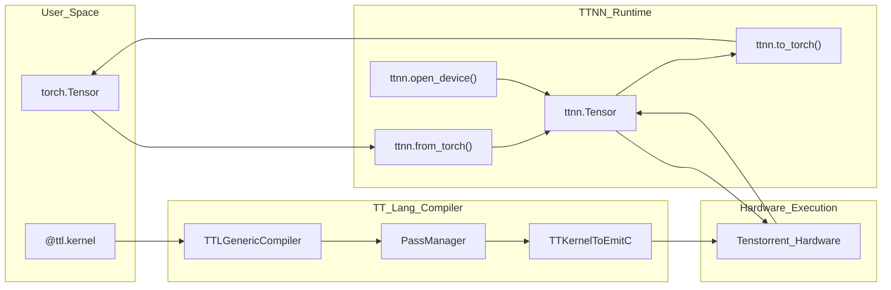
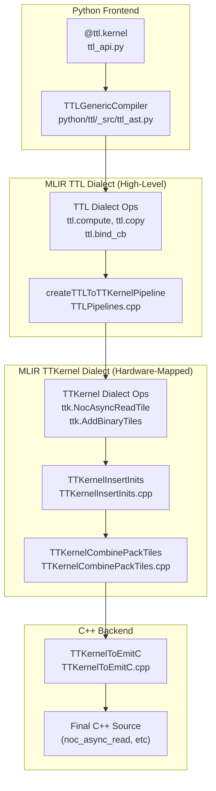
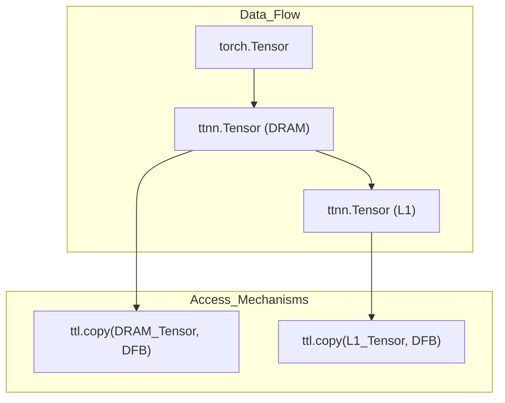

# TTNN Interoperability Overview

Relevant source files
*   [.github/scripts/probe-docker-image.sh](https://github.com/tenstorrent/tt-lang/blob/d76e6233/.github/scripts/probe-docker-image.sh)
*   [.github/scripts/tests/test_probe_docker_image.bats](https://github.com/tenstorrent/tt-lang/blob/d76e6233/.github/scripts/tests/test_probe_docker_image.bats)
*   [.github/workflows/publish-s3-pypi.yml](https://github.com/tenstorrent/tt-lang/blob/d76e6233/.github/workflows/publish-s3-pypi.yml)
*   [.gitignore](https://github.com/tenstorrent/tt-lang/blob/d76e6233/.gitignore)
*   [README.md](https://github.com/tenstorrent/tt-lang/blob/d76e6233/README.md?plain=1)
*   [docs/sphinx/getting-started.md](https://github.com/tenstorrent/tt-lang/blob/d76e6233/docs/sphinx/getting-started.md?plain=1)
*   [include/ttlang/Dialect/TTL/Passes.td](https://github.com/tenstorrent/tt-lang/blob/d76e6233/include/ttlang/Dialect/TTL/Passes.td)
*   [lib/Dialect/TTL/Pipelines/TTLPipelines.cpp](https://github.com/tenstorrent/tt-lang/blob/d76e6233/lib/Dialect/TTL/Pipelines/TTLPipelines.cpp)
*   [lib/Dialect/TTL/Transforms/CMakeLists.txt](https://github.com/tenstorrent/tt-lang/blob/d76e6233/lib/Dialect/TTL/Transforms/CMakeLists.txt)
*   [python/CMakeLists.txt](https://github.com/tenstorrent/tt-lang/blob/d76e6233/python/CMakeLists.txt)
*   [python/ttl/_src/ttl_ast.py](https://github.com/tenstorrent/tt-lang/blob/d76e6233/python/ttl/_src/ttl_ast.py)
*   [python/ttl/ttl_api.py](https://github.com/tenstorrent/tt-lang/blob/d76e6233/python/ttl/ttl_api.py)
*   [test/me2e/builder/pipeline.py](https://github.com/tenstorrent/tt-lang/blob/d76e6233/test/me2e/builder/pipeline.py)

This page explains how `tt-lang` kernels integrate with the `ttnn` library to execute on Tenstorrent hardware. It covers tensor creation, memory configuration, kernel execution, and the relationship between `tt-lang`'s Python DSL and `ttnn`'s tensor operations.

* * *

## The Relationship Between tt-lang and TTNN

`tt-lang` and `ttnn` operate at different abstraction levels within the Tenstorrent software stack. `tt-lang` serves as an expressive middle ground between high-level `ttnn` operations and low-level `tt-metalium` primitives [README.md 27-40](https://github.com/tenstorrent/tt-lang/blob/d76e6233/README.md?plain=1#L27-L40)

| Layer | Purpose | Example APIs |
| --- | --- | --- |
| **TTNN** | High-level tensor library with pre-built operations | `ttnn.add()`, `ttnn.matmul()`, `ttnn.softmax()` |
| **tt-lang** | Custom kernel DSL for operations not in TTNN or requiring specialized implementation | `@ttl.kernel`, `@ttl.compute`, `ttl.copy` |
| **TT-Metalium** | Low-level C++ kernel API | Direct hardware control |

**Key Integration Points:**

1.   **Tensors**: `tt-lang` kernels accept `ttnn.Tensor` objects as arguments. The `ttl_api.py` module uses `_ensure_ttnn()` to lazy-load the `ttnn` library [python/ttl/ttl_api.py 20-36](https://github.com/tenstorrent/tt-lang/blob/d76e6233/python/ttl/ttl_api.py#L20-L36)
2.   **Device Management**: `tt-lang` relies on `ttnn` to manage device handles. The `_run_profiling_pipeline` function, for instance, extracts the device from the first `ttnn.Tensor` argument [python/ttl/ttl_api.py 192-201](https://github.com/tenstorrent/tt-lang/blob/d76e6233/python/ttl/ttl_api.py#L192-L201)
3.   **Memory Configuration**: `tt-lang` kernels read from `DRAM` or `L1` tensors. The compiler extracts memory configuration (e.g., `buffer_type`) and layout information from `ttnn.Tensor` objects to generate cache keys [python/ttl/ttl_api.py 121-130](https://github.com/tenstorrent/tt-lang/blob/d76e6233/python/ttl/ttl_api.py#L121-L130)
4.   **Layout Requirements**: For compute operations, `tt-lang` typically requires `TILE_LAYOUT`. The `TTLGenericCompiler` uses `detect_memory_layout` and `create_layout` to build MLIR tensor types with `TTLLayoutAttr`[python/ttl/_src/ttl_ast.py 90-103](https://github.com/tenstorrent/tt-lang/blob/d76e6233/python/ttl/_src/ttl_ast.py#L90-L103)
5.   **Execution**: Calling a decorated `tt-lang` function triggers the compilation pipeline, which lowers the Python AST to `TTL` dialect and eventually to `TTKernel` C++ code for hardware execution [python/ttl/ttl_api.py 70-76](https://github.com/tenstorrent/tt-lang/blob/d76e6233/python/ttl/ttl_api.py#L70-L76)[lib/Dialect/TTL/Pipelines/TTLPipelines.cpp 19-76](https://github.com/tenstorrent/tt-lang/blob/d76e6233/lib/Dialect/TTL/Pipelines/TTLPipelines.cpp#L19-L76)

### System Architecture to Code Entity Mapping

The diagram below illustrates the flow from Python source to hardware execution, mapping system concepts to specific code entities.

**Sources:**[python/ttl/ttl_api.py 17-36](https://github.com/tenstorrent/tt-lang/blob/d76e6233/python/ttl/ttl_api.py#L17-L36)[python/ttl/ttl_api.py 70-76](https://github.com/tenstorrent/tt-lang/blob/d76e6233/python/ttl/ttl_api.py#L70-L76)[python/ttl/_src/ttl_ast.py 128-146](https://github.com/tenstorrent/tt-lang/blob/d76e6233/python/ttl/_src/ttl_ast.py#L128-L146)[lib/Dialect/TTL/Pipelines/TTLPipelines.cpp 19-76](https://github.com/tenstorrent/tt-lang/blob/d76e6233/lib/Dialect/TTL/Pipelines/TTLPipelines.cpp#L19-L76)

* * *






## Tensor Creation and Memory Configuration

`ttnn` tensors must be configured correctly for `tt-lang` compatibility. The compiler processes these properties during the MLIR generation phase to handle NOC addressing.

### Required Tensor Configuration

| Parameter | Required Value | Purpose |
| --- | --- | --- |
| `dtype` | `bfloat16` / `bfloat8_b` | Supported hardware types; converted via `tensor_dtype_to_ttcore_datatype`[python/ttl/_src/ttl_ast.py 104-107](https://github.com/tenstorrent/tt-lang/blob/d76e6233/python/ttl/_src/ttl_ast.py#L104-L107) |
| `layout` | `TILE_LAYOUT` | Required for compute; `TTLGenericCompiler` checks if tensors are tiled [python/ttl/_src/ttl_ast.py 71-72](https://github.com/tenstorrent/tt-lang/blob/d76e6233/python/ttl/_src/ttl_ast.py#L71-L72) |
| `device` | Active `ttnn` device | Target hardware; used for profiling and execution [python/ttl/ttl_api.py 192-201](https://github.com/tenstorrent/tt-lang/blob/d76e6233/python/ttl/ttl_api.py#L192-L201) |
| `memory_config` | `DRAM` or `L1` | Buffer placement; supported spaces defined in `constants.py`[python/ttl/_src/ttl_ast.py 73-74](https://github.com/tenstorrent/tt-lang/blob/d76e6233/python/ttl/_src/ttl_ast.py#L73-L74)[python/ttl/ttl_api.py 78](https://github.com/tenstorrent/tt-lang/blob/d76e6233/python/ttl/ttl_api.py#L78-L78) |

### Memory Configuration Patterns

The `TTLGenericCompiler` builds MLIR tensor types with `TTLLayoutAttr` encoding based on the `ttnn.Tensor` memory layout [python/ttl/_src/ttl_ast.py 69-116](https://github.com/tenstorrent/tt-lang/blob/d76e6233/python/ttl/_src/ttl_ast.py#L69-L116)

**Pattern 1: Interleaved Access**: Tensors configured as interleaved in DRAM or L1. The compiler uses `detect_memory_layout` to identify `TENSOR_MEMORY_LAYOUT_INTERLEAVED` and generates appropriate NOC addressing [python/ttl/_src/ttl_ast.py 90-103](https://github.com/tenstorrent/tt-lang/blob/d76e6233/python/ttl/_src/ttl_ast.py#L90-L103)

**Pattern 2: Sharded Access**: Tensors sharded across cores in L1. The compiler handles the mapping of sharded layouts to the core grid specified in the `@ttl.kernel` decorator [python/ttl/_src/ttl_ast.py 94-103](https://github.com/tenstorrent/tt-lang/blob/d76e6233/python/ttl/_src/ttl_ast.py#L94-L103)

**Sources:**[python/ttl/_src/ttl_ast.py 90-116](https://github.com/tenstorrent/tt-lang/blob/d76e6233/python/ttl/_src/ttl_ast.py#L90-L116)[python/ttl/ttl_api.py 121-130](https://github.com/tenstorrent/tt-lang/blob/d76e6233/python/ttl/ttl_api.py#L121-L130)

* * *




**Pattern 1: Interleaved Access**: Tensors configured as interleaved in DRAM or L1. The compiler uses `detect_memory_layout` to identify `TENSOR_MEMORY_LAYOUT_INTERLEAVED` and generates appropriate NOC addressing [python/ttl/_src/ttl_ast.py:90-103]().

**Pattern 2: Sharded Access**: Tensors sharded across cores in L1. The compiler handles the mapping of sharded layouts to the core grid specified in the `@ttl.kernel` decorator [python/ttl/_src/ttl_ast.py:94-103]().
```
## Kernel Execution Model

`tt-lang` kernels are Python functions decorated with `@ttl.kernel` that accept `ttnn.Tensor` objects as inputs and outputs.

### Execution Sequence

When a kernel is called, the system determines if it needs to compile or can reuse a cached binary using a cache key generated from tensor properties (shape, dtype, memory space, layout) [python/ttl/ttl_api.py 121-158](https://github.com/tenstorrent/tt-lang/blob/d76e6233/python/ttl/ttl_api.py#L121-L158)

### Dataflow Buffer (DFB) Integration

`tt-lang` bridges `ttnn` tensors to hardware Circular Buffers (CBs) using `DataflowBuffer`. The `TTLGenericCompiler` tracks CB info, including shape and element type, to bind them inside the function body [python/ttl/_src/ttl_ast.py 156-158](https://github.com/tenstorrent/tt-lang/blob/d76e6233/python/ttl/_src/ttl_ast.py#L156-L158)

**Sources:**[python/ttl/ttl_api.py 121-158](https://github.com/tenstorrent/tt-lang/blob/d76e6233/python/ttl/ttl_api.py#L121-L158)[python/ttl/_src/ttl_ast.py 128-170](https://github.com/tenstorrent/tt-lang/blob/d76e6233/python/ttl/_src/ttl_ast.py#L128-L170)[lib/Dialect/TTL/Pipelines/TTLPipelines.cpp 19-76](https://github.com/tenstorrent/tt-lang/blob/d76e6233/lib/Dialect/TTL/Pipelines/TTLPipelines.cpp#L19-L76)

* * *

## Interoperability Example: Element-wise Add

The following example demonstrates a `tt-lang` kernel operating on `ttnn` tensors.

### Implementation Details

*   **Automatic Synchronization**: The `buildTTLAutoSyncPipeline` inserts missing `cb_push`/`cb_pop` and `cb_reserve`/`cb_wait` operations, and coalesces consecutive acquires into multi-tile operations [lib/Dialect/TTL/Pipelines/TTLPipelines.cpp 78-81](https://github.com/tenstorrent/tt-lang/blob/d76e6233/lib/Dialect/TTL/Pipelines/TTLPipelines.cpp#L78-L81)[include/ttlang/Dialect/TTL/Passes.td 6-106](https://github.com/tenstorrent/tt-lang/blob/d76e6233/include/ttlang/Dialect/TTL/Passes.td#L6-L106)
*   **Copy Lowering**: `ttl.copy` operations are lowered to `TTKernel` NOC operations via the `convert-ttl-to-ttkernel` pass [include/ttlang/Dialect/TTL/Passes.td 120-130](https://github.com/tenstorrent/tt-lang/blob/d76e6233/include/ttlang/Dialect/TTL/Passes.td#L120-L130)
*   **Math Mapping**: Element-wise operations like `+` are fused into `ttl.compute` operations and eventually lowered to `TTKernel` math operations [lib/Dialect/TTL/Transforms/CMakeLists.txt 6-8](https://github.com/tenstorrent/tt-lang/blob/d76e6233/lib/Dialect/TTL/Transforms/CMakeLists.txt#L6-L8)

**Sources:**[lib/Dialect/TTL/Pipelines/TTLPipelines.cpp 19-81](https://github.com/tenstorrent/tt-lang/blob/d76e6233/lib/Dialect/TTL/Pipelines/TTLPipelines.cpp#L19-L81)[include/ttlang/Dialect/TTL/Passes.td 6-130](https://github.com/tenstorrent/tt-lang/blob/d76e6233/include/ttlang/Dialect/TTL/Passes.td#L6-L130)[python/ttl/ttl_api.py 71-77](https://github.com/tenstorrent/tt-lang/blob/d76e6233/python/ttl/ttl_api.py#L71-L77)

* * *

## Performance and Debugging Integration

### Auto-Profiling

`tt-lang` integrates with the Tenstorrent device profiler. If `TT_METAL_DEVICE_PROFILER=1` is set, `tt-lang` reads the device profile CSV and displays a report mapped back to the Python source lines [python/ttl/ttl_api.py 166-228](https://github.com/tenstorrent/tt-lang/blob/d76e6233/python/ttl/ttl_api.py#L166-L228)

### Verification Passes

The compilation pipeline includes several verification passes to ensure interoperability and hardware safety:

*   `TTLVerifyDFBSPSC`: Verifies Single-Producer Single-Consumer constraints for Dataflow Buffers [lib/Dialect/TTL/Passes.td 23](https://github.com/tenstorrent/tt-lang/blob/d76e6233/lib/Dialect/TTL/Passes.td#L23-L23)
*   `TTLValidateCBBudget`: Ensures the allocated Circular Buffers do not exceed the core's L1 memory capacity [lib/Dialect/TTL/Passes.td 19](https://github.com/tenstorrent/tt-lang/blob/d76e6233/lib/Dialect/TTL/Passes.td#L19-L19)
*   `TTLVerifyPipeNetGuards`: Ensures that `PipeNet` operations are correctly guarded by `is_src()`/`is_dst()` checks [lib/Dialect/TTL/Passes.td 24](https://github.com/tenstorrent/tt-lang/blob/d76e6233/lib/Dialect/TTL/Passes.td#L24-L24)

**Sources:**[python/ttl/ttl_api.py 166-228](https://github.com/tenstorrent/tt-lang/blob/d76e6233/python/ttl/ttl_api.py#L166-L228)[lib/Dialect/TTL/Pipelines/TTLPipelines.cpp 52-57](https://github.com/tenstorrent/tt-lang/blob/d76e6233/lib/Dialect/TTL/Pipelines/TTLPipelines.cpp#L52-L57)[lib/Dialect/TTL/Transforms/CMakeLists.txt 19-25](https://github.com/tenstorrent/tt-lang/blob/d76e6233/lib/Dialect/TTL/Transforms/CMakeLists.txt#L19-L25)

Dismiss
Refresh this wiki

Enter email to refresh
