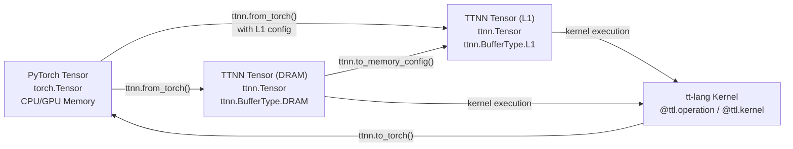
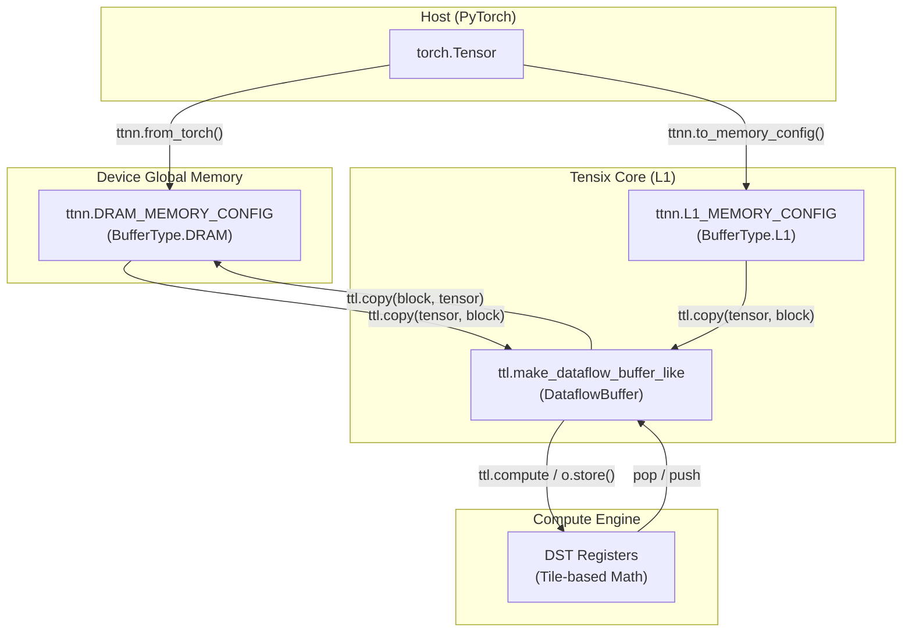
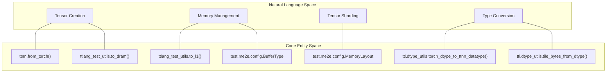

# Tensor Creation and Memory Configuration

Relevant source files
*   [.github/containers/cleanup-toolchain.sh](https://github.com/tenstorrent/tt-lang/blob/d76e6233/.github/containers/cleanup-toolchain.sh)
*   [include/ttlang/Dialect/TTL/TTLElementwiseOps.def](https://github.com/tenstorrent/tt-lang/blob/d76e6233/include/ttlang/Dialect/TTL/TTLElementwiseOps.def)
*   [python/ttl/dtype_utils.py](https://github.com/tenstorrent/tt-lang/blob/d76e6233/python/ttl/dtype_utils.py)
*   [python/ttl/layouts.py](https://github.com/tenstorrent/tt-lang/blob/d76e6233/python/ttl/layouts.py)
*   [test/me2e/base.py](https://github.com/tenstorrent/tt-lang/blob/d76e6233/test/me2e/base.py)
*   [test/me2e/config.py](https://github.com/tenstorrent/tt-lang/blob/d76e6233/test/me2e/config.py)
*   [test/me2e/config_specs.py](https://github.com/tenstorrent/tt-lang/blob/d76e6233/test/me2e/config_specs.py)
*   [test/me2e/op_specs.py](https://github.com/tenstorrent/tt-lang/blob/d76e6233/test/me2e/op_specs.py)
*   [test/me2e/ops/__init__.py](https://github.com/tenstorrent/tt-lang/blob/d76e6233/test/me2e/ops/__init__.py)
*   [test/me2e/ops/test_binary.py](https://github.com/tenstorrent/tt-lang/blob/d76e6233/test/me2e/ops/test_binary.py)
*   [test/me2e/runner.py](https://github.com/tenstorrent/tt-lang/blob/d76e6233/test/me2e/runner.py)
*   [test/me2e/test_compute_ops.py](https://github.com/tenstorrent/tt-lang/blob/d76e6233/test/me2e/test_compute_ops.py)
*   [test/python/mesh_tensor_spmd.py](https://github.com/tenstorrent/tt-lang/blob/d76e6233/test/python/mesh_tensor_spmd.py)
*   [test/python/test_bfp8_dram_add.py](https://github.com/tenstorrent/tt-lang/blob/d76e6233/test/python/test_bfp8_dram_add.py)
*   [test/python/test_elementwise_ops.py](https://github.com/tenstorrent/tt-lang/blob/d76e6233/test/python/test_elementwise_ops.py)
*   [test/python/test_matmul_multinode_fused.py](https://github.com/tenstorrent/tt-lang/blob/d76e6233/test/python/test_matmul_multinode_fused.py)
*   [test/python/test_matmul_with_bias_spmd.py](https://github.com/tenstorrent/tt-lang/blob/d76e6233/test/python/test_matmul_with_bias_spmd.py)
*   [test/ttlang/Conversion/TTLToTTKernel/tile_ops_to_ttkernel.mlir](https://github.com/tenstorrent/tt-lang/blob/d76e6233/test/ttlang/Conversion/TTLToTTKernel/tile_ops_to_ttkernel.mlir)
*   [test/ttlang_test_utils.py](https://github.com/tenstorrent/tt-lang/blob/d76e6233/test/ttlang_test_utils.py)

This page describes how to create TTNN tensors from PyTorch tensors, configure their memory placement (DRAM vs L1), and manage data flow between host and Tenstorrent device memory. These operations are essential prerequisites for executing tt-lang kernels on hardware.

## Overview: Tensor Lifecycle

Tensors flow from host memory (PyTorch) to device memory (DRAM or L1) before being processed by tt-lang kernels. The `ttnn.from_torch` function serves as the primary entry point, while `ttnn.to_torch` retrieves results. In the simulation environment, `ttnn.Tensor` acts as a wrapper around `torch.Tensor` while maintaining Tenstorrent-specific metadata [python/sim/ttnnsim.py 12-18](https://github.com/tenstorrent/tt-lang/blob/d76e6233/python/sim/ttnnsim.py#L12-L18)

### Tensor Data Flow

**Sources:**[python/sim/ttnnsim.py 105-110](https://github.com/tenstorrent/tt-lang/blob/d76e6233/python/sim/ttnnsim.py#L105-L110)[python/sim/ttnnsim.py 215-216](https://github.com/tenstorrent/tt-lang/blob/d76e6233/python/sim/ttnnsim.py#L215-L216)[test/python/test_elementwise_ops.py 25-31](https://github.com/tenstorrent/tt-lang/blob/d76e6233/test/python/test_elementwise_ops.py#L25-L31)[test/ttlang_test_utils.py 123-144](https://github.com/tenstorrent/tt-lang/blob/d76e6233/test/ttlang_test_utils.py#L123-L144)

## Creating TTNN Tensors from PyTorch

### Basic Tensor Creation with `ttnn.from_torch()`

The `ttnn.from_torch()` function creates TTNN tensors on device from PyTorch tensors. Utility functions in the test suite like `to_dram` and `to_l1` provide standard wrappers for these operations [test/ttlang_test_utils.py 123-163](https://github.com/tenstorrent/tt-lang/blob/d76e6233/test/ttlang_test_utils.py#L123-L163)

`# Create PyTorch tensorlhs_torch = torch.full((32, 32), 2.0, dtype=torch.bfloat16) # Convert to TTNN tensor on device in DRAM using utilitylhs = to_dram(lhs_torch, device) # Or manually via ttnnlhs = ttnn.from_torch(    lhs_torch,    dtype=ttnn.bfloat16,    layout=ttnn.TILE_LAYOUT,    device=device,    memory_config=ttnn.DRAM_MEMORY_CONFIG,)`
**Required Parameters:**

| Parameter | Type | Description |
| --- | --- | --- |
| `tensor` | `torch.Tensor` | Source PyTorch tensor |
| `dtype` | `ttnn.DataType` | Target data type (e.g., `ttnn.BFLOAT16`, `ttnn.FLOAT32`). Converters exist between Torch and TTNN types [python/ttl/dtype_utils.py 128-161](https://github.com/tenstorrent/tt-lang/blob/d76e6233/python/ttl/dtype_utils.py#L128-L161) |
| `layout` | `ttnn.Layout` | Tensor layout (must be `ttnn.TILE_LAYOUT` for compute kernels) [test/ttlang_test_utils.py 141](https://github.com/tenstorrent/tt-lang/blob/d76e6233/test/ttlang_test_utils.py#L141-L141) |
| `device` | `Device` | Target device handle |
| `memory_config` | `MemoryConfig` | Placement strategy (DRAM or L1) [test/ttlang_test_utils.py 143](https://github.com/tenstorrent/tt-lang/blob/d76e6233/test/ttlang_test_utils.py#L143-L143) |

**Sources:**[test/ttlang_test_utils.py 123-144](https://github.com/tenstorrent/tt-lang/blob/d76e6233/test/ttlang_test_utils.py#L123-L144)[python/ttl/dtype_utils.py 128-161](https://github.com/tenstorrent/tt-lang/blob/d76e6233/python/ttl/dtype_utils.py#L128-L161)[test/python/test_elementwise_ops.py 197-208](https://github.com/tenstorrent/tt-lang/blob/d76e6233/test/python/test_elementwise_ops.py#L197-L208)

### Converting Back to PyTorch with `ttnn.to_torch()`

After kernel execution, convert TTNN tensors back to PyTorch for verification.

`# Execute kerneladd_kernel(lhs, rhs, out) # Convert result back to PyTorchresult = ttnn.to_torch(out)`
**Sources:**[test/me2e/base.py 118-203](https://github.com/tenstorrent/tt-lang/blob/d76e6233/test/me2e/base.py#L118-L203)[test/python/test_bfp8_dram_add.py 96-98](https://github.com/tenstorrent/tt-lang/blob/d76e6233/test/python/test_bfp8_dram_add.py#L96-L98)

## Memory Configuration and Sharding

TTNN supports various memory configurations to optimize data movement and enable Single Program Multiple Data (SPMD) patterns across multiple devices [test/python/test_matmul_with_bias_spmd.py 8-11](https://github.com/tenstorrent/tt-lang/blob/d76e6233/test/python/test_matmul_with_bias_spmd.py#L8-L11)

### Memory Configuration Objects

*   **`ttnn.DRAM_MEMORY_CONFIG`**: Preset for interleaved DRAM [test/ttlang_test_utils.py 143](https://github.com/tenstorrent/tt-lang/blob/d76e6233/test/ttlang_test_utils.py#L143-L143)
*   **`ttnn.L1_MEMORY_CONFIG`**: Preset for interleaved L1 [test/ttlang_test_utils.py 163](https://github.com/tenstorrent/tt-lang/blob/d76e6233/test/ttlang_test_utils.py#L163-L163)

### Sharding and Layouts

For multi-core or multi-device operations, `MemoryConfig` defines how the tensor is distributed [test/me2e/config.py 25-40](https://github.com/tenstorrent/tt-lang/blob/d76e6233/test/me2e/config.py#L25-L40)

*   **`HEIGHT_SHARDED`**: Tensor is split along the H-dimension.
*   **`WIDTH_SHARDED`**: Tensor is split along the W-dimension.
*   **`BLOCK_SHARDED`**: Tensor is split into a 2D grid of shards.
*   **Interleaved**: Data is distributed across all banks (default).

**Sources:**[test/me2e/config.py 25-40](https://github.com/tenstorrent/tt-lang/blob/d76e6233/test/me2e/config.py#L25-L40)[test/python/test_matmul_with_bias_spmd.py 193-205](https://github.com/tenstorrent/tt-lang/blob/d76e6233/test/python/test_matmul_with_bias_spmd.py#L193-L205)

### Hardware Memory Hierarchy Diagram

This diagram maps system-level memory concepts to specific code entities used in `tt-lang`.

**Sources:**[test/ttlang_test_utils.py 123-163](https://github.com/tenstorrent/tt-lang/blob/d76e6233/test/ttlang_test_utils.py#L123-L163)[test/python/test_elementwise_ops.py 38-69](https://github.com/tenstorrent/tt-lang/blob/d76e6233/test/python/test_elementwise_ops.py#L38-L69)[test/python/test_matmul_with_bias_spmd.py 48-62](https://github.com/tenstorrent/tt-lang/blob/d76e6233/test/python/test_matmul_with_bias_spmd.py#L48-L62)

## Layouts and Data Types

### Layout Constants

*   **`ttnn.TILE_LAYOUT`**: Data is organized into 32x32 tiles. Required for hardware math operations [test/ttlang_test_utils.py 141](https://github.com/tenstorrent/tt-lang/blob/d76e6233/test/ttlang_test_utils.py#L141-L141)
*   **`ttnn.ROW_MAJOR_LAYOUT`**: Standard linear memory layout.

### Data Formats and Tile Sizes

The size of a tile in bytes depends on the data type. `tt-lang` provides utilities to calculate these sizes based on hardware specifications [python/ttl/dtype_utils.py 196-211](https://github.com/tenstorrent/tt-lang/blob/d76e6233/python/ttl/dtype_utils.py#L196-L211)

| DType | Element Size (Bytes) | Tile Size (Bytes) | Source |
| --- | --- | --- | --- |
| `Float32`, `Int32`, `UInt32` | 4 | 4096 | [python/ttl/dtype_utils.py 217-218](https://github.com/tenstorrent/tt-lang/blob/d76e6233/python/ttl/dtype_utils.py#L217-L218) |
| `BFloat16`, `UInt16` | 2 | 2048 | [python/ttl/dtype_utils.py 215-216](https://github.com/tenstorrent/tt-lang/blob/d76e6233/python/ttl/dtype_utils.py#L215-L216) |
| `BFP8` | ~1 | 1088 | [python/ttl/dtype_utils.py 219-220](https://github.com/tenstorrent/tt-lang/blob/d76e6233/python/ttl/dtype_utils.py#L219-L220) |
| `UInt8`, `Int8` | 1 | 1024 | [python/ttl/dtype_utils.py 221-222](https://github.com/tenstorrent/tt-lang/blob/d76e6233/python/ttl/dtype_utils.py#L221-L222) |

**Sources:**[python/ttl/dtype_utils.py 196-227](https://github.com/tenstorrent/tt-lang/blob/d76e6233/python/ttl/dtype_utils.py#L196-L227)[test/me2e/config.py 45-53](https://github.com/tenstorrent/tt-lang/blob/d76e6233/test/me2e/config.py#L45-L53)

## Code Entity Mapping

The following diagram bridges natural language concepts to the specific Python classes and functions in the `tt-lang` repository.

**Sources:**[test/ttlang_test_utils.py 123-163](https://github.com/tenstorrent/tt-lang/blob/d76e6233/test/ttlang_test_utils.py#L123-L163)[test/me2e/config.py 25-40](https://github.com/tenstorrent/tt-lang/blob/d76e6233/test/me2e/config.py#L25-L40)[python/ttl/dtype_utils.py 128-161](https://github.com/tenstorrent/tt-lang/blob/d76e6233/python/ttl/dtype_utils.py#L128-L161)[python/ttl/dtype_utils.py 196-211](https://github.com/tenstorrent/tt-lang/blob/d76e6233/python/ttl/dtype_utils.py#L196-L211)

## Best Practices

1.   **Tile Alignment**: Tensors used with `TILE_LAYOUT` must have dimensions that are multiples of the tile size (32). `E2EConfig` typically enforces this by defining grid shapes in tiles [test/me2e/config.py 45-70](https://github.com/tenstorrent/tt-lang/blob/d76e6233/test/me2e/config.py#L45-L70)
2.   **Memory Placement**: Use `to_l1` for tensors that are small enough to fit in L1 memory to reduce latency. For larger tensors, use `to_dram` and stream blocks into L1 using `ttl.copy`[test/ttlang_test_utils.py 147-163](https://github.com/tenstorrent/tt-lang/blob/d76e6233/test/ttlang_test_utils.py#L147-L163)
3.   **Dataflow Buffers**: Always use `ttl.make_dataflow_buffer_like` with the appropriate `block_count` (e.g., 2 for double buffering) to manage L1 memory during kernel execution [test/python/test_elementwise_ops.py 44-46](https://github.com/tenstorrent/tt-lang/blob/d76e6233/test/python/test_elementwise_ops.py#L44-L46)
4.   **SPMD Execution**: When running on multiple devices, shard tensors along the batch or height dimension to distribute work evenly across the device mesh [test/python/test_matmul_with_bias_spmd.py 184-205](https://github.com/tenstorrent/tt-lang/blob/d76e6233/test/python/test_matmul_with_bias_spmd.py#L184-L205)

**Sources:**[test/me2e/config.py 45-70](https://github.com/tenstorrent/tt-lang/blob/d76e6233/test/me2e/config.py#L45-L70)[test/python/test_elementwise_ops.py 44-46](https://github.com/tenstorrent/tt-lang/blob/d76e6233/test/python/test_elementwise_ops.py#L44-L46)[test/python/test_matmul_with_bias_spmd.py 184-205](https://github.com/tenstorrent/tt-lang/blob/d76e6233/test/python/test_matmul_with_bias_spmd.py#L184-L205)

Dismiss
Refresh this wiki

Enter email to refresh
