# Executing Compiled Kernels

Relevant source files
*   [include/ttlang/Dialect/TTL/Passes.td](https://github.com/tenstorrent/tt-lang/blob/d76e6233/include/ttlang/Dialect/TTL/Passes.td)
*   [lib/Dialect/TTL/Pipelines/TTLPipelines.cpp](https://github.com/tenstorrent/tt-lang/blob/d76e6233/lib/Dialect/TTL/Pipelines/TTLPipelines.cpp)
*   [lib/Dialect/TTL/Transforms/CMakeLists.txt](https://github.com/tenstorrent/tt-lang/blob/d76e6233/lib/Dialect/TTL/Transforms/CMakeLists.txt)
*   [lib/Dialect/TTL/Transforms/TTLValidateCBBudget.cpp](https://github.com/tenstorrent/tt-lang/blob/d76e6233/lib/Dialect/TTL/Transforms/TTLValidateCBBudget.cpp)
*   [python/ttl/_src/ttl_ast.py](https://github.com/tenstorrent/tt-lang/blob/d76e6233/python/ttl/_src/ttl_ast.py)
*   [python/ttl/constants.py](https://github.com/tenstorrent/tt-lang/blob/d76e6233/python/ttl/constants.py)
*   [python/ttl/kernel_runner.py](https://github.com/tenstorrent/tt-lang/blob/d76e6233/python/ttl/kernel_runner.py)
*   [python/ttl/ttl_api.py](https://github.com/tenstorrent/tt-lang/blob/d76e6233/python/ttl/ttl_api.py)
*   [test/me2e/builder/pipeline.py](https://github.com/tenstorrent/tt-lang/blob/d76e6233/test/me2e/builder/pipeline.py)
*   [test/python/invalid/invalid_cb_l1_overflow.py](https://github.com/tenstorrent/tt-lang/blob/d76e6233/test/python/invalid/invalid_cb_l1_overflow.py)
*   [test/python/simple_fill.py](https://github.com/tenstorrent/tt-lang/blob/d76e6233/test/python/simple_fill.py)
*   [test/python/test_emit_runner.py](https://github.com/tenstorrent/tt-lang/blob/d76e6233/test/python/test_emit_runner.py)
*   [test/python/test_fill.py](https://github.com/tenstorrent/tt-lang/blob/d76e6233/test/python/test_fill.py)

This page describes the mechanics of executing compiled tt-lang kernels on Tenstorrent hardware via `ttnn.generic_op`. It covers the `CompiledTTNNKernel` class, the descriptor building process (kernel descriptors, CB descriptors, tensor accessor args), and the final program execution. For information on how kernels are compiled from Python to MLIR to C++, see the Compilation Pipeline (page 3). For tensor preparation and memory configuration, see [Tensor Creation and Memory Configuration](https://deepwiki.com/tenstorrent/tt-lang/5.2-tensor-creation-and-memory-configuration).

* * *

## CompiledTTNNKernel Overview

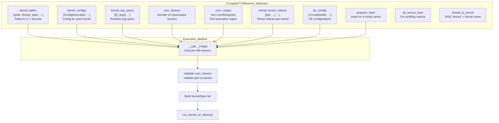

Sources: `[python/ttl/ttl_api.py:333-422]()`
```


A `CompiledTTNNKernel` is a cached, reusable executable created after MLIR compilation completes. It stores all artifacts needed to execute a kernel multiple times with different tensor instances, avoiding recompilation when tensor shapes and configurations match.

**Diagram: CompiledTTNNKernel Structure**

Sources: `<FileRef file-url="https://github.com/tenstorrent/tt-lang/blob/d76e6233/python/ttl/ttl_api.py#L333-L422" min=333 max=422 file-path="python/ttl/ttl_api.py">Hii</FileRef>`

### Stored Artifacts

The `CompiledTTNNKernel` class stores the following artifacts:

| Attribute | Type | Purpose |
| --- | --- | --- |
| `kernel_paths` | `List[(str, str)]` | List of `(path, thread_type)` tuples pointing to generated C++ kernel files in `/tmp/{user}/ttlang_kernel_*.cpp` |
| `kernel_configs` | `List[ConfigDescriptor]` | Configuration descriptors for each kernel (compute/reader/writer configs with `fp32_dest_acc_en`, `dst_full_sync_en`, etc.) |
| `kernel_arg_specs` | `List[List[int]]` | Runtime argument specifications extracted from `ArgSpecAttr` in MLIR |
| `num_tensors` | `int` | Total number of input and output tensors |
| `core_ranges` | `ttnn.CoreRangeSet` | Grid region where kernels execute (built from grid dimensions) |
| `kernel_tensor_indices` | `List[List[int]]` | For each kernel, list of global tensor indices it accesses (used to build `common_runtime_args`) |
| `cb_configs` | `List[CircularBuffer]` | CircularBuffer objects indexed by CB index (includes intermediate CBs not backed by tensors) |
| `program_hash` | `int` | Hash for tt-metal program cache |
| `all_source_lines` | `Dict[str, List[str]]` | Kernel name → source code lines (for auto-profiling reports) |
| `thread_to_kernel` | `Dict[str, str]` | RISC thread name (e.g., "TRISC_0", "NCRISC") → kernel name (for profiling attribution) |

Sources: `<FileRef file-url="https://github.com/tenstorrent/tt-lang/blob/d76e6233/python/ttl/ttl_api.py#L341-L384" min=341 max=384 file-path="python/ttl/ttl_api.py">Hii</FileRef>`

### Execution via **call**

When a `CompiledTTNNKernel` is called with tensor arguments, it:

1.   **Validates tensor count** - ensures the number of tensors matches `num_tensors``<FileRef file-url="https://github.com/tenstorrent/tt-lang/blob/d76e6233/python/ttl/ttl_api.py#L387-L390" min=387 max=390 file-path="python/ttl/ttl_api.py">Hii</FileRef>`.
2.   **Validates grid dimensions** - checks kernel grid fits within device compute grid `<FileRef file-url="https://github.com/tenstorrent/tt-lang/blob/d76e6233/python/ttl/ttl_api.py#L391-L401" min=391 max=401 file-path="python/ttl/ttl_api.py">Hii</FileRef>`.
3.   **Builds KernelSpec objects** - creates a `KernelSpec` for each kernel with its path, thread type, tensor indices, and config `<FileRef file-url="https://github.com/tenstorrent/tt-lang/blob/d76e6233/python/ttl/ttl_api.py#L403-L413" min=403 max=413 file-path="python/ttl/ttl_api.py">Hii</FileRef>`.
4.   **Delegates to run_kernel_on_device** - calls the shared execution logic with kernel specs, tensors, CB configs, and core ranges `<FileRef file-url="https://github.com/tenstorrent/tt-lang/blob/d76e6233/python/ttl/ttl_api.py#L415-L422" min=415 max=422 file-path="python/ttl/ttl_api.py">Hii</FileRef>`.

* * *

## Kernel Execution Pipeline

The execution pipeline transforms compiled artifacts into hardware execution through a series of descriptor building steps in `kernel_runner.py`.

**Diagram: Kernel Execution Flow**

Sources: `<FileRef file-url="https://github.com/tenstorrent/tt-lang/blob/d76e6233/python/ttl/ttl_api.py#L386-L422" min=386 max=422 file-path="python/ttl/ttl_api.py">Hii</FileRef>`, `<FileRef file-url="https://github.com/tenstorrent/tt-lang/blob/d76e6233/python/ttl/kernel_runner.py#L210-L256" min=210 max=256 file-path="python/ttl/kernel_runner.py">Hii</FileRef>`

* * *

## KernelSpec Structure

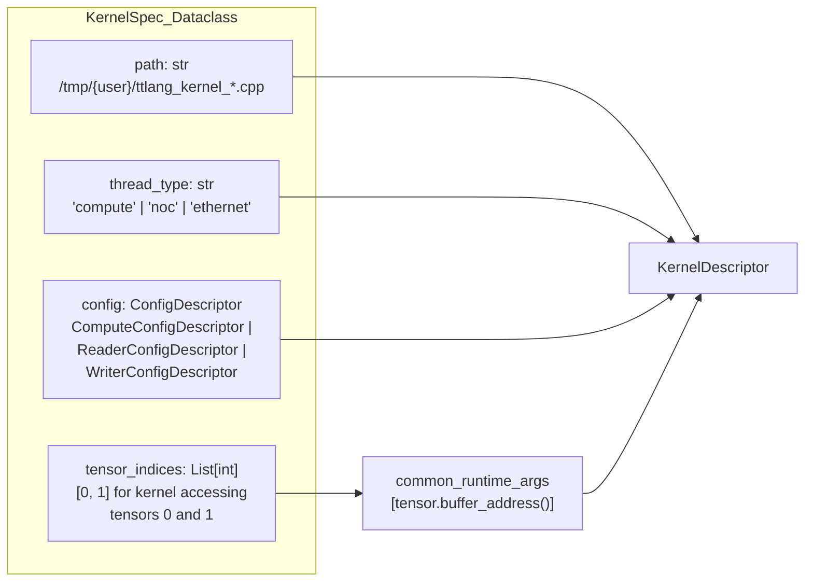

Sources: `[python/ttl/kernel_runner.py:80-97]()`
```


A `KernelSpec` encapsulates all information needed to create a `KernelDescriptor` for a single kernel thread (compute, reader, or writer).

**Diagram: KernelSpec Components**

Sources: `<FileRef file-url="https://github.com/tenstorrent/tt-lang/blob/d76e6233/python/ttl/kernel_runner.py#L80-L97" min=80 max=97 file-path="python/ttl/kernel_runner.py">Hii</FileRef>`

### Example KernelSpec Creation

For a simple add kernel with 3 tensors (lhs, rhs, out) and 3 kernels (reader, writer, compute):

`# Reader kernel accesses tensors 0, 1 (lhs, rhs)reader_spec = KernelSpec(    path="/tmp/user/ttlang_kernel_dm_read_abc123.cpp",    thread_type="noc",    tensor_indices=[0, 1],  # lhs, rhs    config=ttnn.ReaderConfigDescriptor()) # Writer kernel accesses tensor 2 (out)writer_spec = KernelSpec(    path="/tmp/user/ttlang_kernel_dm_write_def456.cpp",    thread_type="noc",    tensor_indices=[2],  # out    config=ttnn.WriterConfigDescriptor()) # Compute kernel accesses no tensors (only CBs)compute_spec = KernelSpec(    path="/tmp/user/ttlang_kernel_add_compute_ghi789.cpp",    thread_type="compute",    tensor_indices=[],  # compute only uses CBs    config=ttnn.ComputeConfigDescriptor(fp32_dest_acc_en=True))`
Sources: `<FileRef file-url="https://github.com/tenstorrent/tt-lang/blob/d76e6233/python/ttl/ttl_api.py#L403-L413" min=403 max=413 file-path="python/ttl/ttl_api.py">Hii</FileRef>`

* * *

## Building Kernel Descriptors

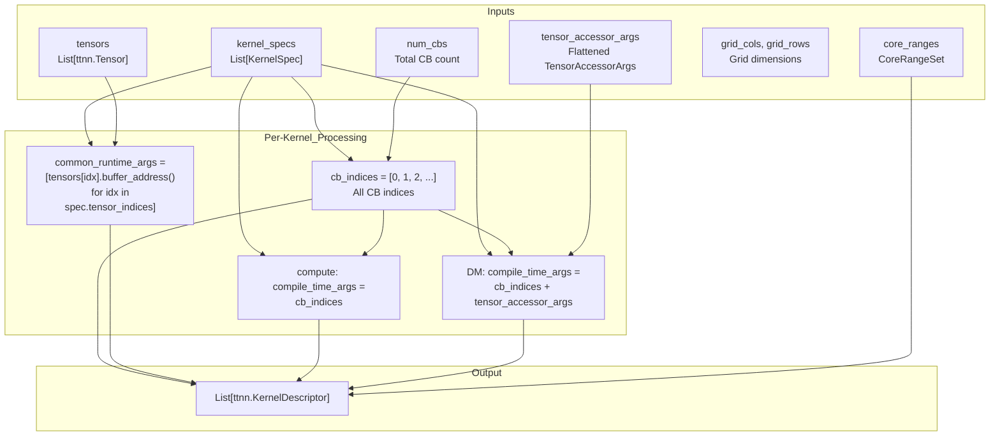

Sources: `[python/ttl/kernel_runner.py:120-178]()`
```


Kernel descriptors specify how each kernel thread executes on the hardware, including compile-time arguments (CB indices, tensor metadata), runtime arguments (buffer addresses), and thread configuration.

**Diagram: KernelDescriptor Construction**

Sources: `<FileRef file-url="https://github.com/tenstorrent/tt-lang/blob/d76e6233/python/ttl/kernel_runner.py#L120-L178" min=120 max=178 file-path="python/ttl/kernel_runner.py">Hii</FileRef>`

### Compile-Time Args vs Runtime Args

Each `KernelDescriptor` has two types of arguments:

| Argument Type | Scope | Content | Access Pattern |
| --- | --- | --- | --- |
| **compile_time_args** | Kernel-wide | CB indices (all kernels), TensorAccessorArgs metadata (DM kernels only) | `get_compile_time_arg_val(N)` in C++ |
| **common_runtime_args** | Kernel-wide | Tensor buffer addresses in function parameter order | Implicitly used by DM kernels |

Sources: `<FileRef file-url="https://github.com/tenstorrent/tt-lang/blob/d76e6233/python/ttl/kernel_runner.py#L158-L175" min=158 max=175 file-path="python/ttl/kernel_runner.py">Hii</FileRef>`

### TensorAccessorArgs Structure

For data movement kernels, `TensorAccessorArgs` encode tensor metadata into compile-time args. Each tensor contributes compile-time args via `ttnn.TensorAccessorArgs(tensor).get_compile_time_args()`.

The `build_tensor_accessor_args` function flattens these for all tensors passed to the operation.

Sources: `<FileRef file-url="https://github.com/tenstorrent/tt-lang/blob/d76e6233/python/ttl/kernel_runner.py#L99-L117" min=99 max=117 file-path="python/ttl/kernel_runner.py">Hii</FileRef>`

* * *

## Building CB Descriptors

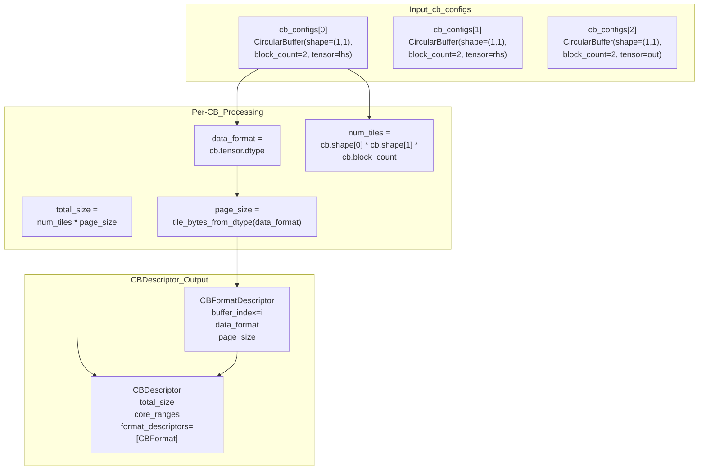

Sources: `[python/ttl/kernel_runner.py:181-207]()`
```


Circular buffer descriptors specify memory allocation for each CB, including buffer index, data format, page size, and total size. The total size is validated against the per-core L1 budget.

**Diagram: CBDescriptor Construction**

Sources: `<FileRef file-url="https://github.com/tenstorrent/tt-lang/blob/d76e6233/python/ttl/kernel_runner.py#L181-L207" min=181 max=207 file-path="python/ttl/kernel_runner.py">Hii</FileRef>`

### CB Size Calculation and Validation

For a single-tile CB with `block_count=2` and `bfloat16` dtype:

`# CB configuration (CircularBuffer)shape = (1, 1)          # 1x1 tilesblock_count = 2         # Double bufferingdtype = ttnn.bfloat16 # Size calculationpage_size = tile_bytes_from_dtype(dtype)  # 32*32*2 bytes = 2048 bytesnum_tiles = 1 * 1 * 2                      # 2 tilestotal_size = 2 * 2048                      # 4096 bytes = 4 KB`
The system validates that the total L1 allocation does not exceed the hardware budget (e.g., `1432 * 1024` bytes for Wormhole/Blackhole).

Sources: `<FileRef file-url="https://github.com/tenstorrent/tt-lang/blob/d76e6233/python/ttl/kernel_runner.py#L206-L242" min=206 max=242 file-path="python/ttl/kernel_runner.py">Hii</FileRef>`, `<FileRef file-url="https://github.com/tenstorrent/tt-lang/blob/d76e6233/python/ttl/constants.py#L16-L16" min=16  file-path="python/ttl/constants.py">Hii</FileRef>`, `<FileRef file-url="https://github.com/tenstorrent/tt-lang/blob/d76e6233/lib/Dialect/TTL/Transforms/TTLValidateCBBudget.cpp#L54-L55" min=54 max=55 file-path="lib/Dialect/TTL/Transforms/TTLValidateCBBudget.cpp">Hii</FileRef>`

* * *

## Program Execution

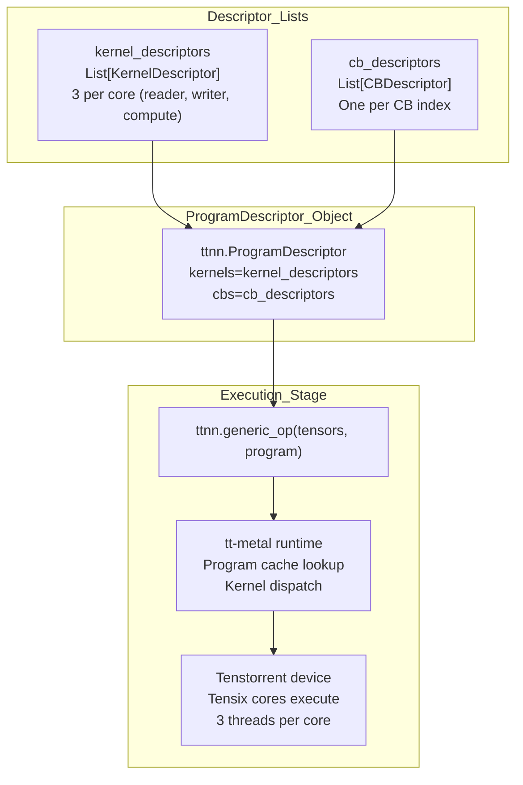

Sources: `[python/ttl/kernel_runner.py:244-255]()`
```


The final step assembles all descriptors into a `ProgramDescriptor` and executes via `ttnn.generic_op`.

**Diagram: ProgramDescriptor and Execution**

Sources: `<FileRef file-url="https://github.com/tenstorrent/tt-lang/blob/d76e6233/python/ttl/kernel_runner.py#L244-L255" min=244 max=255 file-path="python/ttl/kernel_runner.py">Hii</FileRef>`

### ttnn.generic_op Call

The final execution call in `run_kernel_on_device``<FileRef file-url="https://github.com/tenstorrent/tt-lang/blob/d76e6233/python/ttl/kernel_runner.py#L210-L256" min=210 max=256 file-path="python/ttl/kernel_runner.py">Hii</FileRef>`:

`program = ttnn.ProgramDescriptor(    kernels=kernel_descriptors,  # List of KernelDescriptors    cbs=cb_descriptors,          # List of CBDescriptors) result = ttnn.generic_op(    list(tensors),  # Input/output tensors    program         # Program descriptor)`
Sources: `<FileRef file-url="https://github.com/tenstorrent/tt-lang/blob/d76e6233/python/ttl/kernel_runner.py#L244-L255" min=244 max=255 file-path="python/ttl/kernel_runner.py">Hii</FileRef>`

* * *

## Caching System

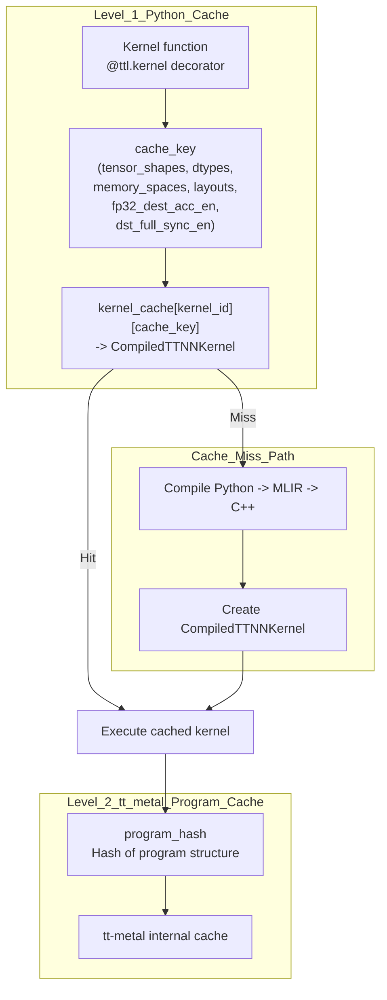

Sources: `[python/ttl/ttl_api.py:131-157]()`
```


tt-lang uses a caching system to avoid recompilation. The `CompiledTTNNKernel` is stored in a Python-level cache.

**Diagram: Caching Architecture**

Sources: `<FileRef file-url="https://github.com/tenstorrent/tt-lang/blob/d76e6233/python/ttl/ttl_api.py#L131-L157" min=131 max=157 file-path="python/ttl/ttl_api.py">Hii</FileRef>`

### Cache Key Generation

The cache key includes tensor properties (shape, dtype, memory space, layout), mesh shape (for multi-device), and compiler options like FP32 destination accumulation.

Sources: `<FileRef file-url="https://github.com/tenstorrent/tt-lang/blob/d76e6233/python/ttl/ttl_api.py#L131-L157" min=131 max=157 file-path="python/ttl/ttl_api.py">Hii</FileRef>`

* * *

## Result Extraction with to_torch

After execution, results are extracted from TTNN tensors back to PyTorch for validation or further processing using `ttnn.to_torch`.

`# Executionadd_kernel(lhs, rhs, out) # Result extractionresult = ttnn.to_torch(out)`
Sources: `<FileRef file-url="https://github.com/tenstorrent/tt-lang/blob/d76e6233/test/python/test_emit_runner.py#L70-L71" min=70 max=71 file-path="test/python/test_emit_runner.py">Hii</FileRef>`

* * *

## Emit Runner Feature

The `TTLANG_EMIT_RUNNER` environment variable allows capturing the execution state (kernel paths, CB configs, tensor indices) into a standalone Python runner file.

This emitted runner can execute the kernel independently of the original DSL definition by providing the list of tensors.

Sources: `<FileRef file-url="https://github.com/tenstorrent/tt-lang/blob/d76e6233/test/python/test_emit_runner.py#L54-L93" min=54 max=93 file-path="test/python/test_emit_runner.py">Hii</FileRef>`, `<FileRef file-url="https://github.com/tenstorrent/tt-lang/blob/d76e6233/python/ttl/kernel_runner.py#L92-L92" min=92  file-path="python/ttl/kernel_runner.py">Hii</FileRef>`

Dismiss
Refresh this wiki

Enter email to refresh


```mermaid
graph TD
    subgraph "Environment_Configuration"
        [VAR_HOME] --> ["TT_LANG_HOME"]
        [VAR_METAL] --> ["TT_METAL_HOME"]
        [VAR_LLVM] --> ["LLVM_INSTALL_DIR"]
        [VAR_PPATH] --> ["PYTHONPATH"]
    end

    subgraph "Code_Entities"
        [C_LLVM] --> ["LLVM/MLIR_Binaries_[LLVM_INSTALL_DIR/bin]"]
        [C_METAL] --> ["tt-metal_Runtime_[TT_METAL_HOME]"]
        [C_PY] --> ["python/_DSL_Source_[TT_LANG_HOME/python]"]
        [C_MLIR_PKG] --> ["python_packages/_Dialect_Bindings_[CMAKE_BINARY_DIR/python_packages]"]
    end

    ["TT_LANG_HOME"] --> [C_PY]
    ["LLVM_INSTALL_DIR"] --> [C_LLVM]
    ["TT_METAL_HOME"] --> [C_METAL]
    ["PYTHONPATH"] --> [C_PY]
    ["PYTHONPATH"] --> [C_MLIR_PKG]
```

### Related: Relationship: Tensor, CircularBuffer, and Block

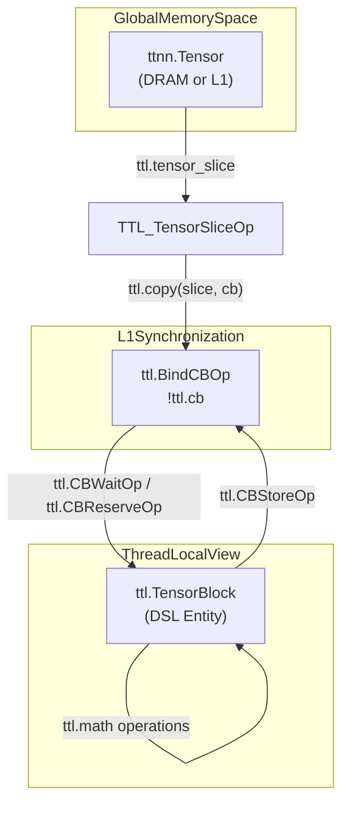

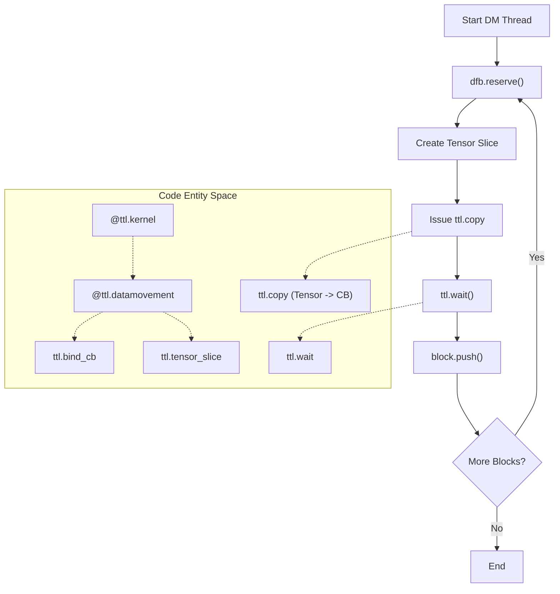

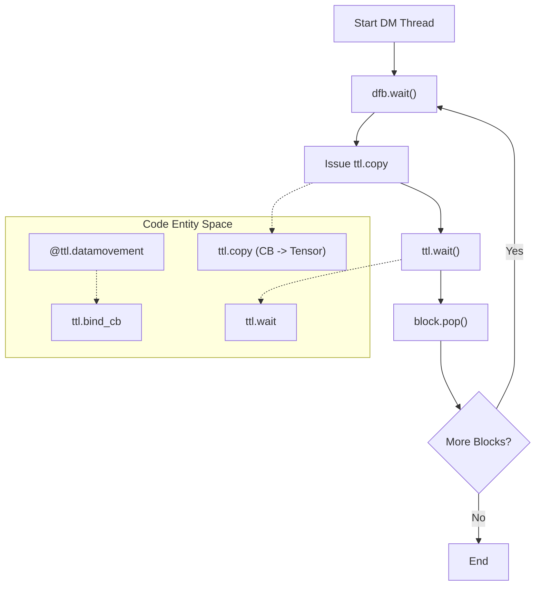

```mermaid
graph TD
    "OperandValue[Value]" --> IsBArg{"Is BlockArgument?"}
    IsBArg -- "Yes" --> "Read cb_index attr from ComputeOp[ComputeOp]"
    "Read cb_index attr from ComputeOp[ComputeOp]" --> "Find BindCBOp[BindCBOp] in Function"
    IsBArg -- "No" --> IsExtract{"Is tensor.extract?"}
    IsExtract -- "Yes" --> "Trace through extract_slice/casts"
    "Trace through extract_slice/casts" --> "getAttachedCB[getAttachedCB] Utility"
    "getAttachedCB[getAttachedCB] Utility" --> "Return ttkernel::CBType[CBType]"
```

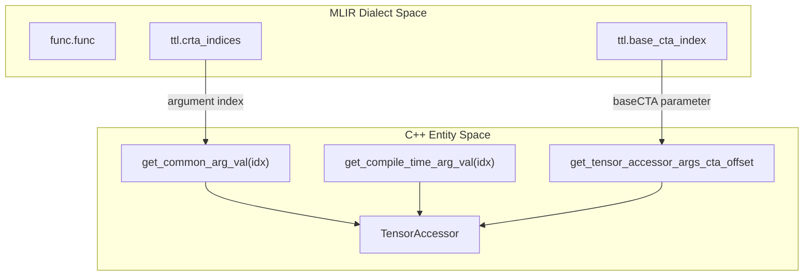

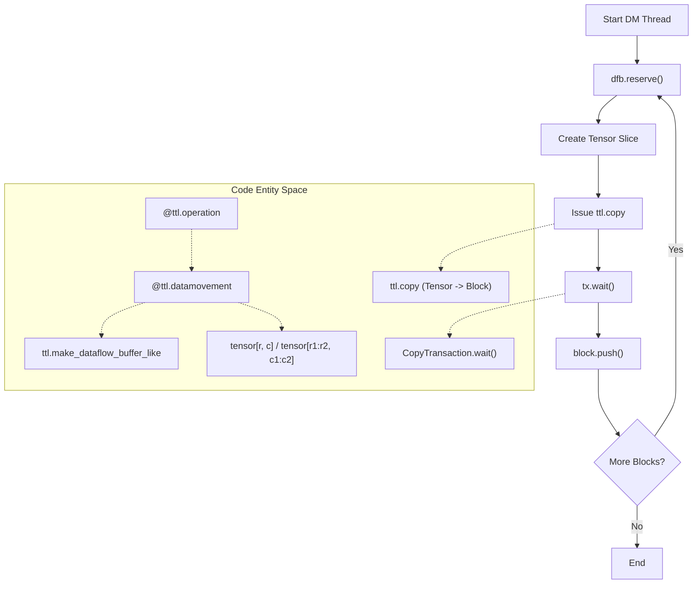

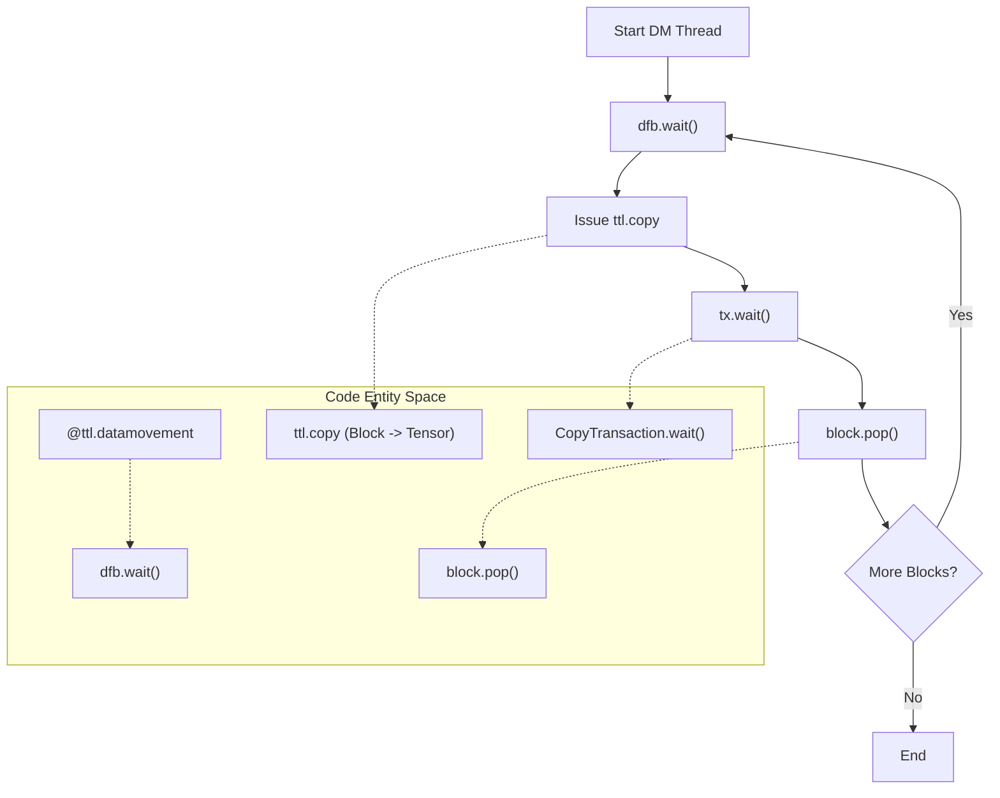

```mermaid
graph LR
    subgraph "DSL_Space"
        ["@ttl.kernel"] --> ["Python_AST"]
    end
    
    subgraph "MLIR_Space"
        ["Python_AST"] -- "TTLGenericCompiler" --> ["TTL_Dialect_Initial_IR"]
        ["TTL_Dialect_Initial_IR"] -- "Transformation_Passes" --> ["TTKernel_Dialect"]
    end
    
    subgraph "Hardware_Space"
        ["TTKernel_Dialect"] -- "EmitC" --> ["kernel_main_C++"]
        ["kernel_main_C++"] -- "Device_Dispatch" --> ["Hardware_/_Simulator"]
    end

    ["TTL_Dialect_Initial_IR"] -. "Verified_by" .-> ["CHECK:_ttl.bind_cb"]
    ["kernel_main_C++"] -. "Verified_by" .-> ["CHECK-CPP:_cb_wait_front"]
```
