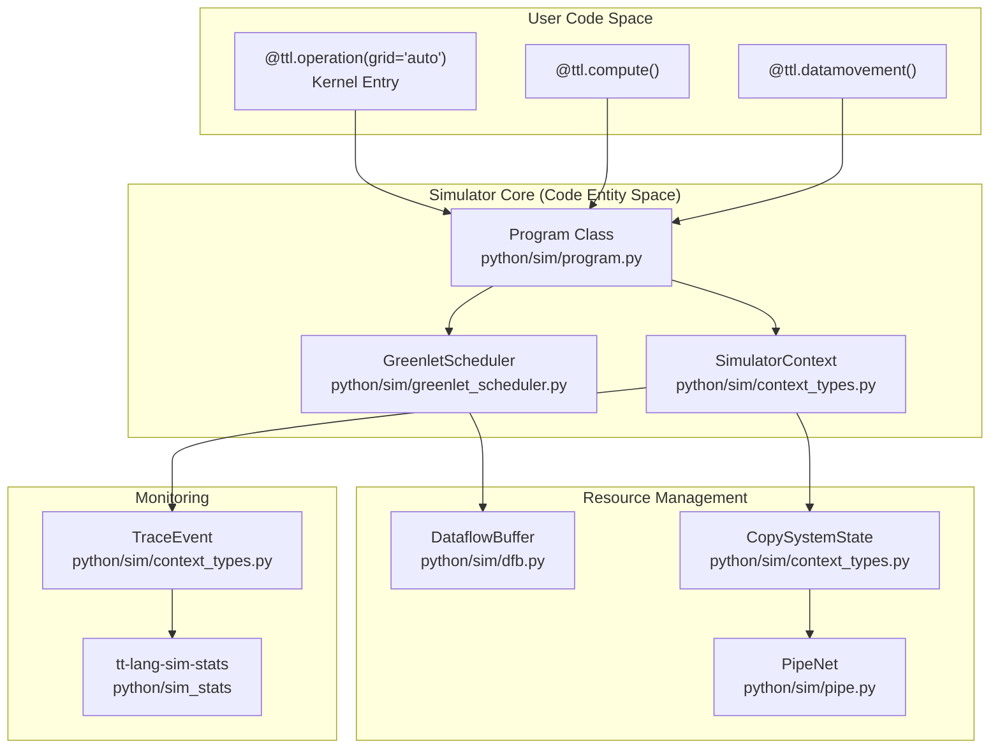
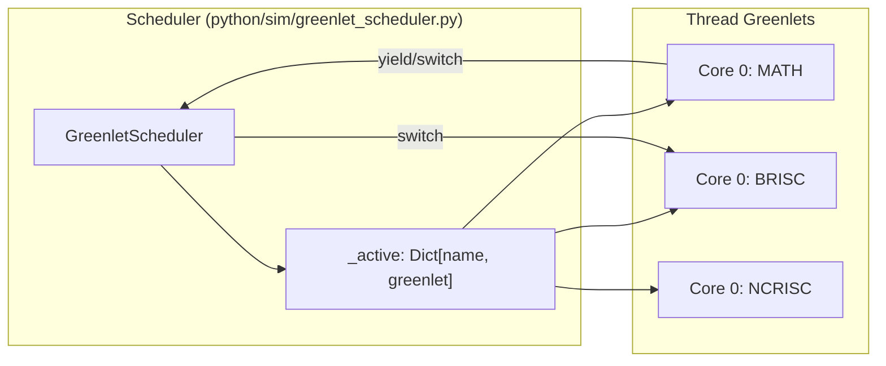

# Simulation Framework

Relevant source files
*   [docs/sphinx/simulator.md](https://github.com/tenstorrent/tt-lang/blob/d76e6233/docs/sphinx/simulator.md?plain=1)
*   [python/sim/__init__.py](https://github.com/tenstorrent/tt-lang/blob/d76e6233/python/sim/__init__.py)
*   [python/sim/copy.py](https://github.com/tenstorrent/tt-lang/blob/d76e6233/python/sim/copy.py)
*   [python/sim/copyhandlers.py](https://github.com/tenstorrent/tt-lang/blob/d76e6233/python/sim/copyhandlers.py)
*   [python/sim/decorators.py](https://github.com/tenstorrent/tt-lang/blob/d76e6233/python/sim/decorators.py)
*   [python/sim/dfb.py](https://github.com/tenstorrent/tt-lang/blob/d76e6233/python/sim/dfb.py)
*   [python/sim/ttlang_sim.py](https://github.com/tenstorrent/tt-lang/blob/d76e6233/python/sim/ttlang_sim.py)
*   [python/sim/ttnnsim.py](https://github.com/tenstorrent/tt-lang/blob/d76e6233/python/sim/ttnnsim.py)
*   [python/sim/typedefs.py](https://github.com/tenstorrent/tt-lang/blob/d76e6233/python/sim/typedefs.py)
*   [test/sim/test_copy.py](https://github.com/tenstorrent/tt-lang/blob/d76e6233/test/sim/test_copy.py)
*   [test/sim/test_examples.py](https://github.com/tenstorrent/tt-lang/blob/d76e6233/test/sim/test_examples.py)
*   [test/sim/test_no_mutable_globals.py](https://github.com/tenstorrent/tt-lang/blob/d76e6233/test/sim/test_no_mutable_globals.py)
*   [test/sim/test_program.py](https://github.com/tenstorrent/tt-lang/blob/d76e6233/test/sim/test_program.py)
*   [test/sim/test_ttlang_sim.py](https://github.com/tenstorrent/tt-lang/blob/d76e6233/test/sim/test_ttlang_sim.py)
*   [test/sim/test_ttnnsim.py](https://github.com/tenstorrent/tt-lang/blob/d76e6233/test/sim/test_ttnnsim.py)

The simulation framework provides a functional software implementation of the tt-lang execution model, enabling kernel development, testing, and validation without Tenstorrent hardware. The simulator implements cooperative multitasking using greenlets, per-core context isolation, comprehensive validation including deadlock detection, and detailed error reporting with source location tracking.

For information about executing kernels on actual hardware via TTNN integration, see [TTNN Integration](https://deepwiki.com/tenstorrent/tt-lang/5-ttnn-integration). For details on the Python DSL and kernel structure, see [Python DSL Fundamentals](https://deepwiki.com/tenstorrent/tt-lang/2.1-python-dsl-fundamentals).

* * *

## Simulation Overview

### Purpose and Scope

The simulator enables hardware-independent development by providing a software implementation of the three-thread execution model (MATH, BRISC, NCRISC), circular buffer semantics, and inter-core communication. It validates kernel correctness through state machine enforcement, deadlock detection, and lifecycle checks before committing to hardware execution [python/sim/ttlang_sim.py 7-13](https://github.com/tenstorrent/tt-lang/blob/d76e6233/python/sim/ttlang_sim.py#L7-L13)

**Key capabilities:**

*   **Functional execution**: Runs kernels defined with `@ttl.kernel` or `@ttl.operation` as pure Python [python/sim/ttlang_sim.py 7-13](https://github.com/tenstorrent/tt-lang/blob/d76e6233/python/sim/ttlang_sim.py#L7-L13)
*   **Multi-core simulation**: Simulates grids of arbitrary size (defaulting to 8x8) with per-core context isolation [test/sim/test_ttlang_sim.py 29-38](https://github.com/tenstorrent/tt-lang/blob/d76e6233/test/sim/test_ttlang_sim.py#L29-L38)
*   **Validation**: Enforces `DataflowBuffer` (DFB) state machine, detects deadlocks, and validates L1 memory limits [docs/sphinx/simulator.md 97-109](https://github.com/tenstorrent/tt-lang/blob/d76e6233/docs/sphinx/simulator.md?plain=1#L97-L109)
*   **Error reporting**: Provides filtered tracebacks showing user code rather than internal simulator frames [python/sim/ttlang_sim.py 155-191](https://github.com/tenstorrent/tt-lang/blob/d76e6233/python/sim/ttlang_sim.py#L155-L191)
*   **Floating Point Promotion**: Narrow types like `bfloat16` and `bfloat8_b` are promoted to `float32` by default for host compatibility [docs/sphinx/simulator.md 59-74](https://github.com/tenstorrent/tt-lang/blob/d76e6233/docs/sphinx/simulator.md?plain=1#L59-L74)

Sources: [python/sim/ttlang_sim.py 7-38](https://github.com/tenstorrent/tt-lang/blob/d76e6233/python/sim/ttlang_sim.py#L7-L38)[docs/sphinx/simulator.md 59-109](https://github.com/tenstorrent/tt-lang/blob/d76e6233/docs/sphinx/simulator.md?plain=1#L59-L109)[test/sim/test_ttlang_sim.py 29-38](https://github.com/tenstorrent/tt-lang/blob/d76e6233/test/sim/test_ttlang_sim.py#L29-L38)

### ttlang-sim CLI

The `tt-lang-sim` command-line tool executes kernel scripts by shadowing standard `ttl` and `ttnn` imports with simulator-specific versions [python/sim/ttlang_sim.py 30-42](https://github.com/tenstorrent/tt-lang/blob/d76e6233/python/sim/ttlang_sim.py#L30-L42)

`# Basic usagett-lang-sim examples/eltwise_add.py # With custom grid size and tracingtt-lang-sim examples/single_node_matmul.py --grid 4,4 --trace trace.jsonl`
**Statistics and Tracing:** The simulator generates traces that can be analyzed with `tt-lang-sim-stats` to view performance summaries, L1 usage, and NOC traffic [docs/sphinx/simulator.md 115-130](https://github.com/tenstorrent/tt-lang/blob/d76e6233/docs/sphinx/simulator.md?plain=1#L115-L130)

Sources: [python/sim/ttlang_sim.py 10-42](https://github.com/tenstorrent/tt-lang/blob/d76e6233/python/sim/ttlang_sim.py#L10-L42)[docs/sphinx/simulator.md 115-130](https://github.com/tenstorrent/tt-lang/blob/d76e6233/docs/sphinx/simulator.md?plain=1#L115-L130)

* * *

## Architecture Overview

The simulation framework consists of components that work together to provide a complete execution environment:

**Architecture Components**

Sources: [python/sim/ttlang_sim.py 30-42](https://github.com/tenstorrent/tt-lang/blob/d76e6233/python/sim/ttlang_sim.py#L30-L42)[python/sim/program.py 23-25](https://github.com/tenstorrent/tt-lang/blob/d76e6233/python/sim/program.py#L23-L25)[python/sim/pipe.py 22-23](https://github.com/tenstorrent/tt-lang/blob/d76e6233/python/sim/pipe.py#L22-L23)

* * *




Sources: [python/sim/ttlang_sim.py:30-42](), [python/sim/program.py:23-25](), [python/sim/pipe.py:22-23]()

---
```
## Program Execution Model

### Program Class and Thread Registration

The `Program` class (in `python/sim/program.py`) manages the lifecycle of a kernel execution across a grid [python/sim/program.py 23-25](https://github.com/tenstorrent/tt-lang/blob/d76e6233/python/sim/program.py#L23-L25) It captures the kernel's execution context and ensures that per-core resources are correctly initialized.

### Per-Core Context Building

Each core in the simulation grid receives an isolated context. This ensures that cores cannot interfere with each other's local L1 state (Circular Buffers) while allowing them to interact via shared Tensors or PipeNets.

**Context Isolation Strategy**

| Object Type | Per-Core Behavior | Rationale |
| --- | --- | --- |
| `DataflowBuffer` | Fresh instance | Independent circular buffer state per core [python/sim/dfb.py 10-11](https://github.com/tenstorrent/tt-lang/blob/d76e6233/python/sim/dfb.py#L10-L11) |
| `Tensor` | Shared reference | Shared access to DRAM/L1 sharded inputs/outputs [python/sim/ttnnsim.py 5-18](https://github.com/tenstorrent/tt-lang/blob/d76e6233/python/sim/ttnnsim.py#L5-L18) |
| `PipeNet` | Shared reference | Coordination for inter-core communication [python/sim/pipe.py 22-23](https://github.com/tenstorrent/tt-lang/blob/d76e6233/python/sim/pipe.py#L22-L23) |

Sources: [python/sim/program.py 5-12](https://github.com/tenstorrent/tt-lang/blob/d76e6233/python/sim/program.py#L5-L12)[python/sim/dfb.py 10-11](https://github.com/tenstorrent/tt-lang/blob/d76e6233/python/sim/dfb.py#L10-L11)[docs/sphinx/simulator.md 97-106](https://github.com/tenstorrent/tt-lang/blob/d76e6233/docs/sphinx/simulator.md?plain=1#L97-L106)

### Cooperative Execution Model

The simulator uses cooperative multitasking. Threads run until they encounter a blocking operation (like `wait()` on a buffer), at which point they yield to the scheduler.

For details, see [Program Execution Model](https://deepwiki.com/tenstorrent/tt-lang/6.2-program-execution-model).

* * *

## Cooperative Scheduling with Greenlets

The `GreenletScheduler` manages the execution of MATH, BRISC, and NCRISC threads. By using greenlets, the simulator provides deterministic execution that helps surface race conditions and deadlocks.

**Scheduling Entity Map**

For details, see [Cooperative Scheduling with Greenlets](https://deepwiki.com/tenstorrent/tt-lang/6.3-cooperative-scheduling-with-greenlets).

Sources: [python/sim/greenlet_scheduler.py 1-28](https://github.com/tenstorrent/tt-lang/blob/d76e6233/python/sim/greenlet_scheduler.py#L1-L28)[python/sim/ttlang_sim.py 27-28](https://github.com/tenstorrent/tt-lang/blob/d76e6233/python/sim/ttlang_sim.py#L27-L28)

* * *




For details, see [Cooperative Scheduling with Greenlets](#6.3).

Sources: [python/sim/greenlet_scheduler.py:1-28](), [python/sim/ttlang_sim.py:27-28]()

---
```
## CircularBuffer Simulation

`DataflowBuffer` (DFB) simulates hardware circular buffers. The simulator tracks DFB occupancy and enforces hardware limits, such as the total L1 capacity used per core [docs/sphinx/simulator.md 97-106](https://github.com/tenstorrent/tt-lang/blob/d76e6233/docs/sphinx/simulator.md?plain=1#L97-L106)

**Key operations:**

*   `reserve()`: Blocks if the DFB does not have enough free space [python/sim/dfb.py 172-173](https://github.com/tenstorrent/tt-lang/blob/d76e6233/python/sim/dfb.py#L172-L173)
*   `wait()`: Blocks if the DFB does not have enough valid data [python/sim/dfb.py 174-175](https://github.com/tenstorrent/tt-lang/blob/d76e6233/python/sim/dfb.py#L174-L175)
*   `push()` / `pop()`: Update occupancy and transition the buffer state machine [python/sim/dfb.py 190-200](https://github.com/tenstorrent/tt-lang/blob/d76e6233/python/sim/dfb.py#L190-L200)

For details, see [CircularBuffer Simulation](https://deepwiki.com/tenstorrent/tt-lang/6.4-circularbuffer-simulation).

Sources: [python/sim/dfb.py 65-76](https://github.com/tenstorrent/tt-lang/blob/d76e6233/python/sim/dfb.py#L65-L76)[docs/sphinx/simulator.md 97-109](https://github.com/tenstorrent/tt-lang/blob/d76e6233/docs/sphinx/simulator.md?plain=1#L97-L109)

* * *

## Copy Handlers and Data Transfer

The simulator handles data movement through a registry of copy handlers [python/sim/copyhandlers.py 5-9](https://github.com/tenstorrent/tt-lang/blob/d76e6233/python/sim/copyhandlers.py#L5-L9) This system supports transfers between Tensors, Blocks (DFB views), and Pipes.

**Supported Transfers:**

*   **Unicast**: Point-to-point transfer between a source and a single destination.
*   **Multicast**: Transfer from one source to a contiguous range of destination cores [python/sim/copyhandlers.py 180-192](https://github.com/tenstorrent/tt-lang/blob/d76e6233/python/sim/copyhandlers.py#L180-L192)
*   **Registry-based Handlers**: The `HANDLER_REGISTRY` maps `(src_type, dst_type)` pairs to specific logic like `TensorToBlockHandler`[python/sim/copyhandlers.py 123-125](https://github.com/tenstorrent/tt-lang/blob/d76e6233/python/sim/copyhandlers.py#L123-L125)

For details, see [Copy Handlers and Data Transfer](https://deepwiki.com/tenstorrent/tt-lang/6.5-copy-handlers-and-data-transfer).

Sources: [python/sim/copyhandlers.py 5-23](https://github.com/tenstorrent/tt-lang/blob/d76e6233/python/sim/copyhandlers.py#L5-L23)[python/sim/copy.py 60-71](https://github.com/tenstorrent/tt-lang/blob/d76e6233/python/sim/copy.py#L60-L71)

* * *

## Validation and Deadlock Detection

The simulator provides extensive validation to catch common programming errors:

*   **Deadlock Detection**: Detects when all threads are blocked on circular buffer or pipe operations [test/sim/test_program.py 10-11](https://github.com/tenstorrent/tt-lang/blob/d76e6233/test/sim/test_program.py#L10-L11)
*   **State Machine Enforcement**: The `BlockStateMachine` validates that blocks are correctly reserved before writing and waited on before reading [python/sim/dfb.py 69-76](https://github.com/tenstorrent/tt-lang/blob/d76e6233/python/sim/dfb.py#L69-L76)
*   **Resource Limits**: Issues warnings if the total DFB capacity exceeds the hardware L1 memory limit [docs/sphinx/simulator.md 100-109](https://github.com/tenstorrent/tt-lang/blob/d76e6233/docs/sphinx/simulator.md?plain=1#L100-L109)
*   **Copy Locality**: Tracks and reports data locality (local L1 vs remote L1 vs DRAM) during simulation [python/sim/copy.py 26-31](https://github.com/tenstorrent/tt-lang/blob/d76e6233/python/sim/copy.py#L26-L31)

For details, see [Validation and Deadlock Detection](https://deepwiki.com/tenstorrent/tt-lang/6.6-validation-and-deadlock-detection).

Sources: [python/sim/dfb.py 32-40](https://github.com/tenstorrent/tt-lang/blob/d76e6233/python/sim/dfb.py#L32-L40)[docs/sphinx/simulator.md 97-109](https://github.com/tenstorrent/tt-lang/blob/d76e6233/docs/sphinx/simulator.md?plain=1#L97-L109)[python/sim/copy.py 26-57](https://github.com/tenstorrent/tt-lang/blob/d76e6233/python/sim/copy.py#L26-L57)

Dismiss
Refresh this wiki

Enter email to refresh
