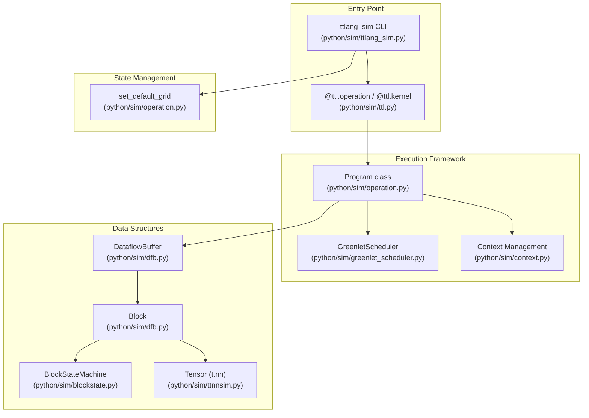
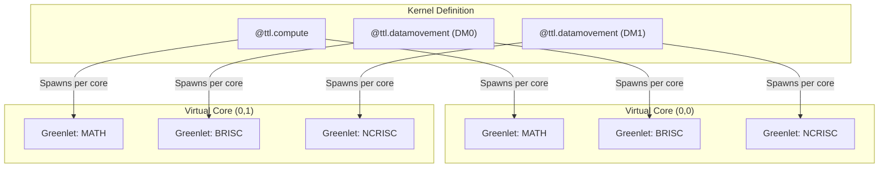

# Simulation Overview

Relevant source files
*   [.github/scripts/probe-docker-image.sh](https://github.com/tenstorrent/tt-lang/blob/d76e6233/.github/scripts/probe-docker-image.sh)
*   [.github/scripts/tests/test_probe_docker_image.bats](https://github.com/tenstorrent/tt-lang/blob/d76e6233/.github/scripts/tests/test_probe_docker_image.bats)
*   [.github/workflows/publish-s3-pypi.yml](https://github.com/tenstorrent/tt-lang/blob/d76e6233/.github/workflows/publish-s3-pypi.yml)
*   [.gitignore](https://github.com/tenstorrent/tt-lang/blob/d76e6233/.gitignore)
*   [README.md](https://github.com/tenstorrent/tt-lang/blob/d76e6233/README.md?plain=1)
*   [docs/sphinx/getting-started.md](https://github.com/tenstorrent/tt-lang/blob/d76e6233/docs/sphinx/getting-started.md?plain=1)
*   [docs/sphinx/simulator.md](https://github.com/tenstorrent/tt-lang/blob/d76e6233/docs/sphinx/simulator.md?plain=1)
*   [python/CMakeLists.txt](https://github.com/tenstorrent/tt-lang/blob/d76e6233/python/CMakeLists.txt)
*   [python/sim/dfb.py](https://github.com/tenstorrent/tt-lang/blob/d76e6233/python/sim/dfb.py)
*   [python/sim/ttlang_sim.py](https://github.com/tenstorrent/tt-lang/blob/d76e6233/python/sim/ttlang_sim.py)
*   [python/sim/ttnnsim.py](https://github.com/tenstorrent/tt-lang/blob/d76e6233/python/sim/ttnnsim.py)
*   [test/sim/test_examples.py](https://github.com/tenstorrent/tt-lang/blob/d76e6233/test/sim/test_examples.py)
*   [test/sim/test_no_mutable_globals.py](https://github.com/tenstorrent/tt-lang/blob/d76e6233/test/sim/test_no_mutable_globals.py)
*   [test/sim/test_ttlang_sim.py](https://github.com/tenstorrent/tt-lang/blob/d76e6233/test/sim/test_ttlang_sim.py)
*   [test/sim/test_ttnnsim.py](https://github.com/tenstorrent/tt-lang/blob/d76e6233/test/sim/test_ttnnsim.py)

## Purpose and Scope

The simulation framework provides a **functional simulator** for tt-lang kernels that executes programs as pure Python, without requiring Tenstorrent hardware or the full compiler stack [README.md 20-21](https://github.com/tenstorrent/tt-lang/blob/d76e6233/README.md?plain=1#L20-L21) The simulator implements the same kernel execution semantics as hardware but uses Python-based cooperative scheduling instead of real RISC cores. This enables rapid iteration, debugging, and validation during kernel development.

The simulator is designed to be a "middle ground" where developers can catch errors and logic issues in their IDE rather than on hardware [README.md 35](https://github.com/tenstorrent/tt-lang/blob/d76e6233/README.md?plain=1#L35-L35) It allows running kernels written for the compiler on the simulator backend without requiring any code changes to the kernel files by shadowing compiler APIs with simulator-specific implementations [python/sim/ttlang_sim.py 7-8](https://github.com/tenstorrent/tt-lang/blob/d76e6233/python/sim/ttlang_sim.py#L7-L8)[python/sim/ttlang_sim.py 30-42](https://github.com/tenstorrent/tt-lang/blob/d76e6233/python/sim/ttlang_sim.py#L30-L42)

This page covers the high-level architecture, usage, and capabilities of the simulator. For detailed information on specific subsystems:

*   Program execution mechanics: see [6.2](https://github.com/tenstorrent/tt-lang/blob/d76e6233/6.2)
*   Greenlet-based scheduling: see [6.3](https://github.com/tenstorrent/tt-lang/blob/d76e6233/6.3)
*   Circular buffer implementation: see [6.4](https://github.com/tenstorrent/tt-lang/blob/d76e6233/6.4)
*   Copy and data transfer: see [6.5](https://github.com/tenstorrent/tt-lang/blob/d76e6233/6.5)
*   Validation and deadlock detection: see [6.6](https://github.com/tenstorrent/tt-lang/blob/d76e6233/6.6)

Sources: [README.md 20-40](https://github.com/tenstorrent/tt-lang/blob/d76e6233/README.md?plain=1#L20-L40)[python/sim/ttlang_sim.py 4-18](https://github.com/tenstorrent/tt-lang/blob/d76e6233/python/sim/ttlang_sim.py#L4-L18)[docs/sphinx/simulator.md 1-5](https://github.com/tenstorrent/tt-lang/blob/d76e6233/docs/sphinx/simulator.md?plain=1#L1-L5)

* * *

## When to Use the Simulator

The simulator is the **primary development tool** for tt-lang kernels. Use it for:

| Use Case | Simulator | Hardware |
| --- | --- | --- |
| **Initial development** | ✓ Fast iteration, no hardware required | ✗ Slow compile-run cycle |
| **Debugging logic errors** | ✓ Python debugger support (pdb, VSCode) | ✗ Limited debugging tools |
| **Validating correctness** | ✓ Deadlock detection, DFB validation | ✗ Hangs may require hard reset |
| **Testing edge cases** | ✓ Easily modify test data | ✗ Requires device access |
| **Performance tuning** | ✗ Functional simulation only | ✓ Real profiling data |
| **Final validation** | ✗ Functional match only | ✓ Ground truth |

**Recommended workflow:**

1.   Develop and test kernels using the functional simulator via `tt-lang-sim`[docs/sphinx/simulator.md 125-130](https://github.com/tenstorrent/tt-lang/blob/d76e6233/docs/sphinx/simulator.md?plain=1#L125-L130)
2.   Debug issues using filtered tracebacks that omit internal simulator frames [python/sim/ttlang_sim.py 156-191](https://github.com/tenstorrent/tt-lang/blob/d76e6233/python/sim/ttlang_sim.py#L156-L191)
3.   Record traces with `--trace` and analyze statistics using `tt-lang-sim-stats`[python/sim/ttlang_sim.py 12-13](https://github.com/tenstorrent/tt-lang/blob/d76e6233/python/sim/ttlang_sim.py#L12-L13)[docs/sphinx/simulator.md 115-130](https://github.com/tenstorrent/tt-lang/blob/d76e6233/docs/sphinx/simulator.md?plain=1#L115-L130)
4.   Move to hardware for performance measurement and final validation.

Sources: [python/sim/ttlang_sim.py 156-191](https://github.com/tenstorrent/tt-lang/blob/d76e6233/python/sim/ttlang_sim.py#L156-L191)[docs/sphinx/simulator.md 115-130](https://github.com/tenstorrent/tt-lang/blob/d76e6233/docs/sphinx/simulator.md?plain=1#L115-L130)

* * *

## Simulator Architecture

The simulator consists of subsystems that work together to provide functional execution by shadowing the compiler APIs with simulator-specific implementations [python/sim/ttlang_sim.py 30-42](https://github.com/tenstorrent/tt-lang/blob/d76e6233/python/sim/ttlang_sim.py#L30-L42)

### Component Mapping

The following diagram bridges the high-level simulator concepts to the specific Python entities in the codebase.

Title: Simulator Code Entity Map

Sources: [python/sim/ttlang_sim.py 25-42](https://github.com/tenstorrent/tt-lang/blob/d76e6233/python/sim/ttlang_sim.py#L25-L42)[python/sim/operation.py 26-27](https://github.com/tenstorrent/tt-lang/blob/d76e6233/python/sim/operation.py#L26-L27)[python/sim/dfb.py 65-76](https://github.com/tenstorrent/tt-lang/blob/d76e6233/python/sim/dfb.py#L65-L76)[python/sim/ttnnsim.py 112-125](https://github.com/tenstorrent/tt-lang/blob/d76e6233/python/sim/ttnnsim.py#L112-L125)

* * *



Sources: [python/sim/ttlang_sim.py:25-42](), [python/sim/operation.py:26-27](), [python/sim/dfb.py:65-76](), [python/sim/ttnnsim.py:112-125]()

---
```
## Running the Simulator

### Command Line Interface (`tt-lang-sim`)

The simulator provides a CLI wrapper to run kernel scripts without code changes [python/sim/ttlang_sim.py 5-13](https://github.com/tenstorrent/tt-lang/blob/d76e6233/python/sim/ttlang_sim.py#L5-L13)

`# Activate the environmentsource build/env/activate # Run a kernel scripttt-lang-sim examples/eltwise_add.py # Run with specific grid size for 'full' grid kernelstt-lang-sim examples/single_node_matmul.py --grid 4,4 # Record a trace for analysistt-lang-sim examples/eltwise_add.py --trace my_run.jsonl`
**CLI Features:**

*   **Grid Configuration**: Sets the default grid size for kernels using `grid='full'` or `grid='auto'` via `set_default_grid`[python/sim/ttlang_sim.py 26](https://github.com/tenstorrent/tt-lang/blob/d76e6233/python/sim/ttlang_sim.py#L26-L26)[test/sim/test_ttlang_sim.py 53-55](https://github.com/tenstorrent/tt-lang/blob/d76e6233/test/sim/test_ttlang_sim.py#L53-L55)
*   **Scheduler Control**: Configures the scheduling policy (e.g., `fair` vs `greedy`) [python/sim/ttlang_sim.py 27](https://github.com/tenstorrent/tt-lang/blob/d76e6233/python/sim/ttlang_sim.py#L27-L27)[test/sim/test_examples.py 91](https://github.com/tenstorrent/tt-lang/blob/d76e6233/test/sim/test_examples.py#L91-L91)
*   **Trace Generation**: Produces a JSON Lines file containing events serialised via `_write_jsonl_trace`[python/sim/ttlang_sim.py 202-212](https://github.com/tenstorrent/tt-lang/blob/d76e6233/python/sim/ttlang_sim.py#L202-L212)[docs/sphinx/simulator.md 145-150](https://github.com/tenstorrent/tt-lang/blob/d76e6233/docs/sphinx/simulator.md?plain=1#L145-L150)
*   **Filtered Tracebacks**: The `_print_filtered_traceback` function omits internal simulator implementation paths under `python/sim/`[python/sim/ttlang_sim.py 156-191](https://github.com/tenstorrent/tt-lang/blob/d76e6233/python/sim/ttlang_sim.py#L156-L191)

Sources: [python/sim/ttlang_sim.py 1-18](https://github.com/tenstorrent/tt-lang/blob/d76e6233/python/sim/ttlang_sim.py#L1-L18)[python/sim/ttlang_sim.py 156-191](https://github.com/tenstorrent/tt-lang/blob/d76e6233/python/sim/ttlang_sim.py#L156-L191)[docs/sphinx/simulator.md 115-154](https://github.com/tenstorrent/tt-lang/blob/d76e6233/docs/sphinx/simulator.md?plain=1#L115-L154)[test/sim/test_ttlang_sim.py 122-124](https://github.com/tenstorrent/tt-lang/blob/d76e6233/test/sim/test_ttlang_sim.py#L122-L124)

### Programmatic Usage

The simulator is activated by calling `setup_simulator_imports()`, which injects simulator implementations into `sys.modules` to shadow the compiler APIs [python/sim/ttlang_sim.py 30-42](https://github.com/tenstorrent/tt-lang/blob/d76e6233/python/sim/ttlang_sim.py#L30-L42) This allows kernel code written for the compiler to transparently use simulator implementations.

* * *

## Execution Model

### Multi-Core Simulation

To simulate multi-core execution, the simulator instantiates the kernel across a grid of virtual cores. When `grid='full'` is used, the simulator defaults to an 8x8 grid unless overridden [test/sim/test_ttlang_sim.py 29-38](https://github.com/tenstorrent/tt-lang/blob/d76e6233/test/sim/test_ttlang_sim.py#L29-L38)[test/sim/test_ttlang_sim.py 186-188](https://github.com/tenstorrent/tt-lang/blob/d76e6233/test/sim/test_ttlang_sim.py#L186-L188)

Title: Multi-Core Thread Mapping

**Key Execution Rules:**

1.   **Thread Concurrency**: Each core runs three threads (MATH, BRISC, NCRISC) implemented as cooperative greenlets [python/sim/dfb.py 41](https://github.com/tenstorrent/tt-lang/blob/d76e6233/python/sim/dfb.py#L41-L41)
2.   **Memory Accounting**: The simulator tracks total `DataflowBuffer` capacity per core using the `capacity_bytes` property [test/sim/test_ttnnsim.py 89-90](https://github.com/tenstorrent/tt-lang/blob/d76e6233/test/sim/test_ttnnsim.py#L89-L90) If it exceeds the hardware L1 limit, a warning is issued [docs/sphinx/simulator.md 100-106](https://github.com/tenstorrent/tt-lang/blob/d76e6233/docs/sphinx/simulator.md?plain=1#L100-L106)
3.   **Float32 Promotion**: By default, narrow types like `bfloat16` or `bfloat8_b` are promoted to `float32` for host execution [docs/sphinx/simulator.md 59-81](https://github.com/tenstorrent/tt-lang/blob/d76e6233/docs/sphinx/simulator.md?plain=1#L59-L81) This can be toggled via `ttnn.set_disable_float32_promotion()`[python/sim/ttnnsim.py 128-131](https://github.com/tenstorrent/tt-lang/blob/d76e6233/python/sim/ttnnsim.py#L128-L131)

Sources: [test/sim/test_ttlang_sim.py 53-85](https://github.com/tenstorrent/tt-lang/blob/d76e6233/test/sim/test_ttlang_sim.py#L53-L85)[docs/sphinx/simulator.md 59-106](https://github.com/tenstorrent/tt-lang/blob/d76e6233/docs/sphinx/simulator.md?plain=1#L59-L106)[python/sim/ttnnsim.py 128-131](https://github.com/tenstorrent/tt-lang/blob/d76e6233/python/sim/ttnnsim.py#L128-L131)

* * *




**Key Execution Rules:**
1. **Thread Concurrency**: Each core runs three threads (MATH, BRISC, NCRISC) implemented as cooperative greenlets [python/sim/dfb.py:41]().
2. **Memory Accounting**: The simulator tracks total `DataflowBuffer` capacity per core using the `capacity_bytes` property [test/sim/test_ttnnsim.py:89-90](). If it exceeds the hardware L1 limit, a warning is issued [docs/sphinx/simulator.md:100-106]().
3. **Float32 Promotion**: By default, narrow types like `bfloat16` or `bfloat8_b` are promoted to `float32` for host execution [docs/sphinx/simulator.md:59-81](). This can be toggled via `ttnn.set_disable_float32_promotion()` [python/sim/ttnnsim.py:128-131]().

Sources: [test/sim/test_ttlang_sim.py:53-85](), [docs/sphinx/simulator.md:59-106](), [python/sim/ttnnsim.py:128-131]()

---
```
## Validation and Error Reporting

The simulator includes several validation features to assist developers:

1.   **Deadlock Detection**: The simulator detects when all greenlets are blocked, reporting the state of the kernels.
2.   **State Machine Enforcement**: The `BlockStateMachine` in `blockstate.py` enforces valid sequences of operations (e.g., `reserve` ->`push`) [python/sim/dfb.py 124-129](https://github.com/tenstorrent/tt-lang/blob/d76e6233/python/sim/dfb.py#L124-L129)
3.   **L1 Budget Tracking**: It warns when the total buffer capacity for a core exceeds the L1 limit, accounted using declared dtypes [docs/sphinx/simulator.md 100-106](https://github.com/tenstorrent/tt-lang/blob/d76e6233/docs/sphinx/simulator.md?plain=1#L100-L106)
4.   **Mutable Global Check**: A dedicated test `test_no_mutable_globals.py` ensures that simulator modules store mutable state in greenlet-local context rather than module-level variables to prevent cross-test contamination [test/sim/test_no_mutable_globals.py 7-9](https://github.com/tenstorrent/tt-lang/blob/d76e6233/test/sim/test_no_mutable_globals.py#L7-L9)

Sources: [python/sim/dfb.py 124-129](https://github.com/tenstorrent/tt-lang/blob/d76e6233/python/sim/dfb.py#L124-L129)[docs/sphinx/simulator.md 100-106](https://github.com/tenstorrent/tt-lang/blob/d76e6233/docs/sphinx/simulator.md?plain=1#L100-L106)[test/sim/test_no_mutable_globals.py 7-16](https://github.com/tenstorrent/tt-lang/blob/d76e6233/test/sim/test_no_mutable_globals.py#L7-L16)

Dismiss
Refresh this wiki

Enter email to refresh
