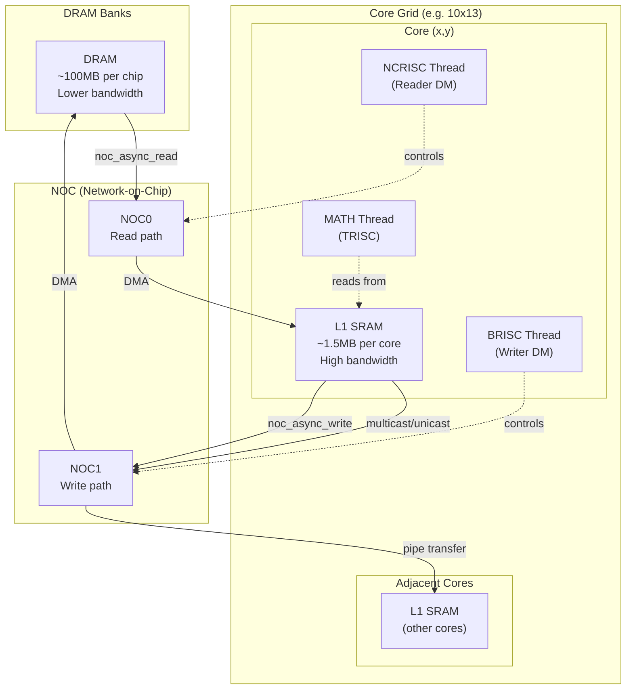
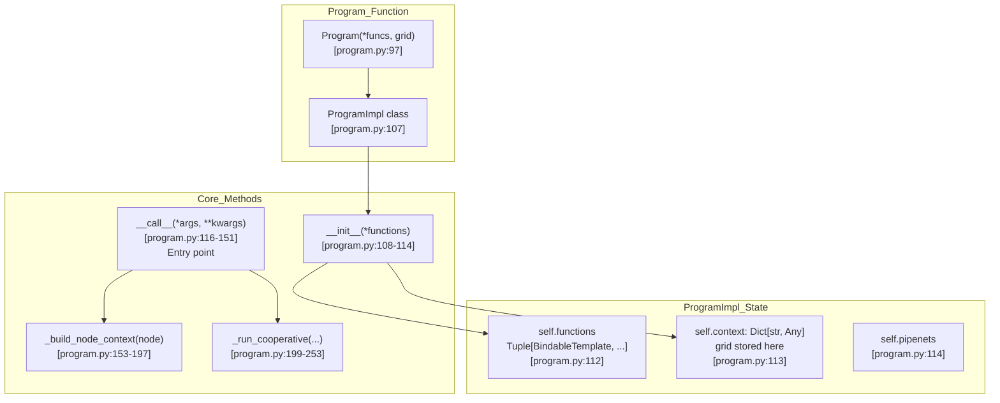
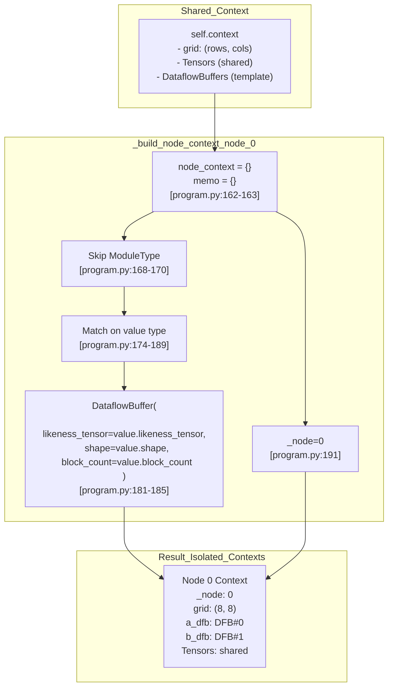
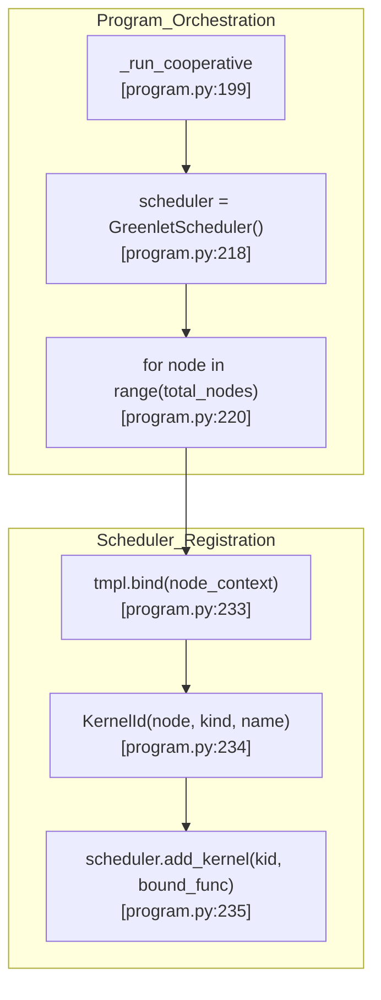

# Program Execution Model

Relevant source files
*   [python/sim/__init__.py](https://github.com/tenstorrent/tt-lang/blob/d76e6233/python/sim/__init__.py)
*   [python/sim/copy.py](https://github.com/tenstorrent/tt-lang/blob/d76e6233/python/sim/copy.py)
*   [python/sim/copyhandlers.py](https://github.com/tenstorrent/tt-lang/blob/d76e6233/python/sim/copyhandlers.py)
*   [python/sim/decorators.py](https://github.com/tenstorrent/tt-lang/blob/d76e6233/python/sim/decorators.py)
*   [python/sim/diagnostics.py](https://github.com/tenstorrent/tt-lang/blob/d76e6233/python/sim/diagnostics.py)
*   [python/sim/greenlet_scheduler.py](https://github.com/tenstorrent/tt-lang/blob/d76e6233/python/sim/greenlet_scheduler.py)
*   [python/sim/program.py](https://github.com/tenstorrent/tt-lang/blob/d76e6233/python/sim/program.py)
*   [python/sim/trace.py](https://github.com/tenstorrent/tt-lang/blob/d76e6233/python/sim/trace.py)
*   [python/sim/typedefs.py](https://github.com/tenstorrent/tt-lang/blob/d76e6233/python/sim/typedefs.py)
*   [test/sim/conftest.py](https://github.com/tenstorrent/tt-lang/blob/d76e6233/test/sim/conftest.py)
*   [test/sim/test_copy.py](https://github.com/tenstorrent/tt-lang/blob/d76e6233/test/sim/test_copy.py)
*   [test/sim/test_copyhandlers.py](https://github.com/tenstorrent/tt-lang/blob/d76e6233/test/sim/test_copyhandlers.py)
*   [test/sim/test_greenlet_scheduler.py](https://github.com/tenstorrent/tt-lang/blob/d76e6233/test/sim/test_greenlet_scheduler.py)
*   [test/sim/test_program.py](https://github.com/tenstorrent/tt-lang/blob/d76e6233/test/sim/test_program.py)

## Overview

The `Program` class in tt-lang's simulation framework orchestrates the execution of multi-node kernels by managing per-node state isolation, thread registration, and coordinating compute and data movement threads. This page describes how `Program` captures execution context from kernel function closures, creates isolated per-node environments with fresh `DataflowBuffer` instances, and registers kernels with the cooperative scheduler for execution.

**Scope**: This page covers the `Program` class architecture, context capture from closures, per-node `DataflowBuffer` instantiation, and kernel registration with `GreenletScheduler`. For details on greenlet-based cooperative scheduling and fairness policies, see [6.3 Cooperative Scheduling with Greenlets](https://github.com/tenstorrent/tt-lang/blob/d76e6233/6.3%20Cooperative%20Scheduling%20with%20Greenlets) For `DataflowBuffer` simulation internals, see [6.4 CircularBuffer Simulation](https://github.com/tenstorrent/tt-lang/blob/d76e6233/6.4%20CircularBuffer%20Simulation)

**Sources**: [python/sim/program.py 1-151](https://github.com/tenstorrent/tt-lang/blob/d76e6233/python/sim/program.py#L1-L151)

* * *




Sources: [python/ttl/ttl_api.py:98-98](), [benchmarks/matmul/config.py:76-78](), [benchmarks/matmul/NOTES.md:68-74]()
```
## Program Class Architecture

The `Program` function returns a `ProgramImpl` instance that orchestrates kernel execution across a grid. It typically accepts three function templates (compute, data movement 0, data movement 1) and manages their execution across a multi-node grid using greenlet-based cooperative scheduling.

### ProgramImpl Structure

**Diagram: Program Class Structure**

**Key Responsibilities**:

| Method | Lines | Purpose |
| --- | --- | --- |
| `__init__` | [python/sim/program.py 108-114](https://github.com/tenstorrent/tt-lang/blob/d76e6233/python/sim/program.py#L108-L114) | Stores function templates and initializes context with grid |
| `__call__` | [python/sim/program.py 116-151](https://github.com/tenstorrent/tt-lang/blob/d76e6233/python/sim/program.py#L116-L151) | Entry point; captures caller context from locals and closures |
| `_build_node_context` | [python/sim/program.py 153-197](https://github.com/tenstorrent/tt-lang/blob/d76e6233/python/sim/program.py#L153-L197) | Creates isolated per-node state with fresh `DataflowBuffer`s |
| `_run_cooperative` | [python/sim/program.py 199-253](https://github.com/tenstorrent/tt-lang/blob/d76e6233/python/sim/program.py#L199-L253) | Creates `GreenletScheduler` and registers kernels |

**Sources**: [python/sim/program.py 97-253](https://github.com/tenstorrent/tt-lang/blob/d76e6233/python/sim/program.py#L97-L253)

* * *




**Key Responsibilities**:

| Method | Lines | Purpose |
|--------|-------|---------|
| `__init__` | [python/sim/program.py:108-114]() | Stores function templates and initializes context with grid |
| `__call__` | [python/sim/program.py:116-151]() | Entry point; captures caller context from locals and closures |
| `_build_node_context` | [python/sim/program.py:153-197]() | Creates isolated per-node state with fresh `DataflowBuffer`s |
| `_run_cooperative` | [python/sim/program.py:199-253]() | Creates `GreenletScheduler` and registers kernels |
```
## Context Capture and Propagation

When `Program.__call__()` is invoked, it captures the execution context from the caller's stack frame and from the closure variables of the kernel functions. This context includes kernel parameters like `grid`, tensor references, and `DataflowBuffer` (DFB) instances created in the kernel body.

### Context Capture Implementation

The `__call__` method uses frame inspection and closure extraction to ensure that:

1.   **Kernel-level variables** (tensors, grid) are captured from the stack frame [python/sim/program.py 117-121](https://github.com/tenstorrent/tt-lang/blob/d76e6233/python/sim/program.py#L117-L121)
2.   **Closure variables** (`DataflowBuffer`s defined in the kernel body) are extracted from the decorated function closures [python/sim/program.py 126-140](https://github.com/tenstorrent/tt-lang/blob/d76e6233/python/sim/program.py#L126-L140)

`# Capture caller's locals for any remaining context variablesself.context.update(frame.f_back.f_locals) # Extract closure variables from kernel functions and add to contextfor tmpl in self.functions:    if hasattr(tmpl, "__wrapped__"):        func = getattr(tmpl, "__wrapped__")        if hasattr(func, "__code__") and hasattr(func, "__closure__"):            # ... iterate over co_freevars and closure ...            self.context[var_name] = cell.cell_contents`
**Sources**: [python/sim/program.py 116-140](https://github.com/tenstorrent/tt-lang/blob/d76e6233/python/sim/program.py#L116-L140)

* * *

## Per-Node State Isolation

For each node in the grid, `Program` creates an isolated execution context. This ensures nodes don't share mutable state, simulating hardware behavior where each core has independent L1 memory and circular buffers.

### Per-Node Context Building

**Diagram: Per-Node Context Creation**



### DataflowBuffer Isolation

The `_build_node_context` method creates fresh instances for each node. While `Tensor` objects are shared references [python/sim/program.py 175-178](https://github.com/tenstorrent/tt-lang/blob/d76e6233/python/sim/program.py#L175-L178)`DataflowBuffer` objects are re-instantiated to provide per-node L1 storage simulation [python/sim/program.py 179-187](https://github.com/tenstorrent/tt-lang/blob/d76e6233/python/sim/program.py#L179-L187)

**Sources**: [python/sim/program.py 153-197](https://github.com/tenstorrent/tt-lang/blob/d76e6233/python/sim/program.py#L153-L197)

* * *

## Execution Flow and Kernel Registration

The `Program` class works with bindable function templates created by `@ttl.compute` and `@ttl.datamovement` decorators. These templates are bound to per-node contexts and registered with the `GreenletScheduler` for cooperative execution.

### Kernel Registration Logic

The `_run_cooperative` method iterates through all nodes and kernel templates to register them with the scheduler.

**Diagram: Kernel Registration with GreenletScheduler**

**Registration Details**:

1.   **Identity**: Each kernel is identified by a `KernelId` consisting of `(linear_node, kind, func_name)`[python/sim/greenlet_scheduler.py 29-38](https://github.com/tenstorrent/tt-lang/blob/d76e6233/python/sim/greenlet_scheduler.py#L29-L38)
2.   **Binding**: Templates are bound to the `node_context` created for that specific node [python/sim/program.py 233](https://github.com/tenstorrent/tt-lang/blob/d76e6233/python/sim/program.py#L233-L233)
3.   **Cooperative Execution**: After all kernels are registered, `scheduler.run()` is called to start the round-robin execution [python/sim/program.py 251](https://github.com/tenstorrent/tt-lang/blob/d76e6233/python/sim/program.py#L251-L251)

**Sources**: [python/sim/program.py 199-253](https://github.com/tenstorrent/tt-lang/blob/d76e6233/python/sim/program.py#L199-L253)[python/sim/greenlet_scheduler.py 104-147](https://github.com/tenstorrent/tt-lang/blob/d76e6233/python/sim/greenlet_scheduler.py#L104-L147)

* * *




**Registration Details**:

1. **Identity**: Each kernel is identified by a `KernelId` consisting of `(linear_node, kind, func_name)` [python/sim/greenlet_scheduler.py:29-38]().
2. **Binding**: Templates are bound to the `node_context` created for that specific node [python/sim/program.py:233]().
3. **Cooperative Execution**: After all kernels are registered, `scheduler.run()` is called to start the round-robin execution [python/sim/program.py:251]().
```
## Hardware Limit Enforcement

The simulator enforces hardware constraints during the registration phase to ensure simulation accuracy.

| Limit | Default | Purpose | Source |
| --- | --- | --- | --- |
| `max_dfbs` | 32 | Maximum number of circular buffers per node | [python/sim/program.py 40-54](https://github.com/tenstorrent/tt-lang/blob/d76e6233/python/sim/program.py#L40-L54) |
| `max_l1_bytes` | 1336 KiB | Maximum L1 memory per node | [python/sim/program.py 66-85](https://github.com/tenstorrent/tt-lang/blob/d76e6233/python/sim/program.py#L66-L85) |

The `Program` issues warnings if these limits are exceeded during the registration phase by checking the sum of `capacity_bytes` across all `DataflowBuffers` on a node.

**Sources**: [python/sim/program.py 40-85](https://github.com/tenstorrent/tt-lang/blob/d76e6233/python/sim/program.py#L40-L85)

Dismiss
Refresh this wiki

Enter email to refresh
